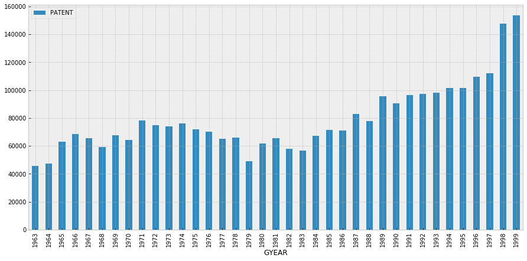
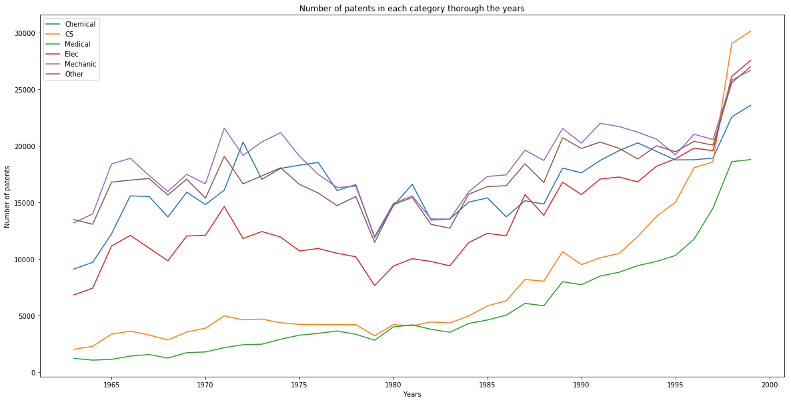
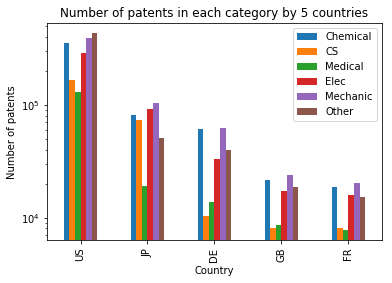
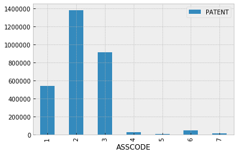

# The Cool Patent

## Data analysis

Now let's look at our dataset in more detailed way and try to answer some interesting questions.
* **Is there a trend for the number of patent grants during the years?**


```python
year_trend = df[['PATENT', 'GYEAR']]
year_trend = year_trend.groupby('GYEAR').count()
year_trend.head()
```


<div>
<style>
    .dataframe thead tr:only-child th {
        text-align: right;
    }

    .dataframe thead th {
        text-align: left;
    }

    .dataframe tbody tr th {
        vertical-align: top;
    }
</style>
<table border="1" class="dataframe">
  <thead>
    <tr style="text-align: right;">
      <th></th>
      <th>PATENT</th>
    </tr>
    <tr>
      <th>GYEAR</th>
      <th></th>
    </tr>
  </thead>
  <tbody>
    <tr>
      <th>1963</th>
      <td>45679</td>
    </tr>
    <tr>
      <th>1964</th>
      <td>47375</td>
    </tr>
    <tr>
      <th>1965</th>
      <td>62857</td>
    </tr>
    <tr>
      <th>1966</th>
      <td>68405</td>
    </tr>
    <tr>
      <th>1967</th>
      <td>65652</td>
    </tr>
  </tbody>
</table>
</div>


```python
year_trend.plot.bar(figsize=(15,7))
```


    <matplotlib.axes._subplots.AxesSubplot at 0x138626c18>





We can see that the number of granted patents is constantly increasing through the years, except for the period from 1974-1983 when there was some decrease, probably caused by some events in the world.

* **Which countries have the most assigned patents?**


```python
country_trend = df[['PATENT', 'COUNTRY']]
country_trend = country_trend.groupby('COUNTRY').count()
country_trend.head()
```


<div>
<style>
    .dataframe thead tr:only-child th {
        text-align: right;
    }

    .dataframe thead th {
        text-align: left;
    }

    .dataframe tbody tr th {
        vertical-align: top;
    }
</style>
<table border="1" class="dataframe">
  <thead>
    <tr style="text-align: right;">
      <th></th>
      <th>PATENT</th>
    </tr>
    <tr>
      <th>COUNTRY</th>
      <th></th>
    </tr>
  </thead>
  <tbody>
    <tr>
      <th>AD</th>
      <td>6</td>
    </tr>
    <tr>
      <th>AE</th>
      <td>18</td>
    </tr>
    <tr>
      <th>AG</th>
      <td>9</td>
    </tr>
    <tr>
      <th>AI</th>
      <td>1</td>
    </tr>
    <tr>
      <th>AL</th>
      <td>1</td>
    </tr>
  </tbody>
</table>
</div>


```python
country_trend2 = country_trend.merge(countries, left_index=True, right_on='Code').set_index('Code')
country_trend2.sort_values(by=['PATENT'], ascending=False).head(15)
```


<div>
<style>
    .dataframe thead tr:only-child th {
        text-align: right;
    }

    .dataframe thead th {
        text-align: left;
    }

    .dataframe tbody tr th {
        vertical-align: top;
    }
</style>
<table border="1" class="dataframe">
  <thead>
    <tr style="text-align: right;">
      <th></th>
      <th>PATENT</th>
      <th>Country</th>
    </tr>
    <tr>
      <th>Code</th>
      <th></th>
      <th></th>
    </tr>
  </thead>
  <tbody>
    <tr>
      <th>US</th>
      <td>1784989</td>
      <td>UNITED STATES</td>
    </tr>
    <tr>
      <th>JP</th>
      <td>421441</td>
      <td>JAPAN</td>
    </tr>
    <tr>
      <th>DE</th>
      <td>221095</td>
      <td>GERMANY</td>
    </tr>
    <tr>
      <th>GB</th>
      <td>98012</td>
      <td>UNITED KINGDOM</td>
    </tr>
    <tr>
      <th>FR</th>
      <td>85398</td>
      <td>FRANCE</td>
    </tr>
    <tr>
      <th>CA</th>
      <td>53872</td>
      <td>CANADA</td>
    </tr>
    <tr>
      <th>CH</th>
      <td>43313</td>
      <td>SWITZERLAND</td>
    </tr>
    <tr>
      <th>IT</th>
      <td>32433</td>
      <td>ITALY</td>
    </tr>
    <tr>
      <th>SE</th>
      <td>28286</td>
      <td>SWEDEN</td>
    </tr>
    <tr>
      <th>NL</th>
      <td>26687</td>
      <td>NETHERLANDS</td>
    </tr>
    <tr>
      <th>TW</th>
      <td>19979</td>
      <td>TAIWAN</td>
    </tr>
    <tr>
      <th>KR</th>
      <td>14855</td>
      <td>SOUTH KOREA</td>
    </tr>
    <tr>
      <th>AU</th>
      <td>11386</td>
      <td>AUSTRALIA</td>
    </tr>
    <tr>
      <th>BE</th>
      <td>10972</td>
      <td>BELGIUM</td>
    </tr>
    <tr>
      <th>AT</th>
      <td>10260</td>
      <td>AUSTRIA</td>
    </tr>
  </tbody>
</table>
</div>


```python
world = [52, 18] 
m = folium.Map(location=world, tiles='cartodbpositron', zoom_start=2)

countries_geo_path = 'data/countries.geo.json'
geo_json_data = json.load(open(countries_geo_path))

def get_color(value):
    if value < 1000:
        return '#fff0e6'
    elif value >= 1000 and value < 10000:
        return '#ffc299'
    elif value >= 10000 and value < 100000:
        return '#ff751a'
    elif value >= 100000 and value < 1000000:
        return '#993d00'
    elif value >= 1000000:
        return '#1a0a00'

patent_dict = country_trend2['PATENT']

folium.GeoJson(
    geo_json_data,
    name='Number of patents',
    style_function=lambda feature: {
        'fillColor': get_color(patent_dict[feature['id']]),
        'color': 'black',
        'weight': 1,
        'dashArray': '5, 5',
        'fillOpacity': 0.9,
    }
).add_to(m)

folium.LayerControl().add_to(m)
m
```


<div style="width:100%;"><div style="position:relative;width:100%;height:0;padding-bottom:60%;"><iframe src="data:text/html;charset=utf-8;base64,PCFET0NUWVBFIGh0bWw+CjxoZWFkPiAgICAKICAgIDxtZXRhIGh0dHAtZXF1aXY9ImNvbnRlbnQtdHlwZSIgY29udGVudD0idGV4dC9odG1sOyBjaGFyc2V0PVVURi04IiAvPgogICAgPHNjcmlwdD5MX1BSRUZFUl9DQU5WQVMgPSBmYWxzZTsgTF9OT19UT1VDSCA9IGZhbHNlOyBMX0RJU0FCTEVfM0QgPSBmYWxzZTs8L3NjcmlwdD4KICAgIDxzY3JpcHQgc3JjPSJodHRwczovL2Nkbi5qc2RlbGl2ci5uZXQvbnBtL2xlYWZsZXRAMS4yLjAvZGlzdC9sZWFmbGV0LmpzIj48L3NjcmlwdD4KICAgIDxzY3JpcHQgc3JjPSJodHRwczovL2FqYXguZ29vZ2xlYXBpcy5jb20vYWpheC9saWJzL2pxdWVyeS8xLjExLjEvanF1ZXJ5Lm1pbi5qcyI+PC9zY3JpcHQ+CiAgICA8c2NyaXB0IHNyYz0iaHR0cHM6Ly9tYXhjZG4uYm9vdHN0cmFwY2RuLmNvbS9ib290c3RyYXAvMy4yLjAvanMvYm9vdHN0cmFwLm1pbi5qcyI+PC9zY3JpcHQ+CiAgICA8c2NyaXB0IHNyYz0iaHR0cHM6Ly9jZG5qcy5jbG91ZGZsYXJlLmNvbS9hamF4L2xpYnMvTGVhZmxldC5hd2Vzb21lLW1hcmtlcnMvMi4wLjIvbGVhZmxldC5hd2Vzb21lLW1hcmtlcnMuanMiPjwvc2NyaXB0PgogICAgPGxpbmsgcmVsPSJzdHlsZXNoZWV0IiBocmVmPSJodHRwczovL2Nkbi5qc2RlbGl2ci5uZXQvbnBtL2xlYWZsZXRAMS4yLjAvZGlzdC9sZWFmbGV0LmNzcyIgLz4KICAgIDxsaW5rIHJlbD0ic3R5bGVzaGVldCIgaHJlZj0iaHR0cHM6Ly9tYXhjZG4uYm9vdHN0cmFwY2RuLmNvbS9ib290c3RyYXAvMy4yLjAvY3NzL2Jvb3RzdHJhcC5taW4uY3NzIiAvPgogICAgPGxpbmsgcmVsPSJzdHlsZXNoZWV0IiBocmVmPSJodHRwczovL21heGNkbi5ib290c3RyYXBjZG4uY29tL2Jvb3RzdHJhcC8zLjIuMC9jc3MvYm9vdHN0cmFwLXRoZW1lLm1pbi5jc3MiIC8+CiAgICA8bGluayByZWw9InN0eWxlc2hlZXQiIGhyZWY9Imh0dHBzOi8vbWF4Y2RuLmJvb3RzdHJhcGNkbi5jb20vZm9udC1hd2Vzb21lLzQuNi4zL2Nzcy9mb250LWF3ZXNvbWUubWluLmNzcyIgLz4KICAgIDxsaW5rIHJlbD0ic3R5bGVzaGVldCIgaHJlZj0iaHR0cHM6Ly9jZG5qcy5jbG91ZGZsYXJlLmNvbS9hamF4L2xpYnMvTGVhZmxldC5hd2Vzb21lLW1hcmtlcnMvMi4wLjIvbGVhZmxldC5hd2Vzb21lLW1hcmtlcnMuY3NzIiAvPgogICAgPGxpbmsgcmVsPSJzdHlsZXNoZWV0IiBocmVmPSJodHRwczovL3Jhd2dpdC5jb20vcHl0aG9uLXZpc3VhbGl6YXRpb24vZm9saXVtL21hc3Rlci9mb2xpdW0vdGVtcGxhdGVzL2xlYWZsZXQuYXdlc29tZS5yb3RhdGUuY3NzIiAvPgogICAgPHN0eWxlPmh0bWwsIGJvZHkge3dpZHRoOiAxMDAlO2hlaWdodDogMTAwJTttYXJnaW46IDA7cGFkZGluZzogMDt9PC9zdHlsZT4KICAgIDxzdHlsZT4jbWFwIHtwb3NpdGlvbjphYnNvbHV0ZTt0b3A6MDtib3R0b206MDtyaWdodDowO2xlZnQ6MDt9PC9zdHlsZT4KICAgIAogICAgICAgICAgICA8c3R5bGU+ICNtYXBfYTRkNDFlNjRmM2RiNGJmMWE1YmNiYzBkNWQxZWYzMTUgewogICAgICAgICAgICAgICAgcG9zaXRpb24gOiByZWxhdGl2ZTsKICAgICAgICAgICAgICAgIHdpZHRoIDogMTAwLjAlOwogICAgICAgICAgICAgICAgaGVpZ2h0OiAxMDAuMCU7CiAgICAgICAgICAgICAgICBsZWZ0OiAwLjAlOwogICAgICAgICAgICAgICAgdG9wOiAwLjAlOwogICAgICAgICAgICAgICAgfQogICAgICAgICAgICA8L3N0eWxlPgogICAgICAgIAo8L2hlYWQ+Cjxib2R5PiAgICAKICAgIAogICAgICAgICAgICA8ZGl2IGNsYXNzPSJmb2xpdW0tbWFwIiBpZD0ibWFwX2E0ZDQxZTY0ZjNkYjRiZjFhNWJjYmMwZDVkMWVmMzE1IiA+PC9kaXY+CiAgICAgICAgCjwvYm9keT4KPHNjcmlwdD4gICAgCiAgICAKCiAgICAgICAgICAgIAogICAgICAgICAgICAgICAgdmFyIGJvdW5kcyA9IG51bGw7CiAgICAgICAgICAgIAoKICAgICAgICAgICAgdmFyIG1hcF9hNGQ0MWU2NGYzZGI0YmYxYTViY2JjMGQ1ZDFlZjMxNSA9IEwubWFwKAogICAgICAgICAgICAgICAgICAgICAgICAgICAgICAgICAgJ21hcF9hNGQ0MWU2NGYzZGI0YmYxYTViY2JjMGQ1ZDFlZjMxNScsCiAgICAgICAgICAgICAgICAgICAgICAgICAgICAgICAgICB7Y2VudGVyOiBbNTIsMThdLAogICAgICAgICAgICAgICAgICAgICAgICAgICAgICAgICAgem9vbTogMiwKICAgICAgICAgICAgICAgICAgICAgICAgICAgICAgICAgIG1heEJvdW5kczogYm91bmRzLAogICAgICAgICAgICAgICAgICAgICAgICAgICAgICAgICAgbGF5ZXJzOiBbXSwKICAgICAgICAgICAgICAgICAgICAgICAgICAgICAgICAgIHdvcmxkQ29weUp1bXA6IGZhbHNlLAogICAgICAgICAgICAgICAgICAgICAgICAgICAgICAgICAgY3JzOiBMLkNSUy5FUFNHMzg1NwogICAgICAgICAgICAgICAgICAgICAgICAgICAgICAgICB9KTsKICAgICAgICAgICAgCiAgICAgICAgCiAgICAKICAgICAgICAgICAgdmFyIHRpbGVfbGF5ZXJfNjE5MjgwODcyM2Y0NGY0MTk5YjdkZDM2MWY4MGU0YTQgPSBMLnRpbGVMYXllcigKICAgICAgICAgICAgICAgICdodHRwczovL2NhcnRvZGItYmFzZW1hcHMte3N9Lmdsb2JhbC5zc2wuZmFzdGx5Lm5ldC9saWdodF9hbGwve3p9L3t4fS97eX0ucG5nJywKICAgICAgICAgICAgICAgIHsKICAiYXR0cmlidXRpb24iOiBudWxsLAogICJkZXRlY3RSZXRpbmEiOiBmYWxzZSwKICAibWF4Wm9vbSI6IDE4LAogICJtaW5ab29tIjogMSwKICAibm9XcmFwIjogZmFsc2UsCiAgInN1YmRvbWFpbnMiOiAiYWJjIgp9CiAgICAgICAgICAgICAgICApLmFkZFRvKG1hcF9hNGQ0MWU2NGYzZGI0YmYxYTViY2JjMGQ1ZDFlZjMxNSk7CiAgICAgICAgCiAgICAKCiAgICAgICAgICAgIAoKICAgICAgICAgICAgICAgIHZhciBnZW9fanNvbl8zZDkzZDM5ZWEyMDU0ODVjYjljMWRlN2JhZWQ4ZWUxMSA9IEwuZ2VvSnNvbigKICAgICAgICAgICAgICAgICAgICB7ImZlYXR1cmVzIjogW3siZ2VvbWV0cnkiOiB7ImNvb3JkaW5hdGVzIjogW1tbMjAuNTkwMjQ3LCA0MS44NTU0MDRdLCBbMjAuNDYzMTc1LCA0MS41MTUwODldLCBbMjAuNjA1MTgyLCA0MS4wODYyMjZdLCBbMjEuMDIwMDQsIDQwLjg0MjcyN10sIFsyMC45OTk5OSwgNDAuNTgwMDA0XSwgWzIwLjY3NDk5NywgNDAuNDM1XSwgWzIwLjYxNSwgNDAuMTEwMDA3XSwgWzIwLjE1MDAxNiwgMzkuNjI0OTk4XSwgWzE5Ljk4LCAzOS42OTQ5OTNdLCBbMTkuOTYwMDAyLCAzOS45MTUwMDZdLCBbMTkuNDA2MDgyLCA0MC4yNTA3NzNdLCBbMTkuMzE5MDU5LCA0MC43MjcyM10sIFsxOS40MDM1NSwgNDEuNDA5NTY2XSwgWzE5LjU0MDAyNywgNDEuNzE5OTg2XSwgWzE5LjM3MTc2OSwgNDEuODc3NTQ4XSwgWzE5LjMwNDQ4NiwgNDIuMTk1NzQ1XSwgWzE5LjczODA1MSwgNDIuNjg4MjQ3XSwgWzE5LjgwMTYxMywgNDIuNTAwMDkzXSwgWzIwLjA3MDcsIDQyLjU4ODYzXSwgWzIwLjI4Mzc1NSwgNDIuMzIwMjZdLCBbMjAuNTIyOTUsIDQyLjIxNzg3XSwgWzIwLjU5MDI0NywgNDEuODU1NDA0XV1dLCAidHlwZSI6ICJQb2x5Z29uIn0sICJpZCI6ICJBTCIsICJwcm9wZXJ0aWVzIjogeyJoaWdobGlnaHQiOiB7fSwgIm5hbWUiOiAiQWxiYW5pYSIsICJzdHlsZSI6IHsiY29sb3IiOiAiYmxhY2siLCAiZGFzaEFycmF5IjogIjUsIDUiLCAiZmlsbENvbG9yIjogIiNmZmYwZTYiLCAiZmlsbE9wYWNpdHkiOiAwLjksICJ3ZWlnaHQiOiAxfX0sICJ0eXBlIjogIkZlYXR1cmUifSwgeyJnZW9tZXRyeSI6IHsiY29vcmRpbmF0ZXMiOiBbW1s1MS41Nzk1MTksIDI0LjI0NTQ5N10sIFs1MS43NTc0NDEsIDI0LjI5NDA3M10sIFs1MS43OTQzODksIDI0LjAxOTgyNl0sIFs1Mi41NzcwODEsIDI0LjE3NzQzOV0sIFs1My40MDQwMDcsIDI0LjE1MTMxN10sIFs1NC4wMDgwMDEsIDI0LjEyMTc1OF0sIFs1NC42OTMwMjQsIDI0Ljc5Nzg5Ml0sIFs1NS40MzkwMjUsIDI1LjQzOTE0NV0sIFs1Ni4wNzA4MjEsIDI2LjA1NTQ2NF0sIFs1Ni4yNjEwNDIsIDI1LjcxNDYwNl0sIFs1Ni4zOTY4NDcsIDI0LjkyNDczMl0sIFs1NS44ODYyMzMsIDI0LjkyMDgzMV0sIFs1NS44MDQxMTksIDI0LjI2OTYwNF0sIFs1NS45ODEyMTQsIDI0LjEzMDU0M10sIFs1NS41Mjg2MzIsIDIzLjkzMzYwNF0sIFs1NS41MjU4NDEsIDIzLjUyNDg2OV0sIFs1NS4yMzQ0ODksIDIzLjExMDk5M10sIFs1NS4yMDgzNDEsIDIyLjcwODMzXSwgWzU1LjAwNjgwMywgMjIuNDk2OTQ4XSwgWzUyLjAwMDczMywgMjMuMDAxMTU0XSwgWzUxLjYxNzcwOCwgMjQuMDE0MjE5XSwgWzUxLjU3OTUxOSwgMjQuMjQ1NDk3XV1dLCAidHlwZSI6ICJQb2x5Z29uIn0sICJpZCI6ICJBRSIsICJwcm9wZXJ0aWVzIjogeyJoaWdobGlnaHQiOiB7fSwgIm5hbWUiOiAiVW5pdGVkIEFyYWIgRW1pcmF0ZXMiLCAic3R5bGUiOiB7ImNvbG9yIjogImJsYWNrIiwgImRhc2hBcnJheSI6ICI1LCA1IiwgImZpbGxDb2xvciI6ICIjZmZmMGU2IiwgImZpbGxPcGFjaXR5IjogMC45LCAid2VpZ2h0IjogMX19LCAidHlwZSI6ICJGZWF0dXJlIn0sIHsiZ2VvbWV0cnkiOiB7ImNvb3JkaW5hdGVzIjogW1tbWy02NS41LCAtNTUuMl0sIFstNjYuNDUsIC01NS4yNV0sIFstNjYuOTU5OTIsIC01NC44OTY4MV0sIFstNjcuNTYyNDQsIC01NC44NzAwMV0sIFstNjguNjMzMzUsIC01NC44Njk1XSwgWy02OC42MzQwMSwgLTUyLjYzNjM3XSwgWy02OC4yNSwgLTUzLjFdLCBbLTY3Ljc1LCAtNTMuODVdLCBbLTY2LjQ1LCAtNTQuNDVdLCBbLTY1LjA1LCAtNTQuN10sIFstNjUuNSwgLTU1LjJdXV0sIFtbWy02NC45NjQ4OTIsIC0yMi4wNzU4NjJdLCBbLTY0LjM3NzAyMSwgLTIyLjc5ODA5MV0sIFstNjMuOTg2ODM4LCAtMjEuOTkzNjQ0XSwgWy02Mi44NDY0NjgsIC0yMi4wMzQ5ODVdLCBbLTYyLjY4NTA1NywgLTIyLjI0OTAyOV0sIFstNjAuODQ2NTY1LCAtMjMuODgwNzEzXSwgWy02MC4wMjg5NjYsIC0yNC4wMzI3OTZdLCBbLTU4LjgwNzEyOCwgLTI0Ljc3MTQ1OV0sIFstNTcuNzc3MjE3LCAtMjUuMTYyMzRdLCBbLTU3LjYzMzY2LCAtMjUuNjAzNjU3XSwgWy01OC42MTgxNzQsIC0yNy4xMjM3MTldLCBbLTU3LjYwOTc2LCAtMjcuMzk1ODk5XSwgWy01Ni40ODY3MDIsIC0yNy41NDg0OTldLCBbLTU1LjY5NTg0NiwgLTI3LjM4NzgzN10sIFstNTQuNzg4Nzk1LCAtMjYuNjIxNzg2XSwgWy01NC42MjUyOTEsIC0yNS43MzkyNTVdLCBbLTU0LjEzMDA1LCAtMjUuNTQ3NjM5XSwgWy01My42MjgzNDksIC0yNi4xMjQ4NjVdLCBbLTUzLjY0ODczNSwgLTI2LjkyMzQ3M10sIFstNTQuNDkwNzI1LCAtMjcuNDc0NzU3XSwgWy01NS4xNjIyODYsIC0yNy44ODE5MTVdLCBbLTU2LjI5MDksIC0yOC44NTI3NjFdLCBbLTU3LjYyNTEzMywgLTMwLjIxNjI5NV0sIFstNTcuODc0OTM3LCAtMzEuMDE2NTU2XSwgWy01OC4xNDI0NCwgLTMyLjA0NDUwNF0sIFstNTguMTMyNjQ4LCAtMzMuMDQwNTY3XSwgWy01OC4zNDk2MTEsIC0zMy4yNjMxODldLCBbLTU4LjQyNzA3NCwgLTMzLjkwOTQ1NF0sIFstNTguNDk1NDQyLCAtMzQuNDMxNDldLCBbLTU3LjIyNTgzLCAtMzUuMjg4MDI3XSwgWy01Ny4zNjIzNTksIC0zNS45NzczOV0sIFstNTYuNzM3NDg3LCAtMzYuNDEzMTI2XSwgWy01Ni43ODgyODUsIC0zNi45MDE1NzJdLCBbLTU3Ljc0OTE1NywgLTM4LjE4Mzg3MV0sIFstNTkuMjMxODU3LCAtMzguNzIwMjJdLCBbLTYxLjIzNzQ0NSwgLTM4LjkyODQyNV0sIFstNjIuMzM1OTU3LCAtMzguODI3NzA3XSwgWy02Mi4xMjU3NjMsIC0zOS40MjQxMDVdLCBbLTYyLjMzMDUzMSwgLTQwLjE3MjU4Nl0sIFstNjIuMTQ1OTk0LCAtNDAuNjc2ODk3XSwgWy02Mi43NDU4MDMsIC00MS4wMjg3NjFdLCBbLTYzLjc3MDQ5NSwgLTQxLjE2Njc4OV0sIFstNjQuNzMyMDksIC00MC44MDI2NzddLCBbLTY1LjExODAzNSwgLTQxLjA2NDMxNV0sIFstNjQuOTc4NTYxLCAtNDIuMDU4MDAxXSwgWy02NC4zMDM0MDgsIC00Mi4zNTkwMTZdLCBbLTYzLjc1NTk0OCwgLTQyLjA0MzY4N10sIFstNjMuNDU4MDU5LCAtNDIuNTYzMTM4XSwgWy02NC4zNzg4MDQsIC00Mi44NzM1NThdLCBbLTY1LjE4MTgwNCwgLTQzLjQ5NTM4MV0sIFstNjUuMzI4ODIzLCAtNDQuNTAxMzY2XSwgWy02NS41NjUyNjksIC00NS4wMzY3ODZdLCBbLTY2LjUwOTk2NiwgLTQ1LjAzOTYyOF0sIFstNjcuMjkzNzk0LCAtNDUuNTUxODk2XSwgWy02Ny41ODA1NDYsIC00Ni4zMDE3NzNdLCBbLTY2LjU5NzA2NiwgLTQ3LjAzMzkyNV0sIFstNjUuNjQxMDI3LCAtNDcuMjM2MTM1XSwgWy02NS45ODUwODgsIC00OC4xMzMyODldLCBbLTY3LjE2NjE3OSwgLTQ4LjY5NzMzN10sIFstNjcuODE2MDg4LCAtNDkuODY5NjY5XSwgWy02OC43Mjg3NDUsIC01MC4yNjQyMThdLCBbLTY5LjEzODUzOSwgLTUwLjczMjUxXSwgWy02OC44MTU1NjEsIC01MS43NzExMDRdLCBbLTY4LjE0OTk5NSwgLTUyLjM0OTk4M10sIFstNjguNTcxNTQ1LCAtNTIuMjk5NDQ0XSwgWy02OS40OTgzNjIsIC01Mi4xNDI3NjFdLCBbLTcxLjkxNDgwNCwgLTUyLjAwOTAyMl0sIFstNzIuMzI5NDA0LCAtNTEuNDI1OTU2XSwgWy03Mi4zMDk5NzQsIC01MC42NzcwMV0sIFstNzIuOTc1NzQ3LCAtNTAuNzQxNDVdLCBbLTczLjMyODA1MSwgLTUwLjM3ODc4NV0sIFstNzMuNDE1NDM2LCAtNDkuMzE4NDM2XSwgWy03Mi42NDgyNDcsIC00OC44Nzg2MThdLCBbLTcyLjMzMTE2MSwgLTQ4LjI0NDIzOF0sIFstNzIuNDQ3MzU1LCAtNDcuNzM4NTMzXSwgWy03MS45MTcyNTgsIC00Ni44ODQ4MzhdLCBbLTcxLjU1MjAwOSwgLTQ1LjU2MDczM10sIFstNzEuNjU5MzE2LCAtNDQuOTczNjg5XSwgWy03MS4yMjI3NzksIC00NC43ODQyNDNdLCBbLTcxLjMyOTgwMSwgLTQ0LjQwNzUyMl0sIFstNzEuNzkzNjIzLCAtNDQuMjA3MTcyXSwgWy03MS40NjQwNTYsIC00My43ODc2MTFdLCBbLTcxLjkxNTQyNCwgLTQzLjQwODU2NV0sIFstNzIuMTQ4ODk4LCAtNDIuMjU0ODg4XSwgWy03MS43NDY4MDQsIC00Mi4wNTEzODZdLCBbLTcxLjkxNTczNCwgLTQwLjgzMjMzOV0sIFstNzEuNjgwNzYxLCAtMzkuODA4MTY0XSwgWy03MS40MTM1MTcsIC0zOC45MTYwMjJdLCBbLTcwLjgxNDY2NCwgLTM4LjU1Mjk5NV0sIFstNzEuMTE4NjI1LCAtMzcuNTc2ODI3XSwgWy03MS4xMjE4ODEsIC0zNi42NTgxMjRdLCBbLTcwLjM2NDc2OSwgLTM2LjAwNTA4OV0sIFstNzAuMzg4MDQ5LCAtMzUuMTY5Njg4XSwgWy02OS44MTczMDksIC0zNC4xOTM1NzFdLCBbLTY5LjgxNDc3NywgLTMzLjI3Mzg4Nl0sIFstNzAuMDc0Mzk5LCAtMzMuMDkxMjFdLCBbLTcwLjUzNTA2OSwgLTMxLjM2NTAxXSwgWy02OS45MTkwMDgsIC0zMC4zMzYzMzldLCBbLTcwLjAxMzU1LCAtMjkuMzY3OTIzXSwgWy02OS42NTYxMywgLTI4LjQ1OTE0MV0sIFstNjkuMDAxMjM1LCAtMjcuNTIxMjE0XSwgWy02OC4yOTU1NDIsIC0yNi44OTkzNF0sIFstNjguNTk0OCwgLTI2LjUwNjkwOV0sIFstNjguMzg2MDAxLCAtMjYuMTg1MDE2XSwgWy02OC40MTc2NTMsIC0yNC41MTg1NTVdLCBbLTY3LjMyODQ0MywgLTI0LjAyNTMwM10sIFstNjYuOTg1MjM0LCAtMjIuOTg2MzQ5XSwgWy02Ny4xMDY2NzQsIC0yMi43MzU5MjVdLCBbLTY2LjI3MzMzOSwgLTIxLjgzMjMxXSwgWy02NC45NjQ4OTIsIC0yMi4wNzU4NjJdXV1dLCAidHlwZSI6ICJNdWx0aVBvbHlnb24ifSwgImlkIjogIkFSIiwgInByb3BlcnRpZXMiOiB7ImhpZ2hsaWdodCI6IHt9LCAibmFtZSI6ICJBcmdlbnRpbmEiLCAic3R5bGUiOiB7ImNvbG9yIjogImJsYWNrIiwgImRhc2hBcnJheSI6ICI1LCA1IiwgImZpbGxDb2xvciI6ICIjZmZmMGU2IiwgImZpbGxPcGFjaXR5IjogMC45LCAid2VpZ2h0IjogMX19LCAidHlwZSI6ICJGZWF0dXJlIn0sIHsiZ2VvbWV0cnkiOiB7ImNvb3JkaW5hdGVzIjogW1tbNDMuNTgyNzQ2LCA0MS4wOTIxNDNdLCBbNDQuOTcyNDgsIDQxLjI0ODEyOV0sIFs0NS4xNzk0OTYsIDQwLjk4NTM1NF0sIFs0NS41NjAzNTEsIDQwLjgxMjI5XSwgWzQ1LjM1OTE3NSwgNDAuNTYxNTA0XSwgWzQ1Ljg5MTkwNywgNDAuMjE4NDc2XSwgWzQ1LjYxMDAxMiwgMzkuODk5OTk0XSwgWzQ2LjAzNDUzNCwgMzkuNjI4MDIxXSwgWzQ2LjQ4MzQ5OSwgMzkuNDY0MTU1XSwgWzQ2LjUwNTcyLCAzOC43NzA2MDVdLCBbNDYuMTQzNjIzLCAzOC43NDEyMDFdLCBbNDUuNzM1Mzc5LCAzOS4zMTk3MTldLCBbNDUuNzM5OTc4LCAzOS40NzM5OTldLCBbNDUuMjk4MTQ1LCAzOS40NzE3NTFdLCBbNDUuMDAxOTg3LCAzOS43NDAwMDRdLCBbNDQuNzkzOTksIDM5LjcxMzAwM10sIFs0NC40MDAwMDksIDQwLjAwNV0sIFs0My42NTY0MzYsIDQwLjI1MzU2NF0sIFs0My43NTI2NTgsIDQwLjc0MDIwMV0sIFs0My41ODI3NDYsIDQxLjA5MjE0M11dXSwgInR5cGUiOiAiUG9seWdvbiJ9LCAiaWQiOiAiQU0iLCAicHJvcGVydGllcyI6IHsiaGlnaGxpZ2h0Ijoge30sICJuYW1lIjogIkFybWVuaWEiLCAic3R5bGUiOiB7ImNvbG9yIjogImJsYWNrIiwgImRhc2hBcnJheSI6ICI1LCA1IiwgImZpbGxDb2xvciI6ICIjZmZmMGU2IiwgImZpbGxPcGFjaXR5IjogMC45LCAid2VpZ2h0IjogMX19LCAidHlwZSI6ICJGZWF0dXJlIn0sIHsiZ2VvbWV0cnkiOiB7ImNvb3JkaW5hdGVzIjogW1tbWzE0NS4zOTc5NzgsIC00MC43OTI1NDldLCBbMTQ2LjM2NDEyMSwgLTQxLjEzNzY5NV0sIFsxNDYuOTA4NTg0LCAtNDEuMDAwNTQ2XSwgWzE0Ny42ODkyNTksIC00MC44MDgyNThdLCBbMTQ4LjI4OTA2OCwgLTQwLjg3NTQzOF0sIFsxNDguMzU5ODY1LCAtNDIuMDYyNDQ1XSwgWzE0OC4wMTczMDEsIC00Mi40MDcwMjRdLCBbMTQ3LjkxNDA1MiwgLTQzLjIxMTUyMl0sIFsxNDcuNTY0NTY0LCAtNDIuOTM3Njg5XSwgWzE0Ni44NzAzNDMsIC00My42MzQ1OTddLCBbMTQ2LjY2MzMyNywgLTQzLjU4MDg1NF0sIFsxNDYuMDQ4Mzc4LCAtNDMuNTQ5NzQ1XSwgWzE0NS40MzE5MywgLTQyLjY5Mzc3Nl0sIFsxNDUuMjk1MDksIC00Mi4wMzM2MV0sIFsxNDQuNzE4MDcxLCAtNDEuMTYyNTUyXSwgWzE0NC43NDM3NTUsIC00MC43MDM5NzVdLCBbMTQ1LjM5Nzk3OCwgLTQwLjc5MjU0OV1dXSwgW1tbMTQzLjU2MTgxMSwgLTEzLjc2MzY1Nl0sIFsxNDMuOTIyMDk5LCAtMTQuNTQ4MzExXSwgWzE0NC41NjM3MTQsIC0xNC4xNzExNzZdLCBbMTQ0Ljg5NDkwOCwgLTE0LjU5NDQ1OF0sIFsxNDUuMzc0NzI0LCAtMTQuOTg0OTc2XSwgWzE0NS4yNzE5OTEsIC0xNS40MjgyMDVdLCBbMTQ1LjQ4NTI2LCAtMTYuMjg1NjcyXSwgWzE0NS42MzcwMzMsIC0xNi43ODQ5MThdLCBbMTQ1Ljg4ODkwNCwgLTE2LjkwNjkyNl0sIFsxNDYuMTYwMzA5LCAtMTcuNzYxNjU1XSwgWzE0Ni4wNjM2NzQsIC0xOC4yODAwNzNdLCBbMTQ2LjM4NzQ3OCwgLTE4Ljk1ODI3NF0sIFsxNDcuNDcxMDgyLCAtMTkuNDgwNzIzXSwgWzE0OC4xNzc2MDIsIC0xOS45NTU5MzldLCBbMTQ4Ljg0ODQxNCwgLTIwLjM5MTIxXSwgWzE0OC43MTc0NjUsIC0yMC42MzM0NjldLCBbMTQ5LjI4OTQyLCAtMjEuMjYwNTExXSwgWzE0OS42NzgzMzcsIC0yMi4zNDI1MTJdLCBbMTUwLjA3NzM4MiwgLTIyLjEyMjc4NF0sIFsxNTAuNDgyOTM5LCAtMjIuNTU2MTQyXSwgWzE1MC43MjcyNjUsIC0yMi40MDI0MDVdLCBbMTUwLjg5OTU1NCwgLTIzLjQ2MjIzN10sIFsxNTEuNjA5MTc1LCAtMjQuMDc2MjU2XSwgWzE1Mi4wNzM1NCwgLTI0LjQ1Nzg4N10sIFsxNTIuODU1MTk3LCAtMjUuMjY3NTAxXSwgWzE1My4xMzYxNjIsIC0yNi4wNzExNzNdLCBbMTUzLjE2MTk0OSwgLTI2LjY0MTMxOV0sIFsxNTMuMDkyOTA5LCAtMjcuMjYwM10sIFsxNTMuNTY5NDY5LCAtMjguMTEwMDY3XSwgWzE1My41MTIxMDgsIC0yOC45OTUwNzddLCBbMTUzLjMzOTA5NSwgLTI5LjQ1ODIwMl0sIFsxNTMuMDY5MjQxLCAtMzAuMzUwMjRdLCBbMTUzLjA4OTYwMiwgLTMwLjkyMzY0Ml0sIFsxNTIuODkxNTc4LCAtMzEuNjQwNDQ2XSwgWzE1Mi40NTAwMDIsIC0zMi41NTAwMDNdLCBbMTUxLjcwOTExNywgLTMzLjA0MTM0Ml0sIFsxNTEuMzQzOTcyLCAtMzMuODE2MDIzXSwgWzE1MS4wMTA1NTUsIC0zNC4zMTAzNl0sIFsxNTAuNzE0MTM5LCAtMzUuMTczNDZdLCBbMTUwLjMyODIyLCAtMzUuNjcxODc5XSwgWzE1MC4wNzUyMTIsIC0zNi40MjAyMDZdLCBbMTQ5Ljk0NjEyNCwgLTM3LjEwOTA1Ml0sIFsxNDkuOTk3Mjg0LCAtMzcuNDI1MjYxXSwgWzE0OS40MjM4ODIsIC0zNy43NzI2ODFdLCBbMTQ4LjMwNDYyMiwgLTM3LjgwOTA2MV0sIFsxNDcuMzgxNzMzLCAtMzguMjE5MjE3XSwgWzE0Ni45MjIxMjMsIC0zOC42MDY1MzJdLCBbMTQ2LjMxNzkyMiwgLTM5LjAzNTc1N10sIFsxNDUuNDg5NjUyLCAtMzguNTkzNzY4XSwgWzE0NC44NzY5NzYsIC0zOC40MTc0NDhdLCBbMTQ1LjAzMjIxMiwgLTM3Ljg5NjE4OF0sIFsxNDQuNDg1NjgyLCAtMzguMDg1MzI0XSwgWzE0My42MDk5NzQsIC0zOC44MDk0NjVdLCBbMTQyLjc0NTQyNywgLTM4LjUzODI2OF0sIFsxNDIuMTc4MzMsIC0zOC4zODAwMzRdLCBbMTQxLjYwNjU4MiwgLTM4LjMwODUxNF0sIFsxNDAuNjM4NTc5LCAtMzguMDE5MzMzXSwgWzEzOS45OTIxNTgsIC0zNy40MDI5MzZdLCBbMTM5LjgwNjU4OCwgLTM2LjY0MzYwM10sIFsxMzkuNTc0MTQ4LCAtMzYuMTM4MzYyXSwgWzEzOS4wODI4MDgsIC0zNS43MzI3NTRdLCBbMTM4LjEyMDc0OCwgLTM1LjYxMjI5Nl0sIFsxMzguNDQ5NDYyLCAtMzUuMTI3MjYxXSwgWzEzOC4yMDc1NjQsIC0zNC4zODQ3MjNdLCBbMTM3LjcxOTE3LCAtMzUuMDc2ODI1XSwgWzEzNi44Mjk0MDYsIC0zNS4yNjA1MzVdLCBbMTM3LjM1MjM3MSwgLTM0LjcwNzMzOV0sIFsxMzcuNTAzODg2LCAtMzQuMTMwMjY4XSwgWzEzNy44OTAxMTYsIC0zMy42NDA0NzldLCBbMTM3LjgxMDMyOCwgLTMyLjkwMDAwN10sIFsxMzYuOTk2ODM3LCAtMzMuNzUyNzcxXSwgWzEzNi4zNzIwNjksIC0zNC4wOTQ3NjZdLCBbMTM1Ljk4OTA0MywgLTM0Ljg5MDExOF0sIFsxMzUuMjA4MjEzLCAtMzQuNDc4NjddLCBbMTM1LjIzOTIxOCwgLTMzLjk0Nzk1M10sIFsxMzQuNjEzNDE3LCAtMzMuMjIyNzc4XSwgWzEzNC4wODU5MDQsIC0zMi44NDgwNzJdLCBbMTM0LjI3MzkwMywgLTMyLjYxNzIzNF0sIFsxMzIuOTkwNzc3LCAtMzIuMDExMjI0XSwgWzEzMi4yODgwODEsIC0zMS45ODI2NDddLCBbMTMxLjMyNjMzMSwgLTMxLjQ5NTgwM10sIFsxMjkuNTM1Nzk0LCAtMzEuNTkwNDIzXSwgWzEyOC4yNDA5MzgsIC0zMS45NDg0ODldLCBbMTI3LjEwMjg2NywgLTMyLjI4MjI2N10sIFsxMjYuMTQ4NzE0LCAtMzIuMjE1OTY2XSwgWzEyNS4wODg2MjMsIC0zMi43Mjg3NTFdLCBbMTI0LjIyMTY0OCwgLTMyLjk1OTQ4N10sIFsxMjQuMDI4OTQ3LCAtMzMuNDgzODQ3XSwgWzEyMy42NTk2NjcsIC0zMy44OTAxNzldLCBbMTIyLjgxMTAzNiwgLTMzLjkxNDQ2N10sIFsxMjIuMTgzMDY0LCAtMzQuMDAzNDAyXSwgWzEyMS4yOTkxOTEsIC0zMy44MjEwMzZdLCBbMTIwLjU4MDI2OCwgLTMzLjkzMDE3N10sIFsxMTkuODkzNjk1LCAtMzMuOTc2MDY1XSwgWzExOS4yOTg4OTksIC0zNC41MDkzNjZdLCBbMTE5LjAwNzM0MSwgLTM0LjQ2NDE0OV0sIFsxMTguNTA1NzE4LCAtMzQuNzQ2ODE5XSwgWzExOC4wMjQ5NzIsIC0zNS4wNjQ3MzNdLCBbMTE3LjI5NTUwNywgLTM1LjAyNTQ1OV0sIFsxMTYuNjI1MTA5LCAtMzUuMDI1MDk3XSwgWzExNS41NjQzNDcsIC0zNC4zODY0MjhdLCBbMTE1LjAyNjgwOSwgLTM0LjE5NjUxN10sIFsxMTUuMDQ4NjE2LCAtMzMuNjIzNDI1XSwgWzExNS41NDUxMjMsIC0zMy40ODcyNThdLCBbMTE1LjcxNDY3NCwgLTMzLjI1OTU3Ml0sIFsxMTUuNjc5Mzc5LCAtMzIuOTAwMzY5XSwgWzExNS44MDE2NDUsIC0zMi4yMDUwNjJdLCBbMTE1LjY4OTYxMSwgLTMxLjYxMjQzN10sIFsxMTUuMTYwOTA5LCAtMzAuNjAxNTk0XSwgWzExNC45OTcwNDMsIC0zMC4wMzA3MjVdLCBbMTE1LjA0MDAzOCwgLTI5LjQ2MTA5NV0sIFsxMTQuNjQxOTc0LCAtMjguODEwMjMxXSwgWzExNC42MTY0OTgsIC0yOC41MTYzOTldLCBbMTE0LjE3MzU3OSwgLTI4LjExODA3N10sIFsxMTQuMDQ4ODg0LCAtMjcuMzM0NzY1XSwgWzExMy40Nzc0OTgsIC0yNi41NDMxMzRdLCBbMTEzLjMzODk1MywgLTI2LjExNjU0NV0sIFsxMTMuNzc4MzU4LCAtMjYuNTQ5MDI1XSwgWzExMy40NDA5NjIsIC0yNS42MjEyNzhdLCBbMTEzLjkzNjkwMSwgLTI1LjkxMTIzNV0sIFsxMTQuMjMyODUyLCAtMjYuMjk4NDQ2XSwgWzExNC4yMTYxNjEsIC0yNS43ODYyODFdLCBbMTEzLjcyMTI1NSwgLTI0Ljk5ODkzOV0sIFsxMTMuNjI1MzQ0LCAtMjQuNjgzOTcxXSwgWzExMy4zOTM1MjMsIC0yNC4zODQ3NjRdLCBbMTEzLjUwMjA0NCwgLTIzLjgwNjM1XSwgWzExMy43MDY5OTMsIC0yMy41NjAyMTVdLCBbMTEzLjg0MzQxOCwgLTIzLjA1OTk4N10sIFsxMTMuNzM2NTUyLCAtMjIuNDc1NDc1XSwgWzExNC4xNDk3NTYsIC0yMS43NTU4ODFdLCBbMTE0LjIyNTMwNywgLTIyLjUxNzQ4OF0sIFsxMTQuNjQ3NzYyLCAtMjEuODI5NTJdLCBbMTE1LjQ2MDE2NywgLTIxLjQ5NTE3M10sIFsxMTUuOTQ3MzczLCAtMjEuMDY4Njg4XSwgWzExNi43MTE2MTUsIC0yMC43MDE2ODJdLCBbMTE3LjE2NjMxNiwgLTIwLjYyMzU5OV0sIFsxMTcuNDQxNTQ1LCAtMjAuNzQ2ODk5XSwgWzExOC4yMjk1NTksIC0yMC4zNzQyMDhdLCBbMTE4LjgzNjA4NSwgLTIwLjI2MzMxMV0sIFsxMTguOTg3ODA3LCAtMjAuMDQ0MjAzXSwgWzExOS4yNTI0OTQsIC0xOS45NTI5NDJdLCBbMTE5LjgwNTIyNSwgLTE5Ljk3NjUwNl0sIFsxMjAuODU2MjIsIC0xOS42ODM3MDhdLCBbMTIxLjM5OTg1NiwgLTE5LjIzOTc1Nl0sIFsxMjEuNjU1MTM4LCAtMTguNzA1MzE4XSwgWzEyMi4yNDE2NjUsIC0xOC4xOTc2NDldLCBbMTIyLjI4NjYyNCwgLTE3Ljc5ODYwM10sIFsxMjIuMzEyNzcyLCAtMTcuMjU0OTY3XSwgWzEyMy4wMTI1NzQsIC0xNi40MDUyXSwgWzEyMy40MzM3ODksIC0xNy4yNjg1NThdLCBbMTIzLjg1OTM0NSwgLTE3LjA2OTAzNV0sIFsxMjMuNTAzMjQyLCAtMTYuNTk2NTA2XSwgWzEyMy44MTcwNzMsIC0xNi4xMTEzMTZdLCBbMTI0LjI1ODI4NywgLTE2LjMyNzk0NF0sIFsxMjQuMzc5NzI2LCAtMTUuNTY3MDZdLCBbMTI0LjkyNjE1MywgLTE1LjA3NTFdLCBbMTI1LjE2NzI3NSwgLTE0LjY4MDM5Nl0sIFsxMjUuNjcwMDg3LCAtMTQuNTEwMDddLCBbMTI1LjY4NTc5NiwgLTE0LjIzMDY1Nl0sIFsxMjYuMTI1MTQ5LCAtMTQuMzQ3MzQxXSwgWzEyNi4xNDI4MjMsIC0xNC4wOTU5ODddLCBbMTI2LjU4MjU4OSwgLTEzLjk1Mjc5MV0sIFsxMjcuMDY1ODY3LCAtMTMuODE3OTY4XSwgWzEyNy44MDQ2MzMsIC0xNC4yNzY5MDZdLCBbMTI4LjM1OTY5LCAtMTQuODY5MTddLCBbMTI4Ljk4NTU0MywgLTE0Ljg3NTk5MV0sIFsxMjkuNjIxNDczLCAtMTQuOTY5Nzg0XSwgWzEyOS40MDk2LCAtMTQuNDIwNjddLCBbMTI5Ljg4ODY0MSwgLTEzLjYxODcwM10sIFsxMzAuMzM5NDY2LCAtMTMuMzU3Mzc2XSwgWzEzMC4xODM1MDYsIC0xMy4xMDc1Ml0sIFsxMzAuNjE3Nzk1LCAtMTIuNTM2MzkyXSwgWzEzMS4yMjM0OTUsIC0xMi4xODM2NDldLCBbMTMxLjczNTA5MSwgLTEyLjMwMjQ1M10sIFsxMzIuNTc1Mjk4LCAtMTIuMTE0MDQxXSwgWzEzMi41NTcyMTIsIC0xMS42MDMwMTJdLCBbMTMxLjgyNDY5OCwgLTExLjI3Mzc4Ml0sIFsxMzIuMzU3MjI0LCAtMTEuMTI4NTE5XSwgWzEzMy4wMTk1NjEsIC0xMS4zNzY0MTFdLCBbMTMzLjU1MDg0NiwgLTExLjc4NjUxNV0sIFsxMzQuMzkzMDY4LCAtMTIuMDQyMzY1XSwgWzEzNC42Nzg2MzIsIC0xMS45NDExODNdLCBbMTM1LjI5ODQ5MSwgLTEyLjI0ODYwNl0sIFsxMzUuODgyNjkzLCAtMTEuOTYyMjY3XSwgWzEzNi4yNTgzODEsIC0xMi4wNDkzNDJdLCBbMTM2LjQ5MjQ3NSwgLTExLjg1NzIwOV0sIFsxMzYuOTUxNjIsIC0xMi4zNTE5NTldLCBbMTM2LjY4NTEyNSwgLTEyLjg4NzIyM10sIFsxMzYuMzA1NDA3LCAtMTMuMjkxMjNdLCBbMTM1Ljk2MTc1OCwgLTEzLjMyNDUwOV0sIFsxMzYuMDc3NjE3LCAtMTMuNzI0Mjc4XSwgWzEzNS43ODM4MzYsIC0xNC4yMjM5ODldLCBbMTM1LjQyODY2NCwgLTE0LjcxNTQzMl0sIFsxMzUuNTAwMTg0LCAtMTQuOTk3NzQxXSwgWzEzNi4yOTUxNzUsIC0xNS41NTAyNjVdLCBbMTM3LjA2NTM2LCAtMTUuODcwNzYyXSwgWzEzNy41ODA0NzEsIC0xNi4yMTUwODJdLCBbMTM4LjMwMzIxNywgLTE2LjgwNzYwNF0sIFsxMzguNTg1MTY0LCAtMTYuODA2NjIyXSwgWzEzOS4xMDg1NDMsIC0xNy4wNjI2NzldLCBbMTM5LjI2MDU3NSwgLTE3LjM3MTYwMV0sIFsxNDAuMjE1MjQ1LCAtMTcuNzEwODA1XSwgWzE0MC44NzU0NjMsIC0xNy4zNjkwNjldLCBbMTQxLjA3MTExLCAtMTYuODMyMDQ3XSwgWzE0MS4yNzQwOTUsIC0xNi4zODg4N10sIFsxNDEuMzk4MjIyLCAtMTUuODQwNTMyXSwgWzE0MS43MDIxODMsIC0xNS4wNDQ5MjFdLCBbMTQxLjU2MzM4LCAtMTQuNTYxMzMzXSwgWzE0MS42MzU1MiwgLTE0LjI3MDM5NV0sIFsxNDEuNTE5ODY5LCAtMTMuNjk4MDc4XSwgWzE0MS42NTA5MiwgLTEyLjk0NDY4OF0sIFsxNDEuODQyNjkxLCAtMTIuNzQxNTQ4XSwgWzE0MS42ODY5OSwgLTEyLjQwNzYxNF0sIFsxNDEuOTI4NjI5LCAtMTEuODc3NDY2XSwgWzE0Mi4xMTg0ODgsIC0xMS4zMjgwNDJdLCBbMTQyLjE0MzcwNiwgLTExLjA0MjczN10sIFsxNDIuNTE1MjYsIC0xMC42NjgxODZdLCBbMTQyLjc5NzMxLCAtMTEuMTU3MzU1XSwgWzE0Mi44NjY3NjMsIC0xMS43ODQ3MDddLCBbMTQzLjExNTk0NywgLTExLjkwNTYzXSwgWzE0My4xNTg2MzIsIC0xMi4zMjU2NTZdLCBbMTQzLjUyMjEyNCwgLTEyLjgzNDM1OF0sIFsxNDMuNTk3MTU4LCAtMTMuNDAwNDIyXSwgWzE0My41NjE4MTEsIC0xMy43NjM2NTZdXV1dLCAidHlwZSI6ICJNdWx0aVBvbHlnb24ifSwgImlkIjogIkFVIiwgInByb3BlcnRpZXMiOiB7ImhpZ2hsaWdodCI6IHt9LCAibmFtZSI6ICJBdXN0cmFsaWEiLCAic3R5bGUiOiB7ImNvbG9yIjogImJsYWNrIiwgImRhc2hBcnJheSI6ICI1LCA1IiwgImZpbGxDb2xvciI6ICIjZmY3NTFhIiwgImZpbGxPcGFjaXR5IjogMC45LCAid2VpZ2h0IjogMX19LCAidHlwZSI6ICJGZWF0dXJlIn0sIHsiZ2VvbWV0cnkiOiB7ImNvb3JkaW5hdGVzIjogW1tbMTYuOTc5NjY3LCA0OC4xMjM0OTddLCBbMTYuOTAzNzU0LCA0Ny43MTQ4NjZdLCBbMTYuMzQwNTg0LCA0Ny43MTI5MDJdLCBbMTYuNTM0MjY4LCA0Ny40OTYxNzFdLCBbMTYuMjAyMjk4LCA0Ni44NTIzODZdLCBbMTYuMDExNjY0LCA0Ni42ODM2MTFdLCBbMTUuMTM3MDkyLCA0Ni42NTg3MDNdLCBbMTQuNjMyNDcyLCA0Ni40MzE4MTddLCBbMTMuODA2NDc1LCA0Ni41MDkzMDZdLCBbMTIuMzc2NDg1LCA0Ni43Njc1NTldLCBbMTIuMTUzMDg4LCA0Ny4xMTUzOTNdLCBbMTEuMTY0ODI4LCA0Ni45NDE1NzldLCBbMTEuMDQ4NTU2LCA0Ni43NTEzNTldLCBbMTAuNDQyNzAxLCA0Ni44OTM1NDZdLCBbOS45MzI0NDgsIDQ2LjkyMDcyOF0sIFs5LjQ3OTk3LCA0Ny4xMDI4MV0sIFs5LjYzMjkzMiwgNDcuMzQ3NjAxXSwgWzkuNTk0MjI2LCA0Ny41MjUwNThdLCBbOS44OTYwNjgsIDQ3LjU4MDE5N10sIFsxMC40MDIwODQsIDQ3LjMwMjQ4OF0sIFsxMC41NDQ1MDQsIDQ3LjU2NjM5OV0sIFsxMS40MjY0MTQsIDQ3LjUyMzc2Nl0sIFsxMi4xNDEzNTcsIDQ3LjcwMzA4M10sIFsxMi42MjA3NiwgNDcuNjcyMzg4XSwgWzEyLjkzMjYyNywgNDcuNDY3NjQ2XSwgWzEzLjAyNTg1MSwgNDcuNjM3NTg0XSwgWzEyLjg4NDEwMywgNDguMjg5MTQ2XSwgWzEzLjI0MzM1NywgNDguNDE2MTE1XSwgWzEzLjU5NTk0NiwgNDguODc3MTcyXSwgWzE0LjMzODg5OCwgNDguNTU1MzA1XSwgWzE0LjkwMTQ0NywgNDguOTY0NDAyXSwgWzE1LjI1MzQxNiwgNDkuMDM5MDc0XSwgWzE2LjAyOTY0NywgNDguNzMzODk5XSwgWzE2LjQ5OTI4MywgNDguNzg1ODA4XSwgWzE2Ljk2MDI4OCwgNDguNTk2OTgyXSwgWzE2Ljg3OTk4MywgNDguNDcwMDEzXSwgWzE2Ljk3OTY2NywgNDguMTIzNDk3XV1dLCAidHlwZSI6ICJQb2x5Z29uIn0sICJpZCI6ICJBVCIsICJwcm9wZXJ0aWVzIjogeyJoaWdobGlnaHQiOiB7fSwgIm5hbWUiOiAiQXVzdHJpYSIsICJzdHlsZSI6IHsiY29sb3IiOiAiYmxhY2siLCAiZGFzaEFycmF5IjogIjUsIDUiLCAiZmlsbENvbG9yIjogIiNmZjc1MWEiLCAiZmlsbE9wYWNpdHkiOiAwLjksICJ3ZWlnaHQiOiAxfX0sICJ0eXBlIjogIkZlYXR1cmUifSwgeyJnZW9tZXRyeSI6IHsiY29vcmRpbmF0ZXMiOiBbW1tbNDUuMDAxOTg3LCAzOS43NDAwMDRdLCBbNDUuMjk4MTQ1LCAzOS40NzE3NTFdLCBbNDUuNzM5OTc4LCAzOS40NzM5OTldLCBbNDUuNzM1Mzc5LCAzOS4zMTk3MTldLCBbNDYuMTQzNjIzLCAzOC43NDEyMDFdLCBbNDUuNDU3NzIyLCAzOC44NzQxMzldLCBbNDQuOTUyNjg4LCAzOS4zMzU3NjVdLCBbNDQuNzkzOTksIDM5LjcxMzAwM10sIFs0NS4wMDE5ODcsIDM5Ljc0MDAwNF1dXSwgW1tbNDcuMzczMzE1LCA0MS4yMTk3MzJdLCBbNDcuODE1NjY2LCA0MS4xNTE0MTZdLCBbNDcuOTg3MjgzLCA0MS40MDU4MTldLCBbNDguNTg0MzUzLCA0MS44MDg4N10sIFs0OS4xMTAyNjQsIDQxLjI4MjI4N10sIFs0OS42MTg5MTUsIDQwLjU3MjkyNF0sIFs1MC4wODQ4MywgNDAuNTI2MTU3XSwgWzUwLjM5MjgyMSwgNDAuMjU2NTYxXSwgWzQ5LjU2OTIwMiwgNDAuMTc2MTAxXSwgWzQ5LjM5NTI1OSwgMzkuMzk5NDgyXSwgWzQ5LjIyMzIyOCwgMzkuMDQ5MjE5XSwgWzQ4Ljg1NjUzMiwgMzguODE1NDg2XSwgWzQ4Ljg4MzI0OSwgMzguMzIwMjQ1XSwgWzQ4LjYzNDM3NSwgMzguMjcwMzc4XSwgWzQ4LjAxMDc0NCwgMzguNzk0MDE1XSwgWzQ4LjM1NTUyOSwgMzkuMjg4NzY1XSwgWzQ4LjA2MDA5NSwgMzkuNTgyMjM1XSwgWzQ3LjY4NTA3OSwgMzkuNTA4MzY0XSwgWzQ2LjUwNTcyLCAzOC43NzA2MDVdLCBbNDYuNDgzNDk5LCAzOS40NjQxNTVdLCBbNDYuMDM0NTM0LCAzOS42MjgwMjFdLCBbNDUuNjEwMDEyLCAzOS44OTk5OTRdLCBbNDUuODkxOTA3LCA0MC4yMTg0NzZdLCBbNDUuMzU5MTc1LCA0MC41NjE1MDRdLCBbNDUuNTYwMzUxLCA0MC44MTIyOV0sIFs0NS4xNzk0OTYsIDQwLjk4NTM1NF0sIFs0NC45NzI0OCwgNDEuMjQ4MTI5XSwgWzQ1LjIxNzQyNiwgNDEuNDExNDUyXSwgWzQ1Ljk2MjYwMSwgNDEuMTIzODczXSwgWzQ2LjUwMTYzNywgNDEuMDY0NDQ1XSwgWzQ2LjYzNzkwOCwgNDEuMTgxNjczXSwgWzQ2LjE0NTQzMiwgNDEuNzIyODAyXSwgWzQ2LjQwNDk1MSwgNDEuODYwNjc1XSwgWzQ2LjY4NjA3MSwgNDEuODI3MTM3XSwgWzQ3LjM3MzMxNSwgNDEuMjE5NzMyXV1dXSwgInR5cGUiOiAiTXVsdGlQb2x5Z29uIn0sICJpZCI6ICJBWiIsICJwcm9wZXJ0aWVzIjogeyJoaWdobGlnaHQiOiB7fSwgIm5hbWUiOiAiQXplcmJhaWphbiIsICJzdHlsZSI6IHsiY29sb3IiOiAiYmxhY2siLCAiZGFzaEFycmF5IjogIjUsIDUiLCAiZmlsbENvbG9yIjogIiNmZmYwZTYiLCAiZmlsbE9wYWNpdHkiOiAwLjksICJ3ZWlnaHQiOiAxfX0sICJ0eXBlIjogIkZlYXR1cmUifSwgeyJnZW9tZXRyeSI6IHsiY29vcmRpbmF0ZXMiOiBbW1szLjMxNDk3MSwgNTEuMzQ1NzgxXSwgWzQuMDQ3MDcxLCA1MS4yNjcyNTldLCBbNC45NzM5OTEsIDUxLjQ3NTAyNF0sIFs1LjYwNjk3NiwgNTEuMDM3Mjk4XSwgWzYuMTU2NjU4LCA1MC44MDM3MjFdLCBbNi4wNDMwNzMsIDUwLjEyODA1Ml0sIFs1Ljc4MjQxNywgNTAuMDkwMzI4XSwgWzUuNjc0MDUyLCA0OS41Mjk0ODRdLCBbNC43OTkyMjIsIDQ5Ljk4NTM3M10sIFs0LjI4NjAyMywgNDkuOTA3NDk3XSwgWzMuNTg4MTg0LCA1MC4zNzg5OTJdLCBbMy4xMjMyNTIsIDUwLjc4MDM2M10sIFsyLjY1ODQyMiwgNTAuNzk2ODQ4XSwgWzIuNTEzNTczLCA1MS4xNDg1MDZdLCBbMy4zMTQ5NzEsIDUxLjM0NTc4MV1dXSwgInR5cGUiOiAiUG9seWdvbiJ9LCAiaWQiOiAiQkUiLCAicHJvcGVydGllcyI6IHsiaGlnaGxpZ2h0Ijoge30sICJuYW1lIjogIkJlbGdpdW0iLCAic3R5bGUiOiB7ImNvbG9yIjogImJsYWNrIiwgImRhc2hBcnJheSI6ICI1LCA1IiwgImZpbGxDb2xvciI6ICIjZmY3NTFhIiwgImZpbGxPcGFjaXR5IjogMC45LCAid2VpZ2h0IjogMX19LCAidHlwZSI6ICJGZWF0dXJlIn0sIHsiZ2VvbWV0cnkiOiB7ImNvb3JkaW5hdGVzIjogW1tbMjIuNjU3MTUsIDQ0LjIzNDkyM10sIFsyMi45NDQ4MzIsIDQzLjgyMzc4NV0sIFsyMy4zMzIzMDIsIDQzLjg5NzAxMV0sIFsyNC4xMDA2NzksIDQzLjc0MTA1MV0sIFsyNS41NjkyNzIsIDQzLjY4ODQ0NV0sIFsyNi4wNjUxNTksIDQzLjk0MzQ5NF0sIFsyNy4yNDI0LCA0NC4xNzU5ODZdLCBbMjcuOTcwMTA3LCA0My44MTI0NjhdLCBbMjguNTU4MDgxLCA0My43MDc0NjJdLCBbMjguMDM5MDk1LCA0My4yOTMxNzJdLCBbMjcuNjczODk4LCA0Mi41Nzc4OTJdLCBbMjcuOTk2NzIsIDQyLjAwNzM1OV0sIFsyNy4xMzU3MzksIDQyLjE0MTQ4NV0sIFsyNi4xMTcwNDIsIDQxLjgyNjkwNV0sIFsyNi4xMDYxMzgsIDQxLjMyODg5OV0sIFsyNS4xOTcyMDEsIDQxLjIzNDQ4Nl0sIFsyNC40OTI2NDUsIDQxLjU4Mzg5Nl0sIFsyMy42OTIwNzQsIDQxLjMwOTA4MV0sIFsyMi45NTIzNzcsIDQxLjMzNzk5NF0sIFsyMi44ODEzNzQsIDQxLjk5OTI5N10sIFsyMi4zODA1MjYsIDQyLjMyMDI2XSwgWzIyLjU0NTAxMiwgNDIuNDYxMzYyXSwgWzIyLjQzNjU5NSwgNDIuNTgwMzIxXSwgWzIyLjYwNDgwMSwgNDIuODk4NTE5XSwgWzIyLjk4NjAxOSwgNDMuMjExMTYxXSwgWzIyLjUwMDE1NywgNDMuNjQyODE0XSwgWzIyLjQxMDQ0NiwgNDQuMDA4MDYzXSwgWzIyLjY1NzE1LCA0NC4yMzQ5MjNdXV0sICJ0eXBlIjogIlBvbHlnb24ifSwgImlkIjogIkJHIiwgInByb3BlcnRpZXMiOiB7ImhpZ2hsaWdodCI6IHt9LCAibmFtZSI6ICJCdWxnYXJpYSIsICJzdHlsZSI6IHsiY29sb3IiOiAiYmxhY2siLCAiZGFzaEFycmF5IjogIjUsIDUiLCAiZmlsbENvbG9yIjogIiNmZmYwZTYiLCAiZmlsbE9wYWNpdHkiOiAwLjksICJ3ZWlnaHQiOiAxfX0sICJ0eXBlIjogIkZlYXR1cmUifSwgeyJnZW9tZXRyeSI6IHsiY29vcmRpbmF0ZXMiOiBbW1tbLTc3LjUzNDY2LCAyMy43NTk3NV0sIFstNzcuNzgsIDIzLjcxXSwgWy03OC4wMzQwNSwgMjQuMjg2MTVdLCBbLTc4LjQwODQ4LCAyNC41NzU2NF0sIFstNzguMTkwODcsIDI1LjIxMDNdLCBbLTc3Ljg5LCAyNS4xN10sIFstNzcuNTQsIDI0LjM0XSwgWy03Ny41MzQ2NiwgMjMuNzU5NzVdXV0sIFtbWy03Ny44MiwgMjYuNThdLCBbLTc4LjkxLCAyNi40Ml0sIFstNzguOTgsIDI2Ljc5XSwgWy03OC41MSwgMjYuODddLCBbLTc3Ljg1LCAyNi44NF0sIFstNzcuODIsIDI2LjU4XV1dLCBbW1stNzcsIDI2LjU5XSwgWy03Ny4xNzI1NSwgMjUuODc5MThdLCBbLTc3LjM1NjQxLCAyNi4wMDczNV0sIFstNzcuMzQsIDI2LjUzXSwgWy03Ny43ODgwMiwgMjYuOTI1MTZdLCBbLTc3Ljc5LCAyNy4wNF0sIFstNzcsIDI2LjU5XV1dXSwgInR5cGUiOiAiTXVsdGlQb2x5Z29uIn0sICJpZCI6ICJCUyIsICJwcm9wZXJ0aWVzIjogeyJoaWdobGlnaHQiOiB7fSwgIm5hbWUiOiAiVGhlIEJhaGFtYXMiLCAic3R5bGUiOiB7ImNvbG9yIjogImJsYWNrIiwgImRhc2hBcnJheSI6ICI1LCA1IiwgImZpbGxDb2xvciI6ICIjZmZmMGU2IiwgImZpbGxPcGFjaXR5IjogMC45LCAid2VpZ2h0IjogMX19LCAidHlwZSI6ICJGZWF0dXJlIn0sIHsiZ2VvbWV0cnkiOiB7ImNvb3JkaW5hdGVzIjogW1tbMjMuNDg0MTI4LCA1My45MTI0OThdLCBbMjQuNDUwNjg0LCA1My45MDU3MDJdLCBbMjUuNTM2MzU0LCA1NC4yODI0MjNdLCBbMjUuNzY4NDMzLCA1NC44NDY5NjNdLCBbMjYuNTg4Mjc5LCA1NS4xNjcxNzZdLCBbMjYuNDk0MzMxLCA1NS42MTUxMDddLCBbMjcuMTAyNDYsIDU1Ljc4MzMxNF0sIFsyOC4xNzY3MDksIDU2LjE2OTEzXSwgWzI5LjIyOTUxMywgNTUuOTE4MzQ0XSwgWzI5LjM3MTU3MiwgNTUuNjcwMDkxXSwgWzI5Ljg5NjI5NCwgNTUuNzg5NDYzXSwgWzMwLjg3MzkwOSwgNTUuNTUwOTc2XSwgWzMwLjk3MTgzNiwgNTUuMDgxNTQ4XSwgWzMwLjc1NzUzNCwgNTQuODExNzcxXSwgWzMxLjM4NDQ3MiwgNTQuMTU3MDU2XSwgWzMxLjc5MTQyNCwgNTMuOTc0NjM5XSwgWzMxLjczMTI3MywgNTMuNzk0MDI5XSwgWzMyLjQwNTU5OSwgNTMuNjE4MDQ1XSwgWzMyLjY5MzY0MywgNTMuMzUxNDIxXSwgWzMyLjMwNDUxOSwgNTMuMTMyNzI2XSwgWzMxLjQ5NzY0NCwgNTMuMTY3NDI3XSwgWzMxLjMwNTIwMSwgNTMuMDczOTk2XSwgWzMxLjU0MDAxOCwgNTIuNzQyMDUyXSwgWzMxLjc4NTk5OCwgNTIuMTAxNjc4XSwgWzMwLjkyNzU0OSwgNTIuMDQyMzUzXSwgWzMwLjYxOTQ1NCwgNTEuODIyODA2XSwgWzMwLjU1NTExNywgNTEuMzE5NTAzXSwgWzMwLjE1NzM2NCwgNTEuNDE2MTM4XSwgWzI5LjI1NDkzOCwgNTEuMzY4MjM0XSwgWzI4Ljk5MjgzNSwgNTEuNjAyMDQ0XSwgWzI4LjYxNzYxMywgNTEuNDI3NzE0XSwgWzI4LjI0MTYxNSwgNTEuNTcyMjI3XSwgWzI3LjQ1NDA2NiwgNTEuNTkyMzAzXSwgWzI2LjMzNzk1OSwgNTEuODMyMjg5XSwgWzI1LjMyNzc4OCwgNTEuOTEwNjU2XSwgWzI0LjU1MzEwNiwgNTEuODg4NDYxXSwgWzI0LjAwNTA3OCwgNTEuNjE3NDQ0XSwgWzIzLjUyNzA3MSwgNTEuNTc4NDU0XSwgWzIzLjUwODAwMiwgNTIuMDIzNjQ3XSwgWzIzLjE5OTQ5NCwgNTIuNDg2OTc3XSwgWzIzLjc5OTE5OSwgNTIuNjkxMDk5XSwgWzIzLjgwNDkzNSwgNTMuMDg5NzMxXSwgWzIzLjUyNzUzNiwgNTMuNDcwMTIyXSwgWzIzLjQ4NDEyOCwgNTMuOTEyNDk4XV1dLCAidHlwZSI6ICJQb2x5Z29uIn0sICJpZCI6ICJCWSIsICJwcm9wZXJ0aWVzIjogeyJoaWdobGlnaHQiOiB7fSwgIm5hbWUiOiAiQmVsYXJ1cyIsICJzdHlsZSI6IHsiY29sb3IiOiAiYmxhY2siLCAiZGFzaEFycmF5IjogIjUsIDUiLCAiZmlsbENvbG9yIjogIiNmZmYwZTYiLCAiZmlsbE9wYWNpdHkiOiAwLjksICJ3ZWlnaHQiOiAxfX0sICJ0eXBlIjogIkZlYXR1cmUifSwgeyJnZW9tZXRyeSI6IHsiY29vcmRpbmF0ZXMiOiBbW1stODkuMTQzMDgsIDE3LjgwODMxOV0sIFstODkuMTUwOTA5LCAxNy45NTU0NjhdLCBbLTg5LjAyOTg1NywgMTguMDAxNTExXSwgWy04OC44NDgzNDQsIDE3Ljg4MzE5OF0sIFstODguNDkwMTIzLCAxOC40ODY4MzFdLCBbLTg4LjMwMDAzMSwgMTguNDk5OTgyXSwgWy04OC4yOTYzMzYsIDE4LjM1MzI3M10sIFstODguMTA2ODEzLCAxOC4zNDg2NzRdLCBbLTg4LjEyMzQ3OSwgMTguMDc2Njc1XSwgWy04OC4yODUzNTUsIDE3LjY0NDE0M10sIFstODguMTk3ODY3LCAxNy40ODk0NzVdLCBbLTg4LjMwMjY0MSwgMTcuMTMxNjk0XSwgWy04OC4yMzk1MTgsIDE3LjAzNjA2Nl0sIFstODguMzU1NDI4LCAxNi41MzA3NzRdLCBbLTg4LjU1MTgyNSwgMTYuMjY1NDY3XSwgWy04OC43MzI0MzQsIDE2LjIzMzYzNV0sIFstODguOTMwNjEzLCAxNS44ODcyNzNdLCBbLTg5LjIyOTEyMiwgMTUuODg2OTM4XSwgWy04OS4xNTA4MDYsIDE3LjAxNTU3N10sIFstODkuMTQzMDgsIDE3LjgwODMxOV1dXSwgInR5cGUiOiAiUG9seWdvbiJ9LCAiaWQiOiAiQloiLCAicHJvcGVydGllcyI6IHsiaGlnaGxpZ2h0Ijoge30sICJuYW1lIjogIkJlbGl6ZSIsICJzdHlsZSI6IHsiY29sb3IiOiAiYmxhY2siLCAiZGFzaEFycmF5IjogIjUsIDUiLCAiZmlsbENvbG9yIjogIiNmZmYwZTYiLCAiZmlsbE9wYWNpdHkiOiAwLjksICJ3ZWlnaHQiOiAxfX0sICJ0eXBlIjogIkZlYXR1cmUifSwgeyJnZW9tZXRyeSI6IHsiY29vcmRpbmF0ZXMiOiBbW1stNjQuNzc5OTczNDMzMjk5OCwgMzIuMzA3MjAwMDU4MTgwMl0sIFstNjQuNzg3MzMxOTE4MzA2MSwgMzIuMzAzOTIzNzE0MzQyOF0sIFstNjQuNzk0Njk0MjcxMDE3MywgMzIuMzAzMjY4MjcwMDM4OF0sIFstNjQuODA5NDI5Nzk4MTI4MywgMzIuMzA5ODE3NTcyODQxNF0sIFstNjQuODE2Nzg5NjM1MjQzNywgMzIuMzA1ODg0NTcxODQ2Nl0sIFstNjQuODEwMTk2ODAyOTY0MiwgMzIuMzAyMjgzMzE4MDUxMV0sIFstNjQuNzk2MjI5MTQ2NTQ4NCwgMzIuMjkzNDQwOTczMjQyN10sIFstNjQuNzgxNTA4NjMzNjk3OCwgMzIuMjg2ODk3MzExNDUxNF0sIFstNjQuNzk5NzAyNTUxMzQzNywgMzIuMjc5Njg5NjQxNzMyOF0sIFstNjQuODA2NjcwNzY5MTA4NywgMzIuMjc0Nzc2NzU2OTQ2NV0sIFstNjQuODIyNTU4Nzg3MzY4MywgMzIuMjY2OTExMTI4OTM5NV0sIFstNjQuODI4NzU0ODg0MDMwNiwgMzIuMjY2OTA3NTQ3MzgxN10sIFstNjQuODMwNjczMjE0MzQ5OCwgMzIuMjU4Mzk0NDg0MDIzNV0sIFstNjQuODM5OTkyNDg1NDk3MiwgMzIuMjU0NzgyMjgyMzM2XSwgWy02NC44NTY2MDkwNDYyMzU0LCAzMi4yNTQ3NzQwMzg3NTE0XSwgWy02NC44NjgyMjk2Nzg5NDQ2LCAzMi4yNjE2MzkzNjE0MzIyXSwgWy02NC44NjI4MjQxNDU5NTYzLCAzMi4yNzI0NDgxOTMzOTU5XSwgWy02NC44NzQ4NjUxMzM4OTUxLCAzMi4yNzU3MTIwMjY0NzUzXSwgWy02NC44NzE3NzUyODU2NjQ0LCAzMi4yODE5MzcxNTgyMDI2XSwgWy02NC44NjcxNDIyMTI3Mjk1LCAzMi4yOTMwNzYwNTQ3OTg5XSwgWy02NC44NTU5MDY4NzY0NDM3LCAzMi4yOTYwMzIxMTg2NDcxXSwgWy02NC44NTk3NDI5MDcyMjc5LCAzMi4zMDE1ODQyMDIxOTMzXSwgWy02NC44NDM5MjMzNDg2NzE3LCAzMi4zMTQwNTUzODUyNTQzXSwgWy02NC44MzUwMjQyMzI5MzExLCAzMi4zMjQyMTYxNzYwMDA2XSwgWy02NC44MzM4NjkwNTkzNjcyLCAzMi4zMjk0NTg3NTYxNTU3XSwgWy02NC44NTIwMjk4NjUxMTY0LCAzMi4zMTEwOTExODc5OTU0XSwgWy02NC44NjM1OTIyOTMyNTczLCAzMi4zMDQ4NDY5NDMzMzYzXSwgWy02NC44Njg2NjY4OTk0MDc5LCAzMi4zMDkxMDc0NTA4M10sIFstNjQuODcyMTM1NDU5MzQxNSwgMzIuMzA0MTkwODYwNjMwMV0sIFstNjQuODc3OTY2NzMyODQ4NSwgMzIuMzAzODYzMjgwMDQ2Ml0sIFstNjQuODc4MDA0Njg0NDMyMSwgMzIuMjkwNzc1NzgzMTY5Ml0sIFstNjQuODg0OTc3NjY1ODI5MiwgMzIuMjgxOTI2MTM2NjAwNF0sIFstNjQuODc4MzIzMDAwNDYyOSwgMzIuMjYxMzAwMTQxODY4MV0sIFstNjQuODYzMTk0OTY4ODc3LCAzMi4yNDY1Nzk5NDg1ODAxXSwgWy02NC44NTE5ODE5NTU1NzIyLCAzMi4yNDg1NTE5MTM0NjYzXSwgWy02NC44NDIzMTE5ODAwNzQsIDMyLjI0OTIxMjMzMTcyOTZdLCBbLTY0LjgzODgyNDI2MDUyMDksIDMyLjI0NzU3NzM0NzI1MzRdLCBbLTY0LjgzMzQwMDI1NzU1MzIsIDMyLjI0NjI3MTQ3MTQ2OThdLCBbLTY0LjgyNTYzODk1MzA1ODQsIDMyLjI0NzI2MzczOTg1OTRdLCBbLTY0LjgyMDU2OTc1NTYwMjYsIDMyLjI1MzE2OTg4ODAzMjhdLCBbLTY0LjgxMDUwODcyNzU1NzksIDMyLjI1NjEyMDg5NzQxNTZdLCBbLTY0Ljc5MDAxNzc3MjczMzgsIDMyLjI2NTk0NDY5MzY5OTJdLCBbLTY0Ljc3NDU0MTU5NzA0MTYsIDMyLjI3MTg0MTMwMjM0MjddLCBbLTY0Ljc2NDQ3NDI0MzY0MjYsIDMyLjI4NTU5MzEzNTMyMTRdLCBbLTY0Ljc1NTE4MDM0NDIyNzYsIDMyLjI5MDgzMjY3MDI1MzFdLCBbLTY0Ljc0MjM5ODI5NzE0MzYsIDMyLjI5OTY3MzQ5OTQwMjRdLCBbLTY0LjcyMDY5OTE3OTc2ODIsIDMyLjMxMzc1NDIyMDEyNThdLCBbLTY0LjcxMTc4NTEyNDcxMzQsIDMyLjMxNzY4MjMzNjA4MDZdLCBbLTY0LjY5NjI3Nzg4MTMxMzMsIDMyLjMyNzUwMjkxMTU1MzJdLCBbLTY0LjY3Njg5MjExMjc0NTIsIDMyLjMzMjQwOTUzOTc1NTVdLCBbLTY0LjY1NjcxMzY5Mjc3NzcsIDMyLjM0NTE3NzY0NTg0NjldLCBbLTY0LjY1MzIxNjg4MjM0OTksIDMyLjM0OTQzNTY2Mjc5NDFdLCBbLTY0LjY2MDU3MjAzODQ0MjksIDMyLjM1ODk0MjM0ODc3NjNdLCBbLTY0LjY1MTI1ODE5NDcxLCAzMi4zNjE1NjAwOTA2NDY2XSwgWy02NC42NDYyMDExNjcwODE2LCAzMi4zNjk3NTE2OTc0OV0sIFstNjQuNjYxMzIyNzUxMjgzMiwgMzIuMzc2MzEzNTAwODcyMV0sIFstNjQuNjY5MDY2NjA3NDM5NywgMzIuMzg4NDQ0NTQzOTI0XSwgWy02NC42ODM0MjcwNTQ4NTk1LCAzMi4zODU0OTY4MzE2Nzg4XSwgWy02NC42OTU0NjE3NjcyNzE0LCAzMi4zNzYzMjIxMjg1ODY5XSwgWy02NC43MDQzODY4OTU2NSwgMzIuMzcwNDI1NDc2MDQ2OV0sIFstNjQuNzExNzU2OTk4Mjc5OCwgMzIuMzY4MTMyNjAwMjQ5XSwgWy02NC43MDYxNzY0NzQ0NDA0LCAzMi4zNjAwMTEwNTkzNTU5XSwgWy02NC43MDA1MzE1NTI2OTcsIDMyLjM1OTA2MDEzNTY4MThdLCBbLTY0LjY5NDAzNDgwMzM5NjcsIDMyLjM2NDA3MDg2NTk4MzVdLCBbLTY0LjY4OTUxNjQ4MjYwODIsIDMyLjM2MzM1OTg1Nzk4NjZdLCBbLTY0LjY4NjQxNTAwOTkyNTUsIDMyLjM1NDc3OTc1ODcyNjZdLCBbLTY0LjY4MjQ2MzU5OTU1MDQsIDMyLjM1NDA2MjgxNzY4NDZdLCBbLTY0LjY4MzU4NzY2NTI4MzUsIDMyLjM2MjY0NDc2Nzc5NjhdLCBbLTY0LjY4MDE5OTg2OTc0MTUsIDMyLjM2MzExOTkwOTY5NzldLCBbLTY0LjY2NzIxNzA0NDQ2ODcsIDMyLjM1OTc3NTE2MTc0NzNdLCBbLTY0LjY1OTg4MTEyNjQ5NzgsIDMyLjM0OTc2MjU3NzE3NTVdLCBbLTY0LjY3MzczMzEyMzUzODQsIDMyLjMzOTAyODE4NTE2MzVdLCBbLTY0LjY4ODcwOTA2NDgxODMsIDMyLjMzNDI0Mzk0MDgwNTNdLCBbLTY0LjcwNjczMjg1NDQ0NiwgMzIuMzQyOTAxMDcyMzAzNl0sIFstNjQuNzE0OTMwMTU3NjExMiwgMzIuMzU1MjE4ODc1MzUxM10sIFstNjQuNzE4NTk2NzY2NjY2OSwgMzIuMzU1MjIzOTIxMjM5NF0sIFstNjQuNzIxNDE4OTg0NzMxNCwgMzIuMzUxODgzMDIzMTM0Ml0sIFstNjQuNzI3MDYxNjA2NzIyMiwgMzIuMzQ2NjQ2MTcxNTQ3NV0sIFstNjQuNzM0OTYyNDYwODgyLCAzMi4zNDQyODE5ODMwNDk5XSwgWy02NC43MzgzNTIxNTQ5MDk0LCAzMi4zNDA3MjE2NTE0OTE4XSwgWy02NC43NDExNzI5OTc2MzMzLCAzMi4zMzExNzkwODY0NjI3XSwgWy02NC43NDIzMDE5MjE2NDg1LCAzMi4zMjMzMTE1NjEyMTNdLCBbLTY0Ljc0NjI0ODIzNTQyODEsIDMyLjMxODUzODYxMTU4MV0sIFstNjQuNzU2Njc3MzczOTYxMywgMzIuMzEzMDUwOTEzMDE3NV0sIFstNjQuNzY4NzM4MjAwNTYzLCAzMi4zMDg4MzY5ODE2NTcyXSwgWy02NC43Nzk5NzM0MzMyOTk4LCAzMi4zMDcyMDAwNTgxODAyXV1dLCAidHlwZSI6ICJQb2x5Z29uIn0sICJpZCI6ICJCTSIsICJwcm9wZXJ0aWVzIjogeyJoaWdobGlnaHQiOiB7fSwgIm5hbWUiOiAiQmVybXVkYSIsICJzdHlsZSI6IHsiY29sb3IiOiAiYmxhY2siLCAiZGFzaEFycmF5IjogIjUsIDUiLCAiZmlsbENvbG9yIjogIiNmZmYwZTYiLCAiZmlsbE9wYWNpdHkiOiAwLjksICJ3ZWlnaHQiOiAxfX0sICJ0eXBlIjogIkZlYXR1cmUifSwgeyJnZW9tZXRyeSI6IHsiY29vcmRpbmF0ZXMiOiBbW1stNjIuODQ2NDY4LCAtMjIuMDM0OTg1XSwgWy02My45ODY4MzgsIC0yMS45OTM2NDRdLCBbLTY0LjM3NzAyMSwgLTIyLjc5ODA5MV0sIFstNjQuOTY0ODkyLCAtMjIuMDc1ODYyXSwgWy02Ni4yNzMzMzksIC0yMS44MzIzMV0sIFstNjcuMTA2Njc0LCAtMjIuNzM1OTI1XSwgWy02Ny44MjgxOCwgLTIyLjg3MjkxOV0sIFstNjguMjE5OTEzLCAtMjEuNDk0MzQ3XSwgWy02OC43NTcxNjcsIC0yMC4zNzI2NThdLCBbLTY4LjQ0MjIyNSwgLTE5LjQwNTA2OF0sIFstNjguOTY2ODE4LCAtMTguOTgxNjgzXSwgWy02OS4xMDAyNDcsIC0xOC4yNjAxMjVdLCBbLTY5LjU5MDQyNCwgLTE3LjU4MDAxMl0sIFstNjguOTU5NjM1LCAtMTYuNTAwNjk4XSwgWy02OS4zODk3NjQsIC0xNS42NjAxMjldLCBbLTY5LjE2MDM0NywgLTE1LjMyMzk3NF0sIFstNjkuMzM5NTM1LCAtMTQuOTUzMTk1XSwgWy02OC45NDg4ODcsIC0xNC40NTM2MzldLCBbLTY4LjkyOTIyNCwgLTEzLjYwMjY4NF0sIFstNjguODgwMDgsIC0xMi44OTk3MjldLCBbLTY4LjY2NTA4LCAtMTIuNTYxM10sIFstNjkuNTI5Njc4LCAtMTAuOTUxNzM0XSwgWy02OC43ODYxNTgsIC0xMS4wMzYzOF0sIFstNjguMjcxMjU0LCAtMTEuMDE0NTIxXSwgWy02OC4wNDgxOTIsIC0xMC43MTIwNTldLCBbLTY3LjE3MzgwMSwgLTEwLjMwNjgxMl0sIFstNjYuNjQ2OTA4LCAtOS45MzEzMzFdLCBbLTY1LjMzODQzNSwgLTkuNzYxOTg4XSwgWy02NS40NDQ4MzcsIC0xMC41MTE0NTFdLCBbLTY1LjMyMTg5OSwgLTEwLjg5NTg3Ml0sIFstNjUuNDAyMjgxLCAtMTEuNTY2MjddLCBbLTY0LjMxNjM1MywgLTEyLjQ2MTk3OF0sIFstNjMuMTk2NDk5LCAtMTIuNjI3MDMzXSwgWy02Mi44MDMwNiwgLTEzLjAwMDY1M10sIFstNjIuMTI3MDgxLCAtMTMuMTk4NzgxXSwgWy02MS43MTMyMDQsIC0xMy40ODkyMDJdLCBbLTYxLjA4NDEyMSwgLTEzLjQ3OTM4NF0sIFstNjAuNTAzMzA0LCAtMTMuNzc1OTU1XSwgWy02MC40NTkxOTgsIC0xNC4zNTQwMDddLCBbLTYwLjI2NDMyNiwgLTE0LjY0NTk3OV0sIFstNjAuMjUxMTQ5LCAtMTUuMDc3MjE5XSwgWy02MC41NDI5NjYsIC0xNS4wOTM5MV0sIFstNjAuMTU4MzksIC0xNi4yNTgyODRdLCBbLTU4LjI0MTIyLCAtMTYuMjk5NTczXSwgWy01OC4zODgwNTgsIC0xNi44NzcxMDldLCBbLTU4LjI4MDgwNCwgLTE3LjI3MTcxXSwgWy01Ny43MzQ1NTgsIC0xNy41NTI0NjhdLCBbLTU3LjQ5ODM3MSwgLTE4LjE3NDE4OF0sIFstNTcuNjc2MDA5LCAtMTguOTYxODRdLCBbLTU3Ljk0OTk5NywgLTE5LjQwMDAwNF0sIFstNTcuODUzODAyLCAtMTkuOTY5OTk1XSwgWy01OC4xNjYzOTIsIC0yMC4xNzY3MDFdLCBbLTU4LjE4MzQ3MSwgLTE5Ljg2ODM5OV0sIFstNTkuMTE1MDQyLCAtMTkuMzU2OTA2XSwgWy02MC4wNDM1NjUsIC0xOS4zNDI3NDddLCBbLTYxLjc4NjMyNiwgLTE5LjYzMzczN10sIFstNjIuMjY1OTYxLCAtMjAuNTEzNzM1XSwgWy02Mi4yOTExNzksIC0yMS4wNTE2MzVdLCBbLTYyLjY4NTA1NywgLTIyLjI0OTAyOV0sIFstNjIuODQ2NDY4LCAtMjIuMDM0OTg1XV1dLCAidHlwZSI6ICJQb2x5Z29uIn0sICJpZCI6ICJCTyIsICJwcm9wZXJ0aWVzIjogeyJoaWdobGlnaHQiOiB7fSwgIm5hbWUiOiAiQm9saXZpYSIsICJzdHlsZSI6IHsiY29sb3IiOiAiYmxhY2siLCAiZGFzaEFycmF5IjogIjUsIDUiLCAiZmlsbENvbG9yIjogIiNmZmYwZTYiLCAiZmlsbE9wYWNpdHkiOiAwLjksICJ3ZWlnaHQiOiAxfX0sICJ0eXBlIjogIkZlYXR1cmUifSwgeyJnZW9tZXRyeSI6IHsiY29vcmRpbmF0ZXMiOiBbW1stNTcuNjI1MTMzLCAtMzAuMjE2Mjk1XSwgWy01Ni4yOTA5LCAtMjguODUyNzYxXSwgWy01NS4xNjIyODYsIC0yNy44ODE5MTVdLCBbLTU0LjQ5MDcyNSwgLTI3LjQ3NDc1N10sIFstNTMuNjQ4NzM1LCAtMjYuOTIzNDczXSwgWy01My42MjgzNDksIC0yNi4xMjQ4NjVdLCBbLTU0LjEzMDA1LCAtMjUuNTQ3NjM5XSwgWy01NC42MjUyOTEsIC0yNS43MzkyNTVdLCBbLTU0LjQyODk0NiwgLTI1LjE2MjE4NV0sIFstNTQuMjkzNDc2LCAtMjQuNTcwOF0sIFstNTQuMjkyOTYsIC0yNC4wMjEwMTRdLCBbLTU0LjY1MjgzNCwgLTIzLjgzOTU3OF0sIFstNTUuMDI3OTAyLCAtMjQuMDAxMjc0XSwgWy01NS40MDA3NDcsIC0yMy45NTY5MzVdLCBbLTU1LjUxNzYzOSwgLTIzLjU3MTk5OF0sIFstNTUuNjEwNjgzLCAtMjIuNjU1NjE5XSwgWy01NS43OTc5NTgsIC0yMi4zNTY5M10sIFstNTYuNDczMzE3LCAtMjIuMDg2M10sIFstNTYuODgxNTEsIC0yMi4yODIxNTRdLCBbLTU3LjkzNzE1NiwgLTIyLjA5MDE3Nl0sIFstNTcuODcwNjc0LCAtMjAuNzMyNjg4XSwgWy01OC4xNjYzOTIsIC0yMC4xNzY3MDFdLCBbLTU3Ljg1MzgwMiwgLTE5Ljk2OTk5NV0sIFstNTcuOTQ5OTk3LCAtMTkuNDAwMDA0XSwgWy01Ny42NzYwMDksIC0xOC45NjE4NF0sIFstNTcuNDk4MzcxLCAtMTguMTc0MTg4XSwgWy01Ny43MzQ1NTgsIC0xNy41NTI0NjhdLCBbLTU4LjI4MDgwNCwgLTE3LjI3MTcxXSwgWy01OC4zODgwNTgsIC0xNi44NzcxMDldLCBbLTU4LjI0MTIyLCAtMTYuMjk5NTczXSwgWy02MC4xNTgzOSwgLTE2LjI1ODI4NF0sIFstNjAuNTQyOTY2LCAtMTUuMDkzOTFdLCBbLTYwLjI1MTE0OSwgLTE1LjA3NzIxOV0sIFstNjAuMjY0MzI2LCAtMTQuNjQ1OTc5XSwgWy02MC40NTkxOTgsIC0xNC4zNTQwMDddLCBbLTYwLjUwMzMwNCwgLTEzLjc3NTk1NV0sIFstNjEuMDg0MTIxLCAtMTMuNDc5Mzg0XSwgWy02MS43MTMyMDQsIC0xMy40ODkyMDJdLCBbLTYyLjEyNzA4MSwgLTEzLjE5ODc4MV0sIFstNjIuODAzMDYsIC0xMy4wMDA2NTNdLCBbLTYzLjE5NjQ5OSwgLTEyLjYyNzAzM10sIFstNjQuMzE2MzUzLCAtMTIuNDYxOTc4XSwgWy02NS40MDIyODEsIC0xMS41NjYyN10sIFstNjUuMzIxODk5LCAtMTAuODk1ODcyXSwgWy02NS40NDQ4MzcsIC0xMC41MTE0NTFdLCBbLTY1LjMzODQzNSwgLTkuNzYxOTg4XSwgWy02Ni42NDY5MDgsIC05LjkzMTMzMV0sIFstNjcuMTczODAxLCAtMTAuMzA2ODEyXSwgWy02OC4wNDgxOTIsIC0xMC43MTIwNTldLCBbLTY4LjI3MTI1NCwgLTExLjAxNDUyMV0sIFstNjguNzg2MTU4LCAtMTEuMDM2MzhdLCBbLTY5LjUyOTY3OCwgLTEwLjk1MTczNF0sIFstNzAuMDkzNzUyLCAtMTEuMTIzOTcyXSwgWy03MC41NDg2ODYsIC0xMS4wMDkxNDddLCBbLTcwLjQ4MTg5NCwgLTkuNDkwMTE4XSwgWy03MS4zMDI0MTIsIC0xMC4wNzk0MzZdLCBbLTcyLjE4NDg5MSwgLTEwLjA1MzU5OF0sIFstNzIuNTYzMDMzLCAtOS41MjAxOTRdLCBbLTczLjIyNjcxMywgLTkuNDYyMjEzXSwgWy03My4wMTUzODMsIC05LjAzMjgzM10sIFstNzMuNTcxMDU5LCAtOC40MjQ0NDddLCBbLTczLjk4NzIzNSwgLTcuNTIzODNdLCBbLTczLjcyMzQwMSwgLTcuMzQwOTk5XSwgWy03My43MjQ0ODcsIC02LjkxODU5NV0sIFstNzMuMTIwMDI3LCAtNi42Mjk5MzFdLCBbLTczLjIxOTcxMSwgLTYuMDg5MTg5XSwgWy03Mi45NjQ1MDcsIC01Ljc0MTI1MV0sIFstNzIuODkxOTI4LCAtNS4yNzQ1NjFdLCBbLTcxLjc0ODQwNiwgLTQuNTkzOTgzXSwgWy03MC45Mjg4NDMsIC00LjQwMTU5MV0sIFstNzAuNzk0NzY5LCAtNC4yNTEyNjVdLCBbLTY5Ljg5MzYzNSwgLTQuMjk4MTg3XSwgWy02OS40NDQxMDIsIC0xLjU1NjI4N10sIFstNjkuNDIwNDg2LCAtMS4xMjI2MTldLCBbLTY5LjU3NzA2NSwgLTAuNTQ5OTkyXSwgWy03MC4wMjA2NTYsIC0wLjE4NTE1Nl0sIFstNzAuMDE1NTY2LCAwLjU0MTQxNF0sIFstNjkuNDUyMzk2LCAwLjcwNjE1OV0sIFstNjkuMjUyNDM0LCAwLjYwMjY1MV0sIFstNjkuMjE4NjM4LCAwLjk4NTY3N10sIFstNjkuODA0NTk3LCAxLjA4OTA4MV0sIFstNjkuODE2OTczLCAxLjcxNDgwNV0sIFstNjcuODY4NTY1LCAxLjY5MjQ1NV0sIFstNjcuNTM3ODEsIDIuMDM3MTYzXSwgWy02Ny4yNTk5OTgsIDEuNzE5OTk5XSwgWy02Ny4wNjUwNDgsIDEuMTMwMTEyXSwgWy02Ni44NzYzMjYsIDEuMjUzMzYxXSwgWy02Ni4zMjU3NjUsIDAuNzI0NDUyXSwgWy02NS41NDgyNjcsIDAuNzg5MjU0XSwgWy02NS4zNTQ3MTMsIDEuMDk1MjgyXSwgWy02NC42MTEwMTIsIDEuMzI4NzMxXSwgWy02NC4xOTkzMDYsIDEuNDkyODU1XSwgWy02NC4wODMwODUsIDEuOTE2MzY5XSwgWy02My4zNjg3ODgsIDIuMjAwOV0sIFstNjMuNDIyODY3LCAyLjQxMTA2OF0sIFstNjQuMjY5OTk5LCAyLjQ5NzAwNl0sIFstNjQuNDA4ODI4LCAzLjEyNjc4Nl0sIFstNjQuMzY4NDk0LCAzLjc5NzIxXSwgWy02NC44MTYwNjQsIDQuMDU2NDQ1XSwgWy02NC42Mjg2NTksIDQuMTQ4NDgxXSwgWy02My44ODgzNDMsIDQuMDIwNTNdLCBbLTYzLjA5MzE5OCwgMy43NzA1NzFdLCBbLTYyLjgwNDUzMywgNC4wMDY5NjVdLCBbLTYyLjA4NTQzLCA0LjE2MjEyNF0sIFstNjAuOTY2ODkzLCA0LjUzNjQ2OF0sIFstNjAuNjAxMTc5LCA0LjkxODA5OF0sIFstNjAuNzMzNTc0LCA1LjIwMDI3N10sIFstNjAuMjEzNjgzLCA1LjI0NDQ4Nl0sIFstNTkuOTgwOTU5LCA1LjAxNDA2MV0sIFstNjAuMTExMDAyLCA0LjU3NDk2N10sIFstNTkuNzY3NDA2LCA0LjQyMzUwM10sIFstNTkuNTM4MDQsIDMuOTU4ODAzXSwgWy01OS44MTU0MTMsIDMuNjA2NDk5XSwgWy01OS45NzQ1MjUsIDIuNzU1MjMzXSwgWy01OS43MTg1NDYsIDIuMjQ5NjNdLCBbLTU5LjY0NjA0NCwgMS43ODY4OTRdLCBbLTU5LjAzMDg2MiwgMS4zMTc2OThdLCBbLTU4LjU0MDAxMywgMS4yNjgwODhdLCBbLTU4LjQyOTQ3NywgMS40NjM5NDJdLCBbLTU4LjExMzQ1LCAxLjUwNzE5NV0sIFstNTcuNjYwOTcxLCAxLjY4MjU4NV0sIFstNTcuMzM1ODIzLCAxLjk0ODUzOF0sIFstNTYuNzgyNzA0LCAxLjg2MzcxMV0sIFstNTYuNTM5Mzg2LCAxLjg5OTUyM10sIFstNTUuOTk1Njk4LCAxLjgxNzY2N10sIFstNTUuOTA1NiwgMi4wMjE5OTZdLCBbLTU2LjA3MzM0MiwgMi4yMjA3OTVdLCBbLTU1Ljk3MzMyMiwgMi41MTAzNjRdLCBbLTU1LjU2OTc1NSwgMi40MjE1MDZdLCBbLTU1LjA5NzU4NywgMi41MjM3NDhdLCBbLTU0LjUyNDc1NCwgMi4zMTE4NDldLCBbLTU0LjA4ODA2MywgMi4xMDU1NTddLCBbLTUzLjc3ODUyMSwgMi4zNzY3MDNdLCBbLTUzLjU1NDgzOSwgMi4zMzQ4OTddLCBbLTUzLjQxODQ2NSwgMi4wNTMzODldLCBbLTUyLjkzOTY1NywgMi4xMjQ4NThdLCBbLTUyLjU1NjQyNSwgMi41MDQ3MDVdLCBbLTUyLjI0OTMzOCwgMy4yNDEwOTRdLCBbLTUxLjY1Nzc5NywgNC4xNTYyMzJdLCBbLTUxLjMxNzE0NiwgNC4yMDM0OTFdLCBbLTUxLjA2OTc3MSwgMy42NTAzOThdLCBbLTUwLjUwODg3NSwgMS45MDE1NjRdLCBbLTQ5Ljk3NDA3NiwgMS43MzY0ODNdLCBbLTQ5Ljk0NzEwMSwgMS4wNDYxOV0sIFstNTAuNjk5MjUxLCAwLjIyMjk4NF0sIFstNTAuMzg4MjExLCAtMC4wNzg0NDVdLCBbLTQ4LjYyMDU2NywgLTAuMjM1NDg5XSwgWy00OC41ODQ0OTcsIC0xLjIzNzgwNV0sIFstNDcuODI0OTU2LCAtMC41ODE2MThdLCBbLTQ2LjU2NjU4NCwgLTAuOTQxMDI4XSwgWy00NC45MDU3MDMsIC0xLjU1MTc0XSwgWy00NC40MTc2MTksIC0yLjEzNzc1XSwgWy00NC41ODE1ODksIC0yLjY5MTMwOF0sIFstNDMuNDE4NzkxLCAtMi4zODMxMV0sIFstNDEuNDcyNjU3LCAtMi45MTIwMThdLCBbLTM5Ljk3ODY2NSwgLTIuODczMDU0XSwgWy0zOC41MDAzODMsIC0zLjcwMDY1Ml0sIFstMzcuMjIzMjUyLCAtNC44MjA5NDZdLCBbLTM2LjQ1MjkzNywgLTUuMTA5NDA0XSwgWy0zNS41OTc3OTYsIC01LjE0OTUwNF0sIFstMzUuMjM1Mzg5LCAtNS40NjQ5MzddLCBbLTM0Ljg5NjAzLCAtNi43MzgxOTNdLCBbLTM0LjcyOTk5MywgLTcuMzQzMjIxXSwgWy0zNS4xMjgyMTIsIC04Ljk5NjQwMV0sIFstMzUuNjM2OTY3LCAtOS42NDkyODJdLCBbLTM3LjA0NjUxOSwgLTExLjA0MDcyMV0sIFstMzcuNjgzNjEyLCAtMTIuMTcxMTk1XSwgWy0zOC40MjM4NzcsIC0xMy4wMzgxMTldLCBbLTM4LjY3Mzg4NywgLTEzLjA1NzY1Ml0sIFstMzguOTUzMjc2LCAtMTMuNzkzMzddLCBbLTM4Ljg4MjI5OCwgLTE1LjY2NzA1NF0sIFstMzkuMTYxMDkyLCAtMTcuMjA4NDA3XSwgWy0zOS4yNjczMzksIC0xNy44Njc3NDZdLCBbLTM5LjU4MzUyMSwgLTE4LjI2MjI5Nl0sIFstMzkuNzYwODIzLCAtMTkuNTk5MTEzXSwgWy00MC43NzQ3NDEsIC0yMC45MDQ1MTJdLCBbLTQwLjk0NDc1NiwgLTIxLjkzNzMxN10sIFstNDEuNzU0MTY0LCAtMjIuMzcwNjc2XSwgWy00MS45ODgyODQsIC0yMi45NzAwN10sIFstNDMuMDc0NzA0LCAtMjIuOTY3NjkzXSwgWy00NC42NDc4MTIsIC0yMy4zNTE5NTldLCBbLTQ1LjM1MjEzNiwgLTIzLjc5Njg0Ml0sIFstNDYuNDcyMDkzLCAtMjQuMDg4OTY5XSwgWy00Ny42NDg5NzIsIC0yNC44ODUxOTldLCBbLTQ4LjQ5NTQ1OCwgLTI1Ljg3NzAyNV0sIFstNDguNjQxMDA1LCAtMjYuNjIzNjk4XSwgWy00OC40NzQ3MzYsIC0yNy4xNzU5MTJdLCBbLTQ4LjY2MTUyLCAtMjguMTg2MTM1XSwgWy00OC44ODg0NTcsIC0yOC42NzQxMTVdLCBbLTQ5LjU4NzMyOSwgLTI5LjIyNDQ2OV0sIFstNTAuNjk2ODc0LCAtMzAuOTg0NDY1XSwgWy01MS41NzYyMjYsIC0zMS43Nzc2OThdLCBbLTUyLjI1NjA4MSwgLTMyLjI0NTM3XSwgWy01Mi43MTIxLCAtMzMuMTk2NTc4XSwgWy01My4zNzM2NjIsIC0zMy43NjgzNzhdLCBbLTUzLjY1MDU0NCwgLTMzLjIwMjAwNF0sIFstNTMuMjA5NTg5LCAtMzIuNzI3NjY2XSwgWy01My43ODc5NTIsIC0zMi4wNDcyNDNdLCBbLTU0LjU3MjQ1MiwgLTMxLjQ5NDUxMV0sIFstNTUuNjAxNTEsIC0zMC44NTM4NzldLCBbLTU1Ljk3MzI0NSwgLTMwLjg4MzA3Nl0sIFstNTYuOTc2MDI2LCAtMzAuMTA5Njg2XSwgWy01Ny42MjUxMzMsIC0zMC4yMTYyOTVdXV0sICJ0eXBlIjogIlBvbHlnb24ifSwgImlkIjogIkJSIiwgInByb3BlcnRpZXMiOiB7ImhpZ2hsaWdodCI6IHt9LCAibmFtZSI6ICJCcmF6aWwiLCAic3R5bGUiOiB7ImNvbG9yIjogImJsYWNrIiwgImRhc2hBcnJheSI6ICI1LCA1IiwgImZpbGxDb2xvciI6ICIjZmZjMjk5IiwgImZpbGxPcGFjaXR5IjogMC45LCAid2VpZ2h0IjogMX19LCAidHlwZSI6ICJGZWF0dXJlIn0sIHsiZ2VvbWV0cnkiOiB7ImNvb3JkaW5hdGVzIjogW1tbMTE0LjIwNDAxNywgNC41MjU4NzRdLCBbMTE0LjU5OTk2MSwgNC45MDAwMTFdLCBbMTE1LjQ1MDcxLCA1LjQ0NzczXSwgWzExNS40MDU3LCA0Ljk1NTIyOF0sIFsxMTUuMzQ3NDYxLCA0LjMxNjYzNl0sIFsxMTQuODY5NTU3LCA0LjM0ODMxNF0sIFsxMTQuNjU5NTk2LCA0LjAwNzYzN10sIFsxMTQuMjA0MDE3LCA0LjUyNTg3NF1dXSwgInR5cGUiOiAiUG9seWdvbiJ9LCAiaWQiOiAiQk4iLCAicHJvcGVydGllcyI6IHsiaGlnaGxpZ2h0Ijoge30sICJuYW1lIjogIkJydW5laSIsICJzdHlsZSI6IHsiY29sb3IiOiAiYmxhY2siLCAiZGFzaEFycmF5IjogIjUsIDUiLCAiZmlsbENvbG9yIjogIiNmZmYwZTYiLCAiZmlsbE9wYWNpdHkiOiAwLjksICJ3ZWlnaHQiOiAxfX0sICJ0eXBlIjogIkZlYXR1cmUifSwgeyJnZW9tZXRyeSI6IHsiY29vcmRpbmF0ZXMiOiBbW1tbLTYzLjY2NDUsIDQ2LjU1MDAxXSwgWy02Mi45MzkzLCA0Ni40MTU4N10sIFstNjIuMDEyMDgsIDQ2LjQ0MzE0XSwgWy02Mi41MDM5MSwgNDYuMDMzMzldLCBbLTYyLjg3NDMzLCA0NS45NjgxOF0sIFstNjQuMTQyOCwgNDYuMzkyNjVdLCBbLTY0LjM5MjYxLCA0Ni43Mjc0N10sIFstNjQuMDE0ODYsIDQ3LjAzNjAxXSwgWy02My42NjQ1LCA0Ni41NTAwMV1dXSwgW1tbLTYxLjgwNjMwNSwgNDkuMTA1MDZdLCBbLTYyLjI5MzE4LCA0OS4wODcxN10sIFstNjMuNTg5MjYsIDQ5LjQwMDY5XSwgWy02NC41MTkxMiwgNDkuODczMDRdLCBbLTY0LjE3MzIyLCA0OS45NTcxOF0sIFstNjIuODU4MjksIDQ5LjcwNjQxXSwgWy02MS44MzU1ODUsIDQ5LjI4ODU1XSwgWy02MS44MDYzMDUsIDQ5LjEwNTA2XV1dLCBbW1stMTIzLjUxMDAwMiwgNDguNTEwMDExXSwgWy0xMjQuMDEyODkxLCA0OC4zNzA4NDZdLCBbLTEyNS42NTUwMTMsIDQ4LjgyNTAwNV0sIFstMTI1Ljk1NDk5NCwgNDkuMTc5OTk2XSwgWy0xMjYuODUwMDA0LCA0OS41M10sIFstMTI3LjAyOTk5MywgNDkuODE0OTk2XSwgWy0xMjguMDU5MzM2LCA0OS45OTQ5NTldLCBbLTEyOC40NDQ1ODQsIDUwLjUzOTEzOF0sIFstMTI4LjM1ODQxNCwgNTAuNzcwNjQ4XSwgWy0xMjcuMzA4NTgxLCA1MC41NTI1NzRdLCBbLTEyNi42OTUwMDEsIDUwLjQwMDkwM10sIFstMTI1Ljc1NTAwNywgNTAuMjk1MDE4XSwgWy0xMjUuNDE1MDAyLCA0OS45NTAwMDFdLCBbLTEyNC45MjA3NjgsIDQ5LjQ3NTI3NV0sIFstMTIzLjkyMjUwOSwgNDkuMDYyNDg0XSwgWy0xMjMuNTEwMDAyLCA0OC41MTAwMTFdXV0sIFtbWy01Ni4xMzQwMzYsIDUwLjY4NzAxXSwgWy01Ni43OTU4ODIsIDQ5LjgxMjMwOV0sIFstNTYuMTQzMTA1LCA1MC4xNTAxMTddLCBbLTU1LjQ3MTQ5MiwgNDkuOTM1ODE1XSwgWy01NS44MjI0MDEsIDQ5LjU4NzEyOV0sIFstNTQuOTM1MTQzLCA0OS4zMTMwMTFdLCBbLTU0LjQ3Mzc3NSwgNDkuNTU2NjkxXSwgWy01My40NzY1NDksIDQ5LjI0OTEzOV0sIFstNTMuNzg2MDE0LCA0OC41MTY3ODFdLCBbLTUzLjA4NjEzNCwgNDguNjg3ODA0XSwgWy01Mi45NTg2NDgsIDQ4LjE1NzE2NF0sIFstNTIuNjQ4MDk5LCA0Ny41MzU1NDhdLCBbLTUzLjA2OTE1OCwgNDYuNjU1NDk5XSwgWy01My41MjE0NTYsIDQ2LjYxODI5Ml0sIFstNTQuMTc4OTM2LCA0Ni44MDcwNjZdLCBbLTUzLjk2MTg2OSwgNDcuNjI1MjA3XSwgWy01NC4yNDA0ODIsIDQ3Ljc1MjI3OV0sIFstNTUuNDAwNzczLCA0Ni44ODQ5OTRdLCBbLTU1Ljk5NzQ4MSwgNDYuOTE5NzJdLCBbLTU1LjI5MTIxOSwgNDcuMzg5NTYyXSwgWy01Ni4yNTA3OTksIDQ3LjYzMjU0NV0sIFstNTcuMzI1MjI5LCA0Ny41NzI4MDddLCBbLTU5LjI2NjAxNSwgNDcuNjAzMzQ4XSwgWy01OS40MTk0OTQsIDQ3Ljg5OTQ1NF0sIFstNTguNzk2NTg2LCA0OC4yNTE1MjVdLCBbLTU5LjIzMTYyNSwgNDguNTIzMTg4XSwgWy01OC4zOTE4MDUsIDQ5LjEyNTU4MV0sIFstNTcuMzU4NjksIDUwLjcxODI3NF0sIFstNTYuNzM4NjUsIDUxLjI4NzQzOF0sIFstNTUuODcwOTc3LCA1MS42MzIwOTRdLCBbLTU1LjQwNjk3NCwgNTEuNTg4MjczXSwgWy01NS42MDAyMTgsIDUxLjMxNzA3NV0sIFstNTYuMTM0MDM2LCA1MC42ODcwMV1dXSwgW1tbLTEzMi43MTAwMDgsIDU0LjA0MDAwOV0sIFstMTMxLjc0OTk5LCA1NC4xMjAwMDRdLCBbLTEzMi4wNDk0OCwgNTIuOTg0NjIxXSwgWy0xMzEuMTc5MDQzLCA1Mi4xODA0MzNdLCBbLTEzMS41Nzc4MywgNTIuMTgyMzcxXSwgWy0xMzIuMTgwNDI4LCA1Mi42Mzk3MDddLCBbLTEzMi41NDk5OTIsIDUzLjEwMDAxNV0sIFstMTMzLjA1NDYxMSwgNTMuNDExNDY5XSwgWy0xMzMuMjM5NjY0LCA1My44NTEwOF0sIFstMTMzLjE4MDAwNCwgNTQuMTY5OTc1XSwgWy0xMzIuNzEwMDA4LCA1NC4wNDAwMDldXV0sIFtbWy03OS4yNjU4MiwgNjIuMTU4Njc1XSwgWy03OS42NTc1MiwgNjEuNjMzMDhdLCBbLTgwLjA5OTU2LCA2MS43MTgxXSwgWy04MC4zNjIxNSwgNjIuMDE2NDldLCBbLTgwLjMxNTM5NSwgNjIuMDg1NTY1XSwgWy03OS45MjkzOSwgNjIuMzg1Nl0sIFstNzkuNTIwMDIsIDYyLjM2MzcxXSwgWy03OS4yNjU4MiwgNjIuMTU4Njc1XV1dLCBbW1stODEuODk4MjUsIDYyLjcxMDhdLCBbLTgzLjA2ODU3LCA2Mi4xNTkyMl0sIFstODMuNzc0NjIsIDYyLjE4MjMxXSwgWy04My45OTM2NywgNjIuNDUyOF0sIFstODMuMjUwNDgsIDYyLjkxNDA5XSwgWy04MS44NzY5OSwgNjIuOTA0NThdLCBbLTgxLjg5ODI1LCA2Mi43MTA4XV1dLCBbW1stODUuMTYxMzA4LCA2NS42NTcyODVdLCBbLTg0Ljk3NTc2NCwgNjUuMjE3NTE4XSwgWy04NC40NjQwMTIsIDY1LjM3MTc3Ml0sIFstODMuODgyNjI2LCA2NS4xMDk2MThdLCBbLTgyLjc4NzU3NywgNjQuNzY2NjkzXSwgWy04MS42NDIwMTQsIDY0LjQ1NTEzNl0sIFstODEuNTUzNDQsIDYzLjk3OTYwOV0sIFstODAuODE3MzYxLCA2NC4wNTc0ODZdLCBbLTgwLjEwMzQ1MSwgNjMuNzI1OTgxXSwgWy04MC45OTEwMiwgNjMuNDExMjQ2XSwgWy04Mi41NDcxNzgsIDYzLjY1MTcyMl0sIFstODMuMTA4Nzk4LCA2NC4xMDE4NzZdLCBbLTg0LjEwMDQxNywgNjMuNTY5NzEyXSwgWy04NS41MjM0MDUsIDYzLjA1MjM3OV0sIFstODUuODY2NzY5LCA2My42MzcyNTNdLCBbLTg3LjIyMTk4MywgNjMuNTQxMjM4XSwgWy04Ni4zNTI3NiwgNjQuMDM1ODMzXSwgWy04Ni4yMjQ4ODYsIDY0LjgyMjkxN10sIFstODUuODgzODQ4LCA2NS43Mzg3NzhdLCBbLTg1LjE2MTMwOCwgNjUuNjU3Mjg1XV1dLCBbW1stNzUuODY1ODgsIDY3LjE0ODg2XSwgWy03Ni45ODY4NywgNjcuMDk4NzNdLCBbLTc3LjIzNjQsIDY3LjU4ODA5XSwgWy03Ni44MTE2NiwgNjguMTQ4NTZdLCBbLTc1Ljg5NTIxLCA2OC4yODcyMV0sIFstNzUuMTE0NSwgNjguMDEwMzZdLCBbLTc1LjEwMzMzLCA2Ny41ODIwMl0sIFstNzUuMjE1OTcsIDY3LjQ0NDI1XSwgWy03NS44NjU4OCwgNjcuMTQ4ODZdXV0sIFtbWy05NS42NDc2ODEsIDY5LjEwNzY5XSwgWy05Ni4yNjk1MjEsIDY4Ljc1NzA0XSwgWy05Ny42MTc0MDEsIDY5LjA2MDAzXSwgWy05OC40MzE4MDEsIDY4Ljk1MDddLCBbLTk5Ljc5NzQwMSwgNjkuNDAwMDNdLCBbLTk4LjkxNzQwMSwgNjkuNzEwMDNdLCBbLTk4LjIxODI2MSwgNzAuMTQzNTRdLCBbLTk3LjE1NzQwMSwgNjkuODYwMDNdLCBbLTk2LjU1NzQwMSwgNjkuNjgwMDNdLCBbLTk2LjI1NzQwMSwgNjkuNDkwMDNdLCBbLTk1LjY0NzY4MSwgNjkuMTA3NjldXV0sIFtbWy05MC41NDcxLCA2OS40OTc2Nl0sIFstOTAuNTUxNTEsIDY4LjQ3NDk5XSwgWy04OS4yMTUxNSwgNjkuMjU4NzNdLCBbLTg4LjAxOTY2LCA2OC42MTUwOF0sIFstODguMzE3NDksIDY3Ljg3MzM4XSwgWy04Ny4zNTAxNywgNjcuMTk4NzJdLCBbLTg2LjMwNjA3LCA2Ny45MjE0Nl0sIFstODUuNTc2NjQsIDY4Ljc4NDU2XSwgWy04NS41MjE5NywgNjkuODgyMTFdLCBbLTg0LjEwMDgxLCA2OS44MDUzOV0sIFstODIuNjIyNTgsIDY5LjY1ODI2XSwgWy04MS4yODA0MywgNjkuMTYyMDJdLCBbLTgxLjIyMDIsIDY4LjY2NTY3XSwgWy04MS45NjQzNiwgNjguMTMyNTNdLCBbLTgxLjI1OTI4LCA2Ny41OTcxNl0sIFstODEuMzg2NTMsIDY3LjExMDc4XSwgWy04My4zNDQ1NiwgNjYuNDExNTRdLCBbLTg0LjczNTQyLCA2Ni4yNTczXSwgWy04NS43Njk0MywgNjYuNTU4MzNdLCBbLTg2LjA2NzYsIDY2LjA1NjI1XSwgWy04Ny4wMzE0MywgNjUuMjEyOTddLCBbLTg3LjMyMzI0LCA2NC43NzU2M10sIFstODguNDgyOTYsIDY0LjA5ODk3XSwgWy04OS45MTQ0NCwgNjQuMDMyNzNdLCBbLTkwLjcwMzk4LCA2My42MTAxN10sIFstOTAuNzcwMDQsIDYyLjk2MDIxXSwgWy05MS45MzM0MiwgNjIuODM1MDhdLCBbLTkzLjE1Njk4LCA2Mi4wMjQ2OV0sIFstOTQuMjQxNTMsIDYwLjg5ODY1XSwgWy05NC42MjkzMSwgNjAuMTEwMjFdLCBbLTk0LjY4NDYsIDU4Ljk0ODgyXSwgWy05My4yMTUwMiwgNTguNzgyMTJdLCBbLTkyLjc2NDYyLCA1Ny44NDU3MV0sIFstOTIuMjk3MDMsIDU3LjA4NzA5XSwgWy05MC44OTc2OSwgNTcuMjg0NjhdLCBbLTg5LjAzOTUzLCA1Ni44NTE3Ml0sIFstODguMDM5NzgsIDU2LjQ3MTYyXSwgWy04Ny4zMjQyMSwgNTUuOTk5MTRdLCBbLTg2LjA3MTIxLCA1NS43MjM4M10sIFstODUuMDExODEsIDU1LjMwMjZdLCBbLTgzLjM2MDU1LCA1NS4yNDQ4OV0sIFstODIuMjcyODUsIDU1LjE0ODMyXSwgWy04Mi40MzYyLCA1NC4yODIyN10sIFstODIuMTI1MDIsIDUzLjI3NzAzXSwgWy04MS40MDA3NSwgNTIuMTU3ODhdLCBbLTc5LjkxMjg5LCA1MS4yMDg0Ml0sIFstNzkuMTQzMDEsIDUxLjUzMzkzXSwgWy03OC42MDE5MSwgNTIuNTYyMDhdLCBbLTc5LjEyNDIxLCA1NC4xNDE0NV0sIFstNzkuODI5NTgsIDU0LjY2NzcyXSwgWy03OC4yMjg3NCwgNTUuMTM2NDVdLCBbLTc3LjA5NTYsIDU1LjgzNzQxXSwgWy03Ni41NDEzNywgNTYuNTM0MjNdLCBbLTc2LjYyMzE5LCA1Ny4yMDI2M10sIFstNzcuMzAyMjYsIDU4LjA1MjA5XSwgWy03OC41MTY4OCwgNTguODA0NThdLCBbLTc3LjMzNjc2LCA1OS44NTI2MV0sIFstNzcuNzcyNzIsIDYwLjc1Nzg4XSwgWy03OC4xMDY4NywgNjIuMzE5NjRdLCBbLTc3LjQxMDY3LCA2Mi41NTA1M10sIFstNzUuNjk2MjEsIDYyLjI3ODRdLCBbLTc0LjY2ODIsIDYyLjE4MTExXSwgWy03My44Mzk4OCwgNjIuNDQzOF0sIFstNzIuOTA4NTMsIDYyLjEwNTA3XSwgWy03MS42NzcwOCwgNjEuNTI1MzVdLCBbLTcxLjM3MzY5LCA2MS4xMzcxN10sIFstNjkuNTkwNDIsIDYxLjA2MTQxXSwgWy02OS42MjAzMywgNjAuMjIxMjVdLCBbLTY5LjI4NzksIDU4Ljk1NzM2XSwgWy02OC4zNzQ1NSwgNTguODAxMDZdLCBbLTY3LjY0OTc2LCA1OC4yMTIwNl0sIFstNjYuMjAxNzgsIDU4Ljc2NzMxXSwgWy02NS4yNDUxNywgNTkuODcwNzFdLCBbLTY0LjU4MzUyLCA2MC4zMzU1OF0sIFstNjMuODA0NzUsIDU5LjQ0MjZdLCBbLTYyLjUwMjM2LCA1OC4xNjcwOF0sIFstNjEuMzk2NTUsIDU2Ljk2NzQ1XSwgWy02MS43OTg2NiwgNTYuMzM5NDVdLCBbLTYwLjQ2ODUzLCA1NS43NzU0OF0sIFstNTkuNTY5NjIsIDU1LjIwNDA3XSwgWy01Ny45NzUwOCwgNTQuOTQ1NDldLCBbLTU3LjMzMzIsIDU0LjYyNjVdLCBbLTU2LjkzNjg5LCA1My43ODAzMl0sIFstNTYuMTU4MTEsIDUzLjY0NzQ5XSwgWy01NS43NTYzMiwgNTMuMjcwMzZdLCBbLTU1LjY4MzM4LCA1Mi4xNDY2NF0sIFstNTYuNDA5MTYsIDUxLjc3MDddLCBbLTU3LjEyNjkxLCA1MS40MTk3Ml0sIFstNTguNzc0ODIsIDUxLjA2NDNdLCBbLTYwLjAzMzA5LCA1MC4yNDI3N10sIFstNjEuNzIzNjYsIDUwLjA4MDQ2XSwgWy02My44NjI1MSwgNTAuMjkwOTldLCBbLTY1LjM2MzMxLCA1MC4yOTgyXSwgWy02Ni4zOTkwNSwgNTAuMjI4OTddLCBbLTY3LjIzNjMxLCA0OS41MTE1Nl0sIFstNjguNTExMTQsIDQ5LjA2ODM2XSwgWy02OS45NTM2MiwgNDcuNzQ0ODhdLCBbLTcxLjEwNDU4LCA0Ni44MjE3MV0sIFstNzAuMjU1MjIsIDQ2Ljk4NjA2XSwgWy02OC42NSwgNDguM10sIFstNjYuNTUyNDMsIDQ5LjEzMzFdLCBbLTY1LjA1NjI2LCA0OS4yMzI3OF0sIFstNjQuMTcwOTksIDQ4Ljc0MjQ4XSwgWy02NS4xMTU0NSwgNDguMDcwODVdLCBbLTY0Ljc5ODU0LCA0Ni45OTI5N10sIFstNjQuNDcyMTksIDQ2LjIzODQ5XSwgWy02My4xNzMyOSwgNDUuNzM5MDJdLCBbLTYxLjUyMDcyLCA0NS44ODM3N10sIFstNjAuNTE4MTUsIDQ3LjAwNzkzXSwgWy02MC40NDg2LCA0Ni4yODI2NF0sIFstNTkuODAyODcsIDQ1LjkyMDRdLCBbLTYxLjAzOTg4LCA0NS4yNjUyNV0sIFstNjMuMjU0NzEsIDQ0LjY3MDE0XSwgWy02NC4yNDY1NiwgNDQuMjY1NTNdLCBbLTY1LjM2NDA2LCA0My41NDUyM10sIFstNjYuMTIzNCwgNDMuNjE4NjddLCBbLTY2LjE2MTczLCA0NC40NjUxMl0sIFstNjQuNDI1NDksIDQ1LjI5MjA0XSwgWy02Ni4wMjYwNSwgNDUuMjU5MzFdLCBbLTY3LjEzNzQxLCA0NS4xMzc1M10sIFstNjcuNzkxMzQsIDQ1LjcwMjgxXSwgWy02Ny43OTA0NiwgNDcuMDY2MzZdLCBbLTY4LjIzNDQ0LCA0Ny4zNTQ4Nl0sIFstNjguOTA1LCA0Ny4xODVdLCBbLTY5LjIzNzIxNiwgNDcuNDQ3NzgxXSwgWy02OS45OTk5NywgNDYuNjkzMDddLCBbLTcwLjMwNSwgNDUuOTE1XSwgWy03MC42NiwgNDUuNDZdLCBbLTcxLjA4NDgyLCA0NS4zMDUyNF0sIFstNzEuNDA1LCA0NS4yNTVdLCBbLTcxLjUwNTA2LCA0NS4wMDgyXSwgWy03My4zNDc4MywgNDUuMDA3MzhdLCBbLTc0Ljg2NywgNDUuMDAwNDhdLCBbLTc1LjMxODIxLCA0NC44MTY0NV0sIFstNzYuMzc1LCA0NC4wOTYzMV0sIFstNzYuNSwgNDQuMDE4NDU5XSwgWy03Ni44MjAwMzQsIDQzLjYyODc4NF0sIFstNzcuNzM3ODg1LCA0My42MjkwNTZdLCBbLTc4LjcyMDI4LCA0My42MjUwODldLCBbLTc5LjE3MTY3NCwgNDMuNDY2MzM5XSwgWy03OS4wMSwgNDMuMjddLCBbLTc4LjkyLCA0Mi45NjVdLCBbLTc4LjkzOTM2MiwgNDIuODYzNjExXSwgWy04MC4yNDc0NDgsIDQyLjM2NjJdLCBbLTgxLjI3Nzc0NywgNDIuMjA5MDI2XSwgWy04Mi40MzkyNzgsIDQxLjY3NTEwNV0sIFstODIuNjkwMDg5LCA0MS42NzUxMDVdLCBbLTgzLjAyOTgxLCA0MS44MzI3OTZdLCBbLTgzLjE0MiwgNDEuOTc1NjgxXSwgWy04My4xMiwgNDIuMDhdLCBbLTgyLjksIDQyLjQzXSwgWy04Mi40MywgNDIuOThdLCBbLTgyLjEzNzY0MiwgNDMuNTcxMDg4XSwgWy04Mi4zMzc3NjMsIDQ0LjQ0XSwgWy04Mi41NTA5MjUsIDQ1LjM0NzUxN10sIFstODMuNTkyODUxLCA0NS44MTY4OTRdLCBbLTgzLjQ2OTU1MSwgNDUuOTk0Njg2XSwgWy04My42MTYxMzEsIDQ2LjExNjkyN10sIFstODMuODkwNzY1LCA0Ni4xMTY5MjddLCBbLTg0LjA5MTg1MSwgNDYuMjc1NDE5XSwgWy04NC4xNDIxMiwgNDYuNTEyMjI2XSwgWy04NC4zMzY3LCA0Ni40MDg3N10sIFstODQuNjA0OSwgNDYuNDM5Nl0sIFstODQuNTQzNzQ5LCA0Ni41Mzg2ODRdLCBbLTg0Ljc3OTIzOCwgNDYuNjM3MTAyXSwgWy04NC44NzYwOCwgNDYuOTAwMDgzXSwgWy04NS42NTIzNjMsIDQ3LjIyMDIxOV0sIFstODYuNDYxOTkxLCA0Ny41NTMzMzhdLCBbLTg3LjQzOTc5MywgNDcuOTRdLCBbLTg4LjM3ODExNCwgNDguMzAyOTE4XSwgWy04OS4yNzI5MTcsIDQ4LjAxOTgwOF0sIFstODkuNiwgNDguMDFdLCBbLTkwLjgzLCA0OC4yN10sIFstOTEuNjQsIDQ4LjE0XSwgWy05Mi42MSwgNDguNDVdLCBbLTkzLjYzMDg3LCA0OC42MDkyNl0sIFstOTQuMzI5MTQsIDQ4LjY3MDc0XSwgWy05NC42NCwgNDguODRdLCBbLTk0LjgxNzU4LCA0OS4zODkwNV0sIFstOTUuMTU2MDksIDQ5LjM4NDI1XSwgWy05NS4xNTkwNywgNDldLCBbLTk3LjIyODcyLCA0OS4wMDA3XSwgWy0xMDAuNjUsIDQ5XSwgWy0xMDQuMDQ4MjYsIDQ4Ljk5OTg2XSwgWy0xMDcuMDUsIDQ5XSwgWy0xMTAuMDUsIDQ5XSwgWy0xMTMsIDQ5XSwgWy0xMTYuMDQ4MTgsIDQ5XSwgWy0xMTcuMDMxMjEsIDQ5XSwgWy0xMjAsIDQ5XSwgWy0xMjIuODQsIDQ5XSwgWy0xMjIuOTc0MjEsIDQ5LjAwMjUzOF0sIFstMTI0LjkxMDI0LCA0OS45ODQ1Nl0sIFstMTI1LjYyNDYxLCA1MC40MTY1Nl0sIFstMTI3LjQzNTYxLCA1MC44MzA2MV0sIFstMTI3Ljk5Mjc2LCA1MS43MTU4M10sIFstMTI3Ljg1MDMyLCA1Mi4zMjk2MV0sIFstMTI5LjEyOTc5LCA1Mi43NTUzOF0sIFstMTI5LjMwNTIzLCA1My41NjE1OV0sIFstMTMwLjUxNDk3LCA1NC4yODc1N10sIFstMTMwLjUzNjExLCA1NC44MDI3OF0sIFstMTI5Ljk4LCA1NS4yODVdLCBbLTEzMC4wMDc3OCwgNTUuOTE1ODNdLCBbLTEzMS43MDc4MSwgNTYuNTUyMTJdLCBbLTEzMi43MzA0MiwgNTcuNjkyODldLCBbLTEzMy4zNTU1NiwgNTguNDEwMjhdLCBbLTEzNC4yNzExMSwgNTguODYxMTFdLCBbLTEzNC45NDUsIDU5LjI3MDU2XSwgWy0xMzUuNDc1ODMsIDU5Ljc4Nzc4XSwgWy0xMzYuNDc5NzIsIDU5LjQ2Mzg5XSwgWy0xMzcuNDUyNSwgNTguOTA1XSwgWy0xMzguMzQwODksIDU5LjU2MjExXSwgWy0xMzkuMDM5LCA2MF0sIFstMTQwLjAxMywgNjAuMjc2ODJdLCBbLTE0MC45OTc3OCwgNjAuMzA2MzldLCBbLTE0MC45OTI1LCA2Ni4wMDAwM10sIFstMTQwLjk4NiwgNjkuNzEyXSwgWy0xMzkuMTIwNTIsIDY5LjQ3MTAyXSwgWy0xMzcuNTQ2MzYsIDY4Ljk5MDAyXSwgWy0xMzYuNTAzNTgsIDY4Ljg5ODA0XSwgWy0xMzUuNjI1NzYsIDY5LjMxNTEyXSwgWy0xMzQuNDE0NjQsIDY5LjYyNzQzXSwgWy0xMzIuOTI5MjUsIDY5LjUwNTM0XSwgWy0xMzEuNDMxMzYsIDY5Ljk0NDUxXSwgWy0xMjkuNzk0NzEsIDcwLjE5MzY5XSwgWy0xMjkuMTA3NzMsIDY5Ljc3OTI3XSwgWy0xMjguMzYxNTYsIDcwLjAxMjg2XSwgWy0xMjguMTM4MTcsIDcwLjQ4Mzg0XSwgWy0xMjcuNDQ3MTIsIDcwLjM3NzIxXSwgWy0xMjUuNzU2MzIsIDY5LjQ4MDU4XSwgWy0xMjQuNDI0ODMsIDcwLjE1ODRdLCBbLTEyNC4yODk2OCwgNjkuMzk5NjldLCBbLTEyMy4wNjEwOCwgNjkuNTYzNzJdLCBbLTEyMi42ODM1LCA2OS44NTU1M10sIFstMTIxLjQ3MjI2LCA2OS43OTc3OF0sIFstMTE5Ljk0Mjg4LCA2OS4zNzc4Nl0sIFstMTE3LjYwMjY4LCA2OS4wMTEyOF0sIFstMTE2LjIyNjQzLCA2OC44NDE1MV0sIFstMTE1LjI0NjksIDY4LjkwNTkxXSwgWy0xMTMuODk3OTQsIDY4LjM5ODldLCBbLTExNS4zMDQ4OSwgNjcuOTAyNjFdLCBbLTExMy40OTcyNywgNjcuNjg4MTVdLCBbLTExMC43OTgsIDY3LjgwNjEyXSwgWy0xMDkuOTQ2MTksIDY3Ljk4MTA0XSwgWy0xMDguODgwMiwgNjcuMzgxNDRdLCBbLTEwNy43OTIzOSwgNjcuODg3MzZdLCBbLTEwOC44MTI5OSwgNjguMzExNjRdLCBbLTEwOC4xNjcyMSwgNjguNjUzOTJdLCBbLTEwNi45NSwgNjguN10sIFstMTA2LjE1LCA2OC44XSwgWy0xMDUuMzQyODIsIDY4LjU2MTIyXSwgWy0xMDQuMzM3OTEsIDY4LjAxOF0sIFstMTAzLjIyMTE1LCA2OC4wOTc3NV0sIFstMTAxLjQ1NDMzLCA2Ny42NDY4OV0sIFstOTkuOTAxOTUsIDY3LjgwNTY2XSwgWy05OC40NDMyLCA2Ny43ODE2NV0sIFstOTguNTU4NiwgNjguNDAzOTRdLCBbLTk3LjY2OTQ4LCA2OC41Nzg2NF0sIFstOTYuMTE5OTEsIDY4LjIzOTM5XSwgWy05Ni4xMjU4OCwgNjcuMjkzMzhdLCBbLTk1LjQ4OTQzLCA2OC4wOTA3XSwgWy05NC42ODUsIDY4LjA2MzgzXSwgWy05NC4yMzI4MiwgNjkuMDY5MDNdLCBbLTk1LjMwNDA4LCA2OS42ODU3MV0sIFstOTYuNDcxMzEsIDcwLjA4OTc2XSwgWy05Ni4zOTExNSwgNzEuMTk0ODJdLCBbLTk1LjIwODgsIDcxLjkyMDUzXSwgWy05My44ODk5NywgNzEuNzYwMTVdLCBbLTkyLjg3ODE4LCA3MS4zMTg2OV0sIFstOTEuNTE5NjQsIDcwLjE5MTI5XSwgWy05Mi40MDY5MiwgNjkuNjk5OTddLCBbLTkwLjU0NzEsIDY5LjQ5NzY2XV1dLCBbW1stMTE0LjE2NzE3LCA3My4xMjE0NV0sIFstMTE0LjY2NjM0LCA3Mi42NTI3N10sIFstMTEyLjQ0MTAyLCA3Mi45NTU0XSwgWy0xMTEuMDUwMzksIDcyLjQ1MDRdLCBbLTEwOS45MjAzNSwgNzIuOTYxMTNdLCBbLTEwOS4wMDY1NCwgNzIuNjMzMzVdLCBbLTEwOC4xODgzNSwgNzEuNjUwODldLCBbLTEwNy42ODU5OSwgNzIuMDY1NDhdLCBbLTEwOC4zOTYzOSwgNzMuMDg5NTNdLCBbLTEwNy41MTY0NSwgNzMuMjM1OThdLCBbLTEwNi41MjI1OSwgNzMuMDc2MDFdLCBbLTEwNS40MDI0NiwgNzIuNjcyNTldLCBbLTEwNC43NzQ4NCwgNzEuNjk4NF0sIFstMTA0LjQ2NDc2LCA3MC45OTI5N10sIFstMTAyLjc4NTM3LCA3MC40OTc3Nl0sIFstMTAwLjk4MDc4LCA3MC4wMjQzMl0sIFstMTAxLjA4OTI5LCA2OS41ODQ0N10sIFstMTAyLjczMTE2LCA2OS41MDQwMl0sIFstMTAyLjA5MzI5LCA2OS4xMTk2Ml0sIFstMTAyLjQzMDI0LCA2OC43NTI4Ml0sIFstMTA0LjI0LCA2OC45MV0sIFstMTA1Ljk2LCA2OS4xOF0sIFstMTA3LjEyMjU0LCA2OS4xMTkyMl0sIFstMTA5LCA2OC43OF0sIFstMTExLjUzNDE0OSwgNjguNjMwMDU5XSwgWy0xMTMuMzEzMiwgNjguNTM1NTRdLCBbLTExMy44NTQ5NiwgNjkuMDA3NDRdLCBbLTExNS4yMiwgNjkuMjhdLCBbLTExNi4xMDc5NCwgNjkuMTY4MjFdLCBbLTExNy4zNCwgNjkuOTZdLCBbLTExNi42NzQ3MywgNzAuMDY2NTVdLCBbLTExNS4xMzExMiwgNzAuMjM3M10sIFstMTEzLjcyMTQxLCA3MC4xOTIzN10sIFstMTEyLjQxNjEsIDcwLjM2NjM4XSwgWy0xMTQuMzUsIDcwLjZdLCBbLTExNi40ODY4NCwgNzAuNTIwNDVdLCBbLTExNy45MDQ4LCA3MC41NDA1Nl0sIFstMTE4LjQzMjM4LCA3MC45MDkyXSwgWy0xMTYuMTEzMTEsIDcxLjMwOTE4XSwgWy0xMTcuNjU1NjgsIDcxLjI5NTJdLCBbLTExOS40MDE5OSwgNzEuNTU4NTldLCBbLTExOC41NjI2NywgNzIuMzA3ODVdLCBbLTExNy44NjY0MiwgNzIuNzA1OTRdLCBbLTExNS4xODkwOSwgNzMuMzE0NTldLCBbLTExNC4xNjcxNywgNzMuMTIxNDVdXV0sIFtbWy0xMDQuNSwgNzMuNDJdLCBbLTEwNS4zOCwgNzIuNzZdLCBbLTEwNi45NCwgNzMuNDZdLCBbLTEwNi42LCA3My42XSwgWy0xMDUuMjYsIDczLjY0XSwgWy0xMDQuNSwgNzMuNDJdXV0sIFtbWy03Ni4zNCwgNzMuMTAyNjg1XSwgWy03Ni4yNTE0MDQsIDcyLjgyNjM4NV0sIFstNzcuMzE0NDM4LCA3Mi44NTU1NDVdLCBbLTc4LjM5MTY3LCA3Mi44NzY2NTZdLCBbLTc5LjQ4NjI1MiwgNzIuNzQyMjAzXSwgWy03OS43NzU4MzMsIDcyLjgwMjkwMl0sIFstODAuODc2MDk5LCA3My4zMzMxODNdLCBbLTgwLjgzMzg4NSwgNzMuNjkzMTg0XSwgWy04MC4zNTMwNTgsIDczLjc1OTcyXSwgWy03OC4wNjQ0MzgsIDczLjY1MTkzMl0sIFstNzYuMzQsIDczLjEwMjY4NV1dXSwgW1tbLTg2LjU2MjE3OSwgNzMuMTU3NDQ3XSwgWy04NS43NzQzNzEsIDcyLjUzNDEyNl0sIFstODQuODUwMTEyLCA3My4zNDAyNzhdLCBbLTgyLjMxNTU5LCA3My43NTA5NTFdLCBbLTgwLjYwMDA4OCwgNzIuNzE2NTQ0XSwgWy04MC43NDg5NDIsIDcyLjA2MTkwN10sIFstNzguNzcwNjM5LCA3Mi4zNTIxNzNdLCBbLTc3LjgyNDYyNCwgNzIuNzQ5NjE3XSwgWy03NS42MDU4NDUsIDcyLjI0MzY3OF0sIFstNzQuMjI4NjE2LCA3MS43NjcxNDRdLCBbLTc0LjA5OTE0MSwgNzEuMzMwODRdLCBbLTcyLjI0MjIyNiwgNzEuNTU2OTI1XSwgWy03MS4yMDAwMTUsIDcwLjkyMDAxM10sIFstNjguNzg2MDU0LCA3MC41MjUwMjRdLCBbLTY3LjkxNDk3LCA3MC4xMjE5NDhdLCBbLTY2Ljk2OTAzMywgNjkuMTg2MDg3XSwgWy02OC44MDUxMjMsIDY4LjcyMDE5OF0sIFstNjYuNDQ5ODY2LCA2OC4wNjcxNjNdLCBbLTY0Ljg2MjMxNCwgNjcuODQ3NTM5XSwgWy02My40MjQ5MzQsIDY2LjkyODQ3M10sIFstNjEuODUxOTgxLCA2Ni44NjIxMjFdLCBbLTYyLjE2MzE3NywgNjYuMTYwMjUxXSwgWy02My45MTg0NDQsIDY0Ljk5ODY2OV0sIFstNjUuMTQ4ODYsIDY1LjQyNjAzM10sIFstNjYuNzIxMjE5LCA2Ni4zODgwNDFdLCBbLTY4LjAxNTAxNiwgNjYuMjYyNzI2XSwgWy02OC4xNDEyODcsIDY1LjY4OTc4OV0sIFstNjcuMDg5NjQ2LCA2NS4xMDg0NTVdLCBbLTY1LjczMjA4LCA2NC42NDg0MDZdLCBbLTY1LjMyMDE2OCwgNjQuMzgyNzM3XSwgWy02NC42Njk0MDYsIDYzLjM5MjkyN10sIFstNjUuMDEzODA0LCA2Mi42NzQxODVdLCBbLTY2LjI3NTA0NSwgNjIuOTQ1MDk5XSwgWy02OC43ODMxODYsIDYzLjc0NTY3XSwgWy02Ny4zNjk2ODEsIDYyLjg4Mzk2Nl0sIFstNjYuMzI4Mjk3LCA2Mi4yODAwNzVdLCBbLTY2LjE2NTU2OCwgNjEuOTMwODk3XSwgWy02OC44NzczNjcsIDYyLjMzMDE0OV0sIFstNzEuMDIzNDM3LCA2Mi45MTA3MDhdLCBbLTcyLjIzNTM3OSwgNjMuMzk3ODM2XSwgWy03MS44ODYyNzgsIDYzLjY3OTk4OV0sIFstNzMuMzc4MzA2LCA2NC4xOTM5NjNdLCBbLTc0LjgzNDQxOSwgNjQuNjc5MDc2XSwgWy03NC44MTg1MDMsIDY0LjM4OTA5M10sIFstNzcuNzA5OTgsIDY0LjIyOTU0Ml0sIFstNzguNTU1OTQ5LCA2NC41NzI5MDZdLCBbLTc3Ljg5NzI4MSwgNjUuMzA5MTkyXSwgWy03Ni4wMTgyNzQsIDY1LjMyNjk2OV0sIFstNzMuOTU5Nzk1LCA2NS40NTQ3NjVdLCBbLTc0LjI5Mzg4MywgNjUuODExNzcxXSwgWy03My45NDQ5MTIsIDY2LjMxMDU3OF0sIFstNzIuNjUxMTY3LCA2Ny4yODQ1NzZdLCBbLTcyLjkyNjA2LCA2Ny43MjY5MjZdLCBbLTczLjMxMTYxOCwgNjguMDY5NDM3XSwgWy03NC44NDMzMDcsIDY4LjU1NDYyN10sIFstNzYuODY5MTAxLCA2OC44OTQ3MzZdLCBbLTc2LjIyODY0OSwgNjkuMTQ3NzY5XSwgWy03Ny4yODczNywgNjkuNzY5NTRdLCBbLTc4LjE2ODYzNCwgNjkuODI2NDg4XSwgWy03OC45NTcyNDIsIDcwLjE2Njg4XSwgWy03OS40OTI0NTUsIDY5Ljg3MTgwOF0sIFstODEuMzA1NDcxLCA2OS43NDMxODVdLCBbLTg0Ljk0NDcwNiwgNjkuOTY2NjM0XSwgWy04Ny4wNjAwMDMsIDcwLjI2MDAwMV0sIFstODguNjgxNzEzLCA3MC40MTA3NDFdLCBbLTg5LjUxMzQyLCA3MC43NjIwMzhdLCBbLTg4LjQ2NzcyMSwgNzEuMjE4MTg2XSwgWy04OS44ODgxNTEsIDcxLjIyMjU1Ml0sIFstOTAuMjA1MTYsIDcyLjIzNTA3NF0sIFstODkuNDM2NTc3LCA3My4xMjk0NjRdLCBbLTg4LjQwODI0MiwgNzMuNTM3ODg5XSwgWy04NS44MjYxNTEsIDczLjgwMzgxNl0sIFstODYuNTYyMTc5LCA3My4xNTc0NDddXV0sIFtbWy0xMDAuMzU2NDIsIDczLjg0Mzg5XSwgWy05OS4xNjM4NywgNzMuNjMzMzldLCBbLTk3LjM4LCA3My43Nl0sIFstOTcuMTIsIDczLjQ3XSwgWy05OC4wNTM1OSwgNzIuOTkwNTJdLCBbLTk2LjU0LCA3Mi41Nl0sIFstOTYuNzIsIDcxLjY2XSwgWy05OC4zNTk2NiwgNzEuMjcyODVdLCBbLTk5LjMyMjg2LCA3MS4zNTYzOV0sIFstMTAwLjAxNDgyLCA3MS43MzgyN10sIFstMTAyLjUsIDcyLjUxXSwgWy0xMDIuNDgsIDcyLjgzXSwgWy0xMDAuNDM4MzYsIDcyLjcwNTg4XSwgWy0xMDEuNTQsIDczLjM2XSwgWy0xMDAuMzU2NDIsIDczLjg0Mzg5XV1dLCBbW1stOTMuMTk2Mjk2LCA3Mi43NzE5OTJdLCBbLTk0LjI2OTA0NywgNzIuMDI0NTk2XSwgWy05NS40MDk4NTYsIDcyLjA2MTg4MV0sIFstOTYuMDMzNzQ1LCA3Mi45NDAyNzddLCBbLTk2LjAxODI2OCwgNzMuNDM3NDNdLCBbLTk1LjQ5NTc5MywgNzMuODYyNDE3XSwgWy05NC41MDM2NTgsIDc0LjEzNDkwN10sIFstOTIuNDIwMDEyLCA3NC4xMDAwMjVdLCBbLTkwLjUwOTc5MywgNzMuODU2NzMyXSwgWy05Mi4wMDM5NjUsIDcyLjk2NjI0NF0sIFstOTMuMTk2Mjk2LCA3Mi43NzE5OTJdXV0sIFtbWy0xMjAuNDYsIDcxLjM4MzYwMl0sIFstMTIzLjA5MjE5LCA3MC45MDE2NF0sIFstMTIzLjYyLCA3MS4zNF0sIFstMTI1LjkyODk0OSwgNzEuODY4Njg4XSwgWy0xMjUuNSwgNzIuMjkyMjYxXSwgWy0xMjQuODA3MjksIDczLjAyMjU2XSwgWy0xMjMuOTQsIDczLjY4XSwgWy0xMjQuOTE3NzUsIDc0LjI5Mjc1XSwgWy0xMjEuNTM3ODgsIDc0LjQ0ODkzXSwgWy0xMjAuMTA5NzgsIDc0LjI0MTM1XSwgWy0xMTcuNTU1NjQsIDc0LjE4NTc3XSwgWy0xMTYuNTg0NDIsIDczLjg5NjA3XSwgWy0xMTUuNTEwODEsIDczLjQ3NTE5XSwgWy0xMTYuNzY3OTQsIDczLjIyMjkyXSwgWy0xMTkuMjIsIDcyLjUyXSwgWy0xMjAuNDYsIDcxLjgyXSwgWy0xMjAuNDYsIDcxLjM4MzYwMl1dXSwgW1tbLTkzLjYxMjc1NiwgNzQuOTc5OTk3XSwgWy05NC4xNTY5MDksIDc0LjU5MjM0N10sIFstOTUuNjA4NjgxLCA3NC42NjY4NjRdLCBbLTk2LjgyMDkzMiwgNzQuOTI3NjIzXSwgWy05Ni4yODg1ODcsIDc1LjM3NzgyOF0sIFstOTQuODUwODIsIDc1LjY0NzIxOF0sIFstOTMuOTc3NzQ3LCA3NS4yOTY0OV0sIFstOTMuNjEyNzU2LCA3NC45Nzk5OTddXV0sIFtbWy05OC41LCA3Ni43Ml0sIFstOTcuNzM1NTg1LCA3Ni4yNTY1Nl0sIFstOTcuNzA0NDE1LCA3NS43NDM0NF0sIFstOTguMTYsIDc1XSwgWy05OS44MDg3NCwgNzQuODk3NDRdLCBbLTEwMC44ODM2NiwgNzUuMDU3MzZdLCBbLTEwMC44NjI5MiwgNzUuNjQwNzVdLCBbLTEwMi41MDIwOSwgNzUuNTYzOF0sIFstMTAyLjU2NTUyLCA3Ni4zMzY2XSwgWy0xMDEuNDg5NzMsIDc2LjMwNTM3XSwgWy05OS45ODM0OSwgNzYuNjQ2MzRdLCBbLTk4LjU3Njk5LCA3Ni41ODg1OV0sIFstOTguNSwgNzYuNzJdXV0sIFtbWy0xMDguMjExNDEsIDc2LjIwMTY4XSwgWy0xMDcuODE5NDMsIDc1Ljg0NTUyXSwgWy0xMDYuOTI4OTMsIDc2LjAxMjgyXSwgWy0xMDUuODgxLCA3NS45Njk0XSwgWy0xMDUuNzA0OTgsIDc1LjQ3OTUxXSwgWy0xMDYuMzEzNDcsIDc1LjAwNTI3XSwgWy0xMDkuNywgNzQuODVdLCBbLTExMi4yMjMwNywgNzQuNDE2OTZdLCBbLTExMy43NDM4MSwgNzQuMzk0MjddLCBbLTExMy44NzEzNSwgNzQuNzIwMjldLCBbLTExMS43OTQyMSwgNzUuMTYyNV0sIFstMTE2LjMxMjIxLCA3NS4wNDM0M10sIFstMTE3LjcxMDQsIDc1LjIyMjJdLCBbLTExNi4zNDYwMiwgNzYuMTk5MDNdLCBbLTExNS40MDQ4NywgNzYuNDc4ODddLCBbLTExMi41OTA1NiwgNzYuMTQxMzRdLCBbLTExMC44MTQyMiwgNzUuNTQ5MTldLCBbLTEwOS4wNjcxLCA3NS40NzMyMV0sIFstMTEwLjQ5NzI2LCA3Ni40Mjk4Ml0sIFstMTA5LjU4MTEsIDc2Ljc5NDE3XSwgWy0xMDguNTQ4NTksIDc2LjY3ODMyXSwgWy0xMDguMjExNDEsIDc2LjIwMTY4XV1dLCBbW1stOTQuNjg0MDg2LCA3Ny4wOTc4NzhdLCBbLTkzLjU3MzkyMSwgNzYuNzc2Mjk2XSwgWy05MS42MDUwMjMsIDc2Ljc3ODUxOF0sIFstOTAuNzQxODQ2LCA3Ni40NDk1OTddLCBbLTkwLjk2OTY2MSwgNzYuMDc0MDEzXSwgWy04OS44MjIyMzgsIDc1Ljg0Nzc3NF0sIFstODkuMTg3MDgzLCA3NS42MTAxNjZdLCBbLTg3LjgzODI3NiwgNzUuNTY2MTg5XSwgWy04Ni4zNzkxOTIsIDc1LjQ4MjQyMV0sIFstODQuNzg5NjI1LCA3NS42OTkyMDRdLCBbLTgyLjc1MzQ0NSwgNzUuNzg0MzE1XSwgWy04MS4xMjg1MzEsIDc1LjcxMzk4M10sIFstODAuMDU3NTExLCA3NS4zMzY4NDldLCBbLTc5LjgzMzkzMywgNzQuOTIzMTI3XSwgWy04MC40NTc3NzEsIDc0LjY1NzMwNF0sIFstODEuOTQ4ODQzLCA3NC40NDI0NTldLCBbLTgzLjIyODg5NCwgNzQuNTY0MDI4XSwgWy04Ni4wOTc0NTIsIDc0LjQxMDAzMl0sIFstODguMTUwMzUsIDc0LjM5MjMwN10sIFstODkuNzY0NzIyLCA3NC41MTU1NTVdLCBbLTkyLjQyMjQ0MSwgNzQuODM3NzU4XSwgWy05Mi43NjgyODUsIDc1LjM4NjgyXSwgWy05Mi44ODk5MDYsIDc1Ljg4MjY1NV0sIFstOTMuODkzODI0LCA3Ni4zMTkyNDRdLCBbLTk1Ljk2MjQ1NywgNzYuNDQxMzgxXSwgWy05Ny4xMjEzNzksIDc2Ljc1MTA3OF0sIFstOTYuNzQ1MTIzLCA3Ny4xNjEzODldLCBbLTk0LjY4NDA4NiwgNzcuMDk3ODc4XV1dLCBbW1stMTE2LjE5ODU4NywgNzcuNjQ1Mjg3XSwgWy0xMTYuMzM1ODEzLCA3Ni44NzY5NjJdLCBbLTExNy4xMDYwNTEsIDc2LjUzMDAzMl0sIFstMTE4LjA0MDQxMiwgNzYuNDgxMTcyXSwgWy0xMTkuODk5MzE4LCA3Ni4wNTMyMTNdLCBbLTEyMS40OTk5OTUsIDc1LjkwMDAxOV0sIFstMTIyLjg1NDkyNCwgNzYuMTE2NTQzXSwgWy0xMjIuODU0OTI1LCA3Ni4xMTY1NDNdLCBbLTEyMS4xNTc1MzUsIDc2Ljg2NDUwOF0sIFstMTE5LjEwMzkzOSwgNzcuNTEyMjJdLCBbLTExNy41NzAxMzEsIDc3LjQ5ODMxOV0sIFstMTE2LjE5ODU4NywgNzcuNjQ1Mjg3XV1dLCBbW1stOTMuODQwMDAzLCA3Ny41MTk5OTddLCBbLTk0LjI5NTYwOCwgNzcuNDkxMzQzXSwgWy05Ni4xNjk2NTQsIDc3LjU1NTExMV0sIFstOTYuNDM2MzA0LCA3Ny44MzQ2MjldLCBbLTk0LjQyMjU3NywgNzcuODIwMDA1XSwgWy05My43MjA2NTYsIDc3LjYzNDMzMV0sIFstOTMuODQwMDAzLCA3Ny41MTk5OTddXV0sIFtbWy0xMTAuMTg2OTM4LCA3Ny42OTcwMTVdLCBbLTExMi4wNTExOTEsIDc3LjQwOTIyOV0sIFstMTEzLjUzNDI3OSwgNzcuNzMyMjA3XSwgWy0xMTIuNzI0NTg3LCA3OC4wNTEwNV0sIFstMTExLjI2NDQ0MywgNzguMTUyOTU2XSwgWy0xMDkuODU0NDUyLCA3Ny45OTYzMjVdLCBbLTExMC4xODY5MzgsIDc3LjY5NzAxNV1dXSwgW1tbLTEwOS42NjMxNDYsIDc4LjYwMTk3M10sIFstMTEwLjg4MTMxNCwgNzguNDA2OTJdLCBbLTExMi41NDIwOTEsIDc4LjQwNzkwMl0sIFstMTEyLjUyNTg5MSwgNzguNTUwNTU1XSwgWy0xMTEuNTAwMDEsIDc4Ljg0OTk5NF0sIFstMTEwLjk2MzY2MSwgNzguODA0NDQxXSwgWy0xMDkuNjYzMTQ2LCA3OC42MDE5NzNdXV0sIFtbWy05NS44MzAyOTUsIDc4LjA1Njk0MV0sIFstOTcuMzA5ODQzLCA3Ny44NTA1OTddLCBbLTk4LjEyNDI4OSwgNzguMDgyODU3XSwgWy05OC41NTI4NjgsIDc4LjQ1ODEwNV0sIFstOTguNjMxOTg0LCA3OC44NzE5M10sIFstOTcuMzM3MjMxLCA3OC44MzE5ODRdLCBbLTk2Ljc1NDM5OSwgNzguNzY1ODEzXSwgWy05NS41NTkyNzgsIDc4LjQxODMxNV0sIFstOTUuODMwMjk1LCA3OC4wNTY5NDFdXV0sIFtbWy0xMDAuMDYwMTkyLCA3OC4zMjQ3NTRdLCBbLTk5LjY3MDkzOSwgNzcuOTA3NTQ1XSwgWy0xMDEuMzAzOTQsIDc4LjAxODk4NV0sIFstMTAyLjk0OTgwOSwgNzguMzQzMjI5XSwgWy0xMDUuMTc2MTMzLCA3OC4zODAzMzJdLCBbLTEwNC4yMTA0MjksIDc4LjY3NzQyXSwgWy0xMDUuNDE5NTgsIDc4LjkxODMzNl0sIFstMTA1LjQ5MjI4OSwgNzkuMzAxNTk0XSwgWy0xMDMuNTI5MjgyLCA3OS4xNjUzNDldLCBbLTEwMC44MjUxNTgsIDc4LjgwMDQ2Ml0sIFstMTAwLjA2MDE5MiwgNzguMzI0NzU0XV1dLCBbW1stODcuMDIsIDc5LjY2XSwgWy04NS44MTQzNSwgNzkuMzM2OV0sIFstODcuMTg3NTYsIDc5LjAzOTNdLCBbLTg5LjAzNTM1LCA3OC4yODcyM10sIFstOTAuODA0MzYsIDc4LjIxNTMzXSwgWy05Mi44NzY2OSwgNzguMzQzMzNdLCBbLTkzLjk1MTE2LCA3OC43NTA5OV0sIFstOTMuOTM1NzQsIDc5LjExMzczXSwgWy05My4xNDUyNCwgNzkuMzgwMV0sIFstOTQuOTc0LCA3OS4zNzI0OF0sIFstOTYuMDc2MTQsIDc5LjcwNTAyXSwgWy05Ni43MDk3MiwgODAuMTU3NzddLCBbLTk2LjAxNjQ0LCA4MC42MDIzM10sIFstOTUuMzIzNDUsIDgwLjkwNzI5XSwgWy05NC4yOTg0MywgODAuOTc3MjddLCBbLTk0LjczNTQyLCA4MS4yMDY0Nl0sIFstOTIuNDA5ODQsIDgxLjI1NzM5XSwgWy05MS4xMzI4OSwgODAuNzIzNDVdLCBbLTg5LjQ1LCA4MC41MDkzMjJdLCBbLTg3LjgxLCA4MC4zMl0sIFstODcuMDIsIDc5LjY2XV1dLCBbW1stNjguNSwgODMuMTA2MzIyXSwgWy02NS44MjczNSwgODMuMDI4MDFdLCBbLTYzLjY4LCA4Mi45XSwgWy02MS44NSwgODIuNjI4Nl0sIFstNjEuODkzODgsIDgyLjM2MTY1XSwgWy02NC4zMzQsIDgxLjkyNzc1XSwgWy02Ni43NTM0MiwgODEuNzI1MjddLCBbLTY3LjY1NzU1LCA4MS41MDE0MV0sIFstNjUuNDgwMzEsIDgxLjUwNjU3XSwgWy02Ny44NCwgODAuOV0sIFstNjkuNDY5NywgODAuNjE2ODNdLCBbLTcxLjE4LCA3OS44XSwgWy03My4yNDI4LCA3OS42MzQxNV0sIFstNzMuODgsIDc5LjQzMDE2Ml0sIFstNzYuOTA3NzMsIDc5LjMyMzA5XSwgWy03NS41MjkyNCwgNzkuMTk3NjZdLCBbLTc2LjIyMDQ2LCA3OS4wMTkwN10sIFstNzUuMzkzNDUsIDc4LjUyNTgxXSwgWy03Ni4zNDM1NCwgNzguMTgyOTZdLCBbLTc3Ljg4ODUxLCA3Ny44OTk5MV0sIFstNzguMzYyNjksIDc3LjUwODU5XSwgWy03OS43NTk1MSwgNzcuMjA5NjhdLCBbLTc5LjYxOTY1LCA3Ni45ODMzNl0sIFstNzcuOTEwODksIDc3LjAyMjA0NV0sIFstNzcuODg5MTEsIDc2Ljc3Nzk1NV0sIFstODAuNTYxMjUsIDc2LjE3ODEyXSwgWy04My4xNzQzOSwgNzYuNDU0MDNdLCBbLTg2LjExMTg0LCA3Ni4yOTkwMV0sIFstODcuNiwgNzYuNDJdLCBbLTg5LjQ5MDY4LCA3Ni40NzIzOV0sIFstODkuNjE2MSwgNzYuOTUyMTNdLCBbLTg3Ljc2NzM5LCA3Ny4xNzgzM10sIFstODguMjYsIDc3LjldLCBbLTg3LjY1LCA3Ny45NzAyMjJdLCBbLTg0Ljk3NjM0LCA3Ny41Mzg3M10sIFstODYuMzQsIDc4LjE4XSwgWy04Ny45NjE5MiwgNzguMzcxODFdLCBbLTg3LjE1MTk4LCA3OC43NTg2N10sIFstODUuMzc4NjgsIDc4Ljk5NjldLCBbLTg1LjA5NDk1LCA3OS4zNDU0M10sIFstODYuNTA3MzQsIDc5LjczNjI0XSwgWy04Ni45MzE3OSwgODAuMjUxNDVdLCBbLTg0LjE5ODQ0LCA4MC4yMDgzNl0sIFstODMuNDA4Njk2LCA4MC4xXSwgWy04MS44NDgyMywgODAuNDY0NDJdLCBbLTg0LjEsIDgwLjU4XSwgWy04Ny41OTg5NSwgODAuNTE2MjddLCBbLTg5LjM2NjYzLCA4MC44NTU2OV0sIFstOTAuMiwgODEuMjZdLCBbLTkxLjM2Nzg2LCA4MS41NTMxXSwgWy05MS41ODcwMiwgODEuODk0MjldLCBbLTkwLjEsIDgyLjA4NV0sIFstODguOTMyMjcsIDgyLjExNzUxXSwgWy04Ni45NzAyNCwgODIuMjc5NjFdLCBbLTg1LjUsIDgyLjY1MjI3M10sIFstODQuMjYwMDA1LCA4Mi42XSwgWy04My4xOCwgODIuMzJdLCBbLTgyLjQyLCA4Mi44Nl0sIFstODEuMSwgODMuMDJdLCBbLTc5LjMwNjY0LCA4My4xMzA1Nl0sIFstNzYuMjUsIDgzLjE3MjA1OV0sIFstNzUuNzE4NzgsIDgzLjA2NDA0XSwgWy03Mi44MzE1MywgODMuMjMzMjRdLCBbLTcwLjY2NTc2NSwgODMuMTY5NzgxXSwgWy02OC41LCA4My4xMDYzMjJdXV1dLCAidHlwZSI6ICJNdWx0aVBvbHlnb24ifSwgImlkIjogIkNBIiwgInByb3BlcnRpZXMiOiB7ImhpZ2hsaWdodCI6IHt9LCAibmFtZSI6ICJDYW5hZGEiLCAic3R5bGUiOiB7ImNvbG9yIjogImJsYWNrIiwgImRhc2hBcnJheSI6ICI1LCA1IiwgImZpbGxDb2xvciI6ICIjZmY3NTFhIiwgImZpbGxPcGFjaXR5IjogMC45LCAid2VpZ2h0IjogMX19LCAidHlwZSI6ICJGZWF0dXJlIn0sIHsiZ2VvbWV0cnkiOiB7ImNvb3JkaW5hdGVzIjogW1tbOS41OTQyMjYsIDQ3LjUyNTA1OF0sIFs5LjYzMjkzMiwgNDcuMzQ3NjAxXSwgWzkuNDc5OTcsIDQ3LjEwMjgxXSwgWzkuOTMyNDQ4LCA0Ni45MjA3MjhdLCBbMTAuNDQyNzAxLCA0Ni44OTM1NDZdLCBbMTAuMzYzMzc4LCA0Ni40ODM1NzFdLCBbOS45MjI4MzcsIDQ2LjMxNDg5OV0sIFs5LjE4Mjg4MiwgNDYuNDQwMjE1XSwgWzguOTY2MzA2LCA0Ni4wMzY5MzJdLCBbOC40ODk5NTIsIDQ2LjAwNTE1MV0sIFs4LjMxNjYzLCA0Ni4xNjM2NDJdLCBbNy43NTU5OTIsIDQ1LjgyNDQ5XSwgWzcuMjczODUxLCA0NS43NzY5NDhdLCBbNi44NDM1OTMsIDQ1Ljk5MTE0N10sIFs2LjUwMDEsIDQ2LjQyOTY3M10sIFs2LjAyMjYwOSwgNDYuMjcyOTldLCBbNi4wMzczODksIDQ2LjcyNTc3OV0sIFs2Ljc2ODcxNCwgNDcuMjg3NzA4XSwgWzYuNzM2NTcxLCA0Ny41NDE4MDFdLCBbNy4xOTIyMDIsIDQ3LjQ0OTc2Nl0sIFs3LjQ2Njc1OSwgNDcuNjIwNTgyXSwgWzguMzE3MzAxLCA0Ny42MTM1OF0sIFs4LjUyMjYxMiwgNDcuODMwODI4XSwgWzkuNTk0MjI2LCA0Ny41MjUwNThdXV0sICJ0eXBlIjogIlBvbHlnb24ifSwgImlkIjogIkNIIiwgInByb3BlcnRpZXMiOiB7ImhpZ2hsaWdodCI6IHt9LCAibmFtZSI6ICJTd2l0emVybGFuZCIsICJzdHlsZSI6IHsiY29sb3IiOiAiYmxhY2siLCAiZGFzaEFycmF5IjogIjUsIDUiLCAiZmlsbENvbG9yIjogIiNmZjc1MWEiLCAiZmlsbE9wYWNpdHkiOiAwLjksICJ3ZWlnaHQiOiAxfX0sICJ0eXBlIjogIkZlYXR1cmUifSwgeyJnZW9tZXRyeSI6IHsiY29vcmRpbmF0ZXMiOiBbW1tbLTY4LjYzNDAxLCAtNTIuNjM2MzddLCBbLTY4LjYzMzM1LCAtNTQuODY5NV0sIFstNjcuNTYyNDQsIC01NC44NzAwMV0sIFstNjYuOTU5OTIsIC01NC44OTY4MV0sIFstNjcuMjkxMDMsIC01NS4zMDEyNF0sIFstNjguMTQ4NjMsIC01NS42MTE4M10sIFstNjguNjM5OTkxLCAtNTUuNTgwMDE4XSwgWy02OS4yMzIxLCAtNTUuNDk5MDZdLCBbLTY5Ljk1ODA5LCAtNTUuMTk4NDNdLCBbLTcxLjAwNTY4LCAtNTUuMDUzODNdLCBbLTcyLjI2MzksIC01NC40OTUxNF0sIFstNzMuMjg1MiwgLTUzLjk1NzUyXSwgWy03NC42NjI1MywgLTUyLjgzNzQ5XSwgWy03My44MzgxLCAtNTMuMDQ3NDNdLCBbLTcyLjQzNDE4LCAtNTMuNzE1NF0sIFstNzEuMTA3NzMsIC01NC4wNzQzM10sIFstNzAuNTkxNzgsIC01My42MTU4M10sIFstNzAuMjY3NDgsIC01Mi45MzEyM10sIFstNjkuMzQ1NjUsIC01Mi41MTgzXSwgWy02OC42MzQwMSwgLTUyLjYzNjM3XV1dLCBbW1stNjguMjE5OTEzLCAtMjEuNDk0MzQ3XSwgWy02Ny44MjgxOCwgLTIyLjg3MjkxOV0sIFstNjcuMTA2Njc0LCAtMjIuNzM1OTI1XSwgWy02Ni45ODUyMzQsIC0yMi45ODYzNDldLCBbLTY3LjMyODQ0MywgLTI0LjAyNTMwM10sIFstNjguNDE3NjUzLCAtMjQuNTE4NTU1XSwgWy02OC4zODYwMDEsIC0yNi4xODUwMTZdLCBbLTY4LjU5NDgsIC0yNi41MDY5MDldLCBbLTY4LjI5NTU0MiwgLTI2Ljg5OTM0XSwgWy02OS4wMDEyMzUsIC0yNy41MjEyMTRdLCBbLTY5LjY1NjEzLCAtMjguNDU5MTQxXSwgWy03MC4wMTM1NSwgLTI5LjM2NzkyM10sIFstNjkuOTE5MDA4LCAtMzAuMzM2MzM5XSwgWy03MC41MzUwNjksIC0zMS4zNjUwMV0sIFstNzAuMDc0Mzk5LCAtMzMuMDkxMjFdLCBbLTY5LjgxNDc3NywgLTMzLjI3Mzg4Nl0sIFstNjkuODE3MzA5LCAtMzQuMTkzNTcxXSwgWy03MC4zODgwNDksIC0zNS4xNjk2ODhdLCBbLTcwLjM2NDc2OSwgLTM2LjAwNTA4OV0sIFstNzEuMTIxODgxLCAtMzYuNjU4MTI0XSwgWy03MS4xMTg2MjUsIC0zNy41NzY4MjddLCBbLTcwLjgxNDY2NCwgLTM4LjU1Mjk5NV0sIFstNzEuNDEzNTE3LCAtMzguOTE2MDIyXSwgWy03MS42ODA3NjEsIC0zOS44MDgxNjRdLCBbLTcxLjkxNTczNCwgLTQwLjgzMjMzOV0sIFstNzEuNzQ2ODA0LCAtNDIuMDUxMzg2XSwgWy03Mi4xNDg4OTgsIC00Mi4yNTQ4ODhdLCBbLTcxLjkxNTQyNCwgLTQzLjQwODU2NV0sIFstNzEuNDY0MDU2LCAtNDMuNzg3NjExXSwgWy03MS43OTM2MjMsIC00NC4yMDcxNzJdLCBbLTcxLjMyOTgwMSwgLTQ0LjQwNzUyMl0sIFstNzEuMjIyNzc5LCAtNDQuNzg0MjQzXSwgWy03MS42NTkzMTYsIC00NC45NzM2ODldLCBbLTcxLjU1MjAwOSwgLTQ1LjU2MDczM10sIFstNzEuOTE3MjU4LCAtNDYuODg0ODM4XSwgWy03Mi40NDczNTUsIC00Ny43Mzg1MzNdLCBbLTcyLjMzMTE2MSwgLTQ4LjI0NDIzOF0sIFstNzIuNjQ4MjQ3LCAtNDguODc4NjE4XSwgWy03My40MTU0MzYsIC00OS4zMTg0MzZdLCBbLTczLjMyODA1MSwgLTUwLjM3ODc4NV0sIFstNzIuOTc1NzQ3LCAtNTAuNzQxNDVdLCBbLTcyLjMwOTk3NCwgLTUwLjY3NzAxXSwgWy03Mi4zMjk0MDQsIC01MS40MjU5NTZdLCBbLTcxLjkxNDgwNCwgLTUyLjAwOTAyMl0sIFstNjkuNDk4MzYyLCAtNTIuMTQyNzYxXSwgWy02OC41NzE1NDUsIC01Mi4yOTk0NDRdLCBbLTY5LjQ2MTI4NCwgLTUyLjI5MTk1MV0sIFstNjkuOTQyNzgsIC01Mi41Mzc5MzFdLCBbLTcwLjg0NTEwMiwgLTUyLjg5OTIwMV0sIFstNzEuMDA2MzMyLCAtNTMuODMzMjUyXSwgWy03MS40Mjk3OTUsIC01My44NTY0NTVdLCBbLTcyLjU1Nzk0MywgLTUzLjUzMTQxXSwgWy03My43MDI3NTcsIC01Mi44MzUwNjldLCBbLTczLjcwMjc1NywgLTUyLjgzNTA3XSwgWy03NC45NDY3NjMsIC01Mi4yNjI3NTRdLCBbLTc1LjI2MDAyNiwgLTUxLjYyOTM1NV0sIFstNzQuOTc2NjMyLCAtNTEuMDQzMzk2XSwgWy03NS40Nzk3NTQsIC01MC4zNzgzNzJdLCBbLTc1LjYwODAxNSwgLTQ4LjY3Mzc3M10sIFstNzUuMTgyNzcsIC00Ny43MTE5MTldLCBbLTc0LjEyNjU4MSwgLTQ2LjkzOTI1M10sIFstNzUuNjQ0Mzk1LCAtNDYuNjQ3NjQzXSwgWy03NC42OTIxNTQsIC00NS43NjM5NzZdLCBbLTc0LjM1MTcwOSwgLTQ0LjEwMzA0NF0sIFstNzMuMjQwMzU2LCAtNDQuNDU0OTYxXSwgWy03Mi43MTc4MDQsIC00Mi4zODMzNTZdLCBbLTczLjM4ODksIC00Mi4xMTc1MzJdLCBbLTczLjcwMTMzNiwgLTQzLjM2NTc3Nl0sIFstNzQuMzMxOTQzLCAtNDMuMjI0OTU4XSwgWy03NC4wMTc5NTcsIC00MS43OTQ4MTNdLCBbLTczLjY3NzA5OSwgLTM5Ljk0MjIxM10sIFstNzMuMjE3NTkzLCAtMzkuMjU4Njg5XSwgWy03My41MDU1NTksIC0zOC4yODI4ODNdLCBbLTczLjU4ODA2MSwgLTM3LjE1NjI4NV0sIFstNzMuMTY2NzE3LCAtMzcuMTIzNzhdLCBbLTcyLjU1MzEzNywgLTM1LjUwODg0XSwgWy03MS44NjE3MzIsIC0zMy45MDkwOTNdLCBbLTcxLjQzODQ1LCAtMzIuNDE4ODk5XSwgWy03MS42Njg3MjEsIC0zMC45MjA2NDVdLCBbLTcxLjM3MDA4MywgLTMwLjA5NTY4Ml0sIFstNzEuNDg5ODk0LCAtMjguODYxNDQyXSwgWy03MC45MDUxMjQsIC0yNy42NDAzOF0sIFstNzAuNzI0OTU0LCAtMjUuNzA1OTI0XSwgWy03MC40MDM5NjYsIC0yMy42Mjg5OTddLCBbLTcwLjA5MTI0NiwgLTIxLjM5MzMxOV0sIFstNzAuMTY0NDIsIC0xOS43NTY0NjhdLCBbLTcwLjM3MjU3MiwgLTE4LjM0Nzk3NV0sIFstNjkuODU4NDQ0LCAtMTguMDkyNjk0XSwgWy02OS41OTA0MjQsIC0xNy41ODAwMTJdLCBbLTY5LjEwMDI0NywgLTE4LjI2MDEyNV0sIFstNjguOTY2ODE4LCAtMTguOTgxNjgzXSwgWy02OC40NDIyMjUsIC0xOS40MDUwNjhdLCBbLTY4Ljc1NzE2NywgLTIwLjM3MjY1OF0sIFstNjguMjE5OTEzLCAtMjEuNDk0MzQ3XV1dXSwgInR5cGUiOiAiTXVsdGlQb2x5Z29uIn0sICJpZCI6ICJDTCIsICJwcm9wZXJ0aWVzIjogeyJoaWdobGlnaHQiOiB7fSwgIm5hbWUiOiAiQ2hpbGUiLCAic3R5bGUiOiB7ImNvbG9yIjogImJsYWNrIiwgImRhc2hBcnJheSI6ICI1LCA1IiwgImZpbGxDb2xvciI6ICIjZmZmMGU2IiwgImZpbGxPcGFjaXR5IjogMC45LCAid2VpZ2h0IjogMX19LCAidHlwZSI6ICJGZWF0dXJlIn0sIHsiZ2VvbWV0cnkiOiB7ImNvb3JkaW5hdGVzIjogW1tbWzExMC4zMzkxODgsIDE4LjY3ODM5NV0sIFsxMDkuNDc1MjEsIDE4LjE5NzcwMV0sIFsxMDguNjU1MjA4LCAxOC41MDc2ODJdLCBbMTA4LjYyNjIxNywgMTkuMzY3ODg4XSwgWzEwOS4xMTkwNTYsIDE5LjgyMTAzOV0sIFsxMTAuMjExNTk5LCAyMC4xMDEyNTRdLCBbMTEwLjc4NjU1MSwgMjAuMDc3NTM0XSwgWzExMS4wMTAwNTEsIDE5LjY5NTkzXSwgWzExMC41NzA2NDcsIDE5LjI1NTg3OV0sIFsxMTAuMzM5MTg4LCAxOC42NzgzOTVdXV0sIFtbWzEyNy42NTc0MDcsIDQ5Ljc2MDI3XSwgWzEyOS4zOTc4MTgsIDQ5LjQ0MDZdLCBbMTMwLjU4MjI5MywgNDguNzI5Njg3XSwgWzEzMC45ODcyODIsIDQ3Ljc5MDEzMl0sIFsxMzIuNTA2NjcyLCA0Ny43ODg5N10sIFsxMzMuMzczNTk2LCA0OC4xODM0NDJdLCBbMTM1LjAyNjMxMSwgNDguNDc4MjNdLCBbMTM0LjUwMDgxNCwgNDcuNTc4NDRdLCBbMTM0LjExMjM2MiwgNDcuMjEyNDY3XSwgWzEzMy43Njk2NDQsIDQ2LjExNjkyN10sIFsxMzMuMDk3MTI3LCA0NS4xNDQwNjZdLCBbMTMxLjg4MzQ1NCwgNDUuMzIxMTYyXSwgWzEzMS4wMjUyMTIsIDQ0Ljk2Nzk1M10sIFsxMzEuMjg4NTU1LCA0NC4xMTE1Ml0sIFsxMzEuMTQ0Njg4LCA0Mi45Mjk5OV0sIFsxMzAuNjMzODY2LCA0Mi45MDMwMTVdLCBbMTMwLjY0MDAxNiwgNDIuMzk1MDA5XSwgWzEyOS45OTQyNjcsIDQyLjk4NTM4N10sIFsxMjkuNTk2NjY5LCA0Mi40MjQ5ODJdLCBbMTI4LjA1MjIxNSwgNDEuOTk0Mjg1XSwgWzEyOC4yMDg0MzMsIDQxLjQ2Njc3Ml0sIFsxMjcuMzQzNzgzLCA0MS41MDMxNTJdLCBbMTI2Ljg2OTA4MywgNDEuODE2NTY5XSwgWzEyNi4xODIwNDUsIDQxLjEwNzMzNl0sIFsxMjUuMDc5OTQyLCA0MC41Njk4MjRdLCBbMTI0LjI2NTYyNSwgMzkuOTI4NDkzXSwgWzEyMi44Njc1NywgMzkuNjM3Nzg4XSwgWzEyMi4xMzEzODgsIDM5LjE3MDQ1Ml0sIFsxMjEuMDU0NTU0LCAzOC44OTc0NzFdLCBbMTIxLjU4NTk5NSwgMzkuMzYwODU0XSwgWzEyMS4zNzY3NTcsIDM5Ljc1MDI2MV0sIFsxMjIuMTY4NTk1LCA0MC40MjI0NDNdLCBbMTIxLjY0MDM1OSwgNDAuOTQ2MzldLCBbMTIwLjc2ODYyOSwgNDAuNTkzMzg4XSwgWzExOS42Mzk2MDIsIDM5Ljg5ODA1Nl0sIFsxMTkuMDIzNDY0LCAzOS4yNTIzMzNdLCBbMTE4LjA0Mjc0OSwgMzkuMjA0Mjc0XSwgWzExNy41MzI3MDIsIDM4LjczNzYzNl0sIFsxMTguMDU5Njk5LCAzOC4wNjE0NzZdLCBbMTE4Ljg3ODE1LCAzNy44OTczMjVdLCBbMTE4LjkxMTYzNiwgMzcuNDQ4NDY0XSwgWzExOS43MDI4MDIsIDM3LjE1NjM4OV0sIFsxMjAuODIzNDU3LCAzNy44NzA0MjhdLCBbMTIxLjcxMTI1OSwgMzcuNDgxMTIzXSwgWzEyMi4zNTc5MzcsIDM3LjQ1NDQ4NF0sIFsxMjIuNTE5OTk1LCAzNi45MzA2MTRdLCBbMTIxLjEwNDE2NCwgMzYuNjUxMzI5XSwgWzEyMC42MzcwMDksIDM2LjExMTQ0XSwgWzExOS42NjQ1NjIsIDM1LjYwOTc5MV0sIFsxMTkuMTUxMjA4LCAzNC45MDk4NTldLCBbMTIwLjIyNzUyNSwgMzQuMzYwMzMyXSwgWzEyMC42MjAzNjksIDMzLjM3NjcyM10sIFsxMjEuMjI5MDE0LCAzMi40NjAzMTldLCBbMTIxLjkwODE0NiwgMzEuNjkyMTc0XSwgWzEyMS44OTE5MTksIDMwLjk0OTM1Ml0sIFsxMjEuMjY0MjU3LCAzMC42NzYyNjddLCBbMTIxLjUwMzUxOSwgMzAuMTQyOTE1XSwgWzEyMi4wOTIxMTQsIDI5LjgzMjUyXSwgWzEyMS45Mzg0MjgsIDI5LjAxODAyMl0sIFsxMjEuNjg0NDM5LCAyOC4yMjU1MTNdLCBbMTIxLjEyNTY2MSwgMjguMTM1NjczXSwgWzEyMC4zOTU0NzMsIDI3LjA1MzIwN10sIFsxMTkuNTg1NDk3LCAyNS43NDA3ODFdLCBbMTE4LjY1Njg3MSwgMjQuNTQ3MzkxXSwgWzExNy4yODE2MDYsIDIzLjYyNDUwMV0sIFsxMTUuODkwNzM1LCAyMi43ODI4NzNdLCBbMTE0Ljc2MzgyNywgMjIuNjY4MDc0XSwgWzExNC4xNTI1NDcsIDIyLjIyMzc2XSwgWzExMy44MDY3OCwgMjIuNTQ4MzRdLCBbMTEzLjI0MTA3OCwgMjIuMDUxMzY3XSwgWzExMS44NDM1OTIsIDIxLjU1MDQ5NF0sIFsxMTAuNzg1NDY2LCAyMS4zOTcxNDRdLCBbMTEwLjQ0NDAzOSwgMjAuMzQxMDMzXSwgWzEwOS44ODk4NjEsIDIwLjI4MjQ1N10sIFsxMDkuNjI3NjU1LCAyMS4wMDgyMjddLCBbMTA5Ljg2NDQ4OCwgMjEuMzk1MDUxXSwgWzEwOC41MjI4MTMsIDIxLjcxNTIxMl0sIFsxMDguMDUwMTgsIDIxLjU1MjM4XSwgWzEwNy4wNDM0MiwgMjEuODExODk5XSwgWzEwNi41NjcyNzMsIDIyLjIxODIwNV0sIFsxMDYuNzI1NDAzLCAyMi43OTQyNjhdLCBbMTA1LjgxMTI0NywgMjIuOTc2ODkyXSwgWzEwNS4zMjkyMDksIDIzLjM1MjA2M10sIFsxMDQuNDc2ODU4LCAyMi44MTkxNV0sIFsxMDMuNTA0NTE1LCAyMi43MDM3NTddLCBbMTAyLjcwNjk5MiwgMjIuNzA4Nzk1XSwgWzEwMi4xNzA0MzYsIDIyLjQ2NDc1M10sIFsxMDEuNjUyMDE4LCAyMi4zMTgxOTldLCBbMTAxLjgwMzEyLCAyMS4xNzQzNjddLCBbMTAxLjI3MDAyNiwgMjEuMjAxNjUyXSwgWzEwMS4xODAwMDUsIDIxLjQzNjU3M10sIFsxMDEuMTUwMDMzLCAyMS44NDk5ODRdLCBbMTAwLjQxNjUzOCwgMjEuNTU4ODM5XSwgWzk5Ljk4MzQ4OSwgMjEuNzQyOTM3XSwgWzk5LjI0MDg5OSwgMjIuMTE4MzE0XSwgWzk5LjUzMTk5MiwgMjIuOTQ5MDM5XSwgWzk4Ljg5ODc0OSwgMjMuMTQyNzIyXSwgWzk4LjY2MDI2MiwgMjQuMDYzMjg2XSwgWzk3LjYwNDcyLCAyMy44OTc0MDVdLCBbOTcuNzI0NjA5LCAyNS4wODM2MzddLCBbOTguNjcxODM4LCAyNS45MTg3MDNdLCBbOTguNzEyMDk0LCAyNi43NDM1MzZdLCBbOTguNjgyNjksIDI3LjUwODgxMl0sIFs5OC4yNDYyMzEsIDI3Ljc0NzIyMV0sIFs5Ny45MTE5ODgsIDI4LjMzNTk0NV0sIFs5Ny4zMjcxMTQsIDI4LjI2MTU4M10sIFs5Ni4yNDg4MzMsIDI4LjQxMTAzMV0sIFs5Ni41ODY1OTEsIDI4LjgzMDk4XSwgWzk2LjExNzY3OSwgMjkuNDUyODAyXSwgWzk1LjQwNDgwMiwgMjkuMDMxNzE3XSwgWzk0LjU2NTk5LCAyOS4yNzc0MzhdLCBbOTMuNDEzMzQ4LCAyOC42NDA2MjldLCBbOTIuNTAzMTE5LCAyNy44OTY4NzZdLCBbOTEuNjk2NjU3LCAyNy43NzE3NDJdLCBbOTEuMjU4ODU0LCAyOC4wNDA2MTRdLCBbOTAuNzMwNTE0LCAyOC4wNjQ5NTRdLCBbOTAuMDE1ODI5LCAyOC4yOTY0MzldLCBbODkuNDc1ODEsIDI4LjA0Mjc1OV0sIFs4OC44MTQyNDgsIDI3LjI5OTMxNl0sIFs4OC43MzAzMjYsIDI4LjA4Njg2NV0sIFs4OC4xMjA0NDEsIDI3Ljg3NjU0Ml0sIFs4Ni45NTQ1MTcsIDI3Ljk3NDI2Ml0sIFs4NS44MjMzMiwgMjguMjAzNTc2XSwgWzg1LjAxMTYzOCwgMjguNjQyNzc0XSwgWzg0LjIzNDU4LCAyOC44Mzk4OTRdLCBbODMuODk4OTkzLCAyOS4zMjAyMjZdLCBbODMuMzM3MTE1LCAyOS40NjM3MzJdLCBbODIuMzI3NTEzLCAzMC4xMTUyNjhdLCBbODEuNTI1ODA0LCAzMC40MjI3MTddLCBbODEuMTExMjU2LCAzMC4xODM0ODFdLCBbNzkuNzIxMzY3LCAzMC44ODI3MTVdLCBbNzguNzM4ODk0LCAzMS41MTU5MDZdLCBbNzguNDU4NDQ2LCAzMi42MTgxNjRdLCBbNzkuMTc2MTI5LCAzMi40ODM3OF0sIFs3OS4yMDg4OTIsIDMyLjk5NDM5NV0sIFs3OC44MTEwODYsIDMzLjUwNjE5OF0sIFs3OC45MTIyNjksIDM0LjMyMTkzNl0sIFs3Ny44Mzc0NTEsIDM1LjQ5NDAxXSwgWzc2LjE5Mjg0OCwgMzUuODk4NDAzXSwgWzc1Ljg5Njg5NywgMzYuNjY2ODA2XSwgWzc1LjE1ODAyOCwgMzcuMTMzMDMxXSwgWzc0Ljk4MDAwMiwgMzcuNDE5OTldLCBbNzQuODI5OTg2LCAzNy45OTAwMDddLCBbNzQuODY0ODE2LCAzOC4zNzg4NDZdLCBbNzQuMjU3NTE0LCAzOC42MDY1MDddLCBbNzMuOTI4ODUyLCAzOC41MDU4MTVdLCBbNzMuNjc1Mzc5LCAzOS40MzEyMzddLCBbNzMuOTYwMDEzLCAzOS42NjAwMDhdLCBbNzMuODIyMjQ0LCAzOS44OTM5NzNdLCBbNzQuNzc2ODYyLCA0MC4zNjY0MjVdLCBbNzUuNDY3ODI4LCA0MC41NjIwNzJdLCBbNzYuNTI2MzY4LCA0MC40Mjc5NDZdLCBbNzYuOTA0NDg0LCA0MS4wNjY0ODZdLCBbNzguMTg3MTk3LCA0MS4xODUzMTZdLCBbNzguNTQzNjYxLCA0MS41ODIyNDNdLCBbODAuMTE5NDMsIDQyLjEyMzk0MV0sIFs4MC4yNTk5OSwgNDIuMzQ5OTk5XSwgWzgwLjE4MDE1LCA0Mi45MjAwNjhdLCBbODAuODY2MjA2LCA0My4xODAzNjJdLCBbNzkuOTY2MTA2LCA0NC45MTc1MTddLCBbODEuOTQ3MDcxLCA0NS4zMTcwMjddLCBbODIuNDU4OTI2LCA0NS41Mzk2NV0sIFs4My4xODA0ODQsIDQ3LjMzMDAzMV0sIFs4NS4xNjQyOSwgNDcuMDAwOTU2XSwgWzg1LjcyMDQ4NCwgNDcuNDUyOTY5XSwgWzg1Ljc2ODIzMywgNDguNDU1NzUxXSwgWzg2LjU5ODc3NiwgNDguNTQ5MTgyXSwgWzg3LjM1OTk3LCA0OS4yMTQ5ODFdLCBbODcuNzUxMjY0LCA0OS4yOTcxOThdLCBbODguMDEzODMyLCA0OC41OTk0NjNdLCBbODguODU0Mjk4LCA0OC4wNjkwODJdLCBbOTAuMjgwODI2LCA0Ny42OTM1NDldLCBbOTAuOTcwODA5LCA0Ni44ODgxNDZdLCBbOTAuNTg1NzY4LCA0NS43MTk3MTZdLCBbOTAuOTQ1NTQsIDQ1LjI4NjA3M10sIFs5Mi4xMzM4OTEsIDQ1LjExNTA3Nl0sIFs5My40ODA3MzQsIDQ0Ljk3NTQ3Ml0sIFs5NC42ODg5MjksIDQ0LjM1MjMzMl0sIFs5NS4zMDY4NzUsIDQ0LjI0MTMzMV0sIFs5NS43NjI0NTUsIDQzLjMxOTQ0OV0sIFs5Ni4zNDkzOTYsIDQyLjcyNTYzNV0sIFs5Ny40NTE3NTcsIDQyLjc0ODg5XSwgWzk5LjUxNTgxNywgNDIuNTI0NjkxXSwgWzEwMC44NDU4NjYsIDQyLjY2MzgwNF0sIFsxMDEuODMzMDQsIDQyLjUxNDg3M10sIFsxMDMuMzEyMjc4LCA0MS45MDc0NjhdLCBbMTA0LjUyMjI4MiwgNDEuOTA4MzQ3XSwgWzEwNC45NjQ5OTQsIDQxLjU5NzQxXSwgWzEwNi4xMjkzMTYsIDQyLjEzNDMyOF0sIFsxMDcuNzQ0NzczLCA0Mi40ODE1MTZdLCBbMTA5LjI0MzU5NiwgNDIuNTE5NDQ2XSwgWzExMC40MTIxMDMsIDQyLjg3MTIzNF0sIFsxMTEuMTI5NjgyLCA0My40MDY4MzRdLCBbMTExLjgyOTU4OCwgNDMuNzQzMTE4XSwgWzExMS42Njc3MzcsIDQ0LjA3MzE3Nl0sIFsxMTEuMzQ4Mzc3LCA0NC40NTc0NDJdLCBbMTExLjg3MzMwNiwgNDUuMTAyMDc5XSwgWzExMi40MzYwNjIsIDQ1LjAxMTY0Nl0sIFsxMTMuNDYzOTA3LCA0NC44MDg4OTNdLCBbMTE0LjQ2MDMzMiwgNDUuMzM5ODE3XSwgWzExNS45ODUwOTYsIDQ1LjcyNzIzNV0sIFsxMTYuNzE3ODY4LCA0Ni4zODgyMDJdLCBbMTE3LjQyMTcwMSwgNDYuNjcyNzMzXSwgWzExOC44NzQzMjYsIDQ2LjgwNTQxMl0sIFsxMTkuNjYzMjcsIDQ2LjY5MjY4XSwgWzExOS43NzI4MjQsIDQ3LjA0ODA1OV0sIFsxMTguODY2NTc0LCA0Ny43NDcwNl0sIFsxMTguMDY0MTQzLCA0OC4wNjY3M10sIFsxMTcuMjk1NTA3LCA0Ny42OTc3MDldLCBbMTE2LjMwODk1MywgNDcuODUzNDFdLCBbMTE1Ljc0MjgzNywgNDcuNzI2NTQ1XSwgWzExNS40ODUyODIsIDQ4LjEzNTM4M10sIFsxMTYuMTkxODAyLCA0OS4xMzQ1OThdLCBbMTE2LjY3ODgwMSwgNDkuODg4NTMxXSwgWzExNy44NzkyNDQsIDQ5LjUxMDk4M10sIFsxMTkuMjg4NDYxLCA1MC4xNDI4ODNdLCBbMTE5LjI3OTM2NiwgNTAuNTgyOTA4XSwgWzEyMC4xODIwNSwgNTEuNjQzNTY2XSwgWzEyMC43MzgxOTEsIDUxLjk2NDExNV0sIFsxMjAuNzI1Nzg5LCA1Mi41MTYyMjZdLCBbMTIwLjE3NzA4OSwgNTIuNzUzODg2XSwgWzEyMS4wMDMwODUsIDUzLjI1MTQwMV0sIFsxMjIuMjQ1NzQ4LCA1My40MzE3MjZdLCBbMTIzLjU3MTUwNywgNTMuNDU4ODA0XSwgWzEyNS4wNjgyMTEsIDUzLjE2MTA0NV0sIFsxMjUuOTQ2MzQ5LCA1Mi43OTI3OTldLCBbMTI2LjU2NDM5OSwgNTEuNzg0MjU1XSwgWzEyNi45MzkxNTcsIDUxLjM1Mzg5NF0sIFsxMjcuMjg3NDU2LCA1MC43Mzk3OTddLCBbMTI3LjY1NzQwNywgNDkuNzYwMjddXV1dLCAidHlwZSI6ICJNdWx0aVBvbHlnb24ifSwgImlkIjogIkNOIiwgInByb3BlcnRpZXMiOiB7ImhpZ2hsaWdodCI6IHt9LCAibmFtZSI6ICJDaGluYSIsICJzdHlsZSI6IHsiY29sb3IiOiAiYmxhY2siLCAiZGFzaEFycmF5IjogIjUsIDUiLCAiZmlsbENvbG9yIjogIiNmZmYwZTYiLCAiZmlsbE9wYWNpdHkiOiAwLjksICJ3ZWlnaHQiOiAxfX0sICJ0eXBlIjogIkZlYXR1cmUifSwgeyJnZW9tZXRyeSI6IHsiY29vcmRpbmF0ZXMiOiBbW1stMi44NTYxMjUsIDQuOTk0NDc2XSwgWy0zLjMxMTA4NCwgNC45ODQyOTZdLCBbLTQuMDA4ODIsIDUuMTc5ODEzXSwgWy00LjY0OTkxNywgNS4xNjgyNjRdLCBbLTUuODM0NDk2LCA0Ljk5MzcwMV0sIFstNi41Mjg3NjksIDQuNzA1MDg4XSwgWy03LjUxODk0MSwgNC4zMzgyODhdLCBbLTcuNzEyMTU5LCA0LjM2NDU2Nl0sIFstNy42MzUzNjgsIDUuMTg4MTU5XSwgWy03LjUzOTcxNSwgNS4zMTMzNDVdLCBbLTcuNTcwMTUzLCA1LjcwNzM1Ml0sIFstNy45OTM2OTMsIDYuMTI2MTldLCBbLTguMzExMzQ4LCA2LjE5MzAzM10sIFstOC42MDI4OCwgNi40Njc1NjRdLCBbLTguMzg1NDUyLCA2LjkxMTgwMV0sIFstOC40ODU0NDYsIDcuMzk1MjA4XSwgWy04LjQzOTI5OCwgNy42ODYwNDNdLCBbLTguMjgwNzAzLCA3LjY4NzE4XSwgWy04LjIyMTc5MiwgOC4xMjMzMjldLCBbLTguMjk5MDQ5LCA4LjMxNjQ0NF0sIFstOC4yMDM0OTksIDguNDU1NDUzXSwgWy03LjgzMjEsIDguNTc1NzA0XSwgWy04LjA3OTExNCwgOS4zNzYyMjRdLCBbLTguMzA5NjE2LCA5Ljc4OTUzMl0sIFstOC4yMjkzMzcsIDEwLjEyOTAyXSwgWy04LjAyOTk0NCwgMTAuMjA2NTM1XSwgWy03Ljg5OTU5LCAxMC4yOTczODJdLCBbLTcuNjIyNzU5LCAxMC4xNDcyMzZdLCBbLTYuODUwNTA3LCAxMC4xMzg5OTRdLCBbLTYuNjY2NDYxLCAxMC40MzA4MTFdLCBbLTYuNDkzOTY1LCAxMC40MTEzMDNdLCBbLTYuMjA1MjIzLCAxMC41MjQwNjFdLCBbLTYuMDUwNDUyLCAxMC4wOTYzNjFdLCBbLTUuODE2OTI2LCAxMC4yMjI1NTVdLCBbLTUuNDA0MzQyLCAxMC4zNzA3MzddLCBbLTQuOTU0NjUzLCAxMC4xNTI3MTRdLCBbLTQuNzc5ODg0LCA5LjgyMTk4NV0sIFstNC4zMzAyNDcsIDkuNjEwODM1XSwgWy0zLjk4MDQ0OSwgOS44NjIzNDRdLCBbLTMuNTExODk5LCA5LjkwMDMyNl0sIFstMi44Mjc0OTYsIDkuNjQyNDYxXSwgWy0yLjU2MjE5LCA4LjIxOTYyOF0sIFstMi45ODM1ODUsIDcuMzc5NzA1XSwgWy0zLjI0NDM3LCA2LjI1MDQ3Ml0sIFstMi44MTA3MDEsIDUuMzg5MDUxXSwgWy0yLjg1NjEyNSwgNC45OTQ0NzZdXV0sICJ0eXBlIjogIlBvbHlnb24ifSwgImlkIjogIkNJIiwgInByb3BlcnRpZXMiOiB7ImhpZ2hsaWdodCI6IHt9LCAibmFtZSI6ICJJdm9yeSBDb2FzdCIsICJzdHlsZSI6IHsiY29sb3IiOiAiYmxhY2siLCAiZGFzaEFycmF5IjogIjUsIDUiLCAiZmlsbENvbG9yIjogIiNmZmYwZTYiLCAiZmlsbE9wYWNpdHkiOiAwLjksICJ3ZWlnaHQiOiAxfX0sICJ0eXBlIjogIkZlYXR1cmUifSwgeyJnZW9tZXRyeSI6IHsiY29vcmRpbmF0ZXMiOiBbW1sxMy4wNzU4MjIsIDIuMjY3MDk3XSwgWzEyLjk1MTMzNCwgMi4zMjE2MTZdLCBbMTIuMzU5MzgsIDIuMTkyODEyXSwgWzExLjc1MTY2NSwgMi4zMjY3NThdLCBbMTEuMjc2NDQ5LCAyLjI2MTA1MV0sIFs5LjY0OTE1OCwgMi4yODM4NjZdLCBbOS43OTUxOTYsIDMuMDczNDA0XSwgWzkuNDA0MzY3LCAzLjczNDUyN10sIFs4Ljk0ODExNiwgMy45MDQxMjldLCBbOC43NDQ5MjQsIDQuMzUyMjE1XSwgWzguNDg4ODE2LCA0LjQ5NTYxN10sIFs4LjUwMDI4OCwgNC43NzE5ODNdLCBbOC43NTc1MzMsIDUuNDc5NjY2XSwgWzkuMjMzMTYzLCA2LjQ0NDQ5MV0sIFs5LjUyMjcwNiwgNi40NTM0ODJdLCBbMTAuMTE4Mjc3LCA3LjAzODc3XSwgWzEwLjQ5NzM3NSwgNy4wNTUzNThdLCBbMTEuMDU4Nzg4LCA2LjY0NDQyN10sIFsxMS43NDU3NzQsIDYuOTgxMzgzXSwgWzExLjgzOTMwOSwgNy4zOTcwNDJdLCBbMTIuMDYzOTQ2LCA3Ljc5OTgwOF0sIFsxMi4yMTg4NzIsIDguMzA1ODI0XSwgWzEyLjc1MzY3MiwgOC43MTc3NjNdLCBbMTIuOTU1NDY4LCA5LjQxNzc3Ml0sIFsxMy4xNjc2LCA5LjY0MDYyNl0sIFsxMy4zMDg2NzYsIDEwLjE2MDM2Ml0sIFsxMy41NzI5NSwgMTAuNzk4NTY2XSwgWzE0LjQxNTM3OSwgMTEuNTcyMzY5XSwgWzE0LjQ2ODE5MiwgMTEuOTA0NzUyXSwgWzE0LjU3NzE3OCwgMTIuMDg1MzYxXSwgWzE0LjE4MTMzNiwgMTIuNDgzNjU3XSwgWzE0LjIxMzUzMSwgMTIuODAyMDM1XSwgWzE0LjQ5NTc4NywgMTIuODU5Mzk2XSwgWzE0Ljg5MzM4NiwgMTIuMjE5MDQ4XSwgWzE0Ljk2MDE1MiwgMTEuNTU1NTc0XSwgWzE0LjkyMzU2NSwgMTAuODkxMzI1XSwgWzE1LjQ2Nzg3MywgOS45ODIzMzddLCBbMTQuOTA5MzU0LCA5Ljk5MjEyOV0sIFsxNC42MjcyMDEsIDkuOTIwOTE5XSwgWzE0LjE3MTQ2NiwgMTAuMDIxMzc4XSwgWzEzLjk1NDIxOCwgOS41NDk0OTVdLCBbMTQuNTQ0NDY3LCA4Ljk2NTg2MV0sIFsxNC45Nzk5OTYsIDguNzk2MTA0XSwgWzE1LjEyMDg2NiwgOC4zODIxNV0sIFsxNS40MzYwOTIsIDcuNjkyODEyXSwgWzE1LjI3OTQ2LCA3LjQyMTkyNV0sIFsxNC43NzY1NDUsIDYuNDA4NDk4XSwgWzE0LjUzNjU2LCA2LjIyNjk1OV0sIFsxNC40NTk0MDcsIDUuNDUxNzYxXSwgWzE0LjU1ODkzNiwgNS4wMzA1OThdLCBbMTQuNDc4MzcyLCA0LjczMjYwNV0sIFsxNC45NTA5NTMsIDQuMjEwMzg5XSwgWzE1LjAzNjIyLCAzLjg1MTM2N10sIFsxNS40MDUzOTYsIDMuMzM1MzAxXSwgWzE1Ljg2MjczMiwgMy4wMTM1MzddLCBbMTUuOTA3MzgxLCAyLjU1NzM4OV0sIFsxNi4wMTI4NTIsIDIuMjY3NjRdLCBbMTUuOTQwOTE5LCAxLjcyNzY3M10sIFsxNS4xNDYzNDIsIDEuOTY0MDE1XSwgWzE0LjMzNzgxMywgMi4yMjc4NzVdLCBbMTMuMDc1ODIyLCAyLjI2NzA5N11dXSwgInR5cGUiOiAiUG9seWdvbiJ9LCAiaWQiOiAiQ00iLCAicHJvcGVydGllcyI6IHsiaGlnaGxpZ2h0Ijoge30sICJuYW1lIjogIkNhbWVyb29uIiwgInN0eWxlIjogeyJjb2xvciI6ICJibGFjayIsICJkYXNoQXJyYXkiOiAiNSwgNSIsICJmaWxsQ29sb3IiOiAiI2ZmZjBlNiIsICJmaWxsT3BhY2l0eSI6IDAuOSwgIndlaWdodCI6IDF9fSwgInR5cGUiOiAiRmVhdHVyZSJ9LCB7Imdlb21ldHJ5IjogeyJjb29yZGluYXRlcyI6IFtbWzMwLjgzMzg2LCAzLjUwOTE2Nl0sIFszMC43NzMzNDcsIDIuMzM5ODgzXSwgWzMxLjE3NDE0OSwgMi4yMDQ0NjVdLCBbMzAuODUyNjcsIDEuODQ5Mzk2XSwgWzMwLjQ2ODUwOCwgMS41ODM4MDVdLCBbMzAuMDg2MTU0LCAxLjA2MjMxM10sIFsyOS44NzU3NzksIDAuNTk3MzhdLCBbMjkuODE5NTAzLCAtMC4yMDUzMV0sIFsyOS41ODc4MzgsIC0wLjU4NzQwNl0sIFsyOS41Nzk0NjYsIC0xLjM0MTMxM10sIFsyOS4yOTE4ODcsIC0xLjYyMDA1Nl0sIFsyOS4yNTQ4MzUsIC0yLjIxNTExXSwgWzI5LjExNzQ3OSwgLTIuMjkyMjExXSwgWzI5LjAyNDkyNiwgLTIuODM5MjU4XSwgWzI5LjI3NjM4NCwgLTMuMjkzOTA3XSwgWzI5LjMzOTk5OCwgLTQuNDk5OTgzXSwgWzI5LjUxOTk4NywgLTUuNDE5OTc5XSwgWzI5LjQxOTk5MywgLTUuOTM5OTk5XSwgWzI5LjYyMDAzMiwgLTYuNTIwMDE1XSwgWzMwLjE5OTk5NywgLTcuMDc5OTgxXSwgWzMwLjc0MDAxNSwgLTguMzQwMDA3XSwgWzMwLjM0NjA4NiwgLTguMjM4MjU3XSwgWzI5LjAwMjkxMiwgLTguNDA3MDMyXSwgWzI4LjczNDg2NywgLTguNTI2NTU5XSwgWzI4LjQ0OTg3MSwgLTkuMTY0OTE4XSwgWzI4LjY3MzY4MiwgLTkuNjA1OTI1XSwgWzI4LjQ5NjA3LCAtMTAuNzg5ODg0XSwgWzI4LjM3MjI1MywgLTExLjc5MzY0N10sIFsyOC42NDI0MTcsIC0xMS45NzE1NjldLCBbMjkuMzQxNTQ4LCAtMTIuMzYwNzQ0XSwgWzI5LjYxNjAwMSwgLTEyLjE3ODg5NV0sIFsyOS42OTk2MTQsIC0xMy4yNTcyMjddLCBbMjguOTM0Mjg2LCAtMTMuMjQ4OTU4XSwgWzI4LjUyMzU2MiwgLTEyLjY5ODYwNF0sIFsyOC4xNTUxMDksIC0xMi4yNzI0ODFdLCBbMjcuMzg4Nzk5LCAtMTIuMTMyNzQ3XSwgWzI3LjE2NDQyLCAtMTEuNjA4NzQ4XSwgWzI2LjU1MzA4OCwgLTExLjkyNDQ0XSwgWzI1Ljc1MjMxLCAtMTEuNzg0OTY1XSwgWzI1LjQxODExOCwgLTExLjMzMDkzNl0sIFsyNC43ODMxNywgLTExLjIzODY5NF0sIFsyNC4zMTQ1MTYsIC0xMS4yNjI4MjZdLCBbMjQuMjU3MTU1LCAtMTAuOTUxOTkzXSwgWzIzLjkxMjIxNSwgLTEwLjkyNjgyNl0sIFsyMy40NTY3OTEsIC0xMC44Njc4NjNdLCBbMjIuODM3MzQ1LCAtMTEuMDE3NjIyXSwgWzIyLjQwMjc5OCwgLTEwLjk5MzA3NV0sIFsyMi4xNTUyNjgsIC0xMS4wODQ4MDFdLCBbMjIuMjA4NzUzLCAtOS44OTQ3OTZdLCBbMjEuODc1MTgyLCAtOS41MjM3MDhdLCBbMjEuODAxODAxLCAtOC45MDg3MDddLCBbMjEuOTQ5MTMxLCAtOC4zMDU5MDFdLCBbMjEuNzQ2NDU2LCAtNy45MjAwODVdLCBbMjEuNzI4MTExLCAtNy4yOTA4NzJdLCBbMjAuNTE0NzQ4LCAtNy4yOTk2MDZdLCBbMjAuNjAxODIzLCAtNi45MzkzMThdLCBbMjAuMDkxNjIyLCAtNi45NDMwOV0sIFsyMC4wMzc3MjMsIC03LjExNjM2MV0sIFsxOS40MTc1MDIsIC03LjE1NTQyOV0sIFsxOS4xNjY2MTMsIC03LjczODE4NF0sIFsxOS4wMTY3NTIsIC03Ljk4ODI0Nl0sIFsxOC40NjQxNzYsIC03Ljg0NzAxNF0sIFsxOC4xMzQyMjIsIC03Ljk4NzY3OF0sIFsxNy40NzI5NywgLTguMDY4NTUxXSwgWzE3LjA4OTk5NiwgLTcuNTQ1Njg5XSwgWzE2Ljg2MDE5MSwgLTcuMjIyMjk4XSwgWzE2LjU3MzE4LCAtNi42MjI2NDVdLCBbMTYuMzI2NTI4LCAtNS44Nzc0N10sIFsxMy4zNzU1OTcsIC01Ljg2NDI0MV0sIFsxMy4wMjQ4NjksIC01Ljk4NDM4OV0sIFsxMi43MzUxNzEsIC01Ljk2NTY4Ml0sIFsxMi4zMjI0MzIsIC02LjEwMDA5Ml0sIFsxMi4xODIzMzcsIC01Ljc4OTkzMV0sIFsxMi40MzY2ODgsIC01LjY4NDMwNF0sIFsxMi40NjgwMDQsIC01LjI0ODM2Ml0sIFsxMi42MzE2MTIsIC00Ljk5MTI3MV0sIFsxMi45OTU1MTcsIC00Ljc4MTEwM10sIFsxMy4yNTgyNCwgLTQuODgyOTU3XSwgWzEzLjYwMDIzNSwgLTQuNTAwMTM4XSwgWzE0LjE0NDk1NiwgLTQuNTEwMDA5XSwgWzE0LjIwOTAzNSwgLTQuNzkzMDkyXSwgWzE0LjU4MjYwNCwgLTQuOTcwMjM5XSwgWzE1LjE3MDk5MiwgLTQuMzQzNTA3XSwgWzE1Ljc1MzU0LCAtMy44NTUxNjVdLCBbMTYuMDA2MjksIC0zLjUzNTEzM10sIFsxNS45NzI4MDMsIC0yLjcxMjM5Ml0sIFsxNi40MDcwOTIsIC0xLjc0MDkyN10sIFsxNi44NjUzMDcsIC0xLjIyNTgxNl0sIFsxNy41MjM3MTYsIC0wLjc0MzgzXSwgWzE3LjYzODY0NSwgLTAuNDI0ODMyXSwgWzE3LjY2MzU1MywgLTAuMDU4MDg0XSwgWzE3LjgyNjU0LCAwLjI4ODkyM10sIFsxNy43NzQxOTIsIDAuODU1NjU5XSwgWzE3Ljg5ODgzNSwgMS43NDE4MzJdLCBbMTguMDk0Mjc2LCAyLjM2NTcyMl0sIFsxOC4zOTM3OTIsIDIuOTAwNDQzXSwgWzE4LjQ1MzA2NSwgMy41MDQzODZdLCBbMTguNTQyOTgyLCA0LjIwMTc4NV0sIFsxOC45MzIzMTIsIDQuNzA5NTA2XSwgWzE5LjQ2Nzc4NCwgNS4wMzE1MjhdLCBbMjAuMjkwNjc5LCA0LjY5MTY3OF0sIFsyMC45Mjc1OTEsIDQuMzIyNzg2XSwgWzIxLjY1OTEyMywgNC4yMjQzNDJdLCBbMjIuNDA1MTI0LCA0LjAyOTE2XSwgWzIyLjcwNDEyNCwgNC42MzMwNTFdLCBbMjIuODQxNDgsIDQuNzEwMTI2XSwgWzIzLjI5NzIxNCwgNC42MDk2OTNdLCBbMjQuNDEwNTMxLCA1LjEwODc4NF0sIFsyNC44MDUwMjksIDQuODk3MjQ3XSwgWzI1LjEyODgzMywgNC45MjcyNDVdLCBbMjUuMjc4Nzk4LCA1LjE3MDQwOF0sIFsyNS42NTA0NTUsIDUuMjU2MDg4XSwgWzI2LjQwMjc2MSwgNS4xNTA4NzVdLCBbMjcuMDQ0MDY1LCA1LjEyNzg1M10sIFsyNy4zNzQyMjYsIDUuMjMzOTQ0XSwgWzI3Ljk3OTk3NywgNC40MDg0MTNdLCBbMjguNDI4OTk0LCA0LjI4NzE1NV0sIFsyOC42OTY2NzgsIDQuNDU1MDc3XSwgWzI5LjE1OTA3OCwgNC4zODkyNjddLCBbMjkuNzE1OTk1LCA0LjYwMDgwNV0sIFsyOS45NTM1LCA0LjE3MzY5OV0sIFszMC44MzM4NiwgMy41MDkxNjZdXV0sICJ0eXBlIjogIlBvbHlnb24ifSwgImlkIjogIkNEIiwgInByb3BlcnRpZXMiOiB7ImhpZ2hsaWdodCI6IHt9LCAibmFtZSI6ICJEZW1vY3JhdGljIFJlcHVibGljIG9mIHRoZSBDb25nbyIsICJzdHlsZSI6IHsiY29sb3IiOiAiYmxhY2siLCAiZGFzaEFycmF5IjogIjUsIDUiLCAiZmlsbENvbG9yIjogIiNmZmYwZTYiLCAiZmlsbE9wYWNpdHkiOiAwLjksICJ3ZWlnaHQiOiAxfX0sICJ0eXBlIjogIkZlYXR1cmUifSwgeyJnZW9tZXRyeSI6IHsiY29vcmRpbmF0ZXMiOiBbW1stNzUuMzczMjIzLCAtMC4xNTIwMzJdLCBbLTc1LjgwMTQ2NiwgMC4wODQ4MDFdLCBbLTc2LjI5MjMxNCwgMC40MTYwNDddLCBbLTc2LjU3NjM4LCAwLjI1NjkzNl0sIFstNzcuNDI0OTg0LCAwLjM5NTY4N10sIFstNzcuNjY4NjEzLCAwLjgyNTg5M10sIFstNzcuODU1MDYxLCAwLjgwOTkyNV0sIFstNzguODU1MjU5LCAxLjM4MDkyNF0sIFstNzguOTkwOTM1LCAxLjY5MTM3XSwgWy03OC42MTc4MzEsIDEuNzY2NDA0XSwgWy03OC42NjIxMTgsIDIuMjY3MzU1XSwgWy03OC40Mjc2MSwgMi42Mjk1NTZdLCBbLTc3LjkzMTU0MywgMi42OTY2MDZdLCBbLTc3LjUxMDQzMSwgMy4zMjUwMTddLCBbLTc3LjEyNzY5LCAzLjg0OTYzNl0sIFstNzcuNDk2MjcyLCA0LjA4NzYwNl0sIFstNzcuMzA3NjAxLCA0LjY2Nzk4NF0sIFstNzcuNTMzMjIxLCA1LjU4MjgxMl0sIFstNzcuMzE4ODE1LCA1Ljg0NTM1NF0sIFstNzcuNDc2NjYxLCA2LjY5MTExNl0sIFstNzcuODgxNTcxLCA3LjIyMzc3MV0sIFstNzcuNzUzNDE0LCA3LjcwOTg0XSwgWy03Ny40MzExMDgsIDcuNjM4MDYxXSwgWy03Ny4yNDI1NjYsIDcuOTM1Mjc4XSwgWy03Ny40NzQ3MjMsIDguNTI0Mjg2XSwgWy03Ny4zNTMzNjEsIDguNjcwNTA1XSwgWy03Ni44MzY2NzQsIDguNjM4NzQ5XSwgWy03Ni4wODYzODQsIDkuMzM2ODIxXSwgWy03NS42NzQ2LCA5LjQ0MzI0OF0sIFstNzUuNjY0NzA0LCA5Ljc3NDAwM10sIFstNzUuNDgwNDI2LCAxMC42MTg5OV0sIFstNzQuOTA2ODk1LCAxMS4wODMwNDVdLCBbLTc0LjI3Njc1MywgMTEuMTAyMDM2XSwgWy03NC4xOTcyMjMsIDExLjMxMDQ3M10sIFstNzMuNDE0NzY0LCAxMS4yMjcwMTVdLCBbLTcyLjYyNzgzNSwgMTEuNzMxOTcyXSwgWy03Mi4yMzgxOTUsIDExLjk1NTU1XSwgWy03MS43NTQwOSwgMTIuNDM3MzAzXSwgWy03MS4zOTk4MjIsIDEyLjM3NjA0MV0sIFstNzEuMTM3NDYxLCAxMi4xMTI5ODJdLCBbLTcxLjMzMTU4NCwgMTEuNzc2Mjg0XSwgWy03MS45NzM5MjIsIDExLjYwODY3Ml0sIFstNzIuMjI3NTc1LCAxMS4xMDg3MDJdLCBbLTcyLjYxNDY1OCwgMTAuODIxOTc1XSwgWy03Mi45MDUyODYsIDEwLjQ1MDM0NF0sIFstNzMuMDI3NjA0LCA5LjczNjc3XSwgWy03My4zMDQ5NTIsIDkuMTUyXSwgWy03Mi43ODg3MywgOS4wODUwMjddLCBbLTcyLjY2MDQ5NSwgOC42MjUyODhdLCBbLTcyLjQzOTg2MiwgOC40MDUyNzVdLCBbLTcyLjM2MDkwMSwgOC4wMDI2MzhdLCBbLTcyLjQ3OTY3OSwgNy42MzI1MDZdLCBbLTcyLjQ0NDQ4NywgNy40MjM3ODVdLCBbLTcyLjE5ODM1MiwgNy4zNDA0MzFdLCBbLTcxLjk2MDE3NiwgNi45OTE2MTVdLCBbLTcwLjY3NDIzNCwgNy4wODc3ODVdLCBbLTcwLjA5MzMxMywgNi45NjAzNzZdLCBbLTY5LjM4OTQ4LCA2LjA5OTg2MV0sIFstNjguOTg1MzE5LCA2LjIwNjgwNV0sIFstNjguMjY1MDUyLCA2LjE1MzI2OF0sIFstNjcuNjk1MDg3LCA2LjI2NzMxOF0sIFstNjcuMzQxNDQsIDYuMDk1NDY4XSwgWy02Ny41MjE1MzIsIDUuNTU2ODddLCBbLTY3Ljc0NDY5NywgNS4yMjExMjldLCBbLTY3LjgyMzAxMiwgNC41MDM5MzddLCBbLTY3LjYyMTgzNiwgMy44Mzk0ODJdLCBbLTY3LjMzNzU2NCwgMy41NDIzNDJdLCBbLTY3LjMwMzE3MywgMy4zMTg0NTRdLCBbLTY3LjgwOTkzOCwgMi44MjA2NTVdLCBbLTY3LjQ0NzA5MiwgMi42MDAyODFdLCBbLTY3LjE4MTI5NCwgMi4yNTA2MzhdLCBbLTY2Ljg3NjMyNiwgMS4yNTMzNjFdLCBbLTY3LjA2NTA0OCwgMS4xMzAxMTJdLCBbLTY3LjI1OTk5OCwgMS43MTk5OTldLCBbLTY3LjUzNzgxLCAyLjAzNzE2M10sIFstNjcuODY4NTY1LCAxLjY5MjQ1NV0sIFstNjkuODE2OTczLCAxLjcxNDgwNV0sIFstNjkuODA0NTk3LCAxLjA4OTA4MV0sIFstNjkuMjE4NjM4LCAwLjk4NTY3N10sIFstNjkuMjUyNDM0LCAwLjYwMjY1MV0sIFstNjkuNDUyMzk2LCAwLjcwNjE1OV0sIFstNzAuMDE1NTY2LCAwLjU0MTQxNF0sIFstNzAuMDIwNjU2LCAtMC4xODUxNTZdLCBbLTY5LjU3NzA2NSwgLTAuNTQ5OTkyXSwgWy02OS40MjA0ODYsIC0xLjEyMjYxOV0sIFstNjkuNDQ0MTAyLCAtMS41NTYyODddLCBbLTY5Ljg5MzYzNSwgLTQuMjk4MTg3XSwgWy03MC4zOTQwNDQsIC0zLjc2NjU5MV0sIFstNzAuNjkyNjgyLCAtMy43NDI4NzJdLCBbLTcwLjA0NzcwOSwgLTIuNzI1MTU2XSwgWy03MC44MTM0NzYsIC0yLjI1Njg2NV0sIFstNzEuNDEzNjQ2LCAtMi4zNDI4MDJdLCBbLTcxLjc3NDc2MSwgLTIuMTY5NzldLCBbLTcyLjMyNTc4NywgLTIuNDM0MjE4XSwgWy03My4wNzAzOTIsIC0yLjMwODk1NF0sIFstNzMuNjU5NTA0LCAtMS4yNjA0OTFdLCBbLTc0LjEyMjM5NSwgLTEuMDAyODMzXSwgWy03NC40NDE2MDEsIC0wLjUzMDgyXSwgWy03NS4xMDY2MjUsIC0wLjA1NzIwNV0sIFstNzUuMzczMjIzLCAtMC4xNTIwMzJdXV0sICJ0eXBlIjogIlBvbHlnb24ifSwgImlkIjogIkNPIiwgInByb3BlcnRpZXMiOiB7ImhpZ2hsaWdodCI6IHt9LCAibmFtZSI6ICJDb2xvbWJpYSIsICJzdHlsZSI6IHsiY29sb3IiOiAiYmxhY2siLCAiZGFzaEFycmF5IjogIjUsIDUiLCAiZmlsbENvbG9yIjogIiNmZmYwZTYiLCAiZmlsbE9wYWNpdHkiOiAwLjksICJ3ZWlnaHQiOiAxfX0sICJ0eXBlIjogIkZlYXR1cmUifSwgeyJnZW9tZXRyeSI6IHsiY29vcmRpbmF0ZXMiOiBbW1stODIuOTY1NzgzLCA4LjIyNTAyOF0sIFstODMuNTA4NDM3LCA4LjQ0NjkyN10sIFstODMuNzExNDc0LCA4LjY1NjgzNl0sIFstODMuNTk2MzEzLCA4LjgzMDQ0M10sIFstODMuNjMyNjQyLCA5LjA1MTM4Nl0sIFstODMuOTA5ODg2LCA5LjI5MDgwM10sIFstODQuMzAzNDAyLCA5LjQ4NzM1NF0sIFstODQuNjQ3NjQ0LCA5LjYxNTUzN10sIFstODQuNzEzMzUxLCA5LjkwODA1Ml0sIFstODQuOTc1NjYsIDEwLjA4NjcyM10sIFstODQuOTExMzc1LCA5Ljc5NTk5Ml0sIFstODUuMTEwOTIzLCA5LjU1NzA0XSwgWy04NS4zMzk0ODgsIDkuODM0NTQyXSwgWy04NS42NjA3ODcsIDkuOTMzMzQ3XSwgWy04NS43OTc0NDUsIDEwLjEzNDg4Nl0sIFstODUuNzkxNzA5LCAxMC40MzkzMzddLCBbLTg1LjY1OTMxNCwgMTAuNzU0MzMxXSwgWy04NS45NDE3MjUsIDEwLjg5NTI3OF0sIFstODUuNzEyNTQsIDExLjA4ODQ0NV0sIFstODUuNTYxODUyLCAxMS4yMTcxMTldLCBbLTg0LjkwMzAwMywgMTAuOTUyMzAzXSwgWy04NC42NzMwNjksIDExLjA4MjY1N10sIFstODQuMzU1OTMxLCAxMC45OTkyMjZdLCBbLTg0LjE5MDE3OSwgMTAuNzkzNDVdLCBbLTgzLjg5NTA1NCwgMTAuNzI2ODM5XSwgWy04My42NTU2MTIsIDEwLjkzODc2NF0sIFstODMuNDAyMzIsIDEwLjM5NTQzOF0sIFstODMuMDE1Njc3LCA5Ljk5Mjk4Ml0sIFstODIuNTQ2MTk2LCA5LjU2NjEzNV0sIFstODIuOTMyODkxLCA5LjQ3NjgxMl0sIFstODIuOTI3MTU1LCA5LjA3NDMzXSwgWy04Mi43MTkxODMsIDguOTI1NzA5XSwgWy04Mi44Njg2NTcsIDguODA3MjY2XSwgWy04Mi44Mjk3NzEsIDguNjI2Mjk1XSwgWy04Mi45MTMxNzYsIDguNDIzNTE3XSwgWy04Mi45NjU3ODMsIDguMjI1MDI4XV1dLCAidHlwZSI6ICJQb2x5Z29uIn0sICJpZCI6ICJDUiIsICJwcm9wZXJ0aWVzIjogeyJoaWdobGlnaHQiOiB7fSwgIm5hbWUiOiAiQ29zdGEgUmljYSIsICJzdHlsZSI6IHsiY29sb3IiOiAiYmxhY2siLCAiZGFzaEFycmF5IjogIjUsIDUiLCAiZmlsbENvbG9yIjogIiNmZmYwZTYiLCAiZmlsbE9wYWNpdHkiOiAwLjksICJ3ZWlnaHQiOiAxfX0sICJ0eXBlIjogIkZlYXR1cmUifSwgeyJnZW9tZXRyeSI6IHsiY29vcmRpbmF0ZXMiOiBbW1stODIuMjY4MTUxLCAyMy4xODg2MTFdLCBbLTgxLjQwNDQ1NywgMjMuMTE3MjcxXSwgWy04MC42MTg3NjksIDIzLjEwNTk4XSwgWy03OS42Nzk1MjQsIDIyLjc2NTMwM10sIFstNzkuMjgxNDg2LCAyMi4zOTkyMDJdLCBbLTc4LjM0NzQzNCwgMjIuNTEyMTY2XSwgWy03Ny45OTMyOTYsIDIyLjI3NzE5NF0sIFstNzcuMTQ2NDIyLCAyMS42NTc4NTFdLCBbLTc2LjUyMzgyNSwgMjEuMjA2ODJdLCBbLTc2LjE5NDYyLCAyMS4yMjA1NjVdLCBbLTc1LjU5ODIyMiwgMjEuMDE2NjI0XSwgWy03NS42NzEwNiwgMjAuNzM1MDkxXSwgWy03NC45MzM4OTYsIDIwLjY5MzkwNV0sIFstNzQuMTc4MDI1LCAyMC4yODQ2MjhdLCBbLTc0LjI5NjY0OCwgMjAuMDUwMzc5XSwgWy03NC45NjE1OTUsIDE5LjkyMzQzNV0sIFstNzUuNjM0NjgsIDE5Ljg3Mzc3NF0sIFstNzYuMzIzNjU2LCAxOS45NTI4OTFdLCBbLTc3Ljc1NTQ4MSwgMTkuODU1NDgxXSwgWy03Ny4wODUxMDgsIDIwLjQxMzM1NF0sIFstNzcuNDkyNjU1LCAyMC42NzMxMDVdLCBbLTc4LjEzNzI5MiwgMjAuNzM5OTQ5XSwgWy03OC40ODI4MjcsIDIxLjAyODYxM10sIFstNzguNzE5ODY3LCAyMS41OTgxMTRdLCBbLTc5LjI4NSwgMjEuNTU5MTc1XSwgWy04MC4yMTc0NzUsIDIxLjgyNzMyNF0sIFstODAuNTE3NTM1LCAyMi4wMzcwNzldLCBbLTgxLjgyMDk0MywgMjIuMTkyMDU3XSwgWy04Mi4xNjk5OTIsIDIyLjM4NzEwOV0sIFstODEuNzk1MDAyLCAyMi42MzY5NjVdLCBbLTgyLjc3NTg5OCwgMjIuNjg4MTVdLCBbLTgzLjQ5NDQ1OSwgMjIuMTY4NTE4XSwgWy04My45MDg4LCAyMi4xNTQ1NjVdLCBbLTg0LjA1MjE1MSwgMjEuOTEwNTc1XSwgWy04NC41NDcwMywgMjEuODAxMjI4XSwgWy04NC45NzQ5MTEsIDIxLjg5NjAyOF0sIFstODQuNDQ3MDYyLCAyMi4yMDQ5NV0sIFstODQuMjMwMzU3LCAyMi41NjU3NTVdLCBbLTgzLjc3ODI0LCAyMi43ODgxMThdLCBbLTgzLjI2NzU0OCwgMjIuOTgzMDQyXSwgWy04Mi41MTA0MzYsIDIzLjA3ODc0N10sIFstODIuMjY4MTUxLCAyMy4xODg2MTFdXV0sICJ0eXBlIjogIlBvbHlnb24ifSwgImlkIjogIkNVIiwgInByb3BlcnRpZXMiOiB7ImhpZ2hsaWdodCI6IHt9LCAibmFtZSI6ICJDdWJhIiwgInN0eWxlIjogeyJjb2xvciI6ICJibGFjayIsICJkYXNoQXJyYXkiOiAiNSwgNSIsICJmaWxsQ29sb3IiOiAiI2ZmZjBlNiIsICJmaWxsT3BhY2l0eSI6IDAuOSwgIndlaWdodCI6IDF9fSwgInR5cGUiOiAiRmVhdHVyZSJ9LCB7Imdlb21ldHJ5IjogeyJjb29yZGluYXRlcyI6IFtbWzMzLjk3MzYxNywgMzUuMDU4NTA2XSwgWzM0LjAwNDg4MSwgMzQuOTc4MDk4XSwgWzMyLjk3OTgyNywgMzQuNTcxODY5XSwgWzMyLjQ5MDI5NiwgMzQuNzAxNjU1XSwgWzMyLjI1NjY2NywgMzUuMTAzMjMyXSwgWzMyLjczMTc4LCAzNS4xNDAwMjZdLCBbMzIuOTE5NTcyLCAzNS4wODc4MzNdLCBbMzMuMTkwOTc3LCAzNS4xNzMxMjVdLCBbMzMuMzgzODMzLCAzNS4xNjI3MTJdLCBbMzMuNDU1OTIyLCAzNS4xMDE0MjRdLCBbMzMuNDc1ODE3LCAzNS4wMDAzNDVdLCBbMzMuNTI1Njg1LCAzNS4wMzg2ODhdLCBbMzMuNjc1MzkyLCAzNS4wMTc4NjNdLCBbMzMuODY2NDQsIDM1LjA5MzU5NV0sIFszMy45NzM2MTcsIDM1LjA1ODUwNl1dXSwgInR5cGUiOiAiUG9seWdvbiJ9LCAiaWQiOiAiQ1kiLCAicHJvcGVydGllcyI6IHsiaGlnaGxpZ2h0Ijoge30sICJuYW1lIjogIkN5cHJ1cyIsICJzdHlsZSI6IHsiY29sb3IiOiAiYmxhY2siLCAiZGFzaEFycmF5IjogIjUsIDUiLCAiZmlsbENvbG9yIjogIiNmZmYwZTYiLCAiZmlsbE9wYWNpdHkiOiAwLjksICJ3ZWlnaHQiOiAxfX0sICJ0eXBlIjogIkZlYXR1cmUifSwgeyJnZW9tZXRyeSI6IHsiY29vcmRpbmF0ZXMiOiBbW1sxNi45NjAyODgsIDQ4LjU5Njk4Ml0sIFsxNi40OTkyODMsIDQ4Ljc4NTgwOF0sIFsxNi4wMjk2NDcsIDQ4LjczMzg5OV0sIFsxNS4yNTM0MTYsIDQ5LjAzOTA3NF0sIFsxNC45MDE0NDcsIDQ4Ljk2NDQwMl0sIFsxNC4zMzg4OTgsIDQ4LjU1NTMwNV0sIFsxMy41OTU5NDYsIDQ4Ljg3NzE3Ml0sIFsxMy4wMzEzMjksIDQ5LjMwNzA2OF0sIFsxMi41MjEwMjQsIDQ5LjU0NzQxNV0sIFsxMi40MTUxOTEsIDQ5Ljk2OTEyMV0sIFsxMi4yNDAxMTEsIDUwLjI2NjMzOF0sIFsxMi45NjY4MzcsIDUwLjQ4NDA3Nl0sIFsxMy4zMzgxMzIsIDUwLjczMzIzNF0sIFsxNC4wNTYyMjgsIDUwLjkyNjkxOF0sIFsxNC4zMDcwMTMsIDUxLjExNzI2OF0sIFsxNC41NzA3MTgsIDUxLjAwMjMzOV0sIFsxNS4wMTY5OTYsIDUxLjEwNjY3NF0sIFsxNS40OTA5NzIsIDUwLjc4NDczXSwgWzE2LjIzODYyNywgNTAuNjk3NzMzXSwgWzE2LjE3NjI1MywgNTAuNDIyNjA3XSwgWzE2LjcxOTQ3NiwgNTAuMjE1NzQ3XSwgWzE2Ljg2ODc2OSwgNTAuNDczOTc0XSwgWzE3LjU1NDU2NywgNTAuMzYyMTQ2XSwgWzE3LjY0OTQ0NSwgNTAuMDQ5MDM4XSwgWzE4LjM5MjkxNCwgNDkuOTg4NjI5XSwgWzE4Ljg1MzE0NCwgNDkuNDk2MjNdLCBbMTguNTU0OTcxLCA0OS40OTUwMTVdLCBbMTguMzk5OTk0LCA0OS4zMTUwMDFdLCBbMTguMTcwNDk4LCA0OS4yNzE1MTVdLCBbMTguMTA0OTczLCA0OS4wNDM5ODNdLCBbMTcuOTEzNTEyLCA0OC45OTY0OTNdLCBbMTcuODg2NDg1LCA0OC45MDM0NzVdLCBbMTcuNTQ1MDA3LCA0OC44MDAwMTldLCBbMTcuMTAxOTg1LCA0OC44MTY5NjldLCBbMTYuOTYwMjg4LCA0OC41OTY5ODJdXV0sICJ0eXBlIjogIlBvbHlnb24ifSwgImlkIjogIkNaIiwgInByb3BlcnRpZXMiOiB7ImhpZ2hsaWdodCI6IHt9LCAibmFtZSI6ICJDemVjaCBSZXB1YmxpYyIsICJzdHlsZSI6IHsiY29sb3IiOiAiYmxhY2siLCAiZGFzaEFycmF5IjogIjUsIDUiLCAiZmlsbENvbG9yIjogIiNmZmYwZTYiLCAiZmlsbE9wYWNpdHkiOiAwLjksICJ3ZWlnaHQiOiAxfX0sICJ0eXBlIjogIkZlYXR1cmUifSwgeyJnZW9tZXRyeSI6IHsiY29vcmRpbmF0ZXMiOiBbW1s5LjkyMTkwNiwgNTQuOTgzMTA0XSwgWzkuOTM5NTgsIDU0LjU5NjY0Ml0sIFsxMC45NTAxMTIsIDU0LjM2MzYwN10sIFsxMC45Mzk0NjcsIDU0LjAwODY5M10sIFsxMS45NTYyNTIsIDU0LjE5NjQ4Nl0sIFsxMi41MTg0NCwgNTQuNDcwMzcxXSwgWzEzLjY0NzQ2NywgNTQuMDc1NTExXSwgWzE0LjExOTY4NiwgNTMuNzU3MDI5XSwgWzE0LjM1MzMxNSwgNTMuMjQ4MTcxXSwgWzE0LjA3NDUyMSwgNTIuOTgxMjYzXSwgWzE0LjQzNzYsIDUyLjYyNDg1XSwgWzE0LjY4NTAyNiwgNTIuMDg5OTQ3XSwgWzE0LjYwNzA5OCwgNTEuNzQ1MTg4XSwgWzE1LjAxNjk5NiwgNTEuMTA2Njc0XSwgWzE0LjU3MDcxOCwgNTEuMDAyMzM5XSwgWzE0LjMwNzAxMywgNTEuMTE3MjY4XSwgWzE0LjA1NjIyOCwgNTAuOTI2OTE4XSwgWzEzLjMzODEzMiwgNTAuNzMzMjM0XSwgWzEyLjk2NjgzNywgNTAuNDg0MDc2XSwgWzEyLjI0MDExMSwgNTAuMjY2MzM4XSwgWzEyLjQxNTE5MSwgNDkuOTY5MTIxXSwgWzEyLjUyMTAyNCwgNDkuNTQ3NDE1XSwgWzEzLjAzMTMyOSwgNDkuMzA3MDY4XSwgWzEzLjU5NTk0NiwgNDguODc3MTcyXSwgWzEzLjI0MzM1NywgNDguNDE2MTE1XSwgWzEyLjg4NDEwMywgNDguMjg5MTQ2XSwgWzEzLjAyNTg1MSwgNDcuNjM3NTg0XSwgWzEyLjkzMjYyNywgNDcuNDY3NjQ2XSwgWzEyLjYyMDc2LCA0Ny42NzIzODhdLCBbMTIuMTQxMzU3LCA0Ny43MDMwODNdLCBbMTEuNDI2NDE0LCA0Ny41MjM3NjZdLCBbMTAuNTQ0NTA0LCA0Ny41NjYzOTldLCBbMTAuNDAyMDg0LCA0Ny4zMDI0ODhdLCBbOS44OTYwNjgsIDQ3LjU4MDE5N10sIFs5LjU5NDIyNiwgNDcuNTI1MDU4XSwgWzguNTIyNjEyLCA0Ny44MzA4MjhdLCBbOC4zMTczMDEsIDQ3LjYxMzU4XSwgWzcuNDY2NzU5LCA0Ny42MjA1ODJdLCBbNy41OTM2NzYsIDQ4LjMzMzAxOV0sIFs4LjA5OTI3OSwgNDkuMDE3Nzg0XSwgWzYuNjU4MjMsIDQ5LjIwMTk1OF0sIFs2LjE4NjMyLCA0OS40NjM4MDNdLCBbNi4yNDI3NTEsIDQ5LjkwMjIyNl0sIFs2LjA0MzA3MywgNTAuMTI4MDUyXSwgWzYuMTU2NjU4LCA1MC44MDM3MjFdLCBbNS45ODg2NTgsIDUxLjg1MTYxNl0sIFs2LjU4OTM5NywgNTEuODUyMDI5XSwgWzYuODQyODcsIDUyLjIyODQ0XSwgWzcuMDkyMDUzLCA1My4xNDQwNDNdLCBbNi45MDUxNCwgNTMuNDgyMTYyXSwgWzcuMTAwNDI1LCA1My42OTM5MzJdLCBbNy45MzYyMzksIDUzLjc0ODI5Nl0sIFs4LjEyMTcwNiwgNTMuNTI3NzkyXSwgWzguODAwNzM0LCA1NC4wMjA3ODZdLCBbOC41NzIxMTgsIDU0LjM5NTY0Nl0sIFs4LjUyNjIyOSwgNTQuOTYyNzQ0XSwgWzkuMjgyMDQ5LCA1NC44MzA4NjVdLCBbOS45MjE5MDYsIDU0Ljk4MzEwNF1dXSwgInR5cGUiOiAiUG9seWdvbiJ9LCAiaWQiOiAiREUiLCAicHJvcGVydGllcyI6IHsiaGlnaGxpZ2h0Ijoge30sICJuYW1lIjogIkdlcm1hbnkiLCAic3R5bGUiOiB7ImNvbG9yIjogImJsYWNrIiwgImRhc2hBcnJheSI6ICI1LCA1IiwgImZpbGxDb2xvciI6ICIjOTkzZDAwIiwgImZpbGxPcGFjaXR5IjogMC45LCAid2VpZ2h0IjogMX19LCAidHlwZSI6ICJGZWF0dXJlIn0sIHsiZ2VvbWV0cnkiOiB7ImNvb3JkaW5hdGVzIjogW1tbWzEyLjY5MDAwNiwgNTUuNjA5OTkxXSwgWzEyLjA4OTk5MSwgNTQuODAwMDE1XSwgWzExLjA0MzU0MywgNTUuMzY0ODY0XSwgWzEwLjkwMzkxNCwgNTUuNzc5OTU1XSwgWzEyLjM3MDkwNCwgNTYuMTExNDA3XSwgWzEyLjY5MDAwNiwgNTUuNjA5OTkxXV1dLCBbW1sxMC45MTIxODIsIDU2LjQ1ODYyMV0sIFsxMC42Njc4MDQsIDU2LjA4MTM4M10sIFsxMC4zNjk5OTMsIDU2LjE5MDAwN10sIFs5LjY0OTk4NSwgNTUuNDY5OTk5XSwgWzkuOTIxOTA2LCA1NC45ODMxMDRdLCBbOS4yODIwNDksIDU0LjgzMDg2NV0sIFs4LjUyNjIyOSwgNTQuOTYyNzQ0XSwgWzguMTIwMzExLCA1NS41MTc3MjNdLCBbOC4wODk5NzcsIDU2LjU0MDAxMl0sIFs4LjI1NjU4MiwgNTYuODA5OTY5XSwgWzguNTQzNDM4LCA1Ny4xMTAwMDNdLCBbOS40MjQ0NjksIDU3LjE3MjA2Nl0sIFs5Ljc3NTU1OSwgNTcuNDQ3OTQxXSwgWzEwLjU4MDAwNiwgNTcuNzMwMDE3XSwgWzEwLjU0NjEwNiwgNTcuMjE1NzMzXSwgWzEwLjI1LCA1Ni44OTAwMTZdLCBbMTAuMzY5OTkzLCA1Ni42MDk5ODJdLCBbMTAuOTEyMTgyLCA1Ni40NTg2MjFdXV1dLCAidHlwZSI6ICJNdWx0aVBvbHlnb24ifSwgImlkIjogIkRLIiwgInByb3BlcnRpZXMiOiB7ImhpZ2hsaWdodCI6IHt9LCAibmFtZSI6ICJEZW5tYXJrIiwgInN0eWxlIjogeyJjb2xvciI6ICJibGFjayIsICJkYXNoQXJyYXkiOiAiNSwgNSIsICJmaWxsQ29sb3IiOiAiI2ZmYzI5OSIsICJmaWxsT3BhY2l0eSI6IDAuOSwgIndlaWdodCI6IDF9fSwgInR5cGUiOiAiRmVhdHVyZSJ9LCB7Imdlb21ldHJ5IjogeyJjb29yZGluYXRlcyI6IFtbWy03MS43MTIzNjEsIDE5LjcxNDQ1Nl0sIFstNzEuNTg3MzA0LCAxOS44ODQ5MTFdLCBbLTcwLjgwNjcwNiwgMTkuODgwMjg2XSwgWy03MC4yMTQzNjUsIDE5LjYyMjg4NV0sIFstNjkuOTUwODE1LCAxOS42NDhdLCBbLTY5Ljc2OTI1LCAxOS4yOTMyNjddLCBbLTY5LjIyMjEyNiwgMTkuMzEzMjE0XSwgWy02OS4yNTQzNDYsIDE5LjAxNTE5Nl0sIFstNjguODA5NDEyLCAxOC45NzkwNzRdLCBbLTY4LjMxNzk0MywgMTguNjEyMTk4XSwgWy02OC42ODkzMTYsIDE4LjIwNTE0Ml0sIFstNjkuMTY0OTQ2LCAxOC40MjI2NDhdLCBbLTY5LjYyMzk4OCwgMTguMzgwNzEzXSwgWy02OS45NTI5MzQsIDE4LjQyODMwN10sIFstNzAuMTMzMjMzLCAxOC4yNDU5MTVdLCBbLTcwLjUxNzEzNywgMTguMTg0MjkxXSwgWy03MC42NjkyOTgsIDE4LjQyNjg4Nl0sIFstNzAuOTk5OTUsIDE4LjI4MzMyOV0sIFstNzEuNDAwMjEsIDE3LjU5ODU2NF0sIFstNzEuNjU3NjYyLCAxNy43NTc1NzNdLCBbLTcxLjcwODMwNSwgMTguMDQ0OTk3XSwgWy03MS42ODc3MzgsIDE4LjMxNjY2XSwgWy03MS45NDUxMTIsIDE4LjYxNjldLCBbLTcxLjcwMTMwMywgMTguNzg1NDE3XSwgWy03MS42MjQ4NzMsIDE5LjE2OTgzOF0sIFstNzEuNzEyMzYxLCAxOS43MTQ0NTZdXV0sICJ0eXBlIjogIlBvbHlnb24ifSwgImlkIjogIkRPIiwgInByb3BlcnRpZXMiOiB7ImhpZ2hsaWdodCI6IHt9LCAibmFtZSI6ICJEb21pbmljYW4gUmVwdWJsaWMiLCAic3R5bGUiOiB7ImNvbG9yIjogImJsYWNrIiwgImRhc2hBcnJheSI6ICI1LCA1IiwgImZpbGxDb2xvciI6ICIjZmZmMGU2IiwgImZpbGxPcGFjaXR5IjogMC45LCAid2VpZ2h0IjogMX19LCAidHlwZSI6ICJGZWF0dXJlIn0sIHsiZ2VvbWV0cnkiOiB7ImNvb3JkaW5hdGVzIjogW1tbMTEuOTk5NTA2LCAyMy40NzE2NjhdLCBbOC41NzI4OTMsIDIxLjU2NTY2MV0sIFs1LjY3NzU2NiwgMTkuNjAxMjA3XSwgWzQuMjY3NDE5LCAxOS4xNTUyNjVdLCBbMy4xNTgxMzMsIDE5LjA1NzM2NF0sIFszLjE0NjY2MSwgMTkuNjkzNTc5XSwgWzIuNjgzNTg4LCAxOS44NTYyM10sIFsyLjA2MDk5MSwgMjAuMTQyMjMzXSwgWzEuODIzMjI4LCAyMC42MTA4MDldLCBbLTEuNTUwMDU1LCAyMi43OTI2NjZdLCBbLTQuOTIzMzM3LCAyNC45NzQ1NzRdLCBbLTguNjg0NCwgMjcuMzk1NzQ0XSwgWy04LjY2NTEyNCwgMjcuNTg5NDc5XSwgWy04LjY2NTU5LCAyNy42NTY0MjZdLCBbLTguNjc0MTE2LCAyOC44NDEyODldLCBbLTcuMDU5MjI4LCAyOS41NzkyMjhdLCBbLTYuMDYwNjMyLCAyOS43MzE3XSwgWy01LjI0MjEyOSwgMzAuMDAwNDQzXSwgWy00Ljg1OTY0NiwgMzAuNTAxMTg4XSwgWy0zLjY5MDQ0MSwgMzAuODk2OTUyXSwgWy0zLjY0NzQ5OCwgMzEuNjM3Mjk0XSwgWy0zLjA2ODk4LCAzMS43MjQ0OThdLCBbLTIuNjE2NjA1LCAzMi4wOTQzNDZdLCBbLTEuMzA3ODk5LCAzMi4yNjI4ODldLCBbLTEuMTI0NTUxLCAzMi42NTE1MjJdLCBbLTEuMzg4MDQ5LCAzMi44NjQwMTVdLCBbLTEuNzMzNDU1LCAzMy45MTk3MTNdLCBbLTEuNzkyOTg2LCAzNC41Mjc5MTldLCBbLTIuMTY5OTE0LCAzNS4xNjgzOTZdLCBbLTEuMjA4NjAzLCAzNS43MTQ4NDldLCBbLTAuMTI3NDU0LCAzNS44ODg2NjJdLCBbMC41MDM4NzcsIDM2LjMwMTI3M10sIFsxLjQ2NjkxOSwgMzYuNjA1NjQ3XSwgWzMuMTYxNjk5LCAzNi43ODM5MDVdLCBbNC44MTU3NTgsIDM2Ljg2NTAzN10sIFs1LjMyMDEyLCAzNi43MTY1MTldLCBbNi4yNjE4MiwgMzcuMTEwNjU1XSwgWzcuMzMwMzg1LCAzNy4xMTgzODFdLCBbNy43MzcwNzgsIDM2Ljg4NTcwOF0sIFs4LjQyMDk2NCwgMzYuOTQ2NDI3XSwgWzguMjE3ODI0LCAzNi40MzMxNzddLCBbOC4zNzYzNjgsIDM1LjQ3OTg3Nl0sIFs4LjE0MDk4MSwgMzQuNjU1MTQ2XSwgWzcuNTI0NDgyLCAzNC4wOTczNzZdLCBbNy42MTI2NDIsIDMzLjM0NDExNV0sIFs4LjQzMDQ3MywgMzIuNzQ4MzM3XSwgWzguNDM5MTAzLCAzMi41MDYyODVdLCBbOS4wNTU2MDMsIDMyLjEwMjY5Ml0sIFs5LjQ4MjE0LCAzMC4zMDc1NTZdLCBbOS44MDU2MzQsIDI5LjQyNDYzOF0sIFs5Ljg1OTk5OCwgMjguOTU5OTldLCBbOS42ODM4ODUsIDI4LjE0NDE3NF0sIFs5Ljc1NjEyOCwgMjcuNjg4MjU5XSwgWzkuNjI5MDU2LCAyNy4xNDA5NTNdLCBbOS43MTYyODYsIDI2LjUxMjIwNl0sIFs5LjMxOTQxMSwgMjYuMDk0MzI1XSwgWzkuOTEwNjkzLCAyNS4zNjU0NTVdLCBbOS45NDgyNjEsIDI0LjkzNjk1NF0sIFsxMC4zMDM4NDcsIDI0LjM3OTMxM10sIFsxMC43NzEzNjQsIDI0LjU2MjUzMl0sIFsxMS41NjA2NjksIDI0LjA5NzkwOV0sIFsxMS45OTk1MDYsIDIzLjQ3MTY2OF1dXSwgInR5cGUiOiAiUG9seWdvbiJ9LCAiaWQiOiAiRFoiLCAicHJvcGVydGllcyI6IHsiaGlnaGxpZ2h0Ijoge30sICJuYW1lIjogIkFsZ2VyaWEiLCAic3R5bGUiOiB7ImNvbG9yIjogImJsYWNrIiwgImRhc2hBcnJheSI6ICI1LCA1IiwgImZpbGxDb2xvciI6ICIjZmZmMGU2IiwgImZpbGxPcGFjaXR5IjogMC45LCAid2VpZ2h0IjogMX19LCAidHlwZSI6ICJGZWF0dXJlIn0sIHsiZ2VvbWV0cnkiOiB7ImNvb3JkaW5hdGVzIjogW1tbLTgwLjMwMjU2MSwgLTMuNDA0ODU2XSwgWy03OS43NzAyOTMsIC0yLjY1NzUxMl0sIFstNzkuOTg2NTU5LCAtMi4yMjA3OTRdLCBbLTgwLjM2ODc4NCwgLTIuNjg1MTU5XSwgWy04MC45Njc3NjUsIC0yLjI0Njk0M10sIFstODAuNzY0ODA2LCAtMS45NjUwNDhdLCBbLTgwLjkzMzY1OSwgLTEuMDU3NDU1XSwgWy04MC41ODMzNywgLTAuOTA2NjYzXSwgWy04MC4zOTkzMjUsIC0wLjI4MzcwM10sIFstODAuMDIwODk4LCAwLjM2MDM0XSwgWy04MC4wOTA2MSwgMC43Njg0MjldLCBbLTc5LjU0Mjc2MiwgMC45ODI5MzhdLCBbLTc4Ljg1NTI1OSwgMS4zODA5MjRdLCBbLTc3Ljg1NTA2MSwgMC44MDk5MjVdLCBbLTc3LjY2ODYxMywgMC44MjU4OTNdLCBbLTc3LjQyNDk4NCwgMC4zOTU2ODddLCBbLTc2LjU3NjM4LCAwLjI1NjkzNl0sIFstNzYuMjkyMzE0LCAwLjQxNjA0N10sIFstNzUuODAxNDY2LCAwLjA4NDgwMV0sIFstNzUuMzczMjIzLCAtMC4xNTIwMzJdLCBbLTc1LjIzMzcyMywgLTAuOTExNDE3XSwgWy03NS41NDQ5OTYsIC0xLjU2MTYxXSwgWy03Ni42MzUzOTQsIC0yLjYwODY3OF0sIFstNzcuODM3OTA1LCAtMy4wMDMwMjFdLCBbLTc4LjQ1MDY4NCwgLTMuODczMDk3XSwgWy03OC42Mzk4OTcsIC00LjU0Nzc4NF0sIFstNzkuMjA1Mjg5LCAtNC45NTkxMjldLCBbLTc5LjYyNDk3OSwgLTQuNDU0MTk4XSwgWy04MC4wMjg5MDgsIC00LjM0NjA5MV0sIFstODAuNDQyMjQyLCAtNC40MjU3MjRdLCBbLTgwLjQ2OTI5NSwgLTQuMDU5Mjg3XSwgWy04MC4xODQwMTUsIC0zLjgyMTE2Ml0sIFstODAuMzAyNTYxLCAtMy40MDQ4NTZdXV0sICJ0eXBlIjogIlBvbHlnb24ifSwgImlkIjogIkVDIiwgInByb3BlcnRpZXMiOiB7ImhpZ2hsaWdodCI6IHt9LCAibmFtZSI6ICJFY3VhZG9yIiwgInN0eWxlIjogeyJjb2xvciI6ICJibGFjayIsICJkYXNoQXJyYXkiOiAiNSwgNSIsICJmaWxsQ29sb3IiOiAiI2ZmZjBlNiIsICJmaWxsT3BhY2l0eSI6IDAuOSwgIndlaWdodCI6IDF9fSwgInR5cGUiOiAiRmVhdHVyZSJ9LCB7Imdlb21ldHJ5IjogeyJjb29yZGluYXRlcyI6IFtbWzM0LjkyMjYsIDI5LjUwMTMzXSwgWzM0LjY0MTc0LCAyOS4wOTk0Ml0sIFszNC40MjY1NSwgMjguMzQzOTldLCBbMzQuMTU0NTEsIDI3LjgyMzNdLCBbMzMuOTIxMzYsIDI3LjY0ODddLCBbMzMuNTg4MTEsIDI3Ljk3MTM2XSwgWzMzLjEzNjc2LCAyOC40MTc2NV0sIFszMi40MjMyMywgMjkuODUxMDhdLCBbMzIuMzIwNDYsIDI5Ljc2MDQzXSwgWzMyLjczNDgyLCAyOC43MDUyM10sIFszMy4zNDg3NiwgMjcuNjk5ODldLCBbMzQuMTA0NTUsIDI2LjE0MjI3XSwgWzM0LjQ3Mzg3LCAyNS41OTg1Nl0sIFszNC43OTUwNywgMjUuMDMzNzVdLCBbMzUuNjkyNDEsIDIzLjkyNjcxXSwgWzM1LjQ5MzcyLCAyMy43NTIzN10sIFszNS41MjU5OCwgMjMuMTAyNDRdLCBbMzYuNjkwNjksIDIyLjIwNDg1XSwgWzM2Ljg2NjIzLCAyMl0sIFszMi45LCAyMl0sIFsyOS4wMiwgMjJdLCBbMjUsIDIyXSwgWzI1LCAyNS42ODI1XSwgWzI1LCAyOS4yMzg2NTVdLCBbMjQuNzAwMDcsIDMwLjA0NDE5XSwgWzI0Ljk1NzYyLCAzMC42NjE2XSwgWzI0LjgwMjg3LCAzMS4wODkyOV0sIFsyNS4xNjQ4MiwgMzEuNTY5MTVdLCBbMjYuNDk1MzMsIDMxLjU4NTY4XSwgWzI3LjQ1NzYyLCAzMS4zMjEyNl0sIFsyOC40NTA0OCwgMzEuMDI1NzddLCBbMjguOTEzNTMsIDMwLjg3MDA1XSwgWzI5LjY4MzQyLCAzMS4xODY4Nl0sIFszMC4wOTUwMywgMzEuNDczNF0sIFszMC45NzY5MywgMzEuNTU1ODZdLCBbMzEuNjg3OTYsIDMxLjQyOTZdLCBbMzEuOTYwNDEsIDMwLjkzMzZdLCBbMzIuMTkyNDcsIDMxLjI2MDM0XSwgWzMyLjk5MzkyLCAzMS4wMjQwN10sIFszMy43NzM0LCAzMC45Njc0Nl0sIFszNC4yNjU0NCwgMzEuMjE5MzZdLCBbMzQuOTIyNiwgMjkuNTAxMzNdXV0sICJ0eXBlIjogIlBvbHlnb24ifSwgImlkIjogIkVHIiwgInByb3BlcnRpZXMiOiB7ImhpZ2hsaWdodCI6IHt9LCAibmFtZSI6ICJFZ3lwdCIsICJzdHlsZSI6IHsiY29sb3IiOiAiYmxhY2siLCAiZGFzaEFycmF5IjogIjUsIDUiLCAiZmlsbENvbG9yIjogIiNmZmYwZTYiLCAiZmlsbE9wYWNpdHkiOiAwLjksICJ3ZWlnaHQiOiAxfX0sICJ0eXBlIjogIkZlYXR1cmUifSwgeyJnZW9tZXRyeSI6IHsiY29vcmRpbmF0ZXMiOiBbW1stOS4wMzQ4MTgsIDQxLjg4MDU3MV0sIFstOC45ODQ0MzMsIDQyLjU5Mjc3NV0sIFstOS4zOTI4ODQsIDQzLjAyNjYyNV0sIFstNy45NzgxOSwgNDMuNzQ4MzM4XSwgWy02Ljc1NDQ5MiwgNDMuNTY3OTA5XSwgWy01LjQxMTg4NiwgNDMuNTc0MjRdLCBbLTQuMzQ3ODQzLCA0My40MDM0NDldLCBbLTMuNTE3NTMyLCA0My40NTU5MDFdLCBbLTEuOTAxMzUxLCA0My40MjI4MDJdLCBbLTEuNTAyNzcxLCA0My4wMzQwMTRdLCBbMC4zMzgwNDcsIDQyLjU3OTU0Nl0sIFswLjcwMTU5MSwgNDIuNzk1NzM0XSwgWzEuODI2NzkzLCA0Mi4zNDMzODVdLCBbMi45ODU5OTksIDQyLjQ3MzAxNV0sIFszLjAzOTQ4NCwgNDEuODkyMTJdLCBbMi4wOTE4NDIsIDQxLjIyNjA4OV0sIFswLjgxMDUyNSwgNDEuMDE0NzMyXSwgWzAuNzIxMzMxLCA0MC42NzgzMThdLCBbMC4xMDY2OTIsIDQwLjEyMzkzNF0sIFstMC4yNzg3MTEsIDM5LjMwOTk3OF0sIFswLjExMTI5MSwgMzguNzM4NTE0XSwgWy0wLjQ2NzEyNCwgMzguMjkyMzY2XSwgWy0wLjY4MzM4OSwgMzcuNjQyMzU0XSwgWy0xLjQzODM4MiwgMzcuNDQzMDY0XSwgWy0yLjE0NjQ1MywgMzYuNjc0MTQ0XSwgWy0zLjQxNTc4MSwgMzYuNjU4OV0sIFstNC4zNjg5MDEsIDM2LjY3NzgzOV0sIFstNC45OTUyMTksIDM2LjMyNDcwOF0sIFstNS4zNzcxNiwgMzUuOTQ2ODVdLCBbLTUuODY2NDMyLCAzNi4wMjk4MTddLCBbLTYuMjM2Njk0LCAzNi4zNjc2NzddLCBbLTYuNTIwMTkxLCAzNi45NDI5MTNdLCBbLTcuNDUzNzI2LCAzNy4wOTc3ODhdLCBbLTcuNTM3MTA1LCAzNy40Mjg5MDRdLCBbLTcuMTY2NTA4LCAzNy44MDM4OTRdLCBbLTcuMDI5MjgxLCAzOC4wNzU3NjRdLCBbLTcuMzc0MDkyLCAzOC4zNzMwNTldLCBbLTcuMDk4MDM3LCAzOS4wMzAwNzNdLCBbLTcuNDk4NjMyLCAzOS42Mjk1NzFdLCBbLTcuMDY2NTkyLCAzOS43MTE4OTJdLCBbLTcuMDI2NDEzLCA0MC4xODQ1MjRdLCBbLTYuODY0MDIsIDQwLjMzMDg3Ml0sIFstNi44NTExMjcsIDQxLjExMTA4M10sIFstNi4zODkwODgsIDQxLjM4MTgxNV0sIFstNi42Njg2MDYsIDQxLjg4MzM4N10sIFstNy4yNTEzMDksIDQxLjkxODM0Nl0sIFstNy40MjI1MTMsIDQxLjc5MjA3NV0sIFstOC4wMTMxNzUsIDQxLjc5MDg4Nl0sIFstOC4yNjM4NTcsIDQyLjI4MDQ2OV0sIFstOC42NzE5NDYsIDQyLjEzNDY4OV0sIFstOS4wMzQ4MTgsIDQxLjg4MDU3MV1dXSwgInR5cGUiOiAiUG9seWdvbiJ9LCAiaWQiOiAiRVMiLCAicHJvcGVydGllcyI6IHsiaGlnaGxpZ2h0Ijoge30sICJuYW1lIjogIlNwYWluIiwgInN0eWxlIjogeyJjb2xvciI6ICJibGFjayIsICJkYXNoQXJyYXkiOiAiNSwgNSIsICJmaWxsQ29sb3IiOiAiI2ZmYzI5OSIsICJmaWxsT3BhY2l0eSI6IDAuOSwgIndlaWdodCI6IDF9fSwgInR5cGUiOiAiRmVhdHVyZSJ9LCB7Imdlb21ldHJ5IjogeyJjb29yZGluYXRlcyI6IFtbWzI0LjMxMjg2MywgNTcuNzkzNDI0XSwgWzI0LjQyODkyOCwgNTguMzgzNDEzXSwgWzI0LjA2MTE5OCwgNTguMjU3Mzc1XSwgWzIzLjQyNjU2LCA1OC42MTI3NTNdLCBbMjMuMzM5Nzk1LCA1OS4xODcyNF0sIFsyNC42MDQyMTQsIDU5LjQ2NTg1NF0sIFsyNS44NjQxODksIDU5LjYxMTA5XSwgWzI2Ljk0OTEzNiwgNTkuNDQ1ODAzXSwgWzI3Ljk4MTExNCwgNTkuNDc1Mzg4XSwgWzI4LjEzMTY5OSwgNTkuMzAwODI1XSwgWzI3LjQyMDE2NiwgNTguNzI0NTgxXSwgWzI3LjcxNjY4NiwgNTcuNzkxODk5XSwgWzI3LjI4ODE4NSwgNTcuNDc0NTI4XSwgWzI2LjQ2MzUzMiwgNTcuNDc2Mzg5XSwgWzI1LjYwMjgxLCA1Ny44NDc1MjldLCBbMjUuMTY0NTk0LCA1Ny45NzAxNTddLCBbMjQuMzEyODYzLCA1Ny43OTM0MjRdXV0sICJ0eXBlIjogIlBvbHlnb24ifSwgImlkIjogIkVFIiwgInByb3BlcnRpZXMiOiB7ImhpZ2hsaWdodCI6IHt9LCAibmFtZSI6ICJFc3RvbmlhIiwgInN0eWxlIjogeyJjb2xvciI6ICJibGFjayIsICJkYXNoQXJyYXkiOiAiNSwgNSIsICJmaWxsQ29sb3IiOiAiI2ZmZjBlNiIsICJmaWxsT3BhY2l0eSI6IDAuOSwgIndlaWdodCI6IDF9fSwgInR5cGUiOiAiRmVhdHVyZSJ9LCB7Imdlb21ldHJ5IjogeyJjb29yZGluYXRlcyI6IFtbWzM3LjkwNjA3LCAxNC45NTk0M10sIFszOC41MTI5NSwgMTQuNTA1NDddLCBbMzkuMDk5NCwgMTQuNzQwNjRdLCBbMzkuMzQwNjEsIDE0LjUzMTU1XSwgWzQwLjAyNjI1LCAxNC41MTk1OV0sIFs0MC44OTY2LCAxNC4xMTg2NF0sIFs0MS4xNTUyLCAxMy43NzMzM10sIFs0MS41OTg1NiwgMTMuNDUyMDldLCBbNDIuMDA5NzUsIDEyLjg2NTgyXSwgWzQyLjM1MTU2LCAxMi41NDIyM10sIFs0MiwgMTIuMV0sIFs0MS42NjE3NiwgMTEuNjMxMl0sIFs0MS43Mzk1OSwgMTEuMzU1MTFdLCBbNDEuNzU1NTcsIDExLjA1MDkxXSwgWzQyLjMxNDE0LCAxMS4wMzQyXSwgWzQyLjU1NDkzLCAxMS4xMDUxMV0sIFs0Mi43NzY4NTIsIDEwLjkyNjg3OV0sIFs0Mi41NTg3NiwgMTAuNTcyNThdLCBbNDIuOTI4MTIsIDEwLjAyMTk0XSwgWzQzLjI5Njk5LCA5LjU0MDQ4XSwgWzQzLjY3ODc1LCA5LjE4MzU4XSwgWzQ2Ljk0ODM0LCA3Ljk5Njg4XSwgWzQ3Ljc4OTQyLCA4LjAwM10sIFs0NC45NjM2LCA1LjAwMTYyXSwgWzQzLjY2MDg3LCA0Ljk1NzU1XSwgWzQyLjc2OTY3LCA0LjI1MjU5XSwgWzQyLjEyODYxLCA0LjIzNDEzXSwgWzQxLjg1NTA4MywgMy45MTg5MTJdLCBbNDEuMTcxOCwgMy45MTkwOV0sIFs0MC43Njg0OCwgNC4yNTcwMl0sIFszOS44NTQ5NCwgMy44Mzg3OV0sIFszOS41NTkzODQsIDMuNDIyMDZdLCBbMzguODkyNTEsIDMuNTAwNzRdLCBbMzguNjcxMTQsIDMuNjE2MDddLCBbMzguNDM2OTcsIDMuNTg4NTFdLCBbMzguMTIwOTE1LCAzLjU5ODYwNV0sIFszNi44NTUwOTMsIDQuNDQ3ODY0XSwgWzM2LjE1OTA3OSwgNC40NDc4NjRdLCBbMzUuODE3NDQ4LCA0Ljc3Njk2Nl0sIFszNS44MTc0NDgsIDUuMzM4MjMyXSwgWzM1LjI5ODAwNywgNS41MDZdLCBbMzQuNzA3MDIsIDYuNTk0MjJdLCBbMzQuMjUwMzIsIDYuODI2MDddLCBbMzQuMDc1MSwgNy4yMjU5NV0sIFszMy41NjgyOSwgNy43MTMzNF0sIFszMi45NTQxOCwgNy43ODQ5N10sIFszMy4yOTQ4LCA4LjM1NDU4XSwgWzMzLjgyNTUsIDguMzc5MTZdLCBbMzMuOTc0OTgsIDguNjg0NTZdLCBbMzMuOTYxNjIsIDkuNTgzNThdLCBbMzQuMjU3NDUsIDEwLjYzMDA5XSwgWzM0LjczMTE1LCAxMC45MTAxN10sIFszNC44MzE2MywgMTEuMzE4OTZdLCBbMzUuMjYwNDksIDEyLjA4Mjg2XSwgWzM1Ljg2MzYzLCAxMi41NzgyOF0sIFszNi4yNzAyMiwgMTMuNTYzMzNdLCBbMzYuNDI5NTEsIDE0LjQyMjExXSwgWzM3LjU5Mzc3LCAxNC4yMTMxXSwgWzM3LjkwNjA3LCAxNC45NTk0M11dXSwgInR5cGUiOiAiUG9seWdvbiJ9LCAiaWQiOiAiRVQiLCAicHJvcGVydGllcyI6IHsiaGlnaGxpZ2h0Ijoge30sICJuYW1lIjogIkV0aGlvcGlhIiwgInN0eWxlIjogeyJjb2xvciI6ICJibGFjayIsICJkYXNoQXJyYXkiOiAiNSwgNSIsICJmaWxsQ29sb3IiOiAiI2ZmZjBlNiIsICJmaWxsT3BhY2l0eSI6IDAuOSwgIndlaWdodCI6IDF9fSwgInR5cGUiOiAiRmVhdHVyZSJ9LCB7Imdlb21ldHJ5IjogeyJjb29yZGluYXRlcyI6IFtbWzI4LjU5MTkzLCA2OS4wNjQ3NzddLCBbMjguNDQ1OTQ0LCA2OC4zNjQ2MTNdLCBbMjkuOTc3NDI2LCA2Ny42OTgyOTddLCBbMjkuMDU0NTg5LCA2Ni45NDQyODZdLCBbMzAuMjE3NjUsIDY1LjgwNTk4XSwgWzI5LjU0NDQzLCA2NC45NDg2NzJdLCBbMzAuNDQ0Njg1LCA2NC4yMDQ0NTNdLCBbMzAuMDM1ODcyLCA2My41NTI4MTRdLCBbMzEuNTE2MDkyLCA2Mi44Njc2ODddLCBbMzEuMTM5OTkxLCA2Mi4zNTc2OTNdLCBbMzAuMjExMTA3LCA2MS43ODAwMjhdLCBbMjguMDY5OTk4LCA2MC41MDM1MTddLCBbMjYuMjU1MTczLCA2MC40MjM5NjFdLCBbMjQuNDk2NjI0LCA2MC4wNTczMTZdLCBbMjIuODY5Njk1LCA1OS44NDYzNzNdLCBbMjIuMjkwNzY0LCA2MC4zOTE5MjFdLCBbMjEuMzIyMjQ0LCA2MC43MjAxN10sIFsyMS41NDQ4NjYsIDYxLjcwNTMyOV0sIFsyMS4wNTkyMTEsIDYyLjYwNzM5M10sIFsyMS41MzYwMjksIDYzLjE4OTczNV0sIFsyMi40NDI3NDQsIDYzLjgxNzgxXSwgWzI0LjczMDUxMiwgNjQuOTAyMzQ0XSwgWzI1LjM5ODA2OCwgNjUuMTExNDI3XSwgWzI1LjI5NDA0MywgNjUuNTM0MzQ2XSwgWzIzLjkwMzM3OSwgNjYuMDA2OTI3XSwgWzIzLjU2NTg4LCA2Ni4zOTYwNTFdLCBbMjMuNTM5NDczLCA2Ny45MzYwMDldLCBbMjEuOTc4NTM1LCA2OC42MTY4NDZdLCBbMjAuNjQ1NTkzLCA2OS4xMDYyNDddLCBbMjEuMjQ0OTM2LCA2OS4zNzA0NDNdLCBbMjIuMzU2MjM4LCA2OC44NDE3NDFdLCBbMjMuNjYyMDUsIDY4Ljg5MTI0N10sIFsyNC43MzU2NzksIDY4LjY0OTU1N10sIFsyNS42ODkyMTMsIDY5LjA5MjExNF0sIFsyNi4xNzk2MjIsIDY5LjgyNTI5OV0sIFsyNy43MzIyOTIsIDcwLjE2NDE5M10sIFsyOS4wMTU1NzMsIDY5Ljc2NjQ5MV0sIFsyOC41OTE5MywgNjkuMDY0Nzc3XV1dLCAidHlwZSI6ICJQb2x5Z29uIn0sICJpZCI6ICJGSSIsICJwcm9wZXJ0aWVzIjogeyJoaWdobGlnaHQiOiB7fSwgIm5hbWUiOiAiRmlubGFuZCIsICJzdHlsZSI6IHsiY29sb3IiOiAiYmxhY2siLCAiZGFzaEFycmF5IjogIjUsIDUiLCAiZmlsbENvbG9yIjogIiNmZmMyOTkiLCAiZmlsbE9wYWNpdHkiOiAwLjksICJ3ZWlnaHQiOiAxfX0sICJ0eXBlIjogIkZlYXR1cmUifSwgeyJnZW9tZXRyeSI6IHsiY29vcmRpbmF0ZXMiOiBbW1tbOS41NjAwMTYsIDQyLjE1MjQ5Ml0sIFs5LjIyOTc1MiwgNDEuMzgwMDA3XSwgWzguNzc1NzIzLCA0MS41ODM2MTJdLCBbOC41NDQyMTMsIDQyLjI1NjUxN10sIFs4Ljc0NjAwOSwgNDIuNjI4MTIyXSwgWzkuMzkwMDAxLCA0My4wMDk5ODVdLCBbOS41NjAwMTYsIDQyLjE1MjQ5Ml1dXSwgW1tbMy41ODgxODQsIDUwLjM3ODk5Ml0sIFs0LjI4NjAyMywgNDkuOTA3NDk3XSwgWzQuNzk5MjIyLCA0OS45ODUzNzNdLCBbNS42NzQwNTIsIDQ5LjUyOTQ4NF0sIFs1Ljg5Nzc1OSwgNDkuNDQyNjY3XSwgWzYuMTg2MzIsIDQ5LjQ2MzgwM10sIFs2LjY1ODIzLCA0OS4yMDE5NThdLCBbOC4wOTkyNzksIDQ5LjAxNzc4NF0sIFs3LjU5MzY3NiwgNDguMzMzMDE5XSwgWzcuNDY2NzU5LCA0Ny42MjA1ODJdLCBbNy4xOTIyMDIsIDQ3LjQ0OTc2Nl0sIFs2LjczNjU3MSwgNDcuNTQxODAxXSwgWzYuNzY4NzE0LCA0Ny4yODc3MDhdLCBbNi4wMzczODksIDQ2LjcyNTc3OV0sIFs2LjAyMjYwOSwgNDYuMjcyOTldLCBbNi41MDAxLCA0Ni40Mjk2NzNdLCBbNi44NDM1OTMsIDQ1Ljk5MTE0N10sIFs2LjgwMjM1NSwgNDUuNzA4NThdLCBbNy4wOTY2NTIsIDQ1LjMzMzA5OV0sIFs2Ljc0OTk1NSwgNDUuMDI4NTE4XSwgWzcuMDA3NTYyLCA0NC4yNTQ3NjddLCBbNy41NDk1OTYsIDQ0LjEyNzkwMV0sIFs3LjQzNTE4NSwgNDMuNjkzODQ1XSwgWzYuNTI5MjQ1LCA0My4xMjg4OTJdLCBbNC41NTY5NjMsIDQzLjM5OTY1MV0sIFszLjEwMDQxMSwgNDMuMDc1MjAxXSwgWzIuOTg1OTk5LCA0Mi40NzMwMTVdLCBbMS44MjY3OTMsIDQyLjM0MzM4NV0sIFswLjcwMTU5MSwgNDIuNzk1NzM0XSwgWzAuMzM4MDQ3LCA0Mi41Nzk1NDZdLCBbLTEuNTAyNzcxLCA0My4wMzQwMTRdLCBbLTEuOTAxMzUxLCA0My40MjI4MDJdLCBbLTEuMzg0MjI1LCA0NC4wMjI2MV0sIFstMS4xOTM3OTgsIDQ2LjAxNDkxOF0sIFstMi4yMjU3MjQsIDQ3LjA2NDM2M10sIFstMi45NjMyNzYsIDQ3LjU3MDMyN10sIFstNC40OTE1NTUsIDQ3Ljk1NDk1NF0sIFstNC41OTIzNSwgNDguNjg0MTZdLCBbLTMuMjk1ODE0LCA0OC45MDE2OTJdLCBbLTEuNjE2NTExLCA0OC42NDQ0MjFdLCBbLTEuOTMzNDk0LCA0OS43NzYzNDJdLCBbLTAuOTg5NDY5LCA0OS4zNDczNzZdLCBbMS4zMzg3NjEsIDUwLjEyNzE3M10sIFsxLjYzOTAwMSwgNTAuOTQ2NjA2XSwgWzIuNTEzNTczLCA1MS4xNDg1MDZdLCBbMi42NTg0MjIsIDUwLjc5Njg0OF0sIFszLjEyMzI1MiwgNTAuNzgwMzYzXSwgWzMuNTg4MTg0LCA1MC4zNzg5OTJdXV1dLCAidHlwZSI6ICJNdWx0aVBvbHlnb24ifSwgImlkIjogIkZSIiwgInByb3BlcnRpZXMiOiB7ImhpZ2hsaWdodCI6IHt9LCAibmFtZSI6ICJGcmFuY2UiLCAic3R5bGUiOiB7ImNvbG9yIjogImJsYWNrIiwgImRhc2hBcnJheSI6ICI1LCA1IiwgImZpbGxDb2xvciI6ICIjZmY3NTFhIiwgImZpbGxPcGFjaXR5IjogMC45LCAid2VpZ2h0IjogMX19LCAidHlwZSI6ICJGZWF0dXJlIn0sIHsiZ2VvbWV0cnkiOiB7ImNvb3JkaW5hdGVzIjogW1tbWy01LjY2MTk0OSwgNTQuNTU0NjAzXSwgWy02LjE5Nzg4NSwgNTMuODY3NTY1XSwgWy02Ljk1MzczLCA1NC4wNzM3MDJdLCBbLTcuNTcyMTY4LCA1NC4wNTk5NTZdLCBbLTcuMzY2MDMxLCA1NC41OTU4NDFdLCBbLTcuNTcyMTY4LCA1NS4xMzE2MjJdLCBbLTYuNzMzODQ3LCA1NS4xNzI4Nl0sIFstNS42NjE5NDksIDU0LjU1NDYwM11dXSwgW1tbLTMuMDA1MDA1LCA1OC42MzVdLCBbLTQuMDczODI4LCA1Ny41NTMwMjVdLCBbLTMuMDU1MDAyLCA1Ny42OTAwMTldLCBbLTEuOTU5MjgxLCA1Ny42ODQ4XSwgWy0yLjIxOTk4OCwgNTYuODcwMDE3XSwgWy0zLjExOTAwMywgNTUuOTczNzkzXSwgWy0yLjA4NTAwOSwgNTUuOTA5OTk4XSwgWy0yLjAwNTY3NiwgNTUuODA0OTAzXSwgWy0xLjExNDk5MSwgNTQuNjI0OTg2XSwgWy0wLjQzMDQ4NSwgNTQuNDY0Mzc2XSwgWzAuMTg0OTgxLCA1My4zMjUwMTRdLCBbMC40Njk5NzcsIDUyLjkyOTk5OV0sIFsxLjY4MTUzMSwgNTIuNzM5NTJdLCBbMS41NTk5ODgsIDUyLjA5OTk5OF0sIFsxLjA1MDU2MiwgNTEuODA2NzYxXSwgWzEuNDQ5ODY1LCA1MS4yODk0MjhdLCBbMC41NTAzMzQsIDUwLjc2NTczOV0sIFstMC43ODc1MTcsIDUwLjc3NDk4OV0sIFstMi40ODk5OTgsIDUwLjUwMDAxOV0sIFstMi45NTYyNzQsIDUwLjY5Njg4XSwgWy0zLjYxNzQ0OCwgNTAuMjI4MzU2XSwgWy00LjU0MjUwOCwgNTAuMzQxODM3XSwgWy01LjI0NTAyMywgNDkuOTZdLCBbLTUuNzc2NTY3LCA1MC4xNTk2NzhdLCBbLTQuMzA5OTksIDUxLjIxMDAwMV0sIFstMy40MTQ4NTEsIDUxLjQyNjAwOV0sIFstMy40MjI3MTksIDUxLjQyNjg0OF0sIFstNC45ODQzNjcsIDUxLjU5MzQ2Nl0sIFstNS4yNjcyOTYsIDUxLjk5MTRdLCBbLTQuMjIyMzQ3LCA1Mi4zMDEzNTZdLCBbLTQuNzcwMDEzLCA1Mi44NDAwMDVdLCBbLTQuNTc5OTk5LCA1My40OTUwMDRdLCBbLTMuMDkzODMxLCA1My40MDQ1NDddLCBbLTMuMDkyMDgsIDUzLjQwNDQ0MV0sIFstMi45NDUwMDksIDUzLjk4NV0sIFstMy42MTQ3MDEsIDU0LjYwMDkzN10sIFstMy42MzAwMDUsIDU0LjYxNTAxM10sIFstNC44NDQxNjksIDU0Ljc5MDk3MV0sIFstNS4wODI1MjcsIDU1LjA2MTYwMV0sIFstNC43MTkxMTIsIDU1LjUwODQ3M10sIFstNS4wNDc5ODEsIDU1Ljc4Mzk4Nl0sIFstNS41ODYzOTgsIDU1LjMxMTE0Nl0sIFstNS42NDQ5OTksIDU2LjI3NTAxNV0sIFstNi4xNDk5ODEsIDU2Ljc4NTAxXSwgWy01Ljc4NjgyNSwgNTcuODE4ODQ4XSwgWy01LjAwOTk5OSwgNTguNjMwMDEzXSwgWy00LjIxMTQ5NSwgNTguNTUwODQ1XSwgWy0zLjAwNTAwNSwgNTguNjM1XV1dXSwgInR5cGUiOiAiTXVsdGlQb2x5Z29uIn0sICJpZCI6ICJHQiIsICJwcm9wZXJ0aWVzIjogeyJoaWdobGlnaHQiOiB7fSwgIm5hbWUiOiAiVW5pdGVkIEtpbmdkb20iLCAic3R5bGUiOiB7ImNvbG9yIjogImJsYWNrIiwgImRhc2hBcnJheSI6ICI1LCA1IiwgImZpbGxDb2xvciI6ICIjZmY3NTFhIiwgImZpbGxPcGFjaXR5IjogMC45LCAid2VpZ2h0IjogMX19LCAidHlwZSI6ICJGZWF0dXJlIn0sIHsiZ2VvbWV0cnkiOiB7ImNvb3JkaW5hdGVzIjogW1tbNDEuNTU0MDg0LCA0MS41MzU2NTZdLCBbNDEuNzAzMTcxLCA0MS45NjI5NDNdLCBbNDEuNDUzNDcsIDQyLjY0NTEyM10sIFs0MC44NzU0NjksIDQzLjAxMzYyOF0sIFs0MC4zMjEzOTQsIDQzLjEyODYzNF0sIFszOS45NTUwMDksIDQzLjQzNDk5OF0sIFs0MC4wNzY5NjUsIDQzLjU1MzEwNF0sIFs0MC45MjIxODUsIDQzLjM4MjE1OV0sIFs0Mi4zOTQzOTUsIDQzLjIyMDMwOF0sIFs0My43NTYwMTcsIDQyLjc0MDgyOF0sIFs0My45MzEyLCA0Mi41NTQ5NzRdLCBbNDQuNTM3NjIzLCA0Mi43MTE5OTNdLCBbNDUuNDcwMjc5LCA0Mi41MDI3ODFdLCBbNDUuNzc2NDEsIDQyLjA5MjQ0NF0sIFs0Ni40MDQ5NTEsIDQxLjg2MDY3NV0sIFs0Ni4xNDU0MzIsIDQxLjcyMjgwMl0sIFs0Ni42Mzc5MDgsIDQxLjE4MTY3M10sIFs0Ni41MDE2MzcsIDQxLjA2NDQ0NV0sIFs0NS45NjI2MDEsIDQxLjEyMzg3M10sIFs0NS4yMTc0MjYsIDQxLjQxMTQ1Ml0sIFs0NC45NzI0OCwgNDEuMjQ4MTI5XSwgWzQzLjU4Mjc0NiwgNDEuMDkyMTQzXSwgWzQyLjYxOTU0OSwgNDEuNTgzMTczXSwgWzQxLjU1NDA4NCwgNDEuNTM1NjU2XV1dLCAidHlwZSI6ICJQb2x5Z29uIn0sICJpZCI6ICJHRSIsICJwcm9wZXJ0aWVzIjogeyJoaWdobGlnaHQiOiB7fSwgIm5hbWUiOiAiR2VvcmdpYSIsICJzdHlsZSI6IHsiY29sb3IiOiAiYmxhY2siLCAiZGFzaEFycmF5IjogIjUsIDUiLCAiZmlsbENvbG9yIjogIiNmZmYwZTYiLCAiZmlsbE9wYWNpdHkiOiAwLjksICJ3ZWlnaHQiOiAxfX0sICJ0eXBlIjogIkZlYXR1cmUifSwgeyJnZW9tZXRyeSI6IHsiY29vcmRpbmF0ZXMiOiBbW1sxLjA2MDEyMiwgNS45Mjg4MzddLCBbLTAuNTA3NjM4LCA1LjM0MzQ3M10sIFstMS4wNjM2MjUsIDUuMDAwNTQ4XSwgWy0xLjk2NDcwNywgNC43MTA0NjJdLCBbLTIuODU2MTI1LCA0Ljk5NDQ3Nl0sIFstMi44MTA3MDEsIDUuMzg5MDUxXSwgWy0zLjI0NDM3LCA2LjI1MDQ3Ml0sIFstMi45ODM1ODUsIDcuMzc5NzA1XSwgWy0yLjU2MjE5LCA4LjIxOTYyOF0sIFstMi44Mjc0OTYsIDkuNjQyNDYxXSwgWy0yLjk2Mzg5NiwgMTAuMzk1MzM1XSwgWy0yLjk0MDQwOSwgMTAuOTYyNjldLCBbLTEuMjAzMzU4LCAxMS4wMDk4MTldLCBbLTAuNzYxNTc2LCAxMC45MzY5M10sIFstMC40Mzg3MDIsIDExLjA5ODM0MV0sIFswLjAyMzgwMywgMTEuMDE4NjgyXSwgWy0wLjA0OTc4NSwgMTAuNzA2OTE4XSwgWzAuMzY3NTgsIDEwLjE5MTIxM10sIFswLjM2NTkwMSwgOS40NjUwMDRdLCBbMC40NjExOTIsIDguNjc3MjIzXSwgWzAuNzEyMDI5LCA4LjMxMjQ2NV0sIFswLjQ5MDk1NywgNy40MTE3NDRdLCBbMC41NzAzODQsIDYuOTE0MzU5XSwgWzAuODM2OTMxLCA2LjI3OTk3OV0sIFsxLjA2MDEyMiwgNS45Mjg4MzddXV0sICJ0eXBlIjogIlBvbHlnb24ifSwgImlkIjogIkdIIiwgInByb3BlcnRpZXMiOiB7ImhpZ2hsaWdodCI6IHt9LCAibmFtZSI6ICJHaGFuYSIsICJzdHlsZSI6IHsiY29sb3IiOiAiYmxhY2siLCAiZGFzaEFycmF5IjogIjUsIDUiLCAiZmlsbENvbG9yIjogIiNmZmYwZTYiLCAiZmlsbE9wYWNpdHkiOiAwLjksICJ3ZWlnaHQiOiAxfX0sICJ0eXBlIjogIkZlYXR1cmUifSwgeyJnZW9tZXRyeSI6IHsiY29vcmRpbmF0ZXMiOiBbW1stOC40MzkyOTgsIDcuNjg2MDQzXSwgWy04LjcyMjEyNCwgNy43MTE2NzRdLCBbLTguOTI2MDY1LCA3LjMwOTAzN10sIFstOS4yMDg3ODYsIDcuMzEzOTIxXSwgWy05LjQwMzM0OCwgNy41MjY5MDVdLCBbLTkuMzM3MjgsIDcuOTI4NTM0XSwgWy05Ljc1NTM0MiwgOC41NDEwNTVdLCBbLTEwLjAxNjU2NywgOC40Mjg1MDRdLCBbLTEwLjIzMDA5NCwgOC40MDYyMDZdLCBbLTEwLjUwNTQ3NywgOC4zNDg4OTZdLCBbLTEwLjQ5NDMxNSwgOC43MTU1NDFdLCBbLTEwLjY1NDc3LCA4Ljk3NzE3OF0sIFstMTAuNjIyMzk1LCA5LjI2NzkxXSwgWy0xMC44MzkxNTIsIDkuNjg4MjQ2XSwgWy0xMS4xMTc0ODEsIDEwLjA0NTg3M10sIFstMTEuOTE3Mjc3LCAxMC4wNDY5ODRdLCBbLTEyLjE1MDMzOCwgOS44NTg1NzJdLCBbLTEyLjQyNTkyOSwgOS44MzU4MzRdLCBbLTEyLjU5NjcxOSwgOS42MjAxODhdLCBbLTEyLjcxMTk1OCwgOS4zNDI3MTJdLCBbLTEzLjI0NjU1LCA4LjkwMzA0OV0sIFstMTMuNjg1MTU0LCA5LjQ5NDc0NF0sIFstMTQuMDc0MDQ1LCA5Ljg4NjE2N10sIFstMTQuMzMwMDc2LCAxMC4wMTU3Ml0sIFstMTQuNTc5Njk5LCAxMC4yMTQ0NjddLCBbLTE0LjY5MzIzMiwgMTAuNjU2MzAxXSwgWy0xNC44Mzk1NTQsIDEwLjg3NjU3Ml0sIFstMTUuMTMwMzExLCAxMS4wNDA0MTJdLCBbLTE0LjY4NTY4NywgMTEuNTI3ODI0XSwgWy0xNC4zODIxOTIsIDExLjUwOTI3Ml0sIFstMTQuMTIxNDA2LCAxMS42NzcxMTddLCBbLTEzLjkwMDgsIDExLjY3ODcxOV0sIFstMTMuNzQzMTYxLCAxMS44MTEyNjldLCBbLTEzLjgyODI3MiwgMTIuMTQyNjQ0XSwgWy0xMy43MTg3NDQsIDEyLjI0NzE4Nl0sIFstMTMuNzAwNDc2LCAxMi41ODYxODNdLCBbLTEzLjIxNzgxOCwgMTIuNTc1ODc0XSwgWy0xMi40OTkwNTEsIDEyLjMzMjA5XSwgWy0xMi4yNzg1OTksIDEyLjM1NDQ0XSwgWy0xMi4yMDM1NjUsIDEyLjQ2NTY0OF0sIFstMTEuNjU4MzAxLCAxMi4zODY1ODNdLCBbLTExLjUxMzk0MywgMTIuNDQyOTg4XSwgWy0xMS40NTYxNjksIDEyLjA3NjgzNF0sIFstMTEuMjk3NTc0LCAxMi4wNzc5NzFdLCBbLTExLjAzNjU1NiwgMTIuMjExMjQ1XSwgWy0xMC44NzA4MywgMTIuMTc3ODg3XSwgWy0xMC41OTMyMjQsIDExLjkyMzk3NV0sIFstMTAuMTY1MjE0LCAxMS44NDQwODRdLCBbLTkuODkwOTkzLCAxMi4wNjA0NzldLCBbLTkuNTY3OTEyLCAxMi4xOTQyNDNdLCBbLTkuMzI3NjE2LCAxMi4zMzQyODZdLCBbLTkuMTI3NDc0LCAxMi4zMDgwNl0sIFstOC45MDUyNjUsIDEyLjA4ODM1OF0sIFstOC43ODYwOTksIDExLjgxMjU2MV0sIFstOC4zNzYzMDUsIDExLjM5MzY0Nl0sIFstOC41ODEzMDUsIDExLjEzNjI0Nl0sIFstOC42MjAzMjEsIDEwLjgxMDg5MV0sIFstOC40MDczMTEsIDEwLjkwOTI1N10sIFstOC4yODIzNTcsIDEwLjc5MjU5N10sIFstOC4zMzUzNzcsIDEwLjQ5NDgxMl0sIFstOC4wMjk5NDQsIDEwLjIwNjUzNV0sIFstOC4yMjkzMzcsIDEwLjEyOTAyXSwgWy04LjMwOTYxNiwgOS43ODk1MzJdLCBbLTguMDc5MTE0LCA5LjM3NjIyNF0sIFstNy44MzIxLCA4LjU3NTcwNF0sIFstOC4yMDM0OTksIDguNDU1NDUzXSwgWy04LjI5OTA0OSwgOC4zMTY0NDRdLCBbLTguMjIxNzkyLCA4LjEyMzMyOV0sIFstOC4yODA3MDMsIDcuNjg3MThdLCBbLTguNDM5Mjk4LCA3LjY4NjA0M11dXSwgInR5cGUiOiAiUG9seWdvbiJ9LCAiaWQiOiAiR04iLCAicHJvcGVydGllcyI6IHsiaGlnaGxpZ2h0Ijoge30sICJuYW1lIjogIkd1aW5lYSIsICJzdHlsZSI6IHsiY29sb3IiOiAiYmxhY2siLCAiZGFzaEFycmF5IjogIjUsIDUiLCAiZmlsbENvbG9yIjogIiNmZmYwZTYiLCAiZmlsbE9wYWNpdHkiOiAwLjksICJ3ZWlnaHQiOiAxfX0sICJ0eXBlIjogIkZlYXR1cmUifSwgeyJnZW9tZXRyeSI6IHsiY29vcmRpbmF0ZXMiOiBbW1tbMjMuNjk5OTgsIDM1LjcwNTAwNF0sIFsyNC4yNDY2NjUsIDM1LjM2ODAyMl0sIFsyNS4wMjUwMTUsIDM1LjQyNDk5Nl0sIFsyNS43NjkyMDgsIDM1LjM1NDAxOF0sIFsyNS43NDUwMjMsIDM1LjE3OTk5OF0sIFsyNi4yOTAwMDMsIDM1LjI5OTk5XSwgWzI2LjE2NDk5OCwgMzUuMDA0OTk1XSwgWzI0LjcyNDk4MiwgMzQuOTE5OTg4XSwgWzI0LjczNTAwNywgMzUuMDg0OTkxXSwgWzIzLjUxNDk3OCwgMzUuMjc5OTkyXSwgWzIzLjY5OTk4LCAzNS43MDUwMDRdXV0sIFtbWzI2LjYwNDE5NiwgNDEuNTYyMTE1XSwgWzI2LjI5NDYwMiwgNDAuOTM2MjYxXSwgWzI2LjA1Njk0MiwgNDAuODI0MTIzXSwgWzI1LjQ0NzY3NywgNDAuODUyNTQ1XSwgWzI0LjkyNTg0OCwgNDAuOTQ3MDYyXSwgWzIzLjcxNDgxMSwgNDAuNjg3MTI5XSwgWzI0LjQwNzk5OSwgNDAuMTI0OTkzXSwgWzIzLjg5OTk2OCwgMzkuOTYyMDA2XSwgWzIzLjM0Mjk5OSwgMzkuOTYwOTk4XSwgWzIyLjgxMzk4OCwgNDAuNDc2MDA1XSwgWzIyLjYyNjI5OSwgNDAuMjU2NTYxXSwgWzIyLjg0OTc0OCwgMzkuNjU5MzExXSwgWzIzLjM1MDAyNywgMzkuMTkwMDExXSwgWzIyLjk3MzA5OSwgMzguOTcwOTAzXSwgWzIzLjUzMDAxNiwgMzguNTEwMDAxXSwgWzI0LjAyNTAyNSwgMzguMjE5OTkzXSwgWzI0LjA0MDAxMSwgMzcuNjU1MDE1XSwgWzIzLjExNTAwMywgMzcuOTIwMDExXSwgWzIzLjQwOTk3MiwgMzcuNDA5OTkxXSwgWzIyLjc3NDk3MiwgMzcuMzA1MDFdLCBbMjMuMTU0MjI1LCAzNi40MjI1MDZdLCBbMjIuNDkwMDI4LCAzNi40MV0sIFsyMS42NzAwMjYsIDM2Ljg0NDk4Nl0sIFsyMS4yOTUwMTEsIDM3LjY0NDk4OV0sIFsyMS4xMjAwMzQsIDM4LjMxMDMyM10sIFsyMC43MzAwMzIsIDM4Ljc2OTk4NV0sIFsyMC4yMTc3MTIsIDM5LjM0MDIzNV0sIFsyMC4xNTAwMTYsIDM5LjYyNDk5OF0sIFsyMC42MTUsIDQwLjExMDAwN10sIFsyMC42NzQ5OTcsIDQwLjQzNV0sIFsyMC45OTk5OSwgNDAuNTgwMDA0XSwgWzIxLjAyMDA0LCA0MC44NDI3MjddLCBbMjEuNjc0MTYxLCA0MC45MzEyNzVdLCBbMjIuMDU1Mzc4LCA0MS4xNDk4NjZdLCBbMjIuNTk3MzA4LCA0MS4xMzA0ODddLCBbMjIuNzYxNzcsIDQxLjMwNDhdLCBbMjIuOTUyMzc3LCA0MS4zMzc5OTRdLCBbMjMuNjkyMDc0LCA0MS4zMDkwODFdLCBbMjQuNDkyNjQ1LCA0MS41ODM4OTZdLCBbMjUuMTk3MjAxLCA0MS4yMzQ0ODZdLCBbMjYuMTA2MTM4LCA0MS4zMjg4OTldLCBbMjYuMTE3MDQyLCA0MS44MjY5MDVdLCBbMjYuNjA0MTk2LCA0MS41NjIxMTVdXV1dLCAidHlwZSI6ICJNdWx0aVBvbHlnb24ifSwgImlkIjogIkdSIiwgInByb3BlcnRpZXMiOiB7ImhpZ2hsaWdodCI6IHt9LCAibmFtZSI6ICJHcmVlY2UiLCAic3R5bGUiOiB7ImNvbG9yIjogImJsYWNrIiwgImRhc2hBcnJheSI6ICI1LCA1IiwgImZpbGxDb2xvciI6ICIjZmZmMGU2IiwgImZpbGxPcGFjaXR5IjogMC45LCAid2VpZ2h0IjogMX19LCAidHlwZSI6ICJGZWF0dXJlIn0sIHsiZ2VvbWV0cnkiOiB7ImNvb3JkaW5hdGVzIjogW1tbLTQ2Ljc2Mzc5LCA4Mi42Mjc5Nl0sIFstNDMuNDA2NDQsIDgzLjIyNTE2XSwgWy0zOS44OTc1MywgODMuMTgwMThdLCBbLTM4LjYyMjE0LCA4My41NDkwNV0sIFstMzUuMDg3ODcsIDgzLjY0NTEzXSwgWy0yNy4xMDA0NiwgODMuNTE5NjZdLCBbLTIwLjg0NTM5LCA4Mi43MjY2OV0sIFstMjIuNjkxODIsIDgyLjM0MTY1XSwgWy0yNi41MTc1MywgODIuMjk3NjVdLCBbLTMxLjksIDgyLjJdLCBbLTMxLjM5NjQ2LCA4Mi4wMjE1NF0sIFstMjcuODU2NjYsIDgyLjEzMTc4XSwgWy0yNC44NDQ0OCwgODEuNzg2OTddLCBbLTIyLjkwMzI4LCA4Mi4wOTMxN10sIFstMjIuMDcxNzUsIDgxLjczNDQ5XSwgWy0yMy4xNjk2MSwgODEuMTUyNzFdLCBbLTIwLjYyMzYzLCA4MS41MjQ2Ml0sIFstMTUuNzY4MTgsIDgxLjkxMjQ1XSwgWy0xMi43NzAxOCwgODEuNzE4ODVdLCBbLTEyLjIwODU1LCA4MS4yOTE1NF0sIFstMTYuMjg1MzMsIDgwLjU4MDA0XSwgWy0xNi44NSwgODAuMzVdLCBbLTIwLjA0NjI0LCA4MC4xNzcwOF0sIFstMTcuNzMwMzUsIDgwLjEyOTEyXSwgWy0xOC45LCA3OS40XSwgWy0xOS43MDQ5OSwgNzguNzUxMjhdLCBbLTE5LjY3MzUzLCA3Ny42Mzg1OV0sIFstMTguNDcyODUsIDc2Ljk4NTY1XSwgWy0yMC4wMzUwMywgNzYuOTQ0MzRdLCBbLTIxLjY3OTQ0LCA3Ni42Mjc5NV0sIFstMTkuODM0MDcsIDc2LjA5ODA4XSwgWy0xOS41OTg5NiwgNzUuMjQ4MzhdLCBbLTIwLjY2ODE4LCA3NS4xNTU4NV0sIFstMTkuMzcyODEsIDc0LjI5NTYxXSwgWy0yMS41OTQyMiwgNzQuMjIzODJdLCBbLTIwLjQzNDU0LCA3My44MTcxM10sIFstMjAuNzYyMzQsIDczLjQ2NDM2XSwgWy0yMi4xNzIyMSwgNzMuMzA5NTVdLCBbLTIzLjU2NTkzLCA3My4zMDY2M10sIFstMjIuMzEzMTEsIDcyLjYyOTI4XSwgWy0yMi4yOTk1NCwgNzIuMTg0MDldLCBbLTI0LjI3ODM0LCA3Mi41OTc4OF0sIFstMjQuNzkyOTYsIDcyLjMzMDJdLCBbLTIzLjQ0Mjk2LCA3Mi4wODAxNl0sIFstMjIuMTMyODEsIDcxLjQ2ODk4XSwgWy0yMS43NTM1NiwgNzAuNjYzNjldLCBbLTIzLjUzNjAzLCA3MC40NzFdLCBbLTI0LjMwNzAyLCA3MC44NTY0OV0sIFstMjUuNTQzNDEsIDcxLjQzMDk0XSwgWy0yNS4yMDEzNSwgNzAuNzUyMjZdLCBbLTI2LjM2Mjc2LCA3MC4yMjY0Nl0sIFstMjMuNzI3NDIsIDcwLjE4NDAxXSwgWy0yMi4zNDkwMiwgNzAuMTI5NDZdLCBbLTI1LjAyOTI3LCA2OS4yNTg4XSwgWy0yNy43NDczNywgNjguNDcwNDZdLCBbLTMwLjY3MzcxLCA2OC4xMjUwM10sIFstMzEuNzc2NjUsIDY4LjEyMDc4XSwgWy0zMi44MTEwNSwgNjcuNzM1NDddLCBbLTM0LjIwMTk2LCA2Ni42Nzk3NF0sIFstMzYuMzUyODQsIDY1Ljk3ODldLCBbLTM3LjA0Mzc4LCA2NS45Mzc2OF0sIFstMzguMzc1MDUsIDY1LjY5MjEzXSwgWy0zOS44MTIyMiwgNjUuNDU4NDhdLCBbLTQwLjY2ODk5LCA2NC44Mzk5N10sIFstNDAuNjgyODEsIDY0LjEzOTAyXSwgWy00MS4xODg3LCA2My40ODI0Nl0sIFstNDIuODE5MzgsIDYyLjY4MjMzXSwgWy00Mi40MTY2NiwgNjEuOTAwOTNdLCBbLTQyLjg2NjE5LCA2MS4wNzQwNF0sIFstNDMuMzc4NCwgNjAuMDk3NzJdLCBbLTQ0Ljc4NzUsIDYwLjAzNjc2XSwgWy00Ni4yNjM2NCwgNjAuODUzMjhdLCBbLTQ4LjI2Mjk0LCA2MC44NTg0M10sIFstNDkuMjMzMDgsIDYxLjQwNjgxXSwgWy00OS45MDAzOSwgNjIuMzgzMzZdLCBbLTUxLjYzMzI1LCA2My42MjY5MV0sIFstNTIuMTQwMTQsIDY0LjI3ODQyXSwgWy01Mi4yNzY1OSwgNjUuMTc2N10sIFstNTMuNjYxNjYsIDY2LjA5OTU3XSwgWy01My4zMDE2MSwgNjYuODM2NV0sIFstNTMuOTY5MTEsIDY3LjE4ODk5XSwgWy01Mi45ODA0LCA2OC4zNTc1OV0sIFstNTEuNDc1MzYsIDY4LjcyOTU4XSwgWy01MS4wODA0MSwgNjkuMTQ3ODFdLCBbLTUwLjg3MTIyLCA2OS45MjkxXSwgWy01Mi4wMTM1ODUsIDY5LjU3NDkyNV0sIFstNTIuNTU3OTIsIDY5LjQyNjE2XSwgWy01My40NTYyOSwgNjkuMjgzNjI1XSwgWy01NC42ODMzNiwgNjkuNjEwMDNdLCBbLTU0Ljc1MDAxLCA3MC4yODkzMl0sIFstNTQuMzU4ODQsIDcwLjgyMTMxNV0sIFstNTMuNDMxMzE1LCA3MC44MzU3NTVdLCBbLTUxLjM5MDE0LCA3MC41Njk3OF0sIFstNTMuMTA5MzcsIDcxLjIwNDg1XSwgWy01NC4wMDQyMiwgNzEuNTQ3MTldLCBbLTU1LCA3MS40MDY1MzddLCBbLTU1LjgzNDY4LCA3MS42NTQ0NF0sIFstNTQuNzE4MTksIDcyLjU4NjI1XSwgWy01NS4zMjYzNCwgNzIuOTU4NjFdLCBbLTU2LjEyMDAzLCA3My42NDk3N10sIFstNTcuMzIzNjMsIDc0LjcxMDI2XSwgWy01OC41OTY3OSwgNzUuMDk4NjFdLCBbLTU4LjU4NTE2LCA3NS41MTcyN10sIFstNjEuMjY4NjEsIDc2LjEwMjM4XSwgWy02My4zOTE2NSwgNzYuMTc1Ml0sIFstNjYuMDY0MjcsIDc2LjEzNDg2XSwgWy02OC41MDQzOCwgNzYuMDYxNDFdLCBbLTY5LjY2NDg1LCA3Ni4zNzk3NV0sIFstNzEuNDAyNTcsIDc3LjAwODU3XSwgWy02OC43NzY3MSwgNzcuMzIzMTJdLCBbLTY2Ljc2Mzk3LCA3Ny4zNzU5NV0sIFstNzEuMDQyOTMsIDc3LjYzNTk1XSwgWy03My4yOTcsIDc4LjA0NDE5XSwgWy03My4xNTkzOCwgNzguNDMyNzFdLCBbLTY5LjM3MzQ1LCA3OC45MTM4OF0sIFstNjUuNzEwNywgNzkuMzk0MzZdLCBbLTY1LjMyMzksIDc5Ljc1ODE0XSwgWy02OC4wMjI5OCwgODAuMTE3MjFdLCBbLTY3LjE1MTI5LCA4MC41MTU4Ml0sIFstNjMuNjg5MjUsIDgxLjIxMzk2XSwgWy02Mi4yMzQ0NCwgODEuMzIxMV0sIFstNjIuNjUxMTYsIDgxLjc3MDQyXSwgWy02MC4yODI0OSwgODIuMDMzNjNdLCBbLTU3LjIwNzQ0LCA4Mi4xOTA3NF0sIFstNTQuMTM0NDIsIDgyLjE5OTYyXSwgWy01My4wNDMyOCwgODEuODg4MzNdLCBbLTUwLjM5MDYxLCA4Mi40Mzg4M10sIFstNDguMDAzODYsIDgyLjA2NDgxXSwgWy00Ni41OTk4NCwgODEuOTg1OTQ1XSwgWy00NC41MjMsIDgxLjY2MDddLCBbLTQ2LjkwMDcsIDgyLjE5OTc5XSwgWy00Ni43NjM3OSwgODIuNjI3OTZdXV0sICJ0eXBlIjogIlBvbHlnb24ifSwgImlkIjogIkdMIiwgInByb3BlcnRpZXMiOiB7ImhpZ2hsaWdodCI6IHt9LCAibmFtZSI6ICJHcmVlbmxhbmQiLCAic3R5bGUiOiB7ImNvbG9yIjogImJsYWNrIiwgImRhc2hBcnJheSI6ICI1LCA1IiwgImZpbGxDb2xvciI6ICIjZmZmMGU2IiwgImZpbGxPcGFjaXR5IjogMC45LCAid2VpZ2h0IjogMX19LCAidHlwZSI6ICJGZWF0dXJlIn0sIHsiZ2VvbWV0cnkiOiB7ImNvb3JkaW5hdGVzIjogW1tbLTkwLjA5NTU1NSwgMTMuNzM1MzM4XSwgWy05MC42MDg2MjQsIDEzLjkwOTc3MV0sIFstOTEuMjMyNDEsIDEzLjkyNzgzMl0sIFstOTEuNjg5NzQ3LCAxNC4xMjYyMThdLCBbLTkyLjIyNzc1LCAxNC41Mzg4MjldLCBbLTkyLjIwMzIzLCAxNC44MzAxMDNdLCBbLTkyLjA4NzIxNiwgMTUuMDY0NTg1XSwgWy05Mi4yMjkyNDksIDE1LjI1MTQ0N10sIFstOTEuNzQ3OTYsIDE2LjA2NjU2NV0sIFstOTAuNDY0NDczLCAxNi4wNjk1NjJdLCBbLTkwLjQzODg2NywgMTYuNDEwMTFdLCBbLTkwLjYwMDg0NywgMTYuNDcwNzc4XSwgWy05MC43MTE4MjIsIDE2LjY4NzQ4M10sIFstOTEuMDgxNjcsIDE2LjkxODQ3N10sIFstOTEuNDUzOTIxLCAxNy4yNTIxNzddLCBbLTkxLjAwMjI2OSwgMTcuMjU0NjU4XSwgWy05MS4wMDE1MiwgMTcuODE3NTk1XSwgWy05MC4wNjc5MzQsIDE3LjgxOTMyNl0sIFstODkuMTQzMDgsIDE3LjgwODMxOV0sIFstODkuMTUwODA2LCAxNy4wMTU1NzddLCBbLTg5LjIyOTEyMiwgMTUuODg2OTM4XSwgWy04OC45MzA2MTMsIDE1Ljg4NzI3M10sIFstODguNjA0NTg2LCAxNS43MDYzOF0sIFstODguNTE4MzY0LCAxNS44NTUzODldLCBbLTg4LjIyNTAyMywgMTUuNzI3NzIyXSwgWy04OC42ODA2OCwgMTUuMzQ2MjQ3XSwgWy04OS4xNTQ4MTEsIDE1LjA2NjQxOV0sIFstODkuMjI1MjIsIDE0Ljg3NDI4Nl0sIFstODkuMTQ1NTM1LCAxNC42NzgwMTldLCBbLTg5LjM1MzMyNiwgMTQuNDI0MTMzXSwgWy04OS41ODczNDMsIDE0LjM2MjU4Nl0sIFstODkuNTM0MjE5LCAxNC4yNDQ4MTZdLCBbLTg5LjcyMTkzNCwgMTQuMTM0MjI4XSwgWy05MC4wNjQ2NzgsIDEzLjg4MTk3XSwgWy05MC4wOTU1NTUsIDEzLjczNTMzOF1dXSwgInR5cGUiOiAiUG9seWdvbiJ9LCAiaWQiOiAiR1QiLCAicHJvcGVydGllcyI6IHsiaGlnaGxpZ2h0Ijoge30sICJuYW1lIjogIkd1YXRlbWFsYSIsICJzdHlsZSI6IHsiY29sb3IiOiAiYmxhY2siLCAiZGFzaEFycmF5IjogIjUsIDUiLCAiZmlsbENvbG9yIjogIiNmZmYwZTYiLCAiZmlsbE9wYWNpdHkiOiAwLjksICJ3ZWlnaHQiOiAxfX0sICJ0eXBlIjogIkZlYXR1cmUifSwgeyJnZW9tZXRyeSI6IHsiY29vcmRpbmF0ZXMiOiBbW1stNTIuNTU2NDI1LCAyLjUwNDcwNV0sIFstNTIuOTM5NjU3LCAyLjEyNDg1OF0sIFstNTMuNDE4NDY1LCAyLjA1MzM4OV0sIFstNTMuNTU0ODM5LCAyLjMzNDg5N10sIFstNTMuNzc4NTIxLCAyLjM3NjcwM10sIFstNTQuMDg4MDYzLCAyLjEwNTU1N10sIFstNTQuNTI0NzU0LCAyLjMxMTg0OV0sIFstNTQuMjcxMjMsIDIuNzM4NzQ4XSwgWy01NC4xODQyODQsIDMuMTk0MTcyXSwgWy01NC4wMTE1MDQsIDMuNjIyNTddLCBbLTU0LjM5OTU0MiwgNC4yMTI2MTFdLCBbLTU0LjQ3ODYzMywgNC44OTY3NTZdLCBbLTUzLjk1ODA0NSwgNS43NTY1NDhdLCBbLTUzLjYxODQ1MywgNS42NDY1MjldLCBbLTUyLjg4MjE0MSwgNS40MDk4NTFdLCBbLTUxLjgyMzM0MywgNC41NjU3NjhdLCBbLTUxLjY1Nzc5NywgNC4xNTYyMzJdLCBbLTUyLjI0OTMzOCwgMy4yNDEwOTRdLCBbLTUyLjU1NjQyNSwgMi41MDQ3MDVdXV0sICJ0eXBlIjogIlBvbHlnb24ifSwgImlkIjogIkdGIiwgInByb3BlcnRpZXMiOiB7ImhpZ2hsaWdodCI6IHt9LCAibmFtZSI6ICJGcmVuY2ggR3VpYW5hIiwgInN0eWxlIjogeyJjb2xvciI6ICJibGFjayIsICJkYXNoQXJyYXkiOiAiNSwgNSIsICJmaWxsQ29sb3IiOiAiI2ZmZjBlNiIsICJmaWxsT3BhY2l0eSI6IDAuOSwgIndlaWdodCI6IDF9fSwgInR5cGUiOiAiRmVhdHVyZSJ9LCB7Imdlb21ldHJ5IjogeyJjb29yZGluYXRlcyI6IFtbWy01OS43NTgyODUsIDguMzY3MDM1XSwgWy01OS4xMDE2ODQsIDcuOTk5MjAyXSwgWy01OC40ODI5NjIsIDcuMzQ3NjkxXSwgWy01OC40NTQ4NzYsIDYuODMyNzg3XSwgWy01OC4wNzgxMDMsIDYuODA5MDk0XSwgWy01Ny41NDIyMTksIDYuMzIxMjY4XSwgWy01Ny4xNDc0MzYsIDUuOTczMTVdLCBbLTU3LjMwNzI0NiwgNS4wNzM1NjddLCBbLTU3LjkxNDI4OSwgNC44MTI2MjZdLCBbLTU3Ljg2MDIxLCA0LjU3NjgwMV0sIFstNTguMDQ0Njk0LCA0LjA2MDg2NF0sIFstNTcuNjAxNTY5LCAzLjMzNDY1NV0sIFstNTcuMjgxNDMzLCAzLjMzMzQ5Ml0sIFstNTcuMTUwMDk4LCAyLjc2ODkyN10sIFstNTYuNTM5Mzg2LCAxLjg5OTUyM10sIFstNTYuNzgyNzA0LCAxLjg2MzcxMV0sIFstNTcuMzM1ODIzLCAxLjk0ODUzOF0sIFstNTcuNjYwOTcxLCAxLjY4MjU4NV0sIFstNTguMTEzNDUsIDEuNTA3MTk1XSwgWy01OC40Mjk0NzcsIDEuNDYzOTQyXSwgWy01OC41NDAwMTMsIDEuMjY4MDg4XSwgWy01OS4wMzA4NjIsIDEuMzE3Njk4XSwgWy01OS42NDYwNDQsIDEuNzg2ODk0XSwgWy01OS43MTg1NDYsIDIuMjQ5NjNdLCBbLTU5Ljk3NDUyNSwgMi43NTUyMzNdLCBbLTU5LjgxNTQxMywgMy42MDY0OTldLCBbLTU5LjUzODA0LCAzLjk1ODgwM10sIFstNTkuNzY3NDA2LCA0LjQyMzUwM10sIFstNjAuMTExMDAyLCA0LjU3NDk2N10sIFstNTkuOTgwOTU5LCA1LjAxNDA2MV0sIFstNjAuMjEzNjgzLCA1LjI0NDQ4Nl0sIFstNjAuNzMzNTc0LCA1LjIwMDI3N10sIFstNjEuNDEwMzAzLCA1Ljk1OTA2OF0sIFstNjEuMTM5NDE1LCA2LjIzNDI5N10sIFstNjEuMTU5MzM2LCA2LjY5NjA3N10sIFstNjAuNTQzOTk5LCA2Ljg1NjU4NF0sIFstNjAuMjk1NjY4LCA3LjA0MzkxMV0sIFstNjAuNjM3OTczLCA3LjQxNV0sIFstNjAuNTUwNTg4LCA3Ljc3OTYwM10sIFstNTkuNzU4Mjg1LCA4LjM2NzAzNV1dXSwgInR5cGUiOiAiUG9seWdvbiJ9LCAiaWQiOiAiR1kiLCAicHJvcGVydGllcyI6IHsiaGlnaGxpZ2h0Ijoge30sICJuYW1lIjogIkd1eWFuYSIsICJzdHlsZSI6IHsiY29sb3IiOiAiYmxhY2siLCAiZGFzaEFycmF5IjogIjUsIDUiLCAiZmlsbENvbG9yIjogIiNmZmYwZTYiLCAiZmlsbE9wYWNpdHkiOiAwLjksICJ3ZWlnaHQiOiAxfX0sICJ0eXBlIjogIkZlYXR1cmUifSwgeyJnZW9tZXRyeSI6IHsiY29vcmRpbmF0ZXMiOiBbW1stODcuMzE2NjU0LCAxMi45ODQ2ODZdLCBbLTg3LjQ4OTQwOSwgMTMuMjk3NTM1XSwgWy04Ny43OTMxMTEsIDEzLjM4NDQ4XSwgWy04Ny43MjM1MDMsIDEzLjc4NTA1XSwgWy04Ny44NTk1MTUsIDEzLjg5MzMxMl0sIFstODguMDY1MzQzLCAxMy45NjQ2MjZdLCBbLTg4LjUwMzk5OCwgMTMuODQ1NDg2XSwgWy04OC41NDEyMzEsIDEzLjk4MDE1NV0sIFstODguODQzMDczLCAxNC4xNDA1MDddLCBbLTg5LjA1ODUxMiwgMTQuMzQwMDI5XSwgWy04OS4zNTMzMjYsIDE0LjQyNDEzM10sIFstODkuMTQ1NTM1LCAxNC42NzgwMTldLCBbLTg5LjIyNTIyLCAxNC44NzQyODZdLCBbLTg5LjE1NDgxMSwgMTUuMDY2NDE5XSwgWy04OC42ODA2OCwgMTUuMzQ2MjQ3XSwgWy04OC4yMjUwMjMsIDE1LjcyNzcyMl0sIFstODguMTIxMTUzLCAxNS42ODg2NTVdLCBbLTg3LjkwMTgxMywgMTUuODY0NDU4XSwgWy04Ny42MTU2OCwgMTUuODc4Nzk5XSwgWy04Ny41MjI5MjEsIDE1Ljc5NzI3OV0sIFstODcuMzY3NzYyLCAxNS44NDY5NF0sIFstODYuOTAzMTkxLCAxNS43NTY3MTNdLCBbLTg2LjQ0MDk0NiwgMTUuNzgyODM1XSwgWy04Ni4xMTkyMzQsIDE1Ljg5MzQ0OV0sIFstODYuMDAxOTU0LCAxNi4wMDU0MDZdLCBbLTg1LjY4MzMxNywgMTUuOTUzNjUyXSwgWy04NS40NDQwMDQsIDE1Ljg4NTc0OV0sIFstODUuMTgyNDQ0LCAxNS45MDkxNThdLCBbLTg0Ljk4MzcyMiwgMTUuOTk1OTIzXSwgWy04NC41MjY5OCwgMTUuODU3MjI0XSwgWy04NC4zNjgyNTYsIDE1LjgzNTE1OF0sIFstODQuMDYzMDU1LCAxNS42NDgyNDRdLCBbLTgzLjc3Mzk3NywgMTUuNDI0MDcyXSwgWy04My40MTAzODEsIDE1LjI3MDkwM10sIFstODMuMTQ3MjE5LCAxNC45OTU4MjldLCBbLTgzLjQ4OTk4OSwgMTUuMDE2MjY3XSwgWy04My42Mjg1ODUsIDE0Ljg4MDA3NF0sIFstODMuOTc1NzIxLCAxNC43NDk0MzZdLCBbLTg0LjIyODM0MiwgMTQuNzQ4NzY0XSwgWy04NC40NDkzMzYsIDE0LjYyMTYxNF0sIFstODQuNjQ5NTgyLCAxNC42NjY4MDVdLCBbLTg0LjgyMDAzNywgMTQuODE5NTg3XSwgWy04NC45MjQ1MDEsIDE0Ljc5MDQ5M10sIFstODUuMDUyNzg3LCAxNC41NTE1NDFdLCBbLTg1LjE0ODc1MSwgMTQuNTYwMTk3XSwgWy04NS4xNjUzNjUsIDE0LjM1NDM3XSwgWy04NS41MTQ0MTMsIDE0LjA3OTAxMl0sIFstODUuNjk4NjY1LCAxMy45NjAwNzhdLCBbLTg1LjgwMTI5NSwgMTMuODM2MDU1XSwgWy04Ni4wOTYyNjQsIDE0LjAzODE4N10sIFstODYuMzEyMTQyLCAxMy43NzEzNTZdLCBbLTg2LjUyMDcwOCwgMTMuNzc4NDg3XSwgWy04Ni43NTUwODcsIDEzLjc1NDg0NV0sIFstODYuNzMzODIyLCAxMy4yNjMwOTNdLCBbLTg2Ljg4MDU1NywgMTMuMjU0MjA0XSwgWy04Ny4wMDU3NjksIDEzLjAyNTc5NF0sIFstODcuMzE2NjU0LCAxMi45ODQ2ODZdXV0sICJ0eXBlIjogIlBvbHlnb24ifSwgImlkIjogIkhOIiwgInByb3BlcnRpZXMiOiB7ImhpZ2hsaWdodCI6IHt9LCAibmFtZSI6ICJIb25kdXJhcyIsICJzdHlsZSI6IHsiY29sb3IiOiAiYmxhY2siLCAiZGFzaEFycmF5IjogIjUsIDUiLCAiZmlsbENvbG9yIjogIiNmZmYwZTYiLCAiZmlsbE9wYWNpdHkiOiAwLjksICJ3ZWlnaHQiOiAxfX0sICJ0eXBlIjogIkZlYXR1cmUifSwgeyJnZW9tZXRyeSI6IHsiY29vcmRpbmF0ZXMiOiBbW1sxOC44Mjk4MzgsIDQ1LjkwODg3OF0sIFsxOS4wNzI3NjksIDQ1LjUyMTUxMV0sIFsxOS4zOTA0NzYsIDQ1LjIzNjUxNl0sIFsxOS4wMDU0ODYsIDQ0Ljg2MDIzNF0sIFsxOC41NTMyMTQsIDQ1LjA4MTU5XSwgWzE3Ljg2MTc4MywgNDUuMDY3NzRdLCBbMTcuMDAyMTQ2LCA0NS4yMzM3NzddLCBbMTYuNTM0OTM5LCA0NS4yMTE2MDhdLCBbMTYuMzE4MTU3LCA0NS4wMDQxMjddLCBbMTUuOTU5MzY3LCA0NS4yMzM3NzddLCBbMTUuNzUwMDI2LCA0NC44MTg3MTJdLCBbMTYuMjM5NjYsIDQ0LjM1MTE0M10sIFsxNi40NTY0NDMsIDQ0LjA0MTI0XSwgWzE2LjkxNjE1NiwgNDMuNjY3NzIyXSwgWzE3LjI5NzM3MywgNDMuNDQ2MzQxXSwgWzE3LjY3NDkyMiwgNDMuMDI4NTYzXSwgWzE4LjU2LCA0Mi42NV0sIFsxOC40NTAwMTYsIDQyLjQ3OTk5MV0sIFsxNy41MDk5NywgNDIuODQ5OTk1XSwgWzE2LjkzMDAwNiwgNDMuMjA5OTk4XSwgWzE2LjAxNTM4NSwgNDMuNTA3MjE1XSwgWzE1LjE3NDQ1NCwgNDQuMjQzMTkxXSwgWzE1LjM3NjI1LCA0NC4zMTc5MTVdLCBbMTQuOTIwMzA5LCA0NC43Mzg0ODRdLCBbMTQuOTAxNjAyLCA0NS4wNzYwNl0sIFsxNC4yNTg3NDgsIDQ1LjIzMzc3N10sIFsxMy45NTIyNTUsIDQ0LjgwMjEyNF0sIFsxMy42NTY5NzYsIDQ1LjEzNjkzNV0sIFsxMy42Nzk0MDMsIDQ1LjQ4NDE0OV0sIFsxMy43MTUwNiwgNDUuNTAwMzI0XSwgWzE0LjQxMTk2OCwgNDUuNDY2MTY2XSwgWzE0LjU5NTEwOSwgNDUuNjM0OTQxXSwgWzE0LjkzNTI0NCwgNDUuNDcxNjk1XSwgWzE1LjMyNzY3NSwgNDUuNDUyMzE2XSwgWzE1LjMyMzk1NCwgNDUuNzMxNzgzXSwgWzE1LjY3MTUzLCA0NS44MzQxNTRdLCBbMTUuNzY4NzMzLCA0Ni4yMzgxMDhdLCBbMTYuNTY0ODA4LCA0Ni41MDM3NTFdLCBbMTYuODgyNTE1LCA0Ni4zODA2MzJdLCBbMTcuNjMwMDY2LCA0NS45NTE3NjldLCBbMTguNDU2MDYyLCA0NS43NTk0ODFdLCBbMTguODI5ODM4LCA0NS45MDg4NzhdXV0sICJ0eXBlIjogIlBvbHlnb24ifSwgImlkIjogIkhSIiwgInByb3BlcnRpZXMiOiB7ImhpZ2hsaWdodCI6IHt9LCAibmFtZSI6ICJDcm9hdGlhIiwgInN0eWxlIjogeyJjb2xvciI6ICJibGFjayIsICJkYXNoQXJyYXkiOiAiNSwgNSIsICJmaWxsQ29sb3IiOiAiI2ZmZjBlNiIsICJmaWxsT3BhY2l0eSI6IDAuOSwgIndlaWdodCI6IDF9fSwgInR5cGUiOiAiRmVhdHVyZSJ9LCB7Imdlb21ldHJ5IjogeyJjb29yZGluYXRlcyI6IFtbWy03My4xODk3OTEsIDE5LjkxNTY4NF0sIFstNzIuNTc5NjczLCAxOS44NzE1MDFdLCBbLTcxLjcxMjM2MSwgMTkuNzE0NDU2XSwgWy03MS42MjQ4NzMsIDE5LjE2OTgzOF0sIFstNzEuNzAxMzAzLCAxOC43ODU0MTddLCBbLTcxLjk0NTExMiwgMTguNjE2OV0sIFstNzEuNjg3NzM4LCAxOC4zMTY2Nl0sIFstNzEuNzA4MzA1LCAxOC4wNDQ5OTddLCBbLTcyLjM3MjQ3NiwgMTguMjE0OTYxXSwgWy03Mi44NDQ0MTEsIDE4LjE0NTYxMV0sIFstNzMuNDU0NTU1LCAxOC4yMTc5MDZdLCBbLTczLjkyMjQzMywgMTguMDMwOTkzXSwgWy03NC40NTgwMzQsIDE4LjM0MjU1XSwgWy03NC4zNjk5MjUsIDE4LjY2NDkwOF0sIFstNzMuNDQ5NTQyLCAxOC41MjYwNTNdLCBbLTcyLjY5NDkzNywgMTguNDQ1Nzk5XSwgWy03Mi4zMzQ4ODIsIDE4LjY2ODQyMl0sIFstNzIuNzkxNjUsIDE5LjEwMTYyNV0sIFstNzIuNzg0MTA1LCAxOS40ODM1OTFdLCBbLTczLjQxNTAyMiwgMTkuNjM5NTUxXSwgWy03My4xODk3OTEsIDE5LjkxNTY4NF1dXSwgInR5cGUiOiAiUG9seWdvbiJ9LCAiaWQiOiAiSFQiLCAicHJvcGVydGllcyI6IHsiaGlnaGxpZ2h0Ijoge30sICJuYW1lIjogIkhhaXRpIiwgInN0eWxlIjogeyJjb2xvciI6ICJibGFjayIsICJkYXNoQXJyYXkiOiAiNSwgNSIsICJmaWxsQ29sb3IiOiAiI2ZmZjBlNiIsICJmaWxsT3BhY2l0eSI6IDAuOSwgIndlaWdodCI6IDF9fSwgInR5cGUiOiAiRmVhdHVyZSJ9LCB7Imdlb21ldHJ5IjogeyJjb29yZGluYXRlcyI6IFtbWzE2LjIwMjI5OCwgNDYuODUyMzg2XSwgWzE2LjUzNDI2OCwgNDcuNDk2MTcxXSwgWzE2LjM0MDU4NCwgNDcuNzEyOTAyXSwgWzE2LjkwMzc1NCwgNDcuNzE0ODY2XSwgWzE2Ljk3OTY2NywgNDguMTIzNDk3XSwgWzE3LjQ4ODQ3MywgNDcuODY3NDY2XSwgWzE3Ljg1NzEzMywgNDcuNzU4NDI5XSwgWzE4LjY5NjUxMywgNDcuODgwOTU0XSwgWzE4Ljc3NzAyNSwgNDguMDgxNzY4XSwgWzE5LjE3NDM2NSwgNDguMTExMzc5XSwgWzE5LjY2MTM2NCwgNDguMjY2NjE1XSwgWzE5Ljc2OTQ3MSwgNDguMjAyNjkxXSwgWzIwLjIzOTA1NCwgNDguMzI3NTY3XSwgWzIwLjQ3MzU2MiwgNDguNTYyODVdLCBbMjAuODAxMjk0LCA0OC42MjM4NTRdLCBbMjEuODcyMjM2LCA0OC4zMTk5NzFdLCBbMjIuMDg1NjA4LCA0OC40MjIyNjRdLCBbMjIuNjQwODIsIDQ4LjE1MDI0XSwgWzIyLjcxMDUzMSwgNDcuODgyMTk0XSwgWzIyLjA5OTc2OCwgNDcuNjcyNDM5XSwgWzIxLjYyNjUxNSwgNDYuOTk0MjM4XSwgWzIxLjAyMTk1MiwgNDYuMzE2MDg4XSwgWzIwLjIyMDE5MiwgNDYuMTI3NDY5XSwgWzE5LjU5NjA0NSwgNDYuMTcxNzNdLCBbMTguODI5ODM4LCA0NS45MDg4NzhdLCBbMTguNDU2MDYyLCA0NS43NTk0ODFdLCBbMTcuNjMwMDY2LCA0NS45NTE3NjldLCBbMTYuODgyNTE1LCA0Ni4zODA2MzJdLCBbMTYuNTY0ODA4LCA0Ni41MDM3NTFdLCBbMTYuMzcwNTA1LCA0Ni44NDEzMjddLCBbMTYuMjAyMjk4LCA0Ni44NTIzODZdXV0sICJ0eXBlIjogIlBvbHlnb24ifSwgImlkIjogIkhVIiwgInByb3BlcnRpZXMiOiB7ImhpZ2hsaWdodCI6IHt9LCAibmFtZSI6ICJIdW5nYXJ5IiwgInN0eWxlIjogeyJjb2xvciI6ICJibGFjayIsICJkYXNoQXJyYXkiOiAiNSwgNSIsICJmaWxsQ29sb3IiOiAiI2ZmYzI5OSIsICJmaWxsT3BhY2l0eSI6IDAuOSwgIndlaWdodCI6IDF9fSwgInR5cGUiOiAiRmVhdHVyZSJ9LCB7Imdlb21ldHJ5IjogeyJjb29yZGluYXRlcyI6IFtbW1sxMjAuNzE1NjA5LCAtMTAuMjM5NTgxXSwgWzEyMC4yOTUwMTQsIC0xMC4yNTg2NV0sIFsxMTguOTY3ODA4LCAtOS41NTc5NjldLCBbMTE5LjkwMDMxLCAtOS4zNjEzNF0sIFsxMjAuNDI1NzU2LCAtOS42NjU5MjFdLCBbMTIwLjc3NTUwMiwgLTkuOTY5Njc1XSwgWzEyMC43MTU2MDksIC0xMC4yMzk1ODFdXV0sIFtbWzEyNC40MzU5NSwgLTEwLjE0MDAwMV0sIFsxMjMuNTc5OTgyLCAtMTAuMzU5OTg3XSwgWzEyMy40NTk5ODksIC0xMC4yMzk5OTVdLCBbMTIzLjU1MDAwOSwgLTkuOTAwMDE2XSwgWzEyMy45ODAwMDksIC05LjI5MDAyN10sIFsxMjQuOTY4NjgyLCAtOC44OTI3OV0sIFsxMjUuMDcwMDIsIC05LjA4OTk4N10sIFsxMjUuMDg4NTIsIC05LjM5MzE3M10sIFsxMjQuNDM1OTUsIC0xMC4xNDAwMDFdXV0sIFtbWzExNy45MDAwMTgsIC04LjA5NTY4MV0sIFsxMTguMjYwNjE2LCAtOC4zNjIzODNdLCBbMTE4Ljg3ODQ2LCAtOC4yODA2ODNdLCBbMTE5LjEyNjUwNywgLTguNzA1ODI1XSwgWzExNy45NzA0MDIsIC04LjkwNjYzOV0sIFsxMTcuMjc3NzMxLCAtOS4wNDA4OTVdLCBbMTE2Ljc0MDE0MSwgLTkuMDMyOTM3XSwgWzExNy4wODM3MzcsIC04LjQ1NzE1OF0sIFsxMTcuNjMyMDI0LCAtOC40NDkzMDNdLCBbMTE3LjkwMDAxOCwgLTguMDk1NjgxXV1dLCBbW1sxMjIuOTAzNTM3LCAtOC4wOTQyMzRdLCBbMTIyLjc1Njk4MywgLTguNjQ5ODA4XSwgWzEyMS4yNTQ0OTEsIC04LjkzMzY2Nl0sIFsxMTkuOTI0MzkxLCAtOC44MTA0MThdLCBbMTE5LjkyMDkyOSwgLTguNDQ0ODU5XSwgWzEyMC43MTUwOTIsIC04LjIzNjk2NV0sIFsxMjEuMzQxNjY5LCAtOC41MzY3NF0sIFsxMjIuMDA3MzY1LCAtOC40NjA2Ml0sIFsxMjIuOTAzNTM3LCAtOC4wOTQyMzRdXV0sIFtbWzEwOC42MjM0NzksIC02Ljc3NzY3NF0sIFsxMTAuNTM5MjI3LCAtNi44NzczNThdLCBbMTEwLjc1OTU3NiwgLTYuNDY1MTg2XSwgWzExMi42MTQ4MTEsIC02Ljk0NjAzNl0sIFsxMTIuOTc4NzY4LCAtNy41OTQyMTNdLCBbMTE0LjQ3ODkzNSwgLTcuNzc2NTI4XSwgWzExNS43MDU1MjcsIC04LjM3MDgwN10sIFsxMTQuNTY0NTExLCAtOC43NTE4MTddLCBbMTEzLjQ2NDczNCwgLTguMzQ4OTQ3XSwgWzExMi41NTk2NzIsIC04LjM3NjE4MV0sIFsxMTEuNTIyMDYxLCAtOC4zMDIxMjldLCBbMTEwLjU4NjE1LCAtOC4xMjI2MDVdLCBbMTA5LjQyNzY2NywgLTcuNzQwNjY0XSwgWzEwOC42OTM2NTUsIC03LjY0MTZdLCBbMTA4LjI3Nzc2MywgLTcuNzY2NjU3XSwgWzEwNi40NTQxMDIsIC03LjM1NDldLCBbMTA2LjI4MDYyNCwgLTYuOTI0OV0sIFsxMDUuMzY1NDg2LCAtNi44NTE0MTZdLCBbMTA2LjA1MTY0NiwgLTUuODk1OTE5XSwgWzEwNy4yNjUwMDksIC01Ljk1NDk4NV0sIFsxMDguMDcyMDkxLCAtNi4zNDU3NjJdLCBbMTA4LjQ4Njg0NiwgLTYuNDIxOTg1XSwgWzEwOC42MjM0NzksIC02Ljc3NzY3NF1dXSwgW1tbMTM0LjcyNDYyNCwgLTYuMjE0NDAxXSwgWzEzNC4yMTAxMzQsIC02Ljg5NTIzOF0sIFsxMzQuMTEyNzc2LCAtNi4xNDI0NjddLCBbMTM0LjI5MDMzNiwgLTUuNzgzMDU4XSwgWzEzNC40OTk2MjUsIC01LjQ0NTA0Ml0sIFsxMzQuNzI3MDAyLCAtNS43Mzc1ODJdLCBbMTM0LjcyNDYyNCwgLTYuMjE0NDAxXV1dLCBbW1sxMjcuMjQ5MjE1LCAtMy40NTkwNjVdLCBbMTI2Ljg3NDkyMywgLTMuNzkwOTgzXSwgWzEyNi4xODM4MDIsIC0zLjYwNzM3Nl0sIFsxMjUuOTg5MDM0LCAtMy4xNzcyNzNdLCBbMTI3LjAwMDY1MSwgLTMuMTI5MzE4XSwgWzEyNy4yNDkyMTUsIC0zLjQ1OTA2NV1dXSwgW1tbMTMwLjQ3MTM0NCwgLTMuMDkzNzY0XSwgWzEzMC44MzQ4MzYsIC0zLjg1ODQ3Ml0sIFsxMjkuOTkwNTQ3LCAtMy40NDYzMDFdLCBbMTI5LjE1NTI0OSwgLTMuMzYyNjM3XSwgWzEyOC41OTA2ODQsIC0zLjQyODY3OV0sIFsxMjcuODk4ODkxLCAtMy4zOTM0MzZdLCBbMTI4LjEzNTg3OSwgLTIuODQzNjVdLCBbMTI5LjM3MDk5OCwgLTIuODAyMTU0XSwgWzEzMC40NzEzNDQsIC0zLjA5Mzc2NF1dXSwgW1tbMTM0LjE0MzM2OCwgLTEuMTUxODY3XSwgWzEzNC40MjI2MjcsIC0yLjc2OTE4NV0sIFsxMzUuNDU3NjAzLCAtMy4zNjc3NTNdLCBbMTM2LjI5MzMxNCwgLTIuMzA3MDQyXSwgWzEzNy40NDA3MzgsIC0xLjcwMzUxM10sIFsxMzguMzI5NzI3LCAtMS43MDI2ODZdLCBbMTM5LjE4NDkyMSwgLTIuMDUxMjk2XSwgWzEzOS45MjY2ODQsIC0yLjQwOTA1Ml0sIFsxNDEuMDAwMjEsIC0yLjYwMDE1MV0sIFsxNDEuMDE3MDU3LCAtNS44NTkwMjJdLCBbMTQxLjAzMzg1MiwgLTkuMTE3ODkzXSwgWzE0MC4xNDM0MTUsIC04LjI5NzE2OF0sIFsxMzkuMTI3NzY3LCAtOC4wOTYwNDNdLCBbMTM4Ljg4MTQ3NywgLTguMzgwOTM1XSwgWzEzNy42MTQ0NzQsIC04LjQxMTY4M10sIFsxMzguMDM5MDk5LCAtNy41OTc4ODJdLCBbMTM4LjY2ODYyMSwgLTcuMzIwMjI1XSwgWzEzOC40MDc5MTQsIC02LjIzMjg0OV0sIFsxMzcuOTI3ODQsIC01LjM5MzM2Nl0sIFsxMzUuOTg5MjUsIC00LjU0NjU0NF0sIFsxMzUuMTY0NTk4LCAtNC40NjI5MzFdLCBbMTMzLjY2Mjg4LCAtMy41Mzg4NTNdLCBbMTMzLjM2NzcwNSwgLTQuMDI0ODE5XSwgWzEzMi45ODM5NTYsIC00LjExMjk3OV0sIFsxMzIuNzU2OTQxLCAtMy43NDYyODNdLCBbMTMyLjc1Mzc4OSwgLTMuMzExNzg3XSwgWzEzMS45ODk4MDQsIC0yLjgyMDU1MV0sIFsxMzMuMDY2ODQ1LCAtMi40NjA0MThdLCBbMTMzLjc4MDAzMSwgLTIuNDc5ODQ4XSwgWzEzMy42OTYyMTIsIC0yLjIxNDU0Ml0sIFsxMzIuMjMyMzczLCAtMi4yMTI1MjZdLCBbMTMxLjgzNjIyMiwgLTEuNjE3MTYyXSwgWzEzMC45NDI4NCwgLTEuNDMyNTIyXSwgWzEzMC41MTk1NTgsIC0wLjkzNzcyXSwgWzEzMS44Njc1MzgsIC0wLjY5NTQ2MV0sIFsxMzIuMzgwMTE2LCAtMC4zNjk1MzhdLCBbMTMzLjk4NTU0OCwgLTAuNzgwMjFdLCBbMTM0LjE0MzM2OCwgLTEuMTUxODY3XV1dLCBbW1sxMjUuMjQwNTAxLCAxLjQxOTgzNl0sIFsxMjQuNDM3MDM1LCAwLjQyNzg4MV0sIFsxMjMuNjg1NTA1LCAwLjIzNTU5M10sIFsxMjIuNzIzMDgzLCAwLjQzMTEzN10sIFsxMjEuMDU2NzI1LCAwLjM4MTIxN10sIFsxMjAuMTgzMDgzLCAwLjIzNzI0N10sIFsxMjAuMDQwODcsIC0wLjUxOTY1OF0sIFsxMjAuOTM1OTA1LCAtMS40MDg5MDZdLCBbMTIxLjQ3NTgyMSwgLTAuOTU1OTYyXSwgWzEyMy4zNDA1NjUsIC0wLjYxNTY3M10sIFsxMjMuMjU4Mzk5LCAtMS4wNzYyMTNdLCBbMTIyLjgyMjcxNSwgLTAuOTMwOTUxXSwgWzEyMi4zODg1MywgLTEuNTE2ODU4XSwgWzEyMS41MDgyNzQsIC0xLjkwNDQ4M10sIFsxMjIuNDU0NTcyLCAtMy4xODYwNThdLCBbMTIyLjI3MTg5NiwgLTMuNTI5NV0sIFsxMjMuMTcwOTYzLCAtNC42ODM2OTNdLCBbMTIzLjE2MjMzMywgLTUuMzQwNjA0XSwgWzEyMi42Mjg1MTUsIC01LjYzNDU5MV0sIFsxMjIuMjM2Mzk0LCAtNS4yODI5MzNdLCBbMTIyLjcxOTU2OSwgLTQuNDY0MTcyXSwgWzEyMS43MzgyMzQsIC00Ljg1MTMzMV0sIFsxMjEuNDg5NDYzLCAtNC41NzQ1NTNdLCBbMTIxLjYxOTE3MSwgLTQuMTg4NDc4XSwgWzEyMC44OTgxODIsIC0zLjYwMjEwNV0sIFsxMjAuOTcyMzg5LCAtMi42Mjc2NDNdLCBbMTIwLjMwNTQ1MywgLTIuOTMxNjA0XSwgWzEyMC4zOTAwNDcsIC00LjA5NzU3OV0sIFsxMjAuNDMwNzE3LCAtNS41MjgyNDFdLCBbMTE5Ljc5NjU0MywgLTUuNjczNF0sIFsxMTkuMzY2OTA2LCAtNS4zNzk4NzhdLCBbMTE5LjY1MzYwNiwgLTQuNDU5NDE3XSwgWzExOS40OTg4MzUsIC0zLjQ5NDQxMl0sIFsxMTkuMDc4MzQ0LCAtMy40ODcwMjJdLCBbMTE4Ljc2Nzc2OSwgLTIuODAxOTk5XSwgWzExOS4xODA5NzQsIC0yLjE0NzEwNF0sIFsxMTkuMzIzMzk0LCAtMS4zNTMxNDddLCBbMTE5LjgyNTk5OSwgMC4xNTQyNTRdLCBbMTIwLjAzNTcwMiwgMC41NjY0NzddLCBbMTIwLjg4NTc3OSwgMS4zMDkyMjNdLCBbMTIxLjY2NjgxNywgMS4wMTM5NDRdLCBbMTIyLjkyNzU2NywgMC44NzUxOTJdLCBbMTI0LjA3NzUyMiwgMC45MTcxMDJdLCBbMTI1LjA2NTk4OSwgMS42NDMyNTldLCBbMTI1LjI0MDUwMSwgMS40MTk4MzZdXV0sIFtbWzEyOC42ODgyNDksIDEuMTMyMzg2XSwgWzEyOC42MzU5NTIsIDAuMjU4NDg2XSwgWzEyOC4xMjAxNywgMC4zNTY0MTNdLCBbMTI3Ljk2ODAzNCwgLTAuMjUyMDc3XSwgWzEyOC4zNzk5OTksIC0wLjc4MDAwNF0sIFsxMjguMTAwMDE2LCAtMC44OTk5OTZdLCBbMTI3LjY5NjQ3NSwgLTAuMjY2NTk4XSwgWzEyNy4zOTk0OSwgMS4wMTE3MjJdLCBbMTI3LjYwMDUxMiwgMS44MTA2OTFdLCBbMTI3LjkzMjM3OCwgMi4xNzQ1OTZdLCBbMTI4LjAwNDE1NiwgMS42Mjg1MzFdLCBbMTI4LjU5NDU1OSwgMS41NDA4MTFdLCBbMTI4LjY4ODI0OSwgMS4xMzIzODZdXV0sIFtbWzExNy44NzU2MjcsIDEuODI3NjQxXSwgWzExOC45OTY3NDcsIDAuOTAyMjE5XSwgWzExNy44MTE4NTgsIDAuNzg0MjQyXSwgWzExNy40NzgzMzksIDAuMTAyNDc1XSwgWzExNy41MjE2NDQsIC0wLjgwMzcyM10sIFsxMTYuNTYwMDQ4LCAtMS40ODc2NjFdLCBbMTE2LjUzMzc5NywgLTIuNDgzNTE3XSwgWzExNi4xNDgwODQsIC00LjAxMjcyNl0sIFsxMTYuMDAwODU4LCAtMy42NTcwMzddLCBbMTE0Ljg2NDgwMywgLTQuMTA2OTg0XSwgWzExNC40Njg2NTIsIC0zLjQ5NTcwNF0sIFsxMTMuNzU1NjcyLCAtMy40MzkxN10sIFsxMTMuMjU2OTk0LCAtMy4xMTg3NzZdLCBbMTEyLjA2ODEyNiwgLTMuNDc4MzkyXSwgWzExMS43MDMyOTEsIC0yLjk5NDQ0Ml0sIFsxMTEuMDQ4MjQsIC0zLjA0OTQyNl0sIFsxMTAuMjIzODQ2LCAtMi45MzQwMzJdLCBbMTEwLjA3MDkzNiwgLTEuNTkyODc0XSwgWzEwOS41NzE5NDgsIC0xLjMxNDkwN10sIFsxMDkuMDkxODc0LCAtMC40NTk1MDddLCBbMTA4Ljk1MjY1OCwgMC40MTUzNzVdLCBbMTA5LjA2OTEzNiwgMS4zNDE5MzRdLCBbMTA5LjY2MzI2LCAyLjAwNjQ2N10sIFsxMDkuODMwMjI3LCAxLjMzODEzNl0sIFsxMTAuNTE0MDYxLCAwLjc3MzEzMV0sIFsxMTEuMTU5MTM4LCAwLjk3NjQ3OF0sIFsxMTEuNzk3NTQ4LCAwLjkwNDQ0MV0sIFsxMTIuMzgwMjUyLCAxLjQxMDEyMV0sIFsxMTIuODU5ODA5LCAxLjQ5Nzc5XSwgWzExMy44MDU4NSwgMS4yMTc1NDldLCBbMTE0LjYyMTM1NSwgMS40MzA2ODhdLCBbMTE1LjEzNDAzNywgMi44MjE0ODJdLCBbMTE1LjUxOTA3OCwgMy4xNjkyMzhdLCBbMTE1Ljg2NTUxNywgNC4zMDY1NTldLCBbMTE3LjAxNTIxNCwgNC4zMDYwOTRdLCBbMTE3Ljg4MjAzNSwgNC4xMzc1NTFdLCBbMTE3LjMxMzIzMiwgMy4yMzQ0MjhdLCBbMTE4LjA0ODMzLCAyLjI4NzY5XSwgWzExNy44NzU2MjcsIDEuODI3NjQxXV1dLCBbW1sxMDUuODE3NjU1LCAtNS44NTIzNTZdLCBbMTA0LjcxMDM4NCwgLTUuODczMjg1XSwgWzEwMy44NjgyMTMsIC01LjAzNzMxNV0sIFsxMDIuNTg0MjYxLCAtNC4yMjAyNTldLCBbMTAyLjE1NjE3MywgLTMuNjE0MTQ2XSwgWzEwMS4zOTkxMTMsIC0yLjc5OTc3N10sIFsxMDAuOTAyNTAzLCAtMi4wNTAyNjJdLCBbMTAwLjE0MTk4MSwgLTAuNjUwMzQ4XSwgWzk5LjI2Mzc0LCAwLjE4MzE0Ml0sIFs5OC45NzAwMTEsIDEuMDQyODgyXSwgWzk4LjYwMTM1MSwgMS44MjM1MDddLCBbOTcuNjk5NTk4LCAyLjQ1MzE4NF0sIFs5Ny4xNzY5NDIsIDMuMzA4NzkxXSwgWzk2LjQyNDAxNywgMy44Njg4Nl0sIFs5NS4zODA4NzYsIDQuOTcwNzgyXSwgWzk1LjI5MzAyNiwgNS40Nzk4MjFdLCBbOTUuOTM2ODYzLCA1LjQzOTUxM10sIFs5Ny40ODQ4ODIsIDUuMjQ2MzIxXSwgWzk4LjM2OTE2OSwgNC4yNjgzN10sIFs5OS4xNDI1NTksIDMuNTkwMzVdLCBbOTkuNjkzOTk4LCAzLjE3NDMyOV0sIFsxMDAuNjQxNDM0LCAyLjA5OTM4MV0sIFsxMDEuNjU4MDEyLCAyLjA4MzY5N10sIFsxMDIuNDk4MjcxLCAxLjM5ODddLCBbMTAzLjA3Njg0LCAwLjU2MTM2MV0sIFsxMDMuODM4Mzk2LCAwLjEwNDU0Ml0sIFsxMDMuNDM3NjQ1LCAtMC43MTE5NDZdLCBbMTA0LjAxMDc4OSwgLTEuMDU5MjEyXSwgWzEwNC4zNjk5OTEsIC0xLjA4NDg0M10sIFsxMDQuNTM5NDksIC0xLjc4MjM3Ml0sIFsxMDQuODg3ODkzLCAtMi4zNDA0MjVdLCBbMTA1LjYyMjExMSwgLTIuNDI4ODQ0XSwgWzEwNi4xMDg1OTMsIC0zLjA2MTc3N10sIFsxMDUuODU3NDQ2LCAtNC4zMDU1MjVdLCBbMTA1LjgxNzY1NSwgLTUuODUyMzU2XV1dXSwgInR5cGUiOiAiTXVsdGlQb2x5Z29uIn0sICJpZCI6ICJJRCIsICJwcm9wZXJ0aWVzIjogeyJoaWdobGlnaHQiOiB7fSwgIm5hbWUiOiAiSW5kb25lc2lhIiwgInN0eWxlIjogeyJjb2xvciI6ICJibGFjayIsICJkYXNoQXJyYXkiOiAiNSwgNSIsICJmaWxsQ29sb3IiOiAiI2ZmZjBlNiIsICJmaWxsT3BhY2l0eSI6IDAuOSwgIndlaWdodCI6IDF9fSwgInR5cGUiOiAiRmVhdHVyZSJ9LCB7Imdlb21ldHJ5IjogeyJjb29yZGluYXRlcyI6IFtbWzc3LjgzNzQ1MSwgMzUuNDk0MDFdLCBbNzguOTEyMjY5LCAzNC4zMjE5MzZdLCBbNzguODExMDg2LCAzMy41MDYxOThdLCBbNzkuMjA4ODkyLCAzMi45OTQzOTVdLCBbNzkuMTc2MTI5LCAzMi40ODM3OF0sIFs3OC40NTg0NDYsIDMyLjYxODE2NF0sIFs3OC43Mzg4OTQsIDMxLjUxNTkwNl0sIFs3OS43MjEzNjcsIDMwLjg4MjcxNV0sIFs4MS4xMTEyNTYsIDMwLjE4MzQ4MV0sIFs4MC40NzY3MjEsIDI5LjcyOTg2NV0sIFs4MC4wODg0MjUsIDI4Ljc5NDQ3XSwgWzgxLjA1NzIwMywgMjguNDE2MDk1XSwgWzgxLjk5OTk4NywgMjcuOTI1NDc5XSwgWzgzLjMwNDI0OSwgMjcuMzY0NTA2XSwgWzg0LjY3NTAxOCwgMjcuMjM0OTAxXSwgWzg1LjI1MTc3OSwgMjYuNzI2MTk4XSwgWzg2LjAyNDM5MywgMjYuNjMwOTg1XSwgWzg3LjIyNzQ3MiwgMjYuMzk3ODk4XSwgWzg4LjA2MDIzOCwgMjYuNDE0NjE1XSwgWzg4LjE3NDgwNCwgMjYuODEwNDA1XSwgWzg4LjA0MzEzMywgMjcuNDQ1ODE5XSwgWzg4LjEyMDQ0MSwgMjcuODc2NTQyXSwgWzg4LjczMDMyNiwgMjguMDg2ODY1XSwgWzg4LjgxNDI0OCwgMjcuMjk5MzE2XSwgWzg4LjgzNTY0MywgMjcuMDk4OTY2XSwgWzg5Ljc0NDUyOCwgMjYuNzE5NDAzXSwgWzkwLjM3MzI3NSwgMjYuODc1NzI0XSwgWzkxLjIxNzUxMywgMjYuODA4NjQ4XSwgWzkyLjAzMzQ4NCwgMjYuODM4MzFdLCBbOTIuMTAzNzEyLCAyNy40NTI2MTRdLCBbOTEuNjk2NjU3LCAyNy43NzE3NDJdLCBbOTIuNTAzMTE5LCAyNy44OTY4NzZdLCBbOTMuNDEzMzQ4LCAyOC42NDA2MjldLCBbOTQuNTY1OTksIDI5LjI3NzQzOF0sIFs5NS40MDQ4MDIsIDI5LjAzMTcxN10sIFs5Ni4xMTc2NzksIDI5LjQ1MjgwMl0sIFs5Ni41ODY1OTEsIDI4LjgzMDk4XSwgWzk2LjI0ODgzMywgMjguNDExMDMxXSwgWzk3LjMyNzExNCwgMjguMjYxNTgzXSwgWzk3LjQwMjU2MSwgMjcuODgyNTM2XSwgWzk3LjA1MTk4OSwgMjcuNjk5MDU5XSwgWzk3LjEzMzk5OSwgMjcuMDgzNzc0XSwgWzk2LjQxOTM2NiwgMjcuMjY0NTg5XSwgWzk1LjEyNDc2OCwgMjYuNTczNTcyXSwgWzk1LjE1NTE1MywgMjYuMDAxMzA3XSwgWzk0LjYwMzI0OSwgMjUuMTYyNDk1XSwgWzk0LjU1MjY1OCwgMjQuNjc1MjM4XSwgWzk0LjEwNjc0MiwgMjMuODUwNzQxXSwgWzkzLjMyNTE4OCwgMjQuMDc4NTU2XSwgWzkzLjI4NjMyNywgMjMuMDQzNjU4XSwgWzkzLjA2MDI5NCwgMjIuNzAzMTExXSwgWzkzLjE2NjEyOCwgMjIuMjc4NDZdLCBbOTIuNjcyNzIxLCAyMi4wNDEyMzldLCBbOTIuMTQ2MDM1LCAyMy42Mjc0OTldLCBbOTEuODY5OTI4LCAyMy42MjQzNDZdLCBbOTEuNzA2NDc1LCAyMi45ODUyNjRdLCBbOTEuMTU4OTYzLCAyMy41MDM1MjddLCBbOTEuNDY3NzMsIDI0LjA3MjYzOV0sIFs5MS45MTUwOTMsIDI0LjEzMDQxNF0sIFs5Mi4zNzYyMDIsIDI0Ljk3NjY5M10sIFs5MS43OTk1OTYsIDI1LjE0NzQzMl0sIFs5MC44NzIyMTEsIDI1LjEzMjYwMV0sIFs4OS45MjA2OTMsIDI1LjI2OTc1XSwgWzg5LjgzMjQ4MSwgMjUuOTY1MDgyXSwgWzg5LjM1NTA5NCwgMjYuMDE0NDA3XSwgWzg4LjU2MzA0OSwgMjYuNDQ2NTI2XSwgWzg4LjIwOTc4OSwgMjUuNzY4MDY2XSwgWzg4LjkzMTU1NCwgMjUuMjM4NjkyXSwgWzg4LjMwNjM3MywgMjQuODY2MDc5XSwgWzg4LjA4NDQyMiwgMjQuNTAxNjU3XSwgWzg4LjY5OTk0LCAyNC4yMzM3MTVdLCBbODguNTI5NzcsIDIzLjYzMTE0Ml0sIFs4OC44NzYzMTIsIDIyLjg3OTE0Nl0sIFs4OS4wMzE5NjEsIDIyLjA1NTcwOF0sIFs4OC44ODg3NjYsIDIxLjY5MDU4OF0sIFs4OC4yMDg0OTcsIDIxLjcwMzE3Ml0sIFs4Ni45NzU3MDQsIDIxLjQ5NTU2Ml0sIFs4Ny4wMzMxNjksIDIwLjc0MzMwOF0sIFs4Ni40OTkzNTEsIDIwLjE1MTYzOF0sIFs4NS4wNjAyNjYsIDE5LjQ3ODU3OV0sIFs4My45NDEwMDYsIDE4LjMwMjAxXSwgWzgzLjE4OTIxNywgMTcuNjcxMjIxXSwgWzgyLjE5Mjc5MiwgMTcuMDE2NjM2XSwgWzgyLjE5MTI0MiwgMTYuNTU2NjY0XSwgWzgxLjY5MjcxOSwgMTYuMzEwMjE5XSwgWzgwLjc5MTk5OSwgMTUuOTUxOTcyXSwgWzgwLjMyNDg5NiwgMTUuODk5MTg1XSwgWzgwLjAyNTA2OSwgMTUuMTM2NDE1XSwgWzgwLjIzMzI3NCwgMTMuODM1NzcxXSwgWzgwLjI4NjI5NCwgMTMuMDA2MjYxXSwgWzc5Ljg2MjU0NywgMTIuMDU2MjE1XSwgWzc5Ljg1Nzk5OSwgMTAuMzU3Mjc1XSwgWzc5LjM0MDUxMiwgMTAuMzA4ODU0XSwgWzc4Ljg4NTM0NSwgOS41NDYxMzZdLCBbNzkuMTg5NzIsIDkuMjE2NTQ0XSwgWzc4LjI3Nzk0MSwgOC45MzMwNDddLCBbNzcuOTQxMTY1LCA4LjI1Mjk1OV0sIFs3Ny41Mzk4OTgsIDcuOTY1NTM1XSwgWzc2LjU5Mjk3OSwgOC44OTkyNzZdLCBbNzYuMTMwMDYxLCAxMC4yOTk2M10sIFs3NS43NDY0NjcsIDExLjMwODI1MV0sIFs3NS4zOTYxMDEsIDExLjc4MTI0NV0sIFs3NC44NjQ4MTYsIDEyLjc0MTkzNl0sIFs3NC42MTY3MTcsIDEzLjk5MjU4M10sIFs3NC40NDM4NTksIDE0LjYxNzIyMl0sIFs3My41MzQxOTksIDE1Ljk5MDY1Ml0sIFs3My4xMTk5MDksIDE3LjkyODU3XSwgWzcyLjgyMDkwOSwgMTkuMjA4MjM0XSwgWzcyLjgyNDQ3NSwgMjAuNDE5NTAzXSwgWzcyLjYzMDUzMywgMjEuMzU2MDA5XSwgWzcxLjE3NTI3MywgMjAuNzU3NDQxXSwgWzcwLjQ3MDQ1OSwgMjAuODc3MzMxXSwgWzY5LjE2NDEzLCAyMi4wODkyOThdLCBbNjkuNjQ0OTI4LCAyMi40NTA3NzVdLCBbNjkuMzQ5NTk3LCAyMi44NDMxOF0sIFs2OC4xNzY2NDUsIDIzLjY5MTk2NV0sIFs2OC44NDI1OTksIDI0LjM1OTEzNF0sIFs3MS4wNDMyNCwgMjQuMzU2NTI0XSwgWzcwLjg0NDY5OSwgMjUuMjE1MTAyXSwgWzcwLjI4Mjg3MywgMjUuNzIyMjI5XSwgWzcwLjE2ODkyNywgMjYuNDkxODcyXSwgWzY5LjUxNDM5MywgMjYuOTQwOTY2XSwgWzcwLjYxNjQ5NiwgMjcuOTg5MTk2XSwgWzcxLjc3NzY2NiwgMjcuOTEzMThdLCBbNzIuODIzNzUyLCAyOC45NjE1OTJdLCBbNzMuNDUwNjM4LCAyOS45NzY0MTNdLCBbNzQuNDIxMzgsIDMwLjk3OTgxNV0sIFs3NC40MDU5MjksIDMxLjY5MjYzOV0sIFs3NS4yNTg2NDIsIDMyLjI3MTEwNV0sIFs3NC40NTE1NTksIDMyLjc2NDldLCBbNzQuMTA0Mjk0LCAzMy40NDE0NzNdLCBbNzMuNzQ5OTQ4LCAzNC4zMTc2OTldLCBbNzQuMjQwMjAzLCAzNC43NDg4ODddLCBbNzUuNzU3MDYxLCAzNC41MDQ5MjNdLCBbNzYuODcxNzIyLCAzNC42NTM1NDRdLCBbNzcuODM3NDUxLCAzNS40OTQwMV1dXSwgInR5cGUiOiAiUG9seWdvbiJ9LCAiaWQiOiAiSU4iLCAicHJvcGVydGllcyI6IHsiaGlnaGxpZ2h0Ijoge30sICJuYW1lIjogIkluZGlhIiwgInN0eWxlIjogeyJjb2xvciI6ICJibGFjayIsICJkYXNoQXJyYXkiOiAiNSwgNSIsICJmaWxsQ29sb3IiOiAiI2ZmZjBlNiIsICJmaWxsT3BhY2l0eSI6IDAuOSwgIndlaWdodCI6IDF9fSwgInR5cGUiOiAiRmVhdHVyZSJ9LCB7Imdlb21ldHJ5IjogeyJjb29yZGluYXRlcyI6IFtbWy02LjE5Nzg4NSwgNTMuODY3NTY1XSwgWy02LjAzMjk4NSwgNTMuMTUzMTY0XSwgWy02Ljc4ODg1NywgNTIuMjYwMTE4XSwgWy04LjU2MTYxNywgNTEuNjY5MzAxXSwgWy05Ljk3NzA4NiwgNTEuODIwNDU1XSwgWy05LjE2NjI4MywgNTIuODY0NjI5XSwgWy05LjY4ODUyNSwgNTMuODgxMzYzXSwgWy04LjMyNzk4NywgNTQuNjY0NTE5XSwgWy03LjU3MjE2OCwgNTUuMTMxNjIyXSwgWy03LjM2NjAzMSwgNTQuNTk1ODQxXSwgWy03LjU3MjE2OCwgNTQuMDU5OTU2XSwgWy02Ljk1MzczLCA1NC4wNzM3MDJdLCBbLTYuMTk3ODg1LCA1My44Njc1NjVdXV0sICJ0eXBlIjogIlBvbHlnb24ifSwgImlkIjogIklFIiwgInByb3BlcnRpZXMiOiB7ImhpZ2hsaWdodCI6IHt9LCAibmFtZSI6ICJJcmVsYW5kIiwgInN0eWxlIjogeyJjb2xvciI6ICJibGFjayIsICJkYXNoQXJyYXkiOiAiNSwgNSIsICJmaWxsQ29sb3IiOiAiI2ZmYzI5OSIsICJmaWxsT3BhY2l0eSI6IDAuOSwgIndlaWdodCI6IDF9fSwgInR5cGUiOiAiRmVhdHVyZSJ9LCB7Imdlb21ldHJ5IjogeyJjb29yZGluYXRlcyI6IFtbWzUzLjkyMTU5OCwgMzcuMTk4OTE4XSwgWzU0LjgwMDMwNCwgMzcuMzkyNDIxXSwgWzU1LjUxMTU3OCwgMzcuOTY0MTE3XSwgWzU2LjE4MDM3NSwgMzcuOTM1MTI3XSwgWzU2LjYxOTM2NiwgMzguMTIxMzk0XSwgWzU3LjMzMDQzNCwgMzguMDI5MjI5XSwgWzU4LjQzNjE1NCwgMzcuNTIyMzA5XSwgWzU5LjIzNDc2MiwgMzcuNDEyOTg4XSwgWzYwLjM3NzYzOCwgMzYuNTI3MzgzXSwgWzYxLjEyMzA3MSwgMzYuNDkxNTk3XSwgWzYxLjIxMDgxNywgMzUuNjUwMDcyXSwgWzYwLjgwMzE5MywgMzQuNDA0MTAyXSwgWzYwLjUyODQzLCAzMy42NzY0NDZdLCBbNjAuOTYzNywgMzMuNTI4ODMyXSwgWzYwLjUzNjA3OCwgMzIuOTgxMjY5XSwgWzYwLjg2MzY1NSwgMzIuMTgyOTJdLCBbNjAuOTQxOTQ1LCAzMS41NDgwNzVdLCBbNjEuNjk5MzE0LCAzMS4zNzk1MDZdLCBbNjEuNzgxMjIyLCAzMC43MzU4NV0sIFs2MC44NzQyNDgsIDI5LjgyOTIzOV0sIFs2MS4zNjkzMDksIDI5LjMwMzI3Nl0sIFs2MS43NzE4NjgsIDI4LjY5OTMzNF0sIFs2Mi43Mjc4MywgMjguMjU5NjQ1XSwgWzYyLjc1NTQyNiwgMjcuMzc4OTIzXSwgWzYzLjIzMzg5OCwgMjcuMjE3MDQ3XSwgWzYzLjMxNjYzMiwgMjYuNzU2NTMyXSwgWzYxLjg3NDE4NywgMjYuMjM5OTc1XSwgWzYxLjQ5NzM2MywgMjUuMDc4MjM3XSwgWzU5LjYxNjEzNCwgMjUuMzgwMTU3XSwgWzU4LjUyNTc2MSwgMjUuNjA5OTYyXSwgWzU3LjM5NzI1MSwgMjUuNzM5OTAyXSwgWzU2Ljk3MDc2NiwgMjYuOTY2MTA2XSwgWzU2LjQ5MjEzOSwgMjcuMTQzMzA1XSwgWzU1LjcyMzcxLCAyNi45NjQ2MzNdLCBbNTQuNzE1MDksIDI2LjQ4MDY1OF0sIFs1My40OTMwOTcsIDI2LjgxMjM2OV0sIFs1Mi40ODM1OTgsIDI3LjU4MDg0OV0sIFs1MS41MjA3NjMsIDI3Ljg2NTY5XSwgWzUwLjg1Mjk0OCwgMjguODE0NTIxXSwgWzUwLjExNTAwOSwgMzAuMTQ3NzczXSwgWzQ5LjU3Njg1LCAyOS45ODU3MTVdLCBbNDguOTQxMzMzLCAzMC4zMTcwOV0sIFs0OC41Njc5NzEsIDI5LjkyNjc3OF0sIFs0OC4wMTQ1NjgsIDMwLjQ1MjQ1N10sIFs0OC4wMDQ2OTgsIDMwLjk4NTEzN10sIFs0Ny42ODUyODYsIDMwLjk4NDg1M10sIFs0Ny44NDkyMDQsIDMxLjcwOTE3Nl0sIFs0Ny4zMzQ2NjEsIDMyLjQ2OTE1NV0sIFs0Ni4xMDkzNjIsIDMzLjAxNzI4N10sIFs0NS40MTY2OTEsIDMzLjk2Nzc5OF0sIFs0NS42NDg0NiwgMzQuNzQ4MTM4XSwgWzQ2LjE1MTc4OCwgMzUuMDkzMjU5XSwgWzQ2LjA3NjM0LCAzNS42NzczODNdLCBbNDUuNDIwNjE4LCAzNS45Nzc1NDZdLCBbNDQuNzcyNjcsIDM3LjE3MDQ1XSwgWzQ0LjIyNTc1NiwgMzcuOTcxNTg0XSwgWzQ0LjQyMTQwMywgMzguMjgxMjgxXSwgWzQ0LjEwOTIyNSwgMzkuNDI4MTM2XSwgWzQ0Ljc5Mzk5LCAzOS43MTMwMDNdLCBbNDQuOTUyNjg4LCAzOS4zMzU3NjVdLCBbNDUuNDU3NzIyLCAzOC44NzQxMzldLCBbNDYuMTQzNjIzLCAzOC43NDEyMDFdLCBbNDYuNTA1NzIsIDM4Ljc3MDYwNV0sIFs0Ny42ODUwNzksIDM5LjUwODM2NF0sIFs0OC4wNjAwOTUsIDM5LjU4MjIzNV0sIFs0OC4zNTU1MjksIDM5LjI4ODc2NV0sIFs0OC4wMTA3NDQsIDM4Ljc5NDAxNV0sIFs0OC42MzQzNzUsIDM4LjI3MDM3OF0sIFs0OC44ODMyNDksIDM4LjMyMDI0NV0sIFs0OS4xOTk2MTIsIDM3LjU4Mjg3NF0sIFs1MC4xNDc3NzEsIDM3LjM3NDU2N10sIFs1MC44NDIzNTQsIDM2Ljg3MjgxNF0sIFs1Mi4yNjQwMjUsIDM2LjcwMDQyMl0sIFs1My44MjU3OSwgMzYuOTY1MDMxXSwgWzUzLjkyMTU5OCwgMzcuMTk4OTE4XV1dLCAidHlwZSI6ICJQb2x5Z29uIn0sICJpZCI6ICJJUiIsICJwcm9wZXJ0aWVzIjogeyJoaWdobGlnaHQiOiB7fSwgIm5hbWUiOiAiSXJhbiIsICJzdHlsZSI6IHsiY29sb3IiOiAiYmxhY2siLCAiZGFzaEFycmF5IjogIjUsIDUiLCAiZmlsbENvbG9yIjogIiNmZmYwZTYiLCAiZmlsbE9wYWNpdHkiOiAwLjksICJ3ZWlnaHQiOiAxfX0sICJ0eXBlIjogIkZlYXR1cmUifSwgeyJnZW9tZXRyeSI6IHsiY29vcmRpbmF0ZXMiOiBbW1s0NS40MjA2MTgsIDM1Ljk3NzU0Nl0sIFs0Ni4wNzYzNCwgMzUuNjc3MzgzXSwgWzQ2LjE1MTc4OCwgMzUuMDkzMjU5XSwgWzQ1LjY0ODQ2LCAzNC43NDgxMzhdLCBbNDUuNDE2NjkxLCAzMy45Njc3OThdLCBbNDYuMTA5MzYyLCAzMy4wMTcyODddLCBbNDcuMzM0NjYxLCAzMi40NjkxNTVdLCBbNDcuODQ5MjA0LCAzMS43MDkxNzZdLCBbNDcuNjg1Mjg2LCAzMC45ODQ4NTNdLCBbNDguMDA0Njk4LCAzMC45ODUxMzddLCBbNDguMDE0NTY4LCAzMC40NTI0NTddLCBbNDguNTY3OTcxLCAyOS45MjY3NzhdLCBbNDcuOTc0NTE5LCAyOS45NzU4MTldLCBbNDcuMzAyNjIyLCAzMC4wNTkwN10sIFs0Ni41Njg3MTMsIDI5LjA5OTAyNV0sIFs0NC43MDk0OTksIDI5LjE3ODg5MV0sIFs0MS44ODk5ODEsIDMxLjE5MDAwOV0sIFs0MC4zOTk5OTQsIDMxLjg4OTk5Ml0sIFszOS4xOTU0NjgsIDMyLjE2MTAwOV0sIFszOC43OTIzNDEsIDMzLjM3ODY4Nl0sIFs0MS4wMDYxNTksIDM0LjQxOTM3Ml0sIFs0MS4zODM5NjUsIDM1LjYyODMxN10sIFs0MS4yODk3MDcsIDM2LjM1ODgxNV0sIFs0MS44MzcwNjQsIDM2LjYwNTg1NF0sIFs0Mi4zNDk1OTEsIDM3LjIyOTg3M10sIFs0Mi43NzkxMjYsIDM3LjM4NTI2NF0sIFs0My45NDIyNTksIDM3LjI1NjIyOF0sIFs0NC4yOTM0NTIsIDM3LjAwMTUxNF0sIFs0NC43NzI2OTksIDM3LjE3MDQ0NV0sIFs0NS40MjA2MTgsIDM1Ljk3NzU0Nl1dXSwgInR5cGUiOiAiUG9seWdvbiJ9LCAiaWQiOiAiSVEiLCAicHJvcGVydGllcyI6IHsiaGlnaGxpZ2h0Ijoge30sICJuYW1lIjogIklyYXEiLCAic3R5bGUiOiB7ImNvbG9yIjogImJsYWNrIiwgImRhc2hBcnJheSI6ICI1LCA1IiwgImZpbGxDb2xvciI6ICIjZmZmMGU2IiwgImZpbGxPcGFjaXR5IjogMC45LCAid2VpZ2h0IjogMX19LCAidHlwZSI6ICJGZWF0dXJlIn0sIHsiZ2VvbWV0cnkiOiB7ImNvb3JkaW5hdGVzIjogW1tbLTE0LjUwODY5NSwgNjYuNDU1ODkyXSwgWy0xNC43Mzk2MzcsIDY1LjgwODc0OF0sIFstMTMuNjA5NzMyLCA2NS4xMjY2NzFdLCBbLTE0LjkwOTgzNCwgNjQuMzY0MDgyXSwgWy0xNy43OTQ0MzgsIDYzLjY3ODc0OV0sIFstMTguNjU2MjQ2LCA2My40OTYzODNdLCBbLTE5Ljk3Mjc1NSwgNjMuNjQzNjM1XSwgWy0yMi43NjI5NzIsIDYzLjk2MDE3OV0sIFstMjEuNzc4NDg0LCA2NC40MDIxMTZdLCBbLTIzLjk1NTA0NCwgNjQuODkxMTNdLCBbLTIyLjE4NDQwMywgNjUuMDg0OTY4XSwgWy0yMi4yMjc0MjMsIDY1LjM3ODU5NF0sIFstMjQuMzI2MTg0LCA2NS42MTExODldLCBbLTIzLjY1MDUxNSwgNjYuMjYyNTE5XSwgWy0yMi4xMzQ5MjIsIDY2LjQxMDQ2OV0sIFstMjAuNTc2Mjg0LCA2NS43MzIxMTJdLCBbLTE5LjA1Njg0MiwgNjYuMjc2NjAxXSwgWy0xNy43OTg2MjQsIDY1Ljk5Mzg1M10sIFstMTYuMTY3ODE5LCA2Ni41MjY3OTJdLCBbLTE0LjUwODY5NSwgNjYuNDU1ODkyXV1dLCAidHlwZSI6ICJQb2x5Z29uIn0sICJpZCI6ICJJUyIsICJwcm9wZXJ0aWVzIjogeyJoaWdobGlnaHQiOiB7fSwgIm5hbWUiOiAiSWNlbGFuZCIsICJzdHlsZSI6IHsiY29sb3IiOiAiYmxhY2siLCAiZGFzaEFycmF5IjogIjUsIDUiLCAiZmlsbENvbG9yIjogIiNmZmYwZTYiLCAiZmlsbE9wYWNpdHkiOiAwLjksICJ3ZWlnaHQiOiAxfX0sICJ0eXBlIjogIkZlYXR1cmUifSwgeyJnZW9tZXRyeSI6IHsiY29vcmRpbmF0ZXMiOiBbW1szNS43MTk5MTgsIDMyLjcwOTE5Ml0sIFszNS41NDU2NjUsIDMyLjM5Mzk5Ml0sIFszNS4xODM5MywgMzIuNTMyNTExXSwgWzM0Ljk3NDY0MSwgMzEuODY2NTgyXSwgWzM1LjIyNTg5MiwgMzEuNzU0MzQxXSwgWzM0Ljk3MDUwNywgMzEuNjE2Nzc4XSwgWzM0LjkyNzQwOCwgMzEuMzUzNDM1XSwgWzM1LjM5NzU2MSwgMzEuNDg5MDg2XSwgWzM1LjQyMDkxOCwgMzEuMTAwMDY2XSwgWzM0LjkyMjYwMywgMjkuNTAxMzI2XSwgWzM0LjI2NTQzMywgMzEuMjE5MzYxXSwgWzM0LjU1NjM3MiwgMzEuNTQ4ODI0XSwgWzM0LjQ4ODEwNywgMzEuNjA1NTM5XSwgWzM0Ljc1MjU4NywgMzIuMDcyOTI2XSwgWzM0Ljk1NTQxNywgMzIuODI3Mzc2XSwgWzM1LjA5ODQ1NywgMzMuMDgwNTM5XSwgWzM1LjEyNjA1MywgMzMuMDkwOV0sIFszNS40NjA3MDksIDMzLjA4OTA0XSwgWzM1LjU1Mjc5NywgMzMuMjY0Mjc1XSwgWzM1LjgyMTEwMSwgMzMuMjc3NDI2XSwgWzM1LjgzNjM5NywgMzIuODY4MTIzXSwgWzM1LjcwMDc5OCwgMzIuNzE2MDE0XSwgWzM1LjcxOTkxOCwgMzIuNzA5MTkyXV1dLCAidHlwZSI6ICJQb2x5Z29uIn0sICJpZCI6ICJJTCIsICJwcm9wZXJ0aWVzIjogeyJoaWdobGlnaHQiOiB7fSwgIm5hbWUiOiAiSXNyYWVsIiwgInN0eWxlIjogeyJjb2xvciI6ICJibGFjayIsICJkYXNoQXJyYXkiOiAiNSwgNSIsICJmaWxsQ29sb3IiOiAiI2ZmYzI5OSIsICJmaWxsT3BhY2l0eSI6IDAuOSwgIndlaWdodCI6IDF9fSwgInR5cGUiOiAiRmVhdHVyZSJ9LCB7Imdlb21ldHJ5IjogeyJjb29yZGluYXRlcyI6IFtbW1sxNS41MjAzNzYsIDM4LjIzMTE1NV0sIFsxNS4xNjAyNDMsIDM3LjQ0NDA0Nl0sIFsxNS4zMDk4OTgsIDM3LjEzNDIxOV0sIFsxNS4wOTk5ODgsIDM2LjYxOTk4N10sIFsxNC4zMzUyMjksIDM2Ljk5NjYzMV0sIFsxMy44MjY3MzMsIDM3LjEwNDUzMV0sIFsxMi40MzEwMDQsIDM3LjYxMjk1XSwgWzEyLjU3MDk0NCwgMzguMTI2MzgxXSwgWzEzLjc0MTE1NiwgMzguMDM0OTY2XSwgWzE0Ljc2MTI0OSwgMzguMTQzODc0XSwgWzE1LjUyMDM3NiwgMzguMjMxMTU1XV1dLCBbW1s5LjIxMDAxMiwgNDEuMjA5OTkxXSwgWzkuODA5OTc1LCA0MC41MDAwMDldLCBbOS42Njk1MTksIDM5LjE3NzM3Nl0sIFs5LjIxNDgxOCwgMzkuMjQwNDczXSwgWzguODA2OTM2LCAzOC45MDY2MThdLCBbOC40MjgzMDIsIDM5LjE3MTg0N10sIFs4LjM4ODI1MywgNDAuMzc4MzExXSwgWzguMTU5OTk4LCA0MC45NTAwMDddLCBbOC43MDk5OTEsIDQwLjg5OTk4NF0sIFs5LjIxMDAxMiwgNDEuMjA5OTkxXV1dLCBbW1sxMi4zNzY0ODUsIDQ2Ljc2NzU1OV0sIFsxMy44MDY0NzUsIDQ2LjUwOTMwNl0sIFsxMy42OTgxMSwgNDYuMDE2Nzc4XSwgWzEzLjkzNzYzLCA0NS41OTEwMTZdLCBbMTMuMTQxNjA2LCA0NS43MzY2OTJdLCBbMTIuMzI4NTgxLCA0NS4zODE3NzhdLCBbMTIuMzgzODc1LCA0NC44ODUzNzRdLCBbMTIuMjYxNDUzLCA0NC42MDA0ODJdLCBbMTIuNTg5MjM3LCA0NC4wOTEzNjZdLCBbMTMuNTI2OTA2LCA0My41ODc3MjddLCBbMTQuMDI5ODIxLCA0Mi43NjEwMDhdLCBbMTUuMTQyNTcsIDQxLjk1NTE0XSwgWzE1LjkyNjE5MSwgNDEuOTYxMzE1XSwgWzE2LjE2OTg5NywgNDEuNzQwMjk1XSwgWzE1Ljg4OTM0NiwgNDEuNTQxMDgyXSwgWzE2Ljc4NTAwMiwgNDEuMTc5NjA2XSwgWzE3LjUxOTE2OSwgNDAuODc3MTQzXSwgWzE4LjM3NjY4NywgNDAuMzU1NjI1XSwgWzE4LjQ4MDI0NywgNDAuMTY4ODY2XSwgWzE4LjI5MzM4NSwgMzkuODEwNzc0XSwgWzE3LjczODM4LCA0MC4yNzc2NzFdLCBbMTYuODY5NTk2LCA0MC40NDIyMzVdLCBbMTYuNDQ4NzQzLCAzOS43OTU0MDFdLCBbMTcuMTcxNDksIDM5LjQyNDddLCBbMTcuMDUyODQxLCAzOC45MDI4NzFdLCBbMTYuNjM1MDg4LCAzOC44NDM1NzJdLCBbMTYuMTAwOTYxLCAzNy45ODU4OTldLCBbMTUuNjg0MDg3LCAzNy45MDg4NDldLCBbMTUuNjg3OTYzLCAzOC4yMTQ1OTNdLCBbMTUuODkxOTgxLCAzOC43NTA5NDJdLCBbMTYuMTA5MzMyLCAzOC45NjQ1NDddLCBbMTUuNzE4ODE0LCAzOS41NDQwNzJdLCBbMTUuNDEzNjEzLCA0MC4wNDgzNTddLCBbMTQuOTk4NDk2LCA0MC4xNzI5NDldLCBbMTQuNzAzMjY4LCA0MC42MDQ1NV0sIFsxNC4wNjA2NzIsIDQwLjc4NjM0OF0sIFsxMy42Mjc5ODUsIDQxLjE4ODI4N10sIFsxMi44ODgwODIsIDQxLjI1MzA5XSwgWzEyLjEwNjY4MywgNDEuNzA0NTM1XSwgWzExLjE5MTkwNiwgNDIuMzU1NDI1XSwgWzEwLjUxMTk0OCwgNDIuOTMxNDYzXSwgWzEwLjIwMDAyOSwgNDMuOTIwMDA3XSwgWzkuNzAyNDg4LCA0NC4wMzYyNzldLCBbOC44ODg5NDYsIDQ0LjM2NjMzNl0sIFs4LjQyODU2MSwgNDQuMjMxMjI4XSwgWzcuODUwNzY3LCA0My43NjcxNDhdLCBbNy40MzUxODUsIDQzLjY5Mzg0NV0sIFs3LjU0OTU5NiwgNDQuMTI3OTAxXSwgWzcuMDA3NTYyLCA0NC4yNTQ3NjddLCBbNi43NDk5NTUsIDQ1LjAyODUxOF0sIFs3LjA5NjY1MiwgNDUuMzMzMDk5XSwgWzYuODAyMzU1LCA0NS43MDg1OF0sIFs2Ljg0MzU5MywgNDUuOTkxMTQ3XSwgWzcuMjczODUxLCA0NS43NzY5NDhdLCBbNy43NTU5OTIsIDQ1LjgyNDQ5XSwgWzguMzE2NjMsIDQ2LjE2MzY0Ml0sIFs4LjQ4OTk1MiwgNDYuMDA1MTUxXSwgWzguOTY2MzA2LCA0Ni4wMzY5MzJdLCBbOS4xODI4ODIsIDQ2LjQ0MDIxNV0sIFs5LjkyMjgzNywgNDYuMzE0ODk5XSwgWzEwLjM2MzM3OCwgNDYuNDgzNTcxXSwgWzEwLjQ0MjcwMSwgNDYuODkzNTQ2XSwgWzExLjA0ODU1NiwgNDYuNzUxMzU5XSwgWzExLjE2NDgyOCwgNDYuOTQxNTc5XSwgWzEyLjE1MzA4OCwgNDcuMTE1MzkzXSwgWzEyLjM3NjQ4NSwgNDYuNzY3NTU5XV1dXSwgInR5cGUiOiAiTXVsdGlQb2x5Z29uIn0sICJpZCI6ICJJVCIsICJwcm9wZXJ0aWVzIjogeyJoaWdobGlnaHQiOiB7fSwgIm5hbWUiOiAiSXRhbHkiLCAic3R5bGUiOiB7ImNvbG9yIjogImJsYWNrIiwgImRhc2hBcnJheSI6ICI1LCA1IiwgImZpbGxDb2xvciI6ICIjZmY3NTFhIiwgImZpbGxPcGFjaXR5IjogMC45LCAid2VpZ2h0IjogMX19LCAidHlwZSI6ICJGZWF0dXJlIn0sIHsiZ2VvbWV0cnkiOiB7ImNvb3JkaW5hdGVzIjogW1tbLTc3LjU2OTYwMSwgMTguNDkwNTI1XSwgWy03Ni44OTY2MTksIDE4LjQwMDg2N10sIFstNzYuMzY1MzU5LCAxOC4xNjA3MDFdLCBbLTc2LjE5OTY1OSwgMTcuODg2ODY3XSwgWy03Ni45MDI1NjEsIDE3Ljg2ODIzOF0sIFstNzcuMjA2MzQxLCAxNy43MDExMTZdLCBbLTc3Ljc2NjAyMywgMTcuODYxNTk3XSwgWy03OC4zMzc3MTksIDE4LjIyNTk2OF0sIFstNzguMjE3NzI3LCAxOC40NTQ1MzNdLCBbLTc3Ljc5NzM2NSwgMTguNTI0MjE4XSwgWy03Ny41Njk2MDEsIDE4LjQ5MDUyNV1dXSwgInR5cGUiOiAiUG9seWdvbiJ9LCAiaWQiOiAiSk0iLCAicHJvcGVydGllcyI6IHsiaGlnaGxpZ2h0Ijoge30sICJuYW1lIjogIkphbWFpY2EiLCAic3R5bGUiOiB7ImNvbG9yIjogImJsYWNrIiwgImRhc2hBcnJheSI6ICI1LCA1IiwgImZpbGxDb2xvciI6ICIjZmZmMGU2IiwgImZpbGxPcGFjaXR5IjogMC45LCAid2VpZ2h0IjogMX19LCAidHlwZSI6ICJGZWF0dXJlIn0sIHsiZ2VvbWV0cnkiOiB7ImNvb3JkaW5hdGVzIjogW1tbMzUuNTQ1NjY1LCAzMi4zOTM5OTJdLCBbMzUuNzE5OTE4LCAzMi43MDkxOTJdLCBbMzYuODM0MDYyLCAzMi4zMTI5MzhdLCBbMzguNzkyMzQxLCAzMy4zNzg2ODZdLCBbMzkuMTk1NDY4LCAzMi4xNjEwMDldLCBbMzkuMDA0ODg2LCAzMi4wMTAyMTddLCBbMzcuMDAyMTY2LCAzMS41MDg0MTNdLCBbMzcuOTk4ODQ5LCAzMC41MDg1XSwgWzM3LjY2ODEyLCAzMC4zMzg2NjVdLCBbMzcuNTAzNTgyLCAzMC4wMDM3NzZdLCBbMzYuNzQwNTI4LCAyOS44NjUyODNdLCBbMzYuNTAxMjE0LCAyOS41MDUyNTRdLCBbMzYuMDY4OTQxLCAyOS4xOTc0OTVdLCBbMzQuOTU2MDM3LCAyOS4zNTY1NTVdLCBbMzQuOTIyNjAzLCAyOS41MDEzMjZdLCBbMzUuNDIwOTE4LCAzMS4xMDAwNjZdLCBbMzUuMzk3NTYxLCAzMS40ODkwODZdLCBbMzUuNTQ1MjUyLCAzMS43ODI1MDVdLCBbMzUuNTQ1NjY1LCAzMi4zOTM5OTJdXV0sICJ0eXBlIjogIlBvbHlnb24ifSwgImlkIjogIkpPIiwgInByb3BlcnRpZXMiOiB7ImhpZ2hsaWdodCI6IHt9LCAibmFtZSI6ICJKb3JkYW4iLCAic3R5bGUiOiB7ImNvbG9yIjogImJsYWNrIiwgImRhc2hBcnJheSI6ICI1LCA1IiwgImZpbGxDb2xvciI6ICIjZmZmMGU2IiwgImZpbGxPcGFjaXR5IjogMC45LCAid2VpZ2h0IjogMX19LCAidHlwZSI6ICJGZWF0dXJlIn0sIHsiZ2VvbWV0cnkiOiB7ImNvb3JkaW5hdGVzIjogW1tbWzEzNC42Mzg0MjgsIDM0LjE0OTIzNF0sIFsxMzQuNzY2Mzc5LCAzMy44MDYzMzVdLCBbMTM0LjIwMzQxNiwgMzMuMjAxMTc4XSwgWzEzMy43OTI5NSwgMzMuNTIxOTg1XSwgWzEzMy4yODAyNjgsIDMzLjI4OTU3XSwgWzEzMy4wMTQ4NTgsIDMyLjcwNDU2N10sIFsxMzIuMzYzMTE1LCAzMi45ODkzODJdLCBbMTMyLjM3MTE3NiwgMzMuNDYzNjQyXSwgWzEzMi45MjQzNzMsIDM0LjA2MDI5OV0sIFsxMzMuNDkyOTY4LCAzMy45NDQ2MjFdLCBbMTMzLjkwNDEwNiwgMzQuMzY0OTMxXSwgWzEzNC42Mzg0MjgsIDM0LjE0OTIzNF1dXSwgW1tbMTQwLjk3NjM4OCwgMzcuMTQyMDc0XSwgWzE0MC41OTk3NywgMzYuMzQzOTgzXSwgWzE0MC43NzQwNzQsIDM1Ljg0Mjg3N10sIFsxNDAuMjUzMjc5LCAzNS4xMzgxMTRdLCBbMTM4Ljk3NTUyOCwgMzQuNjY3Nl0sIFsxMzcuMjE3NTk5LCAzNC42MDYyODZdLCBbMTM1Ljc5Mjk4MywgMzMuNDY0ODA1XSwgWzEzNS4xMjA5ODMsIDMzLjg0OTA3MV0sIFsxMzUuMDc5NDM1LCAzNC41OTY1NDVdLCBbMTMzLjM0MDMxNiwgMzQuMzc1OTM4XSwgWzEzMi4xNTY3NzEsIDMzLjkwNDkzM10sIFsxMzAuOTg2MTQ1LCAzMy44ODU3NjFdLCBbMTMyLjAwMDAzNiwgMzMuMTQ5OTkyXSwgWzEzMS4zMzI3OSwgMzEuNDUwMzU1XSwgWzEzMC42ODYzMTgsIDMxLjAyOTU3OV0sIFsxMzAuMjAyNDIsIDMxLjQxODIzOF0sIFsxMzAuNDQ3Njc2LCAzMi4zMTk0NzVdLCBbMTI5LjgxNDY5MiwgMzIuNjEwMzFdLCBbMTI5LjQwODQ2MywgMzMuMjk2MDU2XSwgWzEzMC4zNTM5MzUsIDMzLjYwNDE1MV0sIFsxMzAuODc4NDUxLCAzNC4yMzI3NDNdLCBbMTMxLjg4NDIyOSwgMzQuNzQ5NzE0XSwgWzEzMi42MTc2NzMsIDM1LjQzMzM5M10sIFsxMzQuNjA4MzAxLCAzNS43MzE2MThdLCBbMTM1LjY3NzUzOCwgMzUuNTI3MTM0XSwgWzEzNi43MjM4MzEsIDM3LjMwNDk4NF0sIFsxMzcuMzkwNjEyLCAzNi44MjczOTFdLCBbMTM4Ljg1NzYwMiwgMzcuODI3NDg1XSwgWzEzOS40MjY0MDUsIDM4LjIxNTk2Ml0sIFsxNDAuMDU0NzksIDM5LjQzODgwN10sIFsxMzkuODgzMzc5LCA0MC41NjMzMTJdLCBbMTQwLjMwNTc4MywgNDEuMTk1MDA1XSwgWzE0MS4zNjg5NzMsIDQxLjM3ODU2XSwgWzE0MS45MTQyNjMsIDM5Ljk5MTYxNl0sIFsxNDEuODg0NjAxLCAzOS4xODA4NjVdLCBbMTQwLjk1OTQ4OSwgMzguMTc0MDAxXSwgWzE0MC45NzYzODgsIDM3LjE0MjA3NF1dXSwgW1tbMTQzLjkxMDE2MiwgNDQuMTc0MV0sIFsxNDQuNjEzNDI3LCA0My45NjA4ODNdLCBbMTQ1LjMyMDgyNSwgNDQuMzg0NzMzXSwgWzE0NS41NDMxMzcsIDQzLjI2MjA4OF0sIFsxNDQuMDU5NjYyLCA0Mi45ODgzNThdLCBbMTQzLjE4Mzg1LCA0MS45OTUyMTVdLCBbMTQxLjYxMTQ5MSwgNDIuNjc4NzkxXSwgWzE0MS4wNjcyODYsIDQxLjU4NDU5NF0sIFsxMzkuOTU1MTA2LCA0MS41Njk1NTZdLCBbMTM5LjgxNzU0NCwgNDIuNTYzNzU5XSwgWzE0MC4zMTIwODcsIDQzLjMzMzI3M10sIFsxNDEuMzgwNTQ5LCA0My4zODg4MjVdLCBbMTQxLjY3MTk1MiwgNDQuNzcyMTI1XSwgWzE0MS45Njc2NDUsIDQ1LjU1MTQ4M10sIFsxNDMuMTQyODcsIDQ0LjUxMDM1OF0sIFsxNDMuOTEwMTYyLCA0NC4xNzQxXV1dXSwgInR5cGUiOiAiTXVsdGlQb2x5Z29uIn0sICJpZCI6ICJKUCIsICJwcm9wZXJ0aWVzIjogeyJoaWdobGlnaHQiOiB7fSwgIm5hbWUiOiAiSmFwYW4iLCAic3R5bGUiOiB7ImNvbG9yIjogImJsYWNrIiwgImRhc2hBcnJheSI6ICI1LCA1IiwgImZpbGxDb2xvciI6ICIjOTkzZDAwIiwgImZpbGxPcGFjaXR5IjogMC45LCAid2VpZ2h0IjogMX19LCAidHlwZSI6ICJGZWF0dXJlIn0sIHsiZ2VvbWV0cnkiOiB7ImNvb3JkaW5hdGVzIjogW1tbNzAuOTYyMzE1LCA0Mi4yNjYxNTRdLCBbNzAuMzg4OTY1LCA0Mi4wODEzMDhdLCBbNjkuMDcwMDI3LCA0MS4zODQyNDRdLCBbNjguNjMyNDgzLCA0MC42Njg2ODFdLCBbNjguMjU5ODk2LCA0MC42NjIzMjVdLCBbNjcuOTg1ODU2LCA0MS4xMzU5OTFdLCBbNjYuNzE0MDQ3LCA0MS4xNjg0NDRdLCBbNjYuNTEwNjQ5LCA0MS45ODc2NDRdLCBbNjYuMDIzMzkyLCA0MS45OTQ2NDZdLCBbNjYuMDk4MDEyLCA0Mi45OTc2Nl0sIFs2NC45MDA4MjQsIDQzLjcyODA4MV0sIFs2My4xODU3ODcsIDQzLjY1MDA3NV0sIFs2Mi4wMTMzLCA0My41MDQ0NzddLCBbNjEuMDU4MzIsIDQ0LjQwNTgxN10sIFs2MC4yMzk5NzIsIDQ0Ljc4NDAzN10sIFs1OC42ODk5ODksIDQ1LjUwMDAxNF0sIFs1OC41MDMxMjcsIDQ1LjU4NjgwNF0sIFs1NS45Mjg5MTcsIDQ0Ljk5NTg1OF0sIFs1NS45NjgxOTEsIDQxLjMwODY0Ml0sIFs1NS40NTUyNTEsIDQxLjI1OTg1OV0sIFs1NC43NTUzNDUsIDQyLjA0Mzk3MV0sIFs1NC4wNzk0MTgsIDQyLjMyNDEwOV0sIFs1Mi45NDQyOTMsIDQyLjExNjAzNF0sIFs1Mi41MDI0NiwgNDEuNzgzMzE2XSwgWzUyLjQ0NjMzOSwgNDIuMDI3MTUxXSwgWzUyLjY5MjExMiwgNDIuNDQzODk1XSwgWzUyLjUwMTQyNiwgNDIuNzkyMjk4XSwgWzUxLjM0MjQyNywgNDMuMTMyOTc1XSwgWzUwLjg5MTI5MiwgNDQuMDMxMDM0XSwgWzUwLjMzOTEyOSwgNDQuMjg0MDE2XSwgWzUwLjMwNTY0MywgNDQuNjA5ODM2XSwgWzUxLjI3ODUwMywgNDQuNTE0ODU0XSwgWzUxLjMxNjg5OSwgNDUuMjQ1OTk4XSwgWzUyLjE2NzM5LCA0NS40MDgzOTFdLCBbNTMuMDQwODc2LCA0NS4yNTkwNDddLCBbNTMuMjIwODY2LCA0Ni4yMzQ2NDZdLCBbNTMuMDQyNzM3LCA0Ni44NTMwMDZdLCBbNTIuMDQyMDIzLCA0Ni44MDQ2MzddLCBbNTEuMTkxOTQ1LCA0Ny4wNDg3MDVdLCBbNTAuMDM0MDgzLCA0Ni42MDg5OV0sIFs0OS4xMDExNiwgNDYuMzk5MzNdLCBbNDguNTkzMjQxLCA0Ni41NjEwMzRdLCBbNDguNjk0NzM0LCA0Ny4wNzU2MjhdLCBbNDguMDU3MjUzLCA0Ny43NDM3NTNdLCBbNDcuMzE1MjMxLCA0Ny43MTU4NDddLCBbNDYuNDY2NDQ2LCA0OC4zOTQxNTJdLCBbNDcuMDQzNjcyLCA0OS4xNTIwMzldLCBbNDYuNzUxNTk2LCA0OS4zNTYwMDZdLCBbNDcuNTQ5NDgsIDUwLjQ1NDY5OF0sIFs0OC41Nzc4NDEsIDQ5Ljg3NDc2XSwgWzQ4LjcwMjM4MiwgNTAuNjA1MTI4XSwgWzUwLjc2NjY0OCwgNTEuNjkyNzYyXSwgWzUyLjMyODcyNCwgNTEuNzE4NjUyXSwgWzU0LjUzMjg3OCwgNTEuMDI2MjRdLCBbNTUuNzE2OTQxLCA1MC42MjE3MTddLCBbNTYuNzc3OTYxLCA1MS4wNDM1NTFdLCBbNTguMzYzMjkxLCA1MS4wNjM2NTNdLCBbNTkuNjQyMjgyLCA1MC41NDU0NDJdLCBbNTkuOTMyODA3LCA1MC44NDIxOTRdLCBbNjEuMzM3NDI0LCA1MC43OTkwN10sIFs2MS41ODgwMDMsIDUxLjI3MjY1OV0sIFs1OS45Njc1MzQsIDUxLjk2MDQyXSwgWzYwLjkyNzI2OSwgNTIuNDQ3NTQ4XSwgWzYwLjczOTk5MywgNTIuNzE5OTg2XSwgWzYxLjY5OTk4NiwgNTIuOTc5OTk2XSwgWzYwLjk3ODA2NiwgNTMuNjY0OTkzXSwgWzYxLjQzNjU5MSwgNTQuMDA2MjY1XSwgWzY1LjE3ODUzNCwgNTQuMzU0MjI4XSwgWzY1LjY2Njg3NiwgNTQuNjAxMjY3XSwgWzY4LjE2OTEsIDU0Ljk3MDM5Ml0sIFs2OS4wNjgxNjcsIDU1LjM4NTI1XSwgWzcwLjg2NTI2NywgNTUuMTY5NzM0XSwgWzcxLjE4MDEzMSwgNTQuMTMzMjg1XSwgWzcyLjIyNDE1LCA1NC4zNzY2NTVdLCBbNzMuNTA4NTE2LCA1NC4wMzU2MTddLCBbNzMuNDI1Njc5LCA1My40ODk4MV0sIFs3NC4zODQ4NDUsIDUzLjU0Njg2MV0sIFs3Ni44OTExLCA1NC40OTA1MjRdLCBbNzYuNTI1MTc5LCA1NC4xNzcwMDNdLCBbNzcuODAwOTE2LCA1My40MDQ0MTVdLCBbODAuMDM1NTYsIDUwLjg2NDc1MV0sIFs4MC41Njg0NDcsIDUxLjM4ODMzNl0sIFs4MS45NDU5ODYsIDUwLjgxMjE5Nl0sIFs4My4zODMwMDQsIDUxLjA2OTE4M10sIFs4My45MzUxMTUsIDUwLjg4OTI0Nl0sIFs4NC40MTYzNzcsIDUwLjMxMTRdLCBbODUuMTE1NTYsIDUwLjExNzMwM10sIFs4NS41NDEyNywgNDkuNjkyODU5XSwgWzg2LjgyOTM1NywgNDkuODI2Njc1XSwgWzg3LjM1OTk3LCA0OS4yMTQ5ODFdLCBbODYuNTk4Nzc2LCA0OC41NDkxODJdLCBbODUuNzY4MjMzLCA0OC40NTU3NTFdLCBbODUuNzIwNDg0LCA0Ny40NTI5NjldLCBbODUuMTY0MjksIDQ3LjAwMDk1Nl0sIFs4My4xODA0ODQsIDQ3LjMzMDAzMV0sIFs4Mi40NTg5MjYsIDQ1LjUzOTY1XSwgWzgxLjk0NzA3MSwgNDUuMzE3MDI3XSwgWzc5Ljk2NjEwNiwgNDQuOTE3NTE3XSwgWzgwLjg2NjIwNiwgNDMuMTgwMzYyXSwgWzgwLjE4MDE1LCA0Mi45MjAwNjhdLCBbODAuMjU5OTksIDQyLjM0OTk5OV0sIFs3OS42NDM2NDUsIDQyLjQ5NjY4M10sIFs3OS4xNDIxNzcsIDQyLjg1NjA5Ml0sIFs3Ny42NTgzOTIsIDQyLjk2MDY4Nl0sIFs3Ni4wMDAzNTQsIDQyLjk4ODAyMl0sIFs3NS42MzY5NjUsIDQyLjg3NzldLCBbNzQuMjEyODY2LCA0My4yOTgzMzldLCBbNzMuNjQ1MzA0LCA0My4wOTEyNzJdLCBbNzMuNDg5NzU4LCA0Mi41MDA4OTRdLCBbNzEuODQ0NjM4LCA0Mi44NDUzOTVdLCBbNzEuMTg2MjgxLCA0Mi43MDQyOTNdLCBbNzAuOTYyMzE1LCA0Mi4yNjYxNTRdXV0sICJ0eXBlIjogIlBvbHlnb24ifSwgImlkIjogIktaIiwgInByb3BlcnRpZXMiOiB7ImhpZ2hsaWdodCI6IHt9LCAibmFtZSI6ICJLYXpha2hzdGFuIiwgInN0eWxlIjogeyJjb2xvciI6ICJibGFjayIsICJkYXNoQXJyYXkiOiAiNSwgNSIsICJmaWxsQ29sb3IiOiAiI2ZmZjBlNiIsICJmaWxsT3BhY2l0eSI6IDAuOSwgIndlaWdodCI6IDF9fSwgInR5cGUiOiAiRmVhdHVyZSJ9LCB7Imdlb21ldHJ5IjogeyJjb29yZGluYXRlcyI6IFtbWzQwLjk5MywgLTAuODU4MjldLCBbNDEuNTg1MTMsIC0xLjY4MzI1XSwgWzQwLjg4NDc3LCAtMi4wODI1NV0sIFs0MC42Mzc4NSwgLTIuNDk5NzldLCBbNDAuMjYzMDQsIC0yLjU3MzA5XSwgWzQwLjEyMTE5LCAtMy4yNzc2OF0sIFszOS44MDAwNiwgLTMuNjgxMTZdLCBbMzkuNjA0ODksIC00LjM0NjUzXSwgWzM5LjIwMjIyLCAtNC42NzY3N10sIFszNy43NjY5LCAtMy42NzcxMl0sIFszNy42OTg2OSwgLTMuMDk2OTldLCBbMzQuMDcyNjIsIC0xLjA1OTgyXSwgWzMzLjkwMzcxMSwgLTAuOTVdLCBbMzMuODkzNTY5LCAwLjEwOTgxNF0sIFszNC4xOCwgMC41MTVdLCBbMzQuNjcyMSwgMS4xNzY5NF0sIFszNS4wMzU5OSwgMS45MDU4NF0sIFszNC41OTYwNywgMy4wNTM3NF0sIFszNC40NzkxMywgMy41NTU2XSwgWzM0LjAwNSwgNC4yNDk4ODVdLCBbMzQuNjIwMTk2LCA0Ljg0NzEyM10sIFszNS4yOTgwMDcsIDUuNTA2XSwgWzM1LjgxNzQ0OCwgNS4zMzgyMzJdLCBbMzUuODE3NDQ4LCA0Ljc3Njk2Nl0sIFszNi4xNTkwNzksIDQuNDQ3ODY0XSwgWzM2Ljg1NTA5MywgNC40NDc4NjRdLCBbMzguMTIwOTE1LCAzLjU5ODYwNV0sIFszOC40MzY5NywgMy41ODg1MV0sIFszOC42NzExNCwgMy42MTYwN10sIFszOC44OTI1MSwgMy41MDA3NF0sIFszOS41NTkzODQsIDMuNDIyMDZdLCBbMzkuODU0OTQsIDMuODM4NzldLCBbNDAuNzY4NDgsIDQuMjU3MDJdLCBbNDEuMTcxOCwgMy45MTkwOV0sIFs0MS44NTUwODMsIDMuOTE4OTEyXSwgWzQwLjk4MTA1LCAyLjc4NDUyXSwgWzQwLjk5MywgLTAuODU4MjldXV0sICJ0eXBlIjogIlBvbHlnb24ifSwgImlkIjogIktFIiwgInByb3BlcnRpZXMiOiB7ImhpZ2hsaWdodCI6IHt9LCAibmFtZSI6ICJLZW55YSIsICJzdHlsZSI6IHsiY29sb3IiOiAiYmxhY2siLCAiZGFzaEFycmF5IjogIjUsIDUiLCAiZmlsbENvbG9yIjogIiNmZmYwZTYiLCAiZmlsbE9wYWNpdHkiOiAwLjksICJ3ZWlnaHQiOiAxfX0sICJ0eXBlIjogIkZlYXR1cmUifSwgeyJnZW9tZXRyeSI6IHsiY29vcmRpbmF0ZXMiOiBbW1s3MC45NjIzMTUsIDQyLjI2NjE1NF0sIFs3MS4xODYyODEsIDQyLjcwNDI5M10sIFs3MS44NDQ2MzgsIDQyLjg0NTM5NV0sIFs3My40ODk3NTgsIDQyLjUwMDg5NF0sIFs3My42NDUzMDQsIDQzLjA5MTI3Ml0sIFs3NC4yMTI4NjYsIDQzLjI5ODMzOV0sIFs3NS42MzY5NjUsIDQyLjg3NzldLCBbNzYuMDAwMzU0LCA0Mi45ODgwMjJdLCBbNzcuNjU4MzkyLCA0Mi45NjA2ODZdLCBbNzkuMTQyMTc3LCA0Mi44NTYwOTJdLCBbNzkuNjQzNjQ1LCA0Mi40OTY2ODNdLCBbODAuMjU5OTksIDQyLjM0OTk5OV0sIFs4MC4xMTk0MywgNDIuMTIzOTQxXSwgWzc4LjU0MzY2MSwgNDEuNTgyMjQzXSwgWzc4LjE4NzE5NywgNDEuMTg1MzE2XSwgWzc2LjkwNDQ4NCwgNDEuMDY2NDg2XSwgWzc2LjUyNjM2OCwgNDAuNDI3OTQ2XSwgWzc1LjQ2NzgyOCwgNDAuNTYyMDcyXSwgWzc0Ljc3Njg2MiwgNDAuMzY2NDI1XSwgWzczLjgyMjI0NCwgMzkuODkzOTczXSwgWzczLjk2MDAxMywgMzkuNjYwMDA4XSwgWzczLjY3NTM3OSwgMzkuNDMxMjM3XSwgWzcxLjc4NDY5NCwgMzkuMjc5NDYzXSwgWzcwLjU0OTE2MiwgMzkuNjA0MTk4XSwgWzY5LjQ2NDg4NywgMzkuNTI2NjgzXSwgWzY5LjU1OTYxLCA0MC4xMDMyMTFdLCBbNzAuNjQ4MDE5LCAzOS45MzU3NTRdLCBbNzEuMDE0MTk4LCA0MC4yNDQzNjZdLCBbNzEuNzc0ODc1LCA0MC4xNDU4NDRdLCBbNzMuMDU1NDE3LCA0MC44NjYwMzNdLCBbNzEuODcwMTE1LCA0MS4zOTI5XSwgWzcxLjE1Nzg1OSwgNDEuMTQzNTg3XSwgWzcwLjQyMDAyMiwgNDEuNTE5OTk4XSwgWzcxLjI1OTI0OCwgNDIuMTY3NzExXSwgWzcwLjk2MjMxNSwgNDIuMjY2MTU0XV1dLCAidHlwZSI6ICJQb2x5Z29uIn0sICJpZCI6ICJLRyIsICJwcm9wZXJ0aWVzIjogeyJoaWdobGlnaHQiOiB7fSwgIm5hbWUiOiAiS3lyZ3l6c3RhbiIsICJzdHlsZSI6IHsiY29sb3IiOiAiYmxhY2siLCAiZGFzaEFycmF5IjogIjUsIDUiLCAiZmlsbENvbG9yIjogIiNmZmYwZTYiLCAiZmlsbE9wYWNpdHkiOiAwLjksICJ3ZWlnaHQiOiAxfX0sICJ0eXBlIjogIkZlYXR1cmUifSwgeyJnZW9tZXRyeSI6IHsiY29vcmRpbmF0ZXMiOiBbW1sxMjguMzQ5NzE2LCAzOC42MTIyNDNdLCBbMTI5LjIxMjkyLCAzNy40MzIzOTJdLCBbMTI5LjQ2MDQ1LCAzNi43ODQxODldLCBbMTI5LjQ2ODMwNCwgMzUuNjMyMTQxXSwgWzEyOS4wOTEzNzcsIDM1LjA4MjQ4NF0sIFsxMjguMTg1ODUsIDM0Ljg5MDM3N10sIFsxMjcuMzg2NTE5LCAzNC40NzU2NzRdLCBbMTI2LjQ4NTc0OCwgMzQuMzkwMDQ2XSwgWzEyNi4zNzM5MiwgMzQuOTM0NTZdLCBbMTI2LjU1OTIzMSwgMzUuNjg0NTQxXSwgWzEyNi4xMTczOTgsIDM2LjcyNTQ4NV0sIFsxMjYuODYwMTQzLCAzNi44OTM5MjRdLCBbMTI2LjE3NDc1OSwgMzcuNzQ5Njg2XSwgWzEyNi4yMzczMzksIDM3Ljg0MDM3OF0sIFsxMjYuNjgzNzIsIDM3LjgwNDc3M10sIFsxMjcuMDczMzA5LCAzOC4yNTYxMTVdLCBbMTI3Ljc4MDAzNSwgMzguMzA0NTM2XSwgWzEyOC4yMDU3NDYsIDM4LjM3MDM5N10sIFsxMjguMzQ5NzE2LCAzOC42MTIyNDNdXV0sICJ0eXBlIjogIlBvbHlnb24ifSwgImlkIjogIktSIiwgInByb3BlcnRpZXMiOiB7ImhpZ2hsaWdodCI6IHt9LCAibmFtZSI6ICJTb3V0aCBLb3JlYSIsICJzdHlsZSI6IHsiY29sb3IiOiAiYmxhY2siLCAiZGFzaEFycmF5IjogIjUsIDUiLCAiZmlsbENvbG9yIjogIiNmZjc1MWEiLCAiZmlsbE9wYWNpdHkiOiAwLjksICJ3ZWlnaHQiOiAxfX0sICJ0eXBlIjogIkZlYXR1cmUifSwgeyJnZW9tZXRyeSI6IHsiY29vcmRpbmF0ZXMiOiBbW1s0Ny45NzQ1MTksIDI5Ljk3NTgxOV0sIFs0OC4xODMxODksIDI5LjUzNDQ3N10sIFs0OC4wOTM5NDMsIDI5LjMwNjI5OV0sIFs0OC40MTYwOTQsIDI4LjU1MjAwNF0sIFs0Ny43MDg4NTEsIDI4LjUyNjA2M10sIFs0Ny40NTk4MjIsIDI5LjAwMjUxOV0sIFs0Ni41Njg3MTMsIDI5LjA5OTAyNV0sIFs0Ny4zMDI2MjIsIDMwLjA1OTA3XSwgWzQ3Ljk3NDUxOSwgMjkuOTc1ODE5XV1dLCAidHlwZSI6ICJQb2x5Z29uIn0sICJpZCI6ICJLVyIsICJwcm9wZXJ0aWVzIjogeyJoaWdobGlnaHQiOiB7fSwgIm5hbWUiOiAiS3V3YWl0IiwgInN0eWxlIjogeyJjb2xvciI6ICJibGFjayIsICJkYXNoQXJyYXkiOiAiNSwgNSIsICJmaWxsQ29sb3IiOiAiI2ZmZjBlNiIsICJmaWxsT3BhY2l0eSI6IDAuOSwgIndlaWdodCI6IDF9fSwgInR5cGUiOiAiRmVhdHVyZSJ9LCB7Imdlb21ldHJ5IjogeyJjb29yZGluYXRlcyI6IFtbWzM1LjgyMTEwMSwgMzMuMjc3NDI2XSwgWzM1LjU1Mjc5NywgMzMuMjY0Mjc1XSwgWzM1LjQ2MDcwOSwgMzMuMDg5MDRdLCBbMzUuMTI2MDUzLCAzMy4wOTA5XSwgWzM1LjQ4MjIwNywgMzMuOTA1NDVdLCBbMzUuOTc5NTkyLCAzNC42MTAwNThdLCBbMzUuOTk4NDAzLCAzNC42NDQ5MTRdLCBbMzYuNDQ4MTk0LCAzNC41OTM5MzVdLCBbMzYuNjExNzUsIDM0LjIwMTc4OV0sIFszNi4wNjY0NiwgMzMuODI0OTEyXSwgWzM1LjgyMTEwMSwgMzMuMjc3NDI2XV1dLCAidHlwZSI6ICJQb2x5Z29uIn0sICJpZCI6ICJMQiIsICJwcm9wZXJ0aWVzIjogeyJoaWdobGlnaHQiOiB7fSwgIm5hbWUiOiAiTGViYW5vbiIsICJzdHlsZSI6IHsiY29sb3IiOiAiYmxhY2siLCAiZGFzaEFycmF5IjogIjUsIDUiLCAiZmlsbENvbG9yIjogIiNmZmYwZTYiLCAiZmlsbE9wYWNpdHkiOiAwLjksICJ3ZWlnaHQiOiAxfX0sICJ0eXBlIjogIkZlYXR1cmUifSwgeyJnZW9tZXRyeSI6IHsiY29vcmRpbmF0ZXMiOiBbW1stNy43MTIxNTksIDQuMzY0NTY2XSwgWy03Ljk3NDEwNywgNC4zNTU3NTVdLCBbLTkuMDA0Nzk0LCA0LjgzMjQxOV0sIFstOS45MTM0MiwgNS41OTM1NjFdLCBbLTEwLjc2NTM4NCwgNi4xNDA3MTFdLCBbLTExLjQzODc3OSwgNi43ODU5MTddLCBbLTExLjE5OTgwMiwgNy4xMDU4NDZdLCBbLTExLjE0NjcwNCwgNy4zOTY3MDZdLCBbLTEwLjY5NTU5NSwgNy45Mzk0NjRdLCBbLTEwLjIzMDA5NCwgOC40MDYyMDZdLCBbLTEwLjAxNjU2NywgOC40Mjg1MDRdLCBbLTkuNzU1MzQyLCA4LjU0MTA1NV0sIFstOS4zMzcyOCwgNy45Mjg1MzRdLCBbLTkuNDAzMzQ4LCA3LjUyNjkwNV0sIFstOS4yMDg3ODYsIDcuMzEzOTIxXSwgWy04LjkyNjA2NSwgNy4zMDkwMzddLCBbLTguNzIyMTI0LCA3LjcxMTY3NF0sIFstOC40MzkyOTgsIDcuNjg2MDQzXSwgWy04LjQ4NTQ0NiwgNy4zOTUyMDhdLCBbLTguMzg1NDUyLCA2LjkxMTgwMV0sIFstOC42MDI4OCwgNi40Njc1NjRdLCBbLTguMzExMzQ4LCA2LjE5MzAzM10sIFstNy45OTM2OTMsIDYuMTI2MTldLCBbLTcuNTcwMTUzLCA1LjcwNzM1Ml0sIFstNy41Mzk3MTUsIDUuMzEzMzQ1XSwgWy03LjYzNTM2OCwgNS4xODgxNTldLCBbLTcuNzEyMTU5LCA0LjM2NDU2Nl1dXSwgInR5cGUiOiAiUG9seWdvbiJ9LCAiaWQiOiAiTFIiLCAicHJvcGVydGllcyI6IHsiaGlnaGxpZ2h0Ijoge30sICJuYW1lIjogIkxpYmVyaWEiLCAic3R5bGUiOiB7ImNvbG9yIjogImJsYWNrIiwgImRhc2hBcnJheSI6ICI1LCA1IiwgImZpbGxDb2xvciI6ICIjZmZmMGU2IiwgImZpbGxPcGFjaXR5IjogMC45LCAid2VpZ2h0IjogMX19LCAidHlwZSI6ICJGZWF0dXJlIn0sIHsiZ2VvbWV0cnkiOiB7ImNvb3JkaW5hdGVzIjogW1tbMTQuODUxMywgMjIuODYyOTVdLCBbMTQuMTQzODcxLCAyMi40OTEyODldLCBbMTMuNTgxNDI1LCAyMy4wNDA1MDZdLCBbMTEuOTk5NTA2LCAyMy40NzE2NjhdLCBbMTEuNTYwNjY5LCAyNC4wOTc5MDldLCBbMTAuNzcxMzY0LCAyNC41NjI1MzJdLCBbMTAuMzAzODQ3LCAyNC4zNzkzMTNdLCBbOS45NDgyNjEsIDI0LjkzNjk1NF0sIFs5LjkxMDY5MywgMjUuMzY1NDU1XSwgWzkuMzE5NDExLCAyNi4wOTQzMjVdLCBbOS43MTYyODYsIDI2LjUxMjIwNl0sIFs5LjYyOTA1NiwgMjcuMTQwOTUzXSwgWzkuNzU2MTI4LCAyNy42ODgyNTldLCBbOS42ODM4ODUsIDI4LjE0NDE3NF0sIFs5Ljg1OTk5OCwgMjguOTU5OTldLCBbOS44MDU2MzQsIDI5LjQyNDYzOF0sIFs5LjQ4MjE0LCAzMC4zMDc1NTZdLCBbOS45NzAwMTcsIDMwLjUzOTMyNV0sIFsxMC4wNTY1NzUsIDMwLjk2MTgzMV0sIFs5Ljk1MDIyNSwgMzEuMzc2MDddLCBbMTAuNjM2OTAxLCAzMS43NjE0MjFdLCBbMTAuOTQ0NzksIDMyLjA4MTgxNV0sIFsxMS40MzIyNTMsIDMyLjM2ODkwM10sIFsxMS40ODg3ODcsIDMzLjEzNjk5Nl0sIFsxMi42NjMzMSwgMzIuNzkyNzhdLCBbMTMuMDgzMjYsIDMyLjg3ODgyXSwgWzEzLjkxODY4LCAzMi43MTE5Nl0sIFsxNS4yNDU2MywgMzIuMjY1MDhdLCBbMTUuNzEzOTQsIDMxLjM3NjI2XSwgWzE2LjYxMTYyLCAzMS4xODIxOF0sIFsxOC4wMjEwOSwgMzAuNzYzNTddLCBbMTkuMDg2NDEsIDMwLjI2NjM5XSwgWzE5LjU3NDA0LCAzMC41MjU4Ml0sIFsyMC4wNTMzNSwgMzAuOTg1NzZdLCBbMTkuODIwMzMsIDMxLjc1MTc5XSwgWzIwLjEzMzk3LCAzMi4yMzgyXSwgWzIwLjg1NDUyLCAzMi43MDY4XSwgWzIxLjU0Mjk4LCAzMi44NDMyXSwgWzIyLjg5NTc2LCAzMi42Mzg1OF0sIFsyMy4yMzY4LCAzMi4xOTE0OV0sIFsyMy42MDkxMywgMzIuMTg3MjZdLCBbMjMuOTI3NSwgMzIuMDE2NjddLCBbMjQuOTIxMTQsIDMxLjg5OTM2XSwgWzI1LjE2NDgyLCAzMS41NjkxNV0sIFsyNC44MDI4NywgMzEuMDg5MjldLCBbMjQuOTU3NjIsIDMwLjY2MTZdLCBbMjQuNzAwMDcsIDMwLjA0NDE5XSwgWzI1LCAyOS4yMzg2NTVdLCBbMjUsIDI1LjY4MjVdLCBbMjUsIDIyXSwgWzI1LCAyMC4wMDMwNF0sIFsyMy44NSwgMjBdLCBbMjMuODM3NjYsIDE5LjU4MDQ3XSwgWzE5Ljg0OTI2LCAyMS40OTUwOV0sIFsxNS44NjA4NSwgMjMuNDA5NzJdLCBbMTQuODUxMywgMjIuODYyOTVdXV0sICJ0eXBlIjogIlBvbHlnb24ifSwgImlkIjogIkxZIiwgInByb3BlcnRpZXMiOiB7ImhpZ2hsaWdodCI6IHt9LCAibmFtZSI6ICJMaWJ5YSIsICJzdHlsZSI6IHsiY29sb3IiOiAiYmxhY2siLCAiZGFzaEFycmF5IjogIjUsIDUiLCAiZmlsbENvbG9yIjogIiNmZmYwZTYiLCAiZmlsbE9wYWNpdHkiOiAwLjksICJ3ZWlnaHQiOiAxfX0sICJ0eXBlIjogIkZlYXR1cmUifSwgeyJnZW9tZXRyeSI6IHsiY29vcmRpbmF0ZXMiOiBbW1s4MS43ODc5NTksIDcuNTIzMDU1XSwgWzgxLjYzNzMyMiwgNi40ODE3NzVdLCBbODEuMjE4MDIsIDYuMTk3MTQxXSwgWzgwLjM0ODM1NywgNS45NjgzN10sIFs3OS44NzI0NjksIDYuNzYzNDYzXSwgWzc5LjY5NTE2NywgOC4yMDA4NDNdLCBbODAuMTQ3ODAxLCA5LjgyNDA3OF0sIFs4MC44Mzg4MTgsIDkuMjY4NDI3XSwgWzgxLjMwNDMxOSwgOC41NjQyMDZdLCBbODEuNzg3OTU5LCA3LjUyMzA1NV1dXSwgInR5cGUiOiAiUG9seWdvbiJ9LCAiaWQiOiAiTEsiLCAicHJvcGVydGllcyI6IHsiaGlnaGxpZ2h0Ijoge30sICJuYW1lIjogIlNyaSBMYW5rYSIsICJzdHlsZSI6IHsiY29sb3IiOiAiYmxhY2siLCAiZGFzaEFycmF5IjogIjUsIDUiLCAiZmlsbENvbG9yIjogIiNmZmYwZTYiLCAiZmlsbE9wYWNpdHkiOiAwLjksICJ3ZWlnaHQiOiAxfX0sICJ0eXBlIjogIkZlYXR1cmUifSwgeyJnZW9tZXRyeSI6IHsiY29vcmRpbmF0ZXMiOiBbW1syMi43MzEwOTksIDU0LjMyNzUzN10sIFsyMi42NTEwNTIsIDU0LjU4Mjc0MV0sIFsyMi43NTc3NjQsIDU0Ljg1NjU3NF0sIFsyMi4zMTU3MjQsIDU1LjAxNTI5OV0sIFsyMS4yNjg0NDksIDU1LjE5MDQ4Ml0sIFsyMS4wNTU4LCA1Ni4wMzEwNzZdLCBbMjIuMjAxMTU3LCA1Ni4zMzc4MDJdLCBbMjMuODc4MjY0LCA1Ni4yNzM2NzFdLCBbMjQuODYwNjg0LCA1Ni4zNzI1MjhdLCBbMjUuMDAwOTM0LCA1Ni4xNjQ1MzFdLCBbMjUuNTMzMDQ3LCA1Ni4xMDAyOTddLCBbMjYuNDk0MzMxLCA1NS42MTUxMDddLCBbMjYuNTg4Mjc5LCA1NS4xNjcxNzZdLCBbMjUuNzY4NDMzLCA1NC44NDY5NjNdLCBbMjUuNTM2MzU0LCA1NC4yODI0MjNdLCBbMjQuNDUwNjg0LCA1My45MDU3MDJdLCBbMjMuNDg0MTI4LCA1My45MTI0OThdLCBbMjMuMjQzOTg3LCA1NC4yMjA1NjddLCBbMjIuNzMxMDk5LCA1NC4zMjc1MzddXV0sICJ0eXBlIjogIlBvbHlnb24ifSwgImlkIjogIkxUIiwgInByb3BlcnRpZXMiOiB7ImhpZ2hsaWdodCI6IHt9LCAibmFtZSI6ICJMaXRodWFuaWEiLCAic3R5bGUiOiB7ImNvbG9yIjogImJsYWNrIiwgImRhc2hBcnJheSI6ICI1LCA1IiwgImZpbGxDb2xvciI6ICIjZmZmMGU2IiwgImZpbGxPcGFjaXR5IjogMC45LCAid2VpZ2h0IjogMX19LCAidHlwZSI6ICJGZWF0dXJlIn0sIHsiZ2VvbWV0cnkiOiB7ImNvb3JkaW5hdGVzIjogW1tbNi4wNDMwNzMsIDUwLjEyODA1Ml0sIFs2LjI0Mjc1MSwgNDkuOTAyMjI2XSwgWzYuMTg2MzIsIDQ5LjQ2MzgwM10sIFs1Ljg5Nzc1OSwgNDkuNDQyNjY3XSwgWzUuNjc0MDUyLCA0OS41Mjk0ODRdLCBbNS43ODI0MTcsIDUwLjA5MDMyOF0sIFs2LjA0MzA3MywgNTAuMTI4MDUyXV1dLCAidHlwZSI6ICJQb2x5Z29uIn0sICJpZCI6ICJMVSIsICJwcm9wZXJ0aWVzIjogeyJoaWdobGlnaHQiOiB7fSwgIm5hbWUiOiAiTHV4ZW1ib3VyZyIsICJzdHlsZSI6IHsiY29sb3IiOiAiYmxhY2siLCAiZGFzaEFycmF5IjogIjUsIDUiLCAiZmlsbENvbG9yIjogIiNmZmYwZTYiLCAiZmlsbE9wYWNpdHkiOiAwLjksICJ3ZWlnaHQiOiAxfX0sICJ0eXBlIjogIkZlYXR1cmUifSwgeyJnZW9tZXRyeSI6IHsiY29vcmRpbmF0ZXMiOiBbW1syMS4wNTU4LCA1Ni4wMzEwNzZdLCBbMjEuMDkwNDI0LCA1Ni43ODM4NzNdLCBbMjEuNTgxODY2LCA1Ny40MTE4NzFdLCBbMjIuNTI0MzQxLCA1Ny43NTMzNzRdLCBbMjMuMzE4NDUzLCA1Ny4wMDYyMzZdLCBbMjQuMTIwNzMsIDU3LjAyNTY5M10sIFsyNC4zMTI4NjMsIDU3Ljc5MzQyNF0sIFsyNS4xNjQ1OTQsIDU3Ljk3MDE1N10sIFsyNS42MDI4MSwgNTcuODQ3NTI5XSwgWzI2LjQ2MzUzMiwgNTcuNDc2Mzg5XSwgWzI3LjI4ODE4NSwgNTcuNDc0NTI4XSwgWzI3Ljc3MDAxNiwgNTcuMjQ0MjU4XSwgWzI3Ljg1NTI4MiwgNTYuNzU5MzI2XSwgWzI4LjE3NjcwOSwgNTYuMTY5MTNdLCBbMjcuMTAyNDYsIDU1Ljc4MzMxNF0sIFsyNi40OTQzMzEsIDU1LjYxNTEwN10sIFsyNS41MzMwNDcsIDU2LjEwMDI5N10sIFsyNS4wMDA5MzQsIDU2LjE2NDUzMV0sIFsyNC44NjA2ODQsIDU2LjM3MjUyOF0sIFsyMy44NzgyNjQsIDU2LjI3MzY3MV0sIFsyMi4yMDExNTcsIDU2LjMzNzgwMl0sIFsyMS4wNTU4LCA1Ni4wMzEwNzZdXV0sICJ0eXBlIjogIlBvbHlnb24ifSwgImlkIjogIkxWIiwgInByb3BlcnRpZXMiOiB7ImhpZ2hsaWdodCI6IHt9LCAibmFtZSI6ICJMYXR2aWEiLCAic3R5bGUiOiB7ImNvbG9yIjogImJsYWNrIiwgImRhc2hBcnJheSI6ICI1LCA1IiwgImZpbGxDb2xvciI6ICIjZmZmMGU2IiwgImZpbGxPcGFjaXR5IjogMC45LCAid2VpZ2h0IjogMX19LCAidHlwZSI6ICJGZWF0dXJlIn0sIHsiZ2VvbWV0cnkiOiB7ImNvb3JkaW5hdGVzIjogW1tbLTUuMTkzODYzLCAzNS43NTUxODJdLCBbLTQuNTkxMDA2LCAzNS4zMzA3MTJdLCBbLTMuNjQwMDU3LCAzNS4zOTk4NTVdLCBbLTIuNjA0MzA2LCAzNS4xNzkwOTNdLCBbLTIuMTY5OTE0LCAzNS4xNjgzOTZdLCBbLTEuNzkyOTg2LCAzNC41Mjc5MTldLCBbLTEuNzMzNDU1LCAzMy45MTk3MTNdLCBbLTEuMzg4MDQ5LCAzMi44NjQwMTVdLCBbLTEuMTI0NTUxLCAzMi42NTE1MjJdLCBbLTEuMzA3ODk5LCAzMi4yNjI4ODldLCBbLTIuNjE2NjA1LCAzMi4wOTQzNDZdLCBbLTMuMDY4OTgsIDMxLjcyNDQ5OF0sIFstMy42NDc0OTgsIDMxLjYzNzI5NF0sIFstMy42OTA0NDEsIDMwLjg5Njk1Ml0sIFstNC44NTk2NDYsIDMwLjUwMTE4OF0sIFstNS4yNDIxMjksIDMwLjAwMDQ0M10sIFstNi4wNjA2MzIsIDI5LjczMTddLCBbLTcuMDU5MjI4LCAyOS41NzkyMjhdLCBbLTguNjc0MTE2LCAyOC44NDEyODldLCBbLTguNjY1NTksIDI3LjY1NjQyNl0sIFstOC44MTc4MDksIDI3LjY1NjQyNl0sIFstOC44MTc4MjgsIDI3LjY1NjQyNl0sIFstOC43OTQ4ODQsIDI3LjEyMDY5Nl0sIFstOS40MTMwMzcsIDI3LjA4ODQ3Nl0sIFstOS43MzUzNDMsIDI2Ljg2MDk0NV0sIFstMTAuMTg5NDI0LCAyNi44NjA5NDVdLCBbLTEwLjU1MTI2MywgMjYuOTkwODA4XSwgWy0xMS4zOTI1NTUsIDI2Ljg4MzQyNF0sIFstMTEuNzE4MjIsIDI2LjEwNDA5Ml0sIFstMTIuMDMwNzU5LCAyNi4wMzA4NjZdLCBbLTEyLjUwMDk2MywgMjQuNzcwMTE2XSwgWy0xMy44OTExMSwgMjMuNjkxMDA5XSwgWy0xNC4yMjExNjgsIDIyLjMxMDE2M10sIFstMTQuNjMwODMzLCAyMS44NjA5NF0sIFstMTQuNzUwOTU1LCAyMS41MDA2XSwgWy0xNy4wMDI5NjIsIDIxLjQyMDczNF0sIFstMTcuMDIwNDI4LCAyMS40MjIzMV0sIFstMTYuOTczMjQ4LCAyMS44ODU3NDVdLCBbLTE2LjU4OTEzNywgMjIuMTU4MjM0XSwgWy0xNi4yNjE5MjIsIDIyLjY3OTM0XSwgWy0xNi4zMjY0MTQsIDIzLjAxNzc2OF0sIFstMTUuOTgyNjExLCAyMy43MjMzNThdLCBbLTE1LjQyNjAwNCwgMjQuMzU5MTM0XSwgWy0xNS4wODkzMzIsIDI0LjUyMDI2MV0sIFstMTQuODI0NjQ1LCAyNS4xMDM1MzNdLCBbLTE0LjgwMDkyNiwgMjUuNjM2MjY1XSwgWy0xNC40Mzk5NCwgMjYuMjU0NDE4XSwgWy0xMy43NzM4MDUsIDI2LjYxODg5Ml0sIFstMTMuMTM5OTQyLCAyNy42NDAxNDhdLCBbLTEzLjEyMTYxMywgMjcuNjU0MTQ4XSwgWy0xMi42MTg4MzcsIDI4LjAzODE4Nl0sIFstMTEuNjg4OTE5LCAyOC4xNDg2NDRdLCBbLTEwLjkwMDk1NywgMjguODMyMTQyXSwgWy0xMC4zOTk1OTIsIDI5LjA5ODU4Nl0sIFstOS41NjQ4MTEsIDI5LjkzMzU3NF0sIFstOS44MTQ3MTgsIDMxLjE3NzczNl0sIFstOS40MzQ3OTMsIDMyLjAzODA5Nl0sIFstOS4zMDA2OTMsIDMyLjU2NDY3OV0sIFstOC42NTc0NzYsIDMzLjI0MDI0NV0sIFstNy42NTQxNzgsIDMzLjY5NzA2NV0sIFstNi45MTI1NDQsIDM0LjExMDQ3Nl0sIFstNi4yNDQzNDIsIDM1LjE0NTg2NV0sIFstNS45Mjk5OTQsIDM1Ljc1OTk4OF0sIFstNS4xOTM4NjMsIDM1Ljc1NTE4Ml1dXSwgInR5cGUiOiAiUG9seWdvbiJ9LCAiaWQiOiAiTUEiLCAicHJvcGVydGllcyI6IHsiaGlnaGxpZ2h0Ijoge30sICJuYW1lIjogIk1vcm9jY28iLCAic3R5bGUiOiB7ImNvbG9yIjogImJsYWNrIiwgImRhc2hBcnJheSI6ICI1LCA1IiwgImZpbGxDb2xvciI6ICIjZmZmMGU2IiwgImZpbGxPcGFjaXR5IjogMC45LCAid2VpZ2h0IjogMX19LCAidHlwZSI6ICJGZWF0dXJlIn0sIHsiZ2VvbWV0cnkiOiB7ImNvb3JkaW5hdGVzIjogW1tbNDkuNTQzNTE5LCAtMTIuNDY5ODMzXSwgWzQ5LjgwODk4MSwgLTEyLjg5NTI4NV0sIFs1MC4wNTY1MTEsIC0xMy41NTU3NjFdLCBbNTAuMjE3NDMxLCAtMTQuNzU4Nzg5XSwgWzUwLjQ3NjUzNywgLTE1LjIyNjUxMl0sIFs1MC4zNzcxMTEsIC0xNS43MDYwNjldLCBbNTAuMjAwMjc1LCAtMTYuMDAwMjYzXSwgWzQ5Ljg2MDYwNiwgLTE1LjQxNDI1M10sIFs0OS42NzI2MDcsIC0xNS43MTAyMDRdLCBbNDkuODYzMzQ0LCAtMTYuNDUxMDM3XSwgWzQ5Ljc3NDU2NCwgLTE2Ljg3NTA0Ml0sIFs0OS40OTg2MTIsIC0xNy4xMDYwMzZdLCBbNDkuNDM1NjE5LCAtMTcuOTUzMDY0XSwgWzQ5LjA0MTc5MiwgLTE5LjExODc4MV0sIFs0OC41NDg1NDEsIC0yMC40OTY4ODhdLCBbNDcuOTMwNzQ5LCAtMjIuMzkxNTAxXSwgWzQ3LjU0NzcyMywgLTIzLjc4MTk1OV0sIFs0Ny4wOTU3NjEsIC0yNC45NDE2M10sIFs0Ni4yODI0NzgsIC0yNS4xNzg0NjNdLCBbNDUuNDA5NTA4LCAtMjUuNjAxNDM0XSwgWzQ0LjgzMzU3NCwgLTI1LjM0NjEwMV0sIFs0NC4wMzk3MiwgLTI0Ljk4ODM0NV0sIFs0My43NjM3NjgsIC0yNC40NjA2NzddLCBbNDMuNjk3Nzc4LCAtMjMuNTc0MTE2XSwgWzQzLjM0NTY1NCwgLTIyLjc3NjkwNF0sIFs0My4yNTQxODcsIC0yMi4wNTc0MTNdLCBbNDMuNDMzMjk4LCAtMjEuMzM2NDc1XSwgWzQzLjg5MzY4MywgLTIxLjE2MzMwN10sIFs0My44OTYzNywgLTIwLjgzMDQ1OV0sIFs0NC4zNzQzMjUsIC0yMC4wNzIzNjZdLCBbNDQuNDY0Mzk3LCAtMTkuNDM1NDU0XSwgWzQ0LjIzMjQyMiwgLTE4Ljk2MTk5NV0sIFs0NC4wNDI5NzYsIC0xOC4zMzEzODddLCBbNDMuOTYzMDg0LCAtMTcuNDA5OTQ1XSwgWzQ0LjMxMjQ2OSwgLTE2Ljg1MDQ5Nl0sIFs0NC40NDY1MTcsIC0xNi4yMTYyMTldLCBbNDQuOTQ0OTM3LCAtMTYuMTc5Mzc0XSwgWzQ1LjUwMjczMiwgLTE1Ljk3NDM3M10sIFs0NS44NzI5OTQsIC0xNS43OTM0NTRdLCBbNDYuMzEyMjQzLCAtMTUuNzgwMDE4XSwgWzQ2Ljg4MjE4MywgLTE1LjIxMDE4Ml0sIFs0Ny43MDUxMywgLTE0LjU5NDMwM10sIFs0OC4wMDUyMTUsIC0xNC4wOTEyMzNdLCBbNDcuODY5MDQ3LCAtMTMuNjYzODY5XSwgWzQ4LjI5MzgyOCwgLTEzLjc4NDA2OF0sIFs0OC44NDUwNiwgLTEzLjA4OTE3NV0sIFs0OC44NjM1MDksIC0xMi40ODc4NjhdLCBbNDkuMTk0NjUxLCAtMTIuMDQwNTU3XSwgWzQ5LjU0MzUxOSwgLTEyLjQ2OTgzM11dXSwgInR5cGUiOiAiUG9seWdvbiJ9LCAiaWQiOiAiTUciLCAicHJvcGVydGllcyI6IHsiaGlnaGxpZ2h0Ijoge30sICJuYW1lIjogIk1hZGFnYXNjYXIiLCAic3R5bGUiOiB7ImNvbG9yIjogImJsYWNrIiwgImRhc2hBcnJheSI6ICI1LCA1IiwgImZpbGxDb2xvciI6ICIjZmZmMGU2IiwgImZpbGxPcGFjaXR5IjogMC45LCAid2VpZ2h0IjogMX19LCAidHlwZSI6ICJGZWF0dXJlIn0sIHsiZ2VvbWV0cnkiOiB7ImNvb3JkaW5hdGVzIjogW1tbLTk3LjE0MDAwOCwgMjUuODY5OTk3XSwgWy05Ny41MjgwNzIsIDI0Ljk5MjE0NF0sIFstOTcuNzAyOTQ2LCAyNC4yNzIzNDNdLCBbLTk3Ljc3NjA0MiwgMjIuOTMyNThdLCBbLTk3Ljg3MjM2NywgMjIuNDQ0MjEyXSwgWy05Ny42OTkwNDQsIDIxLjg5ODY4OV0sIFstOTcuMzg4OTYsIDIxLjQxMTAxOV0sIFstOTcuMTg5MzMzLCAyMC42MzU0MzNdLCBbLTk2LjUyNTU3NiwgMTkuODkwOTMxXSwgWy05Ni4yOTIxMjcsIDE5LjMyMDM3MV0sIFstOTUuOTAwODg1LCAxOC44MjgwMjRdLCBbLTk0LjgzOTA2MywgMTguNTYyNzE3XSwgWy05NC40MjU3MywgMTguMTQ0MzcxXSwgWy05My41NDg2NTEsIDE4LjQyMzgzN10sIFstOTIuNzg2MTE0LCAxOC41MjQ4MzldLCBbLTkyLjAzNzM0OCwgMTguNzA0NTY5XSwgWy05MS40MDc5MDMsIDE4Ljg3NjA4M10sIFstOTAuNzcxODcsIDE5LjI4NDEyXSwgWy05MC41MzM1OSwgMTkuODY3NDE4XSwgWy05MC40NTE0NzYsIDIwLjcwNzUyMl0sIFstOTAuMjc4NjE4LCAyMC45OTk4NTVdLCBbLTg5LjYwMTMyMSwgMjEuMjYxNzI2XSwgWy04OC41NDM4NjYsIDIxLjQ5MzY3NV0sIFstODcuNjU4NDE3LCAyMS40NTg4NDZdLCBbLTg3LjA1MTg5LCAyMS41NDM1NDNdLCBbLTg2LjgxMTk4MiwgMjEuMzMxNTE1XSwgWy04Ni44NDU5MDgsIDIwLjg0OTg2NV0sIFstODcuMzgzMjkxLCAyMC4yNTU0MDVdLCBbLTg3LjYyMTA1NCwgMTkuNjQ2NTUzXSwgWy04Ny40MzY3NSwgMTkuNDcyNDAzXSwgWy04Ny41ODY1NiwgMTkuMDQwMTNdLCBbLTg3LjgzNzE5MSwgMTguMjU5ODE2XSwgWy04OC4wOTA2NjQsIDE4LjUxNjY0OF0sIFstODguMzAwMDMxLCAxOC40OTk5ODJdLCBbLTg4LjQ5MDEyMywgMTguNDg2ODMxXSwgWy04OC44NDgzNDQsIDE3Ljg4MzE5OF0sIFstODkuMDI5ODU3LCAxOC4wMDE1MTFdLCBbLTg5LjE1MDkwOSwgMTcuOTU1NDY4XSwgWy04OS4xNDMwOCwgMTcuODA4MzE5XSwgWy05MC4wNjc5MzQsIDE3LjgxOTMyNl0sIFstOTEuMDAxNTIsIDE3LjgxNzU5NV0sIFstOTEuMDAyMjY5LCAxNy4yNTQ2NThdLCBbLTkxLjQ1MzkyMSwgMTcuMjUyMTc3XSwgWy05MS4wODE2NywgMTYuOTE4NDc3XSwgWy05MC43MTE4MjIsIDE2LjY4NzQ4M10sIFstOTAuNjAwODQ3LCAxNi40NzA3NzhdLCBbLTkwLjQzODg2NywgMTYuNDEwMTFdLCBbLTkwLjQ2NDQ3MywgMTYuMDY5NTYyXSwgWy05MS43NDc5NiwgMTYuMDY2NTY1XSwgWy05Mi4yMjkyNDksIDE1LjI1MTQ0N10sIFstOTIuMDg3MjE2LCAxNS4wNjQ1ODVdLCBbLTkyLjIwMzIzLCAxNC44MzAxMDNdLCBbLTkyLjIyNzc1LCAxNC41Mzg4MjldLCBbLTkzLjM1OTQ2NCwgMTUuNjE1NDNdLCBbLTkzLjg3NTE2OSwgMTUuOTQwMTY0XSwgWy05NC42OTE2NTYsIDE2LjIwMDk3NV0sIFstOTUuMjUwMjI3LCAxNi4xMjgzMThdLCBbLTk2LjA1MzM4MiwgMTUuNzUyMDg4XSwgWy05Ni41NTc0MzQsIDE1LjY1MzUxNV0sIFstOTcuMjYzNTkyLCAxNS45MTcwNjVdLCBbLTk4LjAxMzAzLCAxNi4xMDczMTJdLCBbLTk4Ljk0NzY3NiwgMTYuNTY2MDQzXSwgWy05OS42OTczOTcsIDE2LjcwNjE2NF0sIFstMTAwLjgyOTQ5OSwgMTcuMTcxMDcxXSwgWy0xMDEuNjY2MDg5LCAxNy42NDkwMjZdLCBbLTEwMS45MTg1MjgsIDE3LjkxNjA5XSwgWy0xMDIuNDc4MTMyLCAxNy45NzU3NTFdLCBbLTEwMy41MDA5OSwgMTguMjkyMjk1XSwgWy0xMDMuOTE3NTI3LCAxOC43NDg1NzJdLCBbLTEwNC45OTIwMSwgMTkuMzE2MTM0XSwgWy0xMDUuNDkzMDM4LCAxOS45NDY3NjddLCBbLTEwNS43MzEzOTYsIDIwLjQzNDEwMl0sIFstMTA1LjM5Nzc3MywgMjAuNTMxNzE5XSwgWy0xMDUuNTAwNjYxLCAyMC44MTY4OTVdLCBbLTEwNS4yNzA3NTIsIDIxLjA3NjI4NV0sIFstMTA1LjI2NTgxNywgMjEuNDIyMTA0XSwgWy0xMDUuNjAzMTYxLCAyMS44NzExNDZdLCBbLTEwNS42OTM0MTQsIDIyLjI2OTA4XSwgWy0xMDYuMDI4NzE2LCAyMi43NzM3NTJdLCBbLTEwNi45MDk5OCwgMjMuNzY3Nzc0XSwgWy0xMDcuOTE1NDQ5LCAyNC41NDg5MTVdLCBbLTEwOC40MDE5MDUsIDI1LjE3MjMxNF0sIFstMTA5LjI2MDE5OSwgMjUuNTgwNjA5XSwgWy0xMDkuNDQ0MDg5LCAyNS44MjQ4ODRdLCBbLTEwOS4yOTE2NDQsIDI2LjQ0MjkzNF0sIFstMTA5LjgwMTQ1OCwgMjYuNjc2MTc2XSwgWy0xMTAuMzkxNzMyLCAyNy4xNjIxMTVdLCBbLTExMC42NDEwMTksIDI3Ljg1OTg3Nl0sIFstMTExLjE3ODkxOSwgMjcuOTQxMjQxXSwgWy0xMTEuNzU5NjA3LCAyOC40Njc5NTNdLCBbLTExMi4yMjgyMzUsIDI4Ljk1NDQwOV0sIFstMTEyLjI3MTgyNCwgMjkuMjY2ODQ0XSwgWy0xMTIuODA5NTk0LCAzMC4wMjExMTRdLCBbLTExMy4xNjM4MTEsIDMwLjc4Njg4MV0sIFstMTEzLjE0ODY2OSwgMzEuMTcwOTY2XSwgWy0xMTMuODcxODgxLCAzMS41Njc2MDhdLCBbLTExNC4yMDU3MzcsIDMxLjUyNDA0NV0sIFstMTE0Ljc3NjQ1MSwgMzEuNzk5NTMyXSwgWy0xMTQuOTM2NywgMzEuMzkzNDg1XSwgWy0xMTQuNzcxMjMyLCAzMC45MTM2MTddLCBbLTExNC42NzM4OTksIDMwLjE2MjY4MV0sIFstMTE0LjMzMDk3NCwgMjkuNzUwNDMyXSwgWy0xMTMuNTg4ODc1LCAyOS4wNjE2MTFdLCBbLTExMy40MjQwNTMsIDI4LjgyNjE3NF0sIFstMTEzLjI3MTk2OSwgMjguNzU0NzgzXSwgWy0xMTMuMTQwMDM5LCAyOC40MTEyODldLCBbLTExMi45NjIyOTgsIDI4LjQyNTE5XSwgWy0xMTIuNzYxNTg3LCAyNy43ODAyMTddLCBbLTExMi40NTc5MTEsIDI3LjUyNTgxNF0sIFstMTEyLjI0NDk1MiwgMjcuMTcxNzI3XSwgWy0xMTEuNjE2NDg5LCAyNi42NjI4MTddLCBbLTExMS4yODQ2NzUsIDI1LjczMjU5XSwgWy0xMTAuOTg3ODE5LCAyNS4yOTQ2MDZdLCBbLTExMC43MTAwMDcsIDI0LjgyNjAwNF0sIFstMTEwLjY1NTA0OSwgMjQuMjk4NTk1XSwgWy0xMTAuMTcyODU2LCAyNC4yNjU1NDhdLCBbLTEwOS43NzE4NDcsIDIzLjgxMTE4M10sIFstMTA5LjQwOTEwNCwgMjMuMzY0NjcyXSwgWy0xMDkuNDMzMzkyLCAyMy4xODU1ODhdLCBbLTEwOS44NTQyMTksIDIyLjgxODI3Ml0sIFstMTEwLjAzMTM5MiwgMjIuODIzMDc4XSwgWy0xMTAuMjk1MDcxLCAyMy40MzA5NzNdLCBbLTExMC45NDk1MDEsIDI0LjAwMDk2NF0sIFstMTExLjY3MDU2OCwgMjQuNDg0NDIzXSwgWy0xMTIuMTgyMDM2LCAyNC43Mzg0MTNdLCBbLTExMi4xNDg5ODksIDI1LjQ3MDEyNV0sIFstMTEyLjMwMDcxMSwgMjYuMDEyMDA0XSwgWy0xMTIuNzc3Mjk3LCAyNi4zMjE5Nl0sIFstMTEzLjQ2NDY3MSwgMjYuNzY4MTg2XSwgWy0xMTMuNTk2NzMsIDI2LjYzOTQ2XSwgWy0xMTMuODQ4OTM3LCAyNi45MDAwNjRdLCBbLTExNC40NjU3NDcsIDI3LjE0MjA5XSwgWy0xMTUuMDU1MTQyLCAyNy43MjI3MjddLCBbLTExNC45ODIyNTMsIDI3Ljc5ODJdLCBbLTExNC41NzAzNjYsIDI3Ljc0MTQ4NV0sIFstMTE0LjE5OTMyOSwgMjguMTE1MDAzXSwgWy0xMTQuMTYyMDE4LCAyOC41NjYxMTJdLCBbLTExNC45MzE4NDIsIDI5LjI3OTQ3OV0sIFstMTE1LjUxODY1NCwgMjkuNTU2MzYyXSwgWy0xMTUuODg3MzY1LCAzMC4xODA3OTRdLCBbLTExNi4yNTgzNSwgMzAuODM2NDY0XSwgWy0xMTYuNzIxNTI2LCAzMS42MzU3NDRdLCBbLTExNy4xMjc3NiwgMzIuNTM1MzRdLCBbLTExNS45OTEzNSwgMzIuNjEyMzldLCBbLTExNC43MjEzOSwgMzIuNzIwODNdLCBbLTExNC44MTUsIDMyLjUyNTI4XSwgWy0xMTMuMzA0OTgsIDMyLjAzOTE0XSwgWy0xMTEuMDIzNjEsIDMxLjMzNDcyXSwgWy0xMDkuMDM1LCAzMS4zNDE5NF0sIFstMTA4LjI0MTk0LCAzMS4zNDIyMl0sIFstMTA4LjI0LCAzMS43NTQ4NTRdLCBbLTEwNi41MDc1OSwgMzEuNzU0NTJdLCBbLTEwNi4xNDI5LCAzMS4zOTk5NV0sIFstMTA1LjYzMTU5LCAzMS4wODM4M10sIFstMTA1LjAzNzM3LCAzMC42NDQwMl0sIFstMTA0LjcwNTc1LCAzMC4xMjE3M10sIFstMTA0LjQ1Njk3LCAyOS41NzE5Nl0sIFstMTAzLjk0LCAyOS4yN10sIFstMTAzLjExLCAyOC45N10sIFstMTAyLjQ4LCAyOS43Nl0sIFstMTAxLjY2MjQsIDI5Ljc3OTNdLCBbLTEwMC45NTc2LCAyOS4zODA3MV0sIFstMTAwLjQ1NTg0LCAyOC42OTYxMl0sIFstMTAwLjExLCAyOC4xMV0sIFstOTkuNTIsIDI3LjU0XSwgWy05OS4zLCAyNi44NF0sIFstOTkuMDIsIDI2LjM3XSwgWy05OC4yNCwgMjYuMDZdLCBbLTk3LjUzLCAyNS44NF0sIFstOTcuMTQwMDA4LCAyNS44Njk5OTddXV0sICJ0eXBlIjogIlBvbHlnb24ifSwgImlkIjogIk1YIiwgInByb3BlcnRpZXMiOiB7ImhpZ2hsaWdodCI6IHt9LCAibmFtZSI6ICJNZXhpY28iLCAic3R5bGUiOiB7ImNvbG9yIjogImJsYWNrIiwgImRhc2hBcnJheSI6ICI1LCA1IiwgImZpbGxDb2xvciI6ICIjZmZjMjk5IiwgImZpbGxPcGFjaXR5IjogMC45LCAid2VpZ2h0IjogMX19LCAidHlwZSI6ICJGZWF0dXJlIn0sIHsiZ2VvbWV0cnkiOiB7ImNvb3JkaW5hdGVzIjogW1tbLTEyLjE3MDc1LCAxNC42MTY4MzRdLCBbLTExLjgzNDIwOCwgMTQuNzk5MDk3XSwgWy0xMS42NjYwNzgsIDE1LjM4ODIwOF0sIFstMTEuMzQ5MDk1LCAxNS40MTEyNTZdLCBbLTEwLjY1MDc5MSwgMTUuMTMyNzQ2XSwgWy0xMC4wODY4NDYsIDE1LjMzMDQ4Nl0sIFstOS43MDAyNTUsIDE1LjI2NDEwN10sIFstOS41NTAyMzgsIDE1LjQ4NjQ5N10sIFstNS41Mzc3NDQsIDE1LjUwMTY5XSwgWy01LjMxNTI3NywgMTYuMjAxODU0XSwgWy01LjQ4ODUyMywgMTYuMzI1MTAyXSwgWy01Ljk3MTEyOSwgMjAuNjQwODMzXSwgWy02LjQ1Mzc4NywgMjQuOTU2NTkxXSwgWy00LjkyMzMzNywgMjQuOTc0NTc0XSwgWy0xLjU1MDA1NSwgMjIuNzkyNjY2XSwgWzEuODIzMjI4LCAyMC42MTA4MDldLCBbMi4wNjA5OTEsIDIwLjE0MjIzM10sIFsyLjY4MzU4OCwgMTkuODU2MjNdLCBbMy4xNDY2NjEsIDE5LjY5MzU3OV0sIFszLjE1ODEzMywgMTkuMDU3MzY0XSwgWzQuMjY3NDE5LCAxOS4xNTUyNjVdLCBbNC4yNzAyMSwgMTYuODUyMjI3XSwgWzMuNzIzNDIyLCAxNi4xODQyODRdLCBbMy42MzgyNTksIDE1LjU2ODEyXSwgWzIuNzQ5OTkzLCAxNS40MDk1MjVdLCBbMS4zODU1MjgsIDE1LjMyMzU2MV0sIFsxLjAxNTc4MywgMTQuOTY4MTgyXSwgWzAuMzc0ODkyLCAxNC45Mjg5MDhdLCBbLTAuMjY2MjU3LCAxNC45MjQzMDldLCBbLTAuNTE1ODU0LCAxNS4xMTYxNThdLCBbLTEuMDY2MzYzLCAxNC45NzM4MTVdLCBbLTIuMDAxMDM1LCAxNC41NTkwMDhdLCBbLTIuMTkxODI1LCAxNC4yNDY0MThdLCBbLTIuOTY3Njk0LCAxMy43OTgxNV0sIFstMy4xMDM3MDcsIDEzLjU0MTI2N10sIFstMy41MjI4MDMsIDEzLjMzNzY2Ml0sIFstNC4wMDYzOTEsIDEzLjQ3MjQ4NV0sIFstNC4yODA0MDUsIDEzLjIyODQ0NF0sIFstNC40MjcxNjYsIDEyLjU0MjY0Nl0sIFstNS4yMjA5NDIsIDExLjcxMzg1OV0sIFstNS4xOTc4NDMsIDExLjM3NTE0Nl0sIFstNS40NzA1NjUsIDEwLjk1MTI3XSwgWy01LjQwNDM0MiwgMTAuMzcwNzM3XSwgWy01LjgxNjkyNiwgMTAuMjIyNTU1XSwgWy02LjA1MDQ1MiwgMTAuMDk2MzYxXSwgWy02LjIwNTIyMywgMTAuNTI0MDYxXSwgWy02LjQ5Mzk2NSwgMTAuNDExMzAzXSwgWy02LjY2NjQ2MSwgMTAuNDMwODExXSwgWy02Ljg1MDUwNywgMTAuMTM4OTk0XSwgWy03LjYyMjc1OSwgMTAuMTQ3MjM2XSwgWy03Ljg5OTU5LCAxMC4yOTczODJdLCBbLTguMDI5OTQ0LCAxMC4yMDY1MzVdLCBbLTguMzM1Mzc3LCAxMC40OTQ4MTJdLCBbLTguMjgyMzU3LCAxMC43OTI1OTddLCBbLTguNDA3MzExLCAxMC45MDkyNTddLCBbLTguNjIwMzIxLCAxMC44MTA4OTFdLCBbLTguNTgxMzA1LCAxMS4xMzYyNDZdLCBbLTguMzc2MzA1LCAxMS4zOTM2NDZdLCBbLTguNzg2MDk5LCAxMS44MTI1NjFdLCBbLTguOTA1MjY1LCAxMi4wODgzNThdLCBbLTkuMTI3NDc0LCAxMi4zMDgwNl0sIFstOS4zMjc2MTYsIDEyLjMzNDI4Nl0sIFstOS41Njc5MTIsIDEyLjE5NDI0M10sIFstOS44OTA5OTMsIDEyLjA2MDQ3OV0sIFstMTAuMTY1MjE0LCAxMS44NDQwODRdLCBbLTEwLjU5MzIyNCwgMTEuOTIzOTc1XSwgWy0xMC44NzA4MywgMTIuMTc3ODg3XSwgWy0xMS4wMzY1NTYsIDEyLjIxMTI0NV0sIFstMTEuMjk3NTc0LCAxMi4wNzc5NzFdLCBbLTExLjQ1NjE2OSwgMTIuMDc2ODM0XSwgWy0xMS41MTM5NDMsIDEyLjQ0Mjk4OF0sIFstMTEuNDY3ODk5LCAxMi43NTQ1MTldLCBbLTExLjU1MzM5OCwgMTMuMTQxMjE0XSwgWy0xMS45Mjc3MTYsIDEzLjQyMjA3NV0sIFstMTIuMTI0ODg3LCAxMy45OTQ3MjddLCBbLTEyLjE3MDc1LCAxNC42MTY4MzRdXV0sICJ0eXBlIjogIlBvbHlnb24ifSwgImlkIjogIk1MIiwgInByb3BlcnRpZXMiOiB7ImhpZ2hsaWdodCI6IHt9LCAibmFtZSI6ICJNYWxpIiwgInN0eWxlIjogeyJjb2xvciI6ICJibGFjayIsICJkYXNoQXJyYXkiOiAiNSwgNSIsICJmaWxsQ29sb3IiOiAiI2ZmZjBlNiIsICJmaWxsT3BhY2l0eSI6IDAuOSwgIndlaWdodCI6IDF9fSwgInR5cGUiOiAiRmVhdHVyZSJ9LCB7Imdlb21ldHJ5IjogeyJjb29yZGluYXRlcyI6IFtbW1sxNC41NjYxNzEsIDM1Ljg1MjcyMV0sIFsxNC41MzI2ODQsIDM1LjgyMDE5MV0sIFsxNC40MzY0NjMsIDM1LjgyMTY2NF0sIFsxNC4zNTIzMzQsIDM1Ljg3MjI4MV0sIFsxNC4zNTEzLCAzNS45NzgzOTldLCBbMTQuNDQ4MzQ4LCAzNS45NTc0NDRdLCBbMTQuNTM3MDI1LCAzNS44ODYyODVdLCBbMTQuNTY2MTcxLCAzNS44NTI3MjFdXV0sIFtbWzE0LjMxMzQ3MywgMzYuMDI3NTY5XSwgWzE0LjI1MzYzMiwgMzYuMDEyMTQzXSwgWzE0LjE5NDIwNCwgMzYuMDQyMjQ1XSwgWzE0LjE4MDM1NCwgMzYuMDYwMzgzXSwgWzE0LjI2MzI0MywgMzYuMDc1ODA5XSwgWzE0LjMwMzc1OCwgMzYuMDYyMjk1XSwgWzE0LjMyMDkxNCwgMzYuMDM2MjVdLCBbMTQuMzEzNDczLCAzNi4wMjc1NjldXV1dLCAidHlwZSI6ICJNdWx0aVBvbHlnb24ifSwgImlkIjogIk1UIiwgInByb3BlcnRpZXMiOiB7ImhpZ2hsaWdodCI6IHt9LCAibmFtZSI6ICJNYWx0YSIsICJzdHlsZSI6IHsiY29sb3IiOiAiYmxhY2siLCAiZGFzaEFycmF5IjogIjUsIDUiLCAiZmlsbENvbG9yIjogIiNmZmYwZTYiLCAiZmlsbE9wYWNpdHkiOiAwLjksICJ3ZWlnaHQiOiAxfX0sICJ0eXBlIjogIkZlYXR1cmUifSwgeyJnZW9tZXRyeSI6IHsiY29vcmRpbmF0ZXMiOiBbW1s5OS41NDMzMDksIDIwLjE4NjU5OF0sIFs5OC45NTk2NzYsIDE5Ljc1Mjk4MV0sIFs5OC4yNTM3MjQsIDE5LjcwODIwM10sIFs5Ny43OTc3ODMsIDE4LjYyNzA4XSwgWzk3LjM3NTg5NiwgMTguNDQ1NDM4XSwgWzk3Ljg1OTEyMywgMTcuNTY3OTQ2XSwgWzk4LjQ5Mzc2MSwgMTYuODM3ODM2XSwgWzk4LjkwMzM0OCwgMTYuMTc3ODI0XSwgWzk4LjUzNzM3NiwgMTUuMzA4NDk3XSwgWzk4LjE5MjA3NCwgMTUuMTIzNzAzXSwgWzk4LjQzMDgxOSwgMTQuNjIyMDI4XSwgWzk5LjA5Nzc1NSwgMTMuODI3NTAzXSwgWzk5LjIxMjAxMiwgMTMuMjY5Mjk0XSwgWzk5LjE5NjM1NCwgMTIuODA0NzQ4XSwgWzk5LjU4NzI4NiwgMTEuODkyNzYzXSwgWzk5LjAzODEyMSwgMTAuOTYwNTQ2XSwgWzk4LjU1MzU1MSwgOS45MzI5Nl0sIFs5OC40NTcxNzQsIDEwLjY3NTI2Nl0sIFs5OC43NjQ1NDYsIDExLjQ0MTI5Ml0sIFs5OC40MjgzMzksIDEyLjAzMjk4N10sIFs5OC41MDk1NzQsIDEzLjEyMjM3OF0sIFs5OC4xMDM2MDQsIDEzLjY0MDQ2XSwgWzk3Ljc3NzczMiwgMTQuODM3Mjg2XSwgWzk3LjU5NzA3MiwgMTYuMTAwNTY4XSwgWzk3LjE2NDU0LCAxNi45Mjg3MzRdLCBbOTYuNTA1NzY5LCAxNi40MjcyNDFdLCBbOTUuMzY5MzUyLCAxNS43MTQzOV0sIFs5NC44MDg0MDUsIDE1LjgwMzQ1NF0sIFs5NC4xODg4MDQsIDE2LjAzNzkzNl0sIFs5NC41MzM0ODYsIDE3LjI3NzI0XSwgWzk0LjMyNDgxNywgMTguMjEzNTE0XSwgWzkzLjU0MDk4OCwgMTkuMzY2NDkzXSwgWzkzLjY2MzI1NSwgMTkuNzI2OTYyXSwgWzkzLjA3ODI3OCwgMTkuODU1MTQ1XSwgWzkyLjM2ODU1NCwgMjAuNjcwODgzXSwgWzkyLjMwMzIzNCwgMjEuNDc1NDg1XSwgWzkyLjY1MjI1NywgMjEuMzI0MDQ4XSwgWzkyLjY3MjcyMSwgMjIuMDQxMjM5XSwgWzkzLjE2NjEyOCwgMjIuMjc4NDZdLCBbOTMuMDYwMjk0LCAyMi43MDMxMTFdLCBbOTMuMjg2MzI3LCAyMy4wNDM2NThdLCBbOTMuMzI1MTg4LCAyNC4wNzg1NTZdLCBbOTQuMTA2NzQyLCAyMy44NTA3NDFdLCBbOTQuNTUyNjU4LCAyNC42NzUyMzhdLCBbOTQuNjAzMjQ5LCAyNS4xNjI0OTVdLCBbOTUuMTU1MTUzLCAyNi4wMDEzMDddLCBbOTUuMTI0NzY4LCAyNi41NzM1NzJdLCBbOTYuNDE5MzY2LCAyNy4yNjQ1ODldLCBbOTcuMTMzOTk5LCAyNy4wODM3NzRdLCBbOTcuMDUxOTg5LCAyNy42OTkwNTldLCBbOTcuNDAyNTYxLCAyNy44ODI1MzZdLCBbOTcuMzI3MTE0LCAyOC4yNjE1ODNdLCBbOTcuOTExOTg4LCAyOC4zMzU5NDVdLCBbOTguMjQ2MjMxLCAyNy43NDcyMjFdLCBbOTguNjgyNjksIDI3LjUwODgxMl0sIFs5OC43MTIwOTQsIDI2Ljc0MzUzNl0sIFs5OC42NzE4MzgsIDI1LjkxODcwM10sIFs5Ny43MjQ2MDksIDI1LjA4MzYzN10sIFs5Ny42MDQ3MiwgMjMuODk3NDA1XSwgWzk4LjY2MDI2MiwgMjQuMDYzMjg2XSwgWzk4Ljg5ODc0OSwgMjMuMTQyNzIyXSwgWzk5LjUzMTk5MiwgMjIuOTQ5MDM5XSwgWzk5LjI0MDg5OSwgMjIuMTE4MzE0XSwgWzk5Ljk4MzQ4OSwgMjEuNzQyOTM3XSwgWzEwMC40MTY1MzgsIDIxLjU1ODgzOV0sIFsxMDEuMTUwMDMzLCAyMS44NDk5ODRdLCBbMTAxLjE4MDAwNSwgMjEuNDM2NTczXSwgWzEwMC4zMjkxMDEsIDIwLjc4NjEyMl0sIFsxMDAuMTE1OTg4LCAyMC40MTc4NV0sIFs5OS41NDMzMDksIDIwLjE4NjU5OF1dXSwgInR5cGUiOiAiUG9seWdvbiJ9LCAiaWQiOiAiTU0iLCAicHJvcGVydGllcyI6IHsiaGlnaGxpZ2h0Ijoge30sICJuYW1lIjogIk15YW5tYXIiLCAic3R5bGUiOiB7ImNvbG9yIjogImJsYWNrIiwgImRhc2hBcnJheSI6ICI1LCA1IiwgImZpbGxDb2xvciI6ICIjZmZmMGU2IiwgImZpbGxPcGFjaXR5IjogMC45LCAid2VpZ2h0IjogMX19LCAidHlwZSI6ICJGZWF0dXJlIn0sIHsiZ2VvbWV0cnkiOiB7ImNvb3JkaW5hdGVzIjogW1tbLTEyLjE3MDc1LCAxNC42MTY4MzRdLCBbLTEyLjgzMDY1OCwgMTUuMzAzNjkyXSwgWy0xMy40MzU3MzgsIDE2LjAzOTM4M10sIFstMTQuMDk5NTIxLCAxNi4zMDQzMDJdLCBbLTE0LjU3NzM0OCwgMTYuNTk4MjY0XSwgWy0xNS4xMzU3MzcsIDE2LjU4NzI4Ml0sIFstMTUuNjIzNjY2LCAxNi4zNjkzMzddLCBbLTE2LjEyMDY5LCAxNi40NTU2NjNdLCBbLTE2LjQ2MzA5OCwgMTYuMTM1MDM2XSwgWy0xNi41NDk3MDgsIDE2LjY3Mzg5Ml0sIFstMTYuMjcwNTUyLCAxNy4xNjY5NjNdLCBbLTE2LjE0NjM0NywgMTguMTA4NDgyXSwgWy0xNi4yNTY4ODMsIDE5LjA5NjcxNl0sIFstMTYuMzc3NjUxLCAxOS41OTM4MTddLCBbLTE2LjI3NzgzOCwgMjAuMDkyNTIxXSwgWy0xNi41MzYzMjQsIDIwLjU2Nzg2Nl0sIFstMTcuMDYzNDIzLCAyMC45OTk3NTJdLCBbLTE2Ljg0NTE5NCwgMjEuMzMzMzIzXSwgWy0xMi45MjkxMDIsIDIxLjMyNzA3MV0sIFstMTMuMTE4NzU0LCAyMi43NzEyMl0sIFstMTIuODc0MjIyLCAyMy4yODQ4MzJdLCBbLTExLjkzNzIyNCwgMjMuMzc0NTk0XSwgWy0xMS45Njk0MTksIDI1LjkzMzM1M10sIFstOC42ODcyOTQsIDI1Ljg4MTA1Nl0sIFstOC42ODQ0LCAyNy4zOTU3NDRdLCBbLTQuOTIzMzM3LCAyNC45NzQ1NzRdLCBbLTYuNDUzNzg3LCAyNC45NTY1OTFdLCBbLTUuOTcxMTI5LCAyMC42NDA4MzNdLCBbLTUuNDg4NTIzLCAxNi4zMjUxMDJdLCBbLTUuMzE1Mjc3LCAxNi4yMDE4NTRdLCBbLTUuNTM3NzQ0LCAxNS41MDE2OV0sIFstOS41NTAyMzgsIDE1LjQ4NjQ5N10sIFstOS43MDAyNTUsIDE1LjI2NDEwN10sIFstMTAuMDg2ODQ2LCAxNS4zMzA0ODZdLCBbLTEwLjY1MDc5MSwgMTUuMTMyNzQ2XSwgWy0xMS4zNDkwOTUsIDE1LjQxMTI1Nl0sIFstMTEuNjY2MDc4LCAxNS4zODgyMDhdLCBbLTExLjgzNDIwOCwgMTQuNzk5MDk3XSwgWy0xMi4xNzA3NSwgMTQuNjE2ODM0XV1dLCAidHlwZSI6ICJQb2x5Z29uIn0sICJpZCI6ICJNUiIsICJwcm9wZXJ0aWVzIjogeyJoaWdobGlnaHQiOiB7fSwgIm5hbWUiOiAiTWF1cml0YW5pYSIsICJzdHlsZSI6IHsiY29sb3IiOiAiYmxhY2siLCAiZGFzaEFycmF5IjogIjUsIDUiLCAiZmlsbENvbG9yIjogIiNmZmYwZTYiLCAiZmlsbE9wYWNpdHkiOiAwLjksICJ3ZWlnaHQiOiAxfX0sICJ0eXBlIjogIkZlYXR1cmUifSwgeyJnZW9tZXRyeSI6IHsiY29vcmRpbmF0ZXMiOiBbW1szNC41NTk5ODksIC0xMS41MjAwMl0sIFszNC4yODAwMDYsIC0xMi4yODAwMjVdLCBbMzQuNTU5OTg5LCAtMTMuNTc5OTk4XSwgWzM0LjkwNzE1MSwgLTEzLjU2NTQyNV0sIFszNS4yNjc5NTYsIC0xMy44ODc4MzRdLCBbMzUuNjg2ODQ1LCAtMTQuNjExMDQ2XSwgWzM1Ljc3MTkwNSwgLTE1Ljg5Njg1OV0sIFszNS4zMzkwNjMsIC0xNi4xMDc0NF0sIFszNS4wMzM4MSwgLTE2LjgwMTNdLCBbMzQuMzgxMjkyLCAtMTYuMTgzNTZdLCBbMzQuMzA3MjkxLCAtMTUuNDc4NjQxXSwgWzM0LjUxNzY2NiwgLTE1LjAxMzcwOV0sIFszNC40NTk2MzMsIC0xNC42MTMwMV0sIFszNC4wNjQ4MjUsIC0xNC4zNTk5NV0sIFszMy43ODk3LCAtMTQuNDUxODMxXSwgWzMzLjIxNDAyNSwgLTEzLjk3MTg2XSwgWzMyLjY4ODE2NSwgLTEzLjcxMjg1OF0sIFszMi45OTE3NjQsIC0xMi43ODM4NzFdLCBbMzMuMzA2NDIyLCAtMTIuNDM1Nzc4XSwgWzMzLjExNDI4OSwgLTExLjYwNzE5OF0sIFszMy4zMTUzMSwgLTEwLjc5NjU1XSwgWzMzLjQ4NTY4OCwgLTEwLjUyNTU1OV0sIFszMy4yMzEzODgsIC05LjY3NjcyMl0sIFszMi43NTkzNzUsIC05LjIzMDU5OV0sIFszMy43Mzk3MjksIC05LjQxNzE1MV0sIFszMy45NDA4MzgsIC05LjY5MzY3NF0sIFszNC4yODAwMDYsIC0xMC4xNl0sIFszNC41NTk5ODksIC0xMS41MjAwMl1dXSwgInR5cGUiOiAiUG9seWdvbiJ9LCAiaWQiOiAiTVciLCAicHJvcGVydGllcyI6IHsiaGlnaGxpZ2h0Ijoge30sICJuYW1lIjogIk1hbGF3aSIsICJzdHlsZSI6IHsiY29sb3IiOiAiYmxhY2siLCAiZGFzaEFycmF5IjogIjUsIDUiLCAiZmlsbENvbG9yIjogIiNmZmYwZTYiLCAiZmlsbE9wYWNpdHkiOiAwLjksICJ3ZWlnaHQiOiAxfX0sICJ0eXBlIjogIkZlYXR1cmUifSwgeyJnZW9tZXRyeSI6IHsiY29vcmRpbmF0ZXMiOiBbW1tbMTAxLjA3NTUxNiwgNi4yMDQ4NjddLCBbMTAxLjE1NDIxOSwgNS42OTEzODRdLCBbMTAxLjgxNDI4MiwgNS44MTA4MDhdLCBbMTAyLjE0MTE4NywgNi4yMjE2MzZdLCBbMTAyLjM3MTE0NywgNi4xMjgyMDVdLCBbMTAyLjk2MTcwNSwgNS41MjQ0OTVdLCBbMTAzLjM4MTIxNSwgNC44NTUwMDFdLCBbMTAzLjQzODU3NSwgNC4xODE2MDZdLCBbMTAzLjMzMjEyMiwgMy43MjY2OThdLCBbMTAzLjQyOTQyOSwgMy4zODI4NjldLCBbMTAzLjUwMjQ0OCwgMi43OTEwMTldLCBbMTAzLjg1NDY3NCwgMi41MTU0NTRdLCBbMTA0LjI0NzkzMiwgMS42MzExNDFdLCBbMTA0LjIyODgxMSwgMS4yOTMwNDhdLCBbMTAzLjUxOTcwNywgMS4yMjYzMzRdLCBbMTAyLjU3MzYxNSwgMS45NjcxMTVdLCBbMTAxLjM5MDYzOCwgMi43NjA4MTRdLCBbMTAxLjI3MzU0LCAzLjI3MDI5Ml0sIFsxMDAuNjk1NDM1LCAzLjkzOTE0XSwgWzEwMC41NTc0MDgsIDQuNzY3MjhdLCBbMTAwLjE5NjcwNiwgNS4zMTI0OTNdLCBbMTAwLjMwNjI2LCA2LjA0MDU2Ml0sIFsxMDAuMDg1NzU3LCA2LjQ2NDQ4OV0sIFsxMDAuMjU5NTk2LCA2LjY0MjgyNV0sIFsxMDEuMDc1NTE2LCA2LjIwNDg2N11dXSwgW1tbMTE4LjYxODMyMSwgNC40NzgyMDJdLCBbMTE3Ljg4MjAzNSwgNC4xMzc1NTFdLCBbMTE3LjAxNTIxNCwgNC4zMDYwOTRdLCBbMTE1Ljg2NTUxNywgNC4zMDY1NTldLCBbMTE1LjUxOTA3OCwgMy4xNjkyMzhdLCBbMTE1LjEzNDAzNywgMi44MjE0ODJdLCBbMTE0LjYyMTM1NSwgMS40MzA2ODhdLCBbMTEzLjgwNTg1LCAxLjIxNzU0OV0sIFsxMTIuODU5ODA5LCAxLjQ5Nzc5XSwgWzExMi4zODAyNTIsIDEuNDEwMTIxXSwgWzExMS43OTc1NDgsIDAuOTA0NDQxXSwgWzExMS4xNTkxMzgsIDAuOTc2NDc4XSwgWzExMC41MTQwNjEsIDAuNzczMTMxXSwgWzEwOS44MzAyMjcsIDEuMzM4MTM2XSwgWzEwOS42NjMyNiwgMi4wMDY0NjddLCBbMTEwLjM5NjEzNSwgMS42NjM3NzVdLCBbMTExLjE2ODg1MywgMS44NTA2MzddLCBbMTExLjM3MDA4MSwgMi42OTczMDNdLCBbMTExLjc5NjkyOCwgMi44ODU4OTddLCBbMTEyLjk5NTYxNSwgMy4xMDIzOTVdLCBbMTEzLjcxMjkzNSwgMy44OTM1MDldLCBbMTE0LjIwNDAxNywgNC41MjU4NzRdLCBbMTE0LjY1OTU5NiwgNC4wMDc2MzddLCBbMTE0Ljg2OTU1NywgNC4zNDgzMTRdLCBbMTE1LjM0NzQ2MSwgNC4zMTY2MzZdLCBbMTE1LjQwNTcsIDQuOTU1MjI4XSwgWzExNS40NTA3MSwgNS40NDc3M10sIFsxMTYuMjIwNzQxLCA2LjE0MzE5MV0sIFsxMTYuNzI1MTAzLCA2LjkyNDc3MV0sIFsxMTcuMTI5NjI2LCA2LjkyODA1M10sIFsxMTcuNjQzMzkzLCA2LjQyMjE2Nl0sIFsxMTcuNjg5MDc1LCA1Ljk4NzQ5XSwgWzExOC4zNDc2OTEsIDUuNzA4Njk2XSwgWzExOS4xODE5MDQsIDUuNDA3ODM2XSwgWzExOS4xMTA2OTQsIDUuMDE2MTI4XSwgWzExOC40Mzk3MjcsIDQuOTY2NTE5XSwgWzExOC42MTgzMjEsIDQuNDc4MjAyXV1dXSwgInR5cGUiOiAiTXVsdGlQb2x5Z29uIn0sICJpZCI6ICJNWSIsICJwcm9wZXJ0aWVzIjogeyJoaWdobGlnaHQiOiB7fSwgIm5hbWUiOiAiTWFsYXlzaWEiLCAic3R5bGUiOiB7ImNvbG9yIjogImJsYWNrIiwgImRhc2hBcnJheSI6ICI1LCA1IiwgImZpbGxDb2xvciI6ICIjZmZmMGU2IiwgImZpbGxPcGFjaXR5IjogMC45LCAid2VpZ2h0IjogMX19LCAidHlwZSI6ICJGZWF0dXJlIn0sIHsiZ2VvbWV0cnkiOiB7ImNvb3JkaW5hdGVzIjogW1tbMTY1Ljc3OTk5LCAtMjEuMDgwMDA1XSwgWzE2Ni41OTk5OTEsIC0yMS43MDAwMTldLCBbMTY3LjEyMDAxMSwgLTIyLjE1OTk5MV0sIFsxNjYuNzQwMDM1LCAtMjIuMzk5OTc2XSwgWzE2Ni4xODk3MzIsIC0yMi4xMjk3MDhdLCBbMTY1LjQ3NDM3NSwgLTIxLjY3OTYwN10sIFsxNjQuODI5ODE1LCAtMjEuMTQ5ODJdLCBbMTY0LjE2Nzk5NSwgLTIwLjQ0NDc0N10sIFsxNjQuMDI5NjA2LCAtMjAuMTA1NjQ2XSwgWzE2NC40NTk5NjcsIC0yMC4xMjAwMTJdLCBbMTY1LjAyMDAzNiwgLTIwLjQ1OTk5MV0sIFsxNjUuNDYwMDA5LCAtMjAuODAwMDIyXSwgWzE2NS43Nzk5OSwgLTIxLjA4MDAwNV1dXSwgInR5cGUiOiAiUG9seWdvbiJ9LCAiaWQiOiAiTkMiLCAicHJvcGVydGllcyI6IHsiaGlnaGxpZ2h0Ijoge30sICJuYW1lIjogIk5ldyBDYWxlZG9uaWEiLCAic3R5bGUiOiB7ImNvbG9yIjogImJsYWNrIiwgImRhc2hBcnJheSI6ICI1LCA1IiwgImZpbGxDb2xvciI6ICIjZmZmMGU2IiwgImZpbGxPcGFjaXR5IjogMC45LCAid2VpZ2h0IjogMX19LCAidHlwZSI6ICJGZWF0dXJlIn0sIHsiZ2VvbWV0cnkiOiB7ImNvb3JkaW5hdGVzIjogW1tbOC41MDAyODgsIDQuNzcxOTgzXSwgWzcuNDYyMTA4LCA0LjQxMjEwOF0sIFs3LjA4MjU5NiwgNC40NjQ2ODldLCBbNi42OTgwNzIsIDQuMjQwNTk0XSwgWzUuODk4MTczLCA0LjI2MjQ1M10sIFs1LjM2MjgwNSwgNC44ODc5NzFdLCBbNS4wMzM1NzQsIDUuNjExODAyXSwgWzQuMzI1NjA3LCA2LjI3MDY1MV0sIFszLjU3NDE4LCA2LjI1ODNdLCBbMi42OTE3MDIsIDYuMjU4ODE3XSwgWzIuNzQ5MDYzLCA3Ljg3MDczNF0sIFsyLjcyMzc5MywgOC41MDY4NDVdLCBbMi45MTIzMDgsIDkuMTM3NjA4XSwgWzMuMjIwMzUyLCA5LjQ0NDE1M10sIFszLjcwNTQzOCwgMTAuMDYzMjFdLCBbMy42MDAwNywgMTAuMzMyMTg2XSwgWzMuNzk3MTEyLCAxMC43MzQ3NDZdLCBbMy41NzIyMTYsIDExLjMyNzkzOV0sIFszLjYxMTE4LCAxMS42NjAxNjddLCBbMy42ODA2MzQsIDEyLjU1MjkwM10sIFszLjk2NzI4MywgMTIuOTU2MTA5XSwgWzQuMTA3OTQ2LCAxMy41MzEyMTZdLCBbNC4zNjgzNDQsIDEzLjc0NzQ4Ml0sIFs1LjQ0MzA1OCwgMTMuODY1OTI0XSwgWzYuNDQ1NDI2LCAxMy40OTI3NjhdLCBbNi44MjA0NDIsIDEzLjExNTA5MV0sIFs3LjMzMDc0NywgMTMuMDk4MDM4XSwgWzcuODA0NjcxLCAxMy4zNDM1MjddLCBbOS4wMTQ5MzMsIDEyLjgyNjY1OV0sIFs5LjUyNDkyOCwgMTIuODUxMTAyXSwgWzEwLjExNDgxNCwgMTMuMjc3MjUyXSwgWzEwLjcwMTAzMiwgMTMuMjQ2OTE4XSwgWzEwLjk4OTU5MywgMTMuMzg3MzIzXSwgWzExLjUyNzgwMywgMTMuMzI4OThdLCBbMTIuMzAyMDcxLCAxMy4wMzcxODldLCBbMTMuMDgzOTg3LCAxMy41OTYxNDddLCBbMTMuMzE4NzAyLCAxMy41NTYzNTZdLCBbMTMuOTk1MzUzLCAxMi40NjE1NjVdLCBbMTQuMTgxMzM2LCAxMi40ODM2NTddLCBbMTQuNTc3MTc4LCAxMi4wODUzNjFdLCBbMTQuNDY4MTkyLCAxMS45MDQ3NTJdLCBbMTQuNDE1Mzc5LCAxMS41NzIzNjldLCBbMTMuNTcyOTUsIDEwLjc5ODU2Nl0sIFsxMy4zMDg2NzYsIDEwLjE2MDM2Ml0sIFsxMy4xNjc2LCA5LjY0MDYyNl0sIFsxMi45NTU0NjgsIDkuNDE3NzcyXSwgWzEyLjc1MzY3MiwgOC43MTc3NjNdLCBbMTIuMjE4ODcyLCA4LjMwNTgyNF0sIFsxMi4wNjM5NDYsIDcuNzk5ODA4XSwgWzExLjgzOTMwOSwgNy4zOTcwNDJdLCBbMTEuNzQ1Nzc0LCA2Ljk4MTM4M10sIFsxMS4wNTg3ODgsIDYuNjQ0NDI3XSwgWzEwLjQ5NzM3NSwgNy4wNTUzNThdLCBbMTAuMTE4Mjc3LCA3LjAzODc3XSwgWzkuNTIyNzA2LCA2LjQ1MzQ4Ml0sIFs5LjIzMzE2MywgNi40NDQ0OTFdLCBbOC43NTc1MzMsIDUuNDc5NjY2XSwgWzguNTAwMjg4LCA0Ljc3MTk4M11dXSwgInR5cGUiOiAiUG9seWdvbiJ9LCAiaWQiOiAiTkciLCAicHJvcGVydGllcyI6IHsiaGlnaGxpZ2h0Ijoge30sICJuYW1lIjogIk5pZ2VyaWEiLCAic3R5bGUiOiB7ImNvbG9yIjogImJsYWNrIiwgImRhc2hBcnJheSI6ICI1LCA1IiwgImZpbGxDb2xvciI6ICIjZmZmMGU2IiwgImZpbGxPcGFjaXR5IjogMC45LCAid2VpZ2h0IjogMX19LCAidHlwZSI6ICJGZWF0dXJlIn0sIHsiZ2VvbWV0cnkiOiB7ImNvb3JkaW5hdGVzIjogW1tbLTg1LjcxMjU0LCAxMS4wODg0NDVdLCBbLTg2LjA1ODQ4OCwgMTEuNDAzNDM5XSwgWy04Ni41MjU4NSwgMTEuODA2ODc3XSwgWy04Ni43NDU5OTIsIDEyLjE0Mzk2Ml0sIFstODcuMTY3NTE2LCAxMi40NTgyNThdLCBbLTg3LjY2ODQ5MywgMTIuOTA5OTFdLCBbLTg3LjU1NzQ2NywgMTMuMDY0NTUyXSwgWy04Ny4zOTIzODYsIDEyLjkxNDAxOF0sIFstODcuMzE2NjU0LCAxMi45ODQ2ODZdLCBbLTg3LjAwNTc2OSwgMTMuMDI1Nzk0XSwgWy04Ni44ODA1NTcsIDEzLjI1NDIwNF0sIFstODYuNzMzODIyLCAxMy4yNjMwOTNdLCBbLTg2Ljc1NTA4NywgMTMuNzU0ODQ1XSwgWy04Ni41MjA3MDgsIDEzLjc3ODQ4N10sIFstODYuMzEyMTQyLCAxMy43NzEzNTZdLCBbLTg2LjA5NjI2NCwgMTQuMDM4MTg3XSwgWy04NS44MDEyOTUsIDEzLjgzNjA1NV0sIFstODUuNjk4NjY1LCAxMy45NjAwNzhdLCBbLTg1LjUxNDQxMywgMTQuMDc5MDEyXSwgWy04NS4xNjUzNjUsIDE0LjM1NDM3XSwgWy04NS4xNDg3NTEsIDE0LjU2MDE5N10sIFstODUuMDUyNzg3LCAxNC41NTE1NDFdLCBbLTg0LjkyNDUwMSwgMTQuNzkwNDkzXSwgWy04NC44MjAwMzcsIDE0LjgxOTU4N10sIFstODQuNjQ5NTgyLCAxNC42NjY4MDVdLCBbLTg0LjQ0OTMzNiwgMTQuNjIxNjE0XSwgWy04NC4yMjgzNDIsIDE0Ljc0ODc2NF0sIFstODMuOTc1NzIxLCAxNC43NDk0MzZdLCBbLTgzLjYyODU4NSwgMTQuODgwMDc0XSwgWy04My40ODk5ODksIDE1LjAxNjI2N10sIFstODMuMTQ3MjE5LCAxNC45OTU4MjldLCBbLTgzLjIzMzIzNCwgMTQuODk5ODY2XSwgWy04My4yODQxNjIsIDE0LjY3NjYyNF0sIFstODMuMTgyMTI2LCAxNC4zMTA3MDNdLCBbLTgzLjQxMjUsIDEzLjk3MDA3OF0sIFstODMuNTE5ODMyLCAxMy41Njc2OTldLCBbLTgzLjU1MjIwNywgMTMuMTI3MDU0XSwgWy04My40OTg1MTUsIDEyLjg2OTI5Ml0sIFstODMuNDczMzIzLCAxMi40MTkwODddLCBbLTgzLjYyNjEwNCwgMTIuMzIwODVdLCBbLTgzLjcxOTYxMywgMTEuODkzMTI0XSwgWy04My42NTA4NTgsIDExLjYyOTAzMl0sIFstODMuODU1NDcsIDExLjM3MzMxMV0sIFstODMuODA4OTM2LCAxMS4xMDMwNDRdLCBbLTgzLjY1NTYxMiwgMTAuOTM4NzY0XSwgWy04My44OTUwNTQsIDEwLjcyNjgzOV0sIFstODQuMTkwMTc5LCAxMC43OTM0NV0sIFstODQuMzU1OTMxLCAxMC45OTkyMjZdLCBbLTg0LjY3MzA2OSwgMTEuMDgyNjU3XSwgWy04NC45MDMwMDMsIDEwLjk1MjMwM10sIFstODUuNTYxODUyLCAxMS4yMTcxMTldLCBbLTg1LjcxMjU0LCAxMS4wODg0NDVdXV0sICJ0eXBlIjogIlBvbHlnb24ifSwgImlkIjogIk5JIiwgInByb3BlcnRpZXMiOiB7ImhpZ2hsaWdodCI6IHt9LCAibmFtZSI6ICJOaWNhcmFndWEiLCAic3R5bGUiOiB7ImNvbG9yIjogImJsYWNrIiwgImRhc2hBcnJheSI6ICI1LCA1IiwgImZpbGxDb2xvciI6ICIjZmZmMGU2IiwgImZpbGxPcGFjaXR5IjogMC45LCAid2VpZ2h0IjogMX19LCAidHlwZSI6ICJGZWF0dXJlIn0sIHsiZ2VvbWV0cnkiOiB7ImNvb3JkaW5hdGVzIjogW1tbNi4wNzQxODMsIDUzLjUxMDQwM10sIFs2LjkwNTE0LCA1My40ODIxNjJdLCBbNy4wOTIwNTMsIDUzLjE0NDA0M10sIFs2Ljg0Mjg3LCA1Mi4yMjg0NF0sIFs2LjU4OTM5NywgNTEuODUyMDI5XSwgWzUuOTg4NjU4LCA1MS44NTE2MTZdLCBbNi4xNTY2NTgsIDUwLjgwMzcyMV0sIFs1LjYwNjk3NiwgNTEuMDM3Mjk4XSwgWzQuOTczOTkxLCA1MS40NzUwMjRdLCBbNC4wNDcwNzEsIDUxLjI2NzI1OV0sIFszLjMxNDk3MSwgNTEuMzQ1NzU1XSwgWzMuODMwMjg5LCA1MS42MjA1NDVdLCBbNC43MDU5OTcsIDUzLjA5MTc5OF0sIFs2LjA3NDE4MywgNTMuNTEwNDAzXV1dLCAidHlwZSI6ICJQb2x5Z29uIn0sICJpZCI6ICJOTCIsICJwcm9wZXJ0aWVzIjogeyJoaWdobGlnaHQiOiB7fSwgIm5hbWUiOiAiTmV0aGVybGFuZHMiLCAic3R5bGUiOiB7ImNvbG9yIjogImJsYWNrIiwgImRhc2hBcnJheSI6ICI1LCA1IiwgImZpbGxDb2xvciI6ICIjZmY3NTFhIiwgImZpbGxPcGFjaXR5IjogMC45LCAid2VpZ2h0IjogMX19LCAidHlwZSI6ICJGZWF0dXJlIn0sIHsiZ2VvbWV0cnkiOiB7ImNvb3JkaW5hdGVzIjogW1tbWzI4LjE2NTU0NywgNzEuMTg1NDc0XSwgWzMxLjI5MzQxOCwgNzAuNDUzNzg4XSwgWzMwLjAwNTQzNSwgNzAuMTg2MjU5XSwgWzMxLjEwMTA3OSwgNjkuNTU4MDhdLCBbMjkuMzk5NTgxLCA2OS4xNTY5MTZdLCBbMjguNTkxOTMsIDY5LjA2NDc3N10sIFsyOS4wMTU1NzMsIDY5Ljc2NjQ5MV0sIFsyNy43MzIyOTIsIDcwLjE2NDE5M10sIFsyNi4xNzk2MjIsIDY5LjgyNTI5OV0sIFsyNS42ODkyMTMsIDY5LjA5MjExNF0sIFsyNC43MzU2NzksIDY4LjY0OTU1N10sIFsyMy42NjIwNSwgNjguODkxMjQ3XSwgWzIyLjM1NjIzOCwgNjguODQxNzQxXSwgWzIxLjI0NDkzNiwgNjkuMzcwNDQzXSwgWzIwLjY0NTU5MywgNjkuMTA2MjQ3XSwgWzIwLjAyNTI2OSwgNjkuMDY1MTM5XSwgWzE5Ljg3ODU2LCA2OC40MDcxOTRdLCBbMTcuOTkzODY4LCA2OC41NjczOTFdLCBbMTcuNzI5MTgyLCA2OC4wMTA1NTJdLCBbMTYuNzY4ODc5LCA2OC4wMTM5MzddLCBbMTYuMTA4NzEyLCA2Ny4zMDI0NTZdLCBbMTUuMTA4NDExLCA2Ni4xOTM4NjddLCBbMTMuNTU1NjksIDY0Ljc4NzAyOF0sIFsxMy45MTk5MDUsIDY0LjQ0NTQyMV0sIFsxMy41NzE5MTYsIDY0LjA0OTExNF0sIFsxMi41Nzk5MzUsIDY0LjA2NjIxOV0sIFsxMS45MzA1NjksIDYzLjEyODMxOF0sIFsxMS45OTIwNjQsIDYxLjgwMDM2Ml0sIFsxMi42MzExNDcsIDYxLjI5MzU3Ml0sIFsxMi4zMDAzNjYsIDYwLjExNzkzM10sIFsxMS40NjgyNzIsIDU5LjQzMjM5M10sIFsxMS4wMjczNjksIDU4Ljg1NjE0OV0sIFsxMC4zNTY1NTcsIDU5LjQ2OTgwN10sIFs4LjM4MiwgNTguMzEzMjg4XSwgWzcuMDQ4NzQ4LCA1OC4wNzg4ODRdLCBbNS42NjU4MzUsIDU4LjU4ODE1NV0sIFs1LjMwODIzNCwgNTkuNjYzMjMyXSwgWzQuOTkyMDc4LCA2MS45NzA5OThdLCBbNS45MTI5LCA2Mi42MTQ0NzNdLCBbOC41NTM0MTEsIDYzLjQ1NDAwOF0sIFsxMC41Mjc3MDksIDY0LjQ4NjAzOF0sIFsxMi4zNTgzNDcsIDY1Ljg3OTcyNl0sIFsxNC43NjExNDYsIDY3LjgxMDY0Ml0sIFsxNi40MzU5MjcsIDY4LjU2MzIwNV0sIFsxOS4xODQwMjgsIDY5LjgxNzQ0NF0sIFsyMS4zNzg0MTYsIDcwLjI1NTE2OV0sIFsyMy4wMjM3NDIsIDcwLjIwMjA3Ml0sIFsyNC41NDY1NDMsIDcxLjAzMDQ5N10sIFsyNi4zNzAwNSwgNzAuOTg2MjYyXSwgWzI4LjE2NTU0NywgNzEuMTg1NDc0XV1dLCBbW1syNC43MjQxMiwgNzcuODUzODVdLCBbMjIuNDkwMzIsIDc3LjQ0NDkzXSwgWzIwLjcyNjAxLCA3Ny42NzcwNF0sIFsyMS40MTYxMSwgNzcuOTM1MDRdLCBbMjAuODExOSwgNzguMjU0NjNdLCBbMjIuODg0MjYsIDc4LjQ1NDk0XSwgWzIzLjI4MTM0LCA3OC4wNzk1NF0sIFsyNC43MjQxMiwgNzcuODUzODVdXV0sIFtbWzE4LjI1MTgzLCA3OS43MDE3NV0sIFsyMS41NDM4MywgNzguOTU2MTFdLCBbMTkuMDI3MzcsIDc4LjU2MjZdLCBbMTguNDcxNzIsIDc3LjgyNjY5XSwgWzE3LjU5NDQxLCA3Ny42Mzc5Nl0sIFsxNy4xMTgyLCA3Ni44MDk0MV0sIFsxNS45MTMxNSwgNzYuNzcwNDVdLCBbMTMuNzYyNTksIDc3LjM4MDM1XSwgWzE0LjY2OTU2LCA3Ny43MzU2NV0sIFsxMy4xNzA2LCA3OC4wMjQ5M10sIFsxMS4yMjIzMSwgNzguODY5M10sIFsxMC40NDQ1MywgNzkuNjUyMzldLCBbMTMuMTcwNzcsIDgwLjAxMDQ2XSwgWzEzLjcxODUyLCA3OS42NjAzOV0sIFsxNS4xNDI4MiwgNzkuNjc0MzFdLCBbMTUuNTIyNTUsIDgwLjAxNjA4XSwgWzE2Ljk5MDg1LCA4MC4wNTA4Nl0sIFsxOC4yNTE4MywgNzkuNzAxNzVdXV0sIFtbWzI1LjQ0NzYyNSwgODAuNDA3MzRdLCBbMjcuNDA3NTA2LCA4MC4wNTY0MDZdLCBbMjUuOTI0NjUxLCA3OS41MTc4MzRdLCBbMjMuMDI0NDY2LCA3OS40MDAwMTJdLCBbMjAuMDc1MTg4LCA3OS41NjY4MjNdLCBbMTkuODk3MjY2LCA3OS44NDIzNjJdLCBbMTguNDYyMjY0LCA3OS44NTk4OF0sIFsxNy4zNjgwMTUsIDgwLjMxODg5Nl0sIFsyMC40NTU5OTIsIDgwLjU5ODE1Nl0sIFsyMS45MDc5NDUsIDgwLjM1NzY3OV0sIFsyMi45MTkyNTMsIDgwLjY1NzE0NF0sIFsyNS40NDc2MjUsIDgwLjQwNzM0XV1dXSwgInR5cGUiOiAiTXVsdGlQb2x5Z29uIn0sICJpZCI6ICJOTyIsICJwcm9wZXJ0aWVzIjogeyJoaWdobGlnaHQiOiB7fSwgIm5hbWUiOiAiTm9yd2F5IiwgInN0eWxlIjogeyJjb2xvciI6ICJibGFjayIsICJkYXNoQXJyYXkiOiAiNSwgNSIsICJmaWxsQ29sb3IiOiAiI2ZmYzI5OSIsICJmaWxsT3BhY2l0eSI6IDAuOSwgIndlaWdodCI6IDF9fSwgInR5cGUiOiAiRmVhdHVyZSJ9LCB7Imdlb21ldHJ5IjogeyJjb29yZGluYXRlcyI6IFtbW1sxNzMuMDIwMzc1LCAtNDAuOTE5MDUyXSwgWzE3My4yNDcyMzQsIC00MS4zMzE5OTldLCBbMTczLjk1ODQwNSwgLTQwLjkyNjcwMV0sIFsxNzQuMjQ3NTg3LCAtNDEuMzQ5MTU1XSwgWzE3NC4yNDg1MTcsIC00MS43NzAwMDhdLCBbMTczLjg3NjQ0NywgLTQyLjIzMzE4NF0sIFsxNzMuMjIyNzQsIC00Mi45NzAwMzhdLCBbMTcyLjcxMTI0NiwgLTQzLjM3MjI4OF0sIFsxNzMuMDgwMTEzLCAtNDMuODUzMzQ0XSwgWzE3Mi4zMDg1ODQsIC00My44NjU2OTRdLCBbMTcxLjQ1MjkyNSwgLTQ0LjI0MjUxOV0sIFsxNzEuMTg1MTM4LCAtNDQuODk3MTA0XSwgWzE3MC42MTY2OTcsIC00NS45MDg5MjldLCBbMTY5LjgzMTQyMiwgLTQ2LjM1NTc3NV0sIFsxNjkuMzMyMzMxLCAtNDYuNjQxMjM1XSwgWzE2OC40MTEzNTQsIC00Ni42MTk5NDVdLCBbMTY3Ljc2Mzc0NSwgLTQ2LjI5MDE5N10sIFsxNjYuNjc2ODg2LCAtNDYuMjE5OTE3XSwgWzE2Ni41MDkxNDQsIC00NS44NTI3MDVdLCBbMTY3LjA0NjQyNCwgLTQ1LjExMDk0MV0sIFsxNjguMzAzNzYzLCAtNDQuMTIzOTczXSwgWzE2OC45NDk0MDksIC00My45MzU4MTldLCBbMTY5LjY2NzgxNSwgLTQzLjU1NTMyNl0sIFsxNzAuNTI0OTIsIC00My4wMzE2ODhdLCBbMTcxLjEyNTA5LCAtNDIuNTEyNzU0XSwgWzE3MS41Njk3MTQsIC00MS43Njc0MjRdLCBbMTcxLjk0ODcwOSwgLTQxLjUxNDQxN10sIFsxNzIuMDk3MjI3LCAtNDAuOTU2MTA0XSwgWzE3Mi43OTg1OCwgLTQwLjQ5Mzk2Ml0sIFsxNzMuMDIwMzc1LCAtNDAuOTE5MDUyXV1dLCBbW1sxNzQuNjEyMDA5LCAtMzYuMTU2Mzk3XSwgWzE3NS4zMzY2MTYsIC0zNy4yMDkwOThdLCBbMTc1LjM1NzU5NiwgLTM2LjUyNjE5NF0sIFsxNzUuODA4ODg3LCAtMzYuNzk4OTQyXSwgWzE3NS45NTg0OSwgLTM3LjU1NTM4Ml0sIFsxNzYuNzYzMTk1LCAtMzcuODgxMjUzXSwgWzE3Ny40Mzg4MTMsIC0zNy45NjEyNDhdLCBbMTc4LjAxMDM1NCwgLTM3LjU3OTgyNV0sIFsxNzguNTE3MDk0LCAtMzcuNjk1MzczXSwgWzE3OC4yNzQ3MzEsIC0zOC41ODI4MTNdLCBbMTc3Ljk3MDQ2LCAtMzkuMTY2MzQzXSwgWzE3Ny4yMDY5OTMsIC0zOS4xNDU3NzZdLCBbMTc2LjkzOTk4MSwgLTM5LjQ0OTczNl0sIFsxNzcuMDMyOTQ2LCAtMzkuODc5OTQzXSwgWzE3Ni44ODU4MjQsIC00MC4wNjU5NzhdLCBbMTc2LjUwODAxNywgLTQwLjYwNDgwOF0sIFsxNzYuMDEyNDQsIC00MS4yODk2MjRdLCBbMTc1LjIzOTU2NywgLTQxLjY4ODMwOF0sIFsxNzUuMDY3ODk4LCAtNDEuNDI1ODk1XSwgWzE3NC42NTA5NzMsIC00MS4yODE4MjFdLCBbMTc1LjIyNzYzLCAtNDAuNDU5MjM2XSwgWzE3NC45MDAxNTcsIC0zOS45MDg5MzNdLCBbMTczLjgyNDA0NywgLTM5LjUwODg1NF0sIFsxNzMuODUyMjYyLCAtMzkuMTQ2NjAyXSwgWzE3NC41NzQ4MDIsIC0zOC43OTc2ODNdLCBbMTc0Ljc0MzQ3NCwgLTM4LjAyNzgwOF0sIFsxNzQuNjk3MDE3LCAtMzcuMzgxMTI5XSwgWzE3NC4yOTIwMjgsIC0zNi43MTEwOTJdLCBbMTc0LjMxOTAwNCwgLTM2LjUzNDgyNF0sIFsxNzMuODQwOTk3LCAtMzYuMTIxOTgxXSwgWzE3My4wNTQxNzEsIC0zNS4yMzcxMjVdLCBbMTcyLjYzNjAwNSwgLTM0LjUyOTEwN10sIFsxNzMuMDA3MDQyLCAtMzQuNDUwNjYyXSwgWzE3My41NTEyOTgsIC0zNS4wMDYxODNdLCBbMTc0LjMyOTM5LCAtMzUuMjY1NDk2XSwgWzE3NC42MTIwMDksIC0zNi4xNTYzOTddXV1dLCAidHlwZSI6ICJNdWx0aVBvbHlnb24ifSwgImlkIjogIk5aIiwgInByb3BlcnRpZXMiOiB7ImhpZ2hsaWdodCI6IHt9LCAibmFtZSI6ICJOZXcgWmVhbGFuZCIsICJzdHlsZSI6IHsiY29sb3IiOiAiYmxhY2siLCAiZGFzaEFycmF5IjogIjUsIDUiLCAiZmlsbENvbG9yIjogIiNmZmMyOTkiLCAiZmlsbE9wYWNpdHkiOiAwLjksICJ3ZWlnaHQiOiAxfX0sICJ0eXBlIjogIkZlYXR1cmUifSwgeyJnZW9tZXRyeSI6IHsiY29vcmRpbmF0ZXMiOiBbW1tbNTguODYxMTQxLCAyMS4xMTQwMzVdLCBbNTguNDg3OTg2LCAyMC40Mjg5ODZdLCBbNTguMDM0MzE4LCAyMC40ODE0MzddLCBbNTcuODI2MzczLCAyMC4yNDMwMDJdLCBbNTcuNjY1NzYyLCAxOS43MzYwMDVdLCBbNTcuNzg4NywgMTkuMDY3NTddLCBbNTcuNjk0MzkxLCAxOC45NDQ3MV0sIFs1Ny4yMzQyNjQsIDE4Ljk0Nzk5MV0sIFs1Ni42MDk2NTEsIDE4LjU3NDI2N10sIFs1Ni41MTIxODksIDE4LjA4NzExM10sIFs1Ni4yODM1MjEsIDE3Ljg3NjA2N10sIFs1NS42NjE0OTIsIDE3Ljg4NDEyOF0sIFs1NS4yNjk5MzksIDE3LjYzMjMwOV0sIFs1NS4yNzQ5LCAxNy4yMjgzNTRdLCBbNTQuNzkxMDAyLCAxNi45NTA2OTddLCBbNTQuMjM5MjUzLCAxNy4wNDQ5ODFdLCBbNTMuNTcwNTA4LCAxNi43MDc2NjNdLCBbNTMuMTA4NTczLCAxNi42NTEwNTFdLCBbNTIuNzgyMTg0LCAxNy4zNDk3NDJdLCBbNTIuMDAwMDEsIDE5LjAwMDAwM10sIFs1NC45OTk5ODIsIDE5Ljk5OTk5NF0sIFs1NS42NjY2NTksIDIyLjAwMDAwMV0sIFs1NS4yMDgzNDEsIDIyLjcwODMzXSwgWzU1LjIzNDQ4OSwgMjMuMTEwOTkzXSwgWzU1LjUyNTg0MSwgMjMuNTI0ODY5XSwgWzU1LjUyODYzMiwgMjMuOTMzNjA0XSwgWzU1Ljk4MTIxNCwgMjQuMTMwNTQzXSwgWzU1LjgwNDExOSwgMjQuMjY5NjA0XSwgWzU1Ljg4NjIzMywgMjQuOTIwODMxXSwgWzU2LjM5Njg0NywgMjQuOTI0NzMyXSwgWzU2Ljg0NTE0LCAyNC4yNDE2NzNdLCBbNTcuNDAzNDUzLCAyMy44Nzg1OTRdLCBbNTguMTM2OTQ4LCAyMy43NDc5MzFdLCBbNTguNzI5MjExLCAyMy41NjU2NjhdLCBbNTkuMTgwNTAyLCAyMi45OTIzOTVdLCBbNTkuNDUwMDk4LCAyMi42NjAyNzFdLCBbNTkuODA4MDYsIDIyLjUzMzYxMl0sIFs1OS44MDYxNDgsIDIyLjMxMDUyNV0sIFs1OS40NDIxOTEsIDIxLjcxNDU0MV0sIFs1OS4yODI0MDgsIDIxLjQzMzg4Nl0sIFs1OC44NjExNDEsIDIxLjExNDAzNV1dXSwgW1tbNTYuMzkxNDIxLCAyNS44OTU5OTFdLCBbNTYuMjYxMDQyLCAyNS43MTQ2MDZdLCBbNTYuMDcwODIxLCAyNi4wNTU0NjRdLCBbNTYuMzYyMDE3LCAyNi4zOTU5MzRdLCBbNTYuNDg1Njc5LCAyNi4zMDkxMThdLCBbNTYuMzkxNDIxLCAyNS44OTU5OTFdXV1dLCAidHlwZSI6ICJNdWx0aVBvbHlnb24ifSwgImlkIjogIk9NIiwgInByb3BlcnRpZXMiOiB7ImhpZ2hsaWdodCI6IHt9LCAibmFtZSI6ICJPbWFuIiwgInN0eWxlIjogeyJjb2xvciI6ICJibGFjayIsICJkYXNoQXJyYXkiOiAiNSwgNSIsICJmaWxsQ29sb3IiOiAiI2ZmZjBlNiIsICJmaWxsT3BhY2l0eSI6IDAuOSwgIndlaWdodCI6IDF9fSwgInR5cGUiOiAiRmVhdHVyZSJ9LCB7Imdlb21ldHJ5IjogeyJjb29yZGluYXRlcyI6IFtbWzc1LjE1ODAyOCwgMzcuMTMzMDMxXSwgWzc1Ljg5Njg5NywgMzYuNjY2ODA2XSwgWzc2LjE5Mjg0OCwgMzUuODk4NDAzXSwgWzc3LjgzNzQ1MSwgMzUuNDk0MDFdLCBbNzYuODcxNzIyLCAzNC42NTM1NDRdLCBbNzUuNzU3MDYxLCAzNC41MDQ5MjNdLCBbNzQuMjQwMjAzLCAzNC43NDg4ODddLCBbNzMuNzQ5OTQ4LCAzNC4zMTc2OTldLCBbNzQuMTA0Mjk0LCAzMy40NDE0NzNdLCBbNzQuNDUxNTU5LCAzMi43NjQ5XSwgWzc1LjI1ODY0MiwgMzIuMjcxMTA1XSwgWzc0LjQwNTkyOSwgMzEuNjkyNjM5XSwgWzc0LjQyMTM4LCAzMC45Nzk4MTVdLCBbNzMuNDUwNjM4LCAyOS45NzY0MTNdLCBbNzIuODIzNzUyLCAyOC45NjE1OTJdLCBbNzEuNzc3NjY2LCAyNy45MTMxOF0sIFs3MC42MTY0OTYsIDI3Ljk4OTE5Nl0sIFs2OS41MTQzOTMsIDI2Ljk0MDk2Nl0sIFs3MC4xNjg5MjcsIDI2LjQ5MTg3Ml0sIFs3MC4yODI4NzMsIDI1LjcyMjIyOV0sIFs3MC44NDQ2OTksIDI1LjIxNTEwMl0sIFs3MS4wNDMyNCwgMjQuMzU2NTI0XSwgWzY4Ljg0MjU5OSwgMjQuMzU5MTM0XSwgWzY4LjE3NjY0NSwgMjMuNjkxOTY1XSwgWzY3LjQ0MzY2NywgMjMuOTQ0ODQ0XSwgWzY3LjE0NTQ0MiwgMjQuNjYzNjExXSwgWzY2LjM3MjgyOCwgMjUuNDI1MTQxXSwgWzY0LjUzMDQwOCwgMjUuMjM3MDM5XSwgWzYyLjkwNTcwMSwgMjUuMjE4NDA5XSwgWzYxLjQ5NzM2MywgMjUuMDc4MjM3XSwgWzYxLjg3NDE4NywgMjYuMjM5OTc1XSwgWzYzLjMxNjYzMiwgMjYuNzU2NTMyXSwgWzYzLjIzMzg5OCwgMjcuMjE3MDQ3XSwgWzYyLjc1NTQyNiwgMjcuMzc4OTIzXSwgWzYyLjcyNzgzLCAyOC4yNTk2NDVdLCBbNjEuNzcxODY4LCAyOC42OTkzMzRdLCBbNjEuMzY5MzA5LCAyOS4zMDMyNzZdLCBbNjAuODc0MjQ4LCAyOS44MjkyMzldLCBbNjIuNTQ5ODU3LCAyOS4zMTg1NzJdLCBbNjMuNTUwMjYxLCAyOS40NjgzMzFdLCBbNjQuMTQ4MDAyLCAyOS4zNDA4MTldLCBbNjQuMzUwNDE5LCAyOS41NjAwMzFdLCBbNjUuMDQ2ODYyLCAyOS40NzIxODFdLCBbNjYuMzQ2NDczLCAyOS44ODc5NDNdLCBbNjYuMzgxNDU4LCAzMC43Mzg4OTldLCBbNjYuOTM4ODkxLCAzMS4zMDQ5MTFdLCBbNjcuNjgzMzk0LCAzMS4zMDMxNTRdLCBbNjcuNzkyNjg5LCAzMS41ODI5M10sIFs2OC41NTY5MzIsIDMxLjcxMzMxXSwgWzY4LjkyNjY3NywgMzEuNjIwMTg5XSwgWzY5LjMxNzc2NCwgMzEuOTAxNDEyXSwgWzY5LjI2MjUyMiwgMzIuNTAxOTQ0XSwgWzY5LjY4NzE0NywgMzMuMTA1NDk5XSwgWzcwLjMyMzU5NCwgMzMuMzU4NTMzXSwgWzY5LjkzMDU0MywgMzQuMDIwMTJdLCBbNzAuODgxODAzLCAzMy45ODg4NTZdLCBbNzEuMTU2NzczLCAzNC4zNDg5MTFdLCBbNzEuMTE1MDE5LCAzNC43MzMxMjZdLCBbNzEuNjEzMDc2LCAzNS4xNTMyMDNdLCBbNzEuNDk4NzY4LCAzNS42NTA1NjNdLCBbNzEuMjYyMzQ4LCAzNi4wNzQzODhdLCBbNzEuODQ2MjkyLCAzNi41MDk5NDJdLCBbNzIuOTIwMDI1LCAzNi43MjAwMDddLCBbNzQuMDY3NTUyLCAzNi44MzYxNzZdLCBbNzQuNTc1ODkzLCAzNy4wMjA4NDFdLCBbNzUuMTU4MDI4LCAzNy4xMzMwMzFdXV0sICJ0eXBlIjogIlBvbHlnb24ifSwgImlkIjogIlBLIiwgInByb3BlcnRpZXMiOiB7ImhpZ2hsaWdodCI6IHt9LCAibmFtZSI6ICJQYWtpc3RhbiIsICJzdHlsZSI6IHsiY29sb3IiOiAiYmxhY2siLCAiZGFzaEFycmF5IjogIjUsIDUiLCAiZmlsbENvbG9yIjogIiNmZmYwZTYiLCAiZmlsbE9wYWNpdHkiOiAwLjksICJ3ZWlnaHQiOiAxfX0sICJ0eXBlIjogIkZlYXR1cmUifSwgeyJnZW9tZXRyeSI6IHsiY29vcmRpbmF0ZXMiOiBbW1stNzcuODgxNTcxLCA3LjIyMzc3MV0sIFstNzguMjE0OTM2LCA3LjUxMjI1NV0sIFstNzguNDI5MTYxLCA4LjA1MjA0MV0sIFstNzguMTgyMDk2LCA4LjMxOTE4Ml0sIFstNzguNDM1NDY1LCA4LjM4NzcwNV0sIFstNzguNjIyMTIxLCA4LjcxODEyNF0sIFstNzkuMTIwMzA3LCA4Ljk5NjA5Ml0sIFstNzkuNTU3ODc3LCA4LjkzMjM3NV0sIFstNzkuNzYwNTc4LCA4LjU4NDUxNV0sIFstODAuMTY0NDgxLCA4LjMzMzMxNl0sIFstODAuMzgyNjU5LCA4LjI5ODQwOV0sIFstODAuNDgwNjg5LCA4LjA5MDMwOF0sIFstODAuMDAzNjksIDcuNTQ3NTI0XSwgWy04MC4yNzY2NzEsIDcuNDE5NzU0XSwgWy04MC40MjExNTgsIDcuMjcxNTcyXSwgWy04MC44ODY0MDEsIDcuMjIwNTQxXSwgWy04MS4wNTk1NDMsIDcuODE3OTIxXSwgWy04MS4xODk3MTYsIDcuNjQ3OTA2XSwgWy04MS41MTk1MTUsIDcuNzA2NjFdLCBbLTgxLjcyMTMxMSwgOC4xMDg5NjNdLCBbLTgyLjEzMTQ0MSwgOC4xNzUzOTNdLCBbLTgyLjM5MDkzNCwgOC4yOTIzNjJdLCBbLTgyLjgyMDA4MSwgOC4yOTA4NjRdLCBbLTgyLjg1MDk1OCwgOC4wNzM4MjNdLCBbLTgyLjk2NTc4MywgOC4yMjUwMjhdLCBbLTgyLjkxMzE3NiwgOC40MjM1MTddLCBbLTgyLjgyOTc3MSwgOC42MjYyOTVdLCBbLTgyLjg2ODY1NywgOC44MDcyNjZdLCBbLTgyLjcxOTE4MywgOC45MjU3MDldLCBbLTgyLjkyNzE1NSwgOS4wNzQzM10sIFstODIuOTMyODkxLCA5LjQ3NjgxMl0sIFstODIuNTQ2MTk2LCA5LjU2NjEzNV0sIFstODIuMTg3MTIzLCA5LjIwNzQ0OV0sIFstODIuMjA3NTg2LCA4Ljk5NTU3NV0sIFstODEuODA4NTY3LCA4Ljk1MDYxN10sIFstODEuNzE0MTU0LCA5LjAzMTk1NV0sIFstODEuNDM5Mjg3LCA4Ljc4NjIzNF0sIFstODAuOTQ3MzAyLCA4Ljg1ODUwNF0sIFstODAuNTIxOTAxLCA5LjExMTA3Ml0sIFstNzkuOTE0NiwgOS4zMTI3NjVdLCBbLTc5LjU3MzMwMywgOS42MTE2MV0sIFstNzkuMDIxMTkyLCA5LjU1MjkzMV0sIFstNzkuMDU4NDUsIDkuNDU0NTY1XSwgWy03OC41MDA4ODgsIDkuNDIwNDU5XSwgWy03OC4wNTU5MjgsIDkuMjQ3NzNdLCBbLTc3LjcyOTUxNCwgOC45NDY4NDRdLCBbLTc3LjM1MzM2MSwgOC42NzA1MDVdLCBbLTc3LjQ3NDcyMywgOC41MjQyODZdLCBbLTc3LjI0MjU2NiwgNy45MzUyNzhdLCBbLTc3LjQzMTEwOCwgNy42MzgwNjFdLCBbLTc3Ljc1MzQxNCwgNy43MDk4NF0sIFstNzcuODgxNTcxLCA3LjIyMzc3MV1dXSwgInR5cGUiOiAiUG9seWdvbiJ9LCAiaWQiOiAiUEEiLCAicHJvcGVydGllcyI6IHsiaGlnaGxpZ2h0Ijoge30sICJuYW1lIjogIlBhbmFtYSIsICJzdHlsZSI6IHsiY29sb3IiOiAiYmxhY2siLCAiZGFzaEFycmF5IjogIjUsIDUiLCAiZmlsbENvbG9yIjogIiNmZmYwZTYiLCAiZmlsbE9wYWNpdHkiOiAwLjksICJ3ZWlnaHQiOiAxfX0sICJ0eXBlIjogIkZlYXR1cmUifSwgeyJnZW9tZXRyeSI6IHsiY29vcmRpbmF0ZXMiOiBbW1stNjkuNTkwNDI0LCAtMTcuNTgwMDEyXSwgWy02OS44NTg0NDQsIC0xOC4wOTI2OTRdLCBbLTcwLjM3MjU3MiwgLTE4LjM0Nzk3NV0sIFstNzEuMzc1MjUsIC0xNy43NzM3OTldLCBbLTcxLjQ2MjA0MSwgLTE3LjM2MzQ4OF0sIFstNzMuNDQ0NTMsIC0xNi4zNTkzNjNdLCBbLTc1LjIzNzg4MywgLTE1LjI2NTY4M10sIFstNzYuMDA5MjA1LCAtMTQuNjQ5Mjg2XSwgWy03Ni40MjM0NjksIC0xMy44MjMxODddLCBbLTc2LjI1OTI0MiwgLTEzLjUzNTAzOV0sIFstNzcuMTA2MTkyLCAtMTIuMjIyNzE2XSwgWy03OC4wOTIxNTMsIC0xMC4zNzc3MTJdLCBbLTc5LjAzNjk1MywgLTguMzg2NTY4XSwgWy03OS40NDU5MiwgLTcuOTMwODMzXSwgWy03OS43NjA1NzgsIC03LjE5NDM0MV0sIFstODAuNTM3NDgyLCAtNi41NDE2NjhdLCBbLTgxLjI0OTk5NiwgLTYuMTM2ODM0XSwgWy04MC45MjYzNDcsIC01LjY5MDU1N10sIFstODEuNDEwOTQzLCAtNC43MzY3NjVdLCBbLTgxLjA5OTY3LCAtNC4wMzYzOTRdLCBbLTgwLjMwMjU2MSwgLTMuNDA0ODU2XSwgWy04MC4xODQwMTUsIC0zLjgyMTE2Ml0sIFstODAuNDY5Mjk1LCAtNC4wNTkyODddLCBbLTgwLjQ0MjI0MiwgLTQuNDI1NzI0XSwgWy04MC4wMjg5MDgsIC00LjM0NjA5MV0sIFstNzkuNjI0OTc5LCAtNC40NTQxOThdLCBbLTc5LjIwNTI4OSwgLTQuOTU5MTI5XSwgWy03OC42Mzk4OTcsIC00LjU0Nzc4NF0sIFstNzguNDUwNjg0LCAtMy44NzMwOTddLCBbLTc3LjgzNzkwNSwgLTMuMDAzMDIxXSwgWy03Ni42MzUzOTQsIC0yLjYwODY3OF0sIFstNzUuNTQ0OTk2LCAtMS41NjE2MV0sIFstNzUuMjMzNzIzLCAtMC45MTE0MTddLCBbLTc1LjM3MzIyMywgLTAuMTUyMDMyXSwgWy03NS4xMDY2MjUsIC0wLjA1NzIwNV0sIFstNzQuNDQxNjAxLCAtMC41MzA4Ml0sIFstNzQuMTIyMzk1LCAtMS4wMDI4MzNdLCBbLTczLjY1OTUwNCwgLTEuMjYwNDkxXSwgWy03My4wNzAzOTIsIC0yLjMwODk1NF0sIFstNzIuMzI1Nzg3LCAtMi40MzQyMThdLCBbLTcxLjc3NDc2MSwgLTIuMTY5NzldLCBbLTcxLjQxMzY0NiwgLTIuMzQyODAyXSwgWy03MC44MTM0NzYsIC0yLjI1Njg2NV0sIFstNzAuMDQ3NzA5LCAtMi43MjUxNTZdLCBbLTcwLjY5MjY4MiwgLTMuNzQyODcyXSwgWy03MC4zOTQwNDQsIC0zLjc2NjU5MV0sIFstNjkuODkzNjM1LCAtNC4yOTgxODddLCBbLTcwLjc5NDc2OSwgLTQuMjUxMjY1XSwgWy03MC45Mjg4NDMsIC00LjQwMTU5MV0sIFstNzEuNzQ4NDA2LCAtNC41OTM5ODNdLCBbLTcyLjg5MTkyOCwgLTUuMjc0NTYxXSwgWy03Mi45NjQ1MDcsIC01Ljc0MTI1MV0sIFstNzMuMjE5NzExLCAtNi4wODkxODldLCBbLTczLjEyMDAyNywgLTYuNjI5OTMxXSwgWy03My43MjQ0ODcsIC02LjkxODU5NV0sIFstNzMuNzIzNDAxLCAtNy4zNDA5OTldLCBbLTczLjk4NzIzNSwgLTcuNTIzODNdLCBbLTczLjU3MTA1OSwgLTguNDI0NDQ3XSwgWy03My4wMTUzODMsIC05LjAzMjgzM10sIFstNzMuMjI2NzEzLCAtOS40NjIyMTNdLCBbLTcyLjU2MzAzMywgLTkuNTIwMTk0XSwgWy03Mi4xODQ4OTEsIC0xMC4wNTM1OThdLCBbLTcxLjMwMjQxMiwgLTEwLjA3OTQzNl0sIFstNzAuNDgxODk0LCAtOS40OTAxMThdLCBbLTcwLjU0ODY4NiwgLTExLjAwOTE0N10sIFstNzAuMDkzNzUyLCAtMTEuMTIzOTcyXSwgWy02OS41Mjk2NzgsIC0xMC45NTE3MzRdLCBbLTY4LjY2NTA4LCAtMTIuNTYxM10sIFstNjguODgwMDgsIC0xMi44OTk3MjldLCBbLTY4LjkyOTIyNCwgLTEzLjYwMjY4NF0sIFstNjguOTQ4ODg3LCAtMTQuNDUzNjM5XSwgWy02OS4zMzk1MzUsIC0xNC45NTMxOTVdLCBbLTY5LjE2MDM0NywgLTE1LjMyMzk3NF0sIFstNjkuMzg5NzY0LCAtMTUuNjYwMTI5XSwgWy02OC45NTk2MzUsIC0xNi41MDA2OThdLCBbLTY5LjU5MDQyNCwgLTE3LjU4MDAxMl1dXSwgInR5cGUiOiAiUG9seWdvbiJ9LCAiaWQiOiAiUEUiLCAicHJvcGVydGllcyI6IHsiaGlnaGxpZ2h0Ijoge30sICJuYW1lIjogIlBlcnUiLCAic3R5bGUiOiB7ImNvbG9yIjogImJsYWNrIiwgImRhc2hBcnJheSI6ICI1LCA1IiwgImZpbGxDb2xvciI6ICIjZmZmMGU2IiwgImZpbGxPcGFjaXR5IjogMC45LCAid2VpZ2h0IjogMX19LCAidHlwZSI6ICJGZWF0dXJlIn0sIHsiZ2VvbWV0cnkiOiB7ImNvb3JkaW5hdGVzIjogW1tbWzEyNi4zNzY4MTQsIDguNDE0NzA2XSwgWzEyNi40Nzg1MTMsIDcuNzUwMzU0XSwgWzEyNi41Mzc0MjQsIDcuMTg5MzgxXSwgWzEyNi4xOTY3NzMsIDYuMjc0Mjk0XSwgWzEyNS44MzE0MjEsIDcuMjkzNzE1XSwgWzEyNS4zNjM4NTIsIDYuNzg2NDg1XSwgWzEyNS42ODMxNjEsIDYuMDQ5NjU3XSwgWzEyNS4zOTY1MTIsIDUuNTgxMDAzXSwgWzEyNC4yMTk3ODgsIDYuMTYxMzU1XSwgWzEyMy45Mzg3MiwgNi44ODUxMzZdLCBbMTI0LjI0MzY2MiwgNy4zNjA2MV0sIFsxMjMuNjEwMjEyLCA3LjgzMzUyN10sIFsxMjMuMjk2MDcxLCA3LjQxODg3Nl0sIFsxMjIuODI1NTA2LCA3LjQ1NzM3NV0sIFsxMjIuMDg1NDk5LCA2Ljg5OTQyNF0sIFsxMjEuOTE5OTI4LCA3LjE5MjExOV0sIFsxMjIuMzEyMzU5LCA4LjAzNDk2Ml0sIFsxMjIuOTQyMzk4LCA4LjMxNjIzN10sIFsxMjMuNDg3Njg4LCA4LjY5MzAxXSwgWzEyMy44NDExNTQsIDguMjQwMzI0XSwgWzEyNC42MDE0NywgOC41MTQxNThdLCBbMTI0Ljc2NDYxMiwgOC45NjA0MDldLCBbMTI1LjQ3MTM5MSwgOC45ODY5OTddLCBbMTI1LjQxMjExOCwgOS43NjAzMzVdLCBbMTI2LjIyMjcxNCwgOS4yODYwNzRdLCBbMTI2LjMwNjYzNywgOC43ODI0ODddLCBbMTI2LjM3NjgxNCwgOC40MTQ3MDZdXV0sIFtbWzEyMy45ODI0MzgsIDEwLjI3ODc3OV0sIFsxMjMuNjIzMTgzLCA5Ljk1MDA5MV0sIFsxMjMuMzA5OTIxLCA5LjMxODI2OV0sIFsxMjIuOTk1ODgzLCA5LjAyMjE4OV0sIFsxMjIuMzgwMDU1LCA5LjcxMzM2MV0sIFsxMjIuNTg2MDg5LCA5Ljk4MTA0NV0sIFsxMjIuODM3MDgxLCAxMC4yNjExNTddLCBbMTIyLjk0NzQxMSwgMTAuODgxODY4XSwgWzEyMy40OTg4NSwgMTAuOTQwNjI0XSwgWzEyMy4zMzc3NzQsIDEwLjI2NzM4NF0sIFsxMjQuMDc3OTM2LCAxMS4yMzI3MjZdLCBbMTIzLjk4MjQzOCwgMTAuMjc4Nzc5XV1dLCBbW1sxMTguNTA0NTgxLCA5LjMxNjM4M10sIFsxMTcuMTc0Mjc1LCA4LjM2NzVdLCBbMTE3LjY2NDQ3NywgOS4wNjY4ODldLCBbMTE4LjM4NjkxNCwgOS42ODQ1XSwgWzExOC45ODczNDIsIDEwLjM3NjI5Ml0sIFsxMTkuNTExNDk2LCAxMS4zNjk2NjhdLCBbMTE5LjY4OTY3NywgMTAuNTU0MjkxXSwgWzExOS4wMjk0NTgsIDEwLjAwMzY1M10sIFsxMTguNTA0NTgxLCA5LjMxNjM4M11dXSwgW1tbMTIxLjg4MzU0OCwgMTEuODkxNzU1XSwgWzEyMi40ODM4MjEsIDExLjU4MjE4N10sIFsxMjMuMTIwMjE3LCAxMS41ODM2Nl0sIFsxMjMuMTAwODM4LCAxMS4xNjU5MzRdLCBbMTIyLjYzNzcxNCwgMTAuNzQxMzA4XSwgWzEyMi4wMDI2MSwgMTAuNDQxMDE3XSwgWzEyMS45NjczNjcsIDEwLjkwNTY5MV0sIFsxMjIuMDM4MzcsIDExLjQxNTg0MV0sIFsxMjEuODgzNTQ4LCAxMS44OTE3NTVdXV0sIFtbWzEyNS41MDI1NTIsIDEyLjE2MjY5NV0sIFsxMjUuNzgzNDY1LCAxMS4wNDYxMjJdLCBbMTI1LjAxMTg4NCwgMTEuMzExNDU1XSwgWzEyNS4wMzI3NjEsIDEwLjk3NTgxNl0sIFsxMjUuMjc3NDQ5LCAxMC4zNTg3MjJdLCBbMTI0LjgwMTgxOSwgMTAuMTM0Njc5XSwgWzEyNC43NjAxNjgsIDEwLjgzNzk5NV0sIFsxMjQuNDU5MTAxLCAxMC44ODk5M10sIFsxMjQuMzAyNTIyLCAxMS40OTUzNzFdLCBbMTI0Ljg5MTAxMywgMTEuNDE1NTgzXSwgWzEyNC44Nzc5OSwgMTEuNzk0MTldLCBbMTI0LjI2Njc2MiwgMTIuNTU3NzYxXSwgWzEyNS4yMjcxMTYsIDEyLjUzNTcyMV0sIFsxMjUuNTAyNTUyLCAxMi4xNjI2OTVdXV0sIFtbWzEyMS41MjczOTQsIDEzLjA2OTU5XSwgWzEyMS4yNjIxOSwgMTIuMjA1NTZdLCBbMTIwLjgzMzg5NiwgMTIuNzA0NDk2XSwgWzEyMC4zMjM0MzYsIDEzLjQ2NjQxM10sIFsxMjEuMTgwMTI4LCAxMy40Mjk2OTddLCBbMTIxLjUyNzM5NCwgMTMuMDY5NTldXV0sIFtbWzEyMS4zMjEzMDgsIDE4LjUwNDA2NV0sIFsxMjEuOTM3NjAxLCAxOC4yMTg1NTJdLCBbMTIyLjI0NjAwNiwgMTguNDc4OTVdLCBbMTIyLjMzNjk1NywgMTguMjI0ODgzXSwgWzEyMi4xNzQyNzksIDE3LjgxMDI4M10sIFsxMjIuNTE1NjU0LCAxNy4wOTM1MDVdLCBbMTIyLjI1MjMxMSwgMTYuMjYyNDQ0XSwgWzEyMS42NjI3ODYsIDE1LjkzMTAxOF0sIFsxMjEuNTA1MDcsIDE1LjEyNDgxNF0sIFsxMjEuNzI4ODI5LCAxNC4zMjgzNzZdLCBbMTIyLjI1ODkyNSwgMTQuMjE4MjAyXSwgWzEyMi43MDEyNzYsIDE0LjMzNjU0MV0sIFsxMjMuOTUwMjk1LCAxMy43ODIxMzFdLCBbMTIzLjg1NTEwNywgMTMuMjM3NzcxXSwgWzEyNC4xODEyODksIDEyLjk5NzUyN10sIFsxMjQuMDc3NDE5LCAxMi41MzY2NzddLCBbMTIzLjI5ODAzNSwgMTMuMDI3NTI2XSwgWzEyMi45Mjg2NTIsIDEzLjU1MjkyXSwgWzEyMi42NzEzNTUsIDEzLjE4NTgzNl0sIFsxMjIuMDM0NjUsIDEzLjc4NDQ4Ml0sIFsxMjEuMTI2Mzg1LCAxMy42MzY2ODddLCBbMTIwLjYyODYzNywgMTMuODU3NjU2XSwgWzEyMC42NzkzODQsIDE0LjI3MTAxNl0sIFsxMjAuOTkxODE5LCAxNC41MjUzOTNdLCBbMTIwLjY5MzMzNiwgMTQuNzU2NjcxXSwgWzEyMC41NjQxNDUsIDE0LjM5NjI3OV0sIFsxMjAuMDcwNDI5LCAxNC45NzA4NjldLCBbMTE5LjkyMDkyOSwgMTUuNDA2MzQ3XSwgWzExOS44ODM3NzMsIDE2LjM2MzcwNF0sIFsxMjAuMjg2NDg4LCAxNi4wMzQ2MjldLCBbMTIwLjM5MDA0NywgMTcuNTk5MDgxXSwgWzEyMC43MTU4NjcsIDE4LjUwNTIyN10sIFsxMjEuMzIxMzA4LCAxOC41MDQwNjVdXV1dLCAidHlwZSI6ICJNdWx0aVBvbHlnb24ifSwgImlkIjogIlBIIiwgInByb3BlcnRpZXMiOiB7ImhpZ2hsaWdodCI6IHt9LCAibmFtZSI6ICJQaGlsaXBwaW5lcyIsICJzdHlsZSI6IHsiY29sb3IiOiAiYmxhY2siLCAiZGFzaEFycmF5IjogIjUsIDUiLCAiZmlsbENvbG9yIjogIiNmZmYwZTYiLCAiZmlsbE9wYWNpdHkiOiAwLjksICJ3ZWlnaHQiOiAxfX0sICJ0eXBlIjogIkZlYXR1cmUifSwgeyJnZW9tZXRyeSI6IHsiY29vcmRpbmF0ZXMiOiBbW1sxNS4wMTY5OTYsIDUxLjEwNjY3NF0sIFsxNC42MDcwOTgsIDUxLjc0NTE4OF0sIFsxNC42ODUwMjYsIDUyLjA4OTk0N10sIFsxNC40Mzc2LCA1Mi42MjQ4NV0sIFsxNC4wNzQ1MjEsIDUyLjk4MTI2M10sIFsxNC4zNTMzMTUsIDUzLjI0ODE3MV0sIFsxNC4xMTk2ODYsIDUzLjc1NzAyOV0sIFsxNC44MDI5LCA1NC4wNTA3MDZdLCBbMTYuMzYzNDc3LCA1NC41MTMxNTldLCBbMTcuNjIyODMyLCA1NC44NTE1MzZdLCBbMTguNjIwODU5LCA1NC42ODI2MDZdLCBbMTguNjk2MjU1LCA1NC40Mzg3MTldLCBbMTkuNjYwNjQsIDU0LjQyNjA4NF0sIFsyMC44OTIyNDUsIDU0LjMxMjUyNV0sIFsyMi43MzEwOTksIDU0LjMyNzUzN10sIFsyMy4yNDM5ODcsIDU0LjIyMDU2N10sIFsyMy40ODQxMjgsIDUzLjkxMjQ5OF0sIFsyMy41Mjc1MzYsIDUzLjQ3MDEyMl0sIFsyMy44MDQ5MzUsIDUzLjA4OTczMV0sIFsyMy43OTkxOTksIDUyLjY5MTA5OV0sIFsyMy4xOTk0OTQsIDUyLjQ4Njk3N10sIFsyMy41MDgwMDIsIDUyLjAyMzY0N10sIFsyMy41MjcwNzEsIDUxLjU3ODQ1NF0sIFsyNC4wMjk5ODYsIDUwLjcwNTQwN10sIFsyMy45MjI3NTcsIDUwLjQyNDg4MV0sIFsyMy40MjY1MDgsIDUwLjMwODUwNl0sIFsyMi41MTg0NSwgNDkuNDc2Nzc0XSwgWzIyLjc3NjQxOSwgNDkuMDI3Mzk1XSwgWzIyLjU1ODEzOCwgNDkuMDg1NzM4XSwgWzIxLjYwNzgwOCwgNDkuNDcwMTA3XSwgWzIwLjg4Nzk1NSwgNDkuMzI4NzcyXSwgWzIwLjQxNTgzOSwgNDkuNDMxNDUzXSwgWzE5LjgyNTAyMywgNDkuMjE3MTI1XSwgWzE5LjMyMDcxMywgNDkuNTcxNTc0XSwgWzE4LjkwOTU3NSwgNDkuNDM1ODQ2XSwgWzE4Ljg1MzE0NCwgNDkuNDk2MjNdLCBbMTguMzkyOTE0LCA0OS45ODg2MjldLCBbMTcuNjQ5NDQ1LCA1MC4wNDkwMzhdLCBbMTcuNTU0NTY3LCA1MC4zNjIxNDZdLCBbMTYuODY4NzY5LCA1MC40NzM5NzRdLCBbMTYuNzE5NDc2LCA1MC4yMTU3NDddLCBbMTYuMTc2MjUzLCA1MC40MjI2MDddLCBbMTYuMjM4NjI3LCA1MC42OTc3MzNdLCBbMTUuNDkwOTcyLCA1MC43ODQ3M10sIFsxNS4wMTY5OTYsIDUxLjEwNjY3NF1dXSwgInR5cGUiOiAiUG9seWdvbiJ9LCAiaWQiOiAiUEwiLCAicHJvcGVydGllcyI6IHsiaGlnaGxpZ2h0Ijoge30sICJuYW1lIjogIlBvbGFuZCIsICJzdHlsZSI6IHsiY29sb3IiOiAiYmxhY2siLCAiZGFzaEFycmF5IjogIjUsIDUiLCAiZmlsbENvbG9yIjogIiNmZmYwZTYiLCAiZmlsbE9wYWNpdHkiOiAwLjksICJ3ZWlnaHQiOiAxfX0sICJ0eXBlIjogIkZlYXR1cmUifSwgeyJnZW9tZXRyeSI6IHsiY29vcmRpbmF0ZXMiOiBbW1sxMzAuNjQwMDE2LCA0Mi4zOTUwMDldLCBbMTMwLjc4MDAwNywgNDIuMjIwMDA3XSwgWzEzMC40MDAwMzEsIDQyLjI4MDAwNF0sIFsxMjkuOTY1OTQ5LCA0MS45NDEzNjhdLCBbMTI5LjY2NzM2MiwgNDEuNjAxMTA0XSwgWzEyOS43MDUxODksIDQwLjg4MjgyOF0sIFsxMjkuMTg4MTE1LCA0MC42NjE4MDhdLCBbMTI5LjAxMDQsIDQwLjQ4NTQzNl0sIFsxMjguNjMzMzY4LCA0MC4xODk4NDddLCBbMTI3Ljk2NzQxNCwgNDAuMDI1NDEzXSwgWzEyNy41MzM0MzYsIDM5Ljc1Njg1XSwgWzEyNy41MDIxMiwgMzkuMzIzOTMxXSwgWzEyNy4zODU0MzQsIDM5LjIxMzQ3Ml0sIFsxMjcuNzgzMzQzLCAzOS4wNTA4OThdLCBbMTI4LjM0OTcxNiwgMzguNjEyMjQzXSwgWzEyOC4yMDU3NDYsIDM4LjM3MDM5N10sIFsxMjcuNzgwMDM1LCAzOC4zMDQ1MzZdLCBbMTI3LjA3MzMwOSwgMzguMjU2MTE1XSwgWzEyNi42ODM3MiwgMzcuODA0NzczXSwgWzEyNi4yMzczMzksIDM3Ljg0MDM3OF0sIFsxMjYuMTc0NzU5LCAzNy43NDk2ODZdLCBbMTI1LjY4OTEwNCwgMzcuOTQwMDFdLCBbMTI1LjU2ODQzOSwgMzcuNzUyMDg5XSwgWzEyNS4yNzUzMywgMzcuNjY5MDcxXSwgWzEyNS4yNDAwODcsIDM3Ljg1NzIyNF0sIFsxMjQuOTgxMDMzLCAzNy45NDg4MjFdLCBbMTI0LjcxMjE2MSwgMzguMTA4MzQ2XSwgWzEyNC45ODU5OTQsIDM4LjU0ODQ3NF0sIFsxMjUuMjIxOTQ5LCAzOC42NjU4NTddLCBbMTI1LjEzMjg1OSwgMzguODQ4NTU5XSwgWzEyNS4zODY1OSwgMzkuMzg3OTU4XSwgWzEyNS4zMjExMTYsIDM5LjU1MTM4NV0sIFsxMjQuNzM3NDgyLCAzOS42NjAzNDRdLCBbMTI0LjI2NTYyNSwgMzkuOTI4NDkzXSwgWzEyNS4wNzk5NDIsIDQwLjU2OTgyNF0sIFsxMjYuMTgyMDQ1LCA0MS4xMDczMzZdLCBbMTI2Ljg2OTA4MywgNDEuODE2NTY5XSwgWzEyNy4zNDM3ODMsIDQxLjUwMzE1Ml0sIFsxMjguMjA4NDMzLCA0MS40NjY3NzJdLCBbMTI4LjA1MjIxNSwgNDEuOTk0Mjg1XSwgWzEyOS41OTY2NjksIDQyLjQyNDk4Ml0sIFsxMjkuOTk0MjY3LCA0Mi45ODUzODddLCBbMTMwLjY0MDAxNiwgNDIuMzk1MDA5XV1dLCAidHlwZSI6ICJQb2x5Z29uIn0sICJpZCI6ICJLUCIsICJwcm9wZXJ0aWVzIjogeyJoaWdobGlnaHQiOiB7fSwgIm5hbWUiOiAiTm9ydGggS29yZWEiLCAic3R5bGUiOiB7ImNvbG9yIjogImJsYWNrIiwgImRhc2hBcnJheSI6ICI1LCA1IiwgImZpbGxDb2xvciI6ICIjZmZmMGU2IiwgImZpbGxPcGFjaXR5IjogMC45LCAid2VpZ2h0IjogMX19LCAidHlwZSI6ICJGZWF0dXJlIn0sIHsiZ2VvbWV0cnkiOiB7ImNvb3JkaW5hdGVzIjogW1tbLTkuMDM0ODE4LCA0MS44ODA1NzFdLCBbLTguNjcxOTQ2LCA0Mi4xMzQ2ODldLCBbLTguMjYzODU3LCA0Mi4yODA0NjldLCBbLTguMDEzMTc1LCA0MS43OTA4ODZdLCBbLTcuNDIyNTEzLCA0MS43OTIwNzVdLCBbLTcuMjUxMzA5LCA0MS45MTgzNDZdLCBbLTYuNjY4NjA2LCA0MS44ODMzODddLCBbLTYuMzg5MDg4LCA0MS4zODE4MTVdLCBbLTYuODUxMTI3LCA0MS4xMTEwODNdLCBbLTYuODY0MDIsIDQwLjMzMDg3Ml0sIFstNy4wMjY0MTMsIDQwLjE4NDUyNF0sIFstNy4wNjY1OTIsIDM5LjcxMTg5Ml0sIFstNy40OTg2MzIsIDM5LjYyOTU3MV0sIFstNy4wOTgwMzcsIDM5LjAzMDA3M10sIFstNy4zNzQwOTIsIDM4LjM3MzA1OV0sIFstNy4wMjkyODEsIDM4LjA3NTc2NF0sIFstNy4xNjY1MDgsIDM3LjgwMzg5NF0sIFstNy41MzcxMDUsIDM3LjQyODkwNF0sIFstNy40NTM3MjYsIDM3LjA5Nzc4OF0sIFstNy44NTU2MTMsIDM2LjgzODI2OV0sIFstOC4zODI4MTYsIDM2Ljk3ODg4XSwgWy04Ljg5ODg1NywgMzYuODY4ODA5XSwgWy04Ljc0NjEwMSwgMzcuNjUxMzQ2XSwgWy04LjgzOTk5OCwgMzguMjY2MjQzXSwgWy05LjI4NzQ2NCwgMzguMzU4NDg2XSwgWy05LjUyNjU3MSwgMzguNzM3NDI5XSwgWy05LjQ0Njk4OSwgMzkuMzkyMDY2XSwgWy05LjA0ODMwNSwgMzkuNzU1MDkzXSwgWy04Ljk3NzM1MywgNDAuMTU5MzA2XSwgWy04Ljc2ODY4NCwgNDAuNzYwNjM5XSwgWy04Ljc5MDg1MywgNDEuMTg0MzM0XSwgWy04Ljk5MDc4OSwgNDEuNTQzNDU5XSwgWy05LjAzNDgxOCwgNDEuODgwNTcxXV1dLCAidHlwZSI6ICJQb2x5Z29uIn0sICJpZCI6ICJQVCIsICJwcm9wZXJ0aWVzIjogeyJoaWdobGlnaHQiOiB7fSwgIm5hbWUiOiAiUG9ydHVnYWwiLCAic3R5bGUiOiB7ImNvbG9yIjogImJsYWNrIiwgImRhc2hBcnJheSI6ICI1LCA1IiwgImZpbGxDb2xvciI6ICIjZmZmMGU2IiwgImZpbGxPcGFjaXR5IjogMC45LCAid2VpZ2h0IjogMX19LCAidHlwZSI6ICJGZWF0dXJlIn0sIHsiZ2VvbWV0cnkiOiB7ImNvb3JkaW5hdGVzIjogW1tbLTYyLjY4NTA1NywgLTIyLjI0OTAyOV0sIFstNjIuMjkxMTc5LCAtMjEuMDUxNjM1XSwgWy02Mi4yNjU5NjEsIC0yMC41MTM3MzVdLCBbLTYxLjc4NjMyNiwgLTE5LjYzMzczN10sIFstNjAuMDQzNTY1LCAtMTkuMzQyNzQ3XSwgWy01OS4xMTUwNDIsIC0xOS4zNTY5MDZdLCBbLTU4LjE4MzQ3MSwgLTE5Ljg2ODM5OV0sIFstNTguMTY2MzkyLCAtMjAuMTc2NzAxXSwgWy01Ny44NzA2NzQsIC0yMC43MzI2ODhdLCBbLTU3LjkzNzE1NiwgLTIyLjA5MDE3Nl0sIFstNTYuODgxNTEsIC0yMi4yODIxNTRdLCBbLTU2LjQ3MzMxNywgLTIyLjA4NjNdLCBbLTU1Ljc5Nzk1OCwgLTIyLjM1NjkzXSwgWy01NS42MTA2ODMsIC0yMi42NTU2MTldLCBbLTU1LjUxNzYzOSwgLTIzLjU3MTk5OF0sIFstNTUuNDAwNzQ3LCAtMjMuOTU2OTM1XSwgWy01NS4wMjc5MDIsIC0yNC4wMDEyNzRdLCBbLTU0LjY1MjgzNCwgLTIzLjgzOTU3OF0sIFstNTQuMjkyOTYsIC0yNC4wMjEwMTRdLCBbLTU0LjI5MzQ3NiwgLTI0LjU3MDhdLCBbLTU0LjQyODk0NiwgLTI1LjE2MjE4NV0sIFstNTQuNjI1MjkxLCAtMjUuNzM5MjU1XSwgWy01NC43ODg3OTUsIC0yNi42MjE3ODZdLCBbLTU1LjY5NTg0NiwgLTI3LjM4NzgzN10sIFstNTYuNDg2NzAyLCAtMjcuNTQ4NDk5XSwgWy01Ny42MDk3NiwgLTI3LjM5NTg5OV0sIFstNTguNjE4MTc0LCAtMjcuMTIzNzE5XSwgWy01Ny42MzM2NiwgLTI1LjYwMzY1N10sIFstNTcuNzc3MjE3LCAtMjUuMTYyMzRdLCBbLTU4LjgwNzEyOCwgLTI0Ljc3MTQ1OV0sIFstNjAuMDI4OTY2LCAtMjQuMDMyNzk2XSwgWy02MC44NDY1NjUsIC0yMy44ODA3MTNdLCBbLTYyLjY4NTA1NywgLTIyLjI0OTAyOV1dXSwgInR5cGUiOiAiUG9seWdvbiJ9LCAiaWQiOiAiUFkiLCAicHJvcGVydGllcyI6IHsiaGlnaGxpZ2h0Ijoge30sICJuYW1lIjogIlBhcmFndWF5IiwgInN0eWxlIjogeyJjb2xvciI6ICJibGFjayIsICJkYXNoQXJyYXkiOiAiNSwgNSIsICJmaWxsQ29sb3IiOiAiI2ZmZjBlNiIsICJmaWxsT3BhY2l0eSI6IDAuOSwgIndlaWdodCI6IDF9fSwgInR5cGUiOiAiRmVhdHVyZSJ9LCB7Imdlb21ldHJ5IjogeyJjb29yZGluYXRlcyI6IFtbWzIyLjcxMDUzMSwgNDcuODgyMTk0XSwgWzIzLjE0MjIzNiwgNDguMDk2MzQxXSwgWzIzLjc2MDk1OCwgNDcuOTg1NTk4XSwgWzI0LjQwMjA1NiwgNDcuOTgxODc4XSwgWzI0Ljg2NjMxNywgNDcuNzM3NTI2XSwgWzI1LjIwNzc0MywgNDcuODkxMDU2XSwgWzI1Ljk0NTk0MSwgNDcuOTg3MTQ5XSwgWzI2LjE5NzQ1LCA0OC4yMjA4ODFdLCBbMjYuNjE5MzM3LCA0OC4yMjA3MjZdLCBbMjYuOTI0MTc2LCA0OC4xMjMyNjRdLCBbMjcuMjMzODczLCA0Ny44MjY3NzFdLCBbMjcuNTUxMTY2LCA0Ny40MDUxMTddLCBbMjguMTI4MDMsIDQ2LjgxMDQ3Nl0sIFsyOC4xNjAwMTgsIDQ2LjM3MTU2M10sIFsyOC4wNTQ0NDMsIDQ1Ljk0NDU4Nl0sIFsyOC4yMzM1NTQsIDQ1LjQ4ODI4M10sIFsyOC42Nzk3NzksIDQ1LjMwNDAzMV0sIFsyOS4xNDk3MjUsIDQ1LjQ2NDkyNV0sIFsyOS42MDMyODksIDQ1LjI5MzMwOF0sIFsyOS42MjY1NDMsIDQ1LjAzNTM5MV0sIFsyOS4xNDE2MTIsIDQ0LjgyMDIxXSwgWzI4LjgzNzg1OCwgNDQuOTEzODc0XSwgWzI4LjU1ODA4MSwgNDMuNzA3NDYyXSwgWzI3Ljk3MDEwNywgNDMuODEyNDY4XSwgWzI3LjI0MjQsIDQ0LjE3NTk4Nl0sIFsyNi4wNjUxNTksIDQzLjk0MzQ5NF0sIFsyNS41NjkyNzIsIDQzLjY4ODQ0NV0sIFsyNC4xMDA2NzksIDQzLjc0MTA1MV0sIFsyMy4zMzIzMDIsIDQzLjg5NzAxMV0sIFsyMi45NDQ4MzIsIDQzLjgyMzc4NV0sIFsyMi42NTcxNSwgNDQuMjM0OTIzXSwgWzIyLjQ3NDAwOCwgNDQuNDA5MjI4XSwgWzIyLjcwNTcyNiwgNDQuNTc4MDAzXSwgWzIyLjQ1OTAyMiwgNDQuNzAyNTE3XSwgWzIyLjE0NTA4OCwgNDQuNDc4NDIyXSwgWzIxLjU2MjAyMywgNDQuNzY4OTQ3XSwgWzIxLjQ4MzUyNiwgNDUuMTgxMTddLCBbMjAuODc0MzEzLCA0NS40MTYzNzVdLCBbMjAuNzYyMTc1LCA0NS43MzQ1NzNdLCBbMjAuMjIwMTkyLCA0Ni4xMjc0NjldLCBbMjEuMDIxOTUyLCA0Ni4zMTYwODhdLCBbMjEuNjI2NTE1LCA0Ni45OTQyMzhdLCBbMjIuMDk5NzY4LCA0Ny42NzI0MzldLCBbMjIuNzEwNTMxLCA0Ny44ODIxOTRdXV0sICJ0eXBlIjogIlBvbHlnb24ifSwgImlkIjogIlJPIiwgInByb3BlcnRpZXMiOiB7ImhpZ2hsaWdodCI6IHt9LCAibmFtZSI6ICJSb21hbmlhIiwgInN0eWxlIjogeyJjb2xvciI6ICJibGFjayIsICJkYXNoQXJyYXkiOiAiNSwgNSIsICJmaWxsQ29sb3IiOiAiI2ZmZjBlNiIsICJmaWxsT3BhY2l0eSI6IDAuOSwgIndlaWdodCI6IDF9fSwgInR5cGUiOiAiRmVhdHVyZSJ9LCB7Imdlb21ldHJ5IjogeyJjb29yZGluYXRlcyI6IFtbW1sxNDMuNjQ4MDA3LCA1MC43NDc2XSwgWzE0NC42NTQxNDgsIDQ4Ljk3NjM5MV0sIFsxNDMuMTczOTI4LCA0OS4zMDY1NTFdLCBbMTQyLjU1ODY2OCwgNDcuODYxNTc1XSwgWzE0My41MzM0OTIsIDQ2LjgzNjcyOF0sIFsxNDMuNTA1Mjc3LCA0Ni4xMzc5MDhdLCBbMTQyLjc0NzcwMSwgNDYuNzQwNzY1XSwgWzE0Mi4wOTIwMywgNDUuOTY2NzU1XSwgWzE0MS45MDY5MjUsIDQ2LjgwNTkyOV0sIFsxNDIuMDE4NDQzLCA0Ny43ODAxMzNdLCBbMTQxLjkwNDQ0NSwgNDguODU5MTg5XSwgWzE0Mi4xMzU4LCA0OS42MTUxNjNdLCBbMTQyLjE3OTk4MywgNTAuOTUyMzQyXSwgWzE0MS41OTQwNzYsIDUxLjkzNTQzNV0sIFsxNDEuNjgyNTQ2LCA1My4zMDE5NjZdLCBbMTQyLjYwNjkzNCwgNTMuNzYyMTQ1XSwgWzE0Mi4yMDk3NDksIDU0LjIyNTQ3Nl0sIFsxNDIuNjU0Nzg2LCA1NC4zNjU4ODFdLCBbMTQyLjkxNDYxNiwgNTMuNzA0NTc4XSwgWzE0My4yNjA4NDgsIDUyLjc0MDc2XSwgWzE0My4yMzUyNjgsIDUxLjc1NjY2XSwgWzE0My42NDgwMDcsIDUwLjc0NzZdXV0sIFtbWzIyLjczMTA5OSwgNTQuMzI3NTM3XSwgWzIwLjg5MjI0NSwgNTQuMzEyNTI1XSwgWzE5LjY2MDY0LCA1NC40MjYwODRdLCBbMTkuODg4NDgxLCA1NC44NjYxNl0sIFsyMS4yNjg0NDksIDU1LjE5MDQ4Ml0sIFsyMi4zMTU3MjQsIDU1LjAxNTI5OV0sIFsyMi43NTc3NjQsIDU0Ljg1NjU3NF0sIFsyMi42NTEwNTIsIDU0LjU4Mjc0MV0sIFsyMi43MzEwOTksIDU0LjMyNzUzN11dXSwgW1tbLTE3NS4wMTQyNSwgNjYuNTg0MzVdLCBbLTE3NC4zMzk4MywgNjYuMzM1NTZdLCBbLTE3NC41NzE4MiwgNjcuMDYyMTldLCBbLTE3MS44NTczMSwgNjYuOTEzMDhdLCBbLTE2OS44OTk1OCwgNjUuOTc3MjRdLCBbLTE3MC44OTEwNywgNjUuNTQxMzldLCBbLTE3Mi41MzAyNSwgNjUuNDM3OTFdLCBbLTE3Mi41NTUsIDY0LjQ2MDc5XSwgWy0xNzIuOTU1MzMsIDY0LjI1MjY5XSwgWy0xNzMuODkxODQsIDY0LjI4MjZdLCBbLTE3NC42NTM5MiwgNjQuNjMxMjVdLCBbLTE3NS45ODM1MywgNjQuOTIyODhdLCBbLTE3Ni4yMDcxNiwgNjUuMzU2NjddLCBbLTE3Ny4yMjI2NiwgNjUuNTIwMjRdLCBbLTE3OC4zNTk5MywgNjUuMzkwNTJdLCBbLTE3OC45MDMzMiwgNjUuNzQwNDRdLCBbLTE3OC42ODYxMSwgNjYuMTEyMTFdLCBbLTE3OS44ODM3NywgNjUuODc0NTZdLCBbLTE3OS40MzI2OCwgNjUuNDA0MTFdLCBbLTE4MCwgNjQuOTc5NzA5XSwgWy0xODAsIDY4Ljk2MzYzNl0sIFstMTc3LjU1LCA2OC4yXSwgWy0xNzQuOTI4MjUsIDY3LjIwNTg5XSwgWy0xNzUuMDE0MjUsIDY2LjU4NDM1XV1dLCBbW1sxODAsIDcwLjgzMjE5OV0sIFsxNzguOTAzNDI1LCA3MC43ODExNF0sIFsxNzguNzI1MywgNzEuMDk4OF0sIFsxODAsIDcxLjUxNTcxNF0sIFsxODAsIDcwLjgzMjE5OV1dXSwgW1tbLTE3OC42OTM3OCwgNzAuODkzMDJdLCBbLTE4MCwgNzAuODMyMTk5XSwgWy0xODAsIDcxLjUxNTcxNF0sIFstMTc5Ljg3MTg3NSwgNzEuNTU3NjJdLCBbLTE3OS4wMjQzMywgNzEuNTU1NTNdLCBbLTE3Ny41Nzc5NDUsIDcxLjI2OTQ4XSwgWy0xNzcuNjYzNTc1LCA3MS4xMzI3N10sIFstMTc4LjY5Mzc4LCA3MC44OTMwMl1dXSwgW1tbMTQzLjYwMzg1LCA3My4yMTI0NF0sIFsxNDIuMDg3NjMsIDczLjIwNTQ0XSwgWzE0MC4wMzgxNTUsIDczLjMxNjkyXSwgWzEzOS44NjMxMiwgNzMuMzY5ODNdLCBbMTQwLjgxMTcxLCA3My43NjUwNl0sIFsxNDIuMDYyMDcsIDczLjg1NzU4XSwgWzE0My40ODI4MywgNzMuNDc1MjVdLCBbMTQzLjYwMzg1LCA3My4yMTI0NF1dXSwgW1tbMTUwLjczMTY3LCA3NS4wODQwNl0sIFsxNDkuNTc1OTI1LCA3NC42ODg5Ml0sIFsxNDcuOTc3NDY1LCA3NC43NzgzNTVdLCBbMTQ2LjExOTE5LCA3NS4xNzI5OF0sIFsxNDYuMzU4NDg1LCA3NS40OTY4Ml0sIFsxNDguMjIyMjMsIDc1LjM0NTg0NV0sIFsxNTAuNzMxNjcsIDc1LjA4NDA2XV1dLCBbW1sxNDUuMDg2Mjg1LCA3NS41NjI2MjVdLCBbMTQ0LjMsIDc0LjgyXSwgWzE0MC42MTM4MSwgNzQuODQ3NjhdLCBbMTM4Ljk1NTQ0LCA3NC42MTE0OF0sIFsxMzYuOTc0MzksIDc1LjI2MTY3XSwgWzEzNy41MTE3NiwgNzUuOTQ5MTddLCBbMTM4LjgzMTA3NSwgNzYuMTM2NzZdLCBbMTQxLjQ3MTYxNSwgNzYuMDkyODldLCBbMTQ1LjA4NjI4NSwgNzUuNTYyNjI1XV1dLCBbW1s1Ny41MzU2OTMsIDcwLjcyMDQ2NF0sIFs1Ni45NDQ5NzksIDcwLjYzMjc0M10sIFs1My42NzczNzUsIDcwLjc2MjY1OF0sIFs1My40MTIwMTcsIDcxLjIwNjY2Ml0sIFs1MS42MDE4OTUsIDcxLjQ3NDc1OV0sIFs1MS40NTU3NTQsIDcyLjAxNDg4MV0sIFs1Mi40NzgyNzUsIDcyLjIyOTQ0Ml0sIFs1Mi40NDQxNjksIDcyLjc3NDczMV0sIFs1NC40Mjc2MTQsIDczLjYyNzU0OF0sIFs1My41MDgyOSwgNzMuNzQ5ODE0XSwgWzU1LjkwMjQ1OSwgNzQuNjI3NDg2XSwgWzU1LjYzMTkzMywgNzUuMDgxNDEyXSwgWzU3Ljg2ODY0NCwgNzUuNjA5MzldLCBbNjEuMTcwMDQ0LCA3Ni4yNTE4ODNdLCBbNjQuNDk4MzY4LCA3Ni40MzkwNTVdLCBbNjYuMjEwOTc3LCA3Ni44MDk3ODJdLCBbNjguMTU3MDYsIDc2LjkzOTY5N10sIFs2OC44NTIyMTEsIDc2LjU0NDgxMV0sIFs2OC4xODA1NzMsIDc2LjIzMzY0Ml0sIFs2NC42MzczMjYsIDc1LjczNzc1NV0sIFs2MS41ODM1MDgsIDc1LjI2MDg4NV0sIFs1OC40NzcwODIsIDc0LjMwOTA1Nl0sIFs1Ni45ODY3ODYsIDczLjMzMzA0NF0sIFs1NS40MTkzMzYsIDcyLjM3MTI2OF0sIFs1NS42MjI4MzgsIDcxLjU0MDU5NV0sIFs1Ny41MzU2OTMsIDcwLjcyMDQ2NF1dXSwgW1tbMTA2Ljk3MDEzLCA3Ni45NzQxOV0sIFsxMDcuMjQsIDc2LjQ4XSwgWzEwOC4xNTM4LCA3Ni43MjMzNV0sIFsxMTEuMDc3MjYsIDc2LjcxXSwgWzExMy4zMzE1MSwgNzYuMjIyMjRdLCBbMTE0LjEzNDE3LCA3NS44NDc2NF0sIFsxMTMuODg1MzksIDc1LjMyNzc5XSwgWzExMi43NzkxOCwgNzUuMDMxODZdLCBbMTEwLjE1MTI1LCA3NC40NzY3M10sIFsxMDkuNCwgNzQuMThdLCBbMTEwLjY0LCA3NC4wNF0sIFsxMTIuMTE5MTksIDczLjc4Nzc0XSwgWzExMy4wMTk1NCwgNzMuOTc2OTNdLCBbMTEzLjUyOTU4LCA3My4zMzUwNV0sIFsxMTMuOTY4ODEsIDczLjU5NDg4XSwgWzExNS41Njc4MiwgNzMuNzUyODVdLCBbMTE4Ljc3NjMzLCA3My41ODc3Ml0sIFsxMTkuMDIsIDczLjEyXSwgWzEyMy4yMDA2NiwgNzIuOTcxMjJdLCBbMTIzLjI1Nzc3LCA3My43MzUwM10sIFsxMjUuMzgsIDczLjU2XSwgWzEyNi45NzY0NCwgNzMuNTY1NDldLCBbMTI4LjU5MTI2LCA3My4wMzg3MV0sIFsxMjkuMDUxNTcsIDcyLjM5ODcyXSwgWzEyOC40NiwgNzEuOThdLCBbMTI5LjcxNTk5LCA3MS4xOTMwNF0sIFsxMzEuMjg4NTgsIDcwLjc4Njk5XSwgWzEzMi4yNTM1LCA3MS44MzYzXSwgWzEzMy44NTc2NiwgNzEuMzg2NDJdLCBbMTM1LjU2MTkzLCA3MS42NTUyNV0sIFsxMzcuNDk3NTUsIDcxLjM0NzYzXSwgWzEzOC4yMzQwOSwgNzEuNjI4MDNdLCBbMTM5Ljg2OTgzLCA3MS40ODc4M10sIFsxMzkuMTQ3OTEsIDcyLjQxNjE5XSwgWzE0MC40NjgxNywgNzIuODQ5NDFdLCBbMTQ5LjUsIDcyLjJdLCBbMTUwLjM1MTE4LCA3MS42MDY0M10sIFsxNTIuOTY4OSwgNzAuODQyMjJdLCBbMTU3LjAwNjg4LCA3MS4wMzE0MV0sIFsxNTguOTk3NzksIDcwLjg2NjcyXSwgWzE1OS44MzAzMSwgNzAuNDUzMjRdLCBbMTU5LjcwODY2LCA2OS43MjE5OF0sIFsxNjAuOTQwNTMsIDY5LjQzNzI4XSwgWzE2Mi4yNzkwNywgNjkuNjQyMDRdLCBbMTY0LjA1MjQ4LCA2OS42NjgyM10sIFsxNjUuOTQwMzcsIDY5LjQ3MTk5XSwgWzE2Ny44MzU2NywgNjkuNTgyNjldLCBbMTY5LjU3NzYzLCA2OC42OTM4XSwgWzE3MC44MTY4OCwgNjkuMDEzNjNdLCBbMTcwLjAwODIsIDY5LjY1Mjc2XSwgWzE3MC40NTM0NSwgNzAuMDk3MDNdLCBbMTczLjY0MzkxLCA2OS44MTc0M10sIFsxNzUuNzI0MDMsIDY5Ljg3NzI1XSwgWzE3OC42LCA2OS40XSwgWzE4MCwgNjguOTYzNjM2XSwgWzE4MCwgNjQuOTc5NzA5XSwgWzE3OS45OTI4MSwgNjQuOTc0MzNdLCBbMTc4LjcwNzIsIDY0LjUzNDkzXSwgWzE3Ny40MTEyOCwgNjQuNjA4MjFdLCBbMTc4LjMxMywgNjQuMDc1OTNdLCBbMTc4LjkwODI1LCA2My4yNTE5N10sIFsxNzkuMzcwMzQsIDYyLjk4MjYyXSwgWzE3OS40ODYzNiwgNjIuNTY4OTRdLCBbMTc5LjIyODI1LCA2Mi4zMDQxXSwgWzE3Ny4zNjQzLCA2Mi41MjE5XSwgWzE3NC41NjkyOSwgNjEuNzY5MTVdLCBbMTczLjY4MDEzLCA2MS42NTI2MV0sIFsxNzIuMTUsIDYwLjk1XSwgWzE3MC42OTg1LCA2MC4zMzYxOF0sIFsxNzAuMzMwODUsIDU5Ljg4MTc3XSwgWzE2OC45MDA0NiwgNjAuNTczNTVdLCBbMTY2LjI5NDk4LCA1OS43ODg1NV0sIFsxNjUuODQsIDYwLjE2XSwgWzE2NC44NzY3NCwgNTkuNzMxNl0sIFsxNjMuNTM5MjksIDU5Ljg2ODcxXSwgWzE2My4yMTcxMSwgNTkuMjExMDFdLCBbMTYyLjAxNzMzLCA1OC4yNDMyOF0sIFsxNjIuMDUyOTcsIDU3LjgzOTEyXSwgWzE2My4xOTE5MSwgNTcuNjE1MDNdLCBbMTYzLjA1Nzk0LCA1Ni4xNTkyNF0sIFsxNjIuMTI5NTgsIDU2LjEyMjE5XSwgWzE2MS43MDE0NiwgNTUuMjg1NjhdLCBbMTYyLjExNzQ5LCA1NC44NTUxNF0sIFsxNjAuMzY4NzcsIDU0LjM0NDMzXSwgWzE2MC4wMjE3MywgNTMuMjAyNTddLCBbMTU4LjUzMDk0LCA1Mi45NTg2OF0sIFsxNTguMjMxMTgsIDUxLjk0MjY5XSwgWzE1Ni43ODk3OSwgNTEuMDExMDVdLCBbMTU2LjQyLCA1MS43XSwgWzE1NS45OTE4MiwgNTMuMTU4OTVdLCBbMTU1LjQzMzY2LCA1NS4zODEwM10sIFsxNTUuOTE0NDIsIDU2Ljc2NzkyXSwgWzE1Ni43NTgxNSwgNTcuMzY0N10sIFsxNTYuODEwMzUsIDU3LjgzMjA0XSwgWzE1OC4zNjQzMywgNTguMDU1NzVdLCBbMTYwLjE1MDY0LCA1OS4zMTQ3N10sIFsxNjEuODcyMDQsIDYwLjM0M10sIFsxNjMuNjY5NjksIDYxLjE0MDldLCBbMTY0LjQ3MzU1LCA2Mi41NTA2MV0sIFsxNjMuMjU4NDIsIDYyLjQ2NjI3XSwgWzE2Mi42NTc5MSwgNjEuNjQyNV0sIFsxNjAuMTIxNDgsIDYwLjU0NDIzXSwgWzE1OS4zMDIzMiwgNjEuNzczOTZdLCBbMTU2LjcyMDY4LCA2MS40MzQ0Ml0sIFsxNTQuMjE4MDYsIDU5Ljc1ODE4XSwgWzE1NS4wNDM3NSwgNTkuMTQ0OTVdLCBbMTUyLjgxMTg1LCA1OC44ODM4NV0sIFsxNTEuMjY1NzMsIDU4Ljc4MDg5XSwgWzE1MS4zMzgxNSwgNTkuNTAzOTZdLCBbMTQ5Ljc4MzcxLCA1OS42NTU3M10sIFsxNDguNTQ0ODEsIDU5LjE2NDQ4XSwgWzE0NS40ODcyMiwgNTkuMzM2MzddLCBbMTQyLjE5NzgyLCA1OS4wMzk5OF0sIFsxMzguOTU4NDgsIDU3LjA4ODA1XSwgWzEzNS4xMjYxOSwgNTQuNzI5NTldLCBbMTM2LjcwMTcxLCA1NC42MDM1NV0sIFsxMzcuMTkzNDIsIDUzLjk3NzMyXSwgWzEzOC4xNjQ3LCA1My43NTUwMV0sIFsxMzguODA0NjMsIDU0LjI1NDU1XSwgWzEzOS45MDE1MSwgNTQuMTg5NjhdLCBbMTQxLjM0NTMxLCA1My4wODk1N10sIFsxNDEuMzc5MjMsIDUyLjIzODc3XSwgWzE0MC41OTc0MiwgNTEuMjM5NjddLCBbMTQwLjUxMzA4LCA1MC4wNDU1M10sIFsxNDAuMDYxOTMsIDQ4LjQ0NjcxXSwgWzEzOC41NTQ3MiwgNDYuOTk5NjVdLCBbMTM4LjIxOTcxLCA0Ni4zMDc5NV0sIFsxMzYuODYyMzIsIDQ1LjE0MzVdLCBbMTM1LjUxNTM1LCA0My45ODldLCBbMTM0Ljg2OTM5LCA0My4zOTgyMV0sIFsxMzMuNTM2ODcsIDQyLjgxMTQ3XSwgWzEzMi45MDYyNywgNDIuNzk4NDldLCBbMTMyLjI3ODA3LCA0My4yODQ1Nl0sIFsxMzAuOTM1ODcsIDQyLjU1Mjc0XSwgWzEzMC43OCwgNDIuMjJdLCBbMTMwLjY0LCA0Mi4zOTVdLCBbMTMwLjYzMzg2NiwgNDIuOTAzMDE1XSwgWzEzMS4xNDQ2ODgsIDQyLjkyOTk5XSwgWzEzMS4yODg1NTUsIDQ0LjExMTUyXSwgWzEzMS4wMjUxOSwgNDQuOTY3OTZdLCBbMTMxLjg4MzQ1NCwgNDUuMzIxMTYyXSwgWzEzMy4wOTcxMiwgNDUuMTQ0MDldLCBbMTMzLjc2OTY0NCwgNDYuMTE2OTI3XSwgWzEzNC4xMTIzNSwgNDcuMjEyNDhdLCBbMTM0LjUwMDgxLCA0Ny41Nzg0NV0sIFsxMzUuMDI2MzExLCA0OC40NzgyM10sIFsxMzMuMzczNTk2LCA0OC4xODM0NDJdLCBbMTMyLjUwNjY5LCA0Ny43ODg5Nl0sIFsxMzAuOTg3MjYsIDQ3Ljc5MDEzXSwgWzEzMC41ODIyOTMsIDQ4LjcyOTY4N10sIFsxMjkuMzk3ODE4LCA0OS40NDA2XSwgWzEyNy42NTc0LCA0OS43NjAyN10sIFsxMjcuMjg3NDU2LCA1MC43Mzk3OTddLCBbMTI2LjkzOTE1NywgNTEuMzUzODk0XSwgWzEyNi41NjQzOTksIDUxLjc4NDI1NV0sIFsxMjUuOTQ2MzQ5LCA1Mi43OTI3OTldLCBbMTI1LjA2ODIxMSwgNTMuMTYxMDQ1XSwgWzEyMy41NzE0NywgNTMuNDU4OF0sIFsxMjIuMjQ1NzQ4LCA1My40MzE3MjZdLCBbMTIxLjAwMzA4NSwgNTMuMjUxNDAxXSwgWzEyMC4xNzcwODksIDUyLjc1Mzg4Nl0sIFsxMjAuNzI1Nzg5LCA1Mi41MTYyMjZdLCBbMTIwLjczODIsIDUxLjk2NDExXSwgWzEyMC4xODIwOCwgNTEuNjQzNTVdLCBbMTE5LjI3OTM5LCA1MC41ODI5Ml0sIFsxMTkuMjg4NDYxLCA1MC4xNDI4ODNdLCBbMTE3Ljg3OTI0NCwgNDkuNTEwOTgzXSwgWzExNi42Nzg4MDEsIDQ5Ljg4ODUzMV0sIFsxMTUuNDg1Njk1LCA0OS44MDUxNzddLCBbMTE0Ljk2MjExLCA1MC4xNDAyNDddLCBbMTE0LjM2MjQ1NiwgNTAuMjQ4MzAzXSwgWzExMi44OTc3NCwgNDkuNTQzNTY1XSwgWzExMS41ODEyMzEsIDQ5LjM3Nzk2OF0sIFsxMTAuNjYyMDExLCA0OS4xMzAxMjhdLCBbMTA5LjQwMjQ0OSwgNDkuMjkyOTYxXSwgWzEwOC40NzUxNjcsIDQ5LjI4MjU0OF0sIFsxMDcuODY4MTc2LCA0OS43OTM3MDVdLCBbMTA2Ljg4ODgwNCwgNTAuMjc0Mjk2XSwgWzEwNS44ODY1OTEsIDUwLjQwNjAxOV0sIFsxMDQuNjIxNTgsIDUwLjI3NTMyXSwgWzEwMy42NzY1NDUsIDUwLjA4OTk2Nl0sIFsxMDIuMjU1ODksIDUwLjUxMDU2XSwgWzEwMi4wNjUyMSwgNTEuMjU5OTFdLCBbMTAwLjg4OTQ4LCA1MS41MTY4NTZdLCBbOTkuOTgxNzMyLCA1MS42MzQwMDZdLCBbOTguODYxNDkxLCA1Mi4wNDczNjZdLCBbOTcuODI1NzQsIDUxLjAxMDk5NV0sIFs5OC4yMzE3NjIsIDUwLjQyMjQwMV0sIFs5Ny4yNTk3NiwgNDkuNzI2MDVdLCBbOTUuODE0MDIsIDQ5Ljk3NzQ2XSwgWzk0LjgxNTk0OSwgNTAuMDEzNDMzXSwgWzk0LjE0NzU2NiwgNTAuNDgwNTM3XSwgWzkzLjEwNDIxLCA1MC40OTUyOV0sIFs5Mi4yMzQ3MTIsIDUwLjgwMjE3MV0sIFs5MC43MTM2NjcsIDUwLjMzMTgxMl0sIFs4OC44MDU1NjcsIDQ5LjQ3MDUyMV0sIFs4Ny43NTEyNjQsIDQ5LjI5NzE5OF0sIFs4Ny4zNTk5NywgNDkuMjE0OTgxXSwgWzg2LjgyOTM1NywgNDkuODI2Njc1XSwgWzg1LjU0MTI3LCA0OS42OTI4NTldLCBbODUuMTE1NTYsIDUwLjExNzMwM10sIFs4NC40MTYzNzcsIDUwLjMxMTRdLCBbODMuOTM1MTE1LCA1MC44ODkyNDZdLCBbODMuMzgzMDA0LCA1MS4wNjkxODNdLCBbODEuOTQ1OTg2LCA1MC44MTIxOTZdLCBbODAuNTY4NDQ3LCA1MS4zODgzMzZdLCBbODAuMDM1NTYsIDUwLjg2NDc1MV0sIFs3Ny44MDA5MTYsIDUzLjQwNDQxNV0sIFs3Ni41MjUxNzksIDU0LjE3NzAwM10sIFs3Ni44OTExLCA1NC40OTA1MjRdLCBbNzQuMzg0ODIsIDUzLjU0Njg1XSwgWzczLjQyNTY3OSwgNTMuNDg5ODFdLCBbNzMuNTA4NTE2LCA1NC4wMzU2MTddLCBbNzIuMjI0MTUsIDU0LjM3NjY1NV0sIFs3MS4xODAxMzEsIDU0LjEzMzI4NV0sIFs3MC44NjUyNjcsIDU1LjE2OTczNF0sIFs2OS4wNjgxNjcsIDU1LjM4NTI1XSwgWzY4LjE2OTEsIDU0Ljk3MDM5Ml0sIFs2NS42NjY4NywgNTQuNjAxMjVdLCBbNjUuMTc4NTM0LCA1NC4zNTQyMjhdLCBbNjEuNDM2NiwgNTQuMDA2MjVdLCBbNjAuOTc4MDY2LCA1My42NjQ5OTNdLCBbNjEuNjk5OTg2LCA1Mi45Nzk5OTZdLCBbNjAuNzM5OTkzLCA1Mi43MTk5ODZdLCBbNjAuOTI3MjY5LCA1Mi40NDc1NDhdLCBbNTkuOTY3NTM0LCA1MS45NjA0Ml0sIFs2MS41ODgwMDMsIDUxLjI3MjY1OV0sIFs2MS4zMzc0MjQsIDUwLjc5OTA3XSwgWzU5LjkzMjgwNywgNTAuODQyMTk0XSwgWzU5LjY0MjI4MiwgNTAuNTQ1NDQyXSwgWzU4LjM2MzMyLCA1MS4wNjM2NF0sIFs1Ni43Nzc5OCwgNTEuMDQzNTVdLCBbNTUuNzE2OTQsIDUwLjYyMTcxXSwgWzU0LjUzMjg3OCwgNTEuMDI2MjRdLCBbNTIuMzI4NzI0LCA1MS43MTg2NTJdLCBbNTAuNzY2NjQ4LCA1MS42OTI3NjJdLCBbNDguNzAyMzgyLCA1MC42MDUxMjhdLCBbNDguNTc3ODQxLCA0OS44NzQ3Nl0sIFs0Ny41NDk0OCwgNTAuNDU0Njk4XSwgWzQ2Ljc1MTU5NiwgNDkuMzU2MDA2XSwgWzQ3LjA0MzY3MiwgNDkuMTUyMDM5XSwgWzQ2LjQ2NjQ0NiwgNDguMzk0MTUyXSwgWzQ3LjMxNTI0LCA0Ny43MTU4NV0sIFs0OC4wNTcyNSwgNDcuNzQzNzddLCBbNDguNjk0NzM0LCA0Ny4wNzU2MjhdLCBbNDguNTkzMjUsIDQ2LjU2MTA0XSwgWzQ5LjEwMTE2LCA0Ni4zOTkzM10sIFs0OC42NDU0MSwgNDUuODA2MjldLCBbNDcuNjc1OTEsIDQ1LjY0MTQ5XSwgWzQ2LjY4MjAxLCA0NC42MDkyXSwgWzQ3LjU5MDk0LCA0My42NjAxNl0sIFs0Ny40OTI1MiwgNDIuOTg2NThdLCBbNDguNTg0MzcsIDQxLjgwODg4XSwgWzQ3Ljk4NzI4MywgNDEuNDA1ODE5XSwgWzQ3LjgxNTY2NiwgNDEuMTUxNDE2XSwgWzQ3LjM3MzMxNSwgNDEuMjE5NzMyXSwgWzQ2LjY4NjA3MSwgNDEuODI3MTM3XSwgWzQ2LjQwNDk1MSwgNDEuODYwNjc1XSwgWzQ1Ljc3NjQsIDQyLjA5MjQ0XSwgWzQ1LjQ3MDI3OSwgNDIuNTAyNzgxXSwgWzQ0LjUzNzYyMywgNDIuNzExOTkzXSwgWzQzLjkzMTIxLCA0Mi41NTQ5Nl0sIFs0My43NTU5OSwgNDIuNzQwODNdLCBbNDIuMzk0NCwgNDMuMjIwM10sIFs0MC45MjIxOSwgNDMuMzgyMTVdLCBbNDAuMDc2OTY1LCA0My41NTMxMDRdLCBbMzkuOTU1MDA5LCA0My40MzQ5OThdLCBbMzguNjgsIDQ0LjI4XSwgWzM3LjUzOTEyLCA0NC42NTcyMV0sIFszNi42NzU0NiwgNDUuMjQ0NjldLCBbMzcuNDAzMTcsIDQ1LjQwNDUxXSwgWzM4LjIzMjk1LCA0Ni4yNDA4N10sIFszNy42NzM3MiwgNDYuNjM2NTddLCBbMzkuMTQ3NjcsIDQ3LjA0NDc1XSwgWzM5LjEyMTIsIDQ3LjI2MzM2XSwgWzM4LjIyMzUzOCwgNDcuMTAyMTldLCBbMzguMjU1MTEyLCA0Ny41NDY0XSwgWzM4Ljc3MDU3LCA0Ny44MjU2Ml0sIFszOS43MzgyNzgsIDQ3Ljg5ODkzN10sIFszOS44OTU2MiwgNDguMjMyNDFdLCBbMzkuNjc0NjUsIDQ4Ljc4MzgyXSwgWzQwLjA4MDc4OSwgNDkuMzA3NDNdLCBbNDAuMDY5MDQsIDQ5LjYwMTA1XSwgWzM4LjU5NDk4OCwgNDkuOTI2NDYyXSwgWzM4LjAxMDYzMSwgNDkuOTE1NjYyXSwgWzM3LjM5MzQ2LCA1MC4zODM5NTNdLCBbMzYuNjI2MTY4LCA1MC4yMjU1OTFdLCBbMzUuMzU2MTE2LCA1MC41NzcxOTddLCBbMzUuMzc3OTEsIDUwLjc3Mzk0XSwgWzM1LjAyMjE4MywgNTEuMjA3NTcyXSwgWzM0LjIyNDgxNiwgNTEuMjU1OTkzXSwgWzM0LjE0MTk3OCwgNTEuNTY2NDEzXSwgWzM0LjM5MTczMSwgNTEuNzY4ODgyXSwgWzMzLjc1MjcsIDUyLjMzNTA3NV0sIFszMi43MTU3NjEsIDUyLjIzODQ2NV0sIFszMi40MTIwNTgsIDUyLjI4ODY5NV0sIFszMi4xNTk0NCwgNTIuMDYxMjVdLCBbMzEuNzg1OTcsIDUyLjEwMTY4XSwgWzMxLjU0MDAxOCwgNTIuNzQyMDUyXSwgWzMxLjMwNTIwMSwgNTMuMDczOTk2XSwgWzMxLjQ5NzY0LCA1My4xNjc0M10sIFszMi4zMDQ1MTksIDUzLjEzMjcyNl0sIFszMi42OTM2NDMsIDUzLjM1MTQyMV0sIFszMi40MDU1OTksIDUzLjYxODA0NV0sIFszMS43MzEyNzMsIDUzLjc5NDAyOV0sIFszMS43OTE0MjQsIDUzLjk3NDYzOV0sIFszMS4zODQ0NzIsIDU0LjE1NzA1Nl0sIFszMC43NTc1MzQsIDU0LjgxMTc3MV0sIFszMC45NzE4MzYsIDU1LjA4MTU0OF0sIFszMC44NzM5MDksIDU1LjU1MDk3Nl0sIFsyOS44OTYyOTQsIDU1Ljc4OTQ2M10sIFsyOS4zNzE1NzIsIDU1LjY3MDA5MV0sIFsyOS4yMjk1MTMsIDU1LjkxODM0NF0sIFsyOC4xNzY3MDksIDU2LjE2OTEzXSwgWzI3Ljg1NTI4MiwgNTYuNzU5MzI2XSwgWzI3Ljc3MDAxNiwgNTcuMjQ0MjU4XSwgWzI3LjI4ODE4NSwgNTcuNDc0NTI4XSwgWzI3LjcxNjY4NiwgNTcuNzkxODk5XSwgWzI3LjQyMDE1LCA1OC43MjQ1N10sIFsyOC4xMzE2OTksIDU5LjMwMDgyNV0sIFsyNy45ODExMiwgNTkuNDc1MzddLCBbMjkuMTE3NywgNjAuMDI4MDVdLCBbMjguMDcsIDYwLjUwMzUyXSwgWzMwLjIxMTEwNywgNjEuNzgwMDI4XSwgWzMxLjEzOTk5MSwgNjIuMzU3NjkzXSwgWzMxLjUxNjA5MiwgNjIuODY3Njg3XSwgWzMwLjAzNTg3MiwgNjMuNTUyODE0XSwgWzMwLjQ0NDY4NSwgNjQuMjA0NDUzXSwgWzI5LjU0NDQzLCA2NC45NDg2NzJdLCBbMzAuMjE3NjUsIDY1LjgwNTk4XSwgWzI5LjA1NDU4OSwgNjYuOTQ0Mjg2XSwgWzI5Ljk3NzQyNiwgNjcuNjk4Mjk3XSwgWzI4LjQ0NTk0NCwgNjguMzY0NjEzXSwgWzI4LjU5MTkzLCA2OS4wNjQ3NzddLCBbMjkuMzk5NTUsIDY5LjE1NjkyXSwgWzMxLjEwMTA4LCA2OS41NTgxMV0sIFszMi4xMzI3MiwgNjkuOTA1OTVdLCBbMzMuNzc1NDcsIDY5LjMwMTQyXSwgWzM2LjUxMzk2LCA2OS4wNjM0Ml0sIFs0MC4yOTIzNCwgNjcuOTMyNF0sIFs0MS4wNTk4NywgNjcuNDU3MTNdLCBbNDEuMTI1OTUsIDY2Ljc5MTU4XSwgWzQwLjAxNTgzLCA2Ni4yNjYxOF0sIFszOC4zODI5NSwgNjUuOTk5NTNdLCBbMzMuOTE4NzEsIDY2Ljc1OTYxXSwgWzMzLjE4NDQ0LCA2Ni42MzI1M10sIFszNC44MTQ3NywgNjUuOTAwMTVdLCBbMzQuODc4NTc0LCA2NS40MzYyMTNdLCBbMzQuOTQzOTEsIDY0LjQxNDM3XSwgWzM2LjIzMTI5LCA2NC4xMDk0NV0sIFszNy4wMTI3MywgNjMuODQ5ODNdLCBbMzcuMTQxOTcsIDY0LjMzNDcxXSwgWzM2LjUzOTU3OSwgNjQuNzY0NDZdLCBbMzcuMTc2MDQsIDY1LjE0MzIyXSwgWzM5LjU5MzQ1LCA2NC41MjA3OV0sIFs0MC40MzU2LCA2NC43NjQ0Nl0sIFszOS43NjI2LCA2NS40OTY4Ml0sIFs0Mi4wOTMwOSwgNjYuNDc2MjNdLCBbNDMuMDE2MDQsIDY2LjQxODU4XSwgWzQzLjk0OTc1LCA2Ni4wNjkwOF0sIFs0NC41MzIyNiwgNjYuNzU2MzRdLCBbNDMuNjk4MzksIDY3LjM1MjQ1XSwgWzQ0LjE4Nzk1LCA2Ny45NTA1MV0sIFs0My40NTI4MiwgNjguNTcwNzldLCBbNDYuMjUsIDY4LjI1XSwgWzQ2LjgyMTM0LCA2Ny42ODk5N10sIFs0NS41NTUxNywgNjcuNTY2NTJdLCBbNDUuNTYyMDIsIDY3LjAxMDA1XSwgWzQ2LjM0OTE1LCA2Ni42Njc2N10sIFs0Ny44OTQxNiwgNjYuODg0NTVdLCBbNDguMTM4NzYsIDY3LjUyMjM4XSwgWzUwLjIyNzY2LCA2Ny45OTg2N10sIFs1My43MTc0MywgNjguODU3MzhdLCBbNTQuNDcxNzEsIDY4LjgwODE1XSwgWzUzLjQ4NTgyLCA2OC4yMDEzMV0sIFs1NC43MjYyOCwgNjguMDk3MDJdLCBbNTUuNDQyNjgsIDY4LjQzODY2XSwgWzU3LjMxNzAyLCA2OC40NjYyOF0sIFs1OC44MDIsIDY4Ljg4MDgyXSwgWzU5Ljk0MTQyLCA2OC4yNzg0NF0sIFs2MS4wNzc4NCwgNjguOTQwNjldLCBbNjAuMDMsIDY5LjUyXSwgWzYwLjU1LCA2OS44NV0sIFs2My41MDQsIDY5LjU0NzM5XSwgWzY0Ljg4ODExNSwgNjkuMjM0ODM1XSwgWzY4LjUxMjE2LCA2OC4wOTIzM10sIFs2OS4xODA2OCwgNjguNjE1NjNdLCBbNjguMTY0NDQsIDY5LjE0NDM2XSwgWzY4LjEzNTIyLCA2OS4zNTY0OV0sIFs2Ni45MzAwOCwgNjkuNDU0NjFdLCBbNjcuMjU5NzYsIDY5LjkyODczXSwgWzY2LjcyNDkyLCA3MC43MDg4OV0sIFs2Ni42OTQ2NiwgNzEuMDI4OTddLCBbNjguNTQwMDYsIDcxLjkzNDVdLCBbNjkuMTk2MzYsIDcyLjg0MzM2XSwgWzY5Ljk0LCA3My4wNF0sIFs3Mi41ODc1NCwgNzIuNzc2MjldLCBbNzIuNzk2MDMsIDcyLjIyMDA2XSwgWzcxLjg0ODExLCA3MS40MDg5OF0sIFs3Mi40NzAxMSwgNzEuMDkwMTldLCBbNzIuNzkxODgsIDcwLjM5MTE0XSwgWzcyLjU2NDcsIDY5LjAyMDg1XSwgWzczLjY2Nzg3LCA2OC40MDc5XSwgWzczLjIzODcsIDY3Ljc0MDRdLCBbNzEuMjgsIDY2LjMyXSwgWzcyLjQyMzAxLCA2Ni4xNzI2N10sIFs3Mi44MjA3NywgNjYuNTMyNjddLCBbNzMuOTIwOTksIDY2Ljc4OTQ2XSwgWzc0LjE4NjUxLCA2Ny4yODQyOV0sIFs3NS4wNTIsIDY3Ljc2MDQ3XSwgWzc0LjQ2OTI2LCA2OC4zMjg5OV0sIFs3NC45MzU4NCwgNjguOTg5MThdLCBbNzMuODQyMzYsIDY5LjA3MTQ2XSwgWzczLjYwMTg3LCA2OS42Mjc2M10sIFs3NC4zOTk4LCA3MC42MzE3NV0sIFs3My4xMDExLCA3MS40NDcxN10sIFs3NC44OTA4MiwgNzIuMTIxMTldLCBbNzQuNjU5MjYsIDcyLjgzMjI3XSwgWzc1LjE1ODAxLCA3Mi44NTQ5N10sIFs3NS42ODM1MSwgNzIuMzAwNTZdLCBbNzUuMjg4OTgsIDcxLjMzNTU2XSwgWzc2LjM1OTExLCA3MS4xNTI4N10sIFs3NS45MDMxMywgNzEuODc0MDFdLCBbNzcuNTc2NjUsIDcyLjI2NzE3XSwgWzc5LjY1MjAyLCA3Mi4zMjAxMV0sIFs4MS41LCA3MS43NV0sIFs4MC42MTA3MSwgNzIuNTgyODVdLCBbODAuNTExMDksIDczLjY0ODJdLCBbODIuMjUsIDczLjg1XSwgWzg0LjY1NTI2LCA3My44MDU5MV0sIFs4Ni44MjIzLCA3My45MzY4OF0sIFs4Ni4wMDk1NiwgNzQuNDU5NjddLCBbODcuMTY2ODIsIDc1LjExNjQzXSwgWzg4LjMxNTcxLCA3NS4xNDM5M10sIFs5MC4yNiwgNzUuNjRdLCBbOTIuOTAwNTgsIDc1Ljc3MzMzXSwgWzkzLjIzNDIxLCA3Ni4wNDcyXSwgWzk1Ljg2LCA3Ni4xNF0sIFs5Ni42NzgyMSwgNzUuOTE1NDhdLCBbOTguOTIyNTQsIDc2LjQ0Njg5XSwgWzEwMC43NTk2NywgNzYuNDMwMjhdLCBbMTAxLjAzNTMyLCA3Ni44NjE4OV0sIFsxMDEuOTkwODQsIDc3LjI4NzU0XSwgWzEwNC4zNTE2LCA3Ny42OTc5Ml0sIFsxMDYuMDY2NjQsIDc3LjM3Mzg5XSwgWzEwNC43MDUsIDc3LjEyNzRdLCBbMTA2Ljk3MDEzLCA3Ni45NzQxOV1dXSwgW1tbMTA1LjA3NTQ3LCA3OC4zMDY4OV0sIFs5OS40MzgxNCwgNzcuOTIxXSwgWzEwMS4yNjQ5LCA3OS4yMzM5OV0sIFsxMDIuMDg2MzUsIDc5LjM0NjQxXSwgWzEwMi44Mzc4MTUsIDc5LjI4MTI5XSwgWzEwNS4zNzI0MywgNzguNzEzMzRdLCBbMTA1LjA3NTQ3LCA3OC4zMDY4OV1dXSwgW1tbNTEuMTM2MTg3LCA4MC41NDcyOF0sIFs0OS43OTM2ODUsIDgwLjQxNTQyOF0sIFs0OC44OTQ0MTEsIDgwLjMzOTU2N10sIFs0OC43NTQ5MzcsIDgwLjE3NTQ2OF0sIFs0Ny41ODYxMTksIDgwLjAxMDE4MV0sIFs0Ni41MDI4MjYsIDgwLjI0NzI0N10sIFs0Ny4wNzI0NTUsIDgwLjU1OTQyNF0sIFs0NC44NDY5NTgsIDgwLjU4OTgxXSwgWzQ2Ljc5OTEzOSwgODAuNzcxOTE4XSwgWzQ4LjMxODQ3NywgODAuNzg0MDFdLCBbNDguNTIyODA2LCA4MC41MTQ1NjldLCBbNDkuMDk3MTksIDgwLjc1Mzk4Nl0sIFs1MC4wMzk3NjgsIDgwLjkxODg4NV0sIFs1MS41MjI5MzMsIDgwLjY5OTcyNl0sIFs1MS4xMzYxODcsIDgwLjU0NzI4XV1dLCBbW1s5OS45Mzk3NiwgNzguODgwOTRdLCBbOTcuNzU3OTQsIDc4Ljc1NjJdLCBbOTQuOTcyNTksIDc5LjA0NDc0NV0sIFs5My4zMTI4OCwgNzkuNDI2NV0sIFs5Mi41NDU0LCA4MC4xNDM3OV0sIFs5MS4xODEwNywgODAuMzQxNDZdLCBbOTMuNzc3NjYsIDgxLjAyNDZdLCBbOTUuOTQwODk1LCA4MS4yNTA0XSwgWzk3Ljg4Mzg1LCA4MC43NDY5NzVdLCBbMTAwLjE4NjY1NSwgNzkuNzgwMTM1XSwgWzk5LjkzOTc2LCA3OC44ODA5NF1dXV0sICJ0eXBlIjogIk11bHRpUG9seWdvbiJ9LCAiaWQiOiAiUlUiLCAicHJvcGVydGllcyI6IHsiaGlnaGxpZ2h0Ijoge30sICJuYW1lIjogIlJ1c3NpYSIsICJzdHlsZSI6IHsiY29sb3IiOiAiYmxhY2siLCAiZGFzaEFycmF5IjogIjUsIDUiLCAiZmlsbENvbG9yIjogIiNmZmYwZTYiLCAiZmlsbE9wYWNpdHkiOiAwLjksICJ3ZWlnaHQiOiAxfX0sICJ0eXBlIjogIkZlYXR1cmUifSwgeyJnZW9tZXRyeSI6IHsiY29vcmRpbmF0ZXMiOiBbW1s0Mi43NzkzMzIsIDE2LjM0Nzg5MV0sIFs0Mi42NDk1NzMsIDE2Ljc3NDYzNV0sIFs0Mi4zNDc5ODksIDE3LjA3NTgwNl0sIFs0Mi4yNzA4ODgsIDE3LjQ3NDcyMl0sIFs0MS43NTQzODIsIDE3LjgzMzA0Nl0sIFs0MS4yMjEzOTEsIDE4LjY3MTZdLCBbNDAuOTM5MzQxLCAxOS40ODY0ODVdLCBbNDAuMjQ3NjUyLCAyMC4xNzQ2MzVdLCBbMzkuODAxNjg1LCAyMC4zMzg4NjJdLCBbMzkuMTM5Mzk5LCAyMS4yOTE5MDVdLCBbMzkuMDIzNjk2LCAyMS45ODY4NzVdLCBbMzkuMDY2MzI5LCAyMi41Nzk2NTZdLCBbMzguNDkyNzcyLCAyMy42ODg0NTFdLCBbMzguMDIzODYsIDI0LjA3ODY4Nl0sIFszNy40ODM2MzUsIDI0LjI4NTQ5NV0sIFszNy4xNTQ4MTgsIDI0Ljg1ODQ4M10sIFszNy4yMDk0OTEsIDI1LjA4NDU0Ml0sIFszNi45MzE2MjcsIDI1LjYwMjk1OV0sIFszNi42Mzk2MDQsIDI1LjgyNjIyOF0sIFszNi4yNDkxMzcsIDI2LjU3MDEzNl0sIFszNS42NDAxODIsIDI3LjM3NjUyXSwgWzM1LjEzMDE4NywgMjguMDYzMzUyXSwgWzM0LjYzMjMzNiwgMjguMDU4NTQ2XSwgWzM0Ljc4Nzc3OSwgMjguNjA3NDI3XSwgWzM0LjgzMjIyLCAyOC45NTc0ODNdLCBbMzQuOTU2MDM3LCAyOS4zNTY1NTVdLCBbMzYuMDY4OTQxLCAyOS4xOTc0OTVdLCBbMzYuNTAxMjE0LCAyOS41MDUyNTRdLCBbMzYuNzQwNTI4LCAyOS44NjUyODNdLCBbMzcuNTAzNTgyLCAzMC4wMDM3NzZdLCBbMzcuNjY4MTIsIDMwLjMzODY2NV0sIFszNy45OTg4NDksIDMwLjUwODVdLCBbMzcuMDAyMTY2LCAzMS41MDg0MTNdLCBbMzkuMDA0ODg2LCAzMi4wMTAyMTddLCBbMzkuMTk1NDY4LCAzMi4xNjEwMDldLCBbNDAuMzk5OTk0LCAzMS44ODk5OTJdLCBbNDEuODg5OTgxLCAzMS4xOTAwMDldLCBbNDQuNzA5NDk5LCAyOS4xNzg4OTFdLCBbNDYuNTY4NzEzLCAyOS4wOTkwMjVdLCBbNDcuNDU5ODIyLCAyOS4wMDI1MTldLCBbNDcuNzA4ODUxLCAyOC41MjYwNjNdLCBbNDguNDE2MDk0LCAyOC41NTIwMDRdLCBbNDguODA3NTk1LCAyNy42ODk2MjhdLCBbNDkuMjk5NTU0LCAyNy40NjEyMThdLCBbNDkuNDcwOTE0LCAyNy4xMDk5OTldLCBbNTAuMTUyNDIyLCAyNi42ODk2NjNdLCBbNTAuMjEyOTM1LCAyNi4yNzcwMjddLCBbNTAuMTEzMzAzLCAyNS45NDM5NzJdLCBbNTAuMjM5ODU5LCAyNS42MDgwNV0sIFs1MC41MjczODcsIDI1LjMyNzgwOF0sIFs1MC42NjA1NTcsIDI0Ljk5OTg5Nl0sIFs1MC44MTAxMDgsIDI0Ljc1NDc0M10sIFs1MS4xMTI0MTUsIDI0LjU1NjMzMV0sIFs1MS4zODk2MDgsIDI0LjYyNzM4Nl0sIFs1MS41Nzk1MTksIDI0LjI0NTQ5N10sIFs1MS42MTc3MDgsIDI0LjAxNDIxOV0sIFs1Mi4wMDA3MzMsIDIzLjAwMTE1NF0sIFs1NS4wMDY4MDMsIDIyLjQ5Njk0OF0sIFs1NS4yMDgzNDEsIDIyLjcwODMzXSwgWzU1LjY2NjY1OSwgMjIuMDAwMDAxXSwgWzU0Ljk5OTk4MiwgMTkuOTk5OTk0XSwgWzUyLjAwMDAxLCAxOS4wMDAwMDNdLCBbNDkuMTE2NjcyLCAxOC42MTY2NjhdLCBbNDguMTgzMzQ0LCAxOC4xNjY2NjldLCBbNDcuNDY2Njk1LCAxNy4xMTY2ODJdLCBbNDcuMDAwMDA1LCAxNi45NDk5OTldLCBbNDYuNzQ5OTk0LCAxNy4yODMzMzhdLCBbNDYuMzY2NjU5LCAxNy4yMzMzMTVdLCBbNDUuMzk5OTk5LCAxNy4zMzMzMzVdLCBbNDUuMjE2NjUxLCAxNy40MzMzMjldLCBbNDQuMDYyNjEzLCAxNy40MTAzNTldLCBbNDMuNzkxNTE5LCAxNy4zMTk5NzddLCBbNDMuMzgwNzk0LCAxNy41Nzk5ODddLCBbNDMuMTE1Nzk4LCAxNy4wODg0NF0sIFs0My4yMTgzNzUsIDE2LjY2Njg5XSwgWzQyLjc3OTMzMiwgMTYuMzQ3ODkxXV1dLCAidHlwZSI6ICJQb2x5Z29uIn0sICJpZCI6ICJTQSIsICJwcm9wZXJ0aWVzIjogeyJoaWdobGlnaHQiOiB7fSwgIm5hbWUiOiAiU2F1ZGkgQXJhYmlhIiwgInN0eWxlIjogeyJjb2xvciI6ICJibGFjayIsICJkYXNoQXJyYXkiOiAiNSwgNSIsICJmaWxsQ29sb3IiOiAiI2ZmZjBlNiIsICJmaWxsT3BhY2l0eSI6IDAuOSwgIndlaWdodCI6IDF9fSwgInR5cGUiOiAiRmVhdHVyZSJ9LCB7Imdlb21ldHJ5IjogeyJjb29yZGluYXRlcyI6IFtbWzMzLjk2MzM5MywgOS40NjQyODVdLCBbMzMuODI0OTYzLCA5LjQ4NDA2MV0sIFszMy44NDIxMzEsIDkuOTgxOTE1XSwgWzMzLjcyMTk1OSwgMTAuMzI1MjYyXSwgWzMzLjIwNjkzOCwgMTAuNzIwMTEyXSwgWzMzLjA4Njc2NiwgMTEuNDQxMTQxXSwgWzMzLjIwNjkzOCwgMTIuMTc5MzM4XSwgWzMyLjc0MzQxOSwgMTIuMjQ4MDA4XSwgWzMyLjY3NDc1LCAxMi4wMjQ4MzJdLCBbMzIuMDczODkyLCAxMS45NzMzM10sIFszMi4zMTQyMzUsIDExLjY4MTQ4NF0sIFszMi40MDAwNzIsIDExLjA4MDYyNl0sIFszMS44NTA3MTYsIDEwLjUzMTI3MV0sIFszMS4zNTI4NjIsIDkuODEwMjQxXSwgWzMwLjgzNzg0MSwgOS43MDcyMzddLCBbMjkuOTk2NjM5LCAxMC4yOTA5MjddLCBbMjkuNjE4OTU3LCAxMC4wODQ5MTldLCBbMjkuNTE1OTUzLCA5Ljc5MzA3NF0sIFsyOS4wMDA5MzIsIDkuNjA0MjMyXSwgWzI4Ljk2NjU5NywgOS4zOTgyMjRdLCBbMjcuOTcwODksIDkuMzk4MjI0XSwgWzI3LjgzMzU1MSwgOS42MDQyMzJdLCBbMjcuMTEyNTIxLCA5LjYzODU2N10sIFsyNi43NTIwMDYsIDkuNDY2ODkzXSwgWzI2LjQ3NzMyOCwgOS41NTI3M10sIFsyNS45NjIzMDcsIDEwLjEzNjQyMV0sIFsyNS43OTA2MzMsIDEwLjQxMTA5OV0sIFsyNS4wNjk2MDQsIDEwLjI3Mzc2XSwgWzI0Ljc5NDkyNiwgOS44MTAyNDFdLCBbMjQuNTM3NDE1LCA4LjkxNzUzOF0sIFsyNC4xOTQwNjgsIDguNzI4Njk2XSwgWzIzLjg4Njk4LCA4LjYxOTczXSwgWzIzLjgwNTgxMywgOC42NjYzMTldLCBbMjMuNDU5MDEzLCA4Ljk1NDI4Nl0sIFsyMy4zOTQ3NzksIDkuMjY1MDY4XSwgWzIzLjU1NzI1LCA5LjY4MTIxOF0sIFsyMy41NTQzMDQsIDEwLjA4OTI1NV0sIFsyMi45Nzc1NDQsIDEwLjcxNDQ2M10sIFsyMi44NjQxNjUsIDExLjE0MjM5NV0sIFsyMi44NzYyMiwgMTEuMzg0NjFdLCBbMjIuNTA4NjksIDExLjY3OTM2XSwgWzIyLjQ5NzYyLCAxMi4yNjAyNF0sIFsyMi4yODgwMSwgMTIuNjQ2MDVdLCBbMjEuOTM2ODEsIDEyLjU4ODE4XSwgWzIyLjAzNzU5LCAxMi45NTU0Nl0sIFsyMi4yOTY1OCwgMTMuMzcyMzJdLCBbMjIuMTgzMjksIDEzLjc4NjQ4XSwgWzIyLjUxMjAyLCAxNC4wOTMxOF0sIFsyMi4zMDM1MSwgMTQuMzI2ODJdLCBbMjIuNTY3OTUsIDE0Ljk0NDI5XSwgWzIzLjAyNDU5LCAxNS42ODA3Ml0sIFsyMy44ODY4OSwgMTUuNjEwODRdLCBbMjMuODM3NjYsIDE5LjU4MDQ3XSwgWzIzLjg1LCAyMF0sIFsyNSwgMjAuMDAzMDRdLCBbMjUsIDIyXSwgWzI5LjAyLCAyMl0sIFszMi45LCAyMl0sIFszNi44NjYyMywgMjJdLCBbMzcuMTg4NzIsIDIxLjAxODg1XSwgWzM2Ljk2OTQxLCAyMC44Mzc0NF0sIFszNy4xMTQ3LCAxOS44MDc5Nl0sIFszNy40ODE3OSwgMTguNjE0MDldLCBbMzcuODYyNzYsIDE4LjM2Nzg2XSwgWzM4LjQxMDA5LCAxNy45OTgzMDddLCBbMzcuOTA0LCAxNy40Mjc1NF0sIFszNy4xNjc0NywgMTcuMjYzMTRdLCBbMzYuODUyNTMsIDE2Ljk1NjU1XSwgWzM2Ljc1Mzg5LCAxNi4yOTE4Nl0sIFszNi4zMjMyMiwgMTQuODIyNDldLCBbMzYuNDI5NTEsIDE0LjQyMjExXSwgWzM2LjI3MDIyLCAxMy41NjMzM10sIFszNS44NjM2MywgMTIuNTc4MjhdLCBbMzUuMjYwNDksIDEyLjA4Mjg2XSwgWzM0LjgzMTYzLCAxMS4zMTg5Nl0sIFszNC43MzExNSwgMTAuOTEwMTddLCBbMzQuMjU3NDUsIDEwLjYzMDA5XSwgWzMzLjk2MTYyLCA5LjU4MzU4XSwgWzMzLjk2MzM5MywgOS40NjQyODVdXV0sICJ0eXBlIjogIlBvbHlnb24ifSwgImlkIjogIlNEIiwgInByb3BlcnRpZXMiOiB7ImhpZ2hsaWdodCI6IHt9LCAibmFtZSI6ICJTdWRhbiIsICJzdHlsZSI6IHsiY29sb3IiOiAiYmxhY2siLCAiZGFzaEFycmF5IjogIjUsIDUiLCAiZmlsbENvbG9yIjogIiNmZmYwZTYiLCAiZmlsbE9wYWNpdHkiOiAwLjksICJ3ZWlnaHQiOiAxfX0sICJ0eXBlIjogIkZlYXR1cmUifSwgeyJnZW9tZXRyeSI6IHsiY29vcmRpbmF0ZXMiOiBbW1stMTYuNzEzNzI5LCAxMy41OTQ5NTldLCBbLTE3LjEyNjEwNywgMTQuMzczNTE2XSwgWy0xNy42MjUwNDMsIDE0LjcyOTU0MV0sIFstMTcuMTg1MTczLCAxNC45MTk0NzddLCBbLTE2LjcwMDcwNiwgMTUuNjIxNTI3XSwgWy0xNi40NjMwOTgsIDE2LjEzNTAzNl0sIFstMTYuMTIwNjksIDE2LjQ1NTY2M10sIFstMTUuNjIzNjY2LCAxNi4zNjkzMzddLCBbLTE1LjEzNTczNywgMTYuNTg3MjgyXSwgWy0xNC41NzczNDgsIDE2LjU5ODI2NF0sIFstMTQuMDk5NTIxLCAxNi4zMDQzMDJdLCBbLTEzLjQzNTczOCwgMTYuMDM5MzgzXSwgWy0xMi44MzA2NTgsIDE1LjMwMzY5Ml0sIFstMTIuMTcwNzUsIDE0LjYxNjgzNF0sIFstMTIuMTI0ODg3LCAxMy45OTQ3MjddLCBbLTExLjkyNzcxNiwgMTMuNDIyMDc1XSwgWy0xMS41NTMzOTgsIDEzLjE0MTIxNF0sIFstMTEuNDY3ODk5LCAxMi43NTQ1MTldLCBbLTExLjUxMzk0MywgMTIuNDQyOTg4XSwgWy0xMS42NTgzMDEsIDEyLjM4NjU4M10sIFstMTIuMjAzNTY1LCAxMi40NjU2NDhdLCBbLTEyLjI3ODU5OSwgMTIuMzU0NDRdLCBbLTEyLjQ5OTA1MSwgMTIuMzMyMDldLCBbLTEzLjIxNzgxOCwgMTIuNTc1ODc0XSwgWy0xMy43MDA0NzYsIDEyLjU4NjE4M10sIFstMTUuNTQ4NDc3LCAxMi42MjgxN10sIFstMTUuODE2NTc0LCAxMi41MTU1NjddLCBbLTE2LjE0NzcxNywgMTIuNTQ3NzYyXSwgWy0xNi42Nzc0NTIsIDEyLjM4NDg1Ml0sIFstMTYuODQxNTI1LCAxMy4xNTEzOTRdLCBbLTE1LjkzMTI5NiwgMTMuMTMwMjg0XSwgWy0xNS42OTEwMDEsIDEzLjI3MDM1M10sIFstMTUuNTExODEzLCAxMy4yNzg1N10sIFstMTUuMTQxMTYzLCAxMy41MDk1MTJdLCBbLTE0LjcxMjE5NywgMTMuMjk4MjA3XSwgWy0xNC4yNzc3MDIsIDEzLjI4MDU4NV0sIFstMTMuODQ0OTYzLCAxMy41MDUwNDJdLCBbLTE0LjA0Njk5MiwgMTMuNzk0MDY4XSwgWy0xNC4zNzY3MTQsIDEzLjYyNTY4XSwgWy0xNC42ODcwMzEsIDEzLjYzMDM1N10sIFstMTUuMDgxNzM1LCAxMy44NzY0OTJdLCBbLTE1LjM5ODc3LCAxMy44NjAzNjldLCBbLTE1LjYyNDU5NiwgMTMuNjIzNTg3XSwgWy0xNi43MTM3MjksIDEzLjU5NDk1OV1dXSwgInR5cGUiOiAiUG9seWdvbiJ9LCAiaWQiOiAiU04iLCAicHJvcGVydGllcyI6IHsiaGlnaGxpZ2h0Ijoge30sICJuYW1lIjogIlNlbmVnYWwiLCAic3R5bGUiOiB7ImNvbG9yIjogImJsYWNrIiwgImRhc2hBcnJheSI6ICI1LCA1IiwgImZpbGxDb2xvciI6ICIjZmZmMGU2IiwgImZpbGxPcGFjaXR5IjogMC45LCAid2VpZ2h0IjogMX19LCAidHlwZSI6ICJGZWF0dXJlIn0sIHsiZ2VvbWV0cnkiOiB7ImNvb3JkaW5hdGVzIjogW1tbLTg3Ljc5MzExMSwgMTMuMzg0NDhdLCBbLTg3LjkwNDExMiwgMTMuMTQ5MDE3XSwgWy04OC40ODMzMDIsIDEzLjE2Mzk1MV0sIFstODguODQzMjI4LCAxMy4yNTk3MzRdLCBbLTg5LjI1Njc0MywgMTMuNDU4NTMzXSwgWy04OS44MTIzOTQsIDEzLjUyMDYyMl0sIFstOTAuMDk1NTU1LCAxMy43MzUzMzhdLCBbLTkwLjA2NDY3OCwgMTMuODgxOTddLCBbLTg5LjcyMTkzNCwgMTQuMTM0MjI4XSwgWy04OS41MzQyMTksIDE0LjI0NDgxNl0sIFstODkuNTg3MzQzLCAxNC4zNjI1ODZdLCBbLTg5LjM1MzMyNiwgMTQuNDI0MTMzXSwgWy04OS4wNTg1MTIsIDE0LjM0MDAyOV0sIFstODguODQzMDczLCAxNC4xNDA1MDddLCBbLTg4LjU0MTIzMSwgMTMuOTgwMTU1XSwgWy04OC41MDM5OTgsIDEzLjg0NTQ4Nl0sIFstODguMDY1MzQzLCAxMy45NjQ2MjZdLCBbLTg3Ljg1OTUxNSwgMTMuODkzMzEyXSwgWy04Ny43MjM1MDMsIDEzLjc4NTA1XSwgWy04Ny43OTMxMTEsIDEzLjM4NDQ4XV1dLCAidHlwZSI6ICJQb2x5Z29uIn0sICJpZCI6ICJTViIsICJwcm9wZXJ0aWVzIjogeyJoaWdobGlnaHQiOiB7fSwgIm5hbWUiOiAiRWwgU2FsdmFkb3IiLCAic3R5bGUiOiB7ImNvbG9yIjogImJsYWNrIiwgImRhc2hBcnJheSI6ICI1LCA1IiwgImZpbGxDb2xvciI6ICIjZmZmMGU2IiwgImZpbGxPcGFjaXR5IjogMC45LCAid2VpZ2h0IjogMX19LCAidHlwZSI6ICJGZWF0dXJlIn0sIHsiZ2VvbWV0cnkiOiB7ImNvb3JkaW5hdGVzIjogW1tbLTU3LjE0NzQzNiwgNS45NzMxNV0sIFstNTUuOTQ5MzE4LCA1Ljc3Mjg3OF0sIFstNTUuODQxNzgsIDUuOTUzMTI1XSwgWy01NS4wMzMyNSwgNi4wMjUyOTFdLCBbLTUzLjk1ODA0NSwgNS43NTY1NDhdLCBbLTU0LjQ3ODYzMywgNC44OTY3NTZdLCBbLTU0LjM5OTU0MiwgNC4yMTI2MTFdLCBbLTU0LjAwNjkzMSwgMy42MjAwMzhdLCBbLTU0LjE4MTcyNiwgMy4xODk3OF0sIFstNTQuMjY5NzA1LCAyLjczMjM5Ml0sIFstNTQuNTI0NzU0LCAyLjMxMTg0OV0sIFstNTUuMDk3NTg3LCAyLjUyMzc0OF0sIFstNTUuNTY5NzU1LCAyLjQyMTUwNl0sIFstNTUuOTczMzIyLCAyLjUxMDM2NF0sIFstNTYuMDczMzQyLCAyLjIyMDc5NV0sIFstNTUuOTA1NiwgMi4wMjE5OTZdLCBbLTU1Ljk5NTY5OCwgMS44MTc2NjddLCBbLTU2LjUzOTM4NiwgMS44OTk1MjNdLCBbLTU3LjE1MDA5OCwgMi43Njg5MjddLCBbLTU3LjI4MTQzMywgMy4zMzM0OTJdLCBbLTU3LjYwMTU2OSwgMy4zMzQ2NTVdLCBbLTU4LjA0NDY5NCwgNC4wNjA4NjRdLCBbLTU3Ljg2MDIxLCA0LjU3NjgwMV0sIFstNTcuOTE0Mjg5LCA0LjgxMjYyNl0sIFstNTcuMzA3MjQ2LCA1LjA3MzU2N10sIFstNTcuMTQ3NDM2LCA1Ljk3MzE1XV1dLCAidHlwZSI6ICJQb2x5Z29uIn0sICJpZCI6ICJTUiIsICJwcm9wZXJ0aWVzIjogeyJoaWdobGlnaHQiOiB7fSwgIm5hbWUiOiAiU3VyaW5hbWUiLCAic3R5bGUiOiB7ImNvbG9yIjogImJsYWNrIiwgImRhc2hBcnJheSI6ICI1LCA1IiwgImZpbGxDb2xvciI6ICIjZmZmMGU2IiwgImZpbGxPcGFjaXR5IjogMC45LCAid2VpZ2h0IjogMX19LCAidHlwZSI6ICJGZWF0dXJlIn0sIHsiZ2VvbWV0cnkiOiB7ImNvb3JkaW5hdGVzIjogW1tbMTguODUzMTQ0LCA0OS40OTYyM10sIFsxOC45MDk1NzUsIDQ5LjQzNTg0Nl0sIFsxOS4zMjA3MTMsIDQ5LjU3MTU3NF0sIFsxOS44MjUwMjMsIDQ5LjIxNzEyNV0sIFsyMC40MTU4MzksIDQ5LjQzMTQ1M10sIFsyMC44ODc5NTUsIDQ5LjMyODc3Ml0sIFsyMS42MDc4MDgsIDQ5LjQ3MDEwN10sIFsyMi41NTgxMzgsIDQ5LjA4NTczOF0sIFsyMi4yODA4NDIsIDQ4LjgyNTM5Ml0sIFsyMi4wODU2MDgsIDQ4LjQyMjI2NF0sIFsyMS44NzIyMzYsIDQ4LjMxOTk3MV0sIFsyMC44MDEyOTQsIDQ4LjYyMzg1NF0sIFsyMC40NzM1NjIsIDQ4LjU2Mjg1XSwgWzIwLjIzOTA1NCwgNDguMzI3NTY3XSwgWzE5Ljc2OTQ3MSwgNDguMjAyNjkxXSwgWzE5LjY2MTM2NCwgNDguMjY2NjE1XSwgWzE5LjE3NDM2NSwgNDguMTExMzc5XSwgWzE4Ljc3NzAyNSwgNDguMDgxNzY4XSwgWzE4LjY5NjUxMywgNDcuODgwOTU0XSwgWzE3Ljg1NzEzMywgNDcuNzU4NDI5XSwgWzE3LjQ4ODQ3MywgNDcuODY3NDY2XSwgWzE2Ljk3OTY2NywgNDguMTIzNDk3XSwgWzE2Ljg3OTk4MywgNDguNDcwMDEzXSwgWzE2Ljk2MDI4OCwgNDguNTk2OTgyXSwgWzE3LjEwMTk4NSwgNDguODE2OTY5XSwgWzE3LjU0NTAwNywgNDguODAwMDE5XSwgWzE3Ljg4NjQ4NSwgNDguOTAzNDc1XSwgWzE3LjkxMzUxMiwgNDguOTk2NDkzXSwgWzE4LjEwNDk3MywgNDkuMDQzOTgzXSwgWzE4LjE3MDQ5OCwgNDkuMjcxNTE1XSwgWzE4LjM5OTk5NCwgNDkuMzE1MDAxXSwgWzE4LjU1NDk3MSwgNDkuNDk1MDE1XSwgWzE4Ljg1MzE0NCwgNDkuNDk2MjNdXV0sICJ0eXBlIjogIlBvbHlnb24ifSwgImlkIjogIlNLIiwgInByb3BlcnRpZXMiOiB7ImhpZ2hsaWdodCI6IHt9LCAibmFtZSI6ICJTbG92YWtpYSIsICJzdHlsZSI6IHsiY29sb3IiOiAiYmxhY2siLCAiZGFzaEFycmF5IjogIjUsIDUiLCAiZmlsbENvbG9yIjogIiNmZmYwZTYiLCAiZmlsbE9wYWNpdHkiOiAwLjksICJ3ZWlnaHQiOiAxfX0sICJ0eXBlIjogIkZlYXR1cmUifSwgeyJnZW9tZXRyeSI6IHsiY29vcmRpbmF0ZXMiOiBbW1sxMy44MDY0NzUsIDQ2LjUwOTMwNl0sIFsxNC42MzI0NzIsIDQ2LjQzMTgxN10sIFsxNS4xMzcwOTIsIDQ2LjY1ODcwM10sIFsxNi4wMTE2NjQsIDQ2LjY4MzYxMV0sIFsxNi4yMDIyOTgsIDQ2Ljg1MjM4Nl0sIFsxNi4zNzA1MDUsIDQ2Ljg0MTMyN10sIFsxNi41NjQ4MDgsIDQ2LjUwMzc1MV0sIFsxNS43Njg3MzMsIDQ2LjIzODEwOF0sIFsxNS42NzE1MywgNDUuODM0MTU0XSwgWzE1LjMyMzk1NCwgNDUuNzMxNzgzXSwgWzE1LjMyNzY3NSwgNDUuNDUyMzE2XSwgWzE0LjkzNTI0NCwgNDUuNDcxNjk1XSwgWzE0LjU5NTEwOSwgNDUuNjM0OTQxXSwgWzE0LjQxMTk2OCwgNDUuNDY2MTY2XSwgWzEzLjcxNTA2LCA0NS41MDAzMjRdLCBbMTMuOTM3NjMsIDQ1LjU5MTAxNl0sIFsxMy42OTgxMSwgNDYuMDE2Nzc4XSwgWzEzLjgwNjQ3NSwgNDYuNTA5MzA2XV1dLCAidHlwZSI6ICJQb2x5Z29uIn0sICJpZCI6ICJTSSIsICJwcm9wZXJ0aWVzIjogeyJoaWdobGlnaHQiOiB7fSwgIm5hbWUiOiAiU2xvdmVuaWEiLCAic3R5bGUiOiB7ImNvbG9yIjogImJsYWNrIiwgImRhc2hBcnJheSI6ICI1LCA1IiwgImZpbGxDb2xvciI6ICIjZmZmMGU2IiwgImZpbGxPcGFjaXR5IjogMC45LCAid2VpZ2h0IjogMX19LCAidHlwZSI6ICJGZWF0dXJlIn0sIHsiZ2VvbWV0cnkiOiB7ImNvb3JkaW5hdGVzIjogW1tbWzIyLjE4MzE3MywgNjUuNzIzNzQxXSwgWzIxLjIxMzUxNywgNjUuMDI2MDA1XSwgWzIxLjM2OTYzMSwgNjQuNDEzNTg4XSwgWzE5Ljc3ODg3NiwgNjMuNjA5NTU0XSwgWzE3Ljg0Nzc3OSwgNjIuNzQ5NF0sIFsxNy4xMTk1NTUsIDYxLjM0MTE2Nl0sIFsxNy44MzEzNDYsIDYwLjYzNjU4M10sIFsxOC43ODc3MjIsIDYwLjA4MTkxNF0sIFsxNy44NjkyMjUsIDU4Ljk1Mzc2Nl0sIFsxNi44MjkxODUsIDU4LjcxOTgyN10sIFsxNi40NDc3MSwgNTcuMDQxMTE4XSwgWzE1Ljg3OTc4NiwgNTYuMTA0MzAyXSwgWzE0LjY2NjY4MSwgNTYuMjAwODg1XSwgWzE0LjEwMDcyMSwgNTUuNDA3NzgxXSwgWzEyLjk0MjkxMSwgNTUuMzYxNzM3XSwgWzEyLjYyNTEwMSwgNTYuMzA3MDhdLCBbMTEuNzg3OTQyLCA1Ny40NDE4MTddLCBbMTEuMDI3MzY5LCA1OC44NTYxNDldLCBbMTEuNDY4MjcyLCA1OS40MzIzOTNdLCBbMTIuMzAwMzY2LCA2MC4xMTc5MzNdLCBbMTIuNjMxMTQ3LCA2MS4yOTM1NzJdLCBbMTEuOTkyMDY0LCA2MS44MDAzNjJdLCBbMTEuOTMwNTY5LCA2My4xMjgzMThdLCBbMTIuNTc5OTM1LCA2NC4wNjYyMTldLCBbMTMuNTcxOTE2LCA2NC4wNDkxMTRdLCBbMTMuOTE5OTA1LCA2NC40NDU0MjFdLCBbMTMuNTU1NjksIDY0Ljc4NzAyOF0sIFsxNS4xMDg0MTEsIDY2LjE5Mzg2N10sIFsxNi4xMDg3MTIsIDY3LjMwMjQ1Nl0sIFsxNi43Njg4NzksIDY4LjAxMzkzN10sIFsxNy43MjkxODIsIDY4LjAxMDU1Ml0sIFsxNy45OTM4NjgsIDY4LjU2NzM5MV0sIFsxOS44Nzg1NiwgNjguNDA3MTk0XSwgWzIwLjAyNTI2OSwgNjkuMDY1MTM5XSwgWzIwLjY0NTU5MywgNjkuMTA2MjQ3XSwgWzIxLjk3ODUzNSwgNjguNjE2ODQ2XSwgWzIzLjUzOTQ3MywgNjcuOTM2MDA5XSwgWzIzLjU2NTg4LCA2Ni4zOTYwNTFdLCBbMjMuOTAzMzc5LCA2Ni4wMDY5MjddLCBbMjIuMTgzMTczLCA2NS43MjM3NDFdXV0sIFtbWzE3LjA2MTc2NywgNTcuMzg1NzgzXSwgWzE3LjIxMDA4MywgNTcuMzI2NTIxXSwgWzE2LjQzMDA1MywgNTYuMTc5MTk2XSwgWzE2LjM2NDEzNSwgNTYuNTU2NDU1XSwgWzE3LjA2MTc2NywgNTcuMzg1NzgzXV1dLCBbW1sxOS4zNTc5MSwgNTcuOTU4NTg4XSwgWzE4LjgwMzEsIDU3LjY1MTI3OV0sIFsxOC44MjUwNzMsIDU3LjQ0NDk0OV0sIFsxOC45OTUzNjEsIDU3LjQ0MTk5M10sIFsxOC45NTE0MTYsIDU3LjM3MDk3Nl0sIFsxOC42OTMyMzcsIDU3LjMwNTc1Nl0sIFsxOC43MDk3MTYsIDU3LjIwNDczNF0sIFsxOC40NjI1MjQsIDU3LjEyNzI5NV0sIFsxOC4zMTk3MDIsIDU2LjkyNjk5Ml0sIFsxOC4xMDU0NjgsIDU2Ljg5MTAwM10sIFsxOC4xODc4NjYsIDU3LjEwOTQwMl0sIFsxOC4wNzI1MDksIDU3LjI2NzE2M10sIFsxOC4xNTQ5MDcsIDU3LjM5NDY2NF0sIFsxOC4wOTQ0ODIsIDU3LjU0NTMxMl0sIFsxOC42NjAyNzgsIDU3LjkyOTQzNF0sIFsxOS4wMzkzMDYsIDU3Ljk0MTA5OF0sIFsxOS4xMDUyMjQsIDU3Ljk5MzU0M10sIFsxOS4zNzQzODksIDU3Ljk5NjQ1NF0sIFsxOS4zNTc5MSwgNTcuOTU4NTg4XV1dLCBbW1syMC44NDY1NTcsIDYzLjgyMzcxXSwgWzIxLjA2NjI4NCwgNjMuODI5NzY4XSwgWzIwLjk3MjksIDYzLjcxNTY3XSwgWzIwLjgyNDU4NCwgNjMuNTc5MTIxXSwgWzIwLjY5NTQ5NSwgNjMuNTkxMzRdLCBbMjAuODE5MDkxLCA2My43MTQ0NTRdLCBbMjAuNzk5ODY1LCA2My43ODAwNTldLCBbMjAuODQ2NTU3LCA2My44MjM3MV1dXV0sICJ0eXBlIjogIk11bHRpUG9seWdvbiJ9LCAiaWQiOiAiU0UiLCAicHJvcGVydGllcyI6IHsiaGlnaGxpZ2h0Ijoge30sICJuYW1lIjogIlN3ZWRlbiIsICJzdHlsZSI6IHsiY29sb3IiOiAiYmxhY2siLCAiZGFzaEFycmF5IjogIjUsIDUiLCAiZmlsbENvbG9yIjogIiNmZjc1MWEiLCAiZmlsbE9wYWNpdHkiOiAwLjksICJ3ZWlnaHQiOiAxfX0sICJ0eXBlIjogIkZlYXR1cmUifSwgeyJnZW9tZXRyeSI6IHsiY29vcmRpbmF0ZXMiOiBbW1szMi4wNzE2NjUsIC0yNi43MzM4Ml0sIFszMS44NjgwNiwgLTI3LjE3NzkyN10sIFszMS4yODI3NzMsIC0yNy4yODU4NzldLCBbMzAuNjg1OTYyLCAtMjYuNzQzODQ1XSwgWzMwLjY3NjYwOSwgLTI2LjM5ODA3OF0sIFszMC45NDk2NjcsIC0yNi4wMjI2NDldLCBbMzEuMDQ0MDgsIC0yNS43MzE0NTJdLCBbMzEuMzMzMTU4LCAtMjUuNjYwMTkxXSwgWzMxLjgzNzc3OCwgLTI1Ljg0MzMzMl0sIFszMS45ODU3NzksIC0yNi4yOTE3OF0sIFszMi4wNzE2NjUsIC0yNi43MzM4Ml1dXSwgInR5cGUiOiAiUG9seWdvbiJ9LCAiaWQiOiAiU1oiLCAicHJvcGVydGllcyI6IHsiaGlnaGxpZ2h0Ijoge30sICJuYW1lIjogIlN3YXppbGFuZCIsICJzdHlsZSI6IHsiY29sb3IiOiAiYmxhY2siLCAiZGFzaEFycmF5IjogIjUsIDUiLCAiZmlsbENvbG9yIjogIiNmZmYwZTYiLCAiZmlsbE9wYWNpdHkiOiAwLjksICJ3ZWlnaHQiOiAxfX0sICJ0eXBlIjogIkZlYXR1cmUifSwgeyJnZW9tZXRyeSI6IHsiY29vcmRpbmF0ZXMiOiBbW1szOC43OTIzNDEsIDMzLjM3ODY4Nl0sIFszNi44MzQwNjIsIDMyLjMxMjkzOF0sIFszNS43MTk5MTgsIDMyLjcwOTE5Ml0sIFszNS43MDA3OTgsIDMyLjcxNjAxNF0sIFszNS44MzYzOTcsIDMyLjg2ODEyM10sIFszNS44MjExMDEsIDMzLjI3NzQyNl0sIFszNi4wNjY0NiwgMzMuODI0OTEyXSwgWzM2LjYxMTc1LCAzNC4yMDE3ODldLCBbMzYuNDQ4MTk0LCAzNC41OTM5MzVdLCBbMzUuOTk4NDAzLCAzNC42NDQ5MTRdLCBbMzUuOTA1MDIzLCAzNS40MTAwMDldLCBbMzYuMTQ5NzYzLCAzNS44MjE1MzVdLCBbMzYuNDE3NTUsIDM2LjA0MDYxN10sIFszNi42ODUzODksIDM2LjI1OTY5OV0sIFszNi43Mzk0OTQsIDM2LjgxNzUyXSwgWzM3LjA2Njc2MSwgMzYuNjIzMDM2XSwgWzM4LjE2NzcyNywgMzYuOTAxMjFdLCBbMzguNjk5ODkxLCAzNi43MTI5MjddLCBbMzkuNTIyNTgsIDM2LjcxNjA1NF0sIFs0MC42NzMyNTksIDM3LjA5MTI3Nl0sIFs0MS4yMTIwODksIDM3LjA3NDM1Ml0sIFs0Mi4zNDk1OTEsIDM3LjIyOTg3M10sIFs0MS44MzcwNjQsIDM2LjYwNTg1NF0sIFs0MS4yODk3MDcsIDM2LjM1ODgxNV0sIFs0MS4zODM5NjUsIDM1LjYyODMxN10sIFs0MS4wMDYxNTksIDM0LjQxOTM3Ml0sIFszOC43OTIzNDEsIDMzLjM3ODY4Nl1dXSwgInR5cGUiOiAiUG9seWdvbiJ9LCAiaWQiOiAiU1kiLCAicHJvcGVydGllcyI6IHsiaGlnaGxpZ2h0Ijoge30sICJuYW1lIjogIlN5cmlhIiwgInN0eWxlIjogeyJjb2xvciI6ICJibGFjayIsICJkYXNoQXJyYXkiOiAiNSwgNSIsICJmaWxsQ29sb3IiOiAiI2ZmZjBlNiIsICJmaWxsT3BhY2l0eSI6IDAuOSwgIndlaWdodCI6IDF9fSwgInR5cGUiOiAiRmVhdHVyZSJ9LCB7Imdlb21ldHJ5IjogeyJjb29yZGluYXRlcyI6IFtbWzE0LjQ5NTc4NywgMTIuODU5Mzk2XSwgWzE0LjU5NTc4MSwgMTMuMzMwNDI3XSwgWzEzLjk1NDQ3NywgMTMuMzUzNDQ5XSwgWzEzLjk1NjY5OSwgMTMuOTk2NjkxXSwgWzEzLjU0MDM5NCwgMTQuMzY3MTM0XSwgWzEzLjk3MjE3LCAxNS42ODQzN10sIFsxNS4yNDc3MzEsIDE2LjYyNzMwNl0sIFsxNS4zMDA0NDEsIDE3LjkyNzk1XSwgWzE1LjY4NTc0MSwgMTkuOTU3MThdLCBbMTUuOTAzMjQ3LCAyMC4zODc2MTldLCBbMTUuNDg3MTQ4LCAyMC43MzA0MTVdLCBbMTUuNDcxMDYsIDIxLjA0ODQ1XSwgWzE1LjA5Njg4OCwgMjEuMzA4NTE5XSwgWzE0Ljg1MTMsIDIyLjg2Mjk1XSwgWzE1Ljg2MDg1LCAyMy40MDk3Ml0sIFsxOS44NDkyNiwgMjEuNDk1MDldLCBbMjMuODM3NjYsIDE5LjU4MDQ3XSwgWzIzLjg4Njg5LCAxNS42MTA4NF0sIFsyMy4wMjQ1OSwgMTUuNjgwNzJdLCBbMjIuNTY3OTUsIDE0Ljk0NDI5XSwgWzIyLjMwMzUxLCAxNC4zMjY4Ml0sIFsyMi41MTIwMiwgMTQuMDkzMThdLCBbMjIuMTgzMjksIDEzLjc4NjQ4XSwgWzIyLjI5NjU4LCAxMy4zNzIzMl0sIFsyMi4wMzc1OSwgMTIuOTU1NDZdLCBbMjEuOTM2ODEsIDEyLjU4ODE4XSwgWzIyLjI4ODAxLCAxMi42NDYwNV0sIFsyMi40OTc2MiwgMTIuMjYwMjRdLCBbMjIuNTA4NjksIDExLjY3OTM2XSwgWzIyLjg3NjIyLCAxMS4zODQ2MV0sIFsyMi44NjQxNjUsIDExLjE0MjM5NV0sIFsyMi4yMzExMjksIDEwLjk3MTg4OV0sIFsyMS43MjM4MjIsIDEwLjU2NzA1Nl0sIFsyMS4wMDA4NjgsIDkuNDc1OTg1XSwgWzIwLjA1OTY4NSwgOS4wMTI3MDZdLCBbMTkuMDk0MDA4LCA5LjA3NDg0N10sIFsxOC44MTIwMSwgOC45ODI5MTVdLCBbMTguOTExMDIyLCA4LjYzMDg5NV0sIFsxOC4zODk1NTUsIDguMjgxMzA0XSwgWzE3Ljk2NDkzLCA3Ljg5MDkxNF0sIFsxNi43MDU5ODgsIDcuNTA4MzI4XSwgWzE2LjQ1NjE4NSwgNy43MzQ3NzRdLCBbMTYuMjkwNTYyLCA3Ljc1NDMwN10sIFsxNi4xMDYyMzIsIDcuNDk3MDg4XSwgWzE1LjI3OTQ2LCA3LjQyMTkyNV0sIFsxNS40MzYwOTIsIDcuNjkyODEyXSwgWzE1LjEyMDg2NiwgOC4zODIxNV0sIFsxNC45Nzk5OTYsIDguNzk2MTA0XSwgWzE0LjU0NDQ2NywgOC45NjU4NjFdLCBbMTMuOTU0MjE4LCA5LjU0OTQ5NV0sIFsxNC4xNzE0NjYsIDEwLjAyMTM3OF0sIFsxNC42MjcyMDEsIDkuOTIwOTE5XSwgWzE0LjkwOTM1NCwgOS45OTIxMjldLCBbMTUuNDY3ODczLCA5Ljk4MjMzN10sIFsxNC45MjM1NjUsIDEwLjg5MTMyNV0sIFsxNC45NjAxNTIsIDExLjU1NTU3NF0sIFsxNC44OTMzNiwgMTIuMjE5MDVdLCBbMTQuNDk1Nzg3LCAxMi44NTkzOTZdXV0sICJ0eXBlIjogIlBvbHlnb24ifSwgImlkIjogIlREIiwgInByb3BlcnRpZXMiOiB7ImhpZ2hsaWdodCI6IHt9LCAibmFtZSI6ICJDaGFkIiwgInN0eWxlIjogeyJjb2xvciI6ICJibGFjayIsICJkYXNoQXJyYXkiOiAiNSwgNSIsICJmaWxsQ29sb3IiOiAiI2ZmZjBlNiIsICJmaWxsT3BhY2l0eSI6IDAuOSwgIndlaWdodCI6IDF9fSwgInR5cGUiOiAiRmVhdHVyZSJ9LCB7Imdlb21ldHJ5IjogeyJjb29yZGluYXRlcyI6IFtbWzEwMi41ODQ5MzIsIDEyLjE4NjU5NV0sIFsxMDEuNjg3MTU4LCAxMi42NDU3NF0sIFsxMDAuODMxODEsIDEyLjYyNzA4NV0sIFsxMDAuOTc4NDY3LCAxMy40MTI3MjJdLCBbMTAwLjA5Nzc5NywgMTMuNDA2ODU2XSwgWzEwMC4wMTg3MzMsIDEyLjMwNzAwMV0sIFs5OS40Nzg5MjEsIDEwLjg0NjM2N10sIFs5OS4xNTM3NzIsIDkuOTYzMDYxXSwgWzk5LjIyMjM5OSwgOS4yMzkyNTVdLCBbOTkuODczODMyLCA5LjIwNzg2Ml0sIFsxMDAuMjc5NjQ3LCA4LjI5NTE1M10sIFsxMDAuNDU5Mjc0LCA3LjQyOTU3M10sIFsxMDEuMDE3MzI4LCA2Ljg1Njg2OV0sIFsxMDEuNjIzMDc5LCA2Ljc0MDYyMl0sIFsxMDIuMTQxMTg3LCA2LjIyMTYzNl0sIFsxMDEuODE0MjgyLCA1LjgxMDgwOF0sIFsxMDEuMTU0MjE5LCA1LjY5MTM4NF0sIFsxMDEuMDc1NTE2LCA2LjIwNDg2N10sIFsxMDAuMjU5NTk2LCA2LjY0MjgyNV0sIFsxMDAuMDg1NzU3LCA2LjQ2NDQ4OV0sIFs5OS42OTA2OTEsIDYuODQ4MjEzXSwgWzk5LjUxOTY0MiwgNy4zNDM0NTRdLCBbOTguOTg4MjUzLCA3LjkwNzk5M10sIFs5OC41MDM3ODYsIDguMzgyMzA1XSwgWzk4LjMzOTY2MiwgNy43OTQ1MTJdLCBbOTguMTUwMDA5LCA4LjM1MDAwN10sIFs5OC4yNTkxNSwgOC45NzM5MjNdLCBbOTguNTUzNTUxLCA5LjkzMjk2XSwgWzk5LjAzODEyMSwgMTAuOTYwNTQ2XSwgWzk5LjU4NzI4NiwgMTEuODkyNzYzXSwgWzk5LjE5NjM1NCwgMTIuODA0NzQ4XSwgWzk5LjIxMjAxMiwgMTMuMjY5Mjk0XSwgWzk5LjA5Nzc1NSwgMTMuODI3NTAzXSwgWzk4LjQzMDgxOSwgMTQuNjIyMDI4XSwgWzk4LjE5MjA3NCwgMTUuMTIzNzAzXSwgWzk4LjUzNzM3NiwgMTUuMzA4NDk3XSwgWzk4LjkwMzM0OCwgMTYuMTc3ODI0XSwgWzk4LjQ5Mzc2MSwgMTYuODM3ODM2XSwgWzk3Ljg1OTEyMywgMTcuNTY3OTQ2XSwgWzk3LjM3NTg5NiwgMTguNDQ1NDM4XSwgWzk3Ljc5Nzc4MywgMTguNjI3MDhdLCBbOTguMjUzNzI0LCAxOS43MDgyMDNdLCBbOTguOTU5Njc2LCAxOS43NTI5ODFdLCBbOTkuNTQzMzA5LCAyMC4xODY1OThdLCBbMTAwLjExNTk4OCwgMjAuNDE3ODVdLCBbMTAwLjU0ODg4MSwgMjAuMTA5MjM4XSwgWzEwMC42MDYyOTQsIDE5LjUwODM0NF0sIFsxMDEuMjgyMDE1LCAxOS40NjI1ODVdLCBbMTAxLjAzNTkzMSwgMTguNDA4OTI4XSwgWzEwMS4wNTk1NDgsIDE3LjUxMjQ5N10sIFsxMDIuMTEzNTkyLCAxOC4xMDkxMDJdLCBbMTAyLjQxMzAwNSwgMTcuOTMyNzgyXSwgWzEwMi45OTg3MDYsIDE3Ljk2MTY5NV0sIFsxMDMuMjAwMTkyLCAxOC4zMDk2MzJdLCBbMTAzLjk1NjQ3NywgMTguMjQwOTU0XSwgWzEwNC43MTY5NDcsIDE3LjQyODg1OV0sIFsxMDQuNzc5MzIxLCAxNi40NDE4NjVdLCBbMTA1LjU4OTAzOSwgMTUuNTcwMzE2XSwgWzEwNS41NDQzMzgsIDE0LjcyMzkzNF0sIFsxMDUuMjE4Nzc3LCAxNC4yNzMyMTJdLCBbMTA0LjI4MTQxOCwgMTQuNDE2NzQzXSwgWzEwMi45ODg0MjIsIDE0LjIyNTcyMV0sIFsxMDIuMzQ4MDk5LCAxMy4zOTQyNDddLCBbMTAyLjU4NDkzMiwgMTIuMTg2NTk1XV1dLCAidHlwZSI6ICJQb2x5Z29uIn0sICJpZCI6ICJUSCIsICJwcm9wZXJ0aWVzIjogeyJoaWdobGlnaHQiOiB7fSwgIm5hbWUiOiAiVGhhaWxhbmQiLCAic3R5bGUiOiB7ImNvbG9yIjogImJsYWNrIiwgImRhc2hBcnJheSI6ICI1LCA1IiwgImZpbGxDb2xvciI6ICIjZmZmMGU2IiwgImZpbGxPcGFjaXR5IjogMC45LCAid2VpZ2h0IjogMX19LCAidHlwZSI6ICJGZWF0dXJlIn0sIHsiZ2VvbWV0cnkiOiB7ImNvb3JkaW5hdGVzIjogW1tbLTYxLjY4LCAxMC43Nl0sIFstNjEuMTA1LCAxMC44OV0sIFstNjAuODk1LCAxMC44NTVdLCBbLTYwLjkzNSwgMTAuMTFdLCBbLTYxLjc3LCAxMF0sIFstNjEuOTUsIDEwLjA5XSwgWy02MS42NiwgMTAuMzY1XSwgWy02MS42OCwgMTAuNzZdXV0sICJ0eXBlIjogIlBvbHlnb24ifSwgImlkIjogIlRUIiwgInByb3BlcnRpZXMiOiB7ImhpZ2hsaWdodCI6IHt9LCAibmFtZSI6ICJUcmluaWRhZCBhbmQgVG9iYWdvIiwgInN0eWxlIjogeyJjb2xvciI6ICJibGFjayIsICJkYXNoQXJyYXkiOiAiNSwgNSIsICJmaWxsQ29sb3IiOiAiI2ZmZjBlNiIsICJmaWxsT3BhY2l0eSI6IDAuOSwgIndlaWdodCI6IDF9fSwgInR5cGUiOiAiRmVhdHVyZSJ9LCB7Imdlb21ldHJ5IjogeyJjb29yZGluYXRlcyI6IFtbWzkuNDgyMTQsIDMwLjMwNzU1Nl0sIFs5LjA1NTYwMywgMzIuMTAyNjkyXSwgWzguNDM5MTAzLCAzMi41MDYyODVdLCBbOC40MzA0NzMsIDMyLjc0ODMzN10sIFs3LjYxMjY0MiwgMzMuMzQ0MTE1XSwgWzcuNTI0NDgyLCAzNC4wOTczNzZdLCBbOC4xNDA5ODEsIDM0LjY1NTE0Nl0sIFs4LjM3NjM2OCwgMzUuNDc5ODc2XSwgWzguMjE3ODI0LCAzNi40MzMxNzddLCBbOC40MjA5NjQsIDM2Ljk0NjQyN10sIFs5LjUwOTk5NCwgMzcuMzQ5OTk0XSwgWzEwLjIxMDAwMiwgMzcuMjMwMDAyXSwgWzEwLjE4MDY1LCAzNi43MjQwMzhdLCBbMTEuMDI4ODY3LCAzNy4wOTIxMDNdLCBbMTEuMTAwMDI2LCAzNi44OTk5OTZdLCBbMTAuNjAwMDA1LCAzNi40MV0sIFsxMC41OTMyODcsIDM1Ljk0NzQ0NF0sIFsxMC45Mzk1MTksIDM1LjY5ODk4NF0sIFsxMC44MDc4NDcsIDM0LjgzMzUwN10sIFsxMC4xNDk1OTMsIDM0LjMzMDc3M10sIFsxMC4zMzk2NTksIDMzLjc4NTc0Ml0sIFsxMC44NTY4MzYsIDMzLjc2ODc0XSwgWzExLjEwODUwMSwgMzMuMjkzMzQzXSwgWzExLjQ4ODc4NywgMzMuMTM2OTk2XSwgWzExLjQzMjI1MywgMzIuMzY4OTAzXSwgWzEwLjk0NDc5LCAzMi4wODE4MTVdLCBbMTAuNjM2OTAxLCAzMS43NjE0MjFdLCBbOS45NTAyMjUsIDMxLjM3NjA3XSwgWzEwLjA1NjU3NSwgMzAuOTYxODMxXSwgWzkuOTcwMDE3LCAzMC41MzkzMjVdLCBbOS40ODIxNCwgMzAuMzA3NTU2XV1dLCAidHlwZSI6ICJQb2x5Z29uIn0sICJpZCI6ICJUTiIsICJwcm9wZXJ0aWVzIjogeyJoaWdobGlnaHQiOiB7fSwgIm5hbWUiOiAiVHVuaXNpYSIsICJzdHlsZSI6IHsiY29sb3IiOiAiYmxhY2siLCAiZGFzaEFycmF5IjogIjUsIDUiLCAiZmlsbENvbG9yIjogIiNmZmYwZTYiLCAiZmlsbE9wYWNpdHkiOiAwLjksICJ3ZWlnaHQiOiAxfX0sICJ0eXBlIjogIkZlYXR1cmUifSwgeyJnZW9tZXRyeSI6IHsiY29vcmRpbmF0ZXMiOiBbW1tbMzYuOTEzMTI3LCA0MS4zMzUzNThdLCBbMzguMzQ3NjY1LCA0MC45NDg1ODZdLCBbMzkuNTEyNjA3LCA0MS4xMDI3NjNdLCBbNDAuMzczNDMzLCA0MS4wMTM2NzNdLCBbNDEuNTU0MDg0LCA0MS41MzU2NTZdLCBbNDIuNjE5NTQ5LCA0MS41ODMxNzNdLCBbNDMuNTgyNzQ2LCA0MS4wOTIxNDNdLCBbNDMuNzUyNjU4LCA0MC43NDAyMDFdLCBbNDMuNjU2NDM2LCA0MC4yNTM1NjRdLCBbNDQuNDAwMDA5LCA0MC4wMDVdLCBbNDQuNzkzOTksIDM5LjcxMzAwM10sIFs0NC4xMDkyMjUsIDM5LjQyODEzNl0sIFs0NC40MjE0MDMsIDM4LjI4MTI4MV0sIFs0NC4yMjU3NTYsIDM3Ljk3MTU4NF0sIFs0NC43NzI2OTksIDM3LjE3MDQ0NV0sIFs0NC4yOTM0NTIsIDM3LjAwMTUxNF0sIFs0My45NDIyNTksIDM3LjI1NjIyOF0sIFs0Mi43NzkxMjYsIDM3LjM4NTI2NF0sIFs0Mi4zNDk1OTEsIDM3LjIyOTg3M10sIFs0MS4yMTIwODksIDM3LjA3NDM1Ml0sIFs0MC42NzMyNTksIDM3LjA5MTI3Nl0sIFszOS41MjI1OCwgMzYuNzE2MDU0XSwgWzM4LjY5OTg5MSwgMzYuNzEyOTI3XSwgWzM4LjE2NzcyNywgMzYuOTAxMjFdLCBbMzcuMDY2NzYxLCAzNi42MjMwMzZdLCBbMzYuNzM5NDk0LCAzNi44MTc1Ml0sIFszNi42ODUzODksIDM2LjI1OTY5OV0sIFszNi40MTc1NSwgMzYuMDQwNjE3XSwgWzM2LjE0OTc2MywgMzUuODIxNTM1XSwgWzM1Ljc4MjA4NSwgMzYuMjc0OTk1XSwgWzM2LjE2MDgyMiwgMzYuNjUwNjA2XSwgWzM1LjU1MDkzNiwgMzYuNTY1NDQzXSwgWzM0LjcxNDU1MywgMzYuNzk1NTMyXSwgWzM0LjAyNjg5NSwgMzYuMjE5OTZdLCBbMzIuNTA5MTU4LCAzNi4xMDc1NjRdLCBbMzEuNjk5NTk1LCAzNi42NDQyNzVdLCBbMzAuNjIxNjI1LCAzNi42Nzc4NjVdLCBbMzAuMzkxMDk2LCAzNi4yNjI5ODFdLCBbMjkuNjk5OTc2LCAzNi4xNDQzNTddLCBbMjguNzMyOTAzLCAzNi42NzY4MzFdLCBbMjcuNjQxMTg3LCAzNi42NTg4MjJdLCBbMjcuMDQ4NzY4LCAzNy42NTMzNjFdLCBbMjYuMzE4MjE4LCAzOC4yMDgxMzNdLCBbMjYuODA0NywgMzguOTg1NzZdLCBbMjYuMTcwNzg1LCAzOS40NjM2MTJdLCBbMjcuMjgwMDIsIDQwLjQyMDAxNF0sIFsyOC44MTk5NzgsIDQwLjQ2MDAxMV0sIFsyOS4yNDAwMDQsIDQxLjIxOTk5MV0sIFszMS4xNDU5MzQsIDQxLjA4NzYyMl0sIFszMi4zNDc5NzksIDQxLjczNjI2NF0sIFszMy41MTMyODMsIDQyLjAxODk2XSwgWzM1LjE2NzcwNCwgNDIuMDQwMjI1XSwgWzM2LjkxMzEyNywgNDEuMzM1MzU4XV1dLCBbW1syNy4xOTIzNzcsIDQwLjY5MDU2Nl0sIFsyNi4zNTgwMDksIDQwLjE1MTk5NF0sIFsyNi4wNDMzNTEsIDQwLjYxNzc1NF0sIFsyNi4wNTY5NDIsIDQwLjgyNDEyM10sIFsyNi4yOTQ2MDIsIDQwLjkzNjI2MV0sIFsyNi42MDQxOTYsIDQxLjU2MjExNV0sIFsyNi4xMTcwNDIsIDQxLjgyNjkwNV0sIFsyNy4xMzU3MzksIDQyLjE0MTQ4NV0sIFsyNy45OTY3MiwgNDIuMDA3MzU5XSwgWzI4LjExNTUyNSwgNDEuNjIyODg2XSwgWzI4Ljk4ODQ0MywgNDEuMjk5OTM0XSwgWzI4LjgwNjQzOCwgNDEuMDU0OTYyXSwgWzI3LjYxOTAxNywgNDAuOTk5ODIzXSwgWzI3LjE5MjM3NywgNDAuNjkwNTY2XV1dXSwgInR5cGUiOiAiTXVsdGlQb2x5Z29uIn0sICJpZCI6ICJUUiIsICJwcm9wZXJ0aWVzIjogeyJoaWdobGlnaHQiOiB7fSwgIm5hbWUiOiAiVHVya2V5IiwgInN0eWxlIjogeyJjb2xvciI6ICJibGFjayIsICJkYXNoQXJyYXkiOiAiNSwgNSIsICJmaWxsQ29sb3IiOiAiI2ZmZjBlNiIsICJmaWxsT3BhY2l0eSI6IDAuOSwgIndlaWdodCI6IDF9fSwgInR5cGUiOiAiRmVhdHVyZSJ9LCB7Imdlb21ldHJ5IjogeyJjb29yZGluYXRlcyI6IFtbWzEyMS43Nzc4MTgsIDI0LjM5NDI3NF0sIFsxMjEuMTc1NjMyLCAyMi43OTA4NTddLCBbMTIwLjc0NzA4LCAyMS45NzA1NzFdLCBbMTIwLjIyMDA4MywgMjIuODE0ODYxXSwgWzEyMC4xMDYxODksIDIzLjU1NjI2M10sIFsxMjAuNjk0NjgsIDI0LjUzODQ1MV0sIFsxMjEuNDk1MDQ0LCAyNS4yOTU0NTldLCBbMTIxLjk1MTI0NCwgMjQuOTk3NTk2XSwgWzEyMS43Nzc4MTgsIDI0LjM5NDI3NF1dXSwgInR5cGUiOiAiUG9seWdvbiJ9LCAiaWQiOiAiVFciLCAicHJvcGVydGllcyI6IHsiaGlnaGxpZ2h0Ijoge30sICJuYW1lIjogIlRhaXdhbiIsICJzdHlsZSI6IHsiY29sb3IiOiAiYmxhY2siLCAiZGFzaEFycmF5IjogIjUsIDUiLCAiZmlsbENvbG9yIjogIiNmZjc1MWEiLCAiZmlsbE9wYWNpdHkiOiAwLjksICJ3ZWlnaHQiOiAxfX0sICJ0eXBlIjogIkZlYXR1cmUifSwgeyJnZW9tZXRyeSI6IHsiY29vcmRpbmF0ZXMiOiBbW1szMy45MDM3MTEsIC0wLjk1XSwgWzM0LjA3MjYyLCAtMS4wNTk4Ml0sIFszNy42OTg2OSwgLTMuMDk2OTldLCBbMzcuNzY2OSwgLTMuNjc3MTJdLCBbMzkuMjAyMjIsIC00LjY3Njc3XSwgWzM4Ljc0MDU0LCAtNS45MDg5NV0sIFszOC43OTk3NywgLTYuNDc1NjZdLCBbMzkuNDQsIC02Ljg0XSwgWzM5LjQ3LCAtNy4xXSwgWzM5LjE5NDY5LCAtNy43MDM5XSwgWzM5LjI1MjAzLCAtOC4wMDc4MV0sIFszOS4xODY1MiwgLTguNDg1NTFdLCBbMzkuNTM1NzQsIC05LjExMjM3XSwgWzM5Ljk0OTYsIC0xMC4wOTg0XSwgWzQwLjMxNjU5LCAtMTAuMzE3MV0sIFszOS41MjEsIC0xMC44OTY4OF0sIFszOC40Mjc1NTcsIC0xMS4yODUyMDJdLCBbMzcuODI3NjQsIC0xMS4yNjg3OV0sIFszNy40NzEyOSwgLTExLjU2ODc2XSwgWzM2Ljc3NTE1MSwgLTExLjU5NDUzN10sIFszNi41MTQwODIsIC0xMS43MjA5MzhdLCBbMzUuMzEyMzk4LCAtMTEuNDM5MTQ2XSwgWzM0LjU1OTk4OSwgLTExLjUyMDAyXSwgWzM0LjI4LCAtMTAuMTZdLCBbMzMuOTQwODM4LCAtOS42OTM2NzRdLCBbMzMuNzM5NzIsIC05LjQxNzE1XSwgWzMyLjc1OTM3NSwgLTkuMjMwNTk5XSwgWzMyLjE5MTg2NSwgLTguOTMwMzU5XSwgWzMxLjU1NjM0OCwgLTguNzYyMDQ5XSwgWzMxLjE1Nzc1MSwgLTguNTk0NTc5XSwgWzMwLjc0LCAtOC4zNF0sIFszMC4yLCAtNy4wOF0sIFsyOS42MiwgLTYuNTJdLCBbMjkuNDE5OTkzLCAtNS45Mzk5OTldLCBbMjkuNTE5OTg3LCAtNS40MTk5NzldLCBbMjkuMzM5OTk4LCAtNC40OTk5ODNdLCBbMjkuNzUzNTEyLCAtNC40NTIzODldLCBbMzAuMTE2MzIsIC00LjA5MDEyXSwgWzMwLjUwNTU0LCAtMy41Njg1OF0sIFszMC43NTIyNCwgLTMuMzU5MzFdLCBbMzAuNzQzMDEsIC0zLjAzNDMxXSwgWzMwLjUyNzY2LCAtMi44MDc2Ml0sIFszMC40Njk2NywgLTIuNDEzODNdLCBbMzAuNzU4MzA5LCAtMi4yODcyNV0sIFszMC44MTYxMzUsIC0xLjY5ODkxNF0sIFszMC40MTkxMDUsIC0xLjEzNDY1OV0sIFszMC43Njk4NiwgLTEuMDE0NTVdLCBbMzEuODY2MTcsIC0xLjAyNzM2XSwgWzMzLjkwMzcxMSwgLTAuOTVdXV0sICJ0eXBlIjogIlBvbHlnb24ifSwgImlkIjogIlRaIiwgInByb3BlcnRpZXMiOiB7ImhpZ2hsaWdodCI6IHt9LCAibmFtZSI6ICJVbml0ZWQgUmVwdWJsaWMgb2YgVGFuemFuaWEiLCAic3R5bGUiOiB7ImNvbG9yIjogImJsYWNrIiwgImRhc2hBcnJheSI6ICI1LCA1IiwgImZpbGxDb2xvciI6ICIjZmZmMGU2IiwgImZpbGxPcGFjaXR5IjogMC45LCAid2VpZ2h0IjogMX19LCAidHlwZSI6ICJGZWF0dXJlIn0sIHsiZ2VvbWV0cnkiOiB7ImNvb3JkaW5hdGVzIjogW1tbMzEuODY2MTcsIC0xLjAyNzM2XSwgWzMwLjc2OTg2LCAtMS4wMTQ1NV0sIFszMC40MTkxMDUsIC0xLjEzNDY1OV0sIFsyOS44MjE1MTksIC0xLjQ0MzMyMl0sIFsyOS41Nzk0NjYsIC0xLjM0MTMxM10sIFsyOS41ODc4MzgsIC0wLjU4NzQwNl0sIFsyOS44MTk1LCAtMC4yMDUzXSwgWzI5Ljg3NTc3OSwgMC41OTczOF0sIFszMC4wODYxNTQsIDEuMDYyMzEzXSwgWzMwLjQ2ODUwOCwgMS41ODM4MDVdLCBbMzAuODUyNjcsIDEuODQ5Mzk2XSwgWzMxLjE3NDE0OSwgMi4yMDQ0NjVdLCBbMzAuNzczMzIsIDIuMzM5ODldLCBbMzAuODMzODUsIDMuNTA5MTddLCBbMzEuMjQ1NTYsIDMuNzgxOV0sIFszMS44ODE0NSwgMy41NTgyN10sIFszMi42ODY0MiwgMy43OTIzMl0sIFszMy4zOSwgMy43OV0sIFszNC4wMDUsIDQuMjQ5ODg1XSwgWzM0LjQ3OTEzLCAzLjU1NTZdLCBbMzQuNTk2MDcsIDMuMDUzNzRdLCBbMzUuMDM1OTksIDEuOTA1ODRdLCBbMzQuNjcyMSwgMS4xNzY5NF0sIFszNC4xOCwgMC41MTVdLCBbMzMuODkzNTY5LCAwLjEwOTgxNF0sIFszMy45MDM3MTEsIC0wLjk1XSwgWzMxLjg2NjE3LCAtMS4wMjczNl1dXSwgInR5cGUiOiAiUG9seWdvbiJ9LCAiaWQiOiAiVUciLCAicHJvcGVydGllcyI6IHsiaGlnaGxpZ2h0Ijoge30sICJuYW1lIjogIlVnYW5kYSIsICJzdHlsZSI6IHsiY29sb3IiOiAiYmxhY2siLCAiZGFzaEFycmF5IjogIjUsIDUiLCAiZmlsbENvbG9yIjogIiNmZmYwZTYiLCAiZmlsbE9wYWNpdHkiOiAwLjksICJ3ZWlnaHQiOiAxfX0sICJ0eXBlIjogIkZlYXR1cmUifSwgeyJnZW9tZXRyeSI6IHsiY29vcmRpbmF0ZXMiOiBbW1szMS43ODU5OTgsIDUyLjEwMTY3OF0sIFszMi4xNTk0MTIsIDUyLjA2MTI2N10sIFszMi40MTIwNTgsIDUyLjI4ODY5NV0sIFszMi43MTU3NjEsIDUyLjIzODQ2NV0sIFszMy43NTI3LCA1Mi4zMzUwNzVdLCBbMzQuMzkxNzMxLCA1MS43Njg4ODJdLCBbMzQuMTQxOTc4LCA1MS41NjY0MTNdLCBbMzQuMjI0ODE2LCA1MS4yNTU5OTNdLCBbMzUuMDIyMTgzLCA1MS4yMDc1NzJdLCBbMzUuMzc3OTI0LCA1MC43NzM5NTVdLCBbMzUuMzU2MTE2LCA1MC41NzcxOTddLCBbMzYuNjI2MTY4LCA1MC4yMjU1OTFdLCBbMzcuMzkzNDYsIDUwLjM4Mzk1M10sIFszOC4wMTA2MzEsIDQ5LjkxNTY2Ml0sIFszOC41OTQ5ODgsIDQ5LjkyNjQ2Ml0sIFs0MC4wNjkwNTgsIDQ5LjYwMTA1NV0sIFs0MC4wODA3ODksIDQ5LjMwNzQzXSwgWzM5LjY3NDY2NCwgNDguNzgzODE4XSwgWzM5Ljg5NTYzMiwgNDguMjMyNDA1XSwgWzM5LjczODI3OCwgNDcuODk4OTM3XSwgWzM4Ljc3MDU4NSwgNDcuODI1NjA4XSwgWzM4LjI1NTExMiwgNDcuNTQ2NF0sIFszOC4yMjM1MzgsIDQ3LjEwMjE5XSwgWzM3LjQyNTEzNywgNDcuMDIyMjIxXSwgWzM2Ljc1OTg1NSwgNDYuNjk4N10sIFszNS44MjM2ODUsIDQ2LjY0NTk2NF0sIFszNC45NjIzNDIsIDQ2LjI3MzE5N10sIFszNS4wMjA3ODgsIDQ1LjY1MTIxOV0sIFszNS41MTAwMDksIDQ1LjQwOTk5M10sIFszNi41Mjk5OTgsIDQ1LjQ2OTk5XSwgWzM2LjMzNDcxMywgNDUuMTEzMjE2XSwgWzM1LjIzOTk5OSwgNDQuOTM5OTk2XSwgWzMzLjg4MjUxMSwgNDQuMzYxNDc5XSwgWzMzLjMyNjQyMSwgNDQuNTY0ODc3XSwgWzMzLjU0NjkyNCwgNDUuMDM0NzcxXSwgWzMyLjQ1NDE3NCwgNDUuMzI3NDY2XSwgWzMyLjYzMDgwNCwgNDUuNTE5MTg2XSwgWzMzLjU4ODE2MiwgNDUuODUxNTY5XSwgWzMzLjI5ODU2NywgNDYuMDgwNTk4XSwgWzMxLjc0NDE0LCA0Ni4zMzMzNDhdLCBbMzEuNjc1MzA3LCA0Ni43MDYyNDVdLCBbMzAuNzQ4NzQ5LCA0Ni41ODMxXSwgWzMwLjM3NzYwOSwgNDYuMDMyNDFdLCBbMjkuNjAzMjg5LCA0NS4yOTMzMDhdLCBbMjkuMTQ5NzI1LCA0NS40NjQ5MjVdLCBbMjguNjc5Nzc5LCA0NS4zMDQwMzFdLCBbMjguMjMzNTU0LCA0NS40ODgyODNdLCBbMjguNDg1MjY5LCA0NS41OTY5MDddLCBbMjguNjU5OTg3LCA0NS45Mzk5ODddLCBbMjguOTMzNzE3LCA0Ni4yNTg4M10sIFsyOC44NjI5NzIsIDQ2LjQzNzg4OV0sIFsyOS4wNzIxMDcsIDQ2LjUxNzY3OF0sIFsyOS4xNzA2NTQsIDQ2LjM3OTI2Ml0sIFsyOS43NTk5NzIsIDQ2LjM0OTk4OF0sIFszMC4wMjQ2NTksIDQ2LjQyMzkzN10sIFsyOS44MzgyMSwgNDYuNTI1MzI2XSwgWzI5LjkwODg1MiwgNDYuNjc0MzYxXSwgWzI5LjU1OTY3NCwgNDYuOTI4NTgzXSwgWzI5LjQxNTEzNSwgNDcuMzQ2NjQ1XSwgWzI5LjA1MDg2OCwgNDcuNTEwMjI3XSwgWzI5LjEyMjY5OCwgNDcuODQ5MDk1XSwgWzI4LjY3MDg5MSwgNDguMTE4MTQ5XSwgWzI4LjI1OTU0NywgNDguMTU1NTYyXSwgWzI3LjUyMjUzNywgNDguNDY3MTE5XSwgWzI2Ljg1NzgyNCwgNDguMzY4MjExXSwgWzI2LjYxOTMzNywgNDguMjIwNzI2XSwgWzI2LjE5NzQ1LCA0OC4yMjA4ODFdLCBbMjUuOTQ1OTQxLCA0Ny45ODcxNDldLCBbMjUuMjA3NzQzLCA0Ny44OTEwNTZdLCBbMjQuODY2MzE3LCA0Ny43Mzc1MjZdLCBbMjQuNDAyMDU2LCA0Ny45ODE4NzhdLCBbMjMuNzYwOTU4LCA0Ny45ODU1OThdLCBbMjMuMTQyMjM2LCA0OC4wOTYzNDFdLCBbMjIuNzEwNTMxLCA0Ny44ODIxOTRdLCBbMjIuNjQwODIsIDQ4LjE1MDI0XSwgWzIyLjA4NTYwOCwgNDguNDIyMjY0XSwgWzIyLjI4MDg0MiwgNDguODI1MzkyXSwgWzIyLjU1ODEzOCwgNDkuMDg1NzM4XSwgWzIyLjc3NjQxOSwgNDkuMDI3Mzk1XSwgWzIyLjUxODQ1LCA0OS40NzY3NzRdLCBbMjMuNDI2NTA4LCA1MC4zMDg1MDZdLCBbMjMuOTIyNzU3LCA1MC40MjQ4ODFdLCBbMjQuMDI5OTg2LCA1MC43MDU0MDddLCBbMjMuNTI3MDcxLCA1MS41Nzg0NTRdLCBbMjQuMDA1MDc4LCA1MS42MTc0NDRdLCBbMjQuNTUzMTA2LCA1MS44ODg0NjFdLCBbMjUuMzI3Nzg4LCA1MS45MTA2NTZdLCBbMjYuMzM3OTU5LCA1MS44MzIyODldLCBbMjcuNDU0MDY2LCA1MS41OTIzMDNdLCBbMjguMjQxNjE1LCA1MS41NzIyMjddLCBbMjguNjE3NjEzLCA1MS40Mjc3MTRdLCBbMjguOTkyODM1LCA1MS42MDIwNDRdLCBbMjkuMjU0OTM4LCA1MS4zNjgyMzRdLCBbMzAuMTU3MzY0LCA1MS40MTYxMzhdLCBbMzAuNTU1MTE3LCA1MS4zMTk1MDNdLCBbMzAuNjE5NDU0LCA1MS44MjI4MDZdLCBbMzAuOTI3NTQ5LCA1Mi4wNDIzNTNdLCBbMzEuNzg1OTk4LCA1Mi4xMDE2NzhdXV0sICJ0eXBlIjogIlBvbHlnb24ifSwgImlkIjogIlVBIiwgInByb3BlcnRpZXMiOiB7ImhpZ2hsaWdodCI6IHt9LCAibmFtZSI6ICJVa3JhaW5lIiwgInN0eWxlIjogeyJjb2xvciI6ICJibGFjayIsICJkYXNoQXJyYXkiOiAiNSwgNSIsICJmaWxsQ29sb3IiOiAiI2ZmZjBlNiIsICJmaWxsT3BhY2l0eSI6IDAuOSwgIndlaWdodCI6IDF9fSwgInR5cGUiOiAiRmVhdHVyZSJ9LCB7Imdlb21ldHJ5IjogeyJjb29yZGluYXRlcyI6IFtbWy01Ny42MjUxMzMsIC0zMC4yMTYyOTVdLCBbLTU2Ljk3NjAyNiwgLTMwLjEwOTY4Nl0sIFstNTUuOTczMjQ1LCAtMzAuODgzMDc2XSwgWy01NS42MDE1MSwgLTMwLjg1Mzg3OV0sIFstNTQuNTcyNDUyLCAtMzEuNDk0NTExXSwgWy01My43ODc5NTIsIC0zMi4wNDcyNDNdLCBbLTUzLjIwOTU4OSwgLTMyLjcyNzY2Nl0sIFstNTMuNjUwNTQ0LCAtMzMuMjAyMDA0XSwgWy01My4zNzM2NjIsIC0zMy43NjgzNzhdLCBbLTUzLjgwNjQyNiwgLTM0LjM5NjgxNV0sIFstNTQuOTM1ODY2LCAtMzQuOTUyNjQ3XSwgWy01NS42NzQwOSwgLTM0Ljc1MjY1OV0sIFstNTYuMjE1Mjk3LCAtMzQuODU5ODM2XSwgWy01Ny4xMzk2ODUsIC0zNC40MzA0NTZdLCBbLTU3LjgxNzg2MSwgLTM0LjQ2MjU0N10sIFstNTguNDI3MDc0LCAtMzMuOTA5NDU0XSwgWy01OC4zNDk2MTEsIC0zMy4yNjMxODldLCBbLTU4LjEzMjY0OCwgLTMzLjA0MDU2N10sIFstNTguMTQyNDQsIC0zMi4wNDQ1MDRdLCBbLTU3Ljg3NDkzNywgLTMxLjAxNjU1Nl0sIFstNTcuNjI1MTMzLCAtMzAuMjE2Mjk1XV1dLCAidHlwZSI6ICJQb2x5Z29uIn0sICJpZCI6ICJVWSIsICJwcm9wZXJ0aWVzIjogeyJoaWdobGlnaHQiOiB7fSwgIm5hbWUiOiAiVXJ1Z3VheSIsICJzdHlsZSI6IHsiY29sb3IiOiAiYmxhY2siLCAiZGFzaEFycmF5IjogIjUsIDUiLCAiZmlsbENvbG9yIjogIiNmZmYwZTYiLCAiZmlsbE9wYWNpdHkiOiAwLjksICJ3ZWlnaHQiOiAxfX0sICJ0eXBlIjogIkZlYXR1cmUifSwgeyJnZW9tZXRyeSI6IHsiY29vcmRpbmF0ZXMiOiBbW1tbLTE1NS41NDIxMSwgMTkuMDgzNDhdLCBbLTE1NS42ODgxNywgMTguOTE2MTldLCBbLTE1NS45MzY2NSwgMTkuMDU5MzldLCBbLTE1NS45MDgwNiwgMTkuMzM4ODhdLCBbLTE1Ni4wNzM0NywgMTkuNzAyOTRdLCBbLTE1Ni4wMjM2OCwgMTkuODE0MjJdLCBbLTE1NS44NTAwOCwgMTkuOTc3MjldLCBbLTE1NS45MTkwNywgMjAuMTczOTVdLCBbLTE1NS44NjEwOCwgMjAuMjY3MjFdLCBbLTE1NS43ODUwNSwgMjAuMjQ4N10sIFstMTU1LjQwMjE0LCAyMC4wNzk3NV0sIFstMTU1LjIyNDUyLCAxOS45OTMwMl0sIFstMTU1LjA2MjI2LCAxOS44NTkxXSwgWy0xNTQuODA3NDEsIDE5LjUwODcxXSwgWy0xNTQuODMxNDcsIDE5LjQ1MzI4XSwgWy0xNTUuMjIyMTcsIDE5LjIzOTcyXSwgWy0xNTUuNTQyMTEsIDE5LjA4MzQ4XV1dLCBbW1stMTU2LjA3OTI2LCAyMC42NDM5N10sIFstMTU2LjQxNDQ1LCAyMC41NzI0MV0sIFstMTU2LjU4NjczLCAyMC43ODNdLCBbLTE1Ni43MDE2NywgMjAuODY0M10sIFstMTU2LjcxMDU1LCAyMC45MjY3Nl0sIFstMTU2LjYxMjU4LCAyMS4wMTI0OV0sIFstMTU2LjI1NzExLCAyMC45MTc0NV0sIFstMTU1Ljk5NTY2LCAyMC43NjQwNF0sIFstMTU2LjA3OTI2LCAyMC42NDM5N11dXSwgW1tbLTE1Ni43NTgyNCwgMjEuMTc2ODRdLCBbLTE1Ni43ODkzMywgMjEuMDY4NzNdLCBbLTE1Ny4zMjUyMSwgMjEuMDk3NzddLCBbLTE1Ny4yNTAyNywgMjEuMjE5NThdLCBbLTE1Ni43NTgyNCwgMjEuMTc2ODRdXV0sIFtbWy0xNTcuNjUyODMsIDIxLjMyMjE3XSwgWy0xNTcuNzA3MDMsIDIxLjI2NDQyXSwgWy0xNTcuNzc4NiwgMjEuMjc3MjldLCBbLTE1OC4xMjY2NywgMjEuMzEyNDRdLCBbLTE1OC4yNTM4LCAyMS41MzkxOV0sIFstMTU4LjI5MjY1LCAyMS41NzkxMl0sIFstMTU4LjAyNTIsIDIxLjcxNjk2XSwgWy0xNTcuOTQxNjEsIDIxLjY1MjcyXSwgWy0xNTcuNjUyODMsIDIxLjMyMjE3XV1dLCBbW1stMTU5LjM0NTEyLCAyMS45ODJdLCBbLTE1OS40NjM3MiwgMjEuODgyOTldLCBbLTE1OS44MDA1MSwgMjIuMDY1MzNdLCBbLTE1OS43NDg3NywgMjIuMTM4Ml0sIFstMTU5LjU5NjIsIDIyLjIzNjE4XSwgWy0xNTkuMzY1NjksIDIyLjIxNDk0XSwgWy0xNTkuMzQ1MTIsIDIxLjk4Ml1dXSwgW1tbLTk0LjgxNzU4LCA0OS4zODkwNV0sIFstOTQuNjQsIDQ4Ljg0XSwgWy05NC4zMjkxNCwgNDguNjcwNzRdLCBbLTkzLjYzMDg3LCA0OC42MDkyNl0sIFstOTIuNjEsIDQ4LjQ1XSwgWy05MS42NCwgNDguMTRdLCBbLTkwLjgzLCA0OC4yN10sIFstODkuNiwgNDguMDFdLCBbLTg5LjI3MjkxNywgNDguMDE5ODA4XSwgWy04OC4zNzgxMTQsIDQ4LjMwMjkxOF0sIFstODcuNDM5NzkzLCA0Ny45NF0sIFstODYuNDYxOTkxLCA0Ny41NTMzMzhdLCBbLTg1LjY1MjM2MywgNDcuMjIwMjE5XSwgWy04NC44NzYwOCwgNDYuOTAwMDgzXSwgWy04NC43NzkyMzgsIDQ2LjYzNzEwMl0sIFstODQuNTQzNzQ5LCA0Ni41Mzg2ODRdLCBbLTg0LjYwNDksIDQ2LjQzOTZdLCBbLTg0LjMzNjcsIDQ2LjQwODc3XSwgWy04NC4xNDIxMiwgNDYuNTEyMjI2XSwgWy04NC4wOTE4NTEsIDQ2LjI3NTQxOV0sIFstODMuODkwNzY1LCA0Ni4xMTY5MjddLCBbLTgzLjYxNjEzMSwgNDYuMTE2OTI3XSwgWy04My40Njk1NTEsIDQ1Ljk5NDY4Nl0sIFstODMuNTkyODUxLCA0NS44MTY4OTRdLCBbLTgyLjU1MDkyNSwgNDUuMzQ3NTE3XSwgWy04Mi4zMzc3NjMsIDQ0LjQ0XSwgWy04Mi4xMzc2NDIsIDQzLjU3MTA4OF0sIFstODIuNDMsIDQyLjk4XSwgWy04Mi45LCA0Mi40M10sIFstODMuMTIsIDQyLjA4XSwgWy04My4xNDIsIDQxLjk3NTY4MV0sIFstODMuMDI5ODEsIDQxLjgzMjc5Nl0sIFstODIuNjkwMDg5LCA0MS42NzUxMDVdLCBbLTgyLjQzOTI3OCwgNDEuNjc1MTA1XSwgWy04MS4yNzc3NDcsIDQyLjIwOTAyNl0sIFstODAuMjQ3NDQ4LCA0Mi4zNjYyXSwgWy03OC45MzkzNjIsIDQyLjg2MzYxMV0sIFstNzguOTIsIDQyLjk2NV0sIFstNzkuMDEsIDQzLjI3XSwgWy03OS4xNzE2NzQsIDQzLjQ2NjMzOV0sIFstNzguNzIwMjgsIDQzLjYyNTA4OV0sIFstNzcuNzM3ODg1LCA0My42MjkwNTZdLCBbLTc2LjgyMDAzNCwgNDMuNjI4Nzg0XSwgWy03Ni41LCA0NC4wMTg0NTldLCBbLTc2LjM3NSwgNDQuMDk2MzFdLCBbLTc1LjMxODIxLCA0NC44MTY0NV0sIFstNzQuODY3LCA0NS4wMDA0OF0sIFstNzMuMzQ3ODMsIDQ1LjAwNzM4XSwgWy03MS41MDUwNiwgNDUuMDA4Ml0sIFstNzEuNDA1LCA0NS4yNTVdLCBbLTcxLjA4NDgyLCA0NS4zMDUyNF0sIFstNzAuNjYsIDQ1LjQ2XSwgWy03MC4zMDUsIDQ1LjkxNV0sIFstNjkuOTk5OTcsIDQ2LjY5MzA3XSwgWy02OS4yMzcyMTYsIDQ3LjQ0Nzc4MV0sIFstNjguOTA1LCA0Ny4xODVdLCBbLTY4LjIzNDQ0LCA0Ny4zNTQ4Nl0sIFstNjcuNzkwNDYsIDQ3LjA2NjM2XSwgWy02Ny43OTEzNCwgNDUuNzAyODFdLCBbLTY3LjEzNzQxLCA0NS4xMzc1M10sIFstNjYuOTY0NjYsIDQ0LjgwOTddLCBbLTY4LjAzMjUyLCA0NC4zMjUyXSwgWy02OS4wNiwgNDMuOThdLCBbLTcwLjExNjE3LCA0My42ODQwNV0sIFstNzAuNjQ1NDc2LCA0My4wOTAyMzhdLCBbLTcwLjgxNDg5LCA0Mi44NjUzXSwgWy03MC44MjUsIDQyLjMzNV0sIFstNzAuNDk1LCA0MS44MDVdLCBbLTcwLjA4LCA0MS43OF0sIFstNzAuMTg1LCA0Mi4xNDVdLCBbLTY5Ljg4NDk3LCA0MS45MjI4M10sIFstNjkuOTY1MDMsIDQxLjYzNzE3XSwgWy03MC42NCwgNDEuNDc1XSwgWy03MS4xMjAzOSwgNDEuNDk0NDVdLCBbLTcxLjg2LCA0MS4zMl0sIFstNzIuMjk1LCA0MS4yN10sIFstNzIuODc2NDMsIDQxLjIyMDY1XSwgWy03My43MSwgNDAuOTMxMTAyXSwgWy03Mi4yNDEyNiwgNDEuMTE5NDhdLCBbLTcxLjk0NSwgNDAuOTNdLCBbLTczLjM0NSwgNDAuNjNdLCBbLTczLjk4MiwgNDAuNjI4XSwgWy03My45NTIzMjUsIDQwLjc1MDc1XSwgWy03NC4yNTY3MSwgNDAuNDczNTFdLCBbLTczLjk2MjQ0LCA0MC40Mjc2M10sIFstNzQuMTc4MzgsIDM5LjcwOTI2XSwgWy03NC45MDYwNCwgMzguOTM5NTRdLCBbLTc0Ljk4MDQxLCAzOS4xOTY0XSwgWy03NS4yMDAwMiwgMzkuMjQ4NDVdLCBbLTc1LjUyODA1LCAzOS40OTg1XSwgWy03NS4zMiwgMzguOTZdLCBbLTc1LjA3MTgzNSwgMzguNzgyMDMyXSwgWy03NS4wNTY3MywgMzguNDA0MTJdLCBbLTc1LjM3NzQ3LCAzOC4wMTU1MV0sIFstNzUuOTQwMjMsIDM3LjIxNjg5XSwgWy03Ni4wMzEyNywgMzcuMjU2Nl0sIFstNzUuNzIyMDUsIDM3LjkzNzA1XSwgWy03Ni4yMzI4NywgMzguMzE5MjE1XSwgWy03Ni4zNSwgMzkuMTVdLCBbLTc2LjU0MjcyNSwgMzguNzE3NjE1XSwgWy03Ni4zMjkzMywgMzguMDgzMjZdLCBbLTc2Ljk4OTk5OCwgMzguMjM5OTkyXSwgWy03Ni4zMDE2MiwgMzcuOTE3OTQ1XSwgWy03Ni4yNTg3NCwgMzYuOTY2NF0sIFstNzUuOTcxOCwgMzYuODk3MjZdLCBbLTc1Ljg2ODA0LCAzNi41NTEyNV0sIFstNzUuNzI3NDksIDM1LjU1MDc0XSwgWy03Ni4zNjMxOCwgMzQuODA4NTRdLCBbLTc3LjM5NzYzNSwgMzQuNTEyMDFdLCBbLTc4LjA1NDk2LCAzMy45MjU0N10sIFstNzguNTU0MzUsIDMzLjg2MTMzXSwgWy03OS4wNjA2NywgMzMuNDkzOTVdLCBbLTc5LjIwMzU3LCAzMy4xNTgzOV0sIFstODAuMzAxMzI1LCAzMi41MDkzNTVdLCBbLTgwLjg2NDk4LCAzMi4wMzMzXSwgWy04MS4zMzYyOSwgMzEuNDQwNDldLCBbLTgxLjQ5MDQyLCAzMC43Mjk5OV0sIFstODEuMzEzNzEsIDMwLjAzNTUyXSwgWy04MC45OCwgMjkuMThdLCBbLTgwLjUzNTU4NSwgMjguNDcyMTNdLCBbLTgwLjUzLCAyOC4wNF0sIFstODAuMDU2NTM5LCAyNi44OF0sIFstODAuMDg4MDE1LCAyNi4yMDU3NjVdLCBbLTgwLjEzMTU2LCAyNS44MTY3NzVdLCBbLTgwLjM4MTAzLCAyNS4yMDYxNl0sIFstODAuNjgsIDI1LjA4XSwgWy04MS4xNzIxMywgMjUuMjAxMjZdLCBbLTgxLjMzLCAyNS42NF0sIFstODEuNzEsIDI1Ljg3XSwgWy04Mi4yNCwgMjYuNzNdLCBbLTgyLjcwNTE1LCAyNy40OTUwNF0sIFstODIuODU1MjYsIDI3Ljg4NjI0XSwgWy04Mi42NSwgMjguNTVdLCBbLTgyLjkzLCAyOS4xXSwgWy04My43MDk1OSwgMjkuOTM2NTZdLCBbLTg0LjEsIDMwLjA5XSwgWy04NS4xMDg4MiwgMjkuNjM2MTVdLCBbLTg1LjI4Nzg0LCAyOS42ODYxMl0sIFstODUuNzczMSwgMzAuMTUyNjFdLCBbLTg2LjQsIDMwLjRdLCBbLTg3LjUzMDM2LCAzMC4yNzQzM10sIFstODguNDE3ODIsIDMwLjM4NDldLCBbLTg5LjE4MDQ5LCAzMC4zMTU5OF0sIFstODkuNTkzODMxLCAzMC4xNTk5OTRdLCBbLTg5LjQxMzczNSwgMjkuODk0MTldLCBbLTg5LjQzLCAyOS40ODg2NF0sIFstODkuMjE3NjcsIDI5LjI5MTA4XSwgWy04OS40MDgyMywgMjkuMTU5NjFdLCBbLTg5Ljc3OTI4LCAyOS4zMDcxNF0sIFstOTAuMTU0NjMsIDI5LjExNzQzXSwgWy05MC44ODAyMjUsIDI5LjE0ODUzNV0sIFstOTEuNjI2Nzg1LCAyOS42NzddLCBbLTkyLjQ5OTA2LCAyOS41NTIzXSwgWy05My4yMjYzNywgMjkuNzgzNzVdLCBbLTkzLjg0ODQyLCAyOS43MTM2M10sIFstOTQuNjksIDI5LjQ4XSwgWy05NS42MDAyNiwgMjguNzM4NjNdLCBbLTk2LjU5NDA0LCAyOC4zMDc0OF0sIFstOTcuMTQsIDI3LjgzXSwgWy05Ny4zNywgMjcuMzhdLCBbLTk3LjM4LCAyNi42OV0sIFstOTcuMzMsIDI2LjIxXSwgWy05Ny4xNCwgMjUuODddLCBbLTk3LjUzLCAyNS44NF0sIFstOTguMjQsIDI2LjA2XSwgWy05OS4wMiwgMjYuMzddLCBbLTk5LjMsIDI2Ljg0XSwgWy05OS41MiwgMjcuNTRdLCBbLTEwMC4xMSwgMjguMTFdLCBbLTEwMC40NTU4NCwgMjguNjk2MTJdLCBbLTEwMC45NTc2LCAyOS4zODA3MV0sIFstMTAxLjY2MjQsIDI5Ljc3OTNdLCBbLTEwMi40OCwgMjkuNzZdLCBbLTEwMy4xMSwgMjguOTddLCBbLTEwMy45NCwgMjkuMjddLCBbLTEwNC40NTY5NywgMjkuNTcxOTZdLCBbLTEwNC43MDU3NSwgMzAuMTIxNzNdLCBbLTEwNS4wMzczNywgMzAuNjQ0MDJdLCBbLTEwNS42MzE1OSwgMzEuMDgzODNdLCBbLTEwNi4xNDI5LCAzMS4zOTk5NV0sIFstMTA2LjUwNzU5LCAzMS43NTQ1Ml0sIFstMTA4LjI0LCAzMS43NTQ4NTRdLCBbLTEwOC4yNDE5NCwgMzEuMzQyMjJdLCBbLTEwOS4wMzUsIDMxLjM0MTk0XSwgWy0xMTEuMDIzNjEsIDMxLjMzNDcyXSwgWy0xMTMuMzA0OTgsIDMyLjAzOTE0XSwgWy0xMTQuODE1LCAzMi41MjUyOF0sIFstMTE0LjcyMTM5LCAzMi43MjA4M10sIFstMTE1Ljk5MTM1LCAzMi42MTIzOV0sIFstMTE3LjEyNzc2LCAzMi41MzUzNF0sIFstMTE3LjI5NTkzOCwgMzMuMDQ2MjI1XSwgWy0xMTcuOTQ0LCAzMy42MjEyMzZdLCBbLTExOC40MTA2MDIsIDMzLjc0MDkwOV0sIFstMTE4LjUxOTg5NSwgMzQuMDI3NzgyXSwgWy0xMTkuMDgxLCAzNC4wNzhdLCBbLTExOS40Mzg4NDEsIDM0LjM0ODQ3N10sIFstMTIwLjM2Nzc4LCAzNC40NDcxMV0sIFstMTIwLjYyMjg2LCAzNC42MDg1NV0sIFstMTIwLjc0NDMzLCAzNS4xNTY4Nl0sIFstMTIxLjcxNDU3LCAzNi4xNjE1M10sIFstMTIyLjU0NzQ3LCAzNy41NTE3Nl0sIFstMTIyLjUxMjAxLCAzNy43ODMzOV0sIFstMTIyLjk1MzE5LCAzOC4xMTM3MV0sIFstMTIzLjcyNzIsIDM4Ljk1MTY2XSwgWy0xMjMuODY1MTcsIDM5Ljc2Njk5XSwgWy0xMjQuMzk4MDcsIDQwLjMxMzJdLCBbLTEyNC4xNzg4NiwgNDEuMTQyMDJdLCBbLTEyNC4yMTM3LCA0MS45OTk2NF0sIFstMTI0LjUzMjg0LCA0Mi43NjU5OV0sIFstMTI0LjE0MjE0LCA0My43MDgzOF0sIFstMTI0LjAyMDUzNSwgNDQuNjE1ODk1XSwgWy0xMjMuODk4OTMsIDQ1LjUyMzQxXSwgWy0xMjQuMDc5NjM1LCA0Ni44NjQ3NV0sIFstMTI0LjM5NTY3LCA0Ny43MjAxN10sIFstMTI0LjY4NzIxLCA0OC4xODQ0MzNdLCBbLTEyNC41NjYxMDEsIDQ4LjM3OTcxNV0sIFstMTIzLjEyLCA0OC4wNF0sIFstMTIyLjU4NzM2LCA0Ny4wOTZdLCBbLTEyMi4zNCwgNDcuMzZdLCBbLTEyMi41LCA0OC4xOF0sIFstMTIyLjg0LCA0OV0sIFstMTIwLCA0OV0sIFstMTE3LjAzMTIxLCA0OV0sIFstMTE2LjA0ODE4LCA0OV0sIFstMTEzLCA0OV0sIFstMTEwLjA1LCA0OV0sIFstMTA3LjA1LCA0OV0sIFstMTA0LjA0ODI2LCA0OC45OTk4Nl0sIFstMTAwLjY1LCA0OV0sIFstOTcuMjI4NzIsIDQ5LjAwMDddLCBbLTk1LjE1OTA3LCA0OV0sIFstOTUuMTU2MDksIDQ5LjM4NDI1XSwgWy05NC44MTc1OCwgNDkuMzg5MDVdXV0sIFtbWy0xNTMuMDA2MzE0LCA1Ny4xMTU4NDJdLCBbLTE1NC4wMDUwOSwgNTYuNzM0Njc3XSwgWy0xNTQuNTE2NDAzLCA1Ni45OTI3NDldLCBbLTE1NC42NzA5OTMsIDU3LjQ2MTE5Nl0sIFstMTUzLjc2Mjc4LCA1Ny44MTY1NzVdLCBbLTE1My4yMjg3MjksIDU3Ljk2ODk2OF0sIFstMTUyLjU2NDc5MSwgNTcuOTAxNDI3XSwgWy0xNTIuMTQxMTQ3LCA1Ny41OTEwNTldLCBbLTE1My4wMDYzMTQsIDU3LjExNTg0Ml1dXSwgW1tbLTE2NS41NzkxNjQsIDU5LjkwOTk4N10sIFstMTY2LjE5Mjc3LCA1OS43NTQ0NDFdLCBbLTE2Ni44NDgzMzcsIDU5Ljk0MTQwNl0sIFstMTY3LjQ1NTI3NywgNjAuMjEzMDY5XSwgWy0xNjYuNDY3NzkyLCA2MC4zODQxN10sIFstMTY1LjY3NDQzLCA2MC4yOTM2MDddLCBbLTE2NS41NzkxNjQsIDU5LjkwOTk4N11dXSwgW1tbLTE3MS43MzE2NTcsIDYzLjc4MjUxNV0sIFstMTcxLjExNDQzNCwgNjMuNTkyMTkxXSwgWy0xNzAuNDkxMTEyLCA2My42OTQ5NzVdLCBbLTE2OS42ODI1MDUsIDYzLjQzMTExNl0sIFstMTY4LjY4OTQzOSwgNjMuMjk3NTA2XSwgWy0xNjguNzcxOTQxLCA2My4xODg1OThdLCBbLTE2OS41Mjk0NCwgNjIuOTc2OTMxXSwgWy0xNzAuMjkwNTU2LCA2My4xOTQ0MzhdLCBbLTE3MC42NzEzODYsIDYzLjM3NTgyMl0sIFstMTcxLjU1MzA2MywgNjMuMzE3Nzg5XSwgWy0xNzEuNzkxMTExLCA2My40MDU4NDZdLCBbLTE3MS43MzE2NTcsIDYzLjc4MjUxNV1dXSwgW1tbLTE1NS4wNjc3OSwgNzEuMTQ3Nzc2XSwgWy0xNTQuMzQ0MTY1LCA3MC42OTY0MDldLCBbLTE1My45MDAwMDYsIDcwLjg4OTk4OV0sIFstMTUyLjIxMDAwNiwgNzAuODI5OTkyXSwgWy0xNTIuMjcwMDAyLCA3MC42MDAwMDZdLCBbLTE1MC43Mzk5OTIsIDcwLjQzMDAxN10sIFstMTQ5LjcyMDAwMywgNzAuNTMwMDFdLCBbLTE0Ny42MTMzNjIsIDcwLjIxNDAzNV0sIFstMTQ1LjY4OTk5LCA3MC4xMjAwMV0sIFstMTQ0LjkyMDAxMSwgNjkuOTg5OTkyXSwgWy0xNDMuNTg5NDQ2LCA3MC4xNTI1MTRdLCBbLTE0Mi4wNzI1MSwgNjkuODUxOTM4XSwgWy0xNDAuOTg1OTg4LCA2OS43MTE5OThdLCBbLTE0MC45OTI0OTksIDY2LjAwMDAyOV0sIFstMTQwLjk5Nzc3LCA2MC4zMDYzOTddLCBbLTE0MC4wMTI5OTgsIDYwLjI3NjgzOF0sIFstMTM5LjAzOSwgNjAuMDAwMDA3XSwgWy0xMzguMzQwODksIDU5LjU2MjExXSwgWy0xMzcuNDUyNSwgNTguOTA1XSwgWy0xMzYuNDc5NzIsIDU5LjQ2Mzg5XSwgWy0xMzUuNDc1ODMsIDU5Ljc4Nzc4XSwgWy0xMzQuOTQ1LCA1OS4yNzA1Nl0sIFstMTM0LjI3MTExLCA1OC44NjExMV0sIFstMTMzLjM1NTU0OSwgNTguNDEwMjg1XSwgWy0xMzIuNzMwNDIsIDU3LjY5Mjg5XSwgWy0xMzEuNzA3ODEsIDU2LjU1MjEyXSwgWy0xMzAuMDA3NzgsIDU1LjkxNTgzXSwgWy0xMjkuOTc5OTk0LCA1NS4yODQ5OThdLCBbLTEzMC41MzYxMSwgNTQuODAyNzUzXSwgWy0xMzEuMDg1ODE4LCA1NS4xNzg5MDZdLCBbLTEzMS45NjcyMTEsIDU1LjQ5Nzc3Nl0sIFstMTMyLjI1MDAxMSwgNTYuMzY5OTk2XSwgWy0xMzMuNTM5MTgxLCA1Ny4xNzg4ODddLCBbLTEzNC4wNzgwNjMsIDU4LjEyMzA2OF0sIFstMTM1LjAzODIxMSwgNTguMTg3NzE1XSwgWy0xMzYuNjI4MDYyLCA1OC4yMTIyMDldLCBbLTEzNy44MDAwMDYsIDU4LjQ5OTk5NV0sIFstMTM5Ljg2Nzc4NywgNTkuNTM3NzYyXSwgWy0xNDAuODI1Mjc0LCA1OS43Mjc1MTddLCBbLTE0Mi41NzQ0NDQsIDYwLjA4NDQ0N10sIFstMTQzLjk1ODg4MSwgNTkuOTk5MThdLCBbLTE0NS45MjU1NTcsIDYwLjQ1ODYxXSwgWy0xNDcuMTE0Mzc0LCA2MC44ODQ2NTZdLCBbLTE0OC4yMjQzMDYsIDYwLjY3Mjk4OV0sIFstMTQ4LjAxODA2NiwgNTkuOTc4MzI5XSwgWy0xNDguNTcwODIzLCA1OS45MTQxNzNdLCBbLTE0OS43Mjc4NTgsIDU5LjcwNTY1OF0sIFstMTUwLjYwODI0MywgNTkuMzY4MjExXSwgWy0xNTEuNzE2MzkzLCA1OS4xNTU4MjFdLCBbLTE1MS44NTk0MzMsIDU5Ljc0NDk4NF0sIFstMTUxLjQwOTcxOSwgNjAuNzI1ODAzXSwgWy0xNTAuMzQ2OTQxLCA2MS4wMzM1ODhdLCBbLTE1MC42MjExMTEsIDYxLjI4NDQyNV0sIFstMTUxLjg5NTgzOSwgNjAuNzI3MTk4XSwgWy0xNTIuNTc4MzMsIDYwLjA2MTY1N10sIFstMTU0LjAxOTE3MiwgNTkuMzUwMjc5XSwgWy0xNTMuMjg3NTExLCA1OC44NjQ3MjhdLCBbLTE1NC4yMzI0OTIsIDU4LjE0NjM3NF0sIFstMTU1LjMwNzQ5MSwgNTcuNzI3Nzk1XSwgWy0xNTYuMzA4MzM1LCA1Ny40MjI3NzRdLCBbLTE1Ni41NTYwOTcsIDU2Ljk3OTk4NV0sIFstMTU4LjExNzIxNywgNTYuNDYzNjA4XSwgWy0xNTguNDMzMzIxLCA1NS45OTQxNTRdLCBbLTE1OS42MDMzMjcsIDU1LjU2NjY4Nl0sIFstMTYwLjI4OTcyLCA1NS42NDM1ODFdLCBbLTE2MS4yMjMwNDgsIDU1LjM2NDczNV0sIFstMTYyLjIzNzc2NiwgNTUuMDI0MTg3XSwgWy0xNjMuMDY5NDQ3LCA1NC42ODk3MzddLCBbLTE2NC43ODU1NjksIDU0LjQwNDE3M10sIFstMTY0Ljk0MjIyNiwgNTQuNTcyMjI1XSwgWy0xNjMuODQ4MzQsIDU1LjAzOTQzMV0sIFstMTYyLjg3MDAwMSwgNTUuMzQ4MDQzXSwgWy0xNjEuODA0MTc1LCA1NS44OTQ5ODZdLCBbLTE2MC41NjM2MDUsIDU2LjAwODA1NV0sIFstMTYwLjA3MDU2LCA1Ni40MTgwNTVdLCBbLTE1OC42ODQ0NDMsIDU3LjAxNjY3NV0sIFstMTU4LjQ2MTA5NywgNTcuMjE2OTIxXSwgWy0xNTcuNzIyNzcsIDU3LjU3MDAwMV0sIFstMTU3LjU1MDI3NCwgNTguMzI4MzI2XSwgWy0xNTcuMDQxNjc1LCA1OC45MTg4ODVdLCBbLTE1OC4xOTQ3MzEsIDU4LjYxNTgwMl0sIFstMTU4LjUxNzIxOCwgNTguNzg3NzgxXSwgWy0xNTkuMDU4NjA2LCA1OC40MjQxODZdLCBbLTE1OS43MTE2NjcsIDU4LjkzMTM5XSwgWy0xNTkuOTgxMjg5LCA1OC41NzI1NDldLCBbLTE2MC4zNTUyNzEsIDU5LjA3MTEyM10sIFstMTYxLjM1NTAwMywgNTguNjcwODM4XSwgWy0xNjEuOTY4ODk0LCA1OC42NzE2NjVdLCBbLTE2Mi4wNTQ5ODcsIDU5LjI2NjkyNV0sIFstMTYxLjg3NDE3MSwgNTkuNjMzNjIxXSwgWy0xNjIuNTE4MDU5LCA1OS45ODk3MjRdLCBbLTE2My44MTgzNDEsIDU5Ljc5ODA1Nl0sIFstMTY0LjY2MjIxOCwgNjAuMjY3NDg0XSwgWy0xNjUuMzQ2Mzg4LCA2MC41MDc0OTZdLCBbLTE2NS4zNTA4MzIsIDYxLjA3Mzg5NV0sIFstMTY2LjEyMTM3OSwgNjEuNTAwMDE5XSwgWy0xNjUuNzM0NDUyLCA2Mi4wNzQ5OTddLCBbLTE2NC45MTkxNzksIDYyLjYzMzA3Nl0sIFstMTY0LjU2MjUwOCwgNjMuMTQ2Mzc4XSwgWy0xNjMuNzUzMzMyLCA2My4yMTk0NDldLCBbLTE2My4wNjcyMjQsIDYzLjA1OTQ1OV0sIFstMTYyLjI2MDU1NSwgNjMuNTQxOTM2XSwgWy0xNjEuNTM0NDUsIDYzLjQ1NTgxN10sIFstMTYwLjc3MjUwNywgNjMuNzY2MTA4XSwgWy0xNjAuOTU4MzM1LCA2NC4yMjI3OTldLCBbLTE2MS41MTgwNjgsIDY0LjQwMjc4OF0sIFstMTYwLjc3Nzc3OCwgNjQuNzg4NjA0XSwgWy0xNjEuMzkxOTI2LCA2NC43NzcyMzVdLCBbLTE2Mi40NTMwNSwgNjQuNTU5NDQ1XSwgWy0xNjIuNzU3Nzg2LCA2NC4zMzg2MDVdLCBbLTE2My41NDYzOTQsIDY0LjU1OTE2XSwgWy0xNjQuOTYwODMsIDY0LjQ0Njk0NV0sIFstMTY2LjQyNTI4OCwgNjQuNjg2NjcyXSwgWy0xNjYuODQ1MDA0LCA2NS4wODg4OTZdLCBbLTE2OC4xMTA1NiwgNjUuNjY5OTk3XSwgWy0xNjYuNzA1MjcxLCA2Ni4wODgzMThdLCBbLTE2NC40NzQ3MSwgNjYuNTc2NjZdLCBbLTE2My42NTI1MTIsIDY2LjU3NjY2XSwgWy0xNjMuNzg4NjAyLCA2Ni4wNzcyMDddLCBbLTE2MS42Nzc3NzQsIDY2LjExNjEyXSwgWy0xNjIuNDg5NzE1LCA2Ni43MzU1NjVdLCBbLTE2My43MTk3MTcsIDY3LjExNjM5NV0sIFstMTY0LjQzMDk5MSwgNjcuNjE2MzM4XSwgWy0xNjUuMzkwMjg3LCA2OC4wNDI3NzJdLCBbLTE2Ni43NjQ0NDEsIDY4LjM1ODg3N10sIFstMTY2LjIwNDcwNywgNjguODgzMDMxXSwgWy0xNjQuNDMwODExLCA2OC45MTU1MzVdLCBbLTE2My4xNjg2MTQsIDY5LjM3MTExNV0sIFstMTYyLjkzMDU2NiwgNjkuODU4MDYyXSwgWy0xNjEuOTA4ODk3LCA3MC4zMzMzM10sIFstMTYwLjkzNDc5NywgNzAuNDQ3NjldLCBbLTE1OS4wMzkxNzYsIDcwLjg5MTY0Ml0sIFstMTU4LjExOTcyMywgNzAuODI0NzIxXSwgWy0xNTYuNTgwODI1LCA3MS4zNTc3NjRdLCBbLTE1NS4wNjc3OSwgNzEuMTQ3Nzc2XV1dXSwgInR5cGUiOiAiTXVsdGlQb2x5Z29uIn0sICJpZCI6ICJVUyIsICJwcm9wZXJ0aWVzIjogeyJoaWdobGlnaHQiOiB7fSwgIm5hbWUiOiAiVW5pdGVkIFN0YXRlcyBvZiBBbWVyaWNhIiwgInN0eWxlIjogeyJjb2xvciI6ICJibGFjayIsICJkYXNoQXJyYXkiOiAiNSwgNSIsICJmaWxsQ29sb3IiOiAiIzFhMGEwMCIsICJmaWxsT3BhY2l0eSI6IDAuOSwgIndlaWdodCI6IDF9fSwgInR5cGUiOiAiRmVhdHVyZSJ9LCB7Imdlb21ldHJ5IjogeyJjb29yZGluYXRlcyI6IFtbWzY2LjUxODYwNywgMzcuMzYyNzg0XSwgWzY2LjU0NjE1LCAzNy45NzQ2ODVdLCBbNjUuMjE1OTk5LCAzOC40MDI2OTVdLCBbNjQuMTcwMjIzLCAzOC44OTI0MDddLCBbNjMuNTE4MDE1LCAzOS4zNjMyNTddLCBbNjIuMzc0MjYsIDQwLjA1Mzg4Nl0sIFs2MS44ODI3MTQsIDQxLjA4NDg1N10sIFs2MS41NDcxNzksIDQxLjI2NjM3XSwgWzYwLjQ2NTk1MywgNDEuMjIwMzI3XSwgWzYwLjA4MzM0MSwgNDEuNDI1MTQ2XSwgWzU5Ljk3NjQyMiwgNDIuMjIzMDgyXSwgWzU4LjYyOTAxMSwgNDIuNzUxNTUxXSwgWzU3Ljc4NjUzLCA0Mi4xNzA1NTNdLCBbNTYuOTMyMjE1LCA0MS44MjYwMjZdLCBbNTcuMDk2MzkxLCA0MS4zMjIzMV0sIFs1NS45NjgxOTEsIDQxLjMwODY0Ml0sIFs1NS45Mjg5MTcsIDQ0Ljk5NTg1OF0sIFs1OC41MDMxMjcsIDQ1LjU4NjgwNF0sIFs1OC42ODk5ODksIDQ1LjUwMDAxNF0sIFs2MC4yMzk5NzIsIDQ0Ljc4NDAzN10sIFs2MS4wNTgzMiwgNDQuNDA1ODE3XSwgWzYyLjAxMzMsIDQzLjUwNDQ3N10sIFs2My4xODU3ODcsIDQzLjY1MDA3NV0sIFs2NC45MDA4MjQsIDQzLjcyODA4MV0sIFs2Ni4wOTgwMTIsIDQyLjk5NzY2XSwgWzY2LjAyMzM5MiwgNDEuOTk0NjQ2XSwgWzY2LjUxMDY0OSwgNDEuOTg3NjQ0XSwgWzY2LjcxNDA0NywgNDEuMTY4NDQ0XSwgWzY3Ljk4NTg1NiwgNDEuMTM1OTkxXSwgWzY4LjI1OTg5NiwgNDAuNjYyMzI1XSwgWzY4LjYzMjQ4MywgNDAuNjY4NjgxXSwgWzY5LjA3MDAyNywgNDEuMzg0MjQ0XSwgWzcwLjM4ODk2NSwgNDIuMDgxMzA4XSwgWzcwLjk2MjMxNSwgNDIuMjY2MTU0XSwgWzcxLjI1OTI0OCwgNDIuMTY3NzExXSwgWzcwLjQyMDAyMiwgNDEuNTE5OTk4XSwgWzcxLjE1Nzg1OSwgNDEuMTQzNTg3XSwgWzcxLjg3MDExNSwgNDEuMzkyOV0sIFs3My4wNTU0MTcsIDQwLjg2NjAzM10sIFs3MS43NzQ4NzUsIDQwLjE0NTg0NF0sIFs3MS4wMTQxOTgsIDQwLjI0NDM2Nl0sIFs3MC42MDE0MDcsIDQwLjIxODUyN10sIFs3MC40NTgxNiwgNDAuNDk2NDk1XSwgWzcwLjY2NjYyMiwgNDAuOTYwMjEzXSwgWzY5LjMyOTQ5NSwgNDAuNzI3ODI0XSwgWzY5LjAxMTYzMywgNDAuMDg2MTU4XSwgWzY4LjUzNjQxNiwgMzkuNTMzNDUzXSwgWzY3LjcwMTQyOSwgMzkuNTgwNDc4XSwgWzY3LjQ0MjIyLCAzOS4xNDAxNDRdLCBbNjguMTc2MDI1LCAzOC45MDE1NTNdLCBbNjguMzkyMDMzLCAzOC4xNTcwMjVdLCBbNjcuODMsIDM3LjE0NDk5NF0sIFs2Ny4wNzU3ODIsIDM3LjM1NjE0NF0sIFs2Ni41MTg2MDcsIDM3LjM2Mjc4NF1dXSwgInR5cGUiOiAiUG9seWdvbiJ9LCAiaWQiOiAiVVoiLCAicHJvcGVydGllcyI6IHsiaGlnaGxpZ2h0Ijoge30sICJuYW1lIjogIlV6YmVraXN0YW4iLCAic3R5bGUiOiB7ImNvbG9yIjogImJsYWNrIiwgImRhc2hBcnJheSI6ICI1LCA1IiwgImZpbGxDb2xvciI6ICIjZmZmMGU2IiwgImZpbGxPcGFjaXR5IjogMC45LCAid2VpZ2h0IjogMX19LCAidHlwZSI6ICJGZWF0dXJlIn0sIHsiZ2VvbWV0cnkiOiB7ImNvb3JkaW5hdGVzIjogW1tbLTcxLjMzMTU4NCwgMTEuNzc2Mjg0XSwgWy03MS4zNjAwMDYsIDExLjUzOTk5NF0sIFstNzEuOTQ3MDUsIDExLjQyMzI4Ml0sIFstNzEuNjIwODY4LCAxMC45Njk0Nl0sIFstNzEuNjMzMDY0LCAxMC40NDY0OTRdLCBbLTcyLjA3NDE3NCwgOS44NjU2NTFdLCBbLTcxLjY5NTY0NCwgOS4wNzIyNjNdLCBbLTcxLjI2NDU1OSwgOS4xMzcxOTVdLCBbLTcxLjAzOTk5OSwgOS44NTk5OTNdLCBbLTcxLjM1MDA4NCwgMTAuMjExOTM1XSwgWy03MS40MDA2MjMsIDEwLjk2ODk2OV0sIFstNzAuMTU1Mjk5LCAxMS4zNzU0ODJdLCBbLTcwLjI5Mzg0MywgMTEuODQ2ODIyXSwgWy02OS45NDMyNDUsIDEyLjE2MjMwN10sIFstNjkuNTg0MywgMTEuNDU5NjExXSwgWy02OC44ODI5OTksIDExLjQ0MzM4NV0sIFstNjguMjMzMjcxLCAxMC44ODU3NDRdLCBbLTY4LjE5NDEyNywgMTAuNTU0NjUzXSwgWy02Ny4yOTYyNDksIDEwLjU0NTg2OF0sIFstNjYuMjI3ODY0LCAxMC42NDg2MjddLCBbLTY1LjY1NTIzOCwgMTAuMjAwNzk5XSwgWy02NC44OTA0NTIsIDEwLjA3NzIxNV0sIFstNjQuMzI5NDc5LCAxMC4zODk1OTldLCBbLTY0LjMxODAwNywgMTAuNjQxNDE4XSwgWy02My4wNzkzMjIsIDEwLjcwMTcyNF0sIFstNjEuODgwOTQ2LCAxMC43MTU2MjVdLCBbLTYyLjczMDExOSwgMTAuNDIwMjY5XSwgWy02Mi4zODg1MTIsIDkuOTQ4MjA0XSwgWy02MS41ODg3NjcsIDkuODczMDY3XSwgWy02MC44MzA1OTcsIDkuMzgxMzRdLCBbLTYwLjY3MTI1MiwgOC41ODAxNzRdLCBbLTYwLjE1MDA5NiwgOC42MDI3NTddLCBbLTU5Ljc1ODI4NSwgOC4zNjcwMzVdLCBbLTYwLjU1MDU4OCwgNy43Nzk2MDNdLCBbLTYwLjYzNzk3MywgNy40MTVdLCBbLTYwLjI5NTY2OCwgNy4wNDM5MTFdLCBbLTYwLjU0Mzk5OSwgNi44NTY1ODRdLCBbLTYxLjE1OTMzNiwgNi42OTYwNzddLCBbLTYxLjEzOTQxNSwgNi4yMzQyOTddLCBbLTYxLjQxMDMwMywgNS45NTkwNjhdLCBbLTYwLjczMzU3NCwgNS4yMDAyNzddLCBbLTYwLjYwMTE3OSwgNC45MTgwOThdLCBbLTYwLjk2Njg5MywgNC41MzY0NjhdLCBbLTYyLjA4NTQzLCA0LjE2MjEyNF0sIFstNjIuODA0NTMzLCA0LjAwNjk2NV0sIFstNjMuMDkzMTk4LCAzLjc3MDU3MV0sIFstNjMuODg4MzQzLCA0LjAyMDUzXSwgWy02NC42Mjg2NTksIDQuMTQ4NDgxXSwgWy02NC44MTYwNjQsIDQuMDU2NDQ1XSwgWy02NC4zNjg0OTQsIDMuNzk3MjFdLCBbLTY0LjQwODgyOCwgMy4xMjY3ODZdLCBbLTY0LjI2OTk5OSwgMi40OTcwMDZdLCBbLTYzLjQyMjg2NywgMi40MTEwNjhdLCBbLTYzLjM2ODc4OCwgMi4yMDA5XSwgWy02NC4wODMwODUsIDEuOTE2MzY5XSwgWy02NC4xOTkzMDYsIDEuNDkyODU1XSwgWy02NC42MTEwMTIsIDEuMzI4NzMxXSwgWy02NS4zNTQ3MTMsIDEuMDk1MjgyXSwgWy02NS41NDgyNjcsIDAuNzg5MjU0XSwgWy02Ni4zMjU3NjUsIDAuNzI0NDUyXSwgWy02Ni44NzYzMjYsIDEuMjUzMzYxXSwgWy02Ny4xODEyOTQsIDIuMjUwNjM4XSwgWy02Ny40NDcwOTIsIDIuNjAwMjgxXSwgWy02Ny44MDk5MzgsIDIuODIwNjU1XSwgWy02Ny4zMDMxNzMsIDMuMzE4NDU0XSwgWy02Ny4zMzc1NjQsIDMuNTQyMzQyXSwgWy02Ny42MjE4MzYsIDMuODM5NDgyXSwgWy02Ny44MjMwMTIsIDQuNTAzOTM3XSwgWy02Ny43NDQ2OTcsIDUuMjIxMTI5XSwgWy02Ny41MjE1MzIsIDUuNTU2ODddLCBbLTY3LjM0MTQ0LCA2LjA5NTQ2OF0sIFstNjcuNjk1MDg3LCA2LjI2NzMxOF0sIFstNjguMjY1MDUyLCA2LjE1MzI2OF0sIFstNjguOTg1MzE5LCA2LjIwNjgwNV0sIFstNjkuMzg5NDgsIDYuMDk5ODYxXSwgWy03MC4wOTMzMTMsIDYuOTYwMzc2XSwgWy03MC42NzQyMzQsIDcuMDg3Nzg1XSwgWy03MS45NjAxNzYsIDYuOTkxNjE1XSwgWy03Mi4xOTgzNTIsIDcuMzQwNDMxXSwgWy03Mi40NDQ0ODcsIDcuNDIzNzg1XSwgWy03Mi40Nzk2NzksIDcuNjMyNTA2XSwgWy03Mi4zNjA5MDEsIDguMDAyNjM4XSwgWy03Mi40Mzk4NjIsIDguNDA1Mjc1XSwgWy03Mi42NjA0OTUsIDguNjI1Mjg4XSwgWy03Mi43ODg3MywgOS4wODUwMjddLCBbLTczLjMwNDk1MiwgOS4xNTJdLCBbLTczLjAyNzYwNCwgOS43MzY3N10sIFstNzIuOTA1Mjg2LCAxMC40NTAzNDRdLCBbLTcyLjYxNDY1OCwgMTAuODIxOTc1XSwgWy03Mi4yMjc1NzUsIDExLjEwODcwMl0sIFstNzEuOTczOTIyLCAxMS42MDg2NzJdLCBbLTcxLjMzMTU4NCwgMTEuNzc2Mjg0XV1dLCAidHlwZSI6ICJQb2x5Z29uIn0sICJpZCI6ICJWRSIsICJwcm9wZXJ0aWVzIjogeyJoaWdobGlnaHQiOiB7fSwgIm5hbWUiOiAiVmVuZXp1ZWxhIiwgInN0eWxlIjogeyJjb2xvciI6ICJibGFjayIsICJkYXNoQXJyYXkiOiAiNSwgNSIsICJmaWxsQ29sb3IiOiAiI2ZmZjBlNiIsICJmaWxsT3BhY2l0eSI6IDAuOSwgIndlaWdodCI6IDF9fSwgInR5cGUiOiAiRmVhdHVyZSJ9LCB7Imdlb21ldHJ5IjogeyJjb29yZGluYXRlcyI6IFtbWzEwOC4wNTAxOCwgMjEuNTUyMzhdLCBbMTA2LjcxNTA2OCwgMjAuNjk2ODUxXSwgWzEwNS44ODE2ODIsIDE5Ljc1MjA1XSwgWzEwNS42NjIwMDYsIDE5LjA1ODE2NV0sIFsxMDYuNDI2ODE3LCAxOC4wMDQxMjFdLCBbMTA3LjM2MTk1NCwgMTYuNjk3NDU3XSwgWzEwOC4yNjk0OTUsIDE2LjA3OTc0Ml0sIFsxMDguODc3MTA3LCAxNS4yNzY2OTFdLCBbMTA5LjMzNTI3LCAxMy40MjYwMjhdLCBbMTA5LjIwMDEzNiwgMTEuNjY2ODU5XSwgWzEwOC4zNjYxMywgMTEuMDA4MzIxXSwgWzEwNy4yMjA5MjksIDEwLjM2NDQ4NF0sIFsxMDYuNDA1MTEzLCA5LjUzMDg0XSwgWzEwNS4xNTgyNjQsIDguNTk5NzZdLCBbMTA0Ljc5NTE4NSwgOS4yNDEwMzhdLCBbMTA1LjA3NjIwMiwgOS45MTg0OTFdLCBbMTA0LjMzNDMzNSwgMTAuNDg2NTQ0XSwgWzEwNS4xOTk5MTUsIDEwLjg4OTMxXSwgWzEwNi4yNDk2NywgMTAuOTYxODEyXSwgWzEwNS44MTA1MjQsIDExLjU2NzYxNV0sIFsxMDcuNDkxNDAzLCAxMi4zMzcyMDZdLCBbMTA3LjYxNDU0OCwgMTMuNTM1NTMxXSwgWzEwNy4zODI3MjcsIDE0LjIwMjQ0MV0sIFsxMDcuNTY0NTI1LCAxNS4yMDIxNzNdLCBbMTA3LjMxMjcwNiwgMTUuOTA4NTM4XSwgWzEwNi41NTYwMDgsIDE2LjYwNDI4NF0sIFsxMDUuOTI1NzYyLCAxNy40ODUzMTVdLCBbMTA1LjA5NDU5OCwgMTguNjY2OTc1XSwgWzEwMy44OTY1MzIsIDE5LjI2NTE4MV0sIFsxMDQuMTgzMzg4LCAxOS42MjQ2NjhdLCBbMTA0LjgyMjU3NCwgMTkuODg2NjQyXSwgWzEwNC40MzUsIDIwLjc1ODczM10sIFsxMDMuMjAzODYxLCAyMC43NjY1NjJdLCBbMTAyLjc1NDg5NiwgMjEuNjc1MTM3XSwgWzEwMi4xNzA0MzYsIDIyLjQ2NDc1M10sIFsxMDIuNzA2OTkyLCAyMi43MDg3OTVdLCBbMTAzLjUwNDUxNSwgMjIuNzAzNzU3XSwgWzEwNC40NzY4NTgsIDIyLjgxOTE1XSwgWzEwNS4zMjkyMDksIDIzLjM1MjA2M10sIFsxMDUuODExMjQ3LCAyMi45NzY4OTJdLCBbMTA2LjcyNTQwMywgMjIuNzk0MjY4XSwgWzEwNi41NjcyNzMsIDIyLjIxODIwNV0sIFsxMDcuMDQzNDIsIDIxLjgxMTg5OV0sIFsxMDguMDUwMTgsIDIxLjU1MjM4XV1dLCAidHlwZSI6ICJQb2x5Z29uIn0sICJpZCI6ICJWTiIsICJwcm9wZXJ0aWVzIjogeyJoaWdobGlnaHQiOiB7fSwgIm5hbWUiOiAiVmlldG5hbSIsICJzdHlsZSI6IHsiY29sb3IiOiAiYmxhY2siLCAiZGFzaEFycmF5IjogIjUsIDUiLCAiZmlsbENvbG9yIjogIiNmZmYwZTYiLCAiZmlsbE9wYWNpdHkiOiAwLjksICJ3ZWlnaHQiOiAxfX0sICJ0eXBlIjogIkZlYXR1cmUifSwgeyJnZW9tZXRyeSI6IHsiY29vcmRpbmF0ZXMiOiBbW1tbMTY3Ljg0NDg3NywgLTE2LjQ2NjMzM10sIFsxNjcuNTE1MTgxLCAtMTYuNTk3ODVdLCBbMTY3LjE4MDAwOCwgLTE2LjE1OTk5NV0sIFsxNjcuMjE2ODAxLCAtMTUuODkxODQ2XSwgWzE2Ny44NDQ4NzcsIC0xNi40NjYzMzNdXV0sIFtbWzE2Ny4xMDc3MTIsIC0xNC45MzM5Ml0sIFsxNjcuMjcwMDI4LCAtMTUuNzQwMDIxXSwgWzE2Ny4wMDEyMDcsIC0xNS42MTQ2MDJdLCBbMTY2Ljc5MzE1OCwgLTE1LjY2ODgxMV0sIFsxNjYuNjQ5ODU5LCAtMTUuMzkyNzA0XSwgWzE2Ni42MjkxMzcsIC0xNC42MjY0OTddLCBbMTY3LjEwNzcxMiwgLTE0LjkzMzkyXV1dXSwgInR5cGUiOiAiTXVsdGlQb2x5Z29uIn0sICJpZCI6ICJWVSIsICJwcm9wZXJ0aWVzIjogeyJoaWdobGlnaHQiOiB7fSwgIm5hbWUiOiAiVmFudWF0dSIsICJzdHlsZSI6IHsiY29sb3IiOiAiYmxhY2siLCAiZGFzaEFycmF5IjogIjUsIDUiLCAiZmlsbENvbG9yIjogIiNmZmYwZTYiLCAiZmlsbE9wYWNpdHkiOiAwLjksICJ3ZWlnaHQiOiAxfX0sICJ0eXBlIjogIkZlYXR1cmUifSwgeyJnZW9tZXRyeSI6IHsiY29vcmRpbmF0ZXMiOiBbW1s1My4xMDg1NzMsIDE2LjY1MTA1MV0sIFs1Mi4zODUyMDYsIDE2LjM4MjQxMV0sIFs1Mi4xOTE3MjksIDE1LjkzODQzM10sIFs1Mi4xNjgxNjUsIDE1LjU5NzQyXSwgWzUxLjE3MjUxNSwgMTUuMTc1MjVdLCBbNDkuNTc0NTc2LCAxNC43MDg3NjddLCBbNDguNjc5MjMxLCAxNC4wMDMyMDJdLCBbNDguMjM4OTQ3LCAxMy45NDgwOV0sIFs0Ny45Mzg5MTQsIDE0LjAwNzIzM10sIFs0Ny4zNTQ0NTQsIDEzLjU5MjIyXSwgWzQ2LjcxNzA3NiwgMTMuMzk5Njk5XSwgWzQ1Ljg3NzU5MywgMTMuMzQ3NzY0XSwgWzQ1LjYyNTA1LCAxMy4yOTA5NDZdLCBbNDUuNDA2NDU5LCAxMy4wMjY5MDVdLCBbNDUuMTQ0MzU2LCAxMi45NTM5MzhdLCBbNDQuOTg5NTMzLCAxMi42OTk1ODddLCBbNDQuNDk0NTc2LCAxMi43MjE2NTNdLCBbNDQuMTc1MTEzLCAxMi41ODU5NV0sIFs0My40ODI5NTksIDEyLjYzNjhdLCBbNDMuMjIyODcxLCAxMy4yMjA5NV0sIFs0My4yNTE0NDgsIDEzLjc2NzU4NF0sIFs0My4wODc5NDQsIDE0LjA2MjYzXSwgWzQyLjg5MjI0NSwgMTQuODAyMjQ5XSwgWzQyLjYwNDg3MywgMTUuMjEzMzM1XSwgWzQyLjgwNTAxNSwgMTUuMjYxOTYzXSwgWzQyLjcwMjQzOCwgMTUuNzE4ODg2XSwgWzQyLjgyMzY3MSwgMTUuOTExNzQyXSwgWzQyLjc3OTMzMiwgMTYuMzQ3ODkxXSwgWzQzLjIxODM3NSwgMTYuNjY2ODldLCBbNDMuMTE1Nzk4LCAxNy4wODg0NF0sIFs0My4zODA3OTQsIDE3LjU3OTk4N10sIFs0My43OTE1MTksIDE3LjMxOTk3N10sIFs0NC4wNjI2MTMsIDE3LjQxMDM1OV0sIFs0NS4yMTY2NTEsIDE3LjQzMzMyOV0sIFs0NS4zOTk5OTksIDE3LjMzMzMzNV0sIFs0Ni4zNjY2NTksIDE3LjIzMzMxNV0sIFs0Ni43NDk5OTQsIDE3LjI4MzMzOF0sIFs0Ny4wMDAwMDUsIDE2Ljk0OTk5OV0sIFs0Ny40NjY2OTUsIDE3LjExNjY4Ml0sIFs0OC4xODMzNDQsIDE4LjE2NjY2OV0sIFs0OS4xMTY2NzIsIDE4LjYxNjY2OF0sIFs1Mi4wMDAwMSwgMTkuMDAwMDAzXSwgWzUyLjc4MjE4NCwgMTcuMzQ5NzQyXSwgWzUzLjEwODU3MywgMTYuNjUxMDUxXV1dLCAidHlwZSI6ICJQb2x5Z29uIn0sICJpZCI6ICJZRSIsICJwcm9wZXJ0aWVzIjogeyJoaWdobGlnaHQiOiB7fSwgIm5hbWUiOiAiWWVtZW4iLCAic3R5bGUiOiB7ImNvbG9yIjogImJsYWNrIiwgImRhc2hBcnJheSI6ICI1LCA1IiwgImZpbGxDb2xvciI6ICIjZmZmMGU2IiwgImZpbGxPcGFjaXR5IjogMC45LCAid2VpZ2h0IjogMX19LCAidHlwZSI6ICJGZWF0dXJlIn0sIHsiZ2VvbWV0cnkiOiB7ImNvb3JkaW5hdGVzIjogW1tbMzEuNTIxMDAxLCAtMjkuMjU3Mzg3XSwgWzMxLjMyNTU2MSwgLTI5LjQwMTk3OF0sIFszMC45MDE3NjMsIC0yOS45MDk5NTddLCBbMzAuNjIyODEzLCAtMzAuNDIzNzc2XSwgWzMwLjA1NTcxNiwgLTMxLjE0MDI2OV0sIFsyOC45MjU1NTMsIC0zMi4xNzIwNDFdLCBbMjguMjE5NzU2LCAtMzIuNzcxOTUzXSwgWzI3LjQ2NDYwOCwgLTMzLjIyNjk2NF0sIFsyNi40MTk0NTIsIC0zMy42MTQ5NV0sIFsyNS45MDk2NjQsIC0zMy42NjcwNF0sIFsyNS43ODA2MjgsIC0zMy45NDQ2NDZdLCBbMjUuMTcyODYyLCAtMzMuNzk2ODUxXSwgWzI0LjY3Nzg1MywgLTMzLjk4NzE3Nl0sIFsyMy41OTQwNDMsIC0zMy43OTQ0NzRdLCBbMjIuOTg4MTg5LCAtMzMuOTE2NDMxXSwgWzIyLjU3NDE1NywgLTMzLjg2NDA4M10sIFsyMS41NDI3OTksIC0zNC4yNTg4MzldLCBbMjAuNjg5MDUzLCAtMzQuNDE3MTc1XSwgWzIwLjA3MTI2MSwgLTM0Ljc5NTEzN10sIFsxOS42MTY0MDUsIC0zNC44MTkxNjZdLCBbMTkuMTkzMjc4LCAtMzQuNDYyNTk5XSwgWzE4Ljg1NTMxNSwgLTM0LjQ0NDMwNl0sIFsxOC40MjQ2NDMsIC0zMy45OTc4NzNdLCBbMTguMzc3NDExLCAtMzQuMTM2NTIxXSwgWzE4LjI0NDQ5OSwgLTMzLjg2Nzc1Ml0sIFsxOC4yNTAwOCwgLTMzLjI4MTQzMV0sIFsxNy45MjUxOSwgLTMyLjYxMTI5MV0sIFsxOC4yNDc5MSwgLTMyLjQyOTEzMV0sIFsxOC4yMjE3NjIsIC0zMS42NjE2MzNdLCBbMTcuNTY2OTE4LCAtMzAuNzI1NzIxXSwgWzE3LjA2NDQxNiwgLTI5Ljg3ODY0MV0sIFsxNy4wNjI5MTgsIC0yOS44NzU5NTRdLCBbMTYuMzQ0OTc3LCAtMjguNTc2NzA1XSwgWzE2LjgyNDAxNywgLTI4LjA4MjE2Ml0sIFsxNy4yMTg5MjksIC0yOC4zNTU5NDNdLCBbMTcuMzg3NDk3LCAtMjguNzgzNTE0XSwgWzE3LjgzNjE1MiwgLTI4Ljg1NjM3OF0sIFsxOC40NjQ4OTksIC0yOS4wNDU0NjJdLCBbMTkuMDAyMTI3LCAtMjguOTcyNDQzXSwgWzE5Ljg5NDczNCwgLTI4LjQ2MTEwNV0sIFsxOS44OTU3NjgsIC0yNC43Njc3OV0sIFsyMC4xNjU3MjYsIC0yNC45MTc5NjJdLCBbMjAuNzU4NjA5LCAtMjUuODY4MTM2XSwgWzIwLjY2NjQ3LCAtMjYuNDc3NDUzXSwgWzIwLjg4OTYwOSwgLTI2LjgyODU0M10sIFsyMS42MDU4OTYsIC0yNi43MjY1MzRdLCBbMjIuMTA1OTY5LCAtMjYuMjgwMjU2XSwgWzIyLjU3OTUzMiwgLTI1Ljk3OTQ0OF0sIFsyMi44MjQyNzEsIC0yNS41MDA0NTldLCBbMjMuMzEyMDk3LCAtMjUuMjY4NjldLCBbMjMuNzMzNTcsIC0yNS4zOTAxMjldLCBbMjQuMjExMjY3LCAtMjUuNjcwMjE2XSwgWzI1LjAyNTE3MSwgLTI1LjcxOTY3XSwgWzI1LjY2NDY2NiwgLTI1LjQ4NjgxNl0sIFsyNS43NjU4NDksIC0yNS4xNzQ4NDVdLCBbMjUuOTQxNjUyLCAtMjQuNjk2MzczXSwgWzI2LjQ4NTc1MywgLTI0LjYxNjMyN10sIFsyNi43ODY0MDcsIC0yNC4yNDA2OTFdLCBbMjcuMTE5NDEsIC0yMy41NzQzMjNdLCBbMjguMDE3MjM2LCAtMjIuODI3NzU0XSwgWzI5LjQzMjE4OCwgLTIyLjA5MTMxM10sIFsyOS44MzkwMzcsIC0yMi4xMDIyMTZdLCBbMzAuMzIyODgzLCAtMjIuMjcxNjEyXSwgWzMwLjY1OTg2NSwgLTIyLjE1MTU2N10sIFszMS4xOTE0MDksIC0yMi4yNTE1MV0sIFszMS42NzAzOTgsIC0yMy42NTg5NjldLCBbMzEuOTMwNTg5LCAtMjQuMzY5NDE3XSwgWzMxLjc1MjQwOCwgLTI1LjQ4NDI4NF0sIFszMS44Mzc3NzgsIC0yNS44NDMzMzJdLCBbMzEuMzMzMTU4LCAtMjUuNjYwMTkxXSwgWzMxLjA0NDA4LCAtMjUuNzMxNDUyXSwgWzMwLjk0OTY2NywgLTI2LjAyMjY0OV0sIFszMC42NzY2MDksIC0yNi4zOTgwNzhdLCBbMzAuNjg1OTYyLCAtMjYuNzQzODQ1XSwgWzMxLjI4Mjc3MywgLTI3LjI4NTg3OV0sIFszMS44NjgwNiwgLTI3LjE3NzkyN10sIFszMi4wNzE2NjUsIC0yNi43MzM4Ml0sIFszMi44MzAxMiwgLTI2Ljc0MjE5Ml0sIFszMi41ODAyNjUsIC0yNy40NzAxNThdLCBbMzIuNDYyMTMzLCAtMjguMzAxMDExXSwgWzMyLjIwMzM4OSwgLTI4Ljc1MjQwNV0sIFszMS41MjEwMDEsIC0yOS4yNTczODddXSwgW1syOC45NzgyNjMsIC0yOC45NTU1OTddLCBbMjguNTQxNywgLTI4LjY0NzUwMl0sIFsyOC4wNzQzMzgsIC0yOC44NTE0NjldLCBbMjcuNTMyNTExLCAtMjkuMjQyNzExXSwgWzI2Ljk5OTI2MiwgLTI5Ljg3NTk1NF0sIFsyNy43NDkzOTcsIC0zMC42NDUxMDZdLCBbMjguMTA3MjA1LCAtMzAuNTQ1NzMyXSwgWzI4LjI5MTA2OSwgLTMwLjIyNjIxN10sIFsyOC44NDg0LCAtMzAuMDcwMDUxXSwgWzI5LjAxODQxNSwgLTI5Ljc0Mzc2Nl0sIFsyOS4zMjUxNjYsIC0yOS4yNTczODddLCBbMjguOTc4MjYzLCAtMjguOTU1NTk3XV1dLCAidHlwZSI6ICJQb2x5Z29uIn0sICJpZCI6ICJaQSIsICJwcm9wZXJ0aWVzIjogeyJoaWdobGlnaHQiOiB7fSwgIm5hbWUiOiAiU291dGggQWZyaWNhIiwgInN0eWxlIjogeyJjb2xvciI6ICJibGFjayIsICJkYXNoQXJyYXkiOiAiNSwgNSIsICJmaWxsQ29sb3IiOiAiI2ZmYzI5OSIsICJmaWxsT3BhY2l0eSI6IDAuOSwgIndlaWdodCI6IDF9fSwgInR5cGUiOiAiRmVhdHVyZSJ9LCB7Imdlb21ldHJ5IjogeyJjb29yZGluYXRlcyI6IFtbWzMyLjc1OTM3NSwgLTkuMjMwNTk5XSwgWzMzLjIzMTM4OCwgLTkuNjc2NzIyXSwgWzMzLjQ4NTY4OCwgLTEwLjUyNTU1OV0sIFszMy4zMTUzMSwgLTEwLjc5NjU1XSwgWzMzLjExNDI4OSwgLTExLjYwNzE5OF0sIFszMy4zMDY0MjIsIC0xMi40MzU3NzhdLCBbMzIuOTkxNzY0LCAtMTIuNzgzODcxXSwgWzMyLjY4ODE2NSwgLTEzLjcxMjg1OF0sIFszMy4yMTQwMjUsIC0xMy45NzE4Nl0sIFszMC4xNzk0ODEsIC0xNC43OTYwOTldLCBbMzAuMjc0MjU2LCAtMTUuNTA3Nzg3XSwgWzI5LjUxNjgzNCwgLTE1LjY0NDY3OF0sIFsyOC45NDc0NjMsIC0xNi4wNDMwNTFdLCBbMjguODI1ODY5LCAtMTYuMzg5NzQ5XSwgWzI4LjQ2NzkwNiwgLTE2LjQ2ODRdLCBbMjcuNTk4MjQzLCAtMTcuMjkwODMxXSwgWzI3LjA0NDQyNywgLTE3LjkzODAyNl0sIFsyNi43MDY3NzMsIC0xNy45NjEyMjldLCBbMjYuMzgxOTM1LCAtMTcuODQ2MDQyXSwgWzI1LjI2NDIyNiwgLTE3LjczNjU0XSwgWzI1LjA4NDQ0MywgLTE3LjY2MTgxNl0sIFsyNS4wNzY5NSwgLTE3LjU3ODgyM10sIFsyNC42ODIzNDksIC0xNy4zNTM0MTFdLCBbMjQuMDMzODYyLCAtMTcuMjk1ODQzXSwgWzIzLjIxNTA0OCwgLTE3LjUyMzExNl0sIFsyMi41NjI0NzgsIC0xNi44OTg0NTFdLCBbMjEuODg3ODQzLCAtMTYuMDgwMzFdLCBbMjEuOTMzODg2LCAtMTIuODk4NDM3XSwgWzI0LjAxNjEzNywgLTEyLjkxMTA0Nl0sIFsyMy45MzA5MjIsIC0xMi41NjU4NDhdLCBbMjQuMDc5OTA1LCAtMTIuMTkxMjk3XSwgWzIzLjkwNDE1NCwgLTExLjcyMjI4Ml0sIFsyNC4wMTc4OTQsIC0xMS4yMzcyOThdLCBbMjMuOTEyMjE1LCAtMTAuOTI2ODI2XSwgWzI0LjI1NzE1NSwgLTEwLjk1MTk5M10sIFsyNC4zMTQ1MTYsIC0xMS4yNjI4MjZdLCBbMjQuNzgzMTcsIC0xMS4yMzg2OTRdLCBbMjUuNDE4MTE4LCAtMTEuMzMwOTM2XSwgWzI1Ljc1MjMxLCAtMTEuNzg0OTY1XSwgWzI2LjU1MzA4OCwgLTExLjkyNDQ0XSwgWzI3LjE2NDQyLCAtMTEuNjA4NzQ4XSwgWzI3LjM4ODc5OSwgLTEyLjEzMjc0N10sIFsyOC4xNTUxMDksIC0xMi4yNzI0ODFdLCBbMjguNTIzNTYyLCAtMTIuNjk4NjA0XSwgWzI4LjkzNDI4NiwgLTEzLjI0ODk1OF0sIFsyOS42OTk2MTQsIC0xMy4yNTcyMjddLCBbMjkuNjE2MDAxLCAtMTIuMTc4ODk1XSwgWzI5LjM0MTU0OCwgLTEyLjM2MDc0NF0sIFsyOC42NDI0MTcsIC0xMS45NzE1NjldLCBbMjguMzcyMjUzLCAtMTEuNzkzNjQ3XSwgWzI4LjQ5NjA3LCAtMTAuNzg5ODg0XSwgWzI4LjY3MzY4MiwgLTkuNjA1OTI1XSwgWzI4LjQ0OTg3MSwgLTkuMTY0OTE4XSwgWzI4LjczNDg2NywgLTguNTI2NTU5XSwgWzI5LjAwMjkxMiwgLTguNDA3MDMyXSwgWzMwLjM0NjA4NiwgLTguMjM4MjU3XSwgWzMwLjc0MDAxNSwgLTguMzQwMDA3XSwgWzMxLjE1Nzc1MSwgLTguNTk0NTc5XSwgWzMxLjU1NjM0OCwgLTguNzYyMDQ5XSwgWzMyLjE5MTg2NSwgLTguOTMwMzU5XSwgWzMyLjc1OTM3NSwgLTkuMjMwNTk5XV1dLCAidHlwZSI6ICJQb2x5Z29uIn0sICJpZCI6ICJaTSIsICJwcm9wZXJ0aWVzIjogeyJoaWdobGlnaHQiOiB7fSwgIm5hbWUiOiAiWmFtYmlhIiwgInN0eWxlIjogeyJjb2xvciI6ICJibGFjayIsICJkYXNoQXJyYXkiOiAiNSwgNSIsICJmaWxsQ29sb3IiOiAiI2ZmZjBlNiIsICJmaWxsT3BhY2l0eSI6IDAuOSwgIndlaWdodCI6IDF9fSwgInR5cGUiOiAiRmVhdHVyZSJ9LCB7Imdlb21ldHJ5IjogeyJjb29yZGluYXRlcyI6IFtbWzMxLjE5MTQwOSwgLTIyLjI1MTUxXSwgWzMwLjY1OTg2NSwgLTIyLjE1MTU2N10sIFszMC4zMjI4ODMsIC0yMi4yNzE2MTJdLCBbMjkuODM5MDM3LCAtMjIuMTAyMjE2XSwgWzI5LjQzMjE4OCwgLTIyLjA5MTMxM10sIFsyOC43OTQ2NTYsIC0yMS42Mzk0NTRdLCBbMjguMDIxMzcsIC0yMS40ODU5NzVdLCBbMjcuNzI3MjI4LCAtMjAuODUxODAyXSwgWzI3LjcyNDc0NywgLTIwLjQ5OTA1OV0sIFsyNy4yOTY1MDUsIC0yMC4zOTE1Ml0sIFsyNi4xNjQ3OTEsIC0xOS4yOTMwODZdLCBbMjUuODUwMzkxLCAtMTguNzE0NDEzXSwgWzI1LjY0OTE2MywgLTE4LjUzNjAyNl0sIFsyNS4yNjQyMjYsIC0xNy43MzY1NF0sIFsyNi4zODE5MzUsIC0xNy44NDYwNDJdLCBbMjYuNzA2NzczLCAtMTcuOTYxMjI5XSwgWzI3LjA0NDQyNywgLTE3LjkzODAyNl0sIFsyNy41OTgyNDMsIC0xNy4yOTA4MzFdLCBbMjguNDY3OTA2LCAtMTYuNDY4NF0sIFsyOC44MjU4NjksIC0xNi4zODk3NDldLCBbMjguOTQ3NDYzLCAtMTYuMDQzMDUxXSwgWzI5LjUxNjgzNCwgLTE1LjY0NDY3OF0sIFszMC4yNzQyNTYsIC0xNS41MDc3ODddLCBbMzAuMzM4OTU1LCAtMTUuODgwODM5XSwgWzMxLjE3MzA2NCwgLTE1Ljg2MDk0NF0sIFszMS42MzY0OTgsIC0xNi4wNzE5OV0sIFszMS44NTIwNDEsIC0xNi4zMTk0MTddLCBbMzIuMzI4MjM5LCAtMTYuMzkyMDc0XSwgWzMyLjg0NzYzOSwgLTE2LjcxMzM5OF0sIFszMi44NDk4NjEsIC0xNy45NzkwNTddLCBbMzIuNjU0ODg2LCAtMTguNjcyMDldLCBbMzIuNjExOTk0LCAtMTkuNDE5MzgzXSwgWzMyLjc3MjcwOCwgLTE5LjcxNTU5Ml0sIFszMi42NTk3NDMsIC0yMC4zMDQyOV0sIFszMi41MDg2OTMsIC0yMC4zOTUyOTJdLCBbMzIuMjQ0OTg4LCAtMjEuMTE2NDg5XSwgWzMxLjE5MTQwOSwgLTIyLjI1MTUxXV1dLCAidHlwZSI6ICJQb2x5Z29uIn0sICJpZCI6ICJaVyIsICJwcm9wZXJ0aWVzIjogeyJoaWdobGlnaHQiOiB7fSwgIm5hbWUiOiAiWmltYmFid2UiLCAic3R5bGUiOiB7ImNvbG9yIjogImJsYWNrIiwgImRhc2hBcnJheSI6ICI1LCA1IiwgImZpbGxDb2xvciI6ICIjZmZmMGU2IiwgImZpbGxPcGFjaXR5IjogMC45LCAid2VpZ2h0IjogMX19LCAidHlwZSI6ICJGZWF0dXJlIn1dLCAidHlwZSI6ICJGZWF0dXJlQ29sbGVjdGlvbiJ9CiAgICAgICAgICAgICAgICAgICAgCiAgICAgICAgICAgICAgICAgICAgKS5hZGRUbyhtYXBfYTRkNDFlNjRmM2RiNGJmMWE1YmNiYzBkNWQxZWYzMTUpOwogICAgICAgICAgICAgICAgZ2VvX2pzb25fM2Q5M2QzOWVhMjA1NDg1Y2I5YzFkZTdiYWVkOGVlMTEuc2V0U3R5bGUoZnVuY3Rpb24oZmVhdHVyZSkge3JldHVybiBmZWF0dXJlLnByb3BlcnRpZXMuc3R5bGU7fSk7CgogICAgICAgICAgICAKICAgIAogICAgICAgICAgICB2YXIgbGF5ZXJfY29udHJvbF85OWQ1MjNkNzljOTM0N2E5OWE0NGVlM2MyNDA3OTYwZSA9IHsKICAgICAgICAgICAgICAgIGJhc2VfbGF5ZXJzIDogeyAiY2FydG9kYnBvc2l0cm9uIiA6IHRpbGVfbGF5ZXJfNjE5MjgwODcyM2Y0NGY0MTk5YjdkZDM2MWY4MGU0YTQsIH0sCiAgICAgICAgICAgICAgICBvdmVybGF5cyA6IHsgIk51bWJlciBvZiBwYXRlbnRzIiA6IGdlb19qc29uXzNkOTNkMzllYTIwNTQ4NWNiOWMxZGU3YmFlZDhlZTExLCB9CiAgICAgICAgICAgICAgICB9OwogICAgICAgICAgICBMLmNvbnRyb2wubGF5ZXJzKAogICAgICAgICAgICAgICAgbGF5ZXJfY29udHJvbF85OWQ1MjNkNzljOTM0N2E5OWE0NGVlM2MyNDA3OTYwZS5iYXNlX2xheWVycywKICAgICAgICAgICAgICAgIGxheWVyX2NvbnRyb2xfOTlkNTIzZDc5YzkzNDdhOTlhNDRlZTNjMjQwNzk2MGUub3ZlcmxheXMsCiAgICAgICAgICAgICAgICB7cG9zaXRpb246ICd0b3ByaWdodCcsCiAgICAgICAgICAgICAgICAgY29sbGFwc2VkOiB0cnVlLAogICAgICAgICAgICAgICAgIGF1dG9aSW5kZXg6IHRydWUKICAgICAgICAgICAgICAgIH0pLmFkZFRvKG1hcF9hNGQ0MWU2NGYzZGI0YmYxYTViY2JjMGQ1ZDFlZjMxNSk7CiAgICAgICAgCjwvc2NyaXB0Pg==" style="position:absolute;width:100%;height:100%;left:0;top:0;border:none !important;" allowfullscreen webkitallowfullscreen mozallowfullscreen></iframe></div></div>


As expected, United States are in the first place with 1784989 registered patents, and they even have more patents than all other countries together. In second place is Japan with 421441 patents and then is Germany with 221095 patents. From the results we can see that the patents are unevenly distributed, there is only one country with more than 1000000 patents, and only two countries wuth more than 100000 registered patents. All other countries have less than 100000 registered patents during the period from 1963 to 1999.

### Warning! The map is not completely accurate, because some countries doesn't exist anymore. We will try to fix this later as much as possible.

* **What are the most popular technology fields for patents assigned in the last 5 years?**

In this section, we are interested in changes in number of patents in each technology field thorough the years. To answer this question, We only need pat63_99 dataset.

Our dataset contains in total 2923922 entries from 1963 to 1999. Thus let's group our dataset by years to find "time" dataframe which contains number of patents in each category thorough the these years.


```python
#Finding all the unique year values to save time
years=np.sort(patent["GYEAR"].unique())
time=[]
for year in years:
    #for each dataframe section in given year
    current=patent[patent["GYEAR"]==year]
    #group dataframe by CAT field (CAT for technology category)
    numbers=current.groupby('CAT')['PATENT'].nunique()
    time.append(numbers)
#transform our dataset into dataframe for convenience
time=pd.DataFrame(time)
time["Time"]=years
time=time.set_index("Time")
```

Now let's see the results


```python
idxs=range(1,7)
#Category fields
names=["Chemical","CS","Medical","Elec","Mechanic","Other"]
plt.figure(figsize=(20,10))
for idx in idxs:
    plt.plot(years,time[idx],label=names[idx-1])
#Ornaments for graph
plt.legend(loc='upper left')
plt.title("Number of patents in each category thorough the years")
plt.ylabel("Number of patents")
plt.xlabel("Years")
plt.show()
```





So according to the graph above the most popular technology field from 1965 to 2000 was Mechanics. In general every technology field's line follow similar pattern except Computer Science and Medical Science, which increased dramatically over the 40 years. Interestengly, there is noticeable gap in 1979 in all fields. In general, we can say electronics and mechanics are popular fields but Computer science is the most trending field and have tendency to become the most popular field since 2000.

* **What's the most frequent technology field by inventor's country?**

In this section, we are interested in most frequent technology field by inventor's country. We can follow similar procedure as previous section, since we are interested in number of patents also. Let's create country dataframe which contains number of patents of each country. 


```python
#Finding all the country IDs
countries=np.sort(patent["COUNTRY"].unique())
country=[]
for c in countries:
    current=patent[patent["COUNTRY"]==c]
    numbers=current.groupby('CAT')['PATENT'].nunique()
    country.append(numbers)
#Adding ornaments to the graph
country=pd.DataFrame(country)
country["Country"]=countries
country=country.set_index("Country")
country.head()
```


<div>
<style>
    .dataframe thead tr:only-child th {
        text-align: right;
    }

    .dataframe thead th {
        text-align: left;
    }

    .dataframe tbody tr th {
        vertical-align: top;
    }
</style>
<table border="1" class="dataframe">
  <thead>
    <tr style="text-align: right;">
      <th>CAT</th>
      <th>1</th>
      <th>2</th>
      <th>3</th>
      <th>4</th>
      <th>5</th>
      <th>6</th>
    </tr>
    <tr>
      <th>Country</th>
      <th></th>
      <th></th>
      <th></th>
      <th></th>
      <th></th>
      <th></th>
    </tr>
  </thead>
  <tbody>
    <tr>
      <th>AD</th>
      <td>NaN</td>
      <td>NaN</td>
      <td>NaN</td>
      <td>NaN</td>
      <td>3.0</td>
      <td>3.0</td>
    </tr>
    <tr>
      <th>AE</th>
      <td>2.0</td>
      <td>1.0</td>
      <td>NaN</td>
      <td>1.0</td>
      <td>NaN</td>
      <td>14.0</td>
    </tr>
    <tr>
      <th>AG</th>
      <td>1.0</td>
      <td>1.0</td>
      <td>NaN</td>
      <td>2.0</td>
      <td>4.0</td>
      <td>1.0</td>
    </tr>
    <tr>
      <th>AI</th>
      <td>NaN</td>
      <td>NaN</td>
      <td>NaN</td>
      <td>NaN</td>
      <td>NaN</td>
      <td>1.0</td>
    </tr>
    <tr>
      <th>AL</th>
      <td>NaN</td>
      <td>NaN</td>
      <td>NaN</td>
      <td>NaN</td>
      <td>1.0</td>
      <td>NaN</td>
    </tr>
  </tbody>
</table>
</div>


So since we have so many countries, It would be not very informative to analyze each countries. Thus let's describe our data and focus on 5 countries with highest number of patents in total 


```python
#Describing the country
country.describe()
```


<div>
<style>
    .dataframe thead tr:only-child th {
        text-align: right;
    }

    .dataframe thead th {
        text-align: left;
    }

    .dataframe tbody tr th {
        vertical-align: top;
    }
</style>
<table border="1" class="dataframe">
  <thead>
    <tr style="text-align: right;">
      <th>CAT</th>
      <th>1</th>
      <th>2</th>
      <th>3</th>
      <th>4</th>
      <th>5</th>
      <th>6</th>
    </tr>
  </thead>
  <tbody>
    <tr>
      <th>count</th>
      <td>120.000000</td>
      <td>90.000000</td>
      <td>103.000000</td>
      <td>116.000000</td>
      <td>129.000000</td>
      <td>131.000000</td>
    </tr>
    <tr>
      <th>mean</th>
      <td>5057.783333</td>
      <td>3225.966667</td>
      <td>1982.514563</td>
      <td>4308.112069</td>
      <td>5282.000000</td>
      <td>4895.671756</td>
    </tr>
    <tr>
      <th>std</th>
      <td>33839.945880</td>
      <td>19220.116358</td>
      <td>13078.685864</td>
      <td>28597.223763</td>
      <td>36342.836344</td>
      <td>38861.265088</td>
    </tr>
    <tr>
      <th>min</th>
      <td>1.000000</td>
      <td>1.000000</td>
      <td>1.000000</td>
      <td>1.000000</td>
      <td>1.000000</td>
      <td>1.000000</td>
    </tr>
    <tr>
      <th>25%</th>
      <td>2.000000</td>
      <td>2.000000</td>
      <td>3.000000</td>
      <td>2.000000</td>
      <td>2.000000</td>
      <td>3.000000</td>
    </tr>
    <tr>
      <th>50%</th>
      <td>11.500000</td>
      <td>9.500000</td>
      <td>14.000000</td>
      <td>8.000000</td>
      <td>12.000000</td>
      <td>15.000000</td>
    </tr>
    <tr>
      <th>75%</th>
      <td>191.000000</td>
      <td>120.500000</td>
      <td>151.500000</td>
      <td>139.250000</td>
      <td>178.000000</td>
      <td>127.500000</td>
    </tr>
    <tr>
      <th>max</th>
      <td>357198.000000</td>
      <td>167941.000000</td>
      <td>130840.000000</td>
      <td>293168.000000</td>
      <td>395215.000000</td>
      <td>440627.000000</td>
    </tr>
  </tbody>
</table>
</div>


The data description indicates only few countries possess the highest number of inventors, which is solid assumption due to educational and research opportunities in developed countries.


```python
#Ordering dataframe by total number of patents
ordered=country.fillna(0)
ordered["total"]=np.sum(ordered,axis=1)
ordered=ordered.sort_values("total",ascending=False)
ordered.head()
```


<div>
<style>
    .dataframe thead tr:only-child th {
        text-align: right;
    }

    .dataframe thead th {
        text-align: left;
    }

    .dataframe tbody tr th {
        vertical-align: top;
    }
</style>
<table border="1" class="dataframe">
  <thead>
    <tr style="text-align: right;">
      <th>CAT</th>
      <th>1</th>
      <th>2</th>
      <th>3</th>
      <th>4</th>
      <th>5</th>
      <th>6</th>
      <th>total</th>
    </tr>
    <tr>
      <th>Country</th>
      <th></th>
      <th></th>
      <th></th>
      <th></th>
      <th></th>
      <th></th>
      <th></th>
    </tr>
  </thead>
  <tbody>
    <tr>
      <th>US</th>
      <td>357198.0</td>
      <td>167941.0</td>
      <td>130840.0</td>
      <td>293168.0</td>
      <td>395215.0</td>
      <td>440627.0</td>
      <td>1784989.0</td>
    </tr>
    <tr>
      <th>JP</th>
      <td>81763.0</td>
      <td>72934.0</td>
      <td>19145.0</td>
      <td>91655.0</td>
      <td>105013.0</td>
      <td>50931.0</td>
      <td>421441.0</td>
    </tr>
    <tr>
      <th>DE</th>
      <td>61689.0</td>
      <td>10306.0</td>
      <td>13608.0</td>
      <td>32986.0</td>
      <td>62916.0</td>
      <td>39590.0</td>
      <td>221095.0</td>
    </tr>
    <tr>
      <th>GB</th>
      <td>21666.0</td>
      <td>8083.0</td>
      <td>8553.0</td>
      <td>17149.0</td>
      <td>23960.0</td>
      <td>18601.0</td>
      <td>98012.0</td>
    </tr>
    <tr>
      <th>FR</th>
      <td>18488.0</td>
      <td>8017.0</td>
      <td>7697.0</td>
      <td>15889.0</td>
      <td>20203.0</td>
      <td>15104.0</td>
      <td>85398.0</td>
    </tr>
  </tbody>
</table>
</div>


```python
#Plotting first 5 ocuntries
interested=ordered.head()
interested=interested.drop(['total'], axis=1)
interested.columns = names
interested.plot(kind='bar',logy=True)
plt.title("Number of patents in each category by 5 countries")
plt.ylabel("Number of patents")
plt.show()
```





The graph above shows interesting relation, which is computer science inventors from US and Japan are much more higher than that of other countries. And also, these 2 countries have more inventors than any other countries. Other than that this bar plot shows similar trend with previos section's results.

* **What percentage of patents belongs to privates and what to organizations?**

Here we found out that the dataset is even more accurate as there are several assignee types in the column "ASSCODE":

    1 = unassigned
    2 = assigned to a U.S. nongovernment organization
    3 = assigned to a non-U.S., nongovernment organization
    4 = assigned to a U.S. individual
    5 = assigned to a non-U.S. individual
    6 = assigned to the U.S. (Federal) Government
    7 = assigned to a non-U.S. government


```python
assignee = df[['PATENT', 'ASSCODE']]
assignee = assignee.groupby('ASSCODE').count()
assignee
```


<div>
<style>
    .dataframe thead tr:only-child th {
        text-align: right;
    }

    .dataframe thead th {
        text-align: left;
    }

    .dataframe tbody tr th {
        vertical-align: top;
    }
</style>
<table border="1" class="dataframe">
  <thead>
    <tr style="text-align: right;">
      <th></th>
      <th>PATENT</th>
    </tr>
    <tr>
      <th>ASSCODE</th>
      <th></th>
    </tr>
  </thead>
  <tbody>
    <tr>
      <th>1</th>
      <td>537988</td>
    </tr>
    <tr>
      <th>2</th>
      <td>1380310</td>
    </tr>
    <tr>
      <th>3</th>
      <td>913470</td>
    </tr>
    <tr>
      <th>4</th>
      <td>24097</td>
    </tr>
    <tr>
      <th>5</th>
      <td>9146</td>
    </tr>
    <tr>
      <th>6</th>
      <td>48323</td>
    </tr>
    <tr>
      <th>7</th>
      <td>10588</td>
    </tr>
  </tbody>
</table>
</div>


```python
assignee.plot.bar()
```


    <matplotlib.axes._subplots.AxesSubplot at 0x111c83d68>





```python
(assignee.loc[2]+assignee.loc[3])/assignee.sum()*100
```


    PATENT    78.448741
    dtype: float64


78.4% of the patents belong to nongovernment organizations


```python
(assignee.loc[4]+assignee.loc[5])/assignee.sum()*100
```


    PATENT    1.136932
    dtype: float64


1.1% of the patents belong to privates


```python
(assignee.loc[6]+assignee.loc[7])/assignee.sum()*100
```


    PATENT    2.014794
    dtype: float64


2.0% of the patents belong to governments all over the world

### For the next milestone we will focus on citations, understanding how they relate to the other aspects of a patent and trying to display a network of them. Also, we will finish our data story.
### We will eventually try to answer the question: How "famous" is a patent?


```python

```
