Are you planning to file a patent application?

Don’t forget to add citations!

When a new patent is filed, the inventor references the existing prior art, and
demonstrates how the new invention represents an advance over this prior art.
It may look boring to do, but numerous validation studies have revealed the existence of a strong positive relationship between citations and technological importance.
However, the nature of this impact is not explicitly clarified in these previous studies, so we tried to do it as a true data scientist would!

We will analyse the data which comprise detailed information on almost 3 million U.S. patents granted between January 1963 and December 1999. The patent dataset is maintained by the National Bureau of Economic Research (NBER). We downloaded them at the following “link”.

At first we will do exploratory analysis on the dataset, trying to find some general trends and answering some insightful questions. We will end up using a mix of variables to evaluate each patent’s influence both on the academic and economical side.

* **Is there a trend for the number of patent grants during the years?**

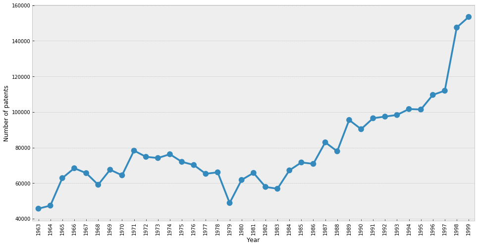

We can see that the number of granted patents is constantly increasing through the years, except for the period from 1974-1983 when there was some decrease, probably caused by some events in the world.

* **Which countries have the most assigned patents?**

The map shows number of patents by country of origin for patents from year 1998.

<iframe src="data:text/html;charset=utf-8;base64,PCFET0NUWVBFIGh0bWw+CjxoZWFkPiAgICAKICAgIDxtZXRhIGh0dHAtZXF1aXY9ImNvbnRlbnQtdHlwZSIgY29udGVudD0idGV4dC9odG1sOyBjaGFyc2V0PVVURi04IiAvPgogICAgPHNjcmlwdD5MX1BSRUZFUl9DQU5WQVMgPSBmYWxzZTsgTF9OT19UT1VDSCA9IGZhbHNlOyBMX0RJU0FCTEVfM0QgPSBmYWxzZTs8L3NjcmlwdD4KICAgIDxzY3JpcHQgc3JjPSJodHRwczovL2Nkbi5qc2RlbGl2ci5uZXQvbnBtL2xlYWZsZXRAMS4yLjAvZGlzdC9sZWFmbGV0LmpzIj48L3NjcmlwdD4KICAgIDxzY3JpcHQgc3JjPSJodHRwczovL2FqYXguZ29vZ2xlYXBpcy5jb20vYWpheC9saWJzL2pxdWVyeS8xLjExLjEvanF1ZXJ5Lm1pbi5qcyI+PC9zY3JpcHQ+CiAgICA8c2NyaXB0IHNyYz0iaHR0cHM6Ly9tYXhjZG4uYm9vdHN0cmFwY2RuLmNvbS9ib290c3RyYXAvMy4yLjAvanMvYm9vdHN0cmFwLm1pbi5qcyI+PC9zY3JpcHQ+CiAgICA8c2NyaXB0IHNyYz0iaHR0cHM6Ly9jZG5qcy5jbG91ZGZsYXJlLmNvbS9hamF4L2xpYnMvTGVhZmxldC5hd2Vzb21lLW1hcmtlcnMvMi4wLjIvbGVhZmxldC5hd2Vzb21lLW1hcmtlcnMuanMiPjwvc2NyaXB0PgogICAgPGxpbmsgcmVsPSJzdHlsZXNoZWV0IiBocmVmPSJodHRwczovL2Nkbi5qc2RlbGl2ci5uZXQvbnBtL2xlYWZsZXRAMS4yLjAvZGlzdC9sZWFmbGV0LmNzcyIgLz4KICAgIDxsaW5rIHJlbD0ic3R5bGVzaGVldCIgaHJlZj0iaHR0cHM6Ly9tYXhjZG4uYm9vdHN0cmFwY2RuLmNvbS9ib290c3RyYXAvMy4yLjAvY3NzL2Jvb3RzdHJhcC5taW4uY3NzIiAvPgogICAgPGxpbmsgcmVsPSJzdHlsZXNoZWV0IiBocmVmPSJodHRwczovL21heGNkbi5ib290c3RyYXBjZG4uY29tL2Jvb3RzdHJhcC8zLjIuMC9jc3MvYm9vdHN0cmFwLXRoZW1lLm1pbi5jc3MiIC8+CiAgICA8bGluayByZWw9InN0eWxlc2hlZXQiIGhyZWY9Imh0dHBzOi8vbWF4Y2RuLmJvb3RzdHJhcGNkbi5jb20vZm9udC1hd2Vzb21lLzQuNi4zL2Nzcy9mb250LWF3ZXNvbWUubWluLmNzcyIgLz4KICAgIDxsaW5rIHJlbD0ic3R5bGVzaGVldCIgaHJlZj0iaHR0cHM6Ly9jZG5qcy5jbG91ZGZsYXJlLmNvbS9hamF4L2xpYnMvTGVhZmxldC5hd2Vzb21lLW1hcmtlcnMvMi4wLjIvbGVhZmxldC5hd2Vzb21lLW1hcmtlcnMuY3NzIiAvPgogICAgPGxpbmsgcmVsPSJzdHlsZXNoZWV0IiBocmVmPSJodHRwczovL3Jhd2dpdC5jb20vcHl0aG9uLXZpc3VhbGl6YXRpb24vZm9saXVtL21hc3Rlci9mb2xpdW0vdGVtcGxhdGVzL2xlYWZsZXQuYXdlc29tZS5yb3RhdGUuY3NzIiAvPgogICAgPHN0eWxlPmh0bWwsIGJvZHkge3dpZHRoOiAxMDAlO2hlaWdodDogMTAwJTttYXJnaW46IDA7cGFkZGluZzogMDt9PC9zdHlsZT4KICAgIDxzdHlsZT4jbWFwIHtwb3NpdGlvbjphYnNvbHV0ZTt0b3A6MDtib3R0b206MDtyaWdodDowO2xlZnQ6MDt9PC9zdHlsZT4KICAgIAogICAgICAgICAgICA8c3R5bGU+ICNtYXBfYWFjMmJiMzg3NjgwNGVmYzlkZWM1MzU4MWQ5MDZmYzYgewogICAgICAgICAgICAgICAgcG9zaXRpb24gOiByZWxhdGl2ZTsKICAgICAgICAgICAgICAgIHdpZHRoIDogMTAwLjAlOwogICAgICAgICAgICAgICAgaGVpZ2h0OiAxMDAuMCU7CiAgICAgICAgICAgICAgICBsZWZ0OiAwLjAlOwogICAgICAgICAgICAgICAgdG9wOiAwLjAlOwogICAgICAgICAgICAgICAgfQogICAgICAgICAgICA8L3N0eWxlPgogICAgICAgIAo8L2hlYWQ+Cjxib2R5PiAgICAKICAgIAogICAgICAgICAgICA8ZGl2IGNsYXNzPSJmb2xpdW0tbWFwIiBpZD0ibWFwX2FhYzJiYjM4NzY4MDRlZmM5ZGVjNTM1ODFkOTA2ZmM2IiA+PC9kaXY+CiAgICAgICAgCjwvYm9keT4KPHNjcmlwdD4gICAgCiAgICAKCiAgICAgICAgICAgIAogICAgICAgICAgICAgICAgdmFyIGJvdW5kcyA9IG51bGw7CiAgICAgICAgICAgIAoKICAgICAgICAgICAgdmFyIG1hcF9hYWMyYmIzODc2ODA0ZWZjOWRlYzUzNTgxZDkwNmZjNiA9IEwubWFwKAogICAgICAgICAgICAgICAgICAgICAgICAgICAgICAgICAgJ21hcF9hYWMyYmIzODc2ODA0ZWZjOWRlYzUzNTgxZDkwNmZjNicsCiAgICAgICAgICAgICAgICAgICAgICAgICAgICAgICAgICB7Y2VudGVyOiBbNTIsMThdLAogICAgICAgICAgICAgICAgICAgICAgICAgICAgICAgICAgem9vbTogMiwKICAgICAgICAgICAgICAgICAgICAgICAgICAgICAgICAgIG1heEJvdW5kczogYm91bmRzLAogICAgICAgICAgICAgICAgICAgICAgICAgICAgICAgICAgbGF5ZXJzOiBbXSwKICAgICAgICAgICAgICAgICAgICAgICAgICAgICAgICAgIHdvcmxkQ29weUp1bXA6IGZhbHNlLAogICAgICAgICAgICAgICAgICAgICAgICAgICAgICAgICAgY3JzOiBMLkNSUy5FUFNHMzg1NwogICAgICAgICAgICAgICAgICAgICAgICAgICAgICAgICB9KTsKICAgICAgICAgICAgCiAgICAgICAgCiAgICAKICAgICAgICAgICAgdmFyIHRpbGVfbGF5ZXJfNTQwNDZmZmRjNWRkNDc4MWEyMDA5YjYxYjQ5NGEwYzcgPSBMLnRpbGVMYXllcigKICAgICAgICAgICAgICAgICdodHRwczovL2NhcnRvZGItYmFzZW1hcHMte3N9Lmdsb2JhbC5zc2wuZmFzdGx5Lm5ldC9saWdodF9hbGwve3p9L3t4fS97eX0ucG5nJywKICAgICAgICAgICAgICAgIHsKICAiYXR0cmlidXRpb24iOiBudWxsLAogICJkZXRlY3RSZXRpbmEiOiBmYWxzZSwKICAibWF4Wm9vbSI6IDE4LAogICJtaW5ab29tIjogMSwKICAibm9XcmFwIjogZmFsc2UsCiAgInN1YmRvbWFpbnMiOiAiYWJjIgp9CiAgICAgICAgICAgICAgICApLmFkZFRvKG1hcF9hYWMyYmIzODc2ODA0ZWZjOWRlYzUzNTgxZDkwNmZjNik7CiAgICAgICAgCiAgICAKCiAgICAgICAgICAgIAoKICAgICAgICAgICAgICAgIHZhciBnZW9fanNvbl8yOWMzZGE1MzkzM2E0NjI5YTBhNTY3Y2M1NDk5NGFhMyA9IEwuZ2VvSnNvbigKICAgICAgICAgICAgICAgICAgICB7ImZlYXR1cmVzIjogW3siZ2VvbWV0cnkiOiB7ImNvb3JkaW5hdGVzIjogW1tbNTEuNTc5NTE5LCAyNC4yNDU0OTddLCBbNTEuNzU3NDQxLCAyNC4yOTQwNzNdLCBbNTEuNzk0Mzg5LCAyNC4wMTk4MjZdLCBbNTIuNTc3MDgxLCAyNC4xNzc0MzldLCBbNTMuNDA0MDA3LCAyNC4xNTEzMTddLCBbNTQuMDA4MDAxLCAyNC4xMjE3NThdLCBbNTQuNjkzMDI0LCAyNC43OTc4OTJdLCBbNTUuNDM5MDI1LCAyNS40MzkxNDVdLCBbNTYuMDcwODIxLCAyNi4wNTU0NjRdLCBbNTYuMjYxMDQyLCAyNS43MTQ2MDZdLCBbNTYuMzk2ODQ3LCAyNC45MjQ3MzJdLCBbNTUuODg2MjMzLCAyNC45MjA4MzFdLCBbNTUuODA0MTE5LCAyNC4yNjk2MDRdLCBbNTUuOTgxMjE0LCAyNC4xMzA1NDNdLCBbNTUuNTI4NjMyLCAyMy45MzM2MDRdLCBbNTUuNTI1ODQxLCAyMy41MjQ4NjldLCBbNTUuMjM0NDg5LCAyMy4xMTA5OTNdLCBbNTUuMjA4MzQxLCAyMi43MDgzM10sIFs1NS4wMDY4MDMsIDIyLjQ5Njk0OF0sIFs1Mi4wMDA3MzMsIDIzLjAwMTE1NF0sIFs1MS42MTc3MDgsIDI0LjAxNDIxOV0sIFs1MS41Nzk1MTksIDI0LjI0NTQ5N11dXSwgInR5cGUiOiAiUG9seWdvbiJ9LCAiaWQiOiAiQUUiLCAicHJvcGVydGllcyI6IHsiaGlnaGxpZ2h0Ijoge30sICJuYW1lIjogIlVuaXRlZCBBcmFiIEVtaXJhdGVzIiwgInN0eWxlIjogeyJjb2xvciI6ICJibGFjayIsICJkYXNoQXJyYXkiOiAiNSwgNSIsICJmaWxsQ29sb3IiOiAiI2ZmZjBlNiIsICJmaWxsT3BhY2l0eSI6IDAuOSwgIndlaWdodCI6IDF9fSwgInR5cGUiOiAiRmVhdHVyZSJ9XSwgInR5cGUiOiAiRmVhdHVyZUNvbGxlY3Rpb24ifQogICAgICAgICAgICAgICAgICAgIAogICAgICAgICAgICAgICAgICAgICkuYWRkVG8obWFwX2FhYzJiYjM4NzY4MDRlZmM5ZGVjNTM1ODFkOTA2ZmM2KTsKICAgICAgICAgICAgICAgIGdlb19qc29uXzI5YzNkYTUzOTMzYTQ2MjlhMGE1NjdjYzU0OTk0YWEzLnNldFN0eWxlKGZ1bmN0aW9uKGZlYXR1cmUpIHtyZXR1cm4gZmVhdHVyZS5wcm9wZXJ0aWVzLnN0eWxlO30pOwoKICAgICAgICAgICAgCiAgICAKICAgICAgICAgICAgdmFyIHBvcHVwXzY5OTg5YjBlM2VlODRkNTI4ZGM1YWYwNzhhMjViNjQ0ID0gTC5wb3B1cCh7bWF4V2lkdGg6ICc1MDAnfSk7CgogICAgICAgICAgICAKICAgICAgICAgICAgICAgIHZhciBodG1sXzI1YTQxYjBlYWUzNTRkZTk4ZGMzMTk1ZmM5YTAxNjRlID0gJCgnPGRpdiBpZD0iaHRtbF8yNWE0MWIwZWFlMzU0ZGU5OGRjMzE5NWZjOWEwMTY0ZSIgc3R5bGU9IndpZHRoOiAxMDAuMCU7IGhlaWdodDogMTAwLjAlOyI+PGg1PkFSQUIgRU1JUkFURVMgbnVtYmVyIG9mIHBhdGVudHMgaW4gMTk5ODogPGJyPjE8L2g1Pjxicj48L2Rpdj4nKVswXTsKICAgICAgICAgICAgICAgIHBvcHVwXzY5OTg5YjBlM2VlODRkNTI4ZGM1YWYwNzhhMjViNjQ0LnNldENvbnRlbnQoaHRtbF8yNWE0MWIwZWFlMzU0ZGU5OGRjMzE5NWZjOWEwMTY0ZSk7CiAgICAgICAgICAgIAoKICAgICAgICAgICAgZ2VvX2pzb25fMjljM2RhNTM5MzNhNDYyOWEwYTU2N2NjNTQ5OTRhYTMuYmluZFBvcHVwKHBvcHVwXzY5OTg5YjBlM2VlODRkNTI4ZGM1YWYwNzhhMjViNjQ0KTsKCiAgICAgICAgICAgIAogICAgICAgIAogICAgCgogICAgICAgICAgICAKCiAgICAgICAgICAgICAgICB2YXIgZ2VvX2pzb25fYWRkMTAwNDk0ZDM4NDg3NmJiMDhmNjUyZDBhM2EzMDkgPSBMLmdlb0pzb24oCiAgICAgICAgICAgICAgICAgICAgeyJmZWF0dXJlcyI6IFt7Imdlb21ldHJ5IjogeyJjb29yZGluYXRlcyI6IFtbW1stNjUuNSwgLTU1LjJdLCBbLTY2LjQ1LCAtNTUuMjVdLCBbLTY2Ljk1OTkyLCAtNTQuODk2ODFdLCBbLTY3LjU2MjQ0LCAtNTQuODcwMDFdLCBbLTY4LjYzMzM1LCAtNTQuODY5NV0sIFstNjguNjM0MDEsIC01Mi42MzYzN10sIFstNjguMjUsIC01My4xXSwgWy02Ny43NSwgLTUzLjg1XSwgWy02Ni40NSwgLTU0LjQ1XSwgWy02NS4wNSwgLTU0LjddLCBbLTY1LjUsIC01NS4yXV1dLCBbW1stNjQuOTY0ODkyLCAtMjIuMDc1ODYyXSwgWy02NC4zNzcwMjEsIC0yMi43OTgwOTFdLCBbLTYzLjk4NjgzOCwgLTIxLjk5MzY0NF0sIFstNjIuODQ2NDY4LCAtMjIuMDM0OTg1XSwgWy02Mi42ODUwNTcsIC0yMi4yNDkwMjldLCBbLTYwLjg0NjU2NSwgLTIzLjg4MDcxM10sIFstNjAuMDI4OTY2LCAtMjQuMDMyNzk2XSwgWy01OC44MDcxMjgsIC0yNC43NzE0NTldLCBbLTU3Ljc3NzIxNywgLTI1LjE2MjM0XSwgWy01Ny42MzM2NiwgLTI1LjYwMzY1N10sIFstNTguNjE4MTc0LCAtMjcuMTIzNzE5XSwgWy01Ny42MDk3NiwgLTI3LjM5NTg5OV0sIFstNTYuNDg2NzAyLCAtMjcuNTQ4NDk5XSwgWy01NS42OTU4NDYsIC0yNy4zODc4MzddLCBbLTU0Ljc4ODc5NSwgLTI2LjYyMTc4Nl0sIFstNTQuNjI1MjkxLCAtMjUuNzM5MjU1XSwgWy01NC4xMzAwNSwgLTI1LjU0NzYzOV0sIFstNTMuNjI4MzQ5LCAtMjYuMTI0ODY1XSwgWy01My42NDg3MzUsIC0yNi45MjM0NzNdLCBbLTU0LjQ5MDcyNSwgLTI3LjQ3NDc1N10sIFstNTUuMTYyMjg2LCAtMjcuODgxOTE1XSwgWy01Ni4yOTA5LCAtMjguODUyNzYxXSwgWy01Ny42MjUxMzMsIC0zMC4yMTYyOTVdLCBbLTU3Ljg3NDkzNywgLTMxLjAxNjU1Nl0sIFstNTguMTQyNDQsIC0zMi4wNDQ1MDRdLCBbLTU4LjEzMjY0OCwgLTMzLjA0MDU2N10sIFstNTguMzQ5NjExLCAtMzMuMjYzMTg5XSwgWy01OC40MjcwNzQsIC0zMy45MDk0NTRdLCBbLTU4LjQ5NTQ0MiwgLTM0LjQzMTQ5XSwgWy01Ny4yMjU4MywgLTM1LjI4ODAyN10sIFstNTcuMzYyMzU5LCAtMzUuOTc3MzldLCBbLTU2LjczNzQ4NywgLTM2LjQxMzEyNl0sIFstNTYuNzg4Mjg1LCAtMzYuOTAxNTcyXSwgWy01Ny43NDkxNTcsIC0zOC4xODM4NzFdLCBbLTU5LjIzMTg1NywgLTM4LjcyMDIyXSwgWy02MS4yMzc0NDUsIC0zOC45Mjg0MjVdLCBbLTYyLjMzNTk1NywgLTM4LjgyNzcwN10sIFstNjIuMTI1NzYzLCAtMzkuNDI0MTA1XSwgWy02Mi4zMzA1MzEsIC00MC4xNzI1ODZdLCBbLTYyLjE0NTk5NCwgLTQwLjY3Njg5N10sIFstNjIuNzQ1ODAzLCAtNDEuMDI4NzYxXSwgWy02My43NzA0OTUsIC00MS4xNjY3ODldLCBbLTY0LjczMjA5LCAtNDAuODAyNjc3XSwgWy02NS4xMTgwMzUsIC00MS4wNjQzMTVdLCBbLTY0Ljk3ODU2MSwgLTQyLjA1ODAwMV0sIFstNjQuMzAzNDA4LCAtNDIuMzU5MDE2XSwgWy02My43NTU5NDgsIC00Mi4wNDM2ODddLCBbLTYzLjQ1ODA1OSwgLTQyLjU2MzEzOF0sIFstNjQuMzc4ODA0LCAtNDIuODczNTU4XSwgWy02NS4xODE4MDQsIC00My40OTUzODFdLCBbLTY1LjMyODgyMywgLTQ0LjUwMTM2Nl0sIFstNjUuNTY1MjY5LCAtNDUuMDM2Nzg2XSwgWy02Ni41MDk5NjYsIC00NS4wMzk2MjhdLCBbLTY3LjI5Mzc5NCwgLTQ1LjU1MTg5Nl0sIFstNjcuNTgwNTQ2LCAtNDYuMzAxNzczXSwgWy02Ni41OTcwNjYsIC00Ny4wMzM5MjVdLCBbLTY1LjY0MTAyNywgLTQ3LjIzNjEzNV0sIFstNjUuOTg1MDg4LCAtNDguMTMzMjg5XSwgWy02Ny4xNjYxNzksIC00OC42OTczMzddLCBbLTY3LjgxNjA4OCwgLTQ5Ljg2OTY2OV0sIFstNjguNzI4NzQ1LCAtNTAuMjY0MjE4XSwgWy02OS4xMzg1MzksIC01MC43MzI1MV0sIFstNjguODE1NTYxLCAtNTEuNzcxMTA0XSwgWy02OC4xNDk5OTUsIC01Mi4zNDk5ODNdLCBbLTY4LjU3MTU0NSwgLTUyLjI5OTQ0NF0sIFstNjkuNDk4MzYyLCAtNTIuMTQyNzYxXSwgWy03MS45MTQ4MDQsIC01Mi4wMDkwMjJdLCBbLTcyLjMyOTQwNCwgLTUxLjQyNTk1Nl0sIFstNzIuMzA5OTc0LCAtNTAuNjc3MDFdLCBbLTcyLjk3NTc0NywgLTUwLjc0MTQ1XSwgWy03My4zMjgwNTEsIC01MC4zNzg3ODVdLCBbLTczLjQxNTQzNiwgLTQ5LjMxODQzNl0sIFstNzIuNjQ4MjQ3LCAtNDguODc4NjE4XSwgWy03Mi4zMzExNjEsIC00OC4yNDQyMzhdLCBbLTcyLjQ0NzM1NSwgLTQ3LjczODUzM10sIFstNzEuOTE3MjU4LCAtNDYuODg0ODM4XSwgWy03MS41NTIwMDksIC00NS41NjA3MzNdLCBbLTcxLjY1OTMxNiwgLTQ0Ljk3MzY4OV0sIFstNzEuMjIyNzc5LCAtNDQuNzg0MjQzXSwgWy03MS4zMjk4MDEsIC00NC40MDc1MjJdLCBbLTcxLjc5MzYyMywgLTQ0LjIwNzE3Ml0sIFstNzEuNDY0MDU2LCAtNDMuNzg3NjExXSwgWy03MS45MTU0MjQsIC00My40MDg1NjVdLCBbLTcyLjE0ODg5OCwgLTQyLjI1NDg4OF0sIFstNzEuNzQ2ODA0LCAtNDIuMDUxMzg2XSwgWy03MS45MTU3MzQsIC00MC44MzIzMzldLCBbLTcxLjY4MDc2MSwgLTM5LjgwODE2NF0sIFstNzEuNDEzNTE3LCAtMzguOTE2MDIyXSwgWy03MC44MTQ2NjQsIC0zOC41NTI5OTVdLCBbLTcxLjExODYyNSwgLTM3LjU3NjgyN10sIFstNzEuMTIxODgxLCAtMzYuNjU4MTI0XSwgWy03MC4zNjQ3NjksIC0zNi4wMDUwODldLCBbLTcwLjM4ODA0OSwgLTM1LjE2OTY4OF0sIFstNjkuODE3MzA5LCAtMzQuMTkzNTcxXSwgWy02OS44MTQ3NzcsIC0zMy4yNzM4ODZdLCBbLTcwLjA3NDM5OSwgLTMzLjA5MTIxXSwgWy03MC41MzUwNjksIC0zMS4zNjUwMV0sIFstNjkuOTE5MDA4LCAtMzAuMzM2MzM5XSwgWy03MC4wMTM1NSwgLTI5LjM2NzkyM10sIFstNjkuNjU2MTMsIC0yOC40NTkxNDFdLCBbLTY5LjAwMTIzNSwgLTI3LjUyMTIxNF0sIFstNjguMjk1NTQyLCAtMjYuODk5MzRdLCBbLTY4LjU5NDgsIC0yNi41MDY5MDldLCBbLTY4LjM4NjAwMSwgLTI2LjE4NTAxNl0sIFstNjguNDE3NjUzLCAtMjQuNTE4NTU1XSwgWy02Ny4zMjg0NDMsIC0yNC4wMjUzMDNdLCBbLTY2Ljk4NTIzNCwgLTIyLjk4NjM0OV0sIFstNjcuMTA2Njc0LCAtMjIuNzM1OTI1XSwgWy02Ni4yNzMzMzksIC0yMS44MzIzMV0sIFstNjQuOTY0ODkyLCAtMjIuMDc1ODYyXV1dXSwgInR5cGUiOiAiTXVsdGlQb2x5Z29uIn0sICJpZCI6ICJBUiIsICJwcm9wZXJ0aWVzIjogeyJoaWdobGlnaHQiOiB7fSwgIm5hbWUiOiAiQXJnZW50aW5hIiwgInN0eWxlIjogeyJjb2xvciI6ICJibGFjayIsICJkYXNoQXJyYXkiOiAiNSwgNSIsICJmaWxsQ29sb3IiOiAiI2ZmZjBlNiIsICJmaWxsT3BhY2l0eSI6IDAuOSwgIndlaWdodCI6IDF9fSwgInR5cGUiOiAiRmVhdHVyZSJ9XSwgInR5cGUiOiAiRmVhdHVyZUNvbGxlY3Rpb24ifQogICAgICAgICAgICAgICAgICAgIAogICAgICAgICAgICAgICAgICAgICkuYWRkVG8obWFwX2FhYzJiYjM4NzY4MDRlZmM5ZGVjNTM1ODFkOTA2ZmM2KTsKICAgICAgICAgICAgICAgIGdlb19qc29uX2FkZDEwMDQ5NGQzODQ4NzZiYjA4ZjY1MmQwYTNhMzA5LnNldFN0eWxlKGZ1bmN0aW9uKGZlYXR1cmUpIHtyZXR1cm4gZmVhdHVyZS5wcm9wZXJ0aWVzLnN0eWxlO30pOwoKICAgICAgICAgICAgCiAgICAKICAgICAgICAgICAgdmFyIHBvcHVwXzA5YWU0NTlmZjI2NzRiYjliYTRlNTBmNTRiOTc3NTMyID0gTC5wb3B1cCh7bWF4V2lkdGg6ICc1MDAnfSk7CgogICAgICAgICAgICAKICAgICAgICAgICAgICAgIHZhciBodG1sX2FjYjZiYjJmMDAyODQ5Yjk5Nzk5NjY3YWRlOWM5ODhhID0gJCgnPGRpdiBpZD0iaHRtbF9hY2I2YmIyZjAwMjg0OWI5OTc5OTY2N2FkZTljOTg4YSIgc3R5bGU9IndpZHRoOiAxMDAuMCU7IGhlaWdodDogMTAwLjAlOyI+PGg1PkFSR0VOVElOQSBudW1iZXIgb2YgcGF0ZW50cyBpbiAxOTk4OiA8YnI+NDM8L2g1Pjxicj48L2Rpdj4nKVswXTsKICAgICAgICAgICAgICAgIHBvcHVwXzA5YWU0NTlmZjI2NzRiYjliYTRlNTBmNTRiOTc3NTMyLnNldENvbnRlbnQoaHRtbF9hY2I2YmIyZjAwMjg0OWI5OTc5OTY2N2FkZTljOTg4YSk7CiAgICAgICAgICAgIAoKICAgICAgICAgICAgZ2VvX2pzb25fYWRkMTAwNDk0ZDM4NDg3NmJiMDhmNjUyZDBhM2EzMDkuYmluZFBvcHVwKHBvcHVwXzA5YWU0NTlmZjI2NzRiYjliYTRlNTBmNTRiOTc3NTMyKTsKCiAgICAgICAgICAgIAogICAgICAgIAogICAgCgogICAgICAgICAgICAKCiAgICAgICAgICAgICAgICB2YXIgZ2VvX2pzb25fZjNjMDhlODZhNTEyNGQ3OGIzZjY3N2ViZGY0NjVmOTggPSBMLmdlb0pzb24oCiAgICAgICAgICAgICAgICAgICAgeyJmZWF0dXJlcyI6IFt7Imdlb21ldHJ5IjogeyJjb29yZGluYXRlcyI6IFtbW1sxNDUuMzk3OTc4LCAtNDAuNzkyNTQ5XSwgWzE0Ni4zNjQxMjEsIC00MS4xMzc2OTVdLCBbMTQ2LjkwODU4NCwgLTQxLjAwMDU0Nl0sIFsxNDcuNjg5MjU5LCAtNDAuODA4MjU4XSwgWzE0OC4yODkwNjgsIC00MC44NzU0MzhdLCBbMTQ4LjM1OTg2NSwgLTQyLjA2MjQ0NV0sIFsxNDguMDE3MzAxLCAtNDIuNDA3MDI0XSwgWzE0Ny45MTQwNTIsIC00My4yMTE1MjJdLCBbMTQ3LjU2NDU2NCwgLTQyLjkzNzY4OV0sIFsxNDYuODcwMzQzLCAtNDMuNjM0NTk3XSwgWzE0Ni42NjMzMjcsIC00My41ODA4NTRdLCBbMTQ2LjA0ODM3OCwgLTQzLjU0OTc0NV0sIFsxNDUuNDMxOTMsIC00Mi42OTM3NzZdLCBbMTQ1LjI5NTA5LCAtNDIuMDMzNjFdLCBbMTQ0LjcxODA3MSwgLTQxLjE2MjU1Ml0sIFsxNDQuNzQzNzU1LCAtNDAuNzAzOTc1XSwgWzE0NS4zOTc5NzgsIC00MC43OTI1NDldXV0sIFtbWzE0My41NjE4MTEsIC0xMy43NjM2NTZdLCBbMTQzLjkyMjA5OSwgLTE0LjU0ODMxMV0sIFsxNDQuNTYzNzE0LCAtMTQuMTcxMTc2XSwgWzE0NC44OTQ5MDgsIC0xNC41OTQ0NThdLCBbMTQ1LjM3NDcyNCwgLTE0Ljk4NDk3Nl0sIFsxNDUuMjcxOTkxLCAtMTUuNDI4MjA1XSwgWzE0NS40ODUyNiwgLTE2LjI4NTY3Ml0sIFsxNDUuNjM3MDMzLCAtMTYuNzg0OTE4XSwgWzE0NS44ODg5MDQsIC0xNi45MDY5MjZdLCBbMTQ2LjE2MDMwOSwgLTE3Ljc2MTY1NV0sIFsxNDYuMDYzNjc0LCAtMTguMjgwMDczXSwgWzE0Ni4zODc0NzgsIC0xOC45NTgyNzRdLCBbMTQ3LjQ3MTA4MiwgLTE5LjQ4MDcyM10sIFsxNDguMTc3NjAyLCAtMTkuOTU1OTM5XSwgWzE0OC44NDg0MTQsIC0yMC4zOTEyMV0sIFsxNDguNzE3NDY1LCAtMjAuNjMzNDY5XSwgWzE0OS4yODk0MiwgLTIxLjI2MDUxMV0sIFsxNDkuNjc4MzM3LCAtMjIuMzQyNTEyXSwgWzE1MC4wNzczODIsIC0yMi4xMjI3ODRdLCBbMTUwLjQ4MjkzOSwgLTIyLjU1NjE0Ml0sIFsxNTAuNzI3MjY1LCAtMjIuNDAyNDA1XSwgWzE1MC44OTk1NTQsIC0yMy40NjIyMzddLCBbMTUxLjYwOTE3NSwgLTI0LjA3NjI1Nl0sIFsxNTIuMDczNTQsIC0yNC40NTc4ODddLCBbMTUyLjg1NTE5NywgLTI1LjI2NzUwMV0sIFsxNTMuMTM2MTYyLCAtMjYuMDcxMTczXSwgWzE1My4xNjE5NDksIC0yNi42NDEzMTldLCBbMTUzLjA5MjkwOSwgLTI3LjI2MDNdLCBbMTUzLjU2OTQ2OSwgLTI4LjExMDA2N10sIFsxNTMuNTEyMTA4LCAtMjguOTk1MDc3XSwgWzE1My4zMzkwOTUsIC0yOS40NTgyMDJdLCBbMTUzLjA2OTI0MSwgLTMwLjM1MDI0XSwgWzE1My4wODk2MDIsIC0zMC45MjM2NDJdLCBbMTUyLjg5MTU3OCwgLTMxLjY0MDQ0Nl0sIFsxNTIuNDUwMDAyLCAtMzIuNTUwMDAzXSwgWzE1MS43MDkxMTcsIC0zMy4wNDEzNDJdLCBbMTUxLjM0Mzk3MiwgLTMzLjgxNjAyM10sIFsxNTEuMDEwNTU1LCAtMzQuMzEwMzZdLCBbMTUwLjcxNDEzOSwgLTM1LjE3MzQ2XSwgWzE1MC4zMjgyMiwgLTM1LjY3MTg3OV0sIFsxNTAuMDc1MjEyLCAtMzYuNDIwMjA2XSwgWzE0OS45NDYxMjQsIC0zNy4xMDkwNTJdLCBbMTQ5Ljk5NzI4NCwgLTM3LjQyNTI2MV0sIFsxNDkuNDIzODgyLCAtMzcuNzcyNjgxXSwgWzE0OC4zMDQ2MjIsIC0zNy44MDkwNjFdLCBbMTQ3LjM4MTczMywgLTM4LjIxOTIxN10sIFsxNDYuOTIyMTIzLCAtMzguNjA2NTMyXSwgWzE0Ni4zMTc5MjIsIC0zOS4wMzU3NTddLCBbMTQ1LjQ4OTY1MiwgLTM4LjU5Mzc2OF0sIFsxNDQuODc2OTc2LCAtMzguNDE3NDQ4XSwgWzE0NS4wMzIyMTIsIC0zNy44OTYxODhdLCBbMTQ0LjQ4NTY4MiwgLTM4LjA4NTMyNF0sIFsxNDMuNjA5OTc0LCAtMzguODA5NDY1XSwgWzE0Mi43NDU0MjcsIC0zOC41MzgyNjhdLCBbMTQyLjE3ODMzLCAtMzguMzgwMDM0XSwgWzE0MS42MDY1ODIsIC0zOC4zMDg1MTRdLCBbMTQwLjYzODU3OSwgLTM4LjAxOTMzM10sIFsxMzkuOTkyMTU4LCAtMzcuNDAyOTM2XSwgWzEzOS44MDY1ODgsIC0zNi42NDM2MDNdLCBbMTM5LjU3NDE0OCwgLTM2LjEzODM2Ml0sIFsxMzkuMDgyODA4LCAtMzUuNzMyNzU0XSwgWzEzOC4xMjA3NDgsIC0zNS42MTIyOTZdLCBbMTM4LjQ0OTQ2MiwgLTM1LjEyNzI2MV0sIFsxMzguMjA3NTY0LCAtMzQuMzg0NzIzXSwgWzEzNy43MTkxNywgLTM1LjA3NjgyNV0sIFsxMzYuODI5NDA2LCAtMzUuMjYwNTM1XSwgWzEzNy4zNTIzNzEsIC0zNC43MDczMzldLCBbMTM3LjUwMzg4NiwgLTM0LjEzMDI2OF0sIFsxMzcuODkwMTE2LCAtMzMuNjQwNDc5XSwgWzEzNy44MTAzMjgsIC0zMi45MDAwMDddLCBbMTM2Ljk5NjgzNywgLTMzLjc1Mjc3MV0sIFsxMzYuMzcyMDY5LCAtMzQuMDk0NzY2XSwgWzEzNS45ODkwNDMsIC0zNC44OTAxMThdLCBbMTM1LjIwODIxMywgLTM0LjQ3ODY3XSwgWzEzNS4yMzkyMTgsIC0zMy45NDc5NTNdLCBbMTM0LjYxMzQxNywgLTMzLjIyMjc3OF0sIFsxMzQuMDg1OTA0LCAtMzIuODQ4MDcyXSwgWzEzNC4yNzM5MDMsIC0zMi42MTcyMzRdLCBbMTMyLjk5MDc3NywgLTMyLjAxMTIyNF0sIFsxMzIuMjg4MDgxLCAtMzEuOTgyNjQ3XSwgWzEzMS4zMjYzMzEsIC0zMS40OTU4MDNdLCBbMTI5LjUzNTc5NCwgLTMxLjU5MDQyM10sIFsxMjguMjQwOTM4LCAtMzEuOTQ4NDg5XSwgWzEyNy4xMDI4NjcsIC0zMi4yODIyNjddLCBbMTI2LjE0ODcxNCwgLTMyLjIxNTk2Nl0sIFsxMjUuMDg4NjIzLCAtMzIuNzI4NzUxXSwgWzEyNC4yMjE2NDgsIC0zMi45NTk0ODddLCBbMTI0LjAyODk0NywgLTMzLjQ4Mzg0N10sIFsxMjMuNjU5NjY3LCAtMzMuODkwMTc5XSwgWzEyMi44MTEwMzYsIC0zMy45MTQ0NjddLCBbMTIyLjE4MzA2NCwgLTM0LjAwMzQwMl0sIFsxMjEuMjk5MTkxLCAtMzMuODIxMDM2XSwgWzEyMC41ODAyNjgsIC0zMy45MzAxNzddLCBbMTE5Ljg5MzY5NSwgLTMzLjk3NjA2NV0sIFsxMTkuMjk4ODk5LCAtMzQuNTA5MzY2XSwgWzExOS4wMDczNDEsIC0zNC40NjQxNDldLCBbMTE4LjUwNTcxOCwgLTM0Ljc0NjgxOV0sIFsxMTguMDI0OTcyLCAtMzUuMDY0NzMzXSwgWzExNy4yOTU1MDcsIC0zNS4wMjU0NTldLCBbMTE2LjYyNTEwOSwgLTM1LjAyNTA5N10sIFsxMTUuNTY0MzQ3LCAtMzQuMzg2NDI4XSwgWzExNS4wMjY4MDksIC0zNC4xOTY1MTddLCBbMTE1LjA0ODYxNiwgLTMzLjYyMzQyNV0sIFsxMTUuNTQ1MTIzLCAtMzMuNDg3MjU4XSwgWzExNS43MTQ2NzQsIC0zMy4yNTk1NzJdLCBbMTE1LjY3OTM3OSwgLTMyLjkwMDM2OV0sIFsxMTUuODAxNjQ1LCAtMzIuMjA1MDYyXSwgWzExNS42ODk2MTEsIC0zMS42MTI0MzddLCBbMTE1LjE2MDkwOSwgLTMwLjYwMTU5NF0sIFsxMTQuOTk3MDQzLCAtMzAuMDMwNzI1XSwgWzExNS4wNDAwMzgsIC0yOS40NjEwOTVdLCBbMTE0LjY0MTk3NCwgLTI4LjgxMDIzMV0sIFsxMTQuNjE2NDk4LCAtMjguNTE2Mzk5XSwgWzExNC4xNzM1NzksIC0yOC4xMTgwNzddLCBbMTE0LjA0ODg4NCwgLTI3LjMzNDc2NV0sIFsxMTMuNDc3NDk4LCAtMjYuNTQzMTM0XSwgWzExMy4zMzg5NTMsIC0yNi4xMTY1NDVdLCBbMTEzLjc3ODM1OCwgLTI2LjU0OTAyNV0sIFsxMTMuNDQwOTYyLCAtMjUuNjIxMjc4XSwgWzExMy45MzY5MDEsIC0yNS45MTEyMzVdLCBbMTE0LjIzMjg1MiwgLTI2LjI5ODQ0Nl0sIFsxMTQuMjE2MTYxLCAtMjUuNzg2MjgxXSwgWzExMy43MjEyNTUsIC0yNC45OTg5MzldLCBbMTEzLjYyNTM0NCwgLTI0LjY4Mzk3MV0sIFsxMTMuMzkzNTIzLCAtMjQuMzg0NzY0XSwgWzExMy41MDIwNDQsIC0yMy44MDYzNV0sIFsxMTMuNzA2OTkzLCAtMjMuNTYwMjE1XSwgWzExMy44NDM0MTgsIC0yMy4wNTk5ODddLCBbMTEzLjczNjU1MiwgLTIyLjQ3NTQ3NV0sIFsxMTQuMTQ5NzU2LCAtMjEuNzU1ODgxXSwgWzExNC4yMjUzMDcsIC0yMi41MTc0ODhdLCBbMTE0LjY0Nzc2MiwgLTIxLjgyOTUyXSwgWzExNS40NjAxNjcsIC0yMS40OTUxNzNdLCBbMTE1Ljk0NzM3MywgLTIxLjA2ODY4OF0sIFsxMTYuNzExNjE1LCAtMjAuNzAxNjgyXSwgWzExNy4xNjYzMTYsIC0yMC42MjM1OTldLCBbMTE3LjQ0MTU0NSwgLTIwLjc0Njg5OV0sIFsxMTguMjI5NTU5LCAtMjAuMzc0MjA4XSwgWzExOC44MzYwODUsIC0yMC4yNjMzMTFdLCBbMTE4Ljk4NzgwNywgLTIwLjA0NDIwM10sIFsxMTkuMjUyNDk0LCAtMTkuOTUyOTQyXSwgWzExOS44MDUyMjUsIC0xOS45NzY1MDZdLCBbMTIwLjg1NjIyLCAtMTkuNjgzNzA4XSwgWzEyMS4zOTk4NTYsIC0xOS4yMzk3NTZdLCBbMTIxLjY1NTEzOCwgLTE4LjcwNTMxOF0sIFsxMjIuMjQxNjY1LCAtMTguMTk3NjQ5XSwgWzEyMi4yODY2MjQsIC0xNy43OTg2MDNdLCBbMTIyLjMxMjc3MiwgLTE3LjI1NDk2N10sIFsxMjMuMDEyNTc0LCAtMTYuNDA1Ml0sIFsxMjMuNDMzNzg5LCAtMTcuMjY4NTU4XSwgWzEyMy44NTkzNDUsIC0xNy4wNjkwMzVdLCBbMTIzLjUwMzI0MiwgLTE2LjU5NjUwNl0sIFsxMjMuODE3MDczLCAtMTYuMTExMzE2XSwgWzEyNC4yNTgyODcsIC0xNi4zMjc5NDRdLCBbMTI0LjM3OTcyNiwgLTE1LjU2NzA2XSwgWzEyNC45MjYxNTMsIC0xNS4wNzUxXSwgWzEyNS4xNjcyNzUsIC0xNC42ODAzOTZdLCBbMTI1LjY3MDA4NywgLTE0LjUxMDA3XSwgWzEyNS42ODU3OTYsIC0xNC4yMzA2NTZdLCBbMTI2LjEyNTE0OSwgLTE0LjM0NzM0MV0sIFsxMjYuMTQyODIzLCAtMTQuMDk1OTg3XSwgWzEyNi41ODI1ODksIC0xMy45NTI3OTFdLCBbMTI3LjA2NTg2NywgLTEzLjgxNzk2OF0sIFsxMjcuODA0NjMzLCAtMTQuMjc2OTA2XSwgWzEyOC4zNTk2OSwgLTE0Ljg2OTE3XSwgWzEyOC45ODU1NDMsIC0xNC44NzU5OTFdLCBbMTI5LjYyMTQ3MywgLTE0Ljk2OTc4NF0sIFsxMjkuNDA5NiwgLTE0LjQyMDY3XSwgWzEyOS44ODg2NDEsIC0xMy42MTg3MDNdLCBbMTMwLjMzOTQ2NiwgLTEzLjM1NzM3Nl0sIFsxMzAuMTgzNTA2LCAtMTMuMTA3NTJdLCBbMTMwLjYxNzc5NSwgLTEyLjUzNjM5Ml0sIFsxMzEuMjIzNDk1LCAtMTIuMTgzNjQ5XSwgWzEzMS43MzUwOTEsIC0xMi4zMDI0NTNdLCBbMTMyLjU3NTI5OCwgLTEyLjExNDA0MV0sIFsxMzIuNTU3MjEyLCAtMTEuNjAzMDEyXSwgWzEzMS44MjQ2OTgsIC0xMS4yNzM3ODJdLCBbMTMyLjM1NzIyNCwgLTExLjEyODUxOV0sIFsxMzMuMDE5NTYxLCAtMTEuMzc2NDExXSwgWzEzMy41NTA4NDYsIC0xMS43ODY1MTVdLCBbMTM0LjM5MzA2OCwgLTEyLjA0MjM2NV0sIFsxMzQuNjc4NjMyLCAtMTEuOTQxMTgzXSwgWzEzNS4yOTg0OTEsIC0xMi4yNDg2MDZdLCBbMTM1Ljg4MjY5MywgLTExLjk2MjI2N10sIFsxMzYuMjU4MzgxLCAtMTIuMDQ5MzQyXSwgWzEzNi40OTI0NzUsIC0xMS44NTcyMDldLCBbMTM2Ljk1MTYyLCAtMTIuMzUxOTU5XSwgWzEzNi42ODUxMjUsIC0xMi44ODcyMjNdLCBbMTM2LjMwNTQwNywgLTEzLjI5MTIzXSwgWzEzNS45NjE3NTgsIC0xMy4zMjQ1MDldLCBbMTM2LjA3NzYxNywgLTEzLjcyNDI3OF0sIFsxMzUuNzgzODM2LCAtMTQuMjIzOTg5XSwgWzEzNS40Mjg2NjQsIC0xNC43MTU0MzJdLCBbMTM1LjUwMDE4NCwgLTE0Ljk5Nzc0MV0sIFsxMzYuMjk1MTc1LCAtMTUuNTUwMjY1XSwgWzEzNy4wNjUzNiwgLTE1Ljg3MDc2Ml0sIFsxMzcuNTgwNDcxLCAtMTYuMjE1MDgyXSwgWzEzOC4zMDMyMTcsIC0xNi44MDc2MDRdLCBbMTM4LjU4NTE2NCwgLTE2LjgwNjYyMl0sIFsxMzkuMTA4NTQzLCAtMTcuMDYyNjc5XSwgWzEzOS4yNjA1NzUsIC0xNy4zNzE2MDFdLCBbMTQwLjIxNTI0NSwgLTE3LjcxMDgwNV0sIFsxNDAuODc1NDYzLCAtMTcuMzY5MDY5XSwgWzE0MS4wNzExMSwgLTE2LjgzMjA0N10sIFsxNDEuMjc0MDk1LCAtMTYuMzg4ODddLCBbMTQxLjM5ODIyMiwgLTE1Ljg0MDUzMl0sIFsxNDEuNzAyMTgzLCAtMTUuMDQ0OTIxXSwgWzE0MS41NjMzOCwgLTE0LjU2MTMzM10sIFsxNDEuNjM1NTIsIC0xNC4yNzAzOTVdLCBbMTQxLjUxOTg2OSwgLTEzLjY5ODA3OF0sIFsxNDEuNjUwOTIsIC0xMi45NDQ2ODhdLCBbMTQxLjg0MjY5MSwgLTEyLjc0MTU0OF0sIFsxNDEuNjg2OTksIC0xMi40MDc2MTRdLCBbMTQxLjkyODYyOSwgLTExLjg3NzQ2Nl0sIFsxNDIuMTE4NDg4LCAtMTEuMzI4MDQyXSwgWzE0Mi4xNDM3MDYsIC0xMS4wNDI3MzddLCBbMTQyLjUxNTI2LCAtMTAuNjY4MTg2XSwgWzE0Mi43OTczMSwgLTExLjE1NzM1NV0sIFsxNDIuODY2NzYzLCAtMTEuNzg0NzA3XSwgWzE0My4xMTU5NDcsIC0xMS45MDU2M10sIFsxNDMuMTU4NjMyLCAtMTIuMzI1NjU2XSwgWzE0My41MjIxMjQsIC0xMi44MzQzNThdLCBbMTQzLjU5NzE1OCwgLTEzLjQwMDQyMl0sIFsxNDMuNTYxODExLCAtMTMuNzYzNjU2XV1dXSwgInR5cGUiOiAiTXVsdGlQb2x5Z29uIn0sICJpZCI6ICJBVSIsICJwcm9wZXJ0aWVzIjogeyJoaWdobGlnaHQiOiB7fSwgIm5hbWUiOiAiQXVzdHJhbGlhIiwgInN0eWxlIjogeyJjb2xvciI6ICJibGFjayIsICJkYXNoQXJyYXkiOiAiNSwgNSIsICJmaWxsQ29sb3IiOiAiI2ZmYzI5OSIsICJmaWxsT3BhY2l0eSI6IDAuOSwgIndlaWdodCI6IDF9fSwgInR5cGUiOiAiRmVhdHVyZSJ9XSwgInR5cGUiOiAiRmVhdHVyZUNvbGxlY3Rpb24ifQogICAgICAgICAgICAgICAgICAgIAogICAgICAgICAgICAgICAgICAgICkuYWRkVG8obWFwX2FhYzJiYjM4NzY4MDRlZmM5ZGVjNTM1ODFkOTA2ZmM2KTsKICAgICAgICAgICAgICAgIGdlb19qc29uX2YzYzA4ZTg2YTUxMjRkNzhiM2Y2NzdlYmRmNDY1Zjk4LnNldFN0eWxlKGZ1bmN0aW9uKGZlYXR1cmUpIHtyZXR1cm4gZmVhdHVyZS5wcm9wZXJ0aWVzLnN0eWxlO30pOwoKICAgICAgICAgICAgCiAgICAKICAgICAgICAgICAgdmFyIHBvcHVwXzlhZGQyNjEzOGNjNzQxMWFhNWJhMTliMDMwZDAxNDEyID0gTC5wb3B1cCh7bWF4V2lkdGg6ICc1MDAnfSk7CgogICAgICAgICAgICAKICAgICAgICAgICAgICAgIHZhciBodG1sXzJkY2FjZDc3NjYyYjQ4ZDQ4MjcxMGRkZDc5YjNhZTVmID0gJCgnPGRpdiBpZD0iaHRtbF8yZGNhY2Q3NzY2MmI0OGQ0ODI3MTBkZGQ3OWIzYWU1ZiIgc3R5bGU9IndpZHRoOiAxMDAuMCU7IGhlaWdodDogMTAwLjAlOyI+PGg1PkFVU1RSQUxJQSBudW1iZXIgb2YgcGF0ZW50cyBpbiAxOTk4OiA8YnI+NzIwPC9oNT48YnI+PC9kaXY+JylbMF07CiAgICAgICAgICAgICAgICBwb3B1cF85YWRkMjYxMzhjYzc0MTFhYTViYTE5YjAzMGQwMTQxMi5zZXRDb250ZW50KGh0bWxfMmRjYWNkNzc2NjJiNDhkNDgyNzEwZGRkNzliM2FlNWYpOwogICAgICAgICAgICAKCiAgICAgICAgICAgIGdlb19qc29uX2YzYzA4ZTg2YTUxMjRkNzhiM2Y2NzdlYmRmNDY1Zjk4LmJpbmRQb3B1cChwb3B1cF85YWRkMjYxMzhjYzc0MTFhYTViYTE5YjAzMGQwMTQxMik7CgogICAgICAgICAgICAKICAgICAgICAKICAgIAoKICAgICAgICAgICAgCgogICAgICAgICAgICAgICAgdmFyIGdlb19qc29uX2ZlYzk3ZTk3YzFjYTRhNzg4YjZjOTc2NjdjN2UwM2UwID0gTC5nZW9Kc29uKAogICAgICAgICAgICAgICAgICAgIHsiZmVhdHVyZXMiOiBbeyJnZW9tZXRyeSI6IHsiY29vcmRpbmF0ZXMiOiBbW1sxNi45Nzk2NjcsIDQ4LjEyMzQ5N10sIFsxNi45MDM3NTQsIDQ3LjcxNDg2Nl0sIFsxNi4zNDA1ODQsIDQ3LjcxMjkwMl0sIFsxNi41MzQyNjgsIDQ3LjQ5NjE3MV0sIFsxNi4yMDIyOTgsIDQ2Ljg1MjM4Nl0sIFsxNi4wMTE2NjQsIDQ2LjY4MzYxMV0sIFsxNS4xMzcwOTIsIDQ2LjY1ODcwM10sIFsxNC42MzI0NzIsIDQ2LjQzMTgxN10sIFsxMy44MDY0NzUsIDQ2LjUwOTMwNl0sIFsxMi4zNzY0ODUsIDQ2Ljc2NzU1OV0sIFsxMi4xNTMwODgsIDQ3LjExNTM5M10sIFsxMS4xNjQ4MjgsIDQ2Ljk0MTU3OV0sIFsxMS4wNDg1NTYsIDQ2Ljc1MTM1OV0sIFsxMC40NDI3MDEsIDQ2Ljg5MzU0Nl0sIFs5LjkzMjQ0OCwgNDYuOTIwNzI4XSwgWzkuNDc5OTcsIDQ3LjEwMjgxXSwgWzkuNjMyOTMyLCA0Ny4zNDc2MDFdLCBbOS41OTQyMjYsIDQ3LjUyNTA1OF0sIFs5Ljg5NjA2OCwgNDcuNTgwMTk3XSwgWzEwLjQwMjA4NCwgNDcuMzAyNDg4XSwgWzEwLjU0NDUwNCwgNDcuNTY2Mzk5XSwgWzExLjQyNjQxNCwgNDcuNTIzNzY2XSwgWzEyLjE0MTM1NywgNDcuNzAzMDgzXSwgWzEyLjYyMDc2LCA0Ny42NzIzODhdLCBbMTIuOTMyNjI3LCA0Ny40Njc2NDZdLCBbMTMuMDI1ODUxLCA0Ny42Mzc1ODRdLCBbMTIuODg0MTAzLCA0OC4yODkxNDZdLCBbMTMuMjQzMzU3LCA0OC40MTYxMTVdLCBbMTMuNTk1OTQ2LCA0OC44NzcxNzJdLCBbMTQuMzM4ODk4LCA0OC41NTUzMDVdLCBbMTQuOTAxNDQ3LCA0OC45NjQ0MDJdLCBbMTUuMjUzNDE2LCA0OS4wMzkwNzRdLCBbMTYuMDI5NjQ3LCA0OC43MzM4OTldLCBbMTYuNDk5MjgzLCA0OC43ODU4MDhdLCBbMTYuOTYwMjg4LCA0OC41OTY5ODJdLCBbMTYuODc5OTgzLCA0OC40NzAwMTNdLCBbMTYuOTc5NjY3LCA0OC4xMjM0OTddXV0sICJ0eXBlIjogIlBvbHlnb24ifSwgImlkIjogIkFUIiwgInByb3BlcnRpZXMiOiB7ImhpZ2hsaWdodCI6IHt9LCAibmFtZSI6ICJBdXN0cmlhIiwgInN0eWxlIjogeyJjb2xvciI6ICJibGFjayIsICJkYXNoQXJyYXkiOiAiNSwgNSIsICJmaWxsQ29sb3IiOiAiI2ZmZjBlNiIsICJmaWxsT3BhY2l0eSI6IDAuOSwgIndlaWdodCI6IDF9fSwgInR5cGUiOiAiRmVhdHVyZSJ9XSwgInR5cGUiOiAiRmVhdHVyZUNvbGxlY3Rpb24ifQogICAgICAgICAgICAgICAgICAgIAogICAgICAgICAgICAgICAgICAgICkuYWRkVG8obWFwX2FhYzJiYjM4NzY4MDRlZmM5ZGVjNTM1ODFkOTA2ZmM2KTsKICAgICAgICAgICAgICAgIGdlb19qc29uX2ZlYzk3ZTk3YzFjYTRhNzg4YjZjOTc2NjdjN2UwM2UwLnNldFN0eWxlKGZ1bmN0aW9uKGZlYXR1cmUpIHtyZXR1cm4gZmVhdHVyZS5wcm9wZXJ0aWVzLnN0eWxlO30pOwoKICAgICAgICAgICAgCiAgICAKICAgICAgICAgICAgdmFyIHBvcHVwXzU4MmEzODYwMGNhNzQwNjZiNjgyZjA4ZTg2MDZhYjBhID0gTC5wb3B1cCh7bWF4V2lkdGg6ICc1MDAnfSk7CgogICAgICAgICAgICAKICAgICAgICAgICAgICAgIHZhciBodG1sXzg1YjViZTk5NzQ2YzQ5MmY4YzVlMDZjZGJlZTc2NmVlID0gJCgnPGRpdiBpZD0iaHRtbF84NWI1YmU5OTc0NmM0OTJmOGM1ZTA2Y2RiZWU3NjZlZSIgc3R5bGU9IndpZHRoOiAxMDAuMCU7IGhlaWdodDogMTAwLjAlOyI+PGg1PkFVU1RSSUEgbnVtYmVyIG9mIHBhdGVudHMgaW4gMTk5ODogPGJyPjM4NzwvaDU+PGJyPjwvZGl2PicpWzBdOwogICAgICAgICAgICAgICAgcG9wdXBfNTgyYTM4NjAwY2E3NDA2NmI2ODJmMDhlODYwNmFiMGEuc2V0Q29udGVudChodG1sXzg1YjViZTk5NzQ2YzQ5MmY4YzVlMDZjZGJlZTc2NmVlKTsKICAgICAgICAgICAgCgogICAgICAgICAgICBnZW9fanNvbl9mZWM5N2U5N2MxY2E0YTc4OGI2Yzk3NjY3YzdlMDNlMC5iaW5kUG9wdXAocG9wdXBfNTgyYTM4NjAwY2E3NDA2NmI2ODJmMDhlODYwNmFiMGEpOwoKICAgICAgICAgICAgCiAgICAgICAgCiAgICAKCiAgICAgICAgICAgIAoKICAgICAgICAgICAgICAgIHZhciBnZW9fanNvbl9mMWE3ZGE1ZWY4NGY0MDJlYjdjZGJkMDNmOTQ5OGQxYiA9IEwuZ2VvSnNvbigKICAgICAgICAgICAgICAgICAgICB7ImZlYXR1cmVzIjogW3siZ2VvbWV0cnkiOiB7ImNvb3JkaW5hdGVzIjogW1tbMy4zMTQ5NzEsIDUxLjM0NTc4MV0sIFs0LjA0NzA3MSwgNTEuMjY3MjU5XSwgWzQuOTczOTkxLCA1MS40NzUwMjRdLCBbNS42MDY5NzYsIDUxLjAzNzI5OF0sIFs2LjE1NjY1OCwgNTAuODAzNzIxXSwgWzYuMDQzMDczLCA1MC4xMjgwNTJdLCBbNS43ODI0MTcsIDUwLjA5MDMyOF0sIFs1LjY3NDA1MiwgNDkuNTI5NDg0XSwgWzQuNzk5MjIyLCA0OS45ODUzNzNdLCBbNC4yODYwMjMsIDQ5LjkwNzQ5N10sIFszLjU4ODE4NCwgNTAuMzc4OTkyXSwgWzMuMTIzMjUyLCA1MC43ODAzNjNdLCBbMi42NTg0MjIsIDUwLjc5Njg0OF0sIFsyLjUxMzU3MywgNTEuMTQ4NTA2XSwgWzMuMzE0OTcxLCA1MS4zNDU3ODFdXV0sICJ0eXBlIjogIlBvbHlnb24ifSwgImlkIjogIkJFIiwgInByb3BlcnRpZXMiOiB7ImhpZ2hsaWdodCI6IHt9LCAibmFtZSI6ICJCZWxnaXVtIiwgInN0eWxlIjogeyJjb2xvciI6ICJibGFjayIsICJkYXNoQXJyYXkiOiAiNSwgNSIsICJmaWxsQ29sb3IiOiAiI2ZmYzI5OSIsICJmaWxsT3BhY2l0eSI6IDAuOSwgIndlaWdodCI6IDF9fSwgInR5cGUiOiAiRmVhdHVyZSJ9XSwgInR5cGUiOiAiRmVhdHVyZUNvbGxlY3Rpb24ifQogICAgICAgICAgICAgICAgICAgIAogICAgICAgICAgICAgICAgICAgICkuYWRkVG8obWFwX2FhYzJiYjM4NzY4MDRlZmM5ZGVjNTM1ODFkOTA2ZmM2KTsKICAgICAgICAgICAgICAgIGdlb19qc29uX2YxYTdkYTVlZjg0ZjQwMmViN2NkYmQwM2Y5NDk4ZDFiLnNldFN0eWxlKGZ1bmN0aW9uKGZlYXR1cmUpIHtyZXR1cm4gZmVhdHVyZS5wcm9wZXJ0aWVzLnN0eWxlO30pOwoKICAgICAgICAgICAgCiAgICAKICAgICAgICAgICAgdmFyIHBvcHVwXzY1OTIzMmIxMTEyNjQwNDQ4NDk5ZjNmOTFhOTlkOGM2ID0gTC5wb3B1cCh7bWF4V2lkdGg6ICc1MDAnfSk7CgogICAgICAgICAgICAKICAgICAgICAgICAgICAgIHZhciBodG1sXzE0YTAyNTRjYjQ4ZDQ4ZDY4NDAxOGFhMmJlZjE2ZDUxID0gJCgnPGRpdiBpZD0iaHRtbF8xNGEwMjU0Y2I0OGQ0OGQ2ODQwMThhYTJiZWYxNmQ1MSIgc3R5bGU9IndpZHRoOiAxMDAuMCU7IGhlaWdodDogMTAwLjAlOyI+PGg1PkJFTEdJVU0gbnVtYmVyIG9mIHBhdGVudHMgaW4gMTk5ODogPGJyPjY5MzwvaDU+PGJyPjwvZGl2PicpWzBdOwogICAgICAgICAgICAgICAgcG9wdXBfNjU5MjMyYjExMTI2NDA0NDg0OTlmM2Y5MWE5OWQ4YzYuc2V0Q29udGVudChodG1sXzE0YTAyNTRjYjQ4ZDQ4ZDY4NDAxOGFhMmJlZjE2ZDUxKTsKICAgICAgICAgICAgCgogICAgICAgICAgICBnZW9fanNvbl9mMWE3ZGE1ZWY4NGY0MDJlYjdjZGJkMDNmOTQ5OGQxYi5iaW5kUG9wdXAocG9wdXBfNjU5MjMyYjExMTI2NDA0NDg0OTlmM2Y5MWE5OWQ4YzYpOwoKICAgICAgICAgICAgCiAgICAgICAgCiAgICAKCiAgICAgICAgICAgIAoKICAgICAgICAgICAgICAgIHZhciBnZW9fanNvbl84ODNjYWNmN2RlNmE0NDQyOTdjZjExMzVjMWI3MmU3OCA9IEwuZ2VvSnNvbigKICAgICAgICAgICAgICAgICAgICB7ImZlYXR1cmVzIjogW3siZ2VvbWV0cnkiOiB7ImNvb3JkaW5hdGVzIjogW1tbMjIuNjU3MTUsIDQ0LjIzNDkyM10sIFsyMi45NDQ4MzIsIDQzLjgyMzc4NV0sIFsyMy4zMzIzMDIsIDQzLjg5NzAxMV0sIFsyNC4xMDA2NzksIDQzLjc0MTA1MV0sIFsyNS41NjkyNzIsIDQzLjY4ODQ0NV0sIFsyNi4wNjUxNTksIDQzLjk0MzQ5NF0sIFsyNy4yNDI0LCA0NC4xNzU5ODZdLCBbMjcuOTcwMTA3LCA0My44MTI0NjhdLCBbMjguNTU4MDgxLCA0My43MDc0NjJdLCBbMjguMDM5MDk1LCA0My4yOTMxNzJdLCBbMjcuNjczODk4LCA0Mi41Nzc4OTJdLCBbMjcuOTk2NzIsIDQyLjAwNzM1OV0sIFsyNy4xMzU3MzksIDQyLjE0MTQ4NV0sIFsyNi4xMTcwNDIsIDQxLjgyNjkwNV0sIFsyNi4xMDYxMzgsIDQxLjMyODg5OV0sIFsyNS4xOTcyMDEsIDQxLjIzNDQ4Nl0sIFsyNC40OTI2NDUsIDQxLjU4Mzg5Nl0sIFsyMy42OTIwNzQsIDQxLjMwOTA4MV0sIFsyMi45NTIzNzcsIDQxLjMzNzk5NF0sIFsyMi44ODEzNzQsIDQxLjk5OTI5N10sIFsyMi4zODA1MjYsIDQyLjMyMDI2XSwgWzIyLjU0NTAxMiwgNDIuNDYxMzYyXSwgWzIyLjQzNjU5NSwgNDIuNTgwMzIxXSwgWzIyLjYwNDgwMSwgNDIuODk4NTE5XSwgWzIyLjk4NjAxOSwgNDMuMjExMTYxXSwgWzIyLjUwMDE1NywgNDMuNjQyODE0XSwgWzIyLjQxMDQ0NiwgNDQuMDA4MDYzXSwgWzIyLjY1NzE1LCA0NC4yMzQ5MjNdXV0sICJ0eXBlIjogIlBvbHlnb24ifSwgImlkIjogIkJHIiwgInByb3BlcnRpZXMiOiB7ImhpZ2hsaWdodCI6IHt9LCAibmFtZSI6ICJCdWxnYXJpYSIsICJzdHlsZSI6IHsiY29sb3IiOiAiYmxhY2siLCAiZGFzaEFycmF5IjogIjUsIDUiLCAiZmlsbENvbG9yIjogIiNmZmYwZTYiLCAiZmlsbE9wYWNpdHkiOiAwLjksICJ3ZWlnaHQiOiAxfX0sICJ0eXBlIjogIkZlYXR1cmUifV0sICJ0eXBlIjogIkZlYXR1cmVDb2xsZWN0aW9uIn0KICAgICAgICAgICAgICAgICAgICAKICAgICAgICAgICAgICAgICAgICApLmFkZFRvKG1hcF9hYWMyYmIzODc2ODA0ZWZjOWRlYzUzNTgxZDkwNmZjNik7CiAgICAgICAgICAgICAgICBnZW9fanNvbl84ODNjYWNmN2RlNmE0NDQyOTdjZjExMzVjMWI3MmU3OC5zZXRTdHlsZShmdW5jdGlvbihmZWF0dXJlKSB7cmV0dXJuIGZlYXR1cmUucHJvcGVydGllcy5zdHlsZTt9KTsKCiAgICAgICAgICAgIAogICAgCiAgICAgICAgICAgIHZhciBwb3B1cF80ZTA3YmMzNTBlMmM0NWE1OTE1NTZjZmU2N2RmY2Q0MSA9IEwucG9wdXAoe21heFdpZHRoOiAnNTAwJ30pOwoKICAgICAgICAgICAgCiAgICAgICAgICAgICAgICB2YXIgaHRtbF9jMGM5MTVhZGVjN2Y0MzcxOWIwODFmYzdiYjA3MzI5MSA9ICQoJzxkaXYgaWQ9Imh0bWxfYzBjOTE1YWRlYzdmNDM3MTliMDgxZmM3YmIwNzMyOTEiIHN0eWxlPSJ3aWR0aDogMTAwLjAlOyBoZWlnaHQ6IDEwMC4wJTsiPjxoNT5CVUxHQVJJQSBudW1iZXIgb2YgcGF0ZW50cyBpbiAxOTk4OiA8YnI+MTwvaDU+PGJyPjwvZGl2PicpWzBdOwogICAgICAgICAgICAgICAgcG9wdXBfNGUwN2JjMzUwZTJjNDVhNTkxNTU2Y2ZlNjdkZmNkNDEuc2V0Q29udGVudChodG1sX2MwYzkxNWFkZWM3ZjQzNzE5YjA4MWZjN2JiMDczMjkxKTsKICAgICAgICAgICAgCgogICAgICAgICAgICBnZW9fanNvbl84ODNjYWNmN2RlNmE0NDQyOTdjZjExMzVjMWI3MmU3OC5iaW5kUG9wdXAocG9wdXBfNGUwN2JjMzUwZTJjNDVhNTkxNTU2Y2ZlNjdkZmNkNDEpOwoKICAgICAgICAgICAgCiAgICAgICAgCiAgICAKCiAgICAgICAgICAgIAoKICAgICAgICAgICAgICAgIHZhciBnZW9fanNvbl85YjM2NGE3NDVjNDA0ZDM1OTZmOGE0ZWZhMjE4NmMxNCA9IEwuZ2VvSnNvbigKICAgICAgICAgICAgICAgICAgICB7ImZlYXR1cmVzIjogW3siZ2VvbWV0cnkiOiB7ImNvb3JkaW5hdGVzIjogW1tbWy03Ny41MzQ2NiwgMjMuNzU5NzVdLCBbLTc3Ljc4LCAyMy43MV0sIFstNzguMDM0MDUsIDI0LjI4NjE1XSwgWy03OC40MDg0OCwgMjQuNTc1NjRdLCBbLTc4LjE5MDg3LCAyNS4yMTAzXSwgWy03Ny44OSwgMjUuMTddLCBbLTc3LjU0LCAyNC4zNF0sIFstNzcuNTM0NjYsIDIzLjc1OTc1XV1dLCBbW1stNzcuODIsIDI2LjU4XSwgWy03OC45MSwgMjYuNDJdLCBbLTc4Ljk4LCAyNi43OV0sIFstNzguNTEsIDI2Ljg3XSwgWy03Ny44NSwgMjYuODRdLCBbLTc3LjgyLCAyNi41OF1dXSwgW1tbLTc3LCAyNi41OV0sIFstNzcuMTcyNTUsIDI1Ljg3OTE4XSwgWy03Ny4zNTY0MSwgMjYuMDA3MzVdLCBbLTc3LjM0LCAyNi41M10sIFstNzcuNzg4MDIsIDI2LjkyNTE2XSwgWy03Ny43OSwgMjcuMDRdLCBbLTc3LCAyNi41OV1dXV0sICJ0eXBlIjogIk11bHRpUG9seWdvbiJ9LCAiaWQiOiAiQlMiLCAicHJvcGVydGllcyI6IHsiaGlnaGxpZ2h0Ijoge30sICJuYW1lIjogIlRoZSBCYWhhbWFzIiwgInN0eWxlIjogeyJjb2xvciI6ICJibGFjayIsICJkYXNoQXJyYXkiOiAiNSwgNSIsICJmaWxsQ29sb3IiOiAiI2ZmZjBlNiIsICJmaWxsT3BhY2l0eSI6IDAuOSwgIndlaWdodCI6IDF9fSwgInR5cGUiOiAiRmVhdHVyZSJ9XSwgInR5cGUiOiAiRmVhdHVyZUNvbGxlY3Rpb24ifQogICAgICAgICAgICAgICAgICAgIAogICAgICAgICAgICAgICAgICAgICkuYWRkVG8obWFwX2FhYzJiYjM4NzY4MDRlZmM5ZGVjNTM1ODFkOTA2ZmM2KTsKICAgICAgICAgICAgICAgIGdlb19qc29uXzliMzY0YTc0NWM0MDRkMzU5NmY4YTRlZmEyMTg2YzE0LnNldFN0eWxlKGZ1bmN0aW9uKGZlYXR1cmUpIHtyZXR1cm4gZmVhdHVyZS5wcm9wZXJ0aWVzLnN0eWxlO30pOwoKICAgICAgICAgICAgCiAgICAKICAgICAgICAgICAgdmFyIHBvcHVwX2FjYjcxZmFkNTZhMjQ0OThiOTZmZDQwMGU4ZDUxYmE2ID0gTC5wb3B1cCh7bWF4V2lkdGg6ICc1MDAnfSk7CgogICAgICAgICAgICAKICAgICAgICAgICAgICAgIHZhciBodG1sXzAyMzIwMDgxNmVjNTQ5ZmRhODk3MjY3ZDllZTk0ZDNmID0gJCgnPGRpdiBpZD0iaHRtbF8wMjMyMDA4MTZlYzU0OWZkYTg5NzI2N2Q5ZWU5NGQzZiIgc3R5bGU9IndpZHRoOiAxMDAuMCU7IGhlaWdodDogMTAwLjAlOyI+PGg1PlRIRSBCQUhBTUFTIG51bWJlciBvZiBwYXRlbnRzIGluIDE5OTg6IDxicj4xMDwvaDU+PGJyPjwvZGl2PicpWzBdOwogICAgICAgICAgICAgICAgcG9wdXBfYWNiNzFmYWQ1NmEyNDQ5OGI5NmZkNDAwZThkNTFiYTYuc2V0Q29udGVudChodG1sXzAyMzIwMDgxNmVjNTQ5ZmRhODk3MjY3ZDllZTk0ZDNmKTsKICAgICAgICAgICAgCgogICAgICAgICAgICBnZW9fanNvbl85YjM2NGE3NDVjNDA0ZDM1OTZmOGE0ZWZhMjE4NmMxNC5iaW5kUG9wdXAocG9wdXBfYWNiNzFmYWQ1NmEyNDQ5OGI5NmZkNDAwZThkNTFiYTYpOwoKICAgICAgICAgICAgCiAgICAgICAgCiAgICAKCiAgICAgICAgICAgIAoKICAgICAgICAgICAgICAgIHZhciBnZW9fanNvbl80NDBmMmI4ZDRjMzM0NDkyOTg1Mjg5ZjQxNDdkMjBhYSA9IEwuZ2VvSnNvbigKICAgICAgICAgICAgICAgICAgICB7ImZlYXR1cmVzIjogW3siZ2VvbWV0cnkiOiB7ImNvb3JkaW5hdGVzIjogW1tbMjMuNDg0MTI4LCA1My45MTI0OThdLCBbMjQuNDUwNjg0LCA1My45MDU3MDJdLCBbMjUuNTM2MzU0LCA1NC4yODI0MjNdLCBbMjUuNzY4NDMzLCA1NC44NDY5NjNdLCBbMjYuNTg4Mjc5LCA1NS4xNjcxNzZdLCBbMjYuNDk0MzMxLCA1NS42MTUxMDddLCBbMjcuMTAyNDYsIDU1Ljc4MzMxNF0sIFsyOC4xNzY3MDksIDU2LjE2OTEzXSwgWzI5LjIyOTUxMywgNTUuOTE4MzQ0XSwgWzI5LjM3MTU3MiwgNTUuNjcwMDkxXSwgWzI5Ljg5NjI5NCwgNTUuNzg5NDYzXSwgWzMwLjg3MzkwOSwgNTUuNTUwOTc2XSwgWzMwLjk3MTgzNiwgNTUuMDgxNTQ4XSwgWzMwLjc1NzUzNCwgNTQuODExNzcxXSwgWzMxLjM4NDQ3MiwgNTQuMTU3MDU2XSwgWzMxLjc5MTQyNCwgNTMuOTc0NjM5XSwgWzMxLjczMTI3MywgNTMuNzk0MDI5XSwgWzMyLjQwNTU5OSwgNTMuNjE4MDQ1XSwgWzMyLjY5MzY0MywgNTMuMzUxNDIxXSwgWzMyLjMwNDUxOSwgNTMuMTMyNzI2XSwgWzMxLjQ5NzY0NCwgNTMuMTY3NDI3XSwgWzMxLjMwNTIwMSwgNTMuMDczOTk2XSwgWzMxLjU0MDAxOCwgNTIuNzQyMDUyXSwgWzMxLjc4NTk5OCwgNTIuMTAxNjc4XSwgWzMwLjkyNzU0OSwgNTIuMDQyMzUzXSwgWzMwLjYxOTQ1NCwgNTEuODIyODA2XSwgWzMwLjU1NTExNywgNTEuMzE5NTAzXSwgWzMwLjE1NzM2NCwgNTEuNDE2MTM4XSwgWzI5LjI1NDkzOCwgNTEuMzY4MjM0XSwgWzI4Ljk5MjgzNSwgNTEuNjAyMDQ0XSwgWzI4LjYxNzYxMywgNTEuNDI3NzE0XSwgWzI4LjI0MTYxNSwgNTEuNTcyMjI3XSwgWzI3LjQ1NDA2NiwgNTEuNTkyMzAzXSwgWzI2LjMzNzk1OSwgNTEuODMyMjg5XSwgWzI1LjMyNzc4OCwgNTEuOTEwNjU2XSwgWzI0LjU1MzEwNiwgNTEuODg4NDYxXSwgWzI0LjAwNTA3OCwgNTEuNjE3NDQ0XSwgWzIzLjUyNzA3MSwgNTEuNTc4NDU0XSwgWzIzLjUwODAwMiwgNTIuMDIzNjQ3XSwgWzIzLjE5OTQ5NCwgNTIuNDg2OTc3XSwgWzIzLjc5OTE5OSwgNTIuNjkxMDk5XSwgWzIzLjgwNDkzNSwgNTMuMDg5NzMxXSwgWzIzLjUyNzUzNiwgNTMuNDcwMTIyXSwgWzIzLjQ4NDEyOCwgNTMuOTEyNDk4XV1dLCAidHlwZSI6ICJQb2x5Z29uIn0sICJpZCI6ICJCWSIsICJwcm9wZXJ0aWVzIjogeyJoaWdobGlnaHQiOiB7fSwgIm5hbWUiOiAiQmVsYXJ1cyIsICJzdHlsZSI6IHsiY29sb3IiOiAiYmxhY2siLCAiZGFzaEFycmF5IjogIjUsIDUiLCAiZmlsbENvbG9yIjogIiNmZmYwZTYiLCAiZmlsbE9wYWNpdHkiOiAwLjksICJ3ZWlnaHQiOiAxfX0sICJ0eXBlIjogIkZlYXR1cmUifV0sICJ0eXBlIjogIkZlYXR1cmVDb2xsZWN0aW9uIn0KICAgICAgICAgICAgICAgICAgICAKICAgICAgICAgICAgICAgICAgICApLmFkZFRvKG1hcF9hYWMyYmIzODc2ODA0ZWZjOWRlYzUzNTgxZDkwNmZjNik7CiAgICAgICAgICAgICAgICBnZW9fanNvbl80NDBmMmI4ZDRjMzM0NDkyOTg1Mjg5ZjQxNDdkMjBhYS5zZXRTdHlsZShmdW5jdGlvbihmZWF0dXJlKSB7cmV0dXJuIGZlYXR1cmUucHJvcGVydGllcy5zdHlsZTt9KTsKCiAgICAgICAgICAgIAogICAgCiAgICAgICAgICAgIHZhciBwb3B1cF82OWVlZDQzOGRhMTA0ZDYxOGViYmZkNjc3ZDEzMTFkYiA9IEwucG9wdXAoe21heFdpZHRoOiAnNTAwJ30pOwoKICAgICAgICAgICAgCiAgICAgICAgICAgICAgICB2YXIgaHRtbF9kNzFlMTcwNmY0NDE0ZjJiYTFjOTg1YTc3OGQwZTMwNyA9ICQoJzxkaXYgaWQ9Imh0bWxfZDcxZTE3MDZmNDQxNGYyYmExYzk4NWE3NzhkMGUzMDciIHN0eWxlPSJ3aWR0aDogMTAwLjAlOyBoZWlnaHQ6IDEwMC4wJTsiPjxoNT5CRUxBUlVTIG51bWJlciBvZiBwYXRlbnRzIGluIDE5OTg6IDxicj43PC9oNT48YnI+PC9kaXY+JylbMF07CiAgICAgICAgICAgICAgICBwb3B1cF82OWVlZDQzOGRhMTA0ZDYxOGViYmZkNjc3ZDEzMTFkYi5zZXRDb250ZW50KGh0bWxfZDcxZTE3MDZmNDQxNGYyYmExYzk4NWE3NzhkMGUzMDcpOwogICAgICAgICAgICAKCiAgICAgICAgICAgIGdlb19qc29uXzQ0MGYyYjhkNGMzMzQ0OTI5ODUyODlmNDE0N2QyMGFhLmJpbmRQb3B1cChwb3B1cF82OWVlZDQzOGRhMTA0ZDYxOGViYmZkNjc3ZDEzMTFkYik7CgogICAgICAgICAgICAKICAgICAgICAKICAgIAoKICAgICAgICAgICAgCgogICAgICAgICAgICAgICAgdmFyIGdlb19qc29uXzRmNzkyMWM0MTJkNDQyZDVhYjI0NGViNjM0ZDAyMzYzID0gTC5nZW9Kc29uKAogICAgICAgICAgICAgICAgICAgIHsiZmVhdHVyZXMiOiBbeyJnZW9tZXRyeSI6IHsiY29vcmRpbmF0ZXMiOiBbW1stNjQuNzc5OTczNDMzMjk5OCwgMzIuMzA3MjAwMDU4MTgwMl0sIFstNjQuNzg3MzMxOTE4MzA2MSwgMzIuMzAzOTIzNzE0MzQyOF0sIFstNjQuNzk0Njk0MjcxMDE3MywgMzIuMzAzMjY4MjcwMDM4OF0sIFstNjQuODA5NDI5Nzk4MTI4MywgMzIuMzA5ODE3NTcyODQxNF0sIFstNjQuODE2Nzg5NjM1MjQzNywgMzIuMzA1ODg0NTcxODQ2Nl0sIFstNjQuODEwMTk2ODAyOTY0MiwgMzIuMzAyMjgzMzE4MDUxMV0sIFstNjQuNzk2MjI5MTQ2NTQ4NCwgMzIuMjkzNDQwOTczMjQyN10sIFstNjQuNzgxNTA4NjMzNjk3OCwgMzIuMjg2ODk3MzExNDUxNF0sIFstNjQuNzk5NzAyNTUxMzQzNywgMzIuMjc5Njg5NjQxNzMyOF0sIFstNjQuODA2NjcwNzY5MTA4NywgMzIuMjc0Nzc2NzU2OTQ2NV0sIFstNjQuODIyNTU4Nzg3MzY4MywgMzIuMjY2OTExMTI4OTM5NV0sIFstNjQuODI4NzU0ODg0MDMwNiwgMzIuMjY2OTA3NTQ3MzgxN10sIFstNjQuODMwNjczMjE0MzQ5OCwgMzIuMjU4Mzk0NDg0MDIzNV0sIFstNjQuODM5OTkyNDg1NDk3MiwgMzIuMjU0NzgyMjgyMzM2XSwgWy02NC44NTY2MDkwNDYyMzU0LCAzMi4yNTQ3NzQwMzg3NTE0XSwgWy02NC44NjgyMjk2Nzg5NDQ2LCAzMi4yNjE2MzkzNjE0MzIyXSwgWy02NC44NjI4MjQxNDU5NTYzLCAzMi4yNzI0NDgxOTMzOTU5XSwgWy02NC44NzQ4NjUxMzM4OTUxLCAzMi4yNzU3MTIwMjY0NzUzXSwgWy02NC44NzE3NzUyODU2NjQ0LCAzMi4yODE5MzcxNTgyMDI2XSwgWy02NC44NjcxNDIyMTI3Mjk1LCAzMi4yOTMwNzYwNTQ3OTg5XSwgWy02NC44NTU5MDY4NzY0NDM3LCAzMi4yOTYwMzIxMTg2NDcxXSwgWy02NC44NTk3NDI5MDcyMjc5LCAzMi4zMDE1ODQyMDIxOTMzXSwgWy02NC44NDM5MjMzNDg2NzE3LCAzMi4zMTQwNTUzODUyNTQzXSwgWy02NC44MzUwMjQyMzI5MzExLCAzMi4zMjQyMTYxNzYwMDA2XSwgWy02NC44MzM4NjkwNTkzNjcyLCAzMi4zMjk0NTg3NTYxNTU3XSwgWy02NC44NTIwMjk4NjUxMTY0LCAzMi4zMTEwOTExODc5OTU0XSwgWy02NC44NjM1OTIyOTMyNTczLCAzMi4zMDQ4NDY5NDMzMzYzXSwgWy02NC44Njg2NjY4OTk0MDc5LCAzMi4zMDkxMDc0NTA4M10sIFstNjQuODcyMTM1NDU5MzQxNSwgMzIuMzA0MTkwODYwNjMwMV0sIFstNjQuODc3OTY2NzMyODQ4NSwgMzIuMzAzODYzMjgwMDQ2Ml0sIFstNjQuODc4MDA0Njg0NDMyMSwgMzIuMjkwNzc1NzgzMTY5Ml0sIFstNjQuODg0OTc3NjY1ODI5MiwgMzIuMjgxOTI2MTM2NjAwNF0sIFstNjQuODc4MzIzMDAwNDYyOSwgMzIuMjYxMzAwMTQxODY4MV0sIFstNjQuODYzMTk0OTY4ODc3LCAzMi4yNDY1Nzk5NDg1ODAxXSwgWy02NC44NTE5ODE5NTU1NzIyLCAzMi4yNDg1NTE5MTM0NjYzXSwgWy02NC44NDIzMTE5ODAwNzQsIDMyLjI0OTIxMjMzMTcyOTZdLCBbLTY0LjgzODgyNDI2MDUyMDksIDMyLjI0NzU3NzM0NzI1MzRdLCBbLTY0LjgzMzQwMDI1NzU1MzIsIDMyLjI0NjI3MTQ3MTQ2OThdLCBbLTY0LjgyNTYzODk1MzA1ODQsIDMyLjI0NzI2MzczOTg1OTRdLCBbLTY0LjgyMDU2OTc1NTYwMjYsIDMyLjI1MzE2OTg4ODAzMjhdLCBbLTY0LjgxMDUwODcyNzU1NzksIDMyLjI1NjEyMDg5NzQxNTZdLCBbLTY0Ljc5MDAxNzc3MjczMzgsIDMyLjI2NTk0NDY5MzY5OTJdLCBbLTY0Ljc3NDU0MTU5NzA0MTYsIDMyLjI3MTg0MTMwMjM0MjddLCBbLTY0Ljc2NDQ3NDI0MzY0MjYsIDMyLjI4NTU5MzEzNTMyMTRdLCBbLTY0Ljc1NTE4MDM0NDIyNzYsIDMyLjI5MDgzMjY3MDI1MzFdLCBbLTY0Ljc0MjM5ODI5NzE0MzYsIDMyLjI5OTY3MzQ5OTQwMjRdLCBbLTY0LjcyMDY5OTE3OTc2ODIsIDMyLjMxMzc1NDIyMDEyNThdLCBbLTY0LjcxMTc4NTEyNDcxMzQsIDMyLjMxNzY4MjMzNjA4MDZdLCBbLTY0LjY5NjI3Nzg4MTMxMzMsIDMyLjMyNzUwMjkxMTU1MzJdLCBbLTY0LjY3Njg5MjExMjc0NTIsIDMyLjMzMjQwOTUzOTc1NTVdLCBbLTY0LjY1NjcxMzY5Mjc3NzcsIDMyLjM0NTE3NzY0NTg0NjldLCBbLTY0LjY1MzIxNjg4MjM0OTksIDMyLjM0OTQzNTY2Mjc5NDFdLCBbLTY0LjY2MDU3MjAzODQ0MjksIDMyLjM1ODk0MjM0ODc3NjNdLCBbLTY0LjY1MTI1ODE5NDcxLCAzMi4zNjE1NjAwOTA2NDY2XSwgWy02NC42NDYyMDExNjcwODE2LCAzMi4zNjk3NTE2OTc0OV0sIFstNjQuNjYxMzIyNzUxMjgzMiwgMzIuMzc2MzEzNTAwODcyMV0sIFstNjQuNjY5MDY2NjA3NDM5NywgMzIuMzg4NDQ0NTQzOTI0XSwgWy02NC42ODM0MjcwNTQ4NTk1LCAzMi4zODU0OTY4MzE2Nzg4XSwgWy02NC42OTU0NjE3NjcyNzE0LCAzMi4zNzYzMjIxMjg1ODY5XSwgWy02NC43MDQzODY4OTU2NSwgMzIuMzcwNDI1NDc2MDQ2OV0sIFstNjQuNzExNzU2OTk4Mjc5OCwgMzIuMzY4MTMyNjAwMjQ5XSwgWy02NC43MDYxNzY0NzQ0NDA0LCAzMi4zNjAwMTEwNTkzNTU5XSwgWy02NC43MDA1MzE1NTI2OTcsIDMyLjM1OTA2MDEzNTY4MThdLCBbLTY0LjY5NDAzNDgwMzM5NjcsIDMyLjM2NDA3MDg2NTk4MzVdLCBbLTY0LjY4OTUxNjQ4MjYwODIsIDMyLjM2MzM1OTg1Nzk4NjZdLCBbLTY0LjY4NjQxNTAwOTkyNTUsIDMyLjM1NDc3OTc1ODcyNjZdLCBbLTY0LjY4MjQ2MzU5OTU1MDQsIDMyLjM1NDA2MjgxNzY4NDZdLCBbLTY0LjY4MzU4NzY2NTI4MzUsIDMyLjM2MjY0NDc2Nzc5NjhdLCBbLTY0LjY4MDE5OTg2OTc0MTUsIDMyLjM2MzExOTkwOTY5NzldLCBbLTY0LjY2NzIxNzA0NDQ2ODcsIDMyLjM1OTc3NTE2MTc0NzNdLCBbLTY0LjY1OTg4MTEyNjQ5NzgsIDMyLjM0OTc2MjU3NzE3NTVdLCBbLTY0LjY3MzczMzEyMzUzODQsIDMyLjMzOTAyODE4NTE2MzVdLCBbLTY0LjY4ODcwOTA2NDgxODMsIDMyLjMzNDI0Mzk0MDgwNTNdLCBbLTY0LjcwNjczMjg1NDQ0NiwgMzIuMzQyOTAxMDcyMzAzNl0sIFstNjQuNzE0OTMwMTU3NjExMiwgMzIuMzU1MjE4ODc1MzUxM10sIFstNjQuNzE4NTk2NzY2NjY2OSwgMzIuMzU1MjIzOTIxMjM5NF0sIFstNjQuNzIxNDE4OTg0NzMxNCwgMzIuMzUxODgzMDIzMTM0Ml0sIFstNjQuNzI3MDYxNjA2NzIyMiwgMzIuMzQ2NjQ2MTcxNTQ3NV0sIFstNjQuNzM0OTYyNDYwODgyLCAzMi4zNDQyODE5ODMwNDk5XSwgWy02NC43MzgzNTIxNTQ5MDk0LCAzMi4zNDA3MjE2NTE0OTE4XSwgWy02NC43NDExNzI5OTc2MzMzLCAzMi4zMzExNzkwODY0NjI3XSwgWy02NC43NDIzMDE5MjE2NDg1LCAzMi4zMjMzMTE1NjEyMTNdLCBbLTY0Ljc0NjI0ODIzNTQyODEsIDMyLjMxODUzODYxMTU4MV0sIFstNjQuNzU2Njc3MzczOTYxMywgMzIuMzEzMDUwOTEzMDE3NV0sIFstNjQuNzY4NzM4MjAwNTYzLCAzMi4zMDg4MzY5ODE2NTcyXSwgWy02NC43Nzk5NzM0MzMyOTk4LCAzMi4zMDcyMDAwNTgxODAyXV1dLCAidHlwZSI6ICJQb2x5Z29uIn0sICJpZCI6ICJCTSIsICJwcm9wZXJ0aWVzIjogeyJoaWdobGlnaHQiOiB7fSwgIm5hbWUiOiAiQmVybXVkYSIsICJzdHlsZSI6IHsiY29sb3IiOiAiYmxhY2siLCAiZGFzaEFycmF5IjogIjUsIDUiLCAiZmlsbENvbG9yIjogIiNmZmYwZTYiLCAiZmlsbE9wYWNpdHkiOiAwLjksICJ3ZWlnaHQiOiAxfX0sICJ0eXBlIjogIkZlYXR1cmUifV0sICJ0eXBlIjogIkZlYXR1cmVDb2xsZWN0aW9uIn0KICAgICAgICAgICAgICAgICAgICAKICAgICAgICAgICAgICAgICAgICApLmFkZFRvKG1hcF9hYWMyYmIzODc2ODA0ZWZjOWRlYzUzNTgxZDkwNmZjNik7CiAgICAgICAgICAgICAgICBnZW9fanNvbl80Zjc5MjFjNDEyZDQ0MmQ1YWIyNDRlYjYzNGQwMjM2My5zZXRTdHlsZShmdW5jdGlvbihmZWF0dXJlKSB7cmV0dXJuIGZlYXR1cmUucHJvcGVydGllcy5zdHlsZTt9KTsKCiAgICAgICAgICAgIAogICAgCiAgICAgICAgICAgIHZhciBwb3B1cF81MmQ0NjYxMjVmYTA0MGY3ODk2NThiN2I4MmQwM2NiZCA9IEwucG9wdXAoe21heFdpZHRoOiAnNTAwJ30pOwoKICAgICAgICAgICAgCiAgICAgICAgICAgICAgICB2YXIgaHRtbF8yOTI3Nzg0Y2ZkYWE0ODQ0YTY0ZjQ4ZTJhY2JjZjNmNCA9ICQoJzxkaXYgaWQ9Imh0bWxfMjkyNzc4NGNmZGFhNDg0NGE2NGY0OGUyYWNiY2YzZjQiIHN0eWxlPSJ3aWR0aDogMTAwLjAlOyBoZWlnaHQ6IDEwMC4wJTsiPjxoNT5CRVJNVURBIG51bWJlciBvZiBwYXRlbnRzIGluIDE5OTg6IDxicj4yPC9oNT48YnI+PC9kaXY+JylbMF07CiAgICAgICAgICAgICAgICBwb3B1cF81MmQ0NjYxMjVmYTA0MGY3ODk2NThiN2I4MmQwM2NiZC5zZXRDb250ZW50KGh0bWxfMjkyNzc4NGNmZGFhNDg0NGE2NGY0OGUyYWNiY2YzZjQpOwogICAgICAgICAgICAKCiAgICAgICAgICAgIGdlb19qc29uXzRmNzkyMWM0MTJkNDQyZDVhYjI0NGViNjM0ZDAyMzYzLmJpbmRQb3B1cChwb3B1cF81MmQ0NjYxMjVmYTA0MGY3ODk2NThiN2I4MmQwM2NiZCk7CgogICAgICAgICAgICAKICAgICAgICAKICAgIAoKICAgICAgICAgICAgCgogICAgICAgICAgICAgICAgdmFyIGdlb19qc29uXzliNTMwYWNjYzY5YjRiZmI4NGJjNmM3NmEyODAwZmViID0gTC5nZW9Kc29uKAogICAgICAgICAgICAgICAgICAgIHsiZmVhdHVyZXMiOiBbeyJnZW9tZXRyeSI6IHsiY29vcmRpbmF0ZXMiOiBbW1stNjIuODQ2NDY4LCAtMjIuMDM0OTg1XSwgWy02My45ODY4MzgsIC0yMS45OTM2NDRdLCBbLTY0LjM3NzAyMSwgLTIyLjc5ODA5MV0sIFstNjQuOTY0ODkyLCAtMjIuMDc1ODYyXSwgWy02Ni4yNzMzMzksIC0yMS44MzIzMV0sIFstNjcuMTA2Njc0LCAtMjIuNzM1OTI1XSwgWy02Ny44MjgxOCwgLTIyLjg3MjkxOV0sIFstNjguMjE5OTEzLCAtMjEuNDk0MzQ3XSwgWy02OC43NTcxNjcsIC0yMC4zNzI2NThdLCBbLTY4LjQ0MjIyNSwgLTE5LjQwNTA2OF0sIFstNjguOTY2ODE4LCAtMTguOTgxNjgzXSwgWy02OS4xMDAyNDcsIC0xOC4yNjAxMjVdLCBbLTY5LjU5MDQyNCwgLTE3LjU4MDAxMl0sIFstNjguOTU5NjM1LCAtMTYuNTAwNjk4XSwgWy02OS4zODk3NjQsIC0xNS42NjAxMjldLCBbLTY5LjE2MDM0NywgLTE1LjMyMzk3NF0sIFstNjkuMzM5NTM1LCAtMTQuOTUzMTk1XSwgWy02OC45NDg4ODcsIC0xNC40NTM2MzldLCBbLTY4LjkyOTIyNCwgLTEzLjYwMjY4NF0sIFstNjguODgwMDgsIC0xMi44OTk3MjldLCBbLTY4LjY2NTA4LCAtMTIuNTYxM10sIFstNjkuNTI5Njc4LCAtMTAuOTUxNzM0XSwgWy02OC43ODYxNTgsIC0xMS4wMzYzOF0sIFstNjguMjcxMjU0LCAtMTEuMDE0NTIxXSwgWy02OC4wNDgxOTIsIC0xMC43MTIwNTldLCBbLTY3LjE3MzgwMSwgLTEwLjMwNjgxMl0sIFstNjYuNjQ2OTA4LCAtOS45MzEzMzFdLCBbLTY1LjMzODQzNSwgLTkuNzYxOTg4XSwgWy02NS40NDQ4MzcsIC0xMC41MTE0NTFdLCBbLTY1LjMyMTg5OSwgLTEwLjg5NTg3Ml0sIFstNjUuNDAyMjgxLCAtMTEuNTY2MjddLCBbLTY0LjMxNjM1MywgLTEyLjQ2MTk3OF0sIFstNjMuMTk2NDk5LCAtMTIuNjI3MDMzXSwgWy02Mi44MDMwNiwgLTEzLjAwMDY1M10sIFstNjIuMTI3MDgxLCAtMTMuMTk4NzgxXSwgWy02MS43MTMyMDQsIC0xMy40ODkyMDJdLCBbLTYxLjA4NDEyMSwgLTEzLjQ3OTM4NF0sIFstNjAuNTAzMzA0LCAtMTMuNzc1OTU1XSwgWy02MC40NTkxOTgsIC0xNC4zNTQwMDddLCBbLTYwLjI2NDMyNiwgLTE0LjY0NTk3OV0sIFstNjAuMjUxMTQ5LCAtMTUuMDc3MjE5XSwgWy02MC41NDI5NjYsIC0xNS4wOTM5MV0sIFstNjAuMTU4MzksIC0xNi4yNTgyODRdLCBbLTU4LjI0MTIyLCAtMTYuMjk5NTczXSwgWy01OC4zODgwNTgsIC0xNi44NzcxMDldLCBbLTU4LjI4MDgwNCwgLTE3LjI3MTcxXSwgWy01Ny43MzQ1NTgsIC0xNy41NTI0NjhdLCBbLTU3LjQ5ODM3MSwgLTE4LjE3NDE4OF0sIFstNTcuNjc2MDA5LCAtMTguOTYxODRdLCBbLTU3Ljk0OTk5NywgLTE5LjQwMDAwNF0sIFstNTcuODUzODAyLCAtMTkuOTY5OTk1XSwgWy01OC4xNjYzOTIsIC0yMC4xNzY3MDFdLCBbLTU4LjE4MzQ3MSwgLTE5Ljg2ODM5OV0sIFstNTkuMTE1MDQyLCAtMTkuMzU2OTA2XSwgWy02MC4wNDM1NjUsIC0xOS4zNDI3NDddLCBbLTYxLjc4NjMyNiwgLTE5LjYzMzczN10sIFstNjIuMjY1OTYxLCAtMjAuNTEzNzM1XSwgWy02Mi4yOTExNzksIC0yMS4wNTE2MzVdLCBbLTYyLjY4NTA1NywgLTIyLjI0OTAyOV0sIFstNjIuODQ2NDY4LCAtMjIuMDM0OTg1XV1dLCAidHlwZSI6ICJQb2x5Z29uIn0sICJpZCI6ICJCTyIsICJwcm9wZXJ0aWVzIjogeyJoaWdobGlnaHQiOiB7fSwgIm5hbWUiOiAiQm9saXZpYSIsICJzdHlsZSI6IHsiY29sb3IiOiAiYmxhY2siLCAiZGFzaEFycmF5IjogIjUsIDUiLCAiZmlsbENvbG9yIjogIiNmZmYwZTYiLCAiZmlsbE9wYWNpdHkiOiAwLjksICJ3ZWlnaHQiOiAxfX0sICJ0eXBlIjogIkZlYXR1cmUifV0sICJ0eXBlIjogIkZlYXR1cmVDb2xsZWN0aW9uIn0KICAgICAgICAgICAgICAgICAgICAKICAgICAgICAgICAgICAgICAgICApLmFkZFRvKG1hcF9hYWMyYmIzODc2ODA0ZWZjOWRlYzUzNTgxZDkwNmZjNik7CiAgICAgICAgICAgICAgICBnZW9fanNvbl85YjUzMGFjY2M2OWI0YmZiODRiYzZjNzZhMjgwMGZlYi5zZXRTdHlsZShmdW5jdGlvbihmZWF0dXJlKSB7cmV0dXJuIGZlYXR1cmUucHJvcGVydGllcy5zdHlsZTt9KTsKCiAgICAgICAgICAgIAogICAgCiAgICAgICAgICAgIHZhciBwb3B1cF8yNGIyMDdkYWM0OTI0NjBkYmU2NWFiODVhYmM1ZmI3ZSA9IEwucG9wdXAoe21heFdpZHRoOiAnNTAwJ30pOwoKICAgICAgICAgICAgCiAgICAgICAgICAgICAgICB2YXIgaHRtbF9iZGNiNzc4MWI5NDk0NzZlODQ3MTQxZDAwN2JjODFhOCA9ICQoJzxkaXYgaWQ9Imh0bWxfYmRjYjc3ODFiOTQ5NDc2ZTg0NzE0MWQwMDdiYzgxYTgiIHN0eWxlPSJ3aWR0aDogMTAwLjAlOyBoZWlnaHQ6IDEwMC4wJTsiPjxoNT5CT0xJVklBIG51bWJlciBvZiBwYXRlbnRzIGluIDE5OTg6IDxicj4xPC9oNT48YnI+PC9kaXY+JylbMF07CiAgICAgICAgICAgICAgICBwb3B1cF8yNGIyMDdkYWM0OTI0NjBkYmU2NWFiODVhYmM1ZmI3ZS5zZXRDb250ZW50KGh0bWxfYmRjYjc3ODFiOTQ5NDc2ZTg0NzE0MWQwMDdiYzgxYTgpOwogICAgICAgICAgICAKCiAgICAgICAgICAgIGdlb19qc29uXzliNTMwYWNjYzY5YjRiZmI4NGJjNmM3NmEyODAwZmViLmJpbmRQb3B1cChwb3B1cF8yNGIyMDdkYWM0OTI0NjBkYmU2NWFiODVhYmM1ZmI3ZSk7CgogICAgICAgICAgICAKICAgICAgICAKICAgIAoKICAgICAgICAgICAgCgogICAgICAgICAgICAgICAgdmFyIGdlb19qc29uX2NiYjAzMTAzNGMyYTRmM2JiNzE1NjgxODJjOGUxY2I5ID0gTC5nZW9Kc29uKAogICAgICAgICAgICAgICAgICAgIHsiZmVhdHVyZXMiOiBbeyJnZW9tZXRyeSI6IHsiY29vcmRpbmF0ZXMiOiBbW1stNTcuNjI1MTMzLCAtMzAuMjE2Mjk1XSwgWy01Ni4yOTA5LCAtMjguODUyNzYxXSwgWy01NS4xNjIyODYsIC0yNy44ODE5MTVdLCBbLTU0LjQ5MDcyNSwgLTI3LjQ3NDc1N10sIFstNTMuNjQ4NzM1LCAtMjYuOTIzNDczXSwgWy01My42MjgzNDksIC0yNi4xMjQ4NjVdLCBbLTU0LjEzMDA1LCAtMjUuNTQ3NjM5XSwgWy01NC42MjUyOTEsIC0yNS43MzkyNTVdLCBbLTU0LjQyODk0NiwgLTI1LjE2MjE4NV0sIFstNTQuMjkzNDc2LCAtMjQuNTcwOF0sIFstNTQuMjkyOTYsIC0yNC4wMjEwMTRdLCBbLTU0LjY1MjgzNCwgLTIzLjgzOTU3OF0sIFstNTUuMDI3OTAyLCAtMjQuMDAxMjc0XSwgWy01NS40MDA3NDcsIC0yMy45NTY5MzVdLCBbLTU1LjUxNzYzOSwgLTIzLjU3MTk5OF0sIFstNTUuNjEwNjgzLCAtMjIuNjU1NjE5XSwgWy01NS43OTc5NTgsIC0yMi4zNTY5M10sIFstNTYuNDczMzE3LCAtMjIuMDg2M10sIFstNTYuODgxNTEsIC0yMi4yODIxNTRdLCBbLTU3LjkzNzE1NiwgLTIyLjA5MDE3Nl0sIFstNTcuODcwNjc0LCAtMjAuNzMyNjg4XSwgWy01OC4xNjYzOTIsIC0yMC4xNzY3MDFdLCBbLTU3Ljg1MzgwMiwgLTE5Ljk2OTk5NV0sIFstNTcuOTQ5OTk3LCAtMTkuNDAwMDA0XSwgWy01Ny42NzYwMDksIC0xOC45NjE4NF0sIFstNTcuNDk4MzcxLCAtMTguMTc0MTg4XSwgWy01Ny43MzQ1NTgsIC0xNy41NTI0NjhdLCBbLTU4LjI4MDgwNCwgLTE3LjI3MTcxXSwgWy01OC4zODgwNTgsIC0xNi44NzcxMDldLCBbLTU4LjI0MTIyLCAtMTYuMjk5NTczXSwgWy02MC4xNTgzOSwgLTE2LjI1ODI4NF0sIFstNjAuNTQyOTY2LCAtMTUuMDkzOTFdLCBbLTYwLjI1MTE0OSwgLTE1LjA3NzIxOV0sIFstNjAuMjY0MzI2LCAtMTQuNjQ1OTc5XSwgWy02MC40NTkxOTgsIC0xNC4zNTQwMDddLCBbLTYwLjUwMzMwNCwgLTEzLjc3NTk1NV0sIFstNjEuMDg0MTIxLCAtMTMuNDc5Mzg0XSwgWy02MS43MTMyMDQsIC0xMy40ODkyMDJdLCBbLTYyLjEyNzA4MSwgLTEzLjE5ODc4MV0sIFstNjIuODAzMDYsIC0xMy4wMDA2NTNdLCBbLTYzLjE5NjQ5OSwgLTEyLjYyNzAzM10sIFstNjQuMzE2MzUzLCAtMTIuNDYxOTc4XSwgWy02NS40MDIyODEsIC0xMS41NjYyN10sIFstNjUuMzIxODk5LCAtMTAuODk1ODcyXSwgWy02NS40NDQ4MzcsIC0xMC41MTE0NTFdLCBbLTY1LjMzODQzNSwgLTkuNzYxOTg4XSwgWy02Ni42NDY5MDgsIC05LjkzMTMzMV0sIFstNjcuMTczODAxLCAtMTAuMzA2ODEyXSwgWy02OC4wNDgxOTIsIC0xMC43MTIwNTldLCBbLTY4LjI3MTI1NCwgLTExLjAxNDUyMV0sIFstNjguNzg2MTU4LCAtMTEuMDM2MzhdLCBbLTY5LjUyOTY3OCwgLTEwLjk1MTczNF0sIFstNzAuMDkzNzUyLCAtMTEuMTIzOTcyXSwgWy03MC41NDg2ODYsIC0xMS4wMDkxNDddLCBbLTcwLjQ4MTg5NCwgLTkuNDkwMTE4XSwgWy03MS4zMDI0MTIsIC0xMC4wNzk0MzZdLCBbLTcyLjE4NDg5MSwgLTEwLjA1MzU5OF0sIFstNzIuNTYzMDMzLCAtOS41MjAxOTRdLCBbLTczLjIyNjcxMywgLTkuNDYyMjEzXSwgWy03My4wMTUzODMsIC05LjAzMjgzM10sIFstNzMuNTcxMDU5LCAtOC40MjQ0NDddLCBbLTczLjk4NzIzNSwgLTcuNTIzODNdLCBbLTczLjcyMzQwMSwgLTcuMzQwOTk5XSwgWy03My43MjQ0ODcsIC02LjkxODU5NV0sIFstNzMuMTIwMDI3LCAtNi42Mjk5MzFdLCBbLTczLjIxOTcxMSwgLTYuMDg5MTg5XSwgWy03Mi45NjQ1MDcsIC01Ljc0MTI1MV0sIFstNzIuODkxOTI4LCAtNS4yNzQ1NjFdLCBbLTcxLjc0ODQwNiwgLTQuNTkzOTgzXSwgWy03MC45Mjg4NDMsIC00LjQwMTU5MV0sIFstNzAuNzk0NzY5LCAtNC4yNTEyNjVdLCBbLTY5Ljg5MzYzNSwgLTQuMjk4MTg3XSwgWy02OS40NDQxMDIsIC0xLjU1NjI4N10sIFstNjkuNDIwNDg2LCAtMS4xMjI2MTldLCBbLTY5LjU3NzA2NSwgLTAuNTQ5OTkyXSwgWy03MC4wMjA2NTYsIC0wLjE4NTE1Nl0sIFstNzAuMDE1NTY2LCAwLjU0MTQxNF0sIFstNjkuNDUyMzk2LCAwLjcwNjE1OV0sIFstNjkuMjUyNDM0LCAwLjYwMjY1MV0sIFstNjkuMjE4NjM4LCAwLjk4NTY3N10sIFstNjkuODA0NTk3LCAxLjA4OTA4MV0sIFstNjkuODE2OTczLCAxLjcxNDgwNV0sIFstNjcuODY4NTY1LCAxLjY5MjQ1NV0sIFstNjcuNTM3ODEsIDIuMDM3MTYzXSwgWy02Ny4yNTk5OTgsIDEuNzE5OTk5XSwgWy02Ny4wNjUwNDgsIDEuMTMwMTEyXSwgWy02Ni44NzYzMjYsIDEuMjUzMzYxXSwgWy02Ni4zMjU3NjUsIDAuNzI0NDUyXSwgWy02NS41NDgyNjcsIDAuNzg5MjU0XSwgWy02NS4zNTQ3MTMsIDEuMDk1MjgyXSwgWy02NC42MTEwMTIsIDEuMzI4NzMxXSwgWy02NC4xOTkzMDYsIDEuNDkyODU1XSwgWy02NC4wODMwODUsIDEuOTE2MzY5XSwgWy02My4zNjg3ODgsIDIuMjAwOV0sIFstNjMuNDIyODY3LCAyLjQxMTA2OF0sIFstNjQuMjY5OTk5LCAyLjQ5NzAwNl0sIFstNjQuNDA4ODI4LCAzLjEyNjc4Nl0sIFstNjQuMzY4NDk0LCAzLjc5NzIxXSwgWy02NC44MTYwNjQsIDQuMDU2NDQ1XSwgWy02NC42Mjg2NTksIDQuMTQ4NDgxXSwgWy02My44ODgzNDMsIDQuMDIwNTNdLCBbLTYzLjA5MzE5OCwgMy43NzA1NzFdLCBbLTYyLjgwNDUzMywgNC4wMDY5NjVdLCBbLTYyLjA4NTQzLCA0LjE2MjEyNF0sIFstNjAuOTY2ODkzLCA0LjUzNjQ2OF0sIFstNjAuNjAxMTc5LCA0LjkxODA5OF0sIFstNjAuNzMzNTc0LCA1LjIwMDI3N10sIFstNjAuMjEzNjgzLCA1LjI0NDQ4Nl0sIFstNTkuOTgwOTU5LCA1LjAxNDA2MV0sIFstNjAuMTExMDAyLCA0LjU3NDk2N10sIFstNTkuNzY3NDA2LCA0LjQyMzUwM10sIFstNTkuNTM4MDQsIDMuOTU4ODAzXSwgWy01OS44MTU0MTMsIDMuNjA2NDk5XSwgWy01OS45NzQ1MjUsIDIuNzU1MjMzXSwgWy01OS43MTg1NDYsIDIuMjQ5NjNdLCBbLTU5LjY0NjA0NCwgMS43ODY4OTRdLCBbLTU5LjAzMDg2MiwgMS4zMTc2OThdLCBbLTU4LjU0MDAxMywgMS4yNjgwODhdLCBbLTU4LjQyOTQ3NywgMS40NjM5NDJdLCBbLTU4LjExMzQ1LCAxLjUwNzE5NV0sIFstNTcuNjYwOTcxLCAxLjY4MjU4NV0sIFstNTcuMzM1ODIzLCAxLjk0ODUzOF0sIFstNTYuNzgyNzA0LCAxLjg2MzcxMV0sIFstNTYuNTM5Mzg2LCAxLjg5OTUyM10sIFstNTUuOTk1Njk4LCAxLjgxNzY2N10sIFstNTUuOTA1NiwgMi4wMjE5OTZdLCBbLTU2LjA3MzM0MiwgMi4yMjA3OTVdLCBbLTU1Ljk3MzMyMiwgMi41MTAzNjRdLCBbLTU1LjU2OTc1NSwgMi40MjE1MDZdLCBbLTU1LjA5NzU4NywgMi41MjM3NDhdLCBbLTU0LjUyNDc1NCwgMi4zMTE4NDldLCBbLTU0LjA4ODA2MywgMi4xMDU1NTddLCBbLTUzLjc3ODUyMSwgMi4zNzY3MDNdLCBbLTUzLjU1NDgzOSwgMi4zMzQ4OTddLCBbLTUzLjQxODQ2NSwgMi4wNTMzODldLCBbLTUyLjkzOTY1NywgMi4xMjQ4NThdLCBbLTUyLjU1NjQyNSwgMi41MDQ3MDVdLCBbLTUyLjI0OTMzOCwgMy4yNDEwOTRdLCBbLTUxLjY1Nzc5NywgNC4xNTYyMzJdLCBbLTUxLjMxNzE0NiwgNC4yMDM0OTFdLCBbLTUxLjA2OTc3MSwgMy42NTAzOThdLCBbLTUwLjUwODg3NSwgMS45MDE1NjRdLCBbLTQ5Ljk3NDA3NiwgMS43MzY0ODNdLCBbLTQ5Ljk0NzEwMSwgMS4wNDYxOV0sIFstNTAuNjk5MjUxLCAwLjIyMjk4NF0sIFstNTAuMzg4MjExLCAtMC4wNzg0NDVdLCBbLTQ4LjYyMDU2NywgLTAuMjM1NDg5XSwgWy00OC41ODQ0OTcsIC0xLjIzNzgwNV0sIFstNDcuODI0OTU2LCAtMC41ODE2MThdLCBbLTQ2LjU2NjU4NCwgLTAuOTQxMDI4XSwgWy00NC45MDU3MDMsIC0xLjU1MTc0XSwgWy00NC40MTc2MTksIC0yLjEzNzc1XSwgWy00NC41ODE1ODksIC0yLjY5MTMwOF0sIFstNDMuNDE4NzkxLCAtMi4zODMxMV0sIFstNDEuNDcyNjU3LCAtMi45MTIwMThdLCBbLTM5Ljk3ODY2NSwgLTIuODczMDU0XSwgWy0zOC41MDAzODMsIC0zLjcwMDY1Ml0sIFstMzcuMjIzMjUyLCAtNC44MjA5NDZdLCBbLTM2LjQ1MjkzNywgLTUuMTA5NDA0XSwgWy0zNS41OTc3OTYsIC01LjE0OTUwNF0sIFstMzUuMjM1Mzg5LCAtNS40NjQ5MzddLCBbLTM0Ljg5NjAzLCAtNi43MzgxOTNdLCBbLTM0LjcyOTk5MywgLTcuMzQzMjIxXSwgWy0zNS4xMjgyMTIsIC04Ljk5NjQwMV0sIFstMzUuNjM2OTY3LCAtOS42NDkyODJdLCBbLTM3LjA0NjUxOSwgLTExLjA0MDcyMV0sIFstMzcuNjgzNjEyLCAtMTIuMTcxMTk1XSwgWy0zOC40MjM4NzcsIC0xMy4wMzgxMTldLCBbLTM4LjY3Mzg4NywgLTEzLjA1NzY1Ml0sIFstMzguOTUzMjc2LCAtMTMuNzkzMzddLCBbLTM4Ljg4MjI5OCwgLTE1LjY2NzA1NF0sIFstMzkuMTYxMDkyLCAtMTcuMjA4NDA3XSwgWy0zOS4yNjczMzksIC0xNy44Njc3NDZdLCBbLTM5LjU4MzUyMSwgLTE4LjI2MjI5Nl0sIFstMzkuNzYwODIzLCAtMTkuNTk5MTEzXSwgWy00MC43NzQ3NDEsIC0yMC45MDQ1MTJdLCBbLTQwLjk0NDc1NiwgLTIxLjkzNzMxN10sIFstNDEuNzU0MTY0LCAtMjIuMzcwNjc2XSwgWy00MS45ODgyODQsIC0yMi45NzAwN10sIFstNDMuMDc0NzA0LCAtMjIuOTY3NjkzXSwgWy00NC42NDc4MTIsIC0yMy4zNTE5NTldLCBbLTQ1LjM1MjEzNiwgLTIzLjc5Njg0Ml0sIFstNDYuNDcyMDkzLCAtMjQuMDg4OTY5XSwgWy00Ny42NDg5NzIsIC0yNC44ODUxOTldLCBbLTQ4LjQ5NTQ1OCwgLTI1Ljg3NzAyNV0sIFstNDguNjQxMDA1LCAtMjYuNjIzNjk4XSwgWy00OC40NzQ3MzYsIC0yNy4xNzU5MTJdLCBbLTQ4LjY2MTUyLCAtMjguMTg2MTM1XSwgWy00OC44ODg0NTcsIC0yOC42NzQxMTVdLCBbLTQ5LjU4NzMyOSwgLTI5LjIyNDQ2OV0sIFstNTAuNjk2ODc0LCAtMzAuOTg0NDY1XSwgWy01MS41NzYyMjYsIC0zMS43Nzc2OThdLCBbLTUyLjI1NjA4MSwgLTMyLjI0NTM3XSwgWy01Mi43MTIxLCAtMzMuMTk2NTc4XSwgWy01My4zNzM2NjIsIC0zMy43NjgzNzhdLCBbLTUzLjY1MDU0NCwgLTMzLjIwMjAwNF0sIFstNTMuMjA5NTg5LCAtMzIuNzI3NjY2XSwgWy01My43ODc5NTIsIC0zMi4wNDcyNDNdLCBbLTU0LjU3MjQ1MiwgLTMxLjQ5NDUxMV0sIFstNTUuNjAxNTEsIC0zMC44NTM4NzldLCBbLTU1Ljk3MzI0NSwgLTMwLjg4MzA3Nl0sIFstNTYuOTc2MDI2LCAtMzAuMTA5Njg2XSwgWy01Ny42MjUxMzMsIC0zMC4yMTYyOTVdXV0sICJ0eXBlIjogIlBvbHlnb24ifSwgImlkIjogIkJSIiwgInByb3BlcnRpZXMiOiB7ImhpZ2hsaWdodCI6IHt9LCAibmFtZSI6ICJCcmF6aWwiLCAic3R5bGUiOiB7ImNvbG9yIjogImJsYWNrIiwgImRhc2hBcnJheSI6ICI1LCA1IiwgImZpbGxDb2xvciI6ICIjZmZmMGU2IiwgImZpbGxPcGFjaXR5IjogMC45LCAid2VpZ2h0IjogMX19LCAidHlwZSI6ICJGZWF0dXJlIn1dLCAidHlwZSI6ICJGZWF0dXJlQ29sbGVjdGlvbiJ9CiAgICAgICAgICAgICAgICAgICAgCiAgICAgICAgICAgICAgICAgICAgKS5hZGRUbyhtYXBfYWFjMmJiMzg3NjgwNGVmYzlkZWM1MzU4MWQ5MDZmYzYpOwogICAgICAgICAgICAgICAgZ2VvX2pzb25fY2JiMDMxMDM0YzJhNGYzYmI3MTU2ODE4MmM4ZTFjYjkuc2V0U3R5bGUoZnVuY3Rpb24oZmVhdHVyZSkge3JldHVybiBmZWF0dXJlLnByb3BlcnRpZXMuc3R5bGU7fSk7CgogICAgICAgICAgICAKICAgIAogICAgICAgICAgICB2YXIgcG9wdXBfM2VmMDUxMTY0OTQzNGQ5OGFkODEzM2FmZjZlYzU3OWMgPSBMLnBvcHVwKHttYXhXaWR0aDogJzUwMCd9KTsKCiAgICAgICAgICAgIAogICAgICAgICAgICAgICAgdmFyIGh0bWxfNjdkY2VlNTJmZTQ4NGY3ZGI5ZGZlYTgxM2E4YzVhYWQgPSAkKCc8ZGl2IGlkPSJodG1sXzY3ZGNlZTUyZmU0ODRmN2RiOWRmZWE4MTNhOGM1YWFkIiBzdHlsZT0id2lkdGg6IDEwMC4wJTsgaGVpZ2h0OiAxMDAuMCU7Ij48aDU+QlJBWklMIG51bWJlciBvZiBwYXRlbnRzIGluIDE5OTg6IDxicj43NDwvaDU+PGJyPjwvZGl2PicpWzBdOwogICAgICAgICAgICAgICAgcG9wdXBfM2VmMDUxMTY0OTQzNGQ5OGFkODEzM2FmZjZlYzU3OWMuc2V0Q29udGVudChodG1sXzY3ZGNlZTUyZmU0ODRmN2RiOWRmZWE4MTNhOGM1YWFkKTsKICAgICAgICAgICAgCgogICAgICAgICAgICBnZW9fanNvbl9jYmIwMzEwMzRjMmE0ZjNiYjcxNTY4MTgyYzhlMWNiOS5iaW5kUG9wdXAocG9wdXBfM2VmMDUxMTY0OTQzNGQ5OGFkODEzM2FmZjZlYzU3OWMpOwoKICAgICAgICAgICAgCiAgICAgICAgCiAgICAKCiAgICAgICAgICAgIAoKICAgICAgICAgICAgICAgIHZhciBnZW9fanNvbl80M2FhNTE4N2I4Nzg0MDAyODRhMzBiNzk5NTU1YzVjZiA9IEwuZ2VvSnNvbigKICAgICAgICAgICAgICAgICAgICB7ImZlYXR1cmVzIjogW3siZ2VvbWV0cnkiOiB7ImNvb3JkaW5hdGVzIjogW1tbWy02My42NjQ1LCA0Ni41NTAwMV0sIFstNjIuOTM5MywgNDYuNDE1ODddLCBbLTYyLjAxMjA4LCA0Ni40NDMxNF0sIFstNjIuNTAzOTEsIDQ2LjAzMzM5XSwgWy02Mi44NzQzMywgNDUuOTY4MThdLCBbLTY0LjE0MjgsIDQ2LjM5MjY1XSwgWy02NC4zOTI2MSwgNDYuNzI3NDddLCBbLTY0LjAxNDg2LCA0Ny4wMzYwMV0sIFstNjMuNjY0NSwgNDYuNTUwMDFdXV0sIFtbWy02MS44MDYzMDUsIDQ5LjEwNTA2XSwgWy02Mi4yOTMxOCwgNDkuMDg3MTddLCBbLTYzLjU4OTI2LCA0OS40MDA2OV0sIFstNjQuNTE5MTIsIDQ5Ljg3MzA0XSwgWy02NC4xNzMyMiwgNDkuOTU3MThdLCBbLTYyLjg1ODI5LCA0OS43MDY0MV0sIFstNjEuODM1NTg1LCA0OS4yODg1NV0sIFstNjEuODA2MzA1LCA0OS4xMDUwNl1dXSwgW1tbLTEyMy41MTAwMDIsIDQ4LjUxMDAxMV0sIFstMTI0LjAxMjg5MSwgNDguMzcwODQ2XSwgWy0xMjUuNjU1MDEzLCA0OC44MjUwMDVdLCBbLTEyNS45NTQ5OTQsIDQ5LjE3OTk5Nl0sIFstMTI2Ljg1MDAwNCwgNDkuNTNdLCBbLTEyNy4wMjk5OTMsIDQ5LjgxNDk5Nl0sIFstMTI4LjA1OTMzNiwgNDkuOTk0OTU5XSwgWy0xMjguNDQ0NTg0LCA1MC41MzkxMzhdLCBbLTEyOC4zNTg0MTQsIDUwLjc3MDY0OF0sIFstMTI3LjMwODU4MSwgNTAuNTUyNTc0XSwgWy0xMjYuNjk1MDAxLCA1MC40MDA5MDNdLCBbLTEyNS43NTUwMDcsIDUwLjI5NTAxOF0sIFstMTI1LjQxNTAwMiwgNDkuOTUwMDAxXSwgWy0xMjQuOTIwNzY4LCA0OS40NzUyNzVdLCBbLTEyMy45MjI1MDksIDQ5LjA2MjQ4NF0sIFstMTIzLjUxMDAwMiwgNDguNTEwMDExXV1dLCBbW1stNTYuMTM0MDM2LCA1MC42ODcwMV0sIFstNTYuNzk1ODgyLCA0OS44MTIzMDldLCBbLTU2LjE0MzEwNSwgNTAuMTUwMTE3XSwgWy01NS40NzE0OTIsIDQ5LjkzNTgxNV0sIFstNTUuODIyNDAxLCA0OS41ODcxMjldLCBbLTU0LjkzNTE0MywgNDkuMzEzMDExXSwgWy01NC40NzM3NzUsIDQ5LjU1NjY5MV0sIFstNTMuNDc2NTQ5LCA0OS4yNDkxMzldLCBbLTUzLjc4NjAxNCwgNDguNTE2NzgxXSwgWy01My4wODYxMzQsIDQ4LjY4NzgwNF0sIFstNTIuOTU4NjQ4LCA0OC4xNTcxNjRdLCBbLTUyLjY0ODA5OSwgNDcuNTM1NTQ4XSwgWy01My4wNjkxNTgsIDQ2LjY1NTQ5OV0sIFstNTMuNTIxNDU2LCA0Ni42MTgyOTJdLCBbLTU0LjE3ODkzNiwgNDYuODA3MDY2XSwgWy01My45NjE4NjksIDQ3LjYyNTIwN10sIFstNTQuMjQwNDgyLCA0Ny43NTIyNzldLCBbLTU1LjQwMDc3MywgNDYuODg0OTk0XSwgWy01NS45OTc0ODEsIDQ2LjkxOTcyXSwgWy01NS4yOTEyMTksIDQ3LjM4OTU2Ml0sIFstNTYuMjUwNzk5LCA0Ny42MzI1NDVdLCBbLTU3LjMyNTIyOSwgNDcuNTcyODA3XSwgWy01OS4yNjYwMTUsIDQ3LjYwMzM0OF0sIFstNTkuNDE5NDk0LCA0Ny44OTk0NTRdLCBbLTU4Ljc5NjU4NiwgNDguMjUxNTI1XSwgWy01OS4yMzE2MjUsIDQ4LjUyMzE4OF0sIFstNTguMzkxODA1LCA0OS4xMjU1ODFdLCBbLTU3LjM1ODY5LCA1MC43MTgyNzRdLCBbLTU2LjczODY1LCA1MS4yODc0MzhdLCBbLTU1Ljg3MDk3NywgNTEuNjMyMDk0XSwgWy01NS40MDY5NzQsIDUxLjU4ODI3M10sIFstNTUuNjAwMjE4LCA1MS4zMTcwNzVdLCBbLTU2LjEzNDAzNiwgNTAuNjg3MDFdXV0sIFtbWy0xMzIuNzEwMDA4LCA1NC4wNDAwMDldLCBbLTEzMS43NDk5OSwgNTQuMTIwMDA0XSwgWy0xMzIuMDQ5NDgsIDUyLjk4NDYyMV0sIFstMTMxLjE3OTA0MywgNTIuMTgwNDMzXSwgWy0xMzEuNTc3ODMsIDUyLjE4MjM3MV0sIFstMTMyLjE4MDQyOCwgNTIuNjM5NzA3XSwgWy0xMzIuNTQ5OTkyLCA1My4xMDAwMTVdLCBbLTEzMy4wNTQ2MTEsIDUzLjQxMTQ2OV0sIFstMTMzLjIzOTY2NCwgNTMuODUxMDhdLCBbLTEzMy4xODAwMDQsIDU0LjE2OTk3NV0sIFstMTMyLjcxMDAwOCwgNTQuMDQwMDA5XV1dLCBbW1stNzkuMjY1ODIsIDYyLjE1ODY3NV0sIFstNzkuNjU3NTIsIDYxLjYzMzA4XSwgWy04MC4wOTk1NiwgNjEuNzE4MV0sIFstODAuMzYyMTUsIDYyLjAxNjQ5XSwgWy04MC4zMTUzOTUsIDYyLjA4NTU2NV0sIFstNzkuOTI5MzksIDYyLjM4NTZdLCBbLTc5LjUyMDAyLCA2Mi4zNjM3MV0sIFstNzkuMjY1ODIsIDYyLjE1ODY3NV1dXSwgW1tbLTgxLjg5ODI1LCA2Mi43MTA4XSwgWy04My4wNjg1NywgNjIuMTU5MjJdLCBbLTgzLjc3NDYyLCA2Mi4xODIzMV0sIFstODMuOTkzNjcsIDYyLjQ1MjhdLCBbLTgzLjI1MDQ4LCA2Mi45MTQwOV0sIFstODEuODc2OTksIDYyLjkwNDU4XSwgWy04MS44OTgyNSwgNjIuNzEwOF1dXSwgW1tbLTg1LjE2MTMwOCwgNjUuNjU3Mjg1XSwgWy04NC45NzU3NjQsIDY1LjIxNzUxOF0sIFstODQuNDY0MDEyLCA2NS4zNzE3NzJdLCBbLTgzLjg4MjYyNiwgNjUuMTA5NjE4XSwgWy04Mi43ODc1NzcsIDY0Ljc2NjY5M10sIFstODEuNjQyMDE0LCA2NC40NTUxMzZdLCBbLTgxLjU1MzQ0LCA2My45Nzk2MDldLCBbLTgwLjgxNzM2MSwgNjQuMDU3NDg2XSwgWy04MC4xMDM0NTEsIDYzLjcyNTk4MV0sIFstODAuOTkxMDIsIDYzLjQxMTI0Nl0sIFstODIuNTQ3MTc4LCA2My42NTE3MjJdLCBbLTgzLjEwODc5OCwgNjQuMTAxODc2XSwgWy04NC4xMDA0MTcsIDYzLjU2OTcxMl0sIFstODUuNTIzNDA1LCA2My4wNTIzNzldLCBbLTg1Ljg2Njc2OSwgNjMuNjM3MjUzXSwgWy04Ny4yMjE5ODMsIDYzLjU0MTIzOF0sIFstODYuMzUyNzYsIDY0LjAzNTgzM10sIFstODYuMjI0ODg2LCA2NC44MjI5MTddLCBbLTg1Ljg4Mzg0OCwgNjUuNzM4Nzc4XSwgWy04NS4xNjEzMDgsIDY1LjY1NzI4NV1dXSwgW1tbLTc1Ljg2NTg4LCA2Ny4xNDg4Nl0sIFstNzYuOTg2ODcsIDY3LjA5ODczXSwgWy03Ny4yMzY0LCA2Ny41ODgwOV0sIFstNzYuODExNjYsIDY4LjE0ODU2XSwgWy03NS44OTUyMSwgNjguMjg3MjFdLCBbLTc1LjExNDUsIDY4LjAxMDM2XSwgWy03NS4xMDMzMywgNjcuNTgyMDJdLCBbLTc1LjIxNTk3LCA2Ny40NDQyNV0sIFstNzUuODY1ODgsIDY3LjE0ODg2XV1dLCBbW1stOTUuNjQ3NjgxLCA2OS4xMDc2OV0sIFstOTYuMjY5NTIxLCA2OC43NTcwNF0sIFstOTcuNjE3NDAxLCA2OS4wNjAwM10sIFstOTguNDMxODAxLCA2OC45NTA3XSwgWy05OS43OTc0MDEsIDY5LjQwMDAzXSwgWy05OC45MTc0MDEsIDY5LjcxMDAzXSwgWy05OC4yMTgyNjEsIDcwLjE0MzU0XSwgWy05Ny4xNTc0MDEsIDY5Ljg2MDAzXSwgWy05Ni41NTc0MDEsIDY5LjY4MDAzXSwgWy05Ni4yNTc0MDEsIDY5LjQ5MDAzXSwgWy05NS42NDc2ODEsIDY5LjEwNzY5XV1dLCBbW1stOTAuNTQ3MSwgNjkuNDk3NjZdLCBbLTkwLjU1MTUxLCA2OC40NzQ5OV0sIFstODkuMjE1MTUsIDY5LjI1ODczXSwgWy04OC4wMTk2NiwgNjguNjE1MDhdLCBbLTg4LjMxNzQ5LCA2Ny44NzMzOF0sIFstODcuMzUwMTcsIDY3LjE5ODcyXSwgWy04Ni4zMDYwNywgNjcuOTIxNDZdLCBbLTg1LjU3NjY0LCA2OC43ODQ1Nl0sIFstODUuNTIxOTcsIDY5Ljg4MjExXSwgWy04NC4xMDA4MSwgNjkuODA1MzldLCBbLTgyLjYyMjU4LCA2OS42NTgyNl0sIFstODEuMjgwNDMsIDY5LjE2MjAyXSwgWy04MS4yMjAyLCA2OC42NjU2N10sIFstODEuOTY0MzYsIDY4LjEzMjUzXSwgWy04MS4yNTkyOCwgNjcuNTk3MTZdLCBbLTgxLjM4NjUzLCA2Ny4xMTA3OF0sIFstODMuMzQ0NTYsIDY2LjQxMTU0XSwgWy04NC43MzU0MiwgNjYuMjU3M10sIFstODUuNzY5NDMsIDY2LjU1ODMzXSwgWy04Ni4wNjc2LCA2Ni4wNTYyNV0sIFstODcuMDMxNDMsIDY1LjIxMjk3XSwgWy04Ny4zMjMyNCwgNjQuNzc1NjNdLCBbLTg4LjQ4Mjk2LCA2NC4wOTg5N10sIFstODkuOTE0NDQsIDY0LjAzMjczXSwgWy05MC43MDM5OCwgNjMuNjEwMTddLCBbLTkwLjc3MDA0LCA2Mi45NjAyMV0sIFstOTEuOTMzNDIsIDYyLjgzNTA4XSwgWy05My4xNTY5OCwgNjIuMDI0NjldLCBbLTk0LjI0MTUzLCA2MC44OTg2NV0sIFstOTQuNjI5MzEsIDYwLjExMDIxXSwgWy05NC42ODQ2LCA1OC45NDg4Ml0sIFstOTMuMjE1MDIsIDU4Ljc4MjEyXSwgWy05Mi43NjQ2MiwgNTcuODQ1NzFdLCBbLTkyLjI5NzAzLCA1Ny4wODcwOV0sIFstOTAuODk3NjksIDU3LjI4NDY4XSwgWy04OS4wMzk1MywgNTYuODUxNzJdLCBbLTg4LjAzOTc4LCA1Ni40NzE2Ml0sIFstODcuMzI0MjEsIDU1Ljk5OTE0XSwgWy04Ni4wNzEyMSwgNTUuNzIzODNdLCBbLTg1LjAxMTgxLCA1NS4zMDI2XSwgWy04My4zNjA1NSwgNTUuMjQ0ODldLCBbLTgyLjI3Mjg1LCA1NS4xNDgzMl0sIFstODIuNDM2MiwgNTQuMjgyMjddLCBbLTgyLjEyNTAyLCA1My4yNzcwM10sIFstODEuNDAwNzUsIDUyLjE1Nzg4XSwgWy03OS45MTI4OSwgNTEuMjA4NDJdLCBbLTc5LjE0MzAxLCA1MS41MzM5M10sIFstNzguNjAxOTEsIDUyLjU2MjA4XSwgWy03OS4xMjQyMSwgNTQuMTQxNDVdLCBbLTc5LjgyOTU4LCA1NC42Njc3Ml0sIFstNzguMjI4NzQsIDU1LjEzNjQ1XSwgWy03Ny4wOTU2LCA1NS44Mzc0MV0sIFstNzYuNTQxMzcsIDU2LjUzNDIzXSwgWy03Ni42MjMxOSwgNTcuMjAyNjNdLCBbLTc3LjMwMjI2LCA1OC4wNTIwOV0sIFstNzguNTE2ODgsIDU4LjgwNDU4XSwgWy03Ny4zMzY3NiwgNTkuODUyNjFdLCBbLTc3Ljc3MjcyLCA2MC43NTc4OF0sIFstNzguMTA2ODcsIDYyLjMxOTY0XSwgWy03Ny40MTA2NywgNjIuNTUwNTNdLCBbLTc1LjY5NjIxLCA2Mi4yNzg0XSwgWy03NC42NjgyLCA2Mi4xODExMV0sIFstNzMuODM5ODgsIDYyLjQ0MzhdLCBbLTcyLjkwODUzLCA2Mi4xMDUwN10sIFstNzEuNjc3MDgsIDYxLjUyNTM1XSwgWy03MS4zNzM2OSwgNjEuMTM3MTddLCBbLTY5LjU5MDQyLCA2MS4wNjE0MV0sIFstNjkuNjIwMzMsIDYwLjIyMTI1XSwgWy02OS4yODc5LCA1OC45NTczNl0sIFstNjguMzc0NTUsIDU4LjgwMTA2XSwgWy02Ny42NDk3NiwgNTguMjEyMDZdLCBbLTY2LjIwMTc4LCA1OC43NjczMV0sIFstNjUuMjQ1MTcsIDU5Ljg3MDcxXSwgWy02NC41ODM1MiwgNjAuMzM1NThdLCBbLTYzLjgwNDc1LCA1OS40NDI2XSwgWy02Mi41MDIzNiwgNTguMTY3MDhdLCBbLTYxLjM5NjU1LCA1Ni45Njc0NV0sIFstNjEuNzk4NjYsIDU2LjMzOTQ1XSwgWy02MC40Njg1MywgNTUuNzc1NDhdLCBbLTU5LjU2OTYyLCA1NS4yMDQwN10sIFstNTcuOTc1MDgsIDU0Ljk0NTQ5XSwgWy01Ny4zMzMyLCA1NC42MjY1XSwgWy01Ni45MzY4OSwgNTMuNzgwMzJdLCBbLTU2LjE1ODExLCA1My42NDc0OV0sIFstNTUuNzU2MzIsIDUzLjI3MDM2XSwgWy01NS42ODMzOCwgNTIuMTQ2NjRdLCBbLTU2LjQwOTE2LCA1MS43NzA3XSwgWy01Ny4xMjY5MSwgNTEuNDE5NzJdLCBbLTU4Ljc3NDgyLCA1MS4wNjQzXSwgWy02MC4wMzMwOSwgNTAuMjQyNzddLCBbLTYxLjcyMzY2LCA1MC4wODA0Nl0sIFstNjMuODYyNTEsIDUwLjI5MDk5XSwgWy02NS4zNjMzMSwgNTAuMjk4Ml0sIFstNjYuMzk5MDUsIDUwLjIyODk3XSwgWy02Ny4yMzYzMSwgNDkuNTExNTZdLCBbLTY4LjUxMTE0LCA0OS4wNjgzNl0sIFstNjkuOTUzNjIsIDQ3Ljc0NDg4XSwgWy03MS4xMDQ1OCwgNDYuODIxNzFdLCBbLTcwLjI1NTIyLCA0Ni45ODYwNl0sIFstNjguNjUsIDQ4LjNdLCBbLTY2LjU1MjQzLCA0OS4xMzMxXSwgWy02NS4wNTYyNiwgNDkuMjMyNzhdLCBbLTY0LjE3MDk5LCA0OC43NDI0OF0sIFstNjUuMTE1NDUsIDQ4LjA3MDg1XSwgWy02NC43OTg1NCwgNDYuOTkyOTddLCBbLTY0LjQ3MjE5LCA0Ni4yMzg0OV0sIFstNjMuMTczMjksIDQ1LjczOTAyXSwgWy02MS41MjA3MiwgNDUuODgzNzddLCBbLTYwLjUxODE1LCA0Ny4wMDc5M10sIFstNjAuNDQ4NiwgNDYuMjgyNjRdLCBbLTU5LjgwMjg3LCA0NS45MjA0XSwgWy02MS4wMzk4OCwgNDUuMjY1MjVdLCBbLTYzLjI1NDcxLCA0NC42NzAxNF0sIFstNjQuMjQ2NTYsIDQ0LjI2NTUzXSwgWy02NS4zNjQwNiwgNDMuNTQ1MjNdLCBbLTY2LjEyMzQsIDQzLjYxODY3XSwgWy02Ni4xNjE3MywgNDQuNDY1MTJdLCBbLTY0LjQyNTQ5LCA0NS4yOTIwNF0sIFstNjYuMDI2MDUsIDQ1LjI1OTMxXSwgWy02Ny4xMzc0MSwgNDUuMTM3NTNdLCBbLTY3Ljc5MTM0LCA0NS43MDI4MV0sIFstNjcuNzkwNDYsIDQ3LjA2NjM2XSwgWy02OC4yMzQ0NCwgNDcuMzU0ODZdLCBbLTY4LjkwNSwgNDcuMTg1XSwgWy02OS4yMzcyMTYsIDQ3LjQ0Nzc4MV0sIFstNjkuOTk5OTcsIDQ2LjY5MzA3XSwgWy03MC4zMDUsIDQ1LjkxNV0sIFstNzAuNjYsIDQ1LjQ2XSwgWy03MS4wODQ4MiwgNDUuMzA1MjRdLCBbLTcxLjQwNSwgNDUuMjU1XSwgWy03MS41MDUwNiwgNDUuMDA4Ml0sIFstNzMuMzQ3ODMsIDQ1LjAwNzM4XSwgWy03NC44NjcsIDQ1LjAwMDQ4XSwgWy03NS4zMTgyMSwgNDQuODE2NDVdLCBbLTc2LjM3NSwgNDQuMDk2MzFdLCBbLTc2LjUsIDQ0LjAxODQ1OV0sIFstNzYuODIwMDM0LCA0My42Mjg3ODRdLCBbLTc3LjczNzg4NSwgNDMuNjI5MDU2XSwgWy03OC43MjAyOCwgNDMuNjI1MDg5XSwgWy03OS4xNzE2NzQsIDQzLjQ2NjMzOV0sIFstNzkuMDEsIDQzLjI3XSwgWy03OC45MiwgNDIuOTY1XSwgWy03OC45MzkzNjIsIDQyLjg2MzYxMV0sIFstODAuMjQ3NDQ4LCA0Mi4zNjYyXSwgWy04MS4yNzc3NDcsIDQyLjIwOTAyNl0sIFstODIuNDM5Mjc4LCA0MS42NzUxMDVdLCBbLTgyLjY5MDA4OSwgNDEuNjc1MTA1XSwgWy04My4wMjk4MSwgNDEuODMyNzk2XSwgWy04My4xNDIsIDQxLjk3NTY4MV0sIFstODMuMTIsIDQyLjA4XSwgWy04Mi45LCA0Mi40M10sIFstODIuNDMsIDQyLjk4XSwgWy04Mi4xMzc2NDIsIDQzLjU3MTA4OF0sIFstODIuMzM3NzYzLCA0NC40NF0sIFstODIuNTUwOTI1LCA0NS4zNDc1MTddLCBbLTgzLjU5Mjg1MSwgNDUuODE2ODk0XSwgWy04My40Njk1NTEsIDQ1Ljk5NDY4Nl0sIFstODMuNjE2MTMxLCA0Ni4xMTY5MjddLCBbLTgzLjg5MDc2NSwgNDYuMTE2OTI3XSwgWy04NC4wOTE4NTEsIDQ2LjI3NTQxOV0sIFstODQuMTQyMTIsIDQ2LjUxMjIyNl0sIFstODQuMzM2NywgNDYuNDA4NzddLCBbLTg0LjYwNDksIDQ2LjQzOTZdLCBbLTg0LjU0Mzc0OSwgNDYuNTM4Njg0XSwgWy04NC43NzkyMzgsIDQ2LjYzNzEwMl0sIFstODQuODc2MDgsIDQ2LjkwMDA4M10sIFstODUuNjUyMzYzLCA0Ny4yMjAyMTldLCBbLTg2LjQ2MTk5MSwgNDcuNTUzMzM4XSwgWy04Ny40Mzk3OTMsIDQ3Ljk0XSwgWy04OC4zNzgxMTQsIDQ4LjMwMjkxOF0sIFstODkuMjcyOTE3LCA0OC4wMTk4MDhdLCBbLTg5LjYsIDQ4LjAxXSwgWy05MC44MywgNDguMjddLCBbLTkxLjY0LCA0OC4xNF0sIFstOTIuNjEsIDQ4LjQ1XSwgWy05My42MzA4NywgNDguNjA5MjZdLCBbLTk0LjMyOTE0LCA0OC42NzA3NF0sIFstOTQuNjQsIDQ4Ljg0XSwgWy05NC44MTc1OCwgNDkuMzg5MDVdLCBbLTk1LjE1NjA5LCA0OS4zODQyNV0sIFstOTUuMTU5MDcsIDQ5XSwgWy05Ny4yMjg3MiwgNDkuMDAwN10sIFstMTAwLjY1LCA0OV0sIFstMTA0LjA0ODI2LCA0OC45OTk4Nl0sIFstMTA3LjA1LCA0OV0sIFstMTEwLjA1LCA0OV0sIFstMTEzLCA0OV0sIFstMTE2LjA0ODE4LCA0OV0sIFstMTE3LjAzMTIxLCA0OV0sIFstMTIwLCA0OV0sIFstMTIyLjg0LCA0OV0sIFstMTIyLjk3NDIxLCA0OS4wMDI1MzhdLCBbLTEyNC45MTAyNCwgNDkuOTg0NTZdLCBbLTEyNS42MjQ2MSwgNTAuNDE2NTZdLCBbLTEyNy40MzU2MSwgNTAuODMwNjFdLCBbLTEyNy45OTI3NiwgNTEuNzE1ODNdLCBbLTEyNy44NTAzMiwgNTIuMzI5NjFdLCBbLTEyOS4xMjk3OSwgNTIuNzU1MzhdLCBbLTEyOS4zMDUyMywgNTMuNTYxNTldLCBbLTEzMC41MTQ5NywgNTQuMjg3NTddLCBbLTEzMC41MzYxMSwgNTQuODAyNzhdLCBbLTEyOS45OCwgNTUuMjg1XSwgWy0xMzAuMDA3NzgsIDU1LjkxNTgzXSwgWy0xMzEuNzA3ODEsIDU2LjU1MjEyXSwgWy0xMzIuNzMwNDIsIDU3LjY5Mjg5XSwgWy0xMzMuMzU1NTYsIDU4LjQxMDI4XSwgWy0xMzQuMjcxMTEsIDU4Ljg2MTExXSwgWy0xMzQuOTQ1LCA1OS4yNzA1Nl0sIFstMTM1LjQ3NTgzLCA1OS43ODc3OF0sIFstMTM2LjQ3OTcyLCA1OS40NjM4OV0sIFstMTM3LjQ1MjUsIDU4LjkwNV0sIFstMTM4LjM0MDg5LCA1OS41NjIxMV0sIFstMTM5LjAzOSwgNjBdLCBbLTE0MC4wMTMsIDYwLjI3NjgyXSwgWy0xNDAuOTk3NzgsIDYwLjMwNjM5XSwgWy0xNDAuOTkyNSwgNjYuMDAwMDNdLCBbLTE0MC45ODYsIDY5LjcxMl0sIFstMTM5LjEyMDUyLCA2OS40NzEwMl0sIFstMTM3LjU0NjM2LCA2OC45OTAwMl0sIFstMTM2LjUwMzU4LCA2OC44OTgwNF0sIFstMTM1LjYyNTc2LCA2OS4zMTUxMl0sIFstMTM0LjQxNDY0LCA2OS42Mjc0M10sIFstMTMyLjkyOTI1LCA2OS41MDUzNF0sIFstMTMxLjQzMTM2LCA2OS45NDQ1MV0sIFstMTI5Ljc5NDcxLCA3MC4xOTM2OV0sIFstMTI5LjEwNzczLCA2OS43NzkyN10sIFstMTI4LjM2MTU2LCA3MC4wMTI4Nl0sIFstMTI4LjEzODE3LCA3MC40ODM4NF0sIFstMTI3LjQ0NzEyLCA3MC4zNzcyMV0sIFstMTI1Ljc1NjMyLCA2OS40ODA1OF0sIFstMTI0LjQyNDgzLCA3MC4xNTg0XSwgWy0xMjQuMjg5NjgsIDY5LjM5OTY5XSwgWy0xMjMuMDYxMDgsIDY5LjU2MzcyXSwgWy0xMjIuNjgzNSwgNjkuODU1NTNdLCBbLTEyMS40NzIyNiwgNjkuNzk3NzhdLCBbLTExOS45NDI4OCwgNjkuMzc3ODZdLCBbLTExNy42MDI2OCwgNjkuMDExMjhdLCBbLTExNi4yMjY0MywgNjguODQxNTFdLCBbLTExNS4yNDY5LCA2OC45MDU5MV0sIFstMTEzLjg5Nzk0LCA2OC4zOTg5XSwgWy0xMTUuMzA0ODksIDY3LjkwMjYxXSwgWy0xMTMuNDk3MjcsIDY3LjY4ODE1XSwgWy0xMTAuNzk4LCA2Ny44MDYxMl0sIFstMTA5Ljk0NjE5LCA2Ny45ODEwNF0sIFstMTA4Ljg4MDIsIDY3LjM4MTQ0XSwgWy0xMDcuNzkyMzksIDY3Ljg4NzM2XSwgWy0xMDguODEyOTksIDY4LjMxMTY0XSwgWy0xMDguMTY3MjEsIDY4LjY1MzkyXSwgWy0xMDYuOTUsIDY4LjddLCBbLTEwNi4xNSwgNjguOF0sIFstMTA1LjM0MjgyLCA2OC41NjEyMl0sIFstMTA0LjMzNzkxLCA2OC4wMThdLCBbLTEwMy4yMjExNSwgNjguMDk3NzVdLCBbLTEwMS40NTQzMywgNjcuNjQ2ODldLCBbLTk5LjkwMTk1LCA2Ny44MDU2Nl0sIFstOTguNDQzMiwgNjcuNzgxNjVdLCBbLTk4LjU1ODYsIDY4LjQwMzk0XSwgWy05Ny42Njk0OCwgNjguNTc4NjRdLCBbLTk2LjExOTkxLCA2OC4yMzkzOV0sIFstOTYuMTI1ODgsIDY3LjI5MzM4XSwgWy05NS40ODk0MywgNjguMDkwN10sIFstOTQuNjg1LCA2OC4wNjM4M10sIFstOTQuMjMyODIsIDY5LjA2OTAzXSwgWy05NS4zMDQwOCwgNjkuNjg1NzFdLCBbLTk2LjQ3MTMxLCA3MC4wODk3Nl0sIFstOTYuMzkxMTUsIDcxLjE5NDgyXSwgWy05NS4yMDg4LCA3MS45MjA1M10sIFstOTMuODg5OTcsIDcxLjc2MDE1XSwgWy05Mi44NzgxOCwgNzEuMzE4NjldLCBbLTkxLjUxOTY0LCA3MC4xOTEyOV0sIFstOTIuNDA2OTIsIDY5LjY5OTk3XSwgWy05MC41NDcxLCA2OS40OTc2Nl1dXSwgW1tbLTExNC4xNjcxNywgNzMuMTIxNDVdLCBbLTExNC42NjYzNCwgNzIuNjUyNzddLCBbLTExMi40NDEwMiwgNzIuOTU1NF0sIFstMTExLjA1MDM5LCA3Mi40NTA0XSwgWy0xMDkuOTIwMzUsIDcyLjk2MTEzXSwgWy0xMDkuMDA2NTQsIDcyLjYzMzM1XSwgWy0xMDguMTg4MzUsIDcxLjY1MDg5XSwgWy0xMDcuNjg1OTksIDcyLjA2NTQ4XSwgWy0xMDguMzk2MzksIDczLjA4OTUzXSwgWy0xMDcuNTE2NDUsIDczLjIzNTk4XSwgWy0xMDYuNTIyNTksIDczLjA3NjAxXSwgWy0xMDUuNDAyNDYsIDcyLjY3MjU5XSwgWy0xMDQuNzc0ODQsIDcxLjY5ODRdLCBbLTEwNC40NjQ3NiwgNzAuOTkyOTddLCBbLTEwMi43ODUzNywgNzAuNDk3NzZdLCBbLTEwMC45ODA3OCwgNzAuMDI0MzJdLCBbLTEwMS4wODkyOSwgNjkuNTg0NDddLCBbLTEwMi43MzExNiwgNjkuNTA0MDJdLCBbLTEwMi4wOTMyOSwgNjkuMTE5NjJdLCBbLTEwMi40MzAyNCwgNjguNzUyODJdLCBbLTEwNC4yNCwgNjguOTFdLCBbLTEwNS45NiwgNjkuMThdLCBbLTEwNy4xMjI1NCwgNjkuMTE5MjJdLCBbLTEwOSwgNjguNzhdLCBbLTExMS41MzQxNDksIDY4LjYzMDA1OV0sIFstMTEzLjMxMzIsIDY4LjUzNTU0XSwgWy0xMTMuODU0OTYsIDY5LjAwNzQ0XSwgWy0xMTUuMjIsIDY5LjI4XSwgWy0xMTYuMTA3OTQsIDY5LjE2ODIxXSwgWy0xMTcuMzQsIDY5Ljk2XSwgWy0xMTYuNjc0NzMsIDcwLjA2NjU1XSwgWy0xMTUuMTMxMTIsIDcwLjIzNzNdLCBbLTExMy43MjE0MSwgNzAuMTkyMzddLCBbLTExMi40MTYxLCA3MC4zNjYzOF0sIFstMTE0LjM1LCA3MC42XSwgWy0xMTYuNDg2ODQsIDcwLjUyMDQ1XSwgWy0xMTcuOTA0OCwgNzAuNTQwNTZdLCBbLTExOC40MzIzOCwgNzAuOTA5Ml0sIFstMTE2LjExMzExLCA3MS4zMDkxOF0sIFstMTE3LjY1NTY4LCA3MS4yOTUyXSwgWy0xMTkuNDAxOTksIDcxLjU1ODU5XSwgWy0xMTguNTYyNjcsIDcyLjMwNzg1XSwgWy0xMTcuODY2NDIsIDcyLjcwNTk0XSwgWy0xMTUuMTg5MDksIDczLjMxNDU5XSwgWy0xMTQuMTY3MTcsIDczLjEyMTQ1XV1dLCBbW1stMTA0LjUsIDczLjQyXSwgWy0xMDUuMzgsIDcyLjc2XSwgWy0xMDYuOTQsIDczLjQ2XSwgWy0xMDYuNiwgNzMuNl0sIFstMTA1LjI2LCA3My42NF0sIFstMTA0LjUsIDczLjQyXV1dLCBbW1stNzYuMzQsIDczLjEwMjY4NV0sIFstNzYuMjUxNDA0LCA3Mi44MjYzODVdLCBbLTc3LjMxNDQzOCwgNzIuODU1NTQ1XSwgWy03OC4zOTE2NywgNzIuODc2NjU2XSwgWy03OS40ODYyNTIsIDcyLjc0MjIwM10sIFstNzkuNzc1ODMzLCA3Mi44MDI5MDJdLCBbLTgwLjg3NjA5OSwgNzMuMzMzMTgzXSwgWy04MC44MzM4ODUsIDczLjY5MzE4NF0sIFstODAuMzUzMDU4LCA3My43NTk3Ml0sIFstNzguMDY0NDM4LCA3My42NTE5MzJdLCBbLTc2LjM0LCA3My4xMDI2ODVdXV0sIFtbWy04Ni41NjIxNzksIDczLjE1NzQ0N10sIFstODUuNzc0MzcxLCA3Mi41MzQxMjZdLCBbLTg0Ljg1MDExMiwgNzMuMzQwMjc4XSwgWy04Mi4zMTU1OSwgNzMuNzUwOTUxXSwgWy04MC42MDAwODgsIDcyLjcxNjU0NF0sIFstODAuNzQ4OTQyLCA3Mi4wNjE5MDddLCBbLTc4Ljc3MDYzOSwgNzIuMzUyMTczXSwgWy03Ny44MjQ2MjQsIDcyLjc0OTYxN10sIFstNzUuNjA1ODQ1LCA3Mi4yNDM2NzhdLCBbLTc0LjIyODYxNiwgNzEuNzY3MTQ0XSwgWy03NC4wOTkxNDEsIDcxLjMzMDg0XSwgWy03Mi4yNDIyMjYsIDcxLjU1NjkyNV0sIFstNzEuMjAwMDE1LCA3MC45MjAwMTNdLCBbLTY4Ljc4NjA1NCwgNzAuNTI1MDI0XSwgWy02Ny45MTQ5NywgNzAuMTIxOTQ4XSwgWy02Ni45NjkwMzMsIDY5LjE4NjA4N10sIFstNjguODA1MTIzLCA2OC43MjAxOThdLCBbLTY2LjQ0OTg2NiwgNjguMDY3MTYzXSwgWy02NC44NjIzMTQsIDY3Ljg0NzUzOV0sIFstNjMuNDI0OTM0LCA2Ni45Mjg0NzNdLCBbLTYxLjg1MTk4MSwgNjYuODYyMTIxXSwgWy02Mi4xNjMxNzcsIDY2LjE2MDI1MV0sIFstNjMuOTE4NDQ0LCA2NC45OTg2NjldLCBbLTY1LjE0ODg2LCA2NS40MjYwMzNdLCBbLTY2LjcyMTIxOSwgNjYuMzg4MDQxXSwgWy02OC4wMTUwMTYsIDY2LjI2MjcyNl0sIFstNjguMTQxMjg3LCA2NS42ODk3ODldLCBbLTY3LjA4OTY0NiwgNjUuMTA4NDU1XSwgWy02NS43MzIwOCwgNjQuNjQ4NDA2XSwgWy02NS4zMjAxNjgsIDY0LjM4MjczN10sIFstNjQuNjY5NDA2LCA2My4zOTI5MjddLCBbLTY1LjAxMzgwNCwgNjIuNjc0MTg1XSwgWy02Ni4yNzUwNDUsIDYyLjk0NTA5OV0sIFstNjguNzgzMTg2LCA2My43NDU2N10sIFstNjcuMzY5NjgxLCA2Mi44ODM5NjZdLCBbLTY2LjMyODI5NywgNjIuMjgwMDc1XSwgWy02Ni4xNjU1NjgsIDYxLjkzMDg5N10sIFstNjguODc3MzY3LCA2Mi4zMzAxNDldLCBbLTcxLjAyMzQzNywgNjIuOTEwNzA4XSwgWy03Mi4yMzUzNzksIDYzLjM5NzgzNl0sIFstNzEuODg2Mjc4LCA2My42Nzk5ODldLCBbLTczLjM3ODMwNiwgNjQuMTkzOTYzXSwgWy03NC44MzQ0MTksIDY0LjY3OTA3Nl0sIFstNzQuODE4NTAzLCA2NC4zODkwOTNdLCBbLTc3LjcwOTk4LCA2NC4yMjk1NDJdLCBbLTc4LjU1NTk0OSwgNjQuNTcyOTA2XSwgWy03Ny44OTcyODEsIDY1LjMwOTE5Ml0sIFstNzYuMDE4Mjc0LCA2NS4zMjY5NjldLCBbLTczLjk1OTc5NSwgNjUuNDU0NzY1XSwgWy03NC4yOTM4ODMsIDY1LjgxMTc3MV0sIFstNzMuOTQ0OTEyLCA2Ni4zMTA1NzhdLCBbLTcyLjY1MTE2NywgNjcuMjg0NTc2XSwgWy03Mi45MjYwNiwgNjcuNzI2OTI2XSwgWy03My4zMTE2MTgsIDY4LjA2OTQzN10sIFstNzQuODQzMzA3LCA2OC41NTQ2MjddLCBbLTc2Ljg2OTEwMSwgNjguODk0NzM2XSwgWy03Ni4yMjg2NDksIDY5LjE0Nzc2OV0sIFstNzcuMjg3MzcsIDY5Ljc2OTU0XSwgWy03OC4xNjg2MzQsIDY5LjgyNjQ4OF0sIFstNzguOTU3MjQyLCA3MC4xNjY4OF0sIFstNzkuNDkyNDU1LCA2OS44NzE4MDhdLCBbLTgxLjMwNTQ3MSwgNjkuNzQzMTg1XSwgWy04NC45NDQ3MDYsIDY5Ljk2NjYzNF0sIFstODcuMDYwMDAzLCA3MC4yNjAwMDFdLCBbLTg4LjY4MTcxMywgNzAuNDEwNzQxXSwgWy04OS41MTM0MiwgNzAuNzYyMDM4XSwgWy04OC40Njc3MjEsIDcxLjIxODE4Nl0sIFstODkuODg4MTUxLCA3MS4yMjI1NTJdLCBbLTkwLjIwNTE2LCA3Mi4yMzUwNzRdLCBbLTg5LjQzNjU3NywgNzMuMTI5NDY0XSwgWy04OC40MDgyNDIsIDczLjUzNzg4OV0sIFstODUuODI2MTUxLCA3My44MDM4MTZdLCBbLTg2LjU2MjE3OSwgNzMuMTU3NDQ3XV1dLCBbW1stMTAwLjM1NjQyLCA3My44NDM4OV0sIFstOTkuMTYzODcsIDczLjYzMzM5XSwgWy05Ny4zOCwgNzMuNzZdLCBbLTk3LjEyLCA3My40N10sIFstOTguMDUzNTksIDcyLjk5MDUyXSwgWy05Ni41NCwgNzIuNTZdLCBbLTk2LjcyLCA3MS42Nl0sIFstOTguMzU5NjYsIDcxLjI3Mjg1XSwgWy05OS4zMjI4NiwgNzEuMzU2MzldLCBbLTEwMC4wMTQ4MiwgNzEuNzM4MjddLCBbLTEwMi41LCA3Mi41MV0sIFstMTAyLjQ4LCA3Mi44M10sIFstMTAwLjQzODM2LCA3Mi43MDU4OF0sIFstMTAxLjU0LCA3My4zNl0sIFstMTAwLjM1NjQyLCA3My44NDM4OV1dXSwgW1tbLTkzLjE5NjI5NiwgNzIuNzcxOTkyXSwgWy05NC4yNjkwNDcsIDcyLjAyNDU5Nl0sIFstOTUuNDA5ODU2LCA3Mi4wNjE4ODFdLCBbLTk2LjAzMzc0NSwgNzIuOTQwMjc3XSwgWy05Ni4wMTgyNjgsIDczLjQzNzQzXSwgWy05NS40OTU3OTMsIDczLjg2MjQxN10sIFstOTQuNTAzNjU4LCA3NC4xMzQ5MDddLCBbLTkyLjQyMDAxMiwgNzQuMTAwMDI1XSwgWy05MC41MDk3OTMsIDczLjg1NjczMl0sIFstOTIuMDAzOTY1LCA3Mi45NjYyNDRdLCBbLTkzLjE5NjI5NiwgNzIuNzcxOTkyXV1dLCBbW1stMTIwLjQ2LCA3MS4zODM2MDJdLCBbLTEyMy4wOTIxOSwgNzAuOTAxNjRdLCBbLTEyMy42MiwgNzEuMzRdLCBbLTEyNS45Mjg5NDksIDcxLjg2ODY4OF0sIFstMTI1LjUsIDcyLjI5MjI2MV0sIFstMTI0LjgwNzI5LCA3My4wMjI1Nl0sIFstMTIzLjk0LCA3My42OF0sIFstMTI0LjkxNzc1LCA3NC4yOTI3NV0sIFstMTIxLjUzNzg4LCA3NC40NDg5M10sIFstMTIwLjEwOTc4LCA3NC4yNDEzNV0sIFstMTE3LjU1NTY0LCA3NC4xODU3N10sIFstMTE2LjU4NDQyLCA3My44OTYwN10sIFstMTE1LjUxMDgxLCA3My40NzUxOV0sIFstMTE2Ljc2Nzk0LCA3My4yMjI5Ml0sIFstMTE5LjIyLCA3Mi41Ml0sIFstMTIwLjQ2LCA3MS44Ml0sIFstMTIwLjQ2LCA3MS4zODM2MDJdXV0sIFtbWy05My42MTI3NTYsIDc0Ljk3OTk5N10sIFstOTQuMTU2OTA5LCA3NC41OTIzNDddLCBbLTk1LjYwODY4MSwgNzQuNjY2ODY0XSwgWy05Ni44MjA5MzIsIDc0LjkyNzYyM10sIFstOTYuMjg4NTg3LCA3NS4zNzc4MjhdLCBbLTk0Ljg1MDgyLCA3NS42NDcyMThdLCBbLTkzLjk3Nzc0NywgNzUuMjk2NDldLCBbLTkzLjYxMjc1NiwgNzQuOTc5OTk3XV1dLCBbW1stOTguNSwgNzYuNzJdLCBbLTk3LjczNTU4NSwgNzYuMjU2NTZdLCBbLTk3LjcwNDQxNSwgNzUuNzQzNDRdLCBbLTk4LjE2LCA3NV0sIFstOTkuODA4NzQsIDc0Ljg5NzQ0XSwgWy0xMDAuODgzNjYsIDc1LjA1NzM2XSwgWy0xMDAuODYyOTIsIDc1LjY0MDc1XSwgWy0xMDIuNTAyMDksIDc1LjU2MzhdLCBbLTEwMi41NjU1MiwgNzYuMzM2Nl0sIFstMTAxLjQ4OTczLCA3Ni4zMDUzN10sIFstOTkuOTgzNDksIDc2LjY0NjM0XSwgWy05OC41NzY5OSwgNzYuNTg4NTldLCBbLTk4LjUsIDc2LjcyXV1dLCBbW1stMTA4LjIxMTQxLCA3Ni4yMDE2OF0sIFstMTA3LjgxOTQzLCA3NS44NDU1Ml0sIFstMTA2LjkyODkzLCA3Ni4wMTI4Ml0sIFstMTA1Ljg4MSwgNzUuOTY5NF0sIFstMTA1LjcwNDk4LCA3NS40Nzk1MV0sIFstMTA2LjMxMzQ3LCA3NS4wMDUyN10sIFstMTA5LjcsIDc0Ljg1XSwgWy0xMTIuMjIzMDcsIDc0LjQxNjk2XSwgWy0xMTMuNzQzODEsIDc0LjM5NDI3XSwgWy0xMTMuODcxMzUsIDc0LjcyMDI5XSwgWy0xMTEuNzk0MjEsIDc1LjE2MjVdLCBbLTExNi4zMTIyMSwgNzUuMDQzNDNdLCBbLTExNy43MTA0LCA3NS4yMjIyXSwgWy0xMTYuMzQ2MDIsIDc2LjE5OTAzXSwgWy0xMTUuNDA0ODcsIDc2LjQ3ODg3XSwgWy0xMTIuNTkwNTYsIDc2LjE0MTM0XSwgWy0xMTAuODE0MjIsIDc1LjU0OTE5XSwgWy0xMDkuMDY3MSwgNzUuNDczMjFdLCBbLTExMC40OTcyNiwgNzYuNDI5ODJdLCBbLTEwOS41ODExLCA3Ni43OTQxN10sIFstMTA4LjU0ODU5LCA3Ni42NzgzMl0sIFstMTA4LjIxMTQxLCA3Ni4yMDE2OF1dXSwgW1tbLTk0LjY4NDA4NiwgNzcuMDk3ODc4XSwgWy05My41NzM5MjEsIDc2Ljc3NjI5Nl0sIFstOTEuNjA1MDIzLCA3Ni43Nzg1MThdLCBbLTkwLjc0MTg0NiwgNzYuNDQ5NTk3XSwgWy05MC45Njk2NjEsIDc2LjA3NDAxM10sIFstODkuODIyMjM4LCA3NS44NDc3NzRdLCBbLTg5LjE4NzA4MywgNzUuNjEwMTY2XSwgWy04Ny44MzgyNzYsIDc1LjU2NjE4OV0sIFstODYuMzc5MTkyLCA3NS40ODI0MjFdLCBbLTg0Ljc4OTYyNSwgNzUuNjk5MjA0XSwgWy04Mi43NTM0NDUsIDc1Ljc4NDMxNV0sIFstODEuMTI4NTMxLCA3NS43MTM5ODNdLCBbLTgwLjA1NzUxMSwgNzUuMzM2ODQ5XSwgWy03OS44MzM5MzMsIDc0LjkyMzEyN10sIFstODAuNDU3NzcxLCA3NC42NTczMDRdLCBbLTgxLjk0ODg0MywgNzQuNDQyNDU5XSwgWy04My4yMjg4OTQsIDc0LjU2NDAyOF0sIFstODYuMDk3NDUyLCA3NC40MTAwMzJdLCBbLTg4LjE1MDM1LCA3NC4zOTIzMDddLCBbLTg5Ljc2NDcyMiwgNzQuNTE1NTU1XSwgWy05Mi40MjI0NDEsIDc0LjgzNzc1OF0sIFstOTIuNzY4Mjg1LCA3NS4zODY4Ml0sIFstOTIuODg5OTA2LCA3NS44ODI2NTVdLCBbLTkzLjg5MzgyNCwgNzYuMzE5MjQ0XSwgWy05NS45NjI0NTcsIDc2LjQ0MTM4MV0sIFstOTcuMTIxMzc5LCA3Ni43NTEwNzhdLCBbLTk2Ljc0NTEyMywgNzcuMTYxMzg5XSwgWy05NC42ODQwODYsIDc3LjA5Nzg3OF1dXSwgW1tbLTExNi4xOTg1ODcsIDc3LjY0NTI4N10sIFstMTE2LjMzNTgxMywgNzYuODc2OTYyXSwgWy0xMTcuMTA2MDUxLCA3Ni41MzAwMzJdLCBbLTExOC4wNDA0MTIsIDc2LjQ4MTE3Ml0sIFstMTE5Ljg5OTMxOCwgNzYuMDUzMjEzXSwgWy0xMjEuNDk5OTk1LCA3NS45MDAwMTldLCBbLTEyMi44NTQ5MjQsIDc2LjExNjU0M10sIFstMTIyLjg1NDkyNSwgNzYuMTE2NTQzXSwgWy0xMjEuMTU3NTM1LCA3Ni44NjQ1MDhdLCBbLTExOS4xMDM5MzksIDc3LjUxMjIyXSwgWy0xMTcuNTcwMTMxLCA3Ny40OTgzMTldLCBbLTExNi4xOTg1ODcsIDc3LjY0NTI4N11dXSwgW1tbLTkzLjg0MDAwMywgNzcuNTE5OTk3XSwgWy05NC4yOTU2MDgsIDc3LjQ5MTM0M10sIFstOTYuMTY5NjU0LCA3Ny41NTUxMTFdLCBbLTk2LjQzNjMwNCwgNzcuODM0NjI5XSwgWy05NC40MjI1NzcsIDc3LjgyMDAwNV0sIFstOTMuNzIwNjU2LCA3Ny42MzQzMzFdLCBbLTkzLjg0MDAwMywgNzcuNTE5OTk3XV1dLCBbW1stMTEwLjE4NjkzOCwgNzcuNjk3MDE1XSwgWy0xMTIuMDUxMTkxLCA3Ny40MDkyMjldLCBbLTExMy41MzQyNzksIDc3LjczMjIwN10sIFstMTEyLjcyNDU4NywgNzguMDUxMDVdLCBbLTExMS4yNjQ0NDMsIDc4LjE1Mjk1Nl0sIFstMTA5Ljg1NDQ1MiwgNzcuOTk2MzI1XSwgWy0xMTAuMTg2OTM4LCA3Ny42OTcwMTVdXV0sIFtbWy0xMDkuNjYzMTQ2LCA3OC42MDE5NzNdLCBbLTExMC44ODEzMTQsIDc4LjQwNjkyXSwgWy0xMTIuNTQyMDkxLCA3OC40MDc5MDJdLCBbLTExMi41MjU4OTEsIDc4LjU1MDU1NV0sIFstMTExLjUwMDAxLCA3OC44NDk5OTRdLCBbLTExMC45NjM2NjEsIDc4LjgwNDQ0MV0sIFstMTA5LjY2MzE0NiwgNzguNjAxOTczXV1dLCBbW1stOTUuODMwMjk1LCA3OC4wNTY5NDFdLCBbLTk3LjMwOTg0MywgNzcuODUwNTk3XSwgWy05OC4xMjQyODksIDc4LjA4Mjg1N10sIFstOTguNTUyODY4LCA3OC40NTgxMDVdLCBbLTk4LjYzMTk4NCwgNzguODcxOTNdLCBbLTk3LjMzNzIzMSwgNzguODMxOTg0XSwgWy05Ni43NTQzOTksIDc4Ljc2NTgxM10sIFstOTUuNTU5Mjc4LCA3OC40MTgzMTVdLCBbLTk1LjgzMDI5NSwgNzguMDU2OTQxXV1dLCBbW1stMTAwLjA2MDE5MiwgNzguMzI0NzU0XSwgWy05OS42NzA5MzksIDc3LjkwNzU0NV0sIFstMTAxLjMwMzk0LCA3OC4wMTg5ODVdLCBbLTEwMi45NDk4MDksIDc4LjM0MzIyOV0sIFstMTA1LjE3NjEzMywgNzguMzgwMzMyXSwgWy0xMDQuMjEwNDI5LCA3OC42Nzc0Ml0sIFstMTA1LjQxOTU4LCA3OC45MTgzMzZdLCBbLTEwNS40OTIyODksIDc5LjMwMTU5NF0sIFstMTAzLjUyOTI4MiwgNzkuMTY1MzQ5XSwgWy0xMDAuODI1MTU4LCA3OC44MDA0NjJdLCBbLTEwMC4wNjAxOTIsIDc4LjMyNDc1NF1dXSwgW1tbLTg3LjAyLCA3OS42Nl0sIFstODUuODE0MzUsIDc5LjMzNjldLCBbLTg3LjE4NzU2LCA3OS4wMzkzXSwgWy04OS4wMzUzNSwgNzguMjg3MjNdLCBbLTkwLjgwNDM2LCA3OC4yMTUzM10sIFstOTIuODc2NjksIDc4LjM0MzMzXSwgWy05My45NTExNiwgNzguNzUwOTldLCBbLTkzLjkzNTc0LCA3OS4xMTM3M10sIFstOTMuMTQ1MjQsIDc5LjM4MDFdLCBbLTk0Ljk3NCwgNzkuMzcyNDhdLCBbLTk2LjA3NjE0LCA3OS43MDUwMl0sIFstOTYuNzA5NzIsIDgwLjE1Nzc3XSwgWy05Ni4wMTY0NCwgODAuNjAyMzNdLCBbLTk1LjMyMzQ1LCA4MC45MDcyOV0sIFstOTQuMjk4NDMsIDgwLjk3NzI3XSwgWy05NC43MzU0MiwgODEuMjA2NDZdLCBbLTkyLjQwOTg0LCA4MS4yNTczOV0sIFstOTEuMTMyODksIDgwLjcyMzQ1XSwgWy04OS40NSwgODAuNTA5MzIyXSwgWy04Ny44MSwgODAuMzJdLCBbLTg3LjAyLCA3OS42Nl1dXSwgW1tbLTY4LjUsIDgzLjEwNjMyMl0sIFstNjUuODI3MzUsIDgzLjAyODAxXSwgWy02My42OCwgODIuOV0sIFstNjEuODUsIDgyLjYyODZdLCBbLTYxLjg5Mzg4LCA4Mi4zNjE2NV0sIFstNjQuMzM0LCA4MS45Mjc3NV0sIFstNjYuNzUzNDIsIDgxLjcyNTI3XSwgWy02Ny42NTc1NSwgODEuNTAxNDFdLCBbLTY1LjQ4MDMxLCA4MS41MDY1N10sIFstNjcuODQsIDgwLjldLCBbLTY5LjQ2OTcsIDgwLjYxNjgzXSwgWy03MS4xOCwgNzkuOF0sIFstNzMuMjQyOCwgNzkuNjM0MTVdLCBbLTczLjg4LCA3OS40MzAxNjJdLCBbLTc2LjkwNzczLCA3OS4zMjMwOV0sIFstNzUuNTI5MjQsIDc5LjE5NzY2XSwgWy03Ni4yMjA0NiwgNzkuMDE5MDddLCBbLTc1LjM5MzQ1LCA3OC41MjU4MV0sIFstNzYuMzQzNTQsIDc4LjE4Mjk2XSwgWy03Ny44ODg1MSwgNzcuODk5OTFdLCBbLTc4LjM2MjY5LCA3Ny41MDg1OV0sIFstNzkuNzU5NTEsIDc3LjIwOTY4XSwgWy03OS42MTk2NSwgNzYuOTgzMzZdLCBbLTc3LjkxMDg5LCA3Ny4wMjIwNDVdLCBbLTc3Ljg4OTExLCA3Ni43Nzc5NTVdLCBbLTgwLjU2MTI1LCA3Ni4xNzgxMl0sIFstODMuMTc0MzksIDc2LjQ1NDAzXSwgWy04Ni4xMTE4NCwgNzYuMjk5MDFdLCBbLTg3LjYsIDc2LjQyXSwgWy04OS40OTA2OCwgNzYuNDcyMzldLCBbLTg5LjYxNjEsIDc2Ljk1MjEzXSwgWy04Ny43NjczOSwgNzcuMTc4MzNdLCBbLTg4LjI2LCA3Ny45XSwgWy04Ny42NSwgNzcuOTcwMjIyXSwgWy04NC45NzYzNCwgNzcuNTM4NzNdLCBbLTg2LjM0LCA3OC4xOF0sIFstODcuOTYxOTIsIDc4LjM3MTgxXSwgWy04Ny4xNTE5OCwgNzguNzU4NjddLCBbLTg1LjM3ODY4LCA3OC45OTY5XSwgWy04NS4wOTQ5NSwgNzkuMzQ1NDNdLCBbLTg2LjUwNzM0LCA3OS43MzYyNF0sIFstODYuOTMxNzksIDgwLjI1MTQ1XSwgWy04NC4xOTg0NCwgODAuMjA4MzZdLCBbLTgzLjQwODY5NiwgODAuMV0sIFstODEuODQ4MjMsIDgwLjQ2NDQyXSwgWy04NC4xLCA4MC41OF0sIFstODcuNTk4OTUsIDgwLjUxNjI3XSwgWy04OS4zNjY2MywgODAuODU1NjldLCBbLTkwLjIsIDgxLjI2XSwgWy05MS4zNjc4NiwgODEuNTUzMV0sIFstOTEuNTg3MDIsIDgxLjg5NDI5XSwgWy05MC4xLCA4Mi4wODVdLCBbLTg4LjkzMjI3LCA4Mi4xMTc1MV0sIFstODYuOTcwMjQsIDgyLjI3OTYxXSwgWy04NS41LCA4Mi42NTIyNzNdLCBbLTg0LjI2MDAwNSwgODIuNl0sIFstODMuMTgsIDgyLjMyXSwgWy04Mi40MiwgODIuODZdLCBbLTgxLjEsIDgzLjAyXSwgWy03OS4zMDY2NCwgODMuMTMwNTZdLCBbLTc2LjI1LCA4My4xNzIwNTldLCBbLTc1LjcxODc4LCA4My4wNjQwNF0sIFstNzIuODMxNTMsIDgzLjIzMzI0XSwgWy03MC42NjU3NjUsIDgzLjE2OTc4MV0sIFstNjguNSwgODMuMTA2MzIyXV1dXSwgInR5cGUiOiAiTXVsdGlQb2x5Z29uIn0sICJpZCI6ICJDQSIsICJwcm9wZXJ0aWVzIjogeyJoaWdobGlnaHQiOiB7fSwgIm5hbWUiOiAiQ2FuYWRhIiwgInN0eWxlIjogeyJjb2xvciI6ICJibGFjayIsICJkYXNoQXJyYXkiOiAiNSwgNSIsICJmaWxsQ29sb3IiOiAiI2ZmNzUxYSIsICJmaWxsT3BhY2l0eSI6IDAuOSwgIndlaWdodCI6IDF9fSwgInR5cGUiOiAiRmVhdHVyZSJ9XSwgInR5cGUiOiAiRmVhdHVyZUNvbGxlY3Rpb24ifQogICAgICAgICAgICAgICAgICAgIAogICAgICAgICAgICAgICAgICAgICkuYWRkVG8obWFwX2FhYzJiYjM4NzY4MDRlZmM5ZGVjNTM1ODFkOTA2ZmM2KTsKICAgICAgICAgICAgICAgIGdlb19qc29uXzQzYWE1MTg3Yjg3ODQwMDI4NGEzMGI3OTk1NTVjNWNmLnNldFN0eWxlKGZ1bmN0aW9uKGZlYXR1cmUpIHtyZXR1cm4gZmVhdHVyZS5wcm9wZXJ0aWVzLnN0eWxlO30pOwoKICAgICAgICAgICAgCiAgICAKICAgICAgICAgICAgdmFyIHBvcHVwXzYwZDYzYmFjOThkMDRlYjE4YmJiNDQ2YjE1MGY0NGYyID0gTC5wb3B1cCh7bWF4V2lkdGg6ICc1MDAnfSk7CgogICAgICAgICAgICAKICAgICAgICAgICAgICAgIHZhciBodG1sX2QyYzdjNmRlYTcwOTQ1ZWQ4NjAwYThiYjc2OGY1NmE2ID0gJCgnPGRpdiBpZD0iaHRtbF9kMmM3YzZkZWE3MDk0NWVkODYwMGE4YmI3NjhmNTZhNiIgc3R5bGU9IndpZHRoOiAxMDAuMCU7IGhlaWdodDogMTAwLjAlOyI+PGg1PkNBTkFEQSBudW1iZXIgb2YgcGF0ZW50cyBpbiAxOTk4OiA8YnI+Mjk3NDwvaDU+PGJyPjwvZGl2PicpWzBdOwogICAgICAgICAgICAgICAgcG9wdXBfNjBkNjNiYWM5OGQwNGViMThiYmI0NDZiMTUwZjQ0ZjIuc2V0Q29udGVudChodG1sX2QyYzdjNmRlYTcwOTQ1ZWQ4NjAwYThiYjc2OGY1NmE2KTsKICAgICAgICAgICAgCgogICAgICAgICAgICBnZW9fanNvbl80M2FhNTE4N2I4Nzg0MDAyODRhMzBiNzk5NTU1YzVjZi5iaW5kUG9wdXAocG9wdXBfNjBkNjNiYWM5OGQwNGViMThiYmI0NDZiMTUwZjQ0ZjIpOwoKICAgICAgICAgICAgCiAgICAgICAgCiAgICAKCiAgICAgICAgICAgIAoKICAgICAgICAgICAgICAgIHZhciBnZW9fanNvbl83MmY4NmQ2ZTMzYTM0ZTEzYWVlNGEyNzBjMTc1OWYxZiA9IEwuZ2VvSnNvbigKICAgICAgICAgICAgICAgICAgICB7ImZlYXR1cmVzIjogW3siZ2VvbWV0cnkiOiB7ImNvb3JkaW5hdGVzIjogW1tbOS41OTQyMjYsIDQ3LjUyNTA1OF0sIFs5LjYzMjkzMiwgNDcuMzQ3NjAxXSwgWzkuNDc5OTcsIDQ3LjEwMjgxXSwgWzkuOTMyNDQ4LCA0Ni45MjA3MjhdLCBbMTAuNDQyNzAxLCA0Ni44OTM1NDZdLCBbMTAuMzYzMzc4LCA0Ni40ODM1NzFdLCBbOS45MjI4MzcsIDQ2LjMxNDg5OV0sIFs5LjE4Mjg4MiwgNDYuNDQwMjE1XSwgWzguOTY2MzA2LCA0Ni4wMzY5MzJdLCBbOC40ODk5NTIsIDQ2LjAwNTE1MV0sIFs4LjMxNjYzLCA0Ni4xNjM2NDJdLCBbNy43NTU5OTIsIDQ1LjgyNDQ5XSwgWzcuMjczODUxLCA0NS43NzY5NDhdLCBbNi44NDM1OTMsIDQ1Ljk5MTE0N10sIFs2LjUwMDEsIDQ2LjQyOTY3M10sIFs2LjAyMjYwOSwgNDYuMjcyOTldLCBbNi4wMzczODksIDQ2LjcyNTc3OV0sIFs2Ljc2ODcxNCwgNDcuMjg3NzA4XSwgWzYuNzM2NTcxLCA0Ny41NDE4MDFdLCBbNy4xOTIyMDIsIDQ3LjQ0OTc2Nl0sIFs3LjQ2Njc1OSwgNDcuNjIwNTgyXSwgWzguMzE3MzAxLCA0Ny42MTM1OF0sIFs4LjUyMjYxMiwgNDcuODMwODI4XSwgWzkuNTk0MjI2LCA0Ny41MjUwNThdXV0sICJ0eXBlIjogIlBvbHlnb24ifSwgImlkIjogIkNIIiwgInByb3BlcnRpZXMiOiB7ImhpZ2hsaWdodCI6IHt9LCAibmFtZSI6ICJTd2l0emVybGFuZCIsICJzdHlsZSI6IHsiY29sb3IiOiAiYmxhY2siLCAiZGFzaEFycmF5IjogIjUsIDUiLCAiZmlsbENvbG9yIjogIiNmZjc1MWEiLCAiZmlsbE9wYWNpdHkiOiAwLjksICJ3ZWlnaHQiOiAxfX0sICJ0eXBlIjogIkZlYXR1cmUifV0sICJ0eXBlIjogIkZlYXR1cmVDb2xsZWN0aW9uIn0KICAgICAgICAgICAgICAgICAgICAKICAgICAgICAgICAgICAgICAgICApLmFkZFRvKG1hcF9hYWMyYmIzODc2ODA0ZWZjOWRlYzUzNTgxZDkwNmZjNik7CiAgICAgICAgICAgICAgICBnZW9fanNvbl83MmY4NmQ2ZTMzYTM0ZTEzYWVlNGEyNzBjMTc1OWYxZi5zZXRTdHlsZShmdW5jdGlvbihmZWF0dXJlKSB7cmV0dXJuIGZlYXR1cmUucHJvcGVydGllcy5zdHlsZTt9KTsKCiAgICAgICAgICAgIAogICAgCiAgICAgICAgICAgIHZhciBwb3B1cF81MDU4N2FkOThkYmU0ZmQ4YjRhNmNjNWM1ZGQzMDliMyA9IEwucG9wdXAoe21heFdpZHRoOiAnNTAwJ30pOwoKICAgICAgICAgICAgCiAgICAgICAgICAgICAgICB2YXIgaHRtbF81ZWUyMWM3NjQ1Y2U0MmJjOGJhMTI3ZmYwMmFiYTAwZCA9ICQoJzxkaXYgaWQ9Imh0bWxfNWVlMjFjNzY0NWNlNDJiYzhiYTEyN2ZmMDJhYmEwMGQiIHN0eWxlPSJ3aWR0aDogMTAwLjAlOyBoZWlnaHQ6IDEwMC4wJTsiPjxoNT5TV0lUWkVSTEFORCBudW1iZXIgb2YgcGF0ZW50cyBpbiAxOTk4OiA8YnI+MTI3ODwvaDU+PGJyPjwvZGl2PicpWzBdOwogICAgICAgICAgICAgICAgcG9wdXBfNTA1ODdhZDk4ZGJlNGZkOGI0YTZjYzVjNWRkMzA5YjMuc2V0Q29udGVudChodG1sXzVlZTIxYzc2NDVjZTQyYmM4YmExMjdmZjAyYWJhMDBkKTsKICAgICAgICAgICAgCgogICAgICAgICAgICBnZW9fanNvbl83MmY4NmQ2ZTMzYTM0ZTEzYWVlNGEyNzBjMTc1OWYxZi5iaW5kUG9wdXAocG9wdXBfNTA1ODdhZDk4ZGJlNGZkOGI0YTZjYzVjNWRkMzA5YjMpOwoKICAgICAgICAgICAgCiAgICAgICAgCiAgICAKCiAgICAgICAgICAgIAoKICAgICAgICAgICAgICAgIHZhciBnZW9fanNvbl8zYzdiZDQ3NzhiMGY0NWE4OTA3ZTE1M2Y2MzY4ZmIzMCA9IEwuZ2VvSnNvbigKICAgICAgICAgICAgICAgICAgICB7ImZlYXR1cmVzIjogW3siZ2VvbWV0cnkiOiB7ImNvb3JkaW5hdGVzIjogW1tbWy02OC42MzQwMSwgLTUyLjYzNjM3XSwgWy02OC42MzMzNSwgLTU0Ljg2OTVdLCBbLTY3LjU2MjQ0LCAtNTQuODcwMDFdLCBbLTY2Ljk1OTkyLCAtNTQuODk2ODFdLCBbLTY3LjI5MTAzLCAtNTUuMzAxMjRdLCBbLTY4LjE0ODYzLCAtNTUuNjExODNdLCBbLTY4LjYzOTk5MSwgLTU1LjU4MDAxOF0sIFstNjkuMjMyMSwgLTU1LjQ5OTA2XSwgWy02OS45NTgwOSwgLTU1LjE5ODQzXSwgWy03MS4wMDU2OCwgLTU1LjA1MzgzXSwgWy03Mi4yNjM5LCAtNTQuNDk1MTRdLCBbLTczLjI4NTIsIC01My45NTc1Ml0sIFstNzQuNjYyNTMsIC01Mi44Mzc0OV0sIFstNzMuODM4MSwgLTUzLjA0NzQzXSwgWy03Mi40MzQxOCwgLTUzLjcxNTRdLCBbLTcxLjEwNzczLCAtNTQuMDc0MzNdLCBbLTcwLjU5MTc4LCAtNTMuNjE1ODNdLCBbLTcwLjI2NzQ4LCAtNTIuOTMxMjNdLCBbLTY5LjM0NTY1LCAtNTIuNTE4M10sIFstNjguNjM0MDEsIC01Mi42MzYzN11dXSwgW1tbLTY4LjIxOTkxMywgLTIxLjQ5NDM0N10sIFstNjcuODI4MTgsIC0yMi44NzI5MTldLCBbLTY3LjEwNjY3NCwgLTIyLjczNTkyNV0sIFstNjYuOTg1MjM0LCAtMjIuOTg2MzQ5XSwgWy02Ny4zMjg0NDMsIC0yNC4wMjUzMDNdLCBbLTY4LjQxNzY1MywgLTI0LjUxODU1NV0sIFstNjguMzg2MDAxLCAtMjYuMTg1MDE2XSwgWy02OC41OTQ4LCAtMjYuNTA2OTA5XSwgWy02OC4yOTU1NDIsIC0yNi44OTkzNF0sIFstNjkuMDAxMjM1LCAtMjcuNTIxMjE0XSwgWy02OS42NTYxMywgLTI4LjQ1OTE0MV0sIFstNzAuMDEzNTUsIC0yOS4zNjc5MjNdLCBbLTY5LjkxOTAwOCwgLTMwLjMzNjMzOV0sIFstNzAuNTM1MDY5LCAtMzEuMzY1MDFdLCBbLTcwLjA3NDM5OSwgLTMzLjA5MTIxXSwgWy02OS44MTQ3NzcsIC0zMy4yNzM4ODZdLCBbLTY5LjgxNzMwOSwgLTM0LjE5MzU3MV0sIFstNzAuMzg4MDQ5LCAtMzUuMTY5Njg4XSwgWy03MC4zNjQ3NjksIC0zNi4wMDUwODldLCBbLTcxLjEyMTg4MSwgLTM2LjY1ODEyNF0sIFstNzEuMTE4NjI1LCAtMzcuNTc2ODI3XSwgWy03MC44MTQ2NjQsIC0zOC41NTI5OTVdLCBbLTcxLjQxMzUxNywgLTM4LjkxNjAyMl0sIFstNzEuNjgwNzYxLCAtMzkuODA4MTY0XSwgWy03MS45MTU3MzQsIC00MC44MzIzMzldLCBbLTcxLjc0NjgwNCwgLTQyLjA1MTM4Nl0sIFstNzIuMTQ4ODk4LCAtNDIuMjU0ODg4XSwgWy03MS45MTU0MjQsIC00My40MDg1NjVdLCBbLTcxLjQ2NDA1NiwgLTQzLjc4NzYxMV0sIFstNzEuNzkzNjIzLCAtNDQuMjA3MTcyXSwgWy03MS4zMjk4MDEsIC00NC40MDc1MjJdLCBbLTcxLjIyMjc3OSwgLTQ0Ljc4NDI0M10sIFstNzEuNjU5MzE2LCAtNDQuOTczNjg5XSwgWy03MS41NTIwMDksIC00NS41NjA3MzNdLCBbLTcxLjkxNzI1OCwgLTQ2Ljg4NDgzOF0sIFstNzIuNDQ3MzU1LCAtNDcuNzM4NTMzXSwgWy03Mi4zMzExNjEsIC00OC4yNDQyMzhdLCBbLTcyLjY0ODI0NywgLTQ4Ljg3ODYxOF0sIFstNzMuNDE1NDM2LCAtNDkuMzE4NDM2XSwgWy03My4zMjgwNTEsIC01MC4zNzg3ODVdLCBbLTcyLjk3NTc0NywgLTUwLjc0MTQ1XSwgWy03Mi4zMDk5NzQsIC01MC42NzcwMV0sIFstNzIuMzI5NDA0LCAtNTEuNDI1OTU2XSwgWy03MS45MTQ4MDQsIC01Mi4wMDkwMjJdLCBbLTY5LjQ5ODM2MiwgLTUyLjE0Mjc2MV0sIFstNjguNTcxNTQ1LCAtNTIuMjk5NDQ0XSwgWy02OS40NjEyODQsIC01Mi4yOTE5NTFdLCBbLTY5Ljk0Mjc4LCAtNTIuNTM3OTMxXSwgWy03MC44NDUxMDIsIC01Mi44OTkyMDFdLCBbLTcxLjAwNjMzMiwgLTUzLjgzMzI1Ml0sIFstNzEuNDI5Nzk1LCAtNTMuODU2NDU1XSwgWy03Mi41NTc5NDMsIC01My41MzE0MV0sIFstNzMuNzAyNzU3LCAtNTIuODM1MDY5XSwgWy03My43MDI3NTcsIC01Mi44MzUwN10sIFstNzQuOTQ2NzYzLCAtNTIuMjYyNzU0XSwgWy03NS4yNjAwMjYsIC01MS42MjkzNTVdLCBbLTc0Ljk3NjYzMiwgLTUxLjA0MzM5Nl0sIFstNzUuNDc5NzU0LCAtNTAuMzc4MzcyXSwgWy03NS42MDgwMTUsIC00OC42NzM3NzNdLCBbLTc1LjE4Mjc3LCAtNDcuNzExOTE5XSwgWy03NC4xMjY1ODEsIC00Ni45MzkyNTNdLCBbLTc1LjY0NDM5NSwgLTQ2LjY0NzY0M10sIFstNzQuNjkyMTU0LCAtNDUuNzYzOTc2XSwgWy03NC4zNTE3MDksIC00NC4xMDMwNDRdLCBbLTczLjI0MDM1NiwgLTQ0LjQ1NDk2MV0sIFstNzIuNzE3ODA0LCAtNDIuMzgzMzU2XSwgWy03My4zODg5LCAtNDIuMTE3NTMyXSwgWy03My43MDEzMzYsIC00My4zNjU3NzZdLCBbLTc0LjMzMTk0MywgLTQzLjIyNDk1OF0sIFstNzQuMDE3OTU3LCAtNDEuNzk0ODEzXSwgWy03My42NzcwOTksIC0zOS45NDIyMTNdLCBbLTczLjIxNzU5MywgLTM5LjI1ODY4OV0sIFstNzMuNTA1NTU5LCAtMzguMjgyODgzXSwgWy03My41ODgwNjEsIC0zNy4xNTYyODVdLCBbLTczLjE2NjcxNywgLTM3LjEyMzc4XSwgWy03Mi41NTMxMzcsIC0zNS41MDg4NF0sIFstNzEuODYxNzMyLCAtMzMuOTA5MDkzXSwgWy03MS40Mzg0NSwgLTMyLjQxODg5OV0sIFstNzEuNjY4NzIxLCAtMzAuOTIwNjQ1XSwgWy03MS4zNzAwODMsIC0zMC4wOTU2ODJdLCBbLTcxLjQ4OTg5NCwgLTI4Ljg2MTQ0Ml0sIFstNzAuOTA1MTI0LCAtMjcuNjQwMzhdLCBbLTcwLjcyNDk1NCwgLTI1LjcwNTkyNF0sIFstNzAuNDAzOTY2LCAtMjMuNjI4OTk3XSwgWy03MC4wOTEyNDYsIC0yMS4zOTMzMTldLCBbLTcwLjE2NDQyLCAtMTkuNzU2NDY4XSwgWy03MC4zNzI1NzIsIC0xOC4zNDc5NzVdLCBbLTY5Ljg1ODQ0NCwgLTE4LjA5MjY5NF0sIFstNjkuNTkwNDI0LCAtMTcuNTgwMDEyXSwgWy02OS4xMDAyNDcsIC0xOC4yNjAxMjVdLCBbLTY4Ljk2NjgxOCwgLTE4Ljk4MTY4M10sIFstNjguNDQyMjI1LCAtMTkuNDA1MDY4XSwgWy02OC43NTcxNjcsIC0yMC4zNzI2NThdLCBbLTY4LjIxOTkxMywgLTIxLjQ5NDM0N11dXV0sICJ0eXBlIjogIk11bHRpUG9seWdvbiJ9LCAiaWQiOiAiQ0wiLCAicHJvcGVydGllcyI6IHsiaGlnaGxpZ2h0Ijoge30sICJuYW1lIjogIkNoaWxlIiwgInN0eWxlIjogeyJjb2xvciI6ICJibGFjayIsICJkYXNoQXJyYXkiOiAiNSwgNSIsICJmaWxsQ29sb3IiOiAiI2ZmZjBlNiIsICJmaWxsT3BhY2l0eSI6IDAuOSwgIndlaWdodCI6IDF9fSwgInR5cGUiOiAiRmVhdHVyZSJ9XSwgInR5cGUiOiAiRmVhdHVyZUNvbGxlY3Rpb24ifQogICAgICAgICAgICAgICAgICAgIAogICAgICAgICAgICAgICAgICAgICkuYWRkVG8obWFwX2FhYzJiYjM4NzY4MDRlZmM5ZGVjNTM1ODFkOTA2ZmM2KTsKICAgICAgICAgICAgICAgIGdlb19qc29uXzNjN2JkNDc3OGIwZjQ1YTg5MDdlMTUzZjYzNjhmYjMwLnNldFN0eWxlKGZ1bmN0aW9uKGZlYXR1cmUpIHtyZXR1cm4gZmVhdHVyZS5wcm9wZXJ0aWVzLnN0eWxlO30pOwoKICAgICAgICAgICAgCiAgICAKICAgICAgICAgICAgdmFyIHBvcHVwX2RmOTYwYjExZjAwNzRjMTRiMTU1YTY3ZDVmYTUyNzA2ID0gTC5wb3B1cCh7bWF4V2lkdGg6ICc1MDAnfSk7CgogICAgICAgICAgICAKICAgICAgICAgICAgICAgIHZhciBodG1sXzQzNjBmNzIzM2QyYzQwOTdhMjA5MTQwMTZiOTQzN2E3ID0gJCgnPGRpdiBpZD0iaHRtbF80MzYwZjcyMzNkMmM0MDk3YTIwOTE0MDE2Yjk0MzdhNyIgc3R5bGU9IndpZHRoOiAxMDAuMCU7IGhlaWdodDogMTAwLjAlOyI+PGg1PkNISUxFIG51bWJlciBvZiBwYXRlbnRzIGluIDE5OTg6IDxicj4xNjwvaDU+PGJyPjwvZGl2PicpWzBdOwogICAgICAgICAgICAgICAgcG9wdXBfZGY5NjBiMTFmMDA3NGMxNGIxNTVhNjdkNWZhNTI3MDYuc2V0Q29udGVudChodG1sXzQzNjBmNzIzM2QyYzQwOTdhMjA5MTQwMTZiOTQzN2E3KTsKICAgICAgICAgICAgCgogICAgICAgICAgICBnZW9fanNvbl8zYzdiZDQ3NzhiMGY0NWE4OTA3ZTE1M2Y2MzY4ZmIzMC5iaW5kUG9wdXAocG9wdXBfZGY5NjBiMTFmMDA3NGMxNGIxNTVhNjdkNWZhNTI3MDYpOwoKICAgICAgICAgICAgCiAgICAgICAgCiAgICAKCiAgICAgICAgICAgIAoKICAgICAgICAgICAgICAgIHZhciBnZW9fanNvbl81NGQ3MzE4MmUwNGQ0NzMyYjQ0ZTVjZWIzMTI1Yzg2NSA9IEwuZ2VvSnNvbigKICAgICAgICAgICAgICAgICAgICB7ImZlYXR1cmVzIjogW3siZ2VvbWV0cnkiOiB7ImNvb3JkaW5hdGVzIjogW1tbWzExMC4zMzkxODgsIDE4LjY3ODM5NV0sIFsxMDkuNDc1MjEsIDE4LjE5NzcwMV0sIFsxMDguNjU1MjA4LCAxOC41MDc2ODJdLCBbMTA4LjYyNjIxNywgMTkuMzY3ODg4XSwgWzEwOS4xMTkwNTYsIDE5LjgyMTAzOV0sIFsxMTAuMjExNTk5LCAyMC4xMDEyNTRdLCBbMTEwLjc4NjU1MSwgMjAuMDc3NTM0XSwgWzExMS4wMTAwNTEsIDE5LjY5NTkzXSwgWzExMC41NzA2NDcsIDE5LjI1NTg3OV0sIFsxMTAuMzM5MTg4LCAxOC42NzgzOTVdXV0sIFtbWzEyNy42NTc0MDcsIDQ5Ljc2MDI3XSwgWzEyOS4zOTc4MTgsIDQ5LjQ0MDZdLCBbMTMwLjU4MjI5MywgNDguNzI5Njg3XSwgWzEzMC45ODcyODIsIDQ3Ljc5MDEzMl0sIFsxMzIuNTA2NjcyLCA0Ny43ODg5N10sIFsxMzMuMzczNTk2LCA0OC4xODM0NDJdLCBbMTM1LjAyNjMxMSwgNDguNDc4MjNdLCBbMTM0LjUwMDgxNCwgNDcuNTc4NDRdLCBbMTM0LjExMjM2MiwgNDcuMjEyNDY3XSwgWzEzMy43Njk2NDQsIDQ2LjExNjkyN10sIFsxMzMuMDk3MTI3LCA0NS4xNDQwNjZdLCBbMTMxLjg4MzQ1NCwgNDUuMzIxMTYyXSwgWzEzMS4wMjUyMTIsIDQ0Ljk2Nzk1M10sIFsxMzEuMjg4NTU1LCA0NC4xMTE1Ml0sIFsxMzEuMTQ0Njg4LCA0Mi45Mjk5OV0sIFsxMzAuNjMzODY2LCA0Mi45MDMwMTVdLCBbMTMwLjY0MDAxNiwgNDIuMzk1MDA5XSwgWzEyOS45OTQyNjcsIDQyLjk4NTM4N10sIFsxMjkuNTk2NjY5LCA0Mi40MjQ5ODJdLCBbMTI4LjA1MjIxNSwgNDEuOTk0Mjg1XSwgWzEyOC4yMDg0MzMsIDQxLjQ2Njc3Ml0sIFsxMjcuMzQzNzgzLCA0MS41MDMxNTJdLCBbMTI2Ljg2OTA4MywgNDEuODE2NTY5XSwgWzEyNi4xODIwNDUsIDQxLjEwNzMzNl0sIFsxMjUuMDc5OTQyLCA0MC41Njk4MjRdLCBbMTI0LjI2NTYyNSwgMzkuOTI4NDkzXSwgWzEyMi44Njc1NywgMzkuNjM3Nzg4XSwgWzEyMi4xMzEzODgsIDM5LjE3MDQ1Ml0sIFsxMjEuMDU0NTU0LCAzOC44OTc0NzFdLCBbMTIxLjU4NTk5NSwgMzkuMzYwODU0XSwgWzEyMS4zNzY3NTcsIDM5Ljc1MDI2MV0sIFsxMjIuMTY4NTk1LCA0MC40MjI0NDNdLCBbMTIxLjY0MDM1OSwgNDAuOTQ2MzldLCBbMTIwLjc2ODYyOSwgNDAuNTkzMzg4XSwgWzExOS42Mzk2MDIsIDM5Ljg5ODA1Nl0sIFsxMTkuMDIzNDY0LCAzOS4yNTIzMzNdLCBbMTE4LjA0Mjc0OSwgMzkuMjA0Mjc0XSwgWzExNy41MzI3MDIsIDM4LjczNzYzNl0sIFsxMTguMDU5Njk5LCAzOC4wNjE0NzZdLCBbMTE4Ljg3ODE1LCAzNy44OTczMjVdLCBbMTE4LjkxMTYzNiwgMzcuNDQ4NDY0XSwgWzExOS43MDI4MDIsIDM3LjE1NjM4OV0sIFsxMjAuODIzNDU3LCAzNy44NzA0MjhdLCBbMTIxLjcxMTI1OSwgMzcuNDgxMTIzXSwgWzEyMi4zNTc5MzcsIDM3LjQ1NDQ4NF0sIFsxMjIuNTE5OTk1LCAzNi45MzA2MTRdLCBbMTIxLjEwNDE2NCwgMzYuNjUxMzI5XSwgWzEyMC42MzcwMDksIDM2LjExMTQ0XSwgWzExOS42NjQ1NjIsIDM1LjYwOTc5MV0sIFsxMTkuMTUxMjA4LCAzNC45MDk4NTldLCBbMTIwLjIyNzUyNSwgMzQuMzYwMzMyXSwgWzEyMC42MjAzNjksIDMzLjM3NjcyM10sIFsxMjEuMjI5MDE0LCAzMi40NjAzMTldLCBbMTIxLjkwODE0NiwgMzEuNjkyMTc0XSwgWzEyMS44OTE5MTksIDMwLjk0OTM1Ml0sIFsxMjEuMjY0MjU3LCAzMC42NzYyNjddLCBbMTIxLjUwMzUxOSwgMzAuMTQyOTE1XSwgWzEyMi4wOTIxMTQsIDI5LjgzMjUyXSwgWzEyMS45Mzg0MjgsIDI5LjAxODAyMl0sIFsxMjEuNjg0NDM5LCAyOC4yMjU1MTNdLCBbMTIxLjEyNTY2MSwgMjguMTM1NjczXSwgWzEyMC4zOTU0NzMsIDI3LjA1MzIwN10sIFsxMTkuNTg1NDk3LCAyNS43NDA3ODFdLCBbMTE4LjY1Njg3MSwgMjQuNTQ3MzkxXSwgWzExNy4yODE2MDYsIDIzLjYyNDUwMV0sIFsxMTUuODkwNzM1LCAyMi43ODI4NzNdLCBbMTE0Ljc2MzgyNywgMjIuNjY4MDc0XSwgWzExNC4xNTI1NDcsIDIyLjIyMzc2XSwgWzExMy44MDY3OCwgMjIuNTQ4MzRdLCBbMTEzLjI0MTA3OCwgMjIuMDUxMzY3XSwgWzExMS44NDM1OTIsIDIxLjU1MDQ5NF0sIFsxMTAuNzg1NDY2LCAyMS4zOTcxNDRdLCBbMTEwLjQ0NDAzOSwgMjAuMzQxMDMzXSwgWzEwOS44ODk4NjEsIDIwLjI4MjQ1N10sIFsxMDkuNjI3NjU1LCAyMS4wMDgyMjddLCBbMTA5Ljg2NDQ4OCwgMjEuMzk1MDUxXSwgWzEwOC41MjI4MTMsIDIxLjcxNTIxMl0sIFsxMDguMDUwMTgsIDIxLjU1MjM4XSwgWzEwNy4wNDM0MiwgMjEuODExODk5XSwgWzEwNi41NjcyNzMsIDIyLjIxODIwNV0sIFsxMDYuNzI1NDAzLCAyMi43OTQyNjhdLCBbMTA1LjgxMTI0NywgMjIuOTc2ODkyXSwgWzEwNS4zMjkyMDksIDIzLjM1MjA2M10sIFsxMDQuNDc2ODU4LCAyMi44MTkxNV0sIFsxMDMuNTA0NTE1LCAyMi43MDM3NTddLCBbMTAyLjcwNjk5MiwgMjIuNzA4Nzk1XSwgWzEwMi4xNzA0MzYsIDIyLjQ2NDc1M10sIFsxMDEuNjUyMDE4LCAyMi4zMTgxOTldLCBbMTAxLjgwMzEyLCAyMS4xNzQzNjddLCBbMTAxLjI3MDAyNiwgMjEuMjAxNjUyXSwgWzEwMS4xODAwMDUsIDIxLjQzNjU3M10sIFsxMDEuMTUwMDMzLCAyMS44NDk5ODRdLCBbMTAwLjQxNjUzOCwgMjEuNTU4ODM5XSwgWzk5Ljk4MzQ4OSwgMjEuNzQyOTM3XSwgWzk5LjI0MDg5OSwgMjIuMTE4MzE0XSwgWzk5LjUzMTk5MiwgMjIuOTQ5MDM5XSwgWzk4Ljg5ODc0OSwgMjMuMTQyNzIyXSwgWzk4LjY2MDI2MiwgMjQuMDYzMjg2XSwgWzk3LjYwNDcyLCAyMy44OTc0MDVdLCBbOTcuNzI0NjA5LCAyNS4wODM2MzddLCBbOTguNjcxODM4LCAyNS45MTg3MDNdLCBbOTguNzEyMDk0LCAyNi43NDM1MzZdLCBbOTguNjgyNjksIDI3LjUwODgxMl0sIFs5OC4yNDYyMzEsIDI3Ljc0NzIyMV0sIFs5Ny45MTE5ODgsIDI4LjMzNTk0NV0sIFs5Ny4zMjcxMTQsIDI4LjI2MTU4M10sIFs5Ni4yNDg4MzMsIDI4LjQxMTAzMV0sIFs5Ni41ODY1OTEsIDI4LjgzMDk4XSwgWzk2LjExNzY3OSwgMjkuNDUyODAyXSwgWzk1LjQwNDgwMiwgMjkuMDMxNzE3XSwgWzk0LjU2NTk5LCAyOS4yNzc0MzhdLCBbOTMuNDEzMzQ4LCAyOC42NDA2MjldLCBbOTIuNTAzMTE5LCAyNy44OTY4NzZdLCBbOTEuNjk2NjU3LCAyNy43NzE3NDJdLCBbOTEuMjU4ODU0LCAyOC4wNDA2MTRdLCBbOTAuNzMwNTE0LCAyOC4wNjQ5NTRdLCBbOTAuMDE1ODI5LCAyOC4yOTY0MzldLCBbODkuNDc1ODEsIDI4LjA0Mjc1OV0sIFs4OC44MTQyNDgsIDI3LjI5OTMxNl0sIFs4OC43MzAzMjYsIDI4LjA4Njg2NV0sIFs4OC4xMjA0NDEsIDI3Ljg3NjU0Ml0sIFs4Ni45NTQ1MTcsIDI3Ljk3NDI2Ml0sIFs4NS44MjMzMiwgMjguMjAzNTc2XSwgWzg1LjAxMTYzOCwgMjguNjQyNzc0XSwgWzg0LjIzNDU4LCAyOC44Mzk4OTRdLCBbODMuODk4OTkzLCAyOS4zMjAyMjZdLCBbODMuMzM3MTE1LCAyOS40NjM3MzJdLCBbODIuMzI3NTEzLCAzMC4xMTUyNjhdLCBbODEuNTI1ODA0LCAzMC40MjI3MTddLCBbODEuMTExMjU2LCAzMC4xODM0ODFdLCBbNzkuNzIxMzY3LCAzMC44ODI3MTVdLCBbNzguNzM4ODk0LCAzMS41MTU5MDZdLCBbNzguNDU4NDQ2LCAzMi42MTgxNjRdLCBbNzkuMTc2MTI5LCAzMi40ODM3OF0sIFs3OS4yMDg4OTIsIDMyLjk5NDM5NV0sIFs3OC44MTEwODYsIDMzLjUwNjE5OF0sIFs3OC45MTIyNjksIDM0LjMyMTkzNl0sIFs3Ny44Mzc0NTEsIDM1LjQ5NDAxXSwgWzc2LjE5Mjg0OCwgMzUuODk4NDAzXSwgWzc1Ljg5Njg5NywgMzYuNjY2ODA2XSwgWzc1LjE1ODAyOCwgMzcuMTMzMDMxXSwgWzc0Ljk4MDAwMiwgMzcuNDE5OTldLCBbNzQuODI5OTg2LCAzNy45OTAwMDddLCBbNzQuODY0ODE2LCAzOC4zNzg4NDZdLCBbNzQuMjU3NTE0LCAzOC42MDY1MDddLCBbNzMuOTI4ODUyLCAzOC41MDU4MTVdLCBbNzMuNjc1Mzc5LCAzOS40MzEyMzddLCBbNzMuOTYwMDEzLCAzOS42NjAwMDhdLCBbNzMuODIyMjQ0LCAzOS44OTM5NzNdLCBbNzQuNzc2ODYyLCA0MC4zNjY0MjVdLCBbNzUuNDY3ODI4LCA0MC41NjIwNzJdLCBbNzYuNTI2MzY4LCA0MC40Mjc5NDZdLCBbNzYuOTA0NDg0LCA0MS4wNjY0ODZdLCBbNzguMTg3MTk3LCA0MS4xODUzMTZdLCBbNzguNTQzNjYxLCA0MS41ODIyNDNdLCBbODAuMTE5NDMsIDQyLjEyMzk0MV0sIFs4MC4yNTk5OSwgNDIuMzQ5OTk5XSwgWzgwLjE4MDE1LCA0Mi45MjAwNjhdLCBbODAuODY2MjA2LCA0My4xODAzNjJdLCBbNzkuOTY2MTA2LCA0NC45MTc1MTddLCBbODEuOTQ3MDcxLCA0NS4zMTcwMjddLCBbODIuNDU4OTI2LCA0NS41Mzk2NV0sIFs4My4xODA0ODQsIDQ3LjMzMDAzMV0sIFs4NS4xNjQyOSwgNDcuMDAwOTU2XSwgWzg1LjcyMDQ4NCwgNDcuNDUyOTY5XSwgWzg1Ljc2ODIzMywgNDguNDU1NzUxXSwgWzg2LjU5ODc3NiwgNDguNTQ5MTgyXSwgWzg3LjM1OTk3LCA0OS4yMTQ5ODFdLCBbODcuNzUxMjY0LCA0OS4yOTcxOThdLCBbODguMDEzODMyLCA0OC41OTk0NjNdLCBbODguODU0Mjk4LCA0OC4wNjkwODJdLCBbOTAuMjgwODI2LCA0Ny42OTM1NDldLCBbOTAuOTcwODA5LCA0Ni44ODgxNDZdLCBbOTAuNTg1NzY4LCA0NS43MTk3MTZdLCBbOTAuOTQ1NTQsIDQ1LjI4NjA3M10sIFs5Mi4xMzM4OTEsIDQ1LjExNTA3Nl0sIFs5My40ODA3MzQsIDQ0Ljk3NTQ3Ml0sIFs5NC42ODg5MjksIDQ0LjM1MjMzMl0sIFs5NS4zMDY4NzUsIDQ0LjI0MTMzMV0sIFs5NS43NjI0NTUsIDQzLjMxOTQ0OV0sIFs5Ni4zNDkzOTYsIDQyLjcyNTYzNV0sIFs5Ny40NTE3NTcsIDQyLjc0ODg5XSwgWzk5LjUxNTgxNywgNDIuNTI0NjkxXSwgWzEwMC44NDU4NjYsIDQyLjY2MzgwNF0sIFsxMDEuODMzMDQsIDQyLjUxNDg3M10sIFsxMDMuMzEyMjc4LCA0MS45MDc0NjhdLCBbMTA0LjUyMjI4MiwgNDEuOTA4MzQ3XSwgWzEwNC45NjQ5OTQsIDQxLjU5NzQxXSwgWzEwNi4xMjkzMTYsIDQyLjEzNDMyOF0sIFsxMDcuNzQ0NzczLCA0Mi40ODE1MTZdLCBbMTA5LjI0MzU5NiwgNDIuNTE5NDQ2XSwgWzExMC40MTIxMDMsIDQyLjg3MTIzNF0sIFsxMTEuMTI5NjgyLCA0My40MDY4MzRdLCBbMTExLjgyOTU4OCwgNDMuNzQzMTE4XSwgWzExMS42Njc3MzcsIDQ0LjA3MzE3Nl0sIFsxMTEuMzQ4Mzc3LCA0NC40NTc0NDJdLCBbMTExLjg3MzMwNiwgNDUuMTAyMDc5XSwgWzExMi40MzYwNjIsIDQ1LjAxMTY0Nl0sIFsxMTMuNDYzOTA3LCA0NC44MDg4OTNdLCBbMTE0LjQ2MDMzMiwgNDUuMzM5ODE3XSwgWzExNS45ODUwOTYsIDQ1LjcyNzIzNV0sIFsxMTYuNzE3ODY4LCA0Ni4zODgyMDJdLCBbMTE3LjQyMTcwMSwgNDYuNjcyNzMzXSwgWzExOC44NzQzMjYsIDQ2LjgwNTQxMl0sIFsxMTkuNjYzMjcsIDQ2LjY5MjY4XSwgWzExOS43NzI4MjQsIDQ3LjA0ODA1OV0sIFsxMTguODY2NTc0LCA0Ny43NDcwNl0sIFsxMTguMDY0MTQzLCA0OC4wNjY3M10sIFsxMTcuMjk1NTA3LCA0Ny42OTc3MDldLCBbMTE2LjMwODk1MywgNDcuODUzNDFdLCBbMTE1Ljc0MjgzNywgNDcuNzI2NTQ1XSwgWzExNS40ODUyODIsIDQ4LjEzNTM4M10sIFsxMTYuMTkxODAyLCA0OS4xMzQ1OThdLCBbMTE2LjY3ODgwMSwgNDkuODg4NTMxXSwgWzExNy44NzkyNDQsIDQ5LjUxMDk4M10sIFsxMTkuMjg4NDYxLCA1MC4xNDI4ODNdLCBbMTE5LjI3OTM2NiwgNTAuNTgyOTA4XSwgWzEyMC4xODIwNSwgNTEuNjQzNTY2XSwgWzEyMC43MzgxOTEsIDUxLjk2NDExNV0sIFsxMjAuNzI1Nzg5LCA1Mi41MTYyMjZdLCBbMTIwLjE3NzA4OSwgNTIuNzUzODg2XSwgWzEyMS4wMDMwODUsIDUzLjI1MTQwMV0sIFsxMjIuMjQ1NzQ4LCA1My40MzE3MjZdLCBbMTIzLjU3MTUwNywgNTMuNDU4ODA0XSwgWzEyNS4wNjgyMTEsIDUzLjE2MTA0NV0sIFsxMjUuOTQ2MzQ5LCA1Mi43OTI3OTldLCBbMTI2LjU2NDM5OSwgNTEuNzg0MjU1XSwgWzEyNi45MzkxNTcsIDUxLjM1Mzg5NF0sIFsxMjcuMjg3NDU2LCA1MC43Mzk3OTddLCBbMTI3LjY1NzQwNywgNDkuNzYwMjddXV1dLCAidHlwZSI6ICJNdWx0aVBvbHlnb24ifSwgImlkIjogIkNOIiwgInByb3BlcnRpZXMiOiB7ImhpZ2hsaWdodCI6IHt9LCAibmFtZSI6ICJDaGluYSIsICJzdHlsZSI6IHsiY29sb3IiOiAiYmxhY2siLCAiZGFzaEFycmF5IjogIjUsIDUiLCAiZmlsbENvbG9yIjogIiNmZmYwZTYiLCAiZmlsbE9wYWNpdHkiOiAwLjksICJ3ZWlnaHQiOiAxfX0sICJ0eXBlIjogIkZlYXR1cmUifV0sICJ0eXBlIjogIkZlYXR1cmVDb2xsZWN0aW9uIn0KICAgICAgICAgICAgICAgICAgICAKICAgICAgICAgICAgICAgICAgICApLmFkZFRvKG1hcF9hYWMyYmIzODc2ODA0ZWZjOWRlYzUzNTgxZDkwNmZjNik7CiAgICAgICAgICAgICAgICBnZW9fanNvbl81NGQ3MzE4MmUwNGQ0NzMyYjQ0ZTVjZWIzMTI1Yzg2NS5zZXRTdHlsZShmdW5jdGlvbihmZWF0dXJlKSB7cmV0dXJuIGZlYXR1cmUucHJvcGVydGllcy5zdHlsZTt9KTsKCiAgICAgICAgICAgIAogICAgCiAgICAgICAgICAgIHZhciBwb3B1cF9lMjI1MzE4ZTVjYmM0YzU3OGJkMmExYzBhYjdkNGVhOSA9IEwucG9wdXAoe21heFdpZHRoOiAnNTAwJ30pOwoKICAgICAgICAgICAgCiAgICAgICAgICAgICAgICB2YXIgaHRtbF81ZjE5NzJiOWJiYTY0Yzg4YjI0NzUwZTA0YzY4ZTkzMyA9ICQoJzxkaXYgaWQ9Imh0bWxfNWYxOTcyYjliYmE2NGM4OGIyNDc1MGUwNGM2OGU5MzMiIHN0eWxlPSJ3aWR0aDogMTAwLjAlOyBoZWlnaHQ6IDEwMC4wJTsiPjxoNT5DSElOQSBQLlJFUC4gbnVtYmVyIG9mIHBhdGVudHMgaW4gMTk5ODogPGJyPjcyPC9oNT48YnI+PC9kaXY+JylbMF07CiAgICAgICAgICAgICAgICBwb3B1cF9lMjI1MzE4ZTVjYmM0YzU3OGJkMmExYzBhYjdkNGVhOS5zZXRDb250ZW50KGh0bWxfNWYxOTcyYjliYmE2NGM4OGIyNDc1MGUwNGM2OGU5MzMpOwogICAgICAgICAgICAKCiAgICAgICAgICAgIGdlb19qc29uXzU0ZDczMTgyZTA0ZDQ3MzJiNDRlNWNlYjMxMjVjODY1LmJpbmRQb3B1cChwb3B1cF9lMjI1MzE4ZTVjYmM0YzU3OGJkMmExYzBhYjdkNGVhOSk7CgogICAgICAgICAgICAKICAgICAgICAKICAgIAoKICAgICAgICAgICAgCgogICAgICAgICAgICAgICAgdmFyIGdlb19qc29uXzZjZWYzYjUxYjk4ZTQ3ODliNWU2ZjdjOTQxZjU1YzdmID0gTC5nZW9Kc29uKAogICAgICAgICAgICAgICAgICAgIHsiZmVhdHVyZXMiOiBbeyJnZW9tZXRyeSI6IHsiY29vcmRpbmF0ZXMiOiBbW1stNzUuMzczMjIzLCAtMC4xNTIwMzJdLCBbLTc1LjgwMTQ2NiwgMC4wODQ4MDFdLCBbLTc2LjI5MjMxNCwgMC40MTYwNDddLCBbLTc2LjU3NjM4LCAwLjI1NjkzNl0sIFstNzcuNDI0OTg0LCAwLjM5NTY4N10sIFstNzcuNjY4NjEzLCAwLjgyNTg5M10sIFstNzcuODU1MDYxLCAwLjgwOTkyNV0sIFstNzguODU1MjU5LCAxLjM4MDkyNF0sIFstNzguOTkwOTM1LCAxLjY5MTM3XSwgWy03OC42MTc4MzEsIDEuNzY2NDA0XSwgWy03OC42NjIxMTgsIDIuMjY3MzU1XSwgWy03OC40Mjc2MSwgMi42Mjk1NTZdLCBbLTc3LjkzMTU0MywgMi42OTY2MDZdLCBbLTc3LjUxMDQzMSwgMy4zMjUwMTddLCBbLTc3LjEyNzY5LCAzLjg0OTYzNl0sIFstNzcuNDk2MjcyLCA0LjA4NzYwNl0sIFstNzcuMzA3NjAxLCA0LjY2Nzk4NF0sIFstNzcuNTMzMjIxLCA1LjU4MjgxMl0sIFstNzcuMzE4ODE1LCA1Ljg0NTM1NF0sIFstNzcuNDc2NjYxLCA2LjY5MTExNl0sIFstNzcuODgxNTcxLCA3LjIyMzc3MV0sIFstNzcuNzUzNDE0LCA3LjcwOTg0XSwgWy03Ny40MzExMDgsIDcuNjM4MDYxXSwgWy03Ny4yNDI1NjYsIDcuOTM1Mjc4XSwgWy03Ny40NzQ3MjMsIDguNTI0Mjg2XSwgWy03Ny4zNTMzNjEsIDguNjcwNTA1XSwgWy03Ni44MzY2NzQsIDguNjM4NzQ5XSwgWy03Ni4wODYzODQsIDkuMzM2ODIxXSwgWy03NS42NzQ2LCA5LjQ0MzI0OF0sIFstNzUuNjY0NzA0LCA5Ljc3NDAwM10sIFstNzUuNDgwNDI2LCAxMC42MTg5OV0sIFstNzQuOTA2ODk1LCAxMS4wODMwNDVdLCBbLTc0LjI3Njc1MywgMTEuMTAyMDM2XSwgWy03NC4xOTcyMjMsIDExLjMxMDQ3M10sIFstNzMuNDE0NzY0LCAxMS4yMjcwMTVdLCBbLTcyLjYyNzgzNSwgMTEuNzMxOTcyXSwgWy03Mi4yMzgxOTUsIDExLjk1NTU1XSwgWy03MS43NTQwOSwgMTIuNDM3MzAzXSwgWy03MS4zOTk4MjIsIDEyLjM3NjA0MV0sIFstNzEuMTM3NDYxLCAxMi4xMTI5ODJdLCBbLTcxLjMzMTU4NCwgMTEuNzc2Mjg0XSwgWy03MS45NzM5MjIsIDExLjYwODY3Ml0sIFstNzIuMjI3NTc1LCAxMS4xMDg3MDJdLCBbLTcyLjYxNDY1OCwgMTAuODIxOTc1XSwgWy03Mi45MDUyODYsIDEwLjQ1MDM0NF0sIFstNzMuMDI3NjA0LCA5LjczNjc3XSwgWy03My4zMDQ5NTIsIDkuMTUyXSwgWy03Mi43ODg3MywgOS4wODUwMjddLCBbLTcyLjY2MDQ5NSwgOC42MjUyODhdLCBbLTcyLjQzOTg2MiwgOC40MDUyNzVdLCBbLTcyLjM2MDkwMSwgOC4wMDI2MzhdLCBbLTcyLjQ3OTY3OSwgNy42MzI1MDZdLCBbLTcyLjQ0NDQ4NywgNy40MjM3ODVdLCBbLTcyLjE5ODM1MiwgNy4zNDA0MzFdLCBbLTcxLjk2MDE3NiwgNi45OTE2MTVdLCBbLTcwLjY3NDIzNCwgNy4wODc3ODVdLCBbLTcwLjA5MzMxMywgNi45NjAzNzZdLCBbLTY5LjM4OTQ4LCA2LjA5OTg2MV0sIFstNjguOTg1MzE5LCA2LjIwNjgwNV0sIFstNjguMjY1MDUyLCA2LjE1MzI2OF0sIFstNjcuNjk1MDg3LCA2LjI2NzMxOF0sIFstNjcuMzQxNDQsIDYuMDk1NDY4XSwgWy02Ny41MjE1MzIsIDUuNTU2ODddLCBbLTY3Ljc0NDY5NywgNS4yMjExMjldLCBbLTY3LjgyMzAxMiwgNC41MDM5MzddLCBbLTY3LjYyMTgzNiwgMy44Mzk0ODJdLCBbLTY3LjMzNzU2NCwgMy41NDIzNDJdLCBbLTY3LjMwMzE3MywgMy4zMTg0NTRdLCBbLTY3LjgwOTkzOCwgMi44MjA2NTVdLCBbLTY3LjQ0NzA5MiwgMi42MDAyODFdLCBbLTY3LjE4MTI5NCwgMi4yNTA2MzhdLCBbLTY2Ljg3NjMyNiwgMS4yNTMzNjFdLCBbLTY3LjA2NTA0OCwgMS4xMzAxMTJdLCBbLTY3LjI1OTk5OCwgMS43MTk5OTldLCBbLTY3LjUzNzgxLCAyLjAzNzE2M10sIFstNjcuODY4NTY1LCAxLjY5MjQ1NV0sIFstNjkuODE2OTczLCAxLjcxNDgwNV0sIFstNjkuODA0NTk3LCAxLjA4OTA4MV0sIFstNjkuMjE4NjM4LCAwLjk4NTY3N10sIFstNjkuMjUyNDM0LCAwLjYwMjY1MV0sIFstNjkuNDUyMzk2LCAwLjcwNjE1OV0sIFstNzAuMDE1NTY2LCAwLjU0MTQxNF0sIFstNzAuMDIwNjU2LCAtMC4xODUxNTZdLCBbLTY5LjU3NzA2NSwgLTAuNTQ5OTkyXSwgWy02OS40MjA0ODYsIC0xLjEyMjYxOV0sIFstNjkuNDQ0MTAyLCAtMS41NTYyODddLCBbLTY5Ljg5MzYzNSwgLTQuMjk4MTg3XSwgWy03MC4zOTQwNDQsIC0zLjc2NjU5MV0sIFstNzAuNjkyNjgyLCAtMy43NDI4NzJdLCBbLTcwLjA0NzcwOSwgLTIuNzI1MTU2XSwgWy03MC44MTM0NzYsIC0yLjI1Njg2NV0sIFstNzEuNDEzNjQ2LCAtMi4zNDI4MDJdLCBbLTcxLjc3NDc2MSwgLTIuMTY5NzldLCBbLTcyLjMyNTc4NywgLTIuNDM0MjE4XSwgWy03My4wNzAzOTIsIC0yLjMwODk1NF0sIFstNzMuNjU5NTA0LCAtMS4yNjA0OTFdLCBbLTc0LjEyMjM5NSwgLTEuMDAyODMzXSwgWy03NC40NDE2MDEsIC0wLjUzMDgyXSwgWy03NS4xMDY2MjUsIC0wLjA1NzIwNV0sIFstNzUuMzczMjIzLCAtMC4xNTIwMzJdXV0sICJ0eXBlIjogIlBvbHlnb24ifSwgImlkIjogIkNPIiwgInByb3BlcnRpZXMiOiB7ImhpZ2hsaWdodCI6IHt9LCAibmFtZSI6ICJDb2xvbWJpYSIsICJzdHlsZSI6IHsiY29sb3IiOiAiYmxhY2siLCAiZGFzaEFycmF5IjogIjUsIDUiLCAiZmlsbENvbG9yIjogIiNmZmYwZTYiLCAiZmlsbE9wYWNpdHkiOiAwLjksICJ3ZWlnaHQiOiAxfX0sICJ0eXBlIjogIkZlYXR1cmUifV0sICJ0eXBlIjogIkZlYXR1cmVDb2xsZWN0aW9uIn0KICAgICAgICAgICAgICAgICAgICAKICAgICAgICAgICAgICAgICAgICApLmFkZFRvKG1hcF9hYWMyYmIzODc2ODA0ZWZjOWRlYzUzNTgxZDkwNmZjNik7CiAgICAgICAgICAgICAgICBnZW9fanNvbl82Y2VmM2I1MWI5OGU0Nzg5YjVlNmY3Yzk0MWY1NWM3Zi5zZXRTdHlsZShmdW5jdGlvbihmZWF0dXJlKSB7cmV0dXJuIGZlYXR1cmUucHJvcGVydGllcy5zdHlsZTt9KTsKCiAgICAgICAgICAgIAogICAgCiAgICAgICAgICAgIHZhciBwb3B1cF83ZTAzYmU5NTJmY2E0NzRjODI1Yjg3ZDY5ZDViN2MwNSA9IEwucG9wdXAoe21heFdpZHRoOiAnNTAwJ30pOwoKICAgICAgICAgICAgCiAgICAgICAgICAgICAgICB2YXIgaHRtbF80ZTIzMzFlMzQ1NDA0NWFhYjYyODNhZjBlNWM4YTFlZiA9ICQoJzxkaXYgaWQ9Imh0bWxfNGUyMzMxZTM0NTQwNDVhYWI2MjgzYWYwZTVjOGExZWYiIHN0eWxlPSJ3aWR0aDogMTAwLjAlOyBoZWlnaHQ6IDEwMC4wJTsiPjxoNT5DT0xPTUJJQSBudW1iZXIgb2YgcGF0ZW50cyBpbiAxOTk4OiA8YnI+NDwvaDU+PGJyPjwvZGl2PicpWzBdOwogICAgICAgICAgICAgICAgcG9wdXBfN2UwM2JlOTUyZmNhNDc0YzgyNWI4N2Q2OWQ1YjdjMDUuc2V0Q29udGVudChodG1sXzRlMjMzMWUzNDU0MDQ1YWFiNjI4M2FmMGU1YzhhMWVmKTsKICAgICAgICAgICAgCgogICAgICAgICAgICBnZW9fanNvbl82Y2VmM2I1MWI5OGU0Nzg5YjVlNmY3Yzk0MWY1NWM3Zi5iaW5kUG9wdXAocG9wdXBfN2UwM2JlOTUyZmNhNDc0YzgyNWI4N2Q2OWQ1YjdjMDUpOwoKICAgICAgICAgICAgCiAgICAgICAgCiAgICAKCiAgICAgICAgICAgIAoKICAgICAgICAgICAgICAgIHZhciBnZW9fanNvbl82NGIzN2E3NmFmN2I0MzVlOTBjY2ZiMGE2ZWM5MTJlZCA9IEwuZ2VvSnNvbigKICAgICAgICAgICAgICAgICAgICB7ImZlYXR1cmVzIjogW3siZ2VvbWV0cnkiOiB7ImNvb3JkaW5hdGVzIjogW1tbLTgyLjk2NTc4MywgOC4yMjUwMjhdLCBbLTgzLjUwODQzNywgOC40NDY5MjddLCBbLTgzLjcxMTQ3NCwgOC42NTY4MzZdLCBbLTgzLjU5NjMxMywgOC44MzA0NDNdLCBbLTgzLjYzMjY0MiwgOS4wNTEzODZdLCBbLTgzLjkwOTg4NiwgOS4yOTA4MDNdLCBbLTg0LjMwMzQwMiwgOS40ODczNTRdLCBbLTg0LjY0NzY0NCwgOS42MTU1MzddLCBbLTg0LjcxMzM1MSwgOS45MDgwNTJdLCBbLTg0Ljk3NTY2LCAxMC4wODY3MjNdLCBbLTg0LjkxMTM3NSwgOS43OTU5OTJdLCBbLTg1LjExMDkyMywgOS41NTcwNF0sIFstODUuMzM5NDg4LCA5LjgzNDU0Ml0sIFstODUuNjYwNzg3LCA5LjkzMzM0N10sIFstODUuNzk3NDQ1LCAxMC4xMzQ4ODZdLCBbLTg1Ljc5MTcwOSwgMTAuNDM5MzM3XSwgWy04NS42NTkzMTQsIDEwLjc1NDMzMV0sIFstODUuOTQxNzI1LCAxMC44OTUyNzhdLCBbLTg1LjcxMjU0LCAxMS4wODg0NDVdLCBbLTg1LjU2MTg1MiwgMTEuMjE3MTE5XSwgWy04NC45MDMwMDMsIDEwLjk1MjMwM10sIFstODQuNjczMDY5LCAxMS4wODI2NTddLCBbLTg0LjM1NTkzMSwgMTAuOTk5MjI2XSwgWy04NC4xOTAxNzksIDEwLjc5MzQ1XSwgWy04My44OTUwNTQsIDEwLjcyNjgzOV0sIFstODMuNjU1NjEyLCAxMC45Mzg3NjRdLCBbLTgzLjQwMjMyLCAxMC4zOTU0MzhdLCBbLTgzLjAxNTY3NywgOS45OTI5ODJdLCBbLTgyLjU0NjE5NiwgOS41NjYxMzVdLCBbLTgyLjkzMjg5MSwgOS40NzY4MTJdLCBbLTgyLjkyNzE1NSwgOS4wNzQzM10sIFstODIuNzE5MTgzLCA4LjkyNTcwOV0sIFstODIuODY4NjU3LCA4LjgwNzI2Nl0sIFstODIuODI5NzcxLCA4LjYyNjI5NV0sIFstODIuOTEzMTc2LCA4LjQyMzUxN10sIFstODIuOTY1NzgzLCA4LjIyNTAyOF1dXSwgInR5cGUiOiAiUG9seWdvbiJ9LCAiaWQiOiAiQ1IiLCAicHJvcGVydGllcyI6IHsiaGlnaGxpZ2h0Ijoge30sICJuYW1lIjogIkNvc3RhIFJpY2EiLCAic3R5bGUiOiB7ImNvbG9yIjogImJsYWNrIiwgImRhc2hBcnJheSI6ICI1LCA1IiwgImZpbGxDb2xvciI6ICIjZmZmMGU2IiwgImZpbGxPcGFjaXR5IjogMC45LCAid2VpZ2h0IjogMX19LCAidHlwZSI6ICJGZWF0dXJlIn1dLCAidHlwZSI6ICJGZWF0dXJlQ29sbGVjdGlvbiJ9CiAgICAgICAgICAgICAgICAgICAgCiAgICAgICAgICAgICAgICAgICAgKS5hZGRUbyhtYXBfYWFjMmJiMzg3NjgwNGVmYzlkZWM1MzU4MWQ5MDZmYzYpOwogICAgICAgICAgICAgICAgZ2VvX2pzb25fNjRiMzdhNzZhZjdiNDM1ZTkwY2NmYjBhNmVjOTEyZWQuc2V0U3R5bGUoZnVuY3Rpb24oZmVhdHVyZSkge3JldHVybiBmZWF0dXJlLnByb3BlcnRpZXMuc3R5bGU7fSk7CgogICAgICAgICAgICAKICAgIAogICAgICAgICAgICB2YXIgcG9wdXBfMzRkNjBiZGVhMDcwNGUyZDk4OTViNWIxMmQ2YzlmZDggPSBMLnBvcHVwKHttYXhXaWR0aDogJzUwMCd9KTsKCiAgICAgICAgICAgIAogICAgICAgICAgICAgICAgdmFyIGh0bWxfNGE4NzVjMDVhZGI4NDUyZTlhODU3YzVkM2Y5YjYxYzEgPSAkKCc8ZGl2IGlkPSJodG1sXzRhODc1YzA1YWRiODQ1MmU5YTg1N2M1ZDNmOWI2MWMxIiBzdHlsZT0id2lkdGg6IDEwMC4wJTsgaGVpZ2h0OiAxMDAuMCU7Ij48aDU+Q09TVEEgUklDQSBudW1iZXIgb2YgcGF0ZW50cyBpbiAxOTk4OiA8YnI+MTwvaDU+PGJyPjwvZGl2PicpWzBdOwogICAgICAgICAgICAgICAgcG9wdXBfMzRkNjBiZGVhMDcwNGUyZDk4OTViNWIxMmQ2YzlmZDguc2V0Q29udGVudChodG1sXzRhODc1YzA1YWRiODQ1MmU5YTg1N2M1ZDNmOWI2MWMxKTsKICAgICAgICAgICAgCgogICAgICAgICAgICBnZW9fanNvbl82NGIzN2E3NmFmN2I0MzVlOTBjY2ZiMGE2ZWM5MTJlZC5iaW5kUG9wdXAocG9wdXBfMzRkNjBiZGVhMDcwNGUyZDk4OTViNWIxMmQ2YzlmZDgpOwoKICAgICAgICAgICAgCiAgICAgICAgCiAgICAKCiAgICAgICAgICAgIAoKICAgICAgICAgICAgICAgIHZhciBnZW9fanNvbl8zZTgwYjFkNzU2ODQ0N2QwYWU2OTlhZmY4NjY1Njg2YyA9IEwuZ2VvSnNvbigKICAgICAgICAgICAgICAgICAgICB7ImZlYXR1cmVzIjogW3siZ2VvbWV0cnkiOiB7ImNvb3JkaW5hdGVzIjogW1tbLTgyLjI2ODE1MSwgMjMuMTg4NjExXSwgWy04MS40MDQ0NTcsIDIzLjExNzI3MV0sIFstODAuNjE4NzY5LCAyMy4xMDU5OF0sIFstNzkuNjc5NTI0LCAyMi43NjUzMDNdLCBbLTc5LjI4MTQ4NiwgMjIuMzk5MjAyXSwgWy03OC4zNDc0MzQsIDIyLjUxMjE2Nl0sIFstNzcuOTkzMjk2LCAyMi4yNzcxOTRdLCBbLTc3LjE0NjQyMiwgMjEuNjU3ODUxXSwgWy03Ni41MjM4MjUsIDIxLjIwNjgyXSwgWy03Ni4xOTQ2MiwgMjEuMjIwNTY1XSwgWy03NS41OTgyMjIsIDIxLjAxNjYyNF0sIFstNzUuNjcxMDYsIDIwLjczNTA5MV0sIFstNzQuOTMzODk2LCAyMC42OTM5MDVdLCBbLTc0LjE3ODAyNSwgMjAuMjg0NjI4XSwgWy03NC4yOTY2NDgsIDIwLjA1MDM3OV0sIFstNzQuOTYxNTk1LCAxOS45MjM0MzVdLCBbLTc1LjYzNDY4LCAxOS44NzM3NzRdLCBbLTc2LjMyMzY1NiwgMTkuOTUyODkxXSwgWy03Ny43NTU0ODEsIDE5Ljg1NTQ4MV0sIFstNzcuMDg1MTA4LCAyMC40MTMzNTRdLCBbLTc3LjQ5MjY1NSwgMjAuNjczMTA1XSwgWy03OC4xMzcyOTIsIDIwLjczOTk0OV0sIFstNzguNDgyODI3LCAyMS4wMjg2MTNdLCBbLTc4LjcxOTg2NywgMjEuNTk4MTE0XSwgWy03OS4yODUsIDIxLjU1OTE3NV0sIFstODAuMjE3NDc1LCAyMS44MjczMjRdLCBbLTgwLjUxNzUzNSwgMjIuMDM3MDc5XSwgWy04MS44MjA5NDMsIDIyLjE5MjA1N10sIFstODIuMTY5OTkyLCAyMi4zODcxMDldLCBbLTgxLjc5NTAwMiwgMjIuNjM2OTY1XSwgWy04Mi43NzU4OTgsIDIyLjY4ODE1XSwgWy04My40OTQ0NTksIDIyLjE2ODUxOF0sIFstODMuOTA4OCwgMjIuMTU0NTY1XSwgWy04NC4wNTIxNTEsIDIxLjkxMDU3NV0sIFstODQuNTQ3MDMsIDIxLjgwMTIyOF0sIFstODQuOTc0OTExLCAyMS44OTYwMjhdLCBbLTg0LjQ0NzA2MiwgMjIuMjA0OTVdLCBbLTg0LjIzMDM1NywgMjIuNTY1NzU1XSwgWy04My43NzgyNCwgMjIuNzg4MTE4XSwgWy04My4yNjc1NDgsIDIyLjk4MzA0Ml0sIFstODIuNTEwNDM2LCAyMy4wNzg3NDddLCBbLTgyLjI2ODE1MSwgMjMuMTg4NjExXV1dLCAidHlwZSI6ICJQb2x5Z29uIn0sICJpZCI6ICJDVSIsICJwcm9wZXJ0aWVzIjogeyJoaWdobGlnaHQiOiB7fSwgIm5hbWUiOiAiQ3ViYSIsICJzdHlsZSI6IHsiY29sb3IiOiAiYmxhY2siLCAiZGFzaEFycmF5IjogIjUsIDUiLCAiZmlsbENvbG9yIjogIiNmZmYwZTYiLCAiZmlsbE9wYWNpdHkiOiAwLjksICJ3ZWlnaHQiOiAxfX0sICJ0eXBlIjogIkZlYXR1cmUifV0sICJ0eXBlIjogIkZlYXR1cmVDb2xsZWN0aW9uIn0KICAgICAgICAgICAgICAgICAgICAKICAgICAgICAgICAgICAgICAgICApLmFkZFRvKG1hcF9hYWMyYmIzODc2ODA0ZWZjOWRlYzUzNTgxZDkwNmZjNik7CiAgICAgICAgICAgICAgICBnZW9fanNvbl8zZTgwYjFkNzU2ODQ0N2QwYWU2OTlhZmY4NjY1Njg2Yy5zZXRTdHlsZShmdW5jdGlvbihmZWF0dXJlKSB7cmV0dXJuIGZlYXR1cmUucHJvcGVydGllcy5zdHlsZTt9KTsKCiAgICAgICAgICAgIAogICAgCiAgICAgICAgICAgIHZhciBwb3B1cF9hYzYyZmZhY2ViYjI0Yzc2OThjY2M0NDU2ZTFjMzk2MCA9IEwucG9wdXAoe21heFdpZHRoOiAnNTAwJ30pOwoKICAgICAgICAgICAgCiAgICAgICAgICAgICAgICB2YXIgaHRtbF84NzdkYjdiY2EwMmI0OWU1ODY1OWE1YmYwZDk2ZTczYSA9ICQoJzxkaXYgaWQ9Imh0bWxfODc3ZGI3YmNhMDJiNDllNTg2NTlhNWJmMGQ5NmU3M2EiIHN0eWxlPSJ3aWR0aDogMTAwLjAlOyBoZWlnaHQ6IDEwMC4wJTsiPjxoNT5DVUJBIG51bWJlciBvZiBwYXRlbnRzIGluIDE5OTg6IDxicj41PC9oNT48YnI+PC9kaXY+JylbMF07CiAgICAgICAgICAgICAgICBwb3B1cF9hYzYyZmZhY2ViYjI0Yzc2OThjY2M0NDU2ZTFjMzk2MC5zZXRDb250ZW50KGh0bWxfODc3ZGI3YmNhMDJiNDllNTg2NTlhNWJmMGQ5NmU3M2EpOwogICAgICAgICAgICAKCiAgICAgICAgICAgIGdlb19qc29uXzNlODBiMWQ3NTY4NDQ3ZDBhZTY5OWFmZjg2NjU2ODZjLmJpbmRQb3B1cChwb3B1cF9hYzYyZmZhY2ViYjI0Yzc2OThjY2M0NDU2ZTFjMzk2MCk7CgogICAgICAgICAgICAKICAgICAgICAKICAgIAoKICAgICAgICAgICAgCgogICAgICAgICAgICAgICAgdmFyIGdlb19qc29uXzNmZWNlMTc4OGY3NjRhM2I4ZGJkZGIxMmI0ZTgwOGJiID0gTC5nZW9Kc29uKAogICAgICAgICAgICAgICAgICAgIHsiZmVhdHVyZXMiOiBbeyJnZW9tZXRyeSI6IHsiY29vcmRpbmF0ZXMiOiBbW1sxNi45NjAyODgsIDQ4LjU5Njk4Ml0sIFsxNi40OTkyODMsIDQ4Ljc4NTgwOF0sIFsxNi4wMjk2NDcsIDQ4LjczMzg5OV0sIFsxNS4yNTM0MTYsIDQ5LjAzOTA3NF0sIFsxNC45MDE0NDcsIDQ4Ljk2NDQwMl0sIFsxNC4zMzg4OTgsIDQ4LjU1NTMwNV0sIFsxMy41OTU5NDYsIDQ4Ljg3NzE3Ml0sIFsxMy4wMzEzMjksIDQ5LjMwNzA2OF0sIFsxMi41MjEwMjQsIDQ5LjU0NzQxNV0sIFsxMi40MTUxOTEsIDQ5Ljk2OTEyMV0sIFsxMi4yNDAxMTEsIDUwLjI2NjMzOF0sIFsxMi45NjY4MzcsIDUwLjQ4NDA3Nl0sIFsxMy4zMzgxMzIsIDUwLjczMzIzNF0sIFsxNC4wNTYyMjgsIDUwLjkyNjkxOF0sIFsxNC4zMDcwMTMsIDUxLjExNzI2OF0sIFsxNC41NzA3MTgsIDUxLjAwMjMzOV0sIFsxNS4wMTY5OTYsIDUxLjEwNjY3NF0sIFsxNS40OTA5NzIsIDUwLjc4NDczXSwgWzE2LjIzODYyNywgNTAuNjk3NzMzXSwgWzE2LjE3NjI1MywgNTAuNDIyNjA3XSwgWzE2LjcxOTQ3NiwgNTAuMjE1NzQ3XSwgWzE2Ljg2ODc2OSwgNTAuNDczOTc0XSwgWzE3LjU1NDU2NywgNTAuMzYyMTQ2XSwgWzE3LjY0OTQ0NSwgNTAuMDQ5MDM4XSwgWzE4LjM5MjkxNCwgNDkuOTg4NjI5XSwgWzE4Ljg1MzE0NCwgNDkuNDk2MjNdLCBbMTguNTU0OTcxLCA0OS40OTUwMTVdLCBbMTguMzk5OTk0LCA0OS4zMTUwMDFdLCBbMTguMTcwNDk4LCA0OS4yNzE1MTVdLCBbMTguMTA0OTczLCA0OS4wNDM5ODNdLCBbMTcuOTEzNTEyLCA0OC45OTY0OTNdLCBbMTcuODg2NDg1LCA0OC45MDM0NzVdLCBbMTcuNTQ1MDA3LCA0OC44MDAwMTldLCBbMTcuMTAxOTg1LCA0OC44MTY5NjldLCBbMTYuOTYwMjg4LCA0OC41OTY5ODJdXV0sICJ0eXBlIjogIlBvbHlnb24ifSwgImlkIjogIkNaIiwgInByb3BlcnRpZXMiOiB7ImhpZ2hsaWdodCI6IHt9LCAibmFtZSI6ICJDemVjaCBSZXB1YmxpYyIsICJzdHlsZSI6IHsiY29sb3IiOiAiYmxhY2siLCAiZGFzaEFycmF5IjogIjUsIDUiLCAiZmlsbENvbG9yIjogIiNmZmYwZTYiLCAiZmlsbE9wYWNpdHkiOiAwLjksICJ3ZWlnaHQiOiAxfX0sICJ0eXBlIjogIkZlYXR1cmUifV0sICJ0eXBlIjogIkZlYXR1cmVDb2xsZWN0aW9uIn0KICAgICAgICAgICAgICAgICAgICAKICAgICAgICAgICAgICAgICAgICApLmFkZFRvKG1hcF9hYWMyYmIzODc2ODA0ZWZjOWRlYzUzNTgxZDkwNmZjNik7CiAgICAgICAgICAgICAgICBnZW9fanNvbl8zZmVjZTE3ODhmNzY0YTNiOGRiZGRiMTJiNGU4MDhiYi5zZXRTdHlsZShmdW5jdGlvbihmZWF0dXJlKSB7cmV0dXJuIGZlYXR1cmUucHJvcGVydGllcy5zdHlsZTt9KTsKCiAgICAgICAgICAgIAogICAgCiAgICAgICAgICAgIHZhciBwb3B1cF9mNGU4ZTk0OWZmYzQ0ZGM4YmJlNDgxNDE4NDUzNmQwYiA9IEwucG9wdXAoe21heFdpZHRoOiAnNTAwJ30pOwoKICAgICAgICAgICAgCiAgICAgICAgICAgICAgICB2YXIgaHRtbF81MDQwYTcxOTc1MjI0NTM0YjZjODU3OTMyYWNlMDMzNiA9ICQoJzxkaXYgaWQ9Imh0bWxfNTA0MGE3MTk3NTIyNDUzNGI2Yzg1NzkzMmFjZTAzMzYiIHN0eWxlPSJ3aWR0aDogMTAwLjAlOyBoZWlnaHQ6IDEwMC4wJTsiPjxoNT5DWkVDSCBSRVBVQkxJQyBudW1iZXIgb2YgcGF0ZW50cyBpbiAxOTk4OiA8YnI+MTM8L2g1Pjxicj48L2Rpdj4nKVswXTsKICAgICAgICAgICAgICAgIHBvcHVwX2Y0ZThlOTQ5ZmZjNDRkYzhiYmU0ODE0MTg0NTM2ZDBiLnNldENvbnRlbnQoaHRtbF81MDQwYTcxOTc1MjI0NTM0YjZjODU3OTMyYWNlMDMzNik7CiAgICAgICAgICAgIAoKICAgICAgICAgICAgZ2VvX2pzb25fM2ZlY2UxNzg4Zjc2NGEzYjhkYmRkYjEyYjRlODA4YmIuYmluZFBvcHVwKHBvcHVwX2Y0ZThlOTQ5ZmZjNDRkYzhiYmU0ODE0MTg0NTM2ZDBiKTsKCiAgICAgICAgICAgIAogICAgICAgIAogICAgCgogICAgICAgICAgICAKCiAgICAgICAgICAgICAgICB2YXIgZ2VvX2pzb25fZDRhZjBlYzgzNDI5NDE1N2ExY2ZhYTI4Y2IxMGMwNjEgPSBMLmdlb0pzb24oCiAgICAgICAgICAgICAgICAgICAgeyJmZWF0dXJlcyI6IFt7Imdlb21ldHJ5IjogeyJjb29yZGluYXRlcyI6IFtbWzkuOTIxOTA2LCA1NC45ODMxMDRdLCBbOS45Mzk1OCwgNTQuNTk2NjQyXSwgWzEwLjk1MDExMiwgNTQuMzYzNjA3XSwgWzEwLjkzOTQ2NywgNTQuMDA4NjkzXSwgWzExLjk1NjI1MiwgNTQuMTk2NDg2XSwgWzEyLjUxODQ0LCA1NC40NzAzNzFdLCBbMTMuNjQ3NDY3LCA1NC4wNzU1MTFdLCBbMTQuMTE5Njg2LCA1My43NTcwMjldLCBbMTQuMzUzMzE1LCA1My4yNDgxNzFdLCBbMTQuMDc0NTIxLCA1Mi45ODEyNjNdLCBbMTQuNDM3NiwgNTIuNjI0ODVdLCBbMTQuNjg1MDI2LCA1Mi4wODk5NDddLCBbMTQuNjA3MDk4LCA1MS43NDUxODhdLCBbMTUuMDE2OTk2LCA1MS4xMDY2NzRdLCBbMTQuNTcwNzE4LCA1MS4wMDIzMzldLCBbMTQuMzA3MDEzLCA1MS4xMTcyNjhdLCBbMTQuMDU2MjI4LCA1MC45MjY5MThdLCBbMTMuMzM4MTMyLCA1MC43MzMyMzRdLCBbMTIuOTY2ODM3LCA1MC40ODQwNzZdLCBbMTIuMjQwMTExLCA1MC4yNjYzMzhdLCBbMTIuNDE1MTkxLCA0OS45NjkxMjFdLCBbMTIuNTIxMDI0LCA0OS41NDc0MTVdLCBbMTMuMDMxMzI5LCA0OS4zMDcwNjhdLCBbMTMuNTk1OTQ2LCA0OC44NzcxNzJdLCBbMTMuMjQzMzU3LCA0OC40MTYxMTVdLCBbMTIuODg0MTAzLCA0OC4yODkxNDZdLCBbMTMuMDI1ODUxLCA0Ny42Mzc1ODRdLCBbMTIuOTMyNjI3LCA0Ny40Njc2NDZdLCBbMTIuNjIwNzYsIDQ3LjY3MjM4OF0sIFsxMi4xNDEzNTcsIDQ3LjcwMzA4M10sIFsxMS40MjY0MTQsIDQ3LjUyMzc2Nl0sIFsxMC41NDQ1MDQsIDQ3LjU2NjM5OV0sIFsxMC40MDIwODQsIDQ3LjMwMjQ4OF0sIFs5Ljg5NjA2OCwgNDcuNTgwMTk3XSwgWzkuNTk0MjI2LCA0Ny41MjUwNThdLCBbOC41MjI2MTIsIDQ3LjgzMDgyOF0sIFs4LjMxNzMwMSwgNDcuNjEzNThdLCBbNy40NjY3NTksIDQ3LjYyMDU4Ml0sIFs3LjU5MzY3NiwgNDguMzMzMDE5XSwgWzguMDk5Mjc5LCA0OS4wMTc3ODRdLCBbNi42NTgyMywgNDkuMjAxOTU4XSwgWzYuMTg2MzIsIDQ5LjQ2MzgwM10sIFs2LjI0Mjc1MSwgNDkuOTAyMjI2XSwgWzYuMDQzMDczLCA1MC4xMjgwNTJdLCBbNi4xNTY2NTgsIDUwLjgwMzcyMV0sIFs1Ljk4ODY1OCwgNTEuODUxNjE2XSwgWzYuNTg5Mzk3LCA1MS44NTIwMjldLCBbNi44NDI4NywgNTIuMjI4NDRdLCBbNy4wOTIwNTMsIDUzLjE0NDA0M10sIFs2LjkwNTE0LCA1My40ODIxNjJdLCBbNy4xMDA0MjUsIDUzLjY5MzkzMl0sIFs3LjkzNjIzOSwgNTMuNzQ4Mjk2XSwgWzguMTIxNzA2LCA1My41Mjc3OTJdLCBbOC44MDA3MzQsIDU0LjAyMDc4Nl0sIFs4LjU3MjExOCwgNTQuMzk1NjQ2XSwgWzguNTI2MjI5LCA1NC45NjI3NDRdLCBbOS4yODIwNDksIDU0LjgzMDg2NV0sIFs5LjkyMTkwNiwgNTQuOTgzMTA0XV1dLCAidHlwZSI6ICJQb2x5Z29uIn0sICJpZCI6ICJERSIsICJwcm9wZXJ0aWVzIjogeyJoaWdobGlnaHQiOiB7fSwgIm5hbWUiOiAiR2VybWFueSIsICJzdHlsZSI6IHsiY29sb3IiOiAiYmxhY2siLCAiZGFzaEFycmF5IjogIjUsIDUiLCAiZmlsbENvbG9yIjogIiM5OTNkMDAiLCAiZmlsbE9wYWNpdHkiOiAwLjksICJ3ZWlnaHQiOiAxfX0sICJ0eXBlIjogIkZlYXR1cmUifV0sICJ0eXBlIjogIkZlYXR1cmVDb2xsZWN0aW9uIn0KICAgICAgICAgICAgICAgICAgICAKICAgICAgICAgICAgICAgICAgICApLmFkZFRvKG1hcF9hYWMyYmIzODc2ODA0ZWZjOWRlYzUzNTgxZDkwNmZjNik7CiAgICAgICAgICAgICAgICBnZW9fanNvbl9kNGFmMGVjODM0Mjk0MTU3YTFjZmFhMjhjYjEwYzA2MS5zZXRTdHlsZShmdW5jdGlvbihmZWF0dXJlKSB7cmV0dXJuIGZlYXR1cmUucHJvcGVydGllcy5zdHlsZTt9KTsKCiAgICAgICAgICAgIAogICAgCiAgICAgICAgICAgIHZhciBwb3B1cF81ZDEyMWY3NDNiYzY0ZjZiYWU1MjY1ZDAyMjYzNTVmOCA9IEwucG9wdXAoe21heFdpZHRoOiAnNTAwJ30pOwoKICAgICAgICAgICAgCiAgICAgICAgICAgICAgICB2YXIgaHRtbF84ZmM0NzQwZThmODQ0OWM4YmYwODdlMGZkY2VkOWM1OCA9ICQoJzxkaXYgaWQ9Imh0bWxfOGZjNDc0MGU4Zjg0NDljOGJmMDg3ZTBmZGNlZDljNTgiIHN0eWxlPSJ3aWR0aDogMTAwLjAlOyBoZWlnaHQ6IDEwMC4wJTsiPjxoNT5HRVJNQU5ZIG51bWJlciBvZiBwYXRlbnRzIGluIDE5OTg6IDxicj45MDk1PC9oNT48YnI+PC9kaXY+JylbMF07CiAgICAgICAgICAgICAgICBwb3B1cF81ZDEyMWY3NDNiYzY0ZjZiYWU1MjY1ZDAyMjYzNTVmOC5zZXRDb250ZW50KGh0bWxfOGZjNDc0MGU4Zjg0NDljOGJmMDg3ZTBmZGNlZDljNTgpOwogICAgICAgICAgICAKCiAgICAgICAgICAgIGdlb19qc29uX2Q0YWYwZWM4MzQyOTQxNTdhMWNmYWEyOGNiMTBjMDYxLmJpbmRQb3B1cChwb3B1cF81ZDEyMWY3NDNiYzY0ZjZiYWU1MjY1ZDAyMjYzNTVmOCk7CgogICAgICAgICAgICAKICAgICAgICAKICAgIAoKICAgICAgICAgICAgCgogICAgICAgICAgICAgICAgdmFyIGdlb19qc29uXzgyOTc1ZmYwYzk3NDRiYjU4NThmNjA5YTAzYTA2N2JiID0gTC5nZW9Kc29uKAogICAgICAgICAgICAgICAgICAgIHsiZmVhdHVyZXMiOiBbeyJnZW9tZXRyeSI6IHsiY29vcmRpbmF0ZXMiOiBbW1tbMTIuNjkwMDA2LCA1NS42MDk5OTFdLCBbMTIuMDg5OTkxLCA1NC44MDAwMTVdLCBbMTEuMDQzNTQzLCA1NS4zNjQ4NjRdLCBbMTAuOTAzOTE0LCA1NS43Nzk5NTVdLCBbMTIuMzcwOTA0LCA1Ni4xMTE0MDddLCBbMTIuNjkwMDA2LCA1NS42MDk5OTFdXV0sIFtbWzEwLjkxMjE4MiwgNTYuNDU4NjIxXSwgWzEwLjY2NzgwNCwgNTYuMDgxMzgzXSwgWzEwLjM2OTk5MywgNTYuMTkwMDA3XSwgWzkuNjQ5OTg1LCA1NS40Njk5OTldLCBbOS45MjE5MDYsIDU0Ljk4MzEwNF0sIFs5LjI4MjA0OSwgNTQuODMwODY1XSwgWzguNTI2MjI5LCA1NC45NjI3NDRdLCBbOC4xMjAzMTEsIDU1LjUxNzcyM10sIFs4LjA4OTk3NywgNTYuNTQwMDEyXSwgWzguMjU2NTgyLCA1Ni44MDk5NjldLCBbOC41NDM0MzgsIDU3LjExMDAwM10sIFs5LjQyNDQ2OSwgNTcuMTcyMDY2XSwgWzkuNzc1NTU5LCA1Ny40NDc5NDFdLCBbMTAuNTgwMDA2LCA1Ny43MzAwMTddLCBbMTAuNTQ2MTA2LCA1Ny4yMTU3MzNdLCBbMTAuMjUsIDU2Ljg5MDAxNl0sIFsxMC4zNjk5OTMsIDU2LjYwOTk4Ml0sIFsxMC45MTIxODIsIDU2LjQ1ODYyMV1dXV0sICJ0eXBlIjogIk11bHRpUG9seWdvbiJ9LCAiaWQiOiAiREsiLCAicHJvcGVydGllcyI6IHsiaGlnaGxpZ2h0Ijoge30sICJuYW1lIjogIkRlbm1hcmsiLCAic3R5bGUiOiB7ImNvbG9yIjogImJsYWNrIiwgImRhc2hBcnJheSI6ICI1LCA1IiwgImZpbGxDb2xvciI6ICIjZmZmMGU2IiwgImZpbGxPcGFjaXR5IjogMC45LCAid2VpZ2h0IjogMX19LCAidHlwZSI6ICJGZWF0dXJlIn1dLCAidHlwZSI6ICJGZWF0dXJlQ29sbGVjdGlvbiJ9CiAgICAgICAgICAgICAgICAgICAgCiAgICAgICAgICAgICAgICAgICAgKS5hZGRUbyhtYXBfYWFjMmJiMzg3NjgwNGVmYzlkZWM1MzU4MWQ5MDZmYzYpOwogICAgICAgICAgICAgICAgZ2VvX2pzb25fODI5NzVmZjBjOTc0NGJiNTg1OGY2MDlhMDNhMDY3YmIuc2V0U3R5bGUoZnVuY3Rpb24oZmVhdHVyZSkge3JldHVybiBmZWF0dXJlLnByb3BlcnRpZXMuc3R5bGU7fSk7CgogICAgICAgICAgICAKICAgIAogICAgICAgICAgICB2YXIgcG9wdXBfOGExYTkyNDFlNWQwNDUzNzgwNTUyOWQwM2I4MDJjZjcgPSBMLnBvcHVwKHttYXhXaWR0aDogJzUwMCd9KTsKCiAgICAgICAgICAgIAogICAgICAgICAgICAgICAgdmFyIGh0bWxfMjg1NTNiZjU3MDc3NGFmN2JlNjFhOTEyN2I5ZmNjZTIgPSAkKCc8ZGl2IGlkPSJodG1sXzI4NTUzYmY1NzA3NzRhZjdiZTYxYTkxMjdiOWZjY2UyIiBzdHlsZT0id2lkdGg6IDEwMC4wJTsgaGVpZ2h0OiAxMDAuMCU7Ij48aDU+REVOTUFSSyBudW1iZXIgb2YgcGF0ZW50cyBpbiAxOTk4OiA8YnI+MzkyPC9oNT48YnI+PC9kaXY+JylbMF07CiAgICAgICAgICAgICAgICBwb3B1cF84YTFhOTI0MWU1ZDA0NTM3ODA1NTI5ZDAzYjgwMmNmNy5zZXRDb250ZW50KGh0bWxfMjg1NTNiZjU3MDc3NGFmN2JlNjFhOTEyN2I5ZmNjZTIpOwogICAgICAgICAgICAKCiAgICAgICAgICAgIGdlb19qc29uXzgyOTc1ZmYwYzk3NDRiYjU4NThmNjA5YTAzYTA2N2JiLmJpbmRQb3B1cChwb3B1cF84YTFhOTI0MWU1ZDA0NTM3ODA1NTI5ZDAzYjgwMmNmNyk7CgogICAgICAgICAgICAKICAgICAgICAKICAgIAoKICAgICAgICAgICAgCgogICAgICAgICAgICAgICAgdmFyIGdlb19qc29uXzU1MzFhOTE4N2JhMjQxNWNhMGVhODYwZDM3ZTM2Mjk3ID0gTC5nZW9Kc29uKAogICAgICAgICAgICAgICAgICAgIHsiZmVhdHVyZXMiOiBbeyJnZW9tZXRyeSI6IHsiY29vcmRpbmF0ZXMiOiBbW1sxMS45OTk1MDYsIDIzLjQ3MTY2OF0sIFs4LjU3Mjg5MywgMjEuNTY1NjYxXSwgWzUuNjc3NTY2LCAxOS42MDEyMDddLCBbNC4yNjc0MTksIDE5LjE1NTI2NV0sIFszLjE1ODEzMywgMTkuMDU3MzY0XSwgWzMuMTQ2NjYxLCAxOS42OTM1NzldLCBbMi42ODM1ODgsIDE5Ljg1NjIzXSwgWzIuMDYwOTkxLCAyMC4xNDIyMzNdLCBbMS44MjMyMjgsIDIwLjYxMDgwOV0sIFstMS41NTAwNTUsIDIyLjc5MjY2Nl0sIFstNC45MjMzMzcsIDI0Ljk3NDU3NF0sIFstOC42ODQ0LCAyNy4zOTU3NDRdLCBbLTguNjY1MTI0LCAyNy41ODk0NzldLCBbLTguNjY1NTksIDI3LjY1NjQyNl0sIFstOC42NzQxMTYsIDI4Ljg0MTI4OV0sIFstNy4wNTkyMjgsIDI5LjU3OTIyOF0sIFstNi4wNjA2MzIsIDI5LjczMTddLCBbLTUuMjQyMTI5LCAzMC4wMDA0NDNdLCBbLTQuODU5NjQ2LCAzMC41MDExODhdLCBbLTMuNjkwNDQxLCAzMC44OTY5NTJdLCBbLTMuNjQ3NDk4LCAzMS42MzcyOTRdLCBbLTMuMDY4OTgsIDMxLjcyNDQ5OF0sIFstMi42MTY2MDUsIDMyLjA5NDM0Nl0sIFstMS4zMDc4OTksIDMyLjI2Mjg4OV0sIFstMS4xMjQ1NTEsIDMyLjY1MTUyMl0sIFstMS4zODgwNDksIDMyLjg2NDAxNV0sIFstMS43MzM0NTUsIDMzLjkxOTcxM10sIFstMS43OTI5ODYsIDM0LjUyNzkxOV0sIFstMi4xNjk5MTQsIDM1LjE2ODM5Nl0sIFstMS4yMDg2MDMsIDM1LjcxNDg0OV0sIFstMC4xMjc0NTQsIDM1Ljg4ODY2Ml0sIFswLjUwMzg3NywgMzYuMzAxMjczXSwgWzEuNDY2OTE5LCAzNi42MDU2NDddLCBbMy4xNjE2OTksIDM2Ljc4MzkwNV0sIFs0LjgxNTc1OCwgMzYuODY1MDM3XSwgWzUuMzIwMTIsIDM2LjcxNjUxOV0sIFs2LjI2MTgyLCAzNy4xMTA2NTVdLCBbNy4zMzAzODUsIDM3LjExODM4MV0sIFs3LjczNzA3OCwgMzYuODg1NzA4XSwgWzguNDIwOTY0LCAzNi45NDY0MjddLCBbOC4yMTc4MjQsIDM2LjQzMzE3N10sIFs4LjM3NjM2OCwgMzUuNDc5ODc2XSwgWzguMTQwOTgxLCAzNC42NTUxNDZdLCBbNy41MjQ0ODIsIDM0LjA5NzM3Nl0sIFs3LjYxMjY0MiwgMzMuMzQ0MTE1XSwgWzguNDMwNDczLCAzMi43NDgzMzddLCBbOC40MzkxMDMsIDMyLjUwNjI4NV0sIFs5LjA1NTYwMywgMzIuMTAyNjkyXSwgWzkuNDgyMTQsIDMwLjMwNzU1Nl0sIFs5LjgwNTYzNCwgMjkuNDI0NjM4XSwgWzkuODU5OTk4LCAyOC45NTk5OV0sIFs5LjY4Mzg4NSwgMjguMTQ0MTc0XSwgWzkuNzU2MTI4LCAyNy42ODgyNTldLCBbOS42MjkwNTYsIDI3LjE0MDk1M10sIFs5LjcxNjI4NiwgMjYuNTEyMjA2XSwgWzkuMzE5NDExLCAyNi4wOTQzMjVdLCBbOS45MTA2OTMsIDI1LjM2NTQ1NV0sIFs5Ljk0ODI2MSwgMjQuOTM2OTU0XSwgWzEwLjMwMzg0NywgMjQuMzc5MzEzXSwgWzEwLjc3MTM2NCwgMjQuNTYyNTMyXSwgWzExLjU2MDY2OSwgMjQuMDk3OTA5XSwgWzExLjk5OTUwNiwgMjMuNDcxNjY4XV1dLCAidHlwZSI6ICJQb2x5Z29uIn0sICJpZCI6ICJEWiIsICJwcm9wZXJ0aWVzIjogeyJoaWdobGlnaHQiOiB7fSwgIm5hbWUiOiAiQWxnZXJpYSIsICJzdHlsZSI6IHsiY29sb3IiOiAiYmxhY2siLCAiZGFzaEFycmF5IjogIjUsIDUiLCAiZmlsbENvbG9yIjogIiNmZmYwZTYiLCAiZmlsbE9wYWNpdHkiOiAwLjksICJ3ZWlnaHQiOiAxfX0sICJ0eXBlIjogIkZlYXR1cmUifV0sICJ0eXBlIjogIkZlYXR1cmVDb2xsZWN0aW9uIn0KICAgICAgICAgICAgICAgICAgICAKICAgICAgICAgICAgICAgICAgICApLmFkZFRvKG1hcF9hYWMyYmIzODc2ODA0ZWZjOWRlYzUzNTgxZDkwNmZjNik7CiAgICAgICAgICAgICAgICBnZW9fanNvbl81NTMxYTkxODdiYTI0MTVjYTBlYTg2MGQzN2UzNjI5Ny5zZXRTdHlsZShmdW5jdGlvbihmZWF0dXJlKSB7cmV0dXJuIGZlYXR1cmUucHJvcGVydGllcy5zdHlsZTt9KTsKCiAgICAgICAgICAgIAogICAgCiAgICAgICAgICAgIHZhciBwb3B1cF82NThkZWYwYWE3YmY0MjZmYTczY2RmNGUwODg4MDc4NiA9IEwucG9wdXAoe21heFdpZHRoOiAnNTAwJ30pOwoKICAgICAgICAgICAgCiAgICAgICAgICAgICAgICB2YXIgaHRtbF9hMDM4NDBjZjdhZTc0YTZlOGEzNjM5MGNmNWRjYjM0NiA9ICQoJzxkaXYgaWQ9Imh0bWxfYTAzODQwY2Y3YWU3NGE2ZThhMzYzOTBjZjVkY2IzNDYiIHN0eWxlPSJ3aWR0aDogMTAwLjAlOyBoZWlnaHQ6IDEwMC4wJTsiPjxoNT5BTEdFUklBIG51bWJlciBvZiBwYXRlbnRzIGluIDE5OTg6IDxicj4xPC9oNT48YnI+PC9kaXY+JylbMF07CiAgICAgICAgICAgICAgICBwb3B1cF82NThkZWYwYWE3YmY0MjZmYTczY2RmNGUwODg4MDc4Ni5zZXRDb250ZW50KGh0bWxfYTAzODQwY2Y3YWU3NGE2ZThhMzYzOTBjZjVkY2IzNDYpOwogICAgICAgICAgICAKCiAgICAgICAgICAgIGdlb19qc29uXzU1MzFhOTE4N2JhMjQxNWNhMGVhODYwZDM3ZTM2Mjk3LmJpbmRQb3B1cChwb3B1cF82NThkZWYwYWE3YmY0MjZmYTczY2RmNGUwODg4MDc4Nik7CgogICAgICAgICAgICAKICAgICAgICAKICAgIAoKICAgICAgICAgICAgCgogICAgICAgICAgICAgICAgdmFyIGdlb19qc29uXzA1Mzg1ODA1YjdhZjQwYjA4ZjY0MDQxYjJlZjViODJhID0gTC5nZW9Kc29uKAogICAgICAgICAgICAgICAgICAgIHsiZmVhdHVyZXMiOiBbeyJnZW9tZXRyeSI6IHsiY29vcmRpbmF0ZXMiOiBbW1stODAuMzAyNTYxLCAtMy40MDQ4NTZdLCBbLTc5Ljc3MDI5MywgLTIuNjU3NTEyXSwgWy03OS45ODY1NTksIC0yLjIyMDc5NF0sIFstODAuMzY4Nzg0LCAtMi42ODUxNTldLCBbLTgwLjk2Nzc2NSwgLTIuMjQ2OTQzXSwgWy04MC43NjQ4MDYsIC0xLjk2NTA0OF0sIFstODAuOTMzNjU5LCAtMS4wNTc0NTVdLCBbLTgwLjU4MzM3LCAtMC45MDY2NjNdLCBbLTgwLjM5OTMyNSwgLTAuMjgzNzAzXSwgWy04MC4wMjA4OTgsIDAuMzYwMzRdLCBbLTgwLjA5MDYxLCAwLjc2ODQyOV0sIFstNzkuNTQyNzYyLCAwLjk4MjkzOF0sIFstNzguODU1MjU5LCAxLjM4MDkyNF0sIFstNzcuODU1MDYxLCAwLjgwOTkyNV0sIFstNzcuNjY4NjEzLCAwLjgyNTg5M10sIFstNzcuNDI0OTg0LCAwLjM5NTY4N10sIFstNzYuNTc2MzgsIDAuMjU2OTM2XSwgWy03Ni4yOTIzMTQsIDAuNDE2MDQ3XSwgWy03NS44MDE0NjYsIDAuMDg0ODAxXSwgWy03NS4zNzMyMjMsIC0wLjE1MjAzMl0sIFstNzUuMjMzNzIzLCAtMC45MTE0MTddLCBbLTc1LjU0NDk5NiwgLTEuNTYxNjFdLCBbLTc2LjYzNTM5NCwgLTIuNjA4Njc4XSwgWy03Ny44Mzc5MDUsIC0zLjAwMzAyMV0sIFstNzguNDUwNjg0LCAtMy44NzMwOTddLCBbLTc4LjYzOTg5NywgLTQuNTQ3Nzg0XSwgWy03OS4yMDUyODksIC00Ljk1OTEyOV0sIFstNzkuNjI0OTc5LCAtNC40NTQxOThdLCBbLTgwLjAyODkwOCwgLTQuMzQ2MDkxXSwgWy04MC40NDIyNDIsIC00LjQyNTcyNF0sIFstODAuNDY5Mjk1LCAtNC4wNTkyODddLCBbLTgwLjE4NDAxNSwgLTMuODIxMTYyXSwgWy04MC4zMDI1NjEsIC0zLjQwNDg1Nl1dXSwgInR5cGUiOiAiUG9seWdvbiJ9LCAiaWQiOiAiRUMiLCAicHJvcGVydGllcyI6IHsiaGlnaGxpZ2h0Ijoge30sICJuYW1lIjogIkVjdWFkb3IiLCAic3R5bGUiOiB7ImNvbG9yIjogImJsYWNrIiwgImRhc2hBcnJheSI6ICI1LCA1IiwgImZpbGxDb2xvciI6ICIjZmZmMGU2IiwgImZpbGxPcGFjaXR5IjogMC45LCAid2VpZ2h0IjogMX19LCAidHlwZSI6ICJGZWF0dXJlIn1dLCAidHlwZSI6ICJGZWF0dXJlQ29sbGVjdGlvbiJ9CiAgICAgICAgICAgICAgICAgICAgCiAgICAgICAgICAgICAgICAgICAgKS5hZGRUbyhtYXBfYWFjMmJiMzg3NjgwNGVmYzlkZWM1MzU4MWQ5MDZmYzYpOwogICAgICAgICAgICAgICAgZ2VvX2pzb25fMDUzODU4MDViN2FmNDBiMDhmNjQwNDFiMmVmNWI4MmEuc2V0U3R5bGUoZnVuY3Rpb24oZmVhdHVyZSkge3JldHVybiBmZWF0dXJlLnByb3BlcnRpZXMuc3R5bGU7fSk7CgogICAgICAgICAgICAKICAgIAogICAgICAgICAgICB2YXIgcG9wdXBfMjA4ODlkZmRhMWYyNGUyODkyNGFmZmQ1MDZlOTQxMmMgPSBMLnBvcHVwKHttYXhXaWR0aDogJzUwMCd9KTsKCiAgICAgICAgICAgIAogICAgICAgICAgICAgICAgdmFyIGh0bWxfN2Q5YmQ0ZDMxYWNiNDQ0MmEyODBiMGQxMjVjZTRlMTAgPSAkKCc8ZGl2IGlkPSJodG1sXzdkOWJkNGQzMWFjYjQ0NDJhMjgwYjBkMTI1Y2U0ZTEwIiBzdHlsZT0id2lkdGg6IDEwMC4wJTsgaGVpZ2h0OiAxMDAuMCU7Ij48aDU+RUNVQURPUiBudW1iZXIgb2YgcGF0ZW50cyBpbiAxOTk4OiA8YnI+MzwvaDU+PGJyPjwvZGl2PicpWzBdOwogICAgICAgICAgICAgICAgcG9wdXBfMjA4ODlkZmRhMWYyNGUyODkyNGFmZmQ1MDZlOTQxMmMuc2V0Q29udGVudChodG1sXzdkOWJkNGQzMWFjYjQ0NDJhMjgwYjBkMTI1Y2U0ZTEwKTsKICAgICAgICAgICAgCgogICAgICAgICAgICBnZW9fanNvbl8wNTM4NTgwNWI3YWY0MGIwOGY2NDA0MWIyZWY1YjgyYS5iaW5kUG9wdXAocG9wdXBfMjA4ODlkZmRhMWYyNGUyODkyNGFmZmQ1MDZlOTQxMmMpOwoKICAgICAgICAgICAgCiAgICAgICAgCiAgICAKCiAgICAgICAgICAgIAoKICAgICAgICAgICAgICAgIHZhciBnZW9fanNvbl9mMWU5ODRmMmFiMWM0OTBhYWFjODQ5MWUyY2NhMTBmYyA9IEwuZ2VvSnNvbigKICAgICAgICAgICAgICAgICAgICB7ImZlYXR1cmVzIjogW3siZ2VvbWV0cnkiOiB7ImNvb3JkaW5hdGVzIjogW1tbLTkuMDM0ODE4LCA0MS44ODA1NzFdLCBbLTguOTg0NDMzLCA0Mi41OTI3NzVdLCBbLTkuMzkyODg0LCA0My4wMjY2MjVdLCBbLTcuOTc4MTksIDQzLjc0ODMzOF0sIFstNi43NTQ0OTIsIDQzLjU2NzkwOV0sIFstNS40MTE4ODYsIDQzLjU3NDI0XSwgWy00LjM0Nzg0MywgNDMuNDAzNDQ5XSwgWy0zLjUxNzUzMiwgNDMuNDU1OTAxXSwgWy0xLjkwMTM1MSwgNDMuNDIyODAyXSwgWy0xLjUwMjc3MSwgNDMuMDM0MDE0XSwgWzAuMzM4MDQ3LCA0Mi41Nzk1NDZdLCBbMC43MDE1OTEsIDQyLjc5NTczNF0sIFsxLjgyNjc5MywgNDIuMzQzMzg1XSwgWzIuOTg1OTk5LCA0Mi40NzMwMTVdLCBbMy4wMzk0ODQsIDQxLjg5MjEyXSwgWzIuMDkxODQyLCA0MS4yMjYwODldLCBbMC44MTA1MjUsIDQxLjAxNDczMl0sIFswLjcyMTMzMSwgNDAuNjc4MzE4XSwgWzAuMTA2NjkyLCA0MC4xMjM5MzRdLCBbLTAuMjc4NzExLCAzOS4zMDk5NzhdLCBbMC4xMTEyOTEsIDM4LjczODUxNF0sIFstMC40NjcxMjQsIDM4LjI5MjM2Nl0sIFstMC42ODMzODksIDM3LjY0MjM1NF0sIFstMS40MzgzODIsIDM3LjQ0MzA2NF0sIFstMi4xNDY0NTMsIDM2LjY3NDE0NF0sIFstMy40MTU3ODEsIDM2LjY1ODldLCBbLTQuMzY4OTAxLCAzNi42Nzc4MzldLCBbLTQuOTk1MjE5LCAzNi4zMjQ3MDhdLCBbLTUuMzc3MTYsIDM1Ljk0Njg1XSwgWy01Ljg2NjQzMiwgMzYuMDI5ODE3XSwgWy02LjIzNjY5NCwgMzYuMzY3Njc3XSwgWy02LjUyMDE5MSwgMzYuOTQyOTEzXSwgWy03LjQ1MzcyNiwgMzcuMDk3Nzg4XSwgWy03LjUzNzEwNSwgMzcuNDI4OTA0XSwgWy03LjE2NjUwOCwgMzcuODAzODk0XSwgWy03LjAyOTI4MSwgMzguMDc1NzY0XSwgWy03LjM3NDA5MiwgMzguMzczMDU5XSwgWy03LjA5ODAzNywgMzkuMDMwMDczXSwgWy03LjQ5ODYzMiwgMzkuNjI5NTcxXSwgWy03LjA2NjU5MiwgMzkuNzExODkyXSwgWy03LjAyNjQxMywgNDAuMTg0NTI0XSwgWy02Ljg2NDAyLCA0MC4zMzA4NzJdLCBbLTYuODUxMTI3LCA0MS4xMTEwODNdLCBbLTYuMzg5MDg4LCA0MS4zODE4MTVdLCBbLTYuNjY4NjA2LCA0MS44ODMzODddLCBbLTcuMjUxMzA5LCA0MS45MTgzNDZdLCBbLTcuNDIyNTEzLCA0MS43OTIwNzVdLCBbLTguMDEzMTc1LCA0MS43OTA4ODZdLCBbLTguMjYzODU3LCA0Mi4yODA0NjldLCBbLTguNjcxOTQ2LCA0Mi4xMzQ2ODldLCBbLTkuMDM0ODE4LCA0MS44ODA1NzFdXV0sICJ0eXBlIjogIlBvbHlnb24ifSwgImlkIjogIkVTIiwgInByb3BlcnRpZXMiOiB7ImhpZ2hsaWdodCI6IHt9LCAibmFtZSI6ICJTcGFpbiIsICJzdHlsZSI6IHsiY29sb3IiOiAiYmxhY2siLCAiZGFzaEFycmF5IjogIjUsIDUiLCAiZmlsbENvbG9yIjogIiNmZmYwZTYiLCAiZmlsbE9wYWNpdHkiOiAwLjksICJ3ZWlnaHQiOiAxfX0sICJ0eXBlIjogIkZlYXR1cmUifV0sICJ0eXBlIjogIkZlYXR1cmVDb2xsZWN0aW9uIn0KICAgICAgICAgICAgICAgICAgICAKICAgICAgICAgICAgICAgICAgICApLmFkZFRvKG1hcF9hYWMyYmIzODc2ODA0ZWZjOWRlYzUzNTgxZDkwNmZjNik7CiAgICAgICAgICAgICAgICBnZW9fanNvbl9mMWU5ODRmMmFiMWM0OTBhYWFjODQ5MWUyY2NhMTBmYy5zZXRTdHlsZShmdW5jdGlvbihmZWF0dXJlKSB7cmV0dXJuIGZlYXR1cmUucHJvcGVydGllcy5zdHlsZTt9KTsKCiAgICAgICAgICAgIAogICAgCiAgICAgICAgICAgIHZhciBwb3B1cF9iZjNmODZhMTE3ZjU0ODE4YTUzMzc0ZWZhNWQ4NGY4OCA9IEwucG9wdXAoe21heFdpZHRoOiAnNTAwJ30pOwoKICAgICAgICAgICAgCiAgICAgICAgICAgICAgICB2YXIgaHRtbF8zNzMzZmU5ODRmZjE0Y2JjOTVkNDEyZmM4NDc4NmYxNyA9ICQoJzxkaXYgaWQ9Imh0bWxfMzczM2ZlOTg0ZmYxNGNiYzk1ZDQxMmZjODQ3ODZmMTciIHN0eWxlPSJ3aWR0aDogMTAwLjAlOyBoZWlnaHQ6IDEwMC4wJTsiPjxoNT5TUEFJTiBudW1iZXIgb2YgcGF0ZW50cyBpbiAxOTk4OiA8YnI+MjQ4PC9oNT48YnI+PC9kaXY+JylbMF07CiAgICAgICAgICAgICAgICBwb3B1cF9iZjNmODZhMTE3ZjU0ODE4YTUzMzc0ZWZhNWQ4NGY4OC5zZXRDb250ZW50KGh0bWxfMzczM2ZlOTg0ZmYxNGNiYzk1ZDQxMmZjODQ3ODZmMTcpOwogICAgICAgICAgICAKCiAgICAgICAgICAgIGdlb19qc29uX2YxZTk4NGYyYWIxYzQ5MGFhYWM4NDkxZTJjY2ExMGZjLmJpbmRQb3B1cChwb3B1cF9iZjNmODZhMTE3ZjU0ODE4YTUzMzc0ZWZhNWQ4NGY4OCk7CgogICAgICAgICAgICAKICAgICAgICAKICAgIAoKICAgICAgICAgICAgCgogICAgICAgICAgICAgICAgdmFyIGdlb19qc29uX2M5ODRkMmI1ZGQwYTRlYWJiZDU3ZmZhMmYzMzA0YTQyID0gTC5nZW9Kc29uKAogICAgICAgICAgICAgICAgICAgIHsiZmVhdHVyZXMiOiBbeyJnZW9tZXRyeSI6IHsiY29vcmRpbmF0ZXMiOiBbW1syOC41OTE5MywgNjkuMDY0Nzc3XSwgWzI4LjQ0NTk0NCwgNjguMzY0NjEzXSwgWzI5Ljk3NzQyNiwgNjcuNjk4Mjk3XSwgWzI5LjA1NDU4OSwgNjYuOTQ0Mjg2XSwgWzMwLjIxNzY1LCA2NS44MDU5OF0sIFsyOS41NDQ0MywgNjQuOTQ4NjcyXSwgWzMwLjQ0NDY4NSwgNjQuMjA0NDUzXSwgWzMwLjAzNTg3MiwgNjMuNTUyODE0XSwgWzMxLjUxNjA5MiwgNjIuODY3Njg3XSwgWzMxLjEzOTk5MSwgNjIuMzU3NjkzXSwgWzMwLjIxMTEwNywgNjEuNzgwMDI4XSwgWzI4LjA2OTk5OCwgNjAuNTAzNTE3XSwgWzI2LjI1NTE3MywgNjAuNDIzOTYxXSwgWzI0LjQ5NjYyNCwgNjAuMDU3MzE2XSwgWzIyLjg2OTY5NSwgNTkuODQ2MzczXSwgWzIyLjI5MDc2NCwgNjAuMzkxOTIxXSwgWzIxLjMyMjI0NCwgNjAuNzIwMTddLCBbMjEuNTQ0ODY2LCA2MS43MDUzMjldLCBbMjEuMDU5MjExLCA2Mi42MDczOTNdLCBbMjEuNTM2MDI5LCA2My4xODk3MzVdLCBbMjIuNDQyNzQ0LCA2My44MTc4MV0sIFsyNC43MzA1MTIsIDY0LjkwMjM0NF0sIFsyNS4zOTgwNjgsIDY1LjExMTQyN10sIFsyNS4yOTQwNDMsIDY1LjUzNDM0Nl0sIFsyMy45MDMzNzksIDY2LjAwNjkyN10sIFsyMy41NjU4OCwgNjYuMzk2MDUxXSwgWzIzLjUzOTQ3MywgNjcuOTM2MDA5XSwgWzIxLjk3ODUzNSwgNjguNjE2ODQ2XSwgWzIwLjY0NTU5MywgNjkuMTA2MjQ3XSwgWzIxLjI0NDkzNiwgNjkuMzcwNDQzXSwgWzIyLjM1NjIzOCwgNjguODQxNzQxXSwgWzIzLjY2MjA1LCA2OC44OTEyNDddLCBbMjQuNzM1Njc5LCA2OC42NDk1NTddLCBbMjUuNjg5MjEzLCA2OS4wOTIxMTRdLCBbMjYuMTc5NjIyLCA2OS44MjUyOTldLCBbMjcuNzMyMjkyLCA3MC4xNjQxOTNdLCBbMjkuMDE1NTczLCA2OS43NjY0OTFdLCBbMjguNTkxOTMsIDY5LjA2NDc3N11dXSwgInR5cGUiOiAiUG9seWdvbiJ9LCAiaWQiOiAiRkkiLCAicHJvcGVydGllcyI6IHsiaGlnaGxpZ2h0Ijoge30sICJuYW1lIjogIkZpbmxhbmQiLCAic3R5bGUiOiB7ImNvbG9yIjogImJsYWNrIiwgImRhc2hBcnJheSI6ICI1LCA1IiwgImZpbGxDb2xvciI6ICIjZmZjMjk5IiwgImZpbGxPcGFjaXR5IjogMC45LCAid2VpZ2h0IjogMX19LCAidHlwZSI6ICJGZWF0dXJlIn1dLCAidHlwZSI6ICJGZWF0dXJlQ29sbGVjdGlvbiJ9CiAgICAgICAgICAgICAgICAgICAgCiAgICAgICAgICAgICAgICAgICAgKS5hZGRUbyhtYXBfYWFjMmJiMzg3NjgwNGVmYzlkZWM1MzU4MWQ5MDZmYzYpOwogICAgICAgICAgICAgICAgZ2VvX2pzb25fYzk4NGQyYjVkZDBhNGVhYmJkNTdmZmEyZjMzMDRhNDIuc2V0U3R5bGUoZnVuY3Rpb24oZmVhdHVyZSkge3JldHVybiBmZWF0dXJlLnByb3BlcnRpZXMuc3R5bGU7fSk7CgogICAgICAgICAgICAKICAgIAogICAgICAgICAgICB2YXIgcG9wdXBfMGQyZDE4ZTU5NjA3NGU2YmI3NTM2YzFmZmEwOTRkMTMgPSBMLnBvcHVwKHttYXhXaWR0aDogJzUwMCd9KTsKCiAgICAgICAgICAgIAogICAgICAgICAgICAgICAgdmFyIGh0bWxfMzkxMjk3Yzg4YzQ0NDI4ZDk5N2Q0YmZmMjk0NjVjNWYgPSAkKCc8ZGl2IGlkPSJodG1sXzM5MTI5N2M4OGM0NDQyOGQ5OTdkNGJmZjI5NDY1YzVmIiBzdHlsZT0id2lkdGg6IDEwMC4wJTsgaGVpZ2h0OiAxMDAuMCU7Ij48aDU+RklOTEFORCBudW1iZXIgb2YgcGF0ZW50cyBpbiAxOTk4OiA8YnI+NTk1PC9oNT48YnI+PC9kaXY+JylbMF07CiAgICAgICAgICAgICAgICBwb3B1cF8wZDJkMThlNTk2MDc0ZTZiYjc1MzZjMWZmYTA5NGQxMy5zZXRDb250ZW50KGh0bWxfMzkxMjk3Yzg4YzQ0NDI4ZDk5N2Q0YmZmMjk0NjVjNWYpOwogICAgICAgICAgICAKCiAgICAgICAgICAgIGdlb19qc29uX2M5ODRkMmI1ZGQwYTRlYWJiZDU3ZmZhMmYzMzA0YTQyLmJpbmRQb3B1cChwb3B1cF8wZDJkMThlNTk2MDc0ZTZiYjc1MzZjMWZmYTA5NGQxMyk7CgogICAgICAgICAgICAKICAgICAgICAKICAgIAoKICAgICAgICAgICAgCgogICAgICAgICAgICAgICAgdmFyIGdlb19qc29uXzczMDFkMDQ3NmUyYzQ1NjZiZTI4NmJlZDVlY2I3NzE4ID0gTC5nZW9Kc29uKAogICAgICAgICAgICAgICAgICAgIHsiZmVhdHVyZXMiOiBbeyJnZW9tZXRyeSI6IHsiY29vcmRpbmF0ZXMiOiBbW1tbOS41NjAwMTYsIDQyLjE1MjQ5Ml0sIFs5LjIyOTc1MiwgNDEuMzgwMDA3XSwgWzguNzc1NzIzLCA0MS41ODM2MTJdLCBbOC41NDQyMTMsIDQyLjI1NjUxN10sIFs4Ljc0NjAwOSwgNDIuNjI4MTIyXSwgWzkuMzkwMDAxLCA0My4wMDk5ODVdLCBbOS41NjAwMTYsIDQyLjE1MjQ5Ml1dXSwgW1tbMy41ODgxODQsIDUwLjM3ODk5Ml0sIFs0LjI4NjAyMywgNDkuOTA3NDk3XSwgWzQuNzk5MjIyLCA0OS45ODUzNzNdLCBbNS42NzQwNTIsIDQ5LjUyOTQ4NF0sIFs1Ljg5Nzc1OSwgNDkuNDQyNjY3XSwgWzYuMTg2MzIsIDQ5LjQ2MzgwM10sIFs2LjY1ODIzLCA0OS4yMDE5NThdLCBbOC4wOTkyNzksIDQ5LjAxNzc4NF0sIFs3LjU5MzY3NiwgNDguMzMzMDE5XSwgWzcuNDY2NzU5LCA0Ny42MjA1ODJdLCBbNy4xOTIyMDIsIDQ3LjQ0OTc2Nl0sIFs2LjczNjU3MSwgNDcuNTQxODAxXSwgWzYuNzY4NzE0LCA0Ny4yODc3MDhdLCBbNi4wMzczODksIDQ2LjcyNTc3OV0sIFs2LjAyMjYwOSwgNDYuMjcyOTldLCBbNi41MDAxLCA0Ni40Mjk2NzNdLCBbNi44NDM1OTMsIDQ1Ljk5MTE0N10sIFs2LjgwMjM1NSwgNDUuNzA4NThdLCBbNy4wOTY2NTIsIDQ1LjMzMzA5OV0sIFs2Ljc0OTk1NSwgNDUuMDI4NTE4XSwgWzcuMDA3NTYyLCA0NC4yNTQ3NjddLCBbNy41NDk1OTYsIDQ0LjEyNzkwMV0sIFs3LjQzNTE4NSwgNDMuNjkzODQ1XSwgWzYuNTI5MjQ1LCA0My4xMjg4OTJdLCBbNC41NTY5NjMsIDQzLjM5OTY1MV0sIFszLjEwMDQxMSwgNDMuMDc1MjAxXSwgWzIuOTg1OTk5LCA0Mi40NzMwMTVdLCBbMS44MjY3OTMsIDQyLjM0MzM4NV0sIFswLjcwMTU5MSwgNDIuNzk1NzM0XSwgWzAuMzM4MDQ3LCA0Mi41Nzk1NDZdLCBbLTEuNTAyNzcxLCA0My4wMzQwMTRdLCBbLTEuOTAxMzUxLCA0My40MjI4MDJdLCBbLTEuMzg0MjI1LCA0NC4wMjI2MV0sIFstMS4xOTM3OTgsIDQ2LjAxNDkxOF0sIFstMi4yMjU3MjQsIDQ3LjA2NDM2M10sIFstMi45NjMyNzYsIDQ3LjU3MDMyN10sIFstNC40OTE1NTUsIDQ3Ljk1NDk1NF0sIFstNC41OTIzNSwgNDguNjg0MTZdLCBbLTMuMjk1ODE0LCA0OC45MDE2OTJdLCBbLTEuNjE2NTExLCA0OC42NDQ0MjFdLCBbLTEuOTMzNDk0LCA0OS43NzYzNDJdLCBbLTAuOTg5NDY5LCA0OS4zNDczNzZdLCBbMS4zMzg3NjEsIDUwLjEyNzE3M10sIFsxLjYzOTAwMSwgNTAuOTQ2NjA2XSwgWzIuNTEzNTczLCA1MS4xNDg1MDZdLCBbMi42NTg0MjIsIDUwLjc5Njg0OF0sIFszLjEyMzI1MiwgNTAuNzgwMzYzXSwgWzMuNTg4MTg0LCA1MC4zNzg5OTJdXV1dLCAidHlwZSI6ICJNdWx0aVBvbHlnb24ifSwgImlkIjogIkZSIiwgInByb3BlcnRpZXMiOiB7ImhpZ2hsaWdodCI6IHt9LCAibmFtZSI6ICJGcmFuY2UiLCAic3R5bGUiOiB7ImNvbG9yIjogImJsYWNrIiwgImRhc2hBcnJheSI6ICI1LCA1IiwgImZpbGxDb2xvciI6ICIjZmY3NTFhIiwgImZpbGxPcGFjaXR5IjogMC45LCAid2VpZ2h0IjogMX19LCAidHlwZSI6ICJGZWF0dXJlIn1dLCAidHlwZSI6ICJGZWF0dXJlQ29sbGVjdGlvbiJ9CiAgICAgICAgICAgICAgICAgICAgCiAgICAgICAgICAgICAgICAgICAgKS5hZGRUbyhtYXBfYWFjMmJiMzg3NjgwNGVmYzlkZWM1MzU4MWQ5MDZmYzYpOwogICAgICAgICAgICAgICAgZ2VvX2pzb25fNzMwMWQwNDc2ZTJjNDU2NmJlMjg2YmVkNWVjYjc3MTguc2V0U3R5bGUoZnVuY3Rpb24oZmVhdHVyZSkge3JldHVybiBmZWF0dXJlLnByb3BlcnRpZXMuc3R5bGU7fSk7CgogICAgICAgICAgICAKICAgIAogICAgICAgICAgICB2YXIgcG9wdXBfMWUwMjBmNDUxOWJjNDY2OWEyNTlmNDJkOWVlMTY0NGMgPSBMLnBvcHVwKHttYXhXaWR0aDogJzUwMCd9KTsKCiAgICAgICAgICAgIAogICAgICAgICAgICAgICAgdmFyIGh0bWxfZmY1ODc5N2MyNzdhNDE0YmI3MGI3Zjk1ZTNkZWYzZDggPSAkKCc8ZGl2IGlkPSJodG1sX2ZmNTg3OTdjMjc3YTQxNGJiNzBiN2Y5NWUzZGVmM2Q4IiBzdHlsZT0id2lkdGg6IDEwMC4wJTsgaGVpZ2h0OiAxMDAuMCU7Ij48aDU+RlJBTkNFIG51bWJlciBvZiBwYXRlbnRzIGluIDE5OTg6IDxicj4zNjc0PC9oNT48YnI+PC9kaXY+JylbMF07CiAgICAgICAgICAgICAgICBwb3B1cF8xZTAyMGY0NTE5YmM0NjY5YTI1OWY0MmQ5ZWUxNjQ0Yy5zZXRDb250ZW50KGh0bWxfZmY1ODc5N2MyNzdhNDE0YmI3MGI3Zjk1ZTNkZWYzZDgpOwogICAgICAgICAgICAKCiAgICAgICAgICAgIGdlb19qc29uXzczMDFkMDQ3NmUyYzQ1NjZiZTI4NmJlZDVlY2I3NzE4LmJpbmRQb3B1cChwb3B1cF8xZTAyMGY0NTE5YmM0NjY5YTI1OWY0MmQ5ZWUxNjQ0Yyk7CgogICAgICAgICAgICAKICAgICAgICAKICAgIAoKICAgICAgICAgICAgCgogICAgICAgICAgICAgICAgdmFyIGdlb19qc29uX2IxNWVhMTIwZjM5MDRiOTg5MDY3ZTQ0OGQ2OGY5YzM5ID0gTC5nZW9Kc29uKAogICAgICAgICAgICAgICAgICAgIHsiZmVhdHVyZXMiOiBbeyJnZW9tZXRyeSI6IHsiY29vcmRpbmF0ZXMiOiBbW1tbLTUuNjYxOTQ5LCA1NC41NTQ2MDNdLCBbLTYuMTk3ODg1LCA1My44Njc1NjVdLCBbLTYuOTUzNzMsIDU0LjA3MzcwMl0sIFstNy41NzIxNjgsIDU0LjA1OTk1Nl0sIFstNy4zNjYwMzEsIDU0LjU5NTg0MV0sIFstNy41NzIxNjgsIDU1LjEzMTYyMl0sIFstNi43MzM4NDcsIDU1LjE3Mjg2XSwgWy01LjY2MTk0OSwgNTQuNTU0NjAzXV1dLCBbW1stMy4wMDUwMDUsIDU4LjYzNV0sIFstNC4wNzM4MjgsIDU3LjU1MzAyNV0sIFstMy4wNTUwMDIsIDU3LjY5MDAxOV0sIFstMS45NTkyODEsIDU3LjY4NDhdLCBbLTIuMjE5OTg4LCA1Ni44NzAwMTddLCBbLTMuMTE5MDAzLCA1NS45NzM3OTNdLCBbLTIuMDg1MDA5LCA1NS45MDk5OThdLCBbLTIuMDA1Njc2LCA1NS44MDQ5MDNdLCBbLTEuMTE0OTkxLCA1NC42MjQ5ODZdLCBbLTAuNDMwNDg1LCA1NC40NjQzNzZdLCBbMC4xODQ5ODEsIDUzLjMyNTAxNF0sIFswLjQ2OTk3NywgNTIuOTI5OTk5XSwgWzEuNjgxNTMxLCA1Mi43Mzk1Ml0sIFsxLjU1OTk4OCwgNTIuMDk5OTk4XSwgWzEuMDUwNTYyLCA1MS44MDY3NjFdLCBbMS40NDk4NjUsIDUxLjI4OTQyOF0sIFswLjU1MDMzNCwgNTAuNzY1NzM5XSwgWy0wLjc4NzUxNywgNTAuNzc0OTg5XSwgWy0yLjQ4OTk5OCwgNTAuNTAwMDE5XSwgWy0yLjk1NjI3NCwgNTAuNjk2ODhdLCBbLTMuNjE3NDQ4LCA1MC4yMjgzNTZdLCBbLTQuNTQyNTA4LCA1MC4zNDE4MzddLCBbLTUuMjQ1MDIzLCA0OS45Nl0sIFstNS43NzY1NjcsIDUwLjE1OTY3OF0sIFstNC4zMDk5OSwgNTEuMjEwMDAxXSwgWy0zLjQxNDg1MSwgNTEuNDI2MDA5XSwgWy0zLjQyMjcxOSwgNTEuNDI2ODQ4XSwgWy00Ljk4NDM2NywgNTEuNTkzNDY2XSwgWy01LjI2NzI5NiwgNTEuOTkxNF0sIFstNC4yMjIzNDcsIDUyLjMwMTM1Nl0sIFstNC43NzAwMTMsIDUyLjg0MDAwNV0sIFstNC41Nzk5OTksIDUzLjQ5NTAwNF0sIFstMy4wOTM4MzEsIDUzLjQwNDU0N10sIFstMy4wOTIwOCwgNTMuNDA0NDQxXSwgWy0yLjk0NTAwOSwgNTMuOTg1XSwgWy0zLjYxNDcwMSwgNTQuNjAwOTM3XSwgWy0zLjYzMDAwNSwgNTQuNjE1MDEzXSwgWy00Ljg0NDE2OSwgNTQuNzkwOTcxXSwgWy01LjA4MjUyNywgNTUuMDYxNjAxXSwgWy00LjcxOTExMiwgNTUuNTA4NDczXSwgWy01LjA0Nzk4MSwgNTUuNzgzOTg2XSwgWy01LjU4NjM5OCwgNTUuMzExMTQ2XSwgWy01LjY0NDk5OSwgNTYuMjc1MDE1XSwgWy02LjE0OTk4MSwgNTYuNzg1MDFdLCBbLTUuNzg2ODI1LCA1Ny44MTg4NDhdLCBbLTUuMDA5OTk5LCA1OC42MzAwMTNdLCBbLTQuMjExNDk1LCA1OC41NTA4NDVdLCBbLTMuMDA1MDA1LCA1OC42MzVdXV1dLCAidHlwZSI6ICJNdWx0aVBvbHlnb24ifSwgImlkIjogIkdCIiwgInByb3BlcnRpZXMiOiB7ImhpZ2hsaWdodCI6IHt9LCAibmFtZSI6ICJVbml0ZWQgS2luZ2RvbSIsICJzdHlsZSI6IHsiY29sb3IiOiAiYmxhY2siLCAiZGFzaEFycmF5IjogIjUsIDUiLCAiZmlsbENvbG9yIjogIiNmZjc1MWEiLCAiZmlsbE9wYWNpdHkiOiAwLjksICJ3ZWlnaHQiOiAxfX0sICJ0eXBlIjogIkZlYXR1cmUifV0sICJ0eXBlIjogIkZlYXR1cmVDb2xsZWN0aW9uIn0KICAgICAgICAgICAgICAgICAgICAKICAgICAgICAgICAgICAgICAgICApLmFkZFRvKG1hcF9hYWMyYmIzODc2ODA0ZWZjOWRlYzUzNTgxZDkwNmZjNik7CiAgICAgICAgICAgICAgICBnZW9fanNvbl9iMTVlYTEyMGYzOTA0Yjk4OTA2N2U0NDhkNjhmOWMzOS5zZXRTdHlsZShmdW5jdGlvbihmZWF0dXJlKSB7cmV0dXJuIGZlYXR1cmUucHJvcGVydGllcy5zdHlsZTt9KTsKCiAgICAgICAgICAgIAogICAgCiAgICAgICAgICAgIHZhciBwb3B1cF9kOWViNTk0ZWRlODM0NmNjODA2OTg4ODlhN2MxNzUwZSA9IEwucG9wdXAoe21heFdpZHRoOiAnNTAwJ30pOwoKICAgICAgICAgICAgCiAgICAgICAgICAgICAgICB2YXIgaHRtbF82MThjNzUzNjMxYzg0ZDYyYjUzODJhOTRmYjQ3ZjA1NCA9ICQoJzxkaXYgaWQ9Imh0bWxfNjE4Yzc1MzYzMWM4NGQ2MmI1MzgyYTk0ZmI0N2YwNTQiIHN0eWxlPSJ3aWR0aDogMTAwLjAlOyBoZWlnaHQ6IDEwMC4wJTsiPjxoNT5VTklURUQgS0lOR0RPTSBudW1iZXIgb2YgcGF0ZW50cyBpbiAxOTk4OiA8YnI+MzQ2NDwvaDU+PGJyPjwvZGl2PicpWzBdOwogICAgICAgICAgICAgICAgcG9wdXBfZDllYjU5NGVkZTgzNDZjYzgwNjk4ODg5YTdjMTc1MGUuc2V0Q29udGVudChodG1sXzYxOGM3NTM2MzFjODRkNjJiNTM4MmE5NGZiNDdmMDU0KTsKICAgICAgICAgICAgCgogICAgICAgICAgICBnZW9fanNvbl9iMTVlYTEyMGYzOTA0Yjk4OTA2N2U0NDhkNjhmOWMzOS5iaW5kUG9wdXAocG9wdXBfZDllYjU5NGVkZTgzNDZjYzgwNjk4ODg5YTdjMTc1MGUpOwoKICAgICAgICAgICAgCiAgICAgICAgCiAgICAKCiAgICAgICAgICAgIAoKICAgICAgICAgICAgICAgIHZhciBnZW9fanNvbl82YjhmNDM3ZTYzN2M0NzljYjc4ZTk5MDlmODEwMzdlNCA9IEwuZ2VvSnNvbigKICAgICAgICAgICAgICAgICAgICB7ImZlYXR1cmVzIjogW3siZ2VvbWV0cnkiOiB7ImNvb3JkaW5hdGVzIjogW1tbWzIzLjY5OTk4LCAzNS43MDUwMDRdLCBbMjQuMjQ2NjY1LCAzNS4zNjgwMjJdLCBbMjUuMDI1MDE1LCAzNS40MjQ5OTZdLCBbMjUuNzY5MjA4LCAzNS4zNTQwMThdLCBbMjUuNzQ1MDIzLCAzNS4xNzk5OThdLCBbMjYuMjkwMDAzLCAzNS4yOTk5OV0sIFsyNi4xNjQ5OTgsIDM1LjAwNDk5NV0sIFsyNC43MjQ5ODIsIDM0LjkxOTk4OF0sIFsyNC43MzUwMDcsIDM1LjA4NDk5MV0sIFsyMy41MTQ5NzgsIDM1LjI3OTk5Ml0sIFsyMy42OTk5OCwgMzUuNzA1MDA0XV1dLCBbW1syNi42MDQxOTYsIDQxLjU2MjExNV0sIFsyNi4yOTQ2MDIsIDQwLjkzNjI2MV0sIFsyNi4wNTY5NDIsIDQwLjgyNDEyM10sIFsyNS40NDc2NzcsIDQwLjg1MjU0NV0sIFsyNC45MjU4NDgsIDQwLjk0NzA2Ml0sIFsyMy43MTQ4MTEsIDQwLjY4NzEyOV0sIFsyNC40MDc5OTksIDQwLjEyNDk5M10sIFsyMy44OTk5NjgsIDM5Ljk2MjAwNl0sIFsyMy4zNDI5OTksIDM5Ljk2MDk5OF0sIFsyMi44MTM5ODgsIDQwLjQ3NjAwNV0sIFsyMi42MjYyOTksIDQwLjI1NjU2MV0sIFsyMi44NDk3NDgsIDM5LjY1OTMxMV0sIFsyMy4zNTAwMjcsIDM5LjE5MDAxMV0sIFsyMi45NzMwOTksIDM4Ljk3MDkwM10sIFsyMy41MzAwMTYsIDM4LjUxMDAwMV0sIFsyNC4wMjUwMjUsIDM4LjIxOTk5M10sIFsyNC4wNDAwMTEsIDM3LjY1NTAxNV0sIFsyMy4xMTUwMDMsIDM3LjkyMDAxMV0sIFsyMy40MDk5NzIsIDM3LjQwOTk5MV0sIFsyMi43NzQ5NzIsIDM3LjMwNTAxXSwgWzIzLjE1NDIyNSwgMzYuNDIyNTA2XSwgWzIyLjQ5MDAyOCwgMzYuNDFdLCBbMjEuNjcwMDI2LCAzNi44NDQ5ODZdLCBbMjEuMjk1MDExLCAzNy42NDQ5ODldLCBbMjEuMTIwMDM0LCAzOC4zMTAzMjNdLCBbMjAuNzMwMDMyLCAzOC43Njk5ODVdLCBbMjAuMjE3NzEyLCAzOS4zNDAyMzVdLCBbMjAuMTUwMDE2LCAzOS42MjQ5OThdLCBbMjAuNjE1LCA0MC4xMTAwMDddLCBbMjAuNjc0OTk3LCA0MC40MzVdLCBbMjAuOTk5OTksIDQwLjU4MDAwNF0sIFsyMS4wMjAwNCwgNDAuODQyNzI3XSwgWzIxLjY3NDE2MSwgNDAuOTMxMjc1XSwgWzIyLjA1NTM3OCwgNDEuMTQ5ODY2XSwgWzIyLjU5NzMwOCwgNDEuMTMwNDg3XSwgWzIyLjc2MTc3LCA0MS4zMDQ4XSwgWzIyLjk1MjM3NywgNDEuMzM3OTk0XSwgWzIzLjY5MjA3NCwgNDEuMzA5MDgxXSwgWzI0LjQ5MjY0NSwgNDEuNTgzODk2XSwgWzI1LjE5NzIwMSwgNDEuMjM0NDg2XSwgWzI2LjEwNjEzOCwgNDEuMzI4ODk5XSwgWzI2LjExNzA0MiwgNDEuODI2OTA1XSwgWzI2LjYwNDE5NiwgNDEuNTYyMTE1XV1dXSwgInR5cGUiOiAiTXVsdGlQb2x5Z29uIn0sICJpZCI6ICJHUiIsICJwcm9wZXJ0aWVzIjogeyJoaWdobGlnaHQiOiB7fSwgIm5hbWUiOiAiR3JlZWNlIiwgInN0eWxlIjogeyJjb2xvciI6ICJibGFjayIsICJkYXNoQXJyYXkiOiAiNSwgNSIsICJmaWxsQ29sb3IiOiAiI2ZmZjBlNiIsICJmaWxsT3BhY2l0eSI6IDAuOSwgIndlaWdodCI6IDF9fSwgInR5cGUiOiAiRmVhdHVyZSJ9XSwgInR5cGUiOiAiRmVhdHVyZUNvbGxlY3Rpb24ifQogICAgICAgICAgICAgICAgICAgIAogICAgICAgICAgICAgICAgICAgICkuYWRkVG8obWFwX2FhYzJiYjM4NzY4MDRlZmM5ZGVjNTM1ODFkOTA2ZmM2KTsKICAgICAgICAgICAgICAgIGdlb19qc29uXzZiOGY0MzdlNjM3YzQ3OWNiNzhlOTkwOWY4MTAzN2U0LnNldFN0eWxlKGZ1bmN0aW9uKGZlYXR1cmUpIHtyZXR1cm4gZmVhdHVyZS5wcm9wZXJ0aWVzLnN0eWxlO30pOwoKICAgICAgICAgICAgCiAgICAKICAgICAgICAgICAgdmFyIHBvcHVwXzFhZmZjYTUxMmQ3ZTRiYWE5NzUxOTNiYjRhNWQwMzBlID0gTC5wb3B1cCh7bWF4V2lkdGg6ICc1MDAnfSk7CgogICAgICAgICAgICAKICAgICAgICAgICAgICAgIHZhciBodG1sXzc3YjkwNzVlZDIyMDQ1OGY5YjMyMGUzODU4NWQ1NDg3ID0gJCgnPGRpdiBpZD0iaHRtbF83N2I5MDc1ZWQyMjA0NThmOWIzMjBlMzg1ODVkNTQ4NyIgc3R5bGU9IndpZHRoOiAxMDAuMCU7IGhlaWdodDogMTAwLjAlOyI+PGg1PkdSRUVDRSBudW1iZXIgb2YgcGF0ZW50cyBpbiAxOTk4OiA8YnI+MTY8L2g1Pjxicj48L2Rpdj4nKVswXTsKICAgICAgICAgICAgICAgIHBvcHVwXzFhZmZjYTUxMmQ3ZTRiYWE5NzUxOTNiYjRhNWQwMzBlLnNldENvbnRlbnQoaHRtbF83N2I5MDc1ZWQyMjA0NThmOWIzMjBlMzg1ODVkNTQ4Nyk7CiAgICAgICAgICAgIAoKICAgICAgICAgICAgZ2VvX2pzb25fNmI4ZjQzN2U2MzdjNDc5Y2I3OGU5OTA5ZjgxMDM3ZTQuYmluZFBvcHVwKHBvcHVwXzFhZmZjYTUxMmQ3ZTRiYWE5NzUxOTNiYjRhNWQwMzBlKTsKCiAgICAgICAgICAgIAogICAgICAgIAogICAgCgogICAgICAgICAgICAKCiAgICAgICAgICAgICAgICB2YXIgZ2VvX2pzb25fN2Q2MGFmYmMwYjczNDUxNzg5ZGM5MGQzNzlhOGJkMmMgPSBMLmdlb0pzb24oCiAgICAgICAgICAgICAgICAgICAgeyJmZWF0dXJlcyI6IFt7Imdlb21ldHJ5IjogeyJjb29yZGluYXRlcyI6IFtbWy05MC4wOTU1NTUsIDEzLjczNTMzOF0sIFstOTAuNjA4NjI0LCAxMy45MDk3NzFdLCBbLTkxLjIzMjQxLCAxMy45Mjc4MzJdLCBbLTkxLjY4OTc0NywgMTQuMTI2MjE4XSwgWy05Mi4yMjc3NSwgMTQuNTM4ODI5XSwgWy05Mi4yMDMyMywgMTQuODMwMTAzXSwgWy05Mi4wODcyMTYsIDE1LjA2NDU4NV0sIFstOTIuMjI5MjQ5LCAxNS4yNTE0NDddLCBbLTkxLjc0Nzk2LCAxNi4wNjY1NjVdLCBbLTkwLjQ2NDQ3MywgMTYuMDY5NTYyXSwgWy05MC40Mzg4NjcsIDE2LjQxMDExXSwgWy05MC42MDA4NDcsIDE2LjQ3MDc3OF0sIFstOTAuNzExODIyLCAxNi42ODc0ODNdLCBbLTkxLjA4MTY3LCAxNi45MTg0NzddLCBbLTkxLjQ1MzkyMSwgMTcuMjUyMTc3XSwgWy05MS4wMDIyNjksIDE3LjI1NDY1OF0sIFstOTEuMDAxNTIsIDE3LjgxNzU5NV0sIFstOTAuMDY3OTM0LCAxNy44MTkzMjZdLCBbLTg5LjE0MzA4LCAxNy44MDgzMTldLCBbLTg5LjE1MDgwNiwgMTcuMDE1NTc3XSwgWy04OS4yMjkxMjIsIDE1Ljg4NjkzOF0sIFstODguOTMwNjEzLCAxNS44ODcyNzNdLCBbLTg4LjYwNDU4NiwgMTUuNzA2MzhdLCBbLTg4LjUxODM2NCwgMTUuODU1Mzg5XSwgWy04OC4yMjUwMjMsIDE1LjcyNzcyMl0sIFstODguNjgwNjgsIDE1LjM0NjI0N10sIFstODkuMTU0ODExLCAxNS4wNjY0MTldLCBbLTg5LjIyNTIyLCAxNC44NzQyODZdLCBbLTg5LjE0NTUzNSwgMTQuNjc4MDE5XSwgWy04OS4zNTMzMjYsIDE0LjQyNDEzM10sIFstODkuNTg3MzQzLCAxNC4zNjI1ODZdLCBbLTg5LjUzNDIxOSwgMTQuMjQ0ODE2XSwgWy04OS43MjE5MzQsIDE0LjEzNDIyOF0sIFstOTAuMDY0Njc4LCAxMy44ODE5N10sIFstOTAuMDk1NTU1LCAxMy43MzUzMzhdXV0sICJ0eXBlIjogIlBvbHlnb24ifSwgImlkIjogIkdUIiwgInByb3BlcnRpZXMiOiB7ImhpZ2hsaWdodCI6IHt9LCAibmFtZSI6ICJHdWF0ZW1hbGEiLCAic3R5bGUiOiB7ImNvbG9yIjogImJsYWNrIiwgImRhc2hBcnJheSI6ICI1LCA1IiwgImZpbGxDb2xvciI6ICIjZmZmMGU2IiwgImZpbGxPcGFjaXR5IjogMC45LCAid2VpZ2h0IjogMX19LCAidHlwZSI6ICJGZWF0dXJlIn1dLCAidHlwZSI6ICJGZWF0dXJlQ29sbGVjdGlvbiJ9CiAgICAgICAgICAgICAgICAgICAgCiAgICAgICAgICAgICAgICAgICAgKS5hZGRUbyhtYXBfYWFjMmJiMzg3NjgwNGVmYzlkZWM1MzU4MWQ5MDZmYzYpOwogICAgICAgICAgICAgICAgZ2VvX2pzb25fN2Q2MGFmYmMwYjczNDUxNzg5ZGM5MGQzNzlhOGJkMmMuc2V0U3R5bGUoZnVuY3Rpb24oZmVhdHVyZSkge3JldHVybiBmZWF0dXJlLnByb3BlcnRpZXMuc3R5bGU7fSk7CgogICAgICAgICAgICAKICAgIAogICAgICAgICAgICB2YXIgcG9wdXBfZTZmNmVkNTllNDBlNGJhOGFmMTc2NTJkNzkwOGVhNWUgPSBMLnBvcHVwKHttYXhXaWR0aDogJzUwMCd9KTsKCiAgICAgICAgICAgIAogICAgICAgICAgICAgICAgdmFyIGh0bWxfYzEwMzhkMWU5OWY2NGVhNTgxN2IzNzRlZGYyNjQ3NzEgPSAkKCc8ZGl2IGlkPSJodG1sX2MxMDM4ZDFlOTlmNjRlYTU4MTdiMzc0ZWRmMjY0NzcxIiBzdHlsZT0id2lkdGg6IDEwMC4wJTsgaGVpZ2h0OiAxMDAuMCU7Ij48aDU+R1VBVEVNQUxBIG51bWJlciBvZiBwYXRlbnRzIGluIDE5OTg6IDxicj4yPC9oNT48YnI+PC9kaXY+JylbMF07CiAgICAgICAgICAgICAgICBwb3B1cF9lNmY2ZWQ1OWU0MGU0YmE4YWYxNzY1MmQ3OTA4ZWE1ZS5zZXRDb250ZW50KGh0bWxfYzEwMzhkMWU5OWY2NGVhNTgxN2IzNzRlZGYyNjQ3NzEpOwogICAgICAgICAgICAKCiAgICAgICAgICAgIGdlb19qc29uXzdkNjBhZmJjMGI3MzQ1MTc4OWRjOTBkMzc5YThiZDJjLmJpbmRQb3B1cChwb3B1cF9lNmY2ZWQ1OWU0MGU0YmE4YWYxNzY1MmQ3OTA4ZWE1ZSk7CgogICAgICAgICAgICAKICAgICAgICAKICAgIAoKICAgICAgICAgICAgCgogICAgICAgICAgICAgICAgdmFyIGdlb19qc29uXzM1Mjk0YjUzZGJhYzQzNTBiZjYxYjAxZGQ0ZjU0NTNjID0gTC5nZW9Kc29uKAogICAgICAgICAgICAgICAgICAgIHsiZmVhdHVyZXMiOiBbeyJnZW9tZXRyeSI6IHsiY29vcmRpbmF0ZXMiOiBbW1stODcuMzE2NjU0LCAxMi45ODQ2ODZdLCBbLTg3LjQ4OTQwOSwgMTMuMjk3NTM1XSwgWy04Ny43OTMxMTEsIDEzLjM4NDQ4XSwgWy04Ny43MjM1MDMsIDEzLjc4NTA1XSwgWy04Ny44NTk1MTUsIDEzLjg5MzMxMl0sIFstODguMDY1MzQzLCAxMy45NjQ2MjZdLCBbLTg4LjUwMzk5OCwgMTMuODQ1NDg2XSwgWy04OC41NDEyMzEsIDEzLjk4MDE1NV0sIFstODguODQzMDczLCAxNC4xNDA1MDddLCBbLTg5LjA1ODUxMiwgMTQuMzQwMDI5XSwgWy04OS4zNTMzMjYsIDE0LjQyNDEzM10sIFstODkuMTQ1NTM1LCAxNC42NzgwMTldLCBbLTg5LjIyNTIyLCAxNC44NzQyODZdLCBbLTg5LjE1NDgxMSwgMTUuMDY2NDE5XSwgWy04OC42ODA2OCwgMTUuMzQ2MjQ3XSwgWy04OC4yMjUwMjMsIDE1LjcyNzcyMl0sIFstODguMTIxMTUzLCAxNS42ODg2NTVdLCBbLTg3LjkwMTgxMywgMTUuODY0NDU4XSwgWy04Ny42MTU2OCwgMTUuODc4Nzk5XSwgWy04Ny41MjI5MjEsIDE1Ljc5NzI3OV0sIFstODcuMzY3NzYyLCAxNS44NDY5NF0sIFstODYuOTAzMTkxLCAxNS43NTY3MTNdLCBbLTg2LjQ0MDk0NiwgMTUuNzgyODM1XSwgWy04Ni4xMTkyMzQsIDE1Ljg5MzQ0OV0sIFstODYuMDAxOTU0LCAxNi4wMDU0MDZdLCBbLTg1LjY4MzMxNywgMTUuOTUzNjUyXSwgWy04NS40NDQwMDQsIDE1Ljg4NTc0OV0sIFstODUuMTgyNDQ0LCAxNS45MDkxNThdLCBbLTg0Ljk4MzcyMiwgMTUuOTk1OTIzXSwgWy04NC41MjY5OCwgMTUuODU3MjI0XSwgWy04NC4zNjgyNTYsIDE1LjgzNTE1OF0sIFstODQuMDYzMDU1LCAxNS42NDgyNDRdLCBbLTgzLjc3Mzk3NywgMTUuNDI0MDcyXSwgWy04My40MTAzODEsIDE1LjI3MDkwM10sIFstODMuMTQ3MjE5LCAxNC45OTU4MjldLCBbLTgzLjQ4OTk4OSwgMTUuMDE2MjY3XSwgWy04My42Mjg1ODUsIDE0Ljg4MDA3NF0sIFstODMuOTc1NzIxLCAxNC43NDk0MzZdLCBbLTg0LjIyODM0MiwgMTQuNzQ4NzY0XSwgWy04NC40NDkzMzYsIDE0LjYyMTYxNF0sIFstODQuNjQ5NTgyLCAxNC42NjY4MDVdLCBbLTg0LjgyMDAzNywgMTQuODE5NTg3XSwgWy04NC45MjQ1MDEsIDE0Ljc5MDQ5M10sIFstODUuMDUyNzg3LCAxNC41NTE1NDFdLCBbLTg1LjE0ODc1MSwgMTQuNTYwMTk3XSwgWy04NS4xNjUzNjUsIDE0LjM1NDM3XSwgWy04NS41MTQ0MTMsIDE0LjA3OTAxMl0sIFstODUuNjk4NjY1LCAxMy45NjAwNzhdLCBbLTg1LjgwMTI5NSwgMTMuODM2MDU1XSwgWy04Ni4wOTYyNjQsIDE0LjAzODE4N10sIFstODYuMzEyMTQyLCAxMy43NzEzNTZdLCBbLTg2LjUyMDcwOCwgMTMuNzc4NDg3XSwgWy04Ni43NTUwODcsIDEzLjc1NDg0NV0sIFstODYuNzMzODIyLCAxMy4yNjMwOTNdLCBbLTg2Ljg4MDU1NywgMTMuMjU0MjA0XSwgWy04Ny4wMDU3NjksIDEzLjAyNTc5NF0sIFstODcuMzE2NjU0LCAxMi45ODQ2ODZdXV0sICJ0eXBlIjogIlBvbHlnb24ifSwgImlkIjogIkhOIiwgInByb3BlcnRpZXMiOiB7ImhpZ2hsaWdodCI6IHt9LCAibmFtZSI6ICJIb25kdXJhcyIsICJzdHlsZSI6IHsiY29sb3IiOiAiYmxhY2siLCAiZGFzaEFycmF5IjogIjUsIDUiLCAiZmlsbENvbG9yIjogIiNmZmYwZTYiLCAiZmlsbE9wYWNpdHkiOiAwLjksICJ3ZWlnaHQiOiAxfX0sICJ0eXBlIjogIkZlYXR1cmUifV0sICJ0eXBlIjogIkZlYXR1cmVDb2xsZWN0aW9uIn0KICAgICAgICAgICAgICAgICAgICAKICAgICAgICAgICAgICAgICAgICApLmFkZFRvKG1hcF9hYWMyYmIzODc2ODA0ZWZjOWRlYzUzNTgxZDkwNmZjNik7CiAgICAgICAgICAgICAgICBnZW9fanNvbl8zNTI5NGI1M2RiYWM0MzUwYmY2MWIwMWRkNGY1NDUzYy5zZXRTdHlsZShmdW5jdGlvbihmZWF0dXJlKSB7cmV0dXJuIGZlYXR1cmUucHJvcGVydGllcy5zdHlsZTt9KTsKCiAgICAgICAgICAgIAogICAgCiAgICAgICAgICAgIHZhciBwb3B1cF9iYzY3ODU4ODQ0ZjU0NzMwYWViODI0OTAxZjJmNDYwMCA9IEwucG9wdXAoe21heFdpZHRoOiAnNTAwJ30pOwoKICAgICAgICAgICAgCiAgICAgICAgICAgICAgICB2YXIgaHRtbF9iMmQ4NjhhODhjYjI0NjBhYTQ5YWIxMjk3YTgwOWY1ZSA9ICQoJzxkaXYgaWQ9Imh0bWxfYjJkODY4YTg4Y2IyNDYwYWE0OWFiMTI5N2E4MDlmNWUiIHN0eWxlPSJ3aWR0aDogMTAwLjAlOyBoZWlnaHQ6IDEwMC4wJTsiPjxoNT5IT05EVVJBUyBudW1iZXIgb2YgcGF0ZW50cyBpbiAxOTk4OiA8YnI+NDwvaDU+PGJyPjwvZGl2PicpWzBdOwogICAgICAgICAgICAgICAgcG9wdXBfYmM2Nzg1ODg0NGY1NDczMGFlYjgyNDkwMWYyZjQ2MDAuc2V0Q29udGVudChodG1sX2IyZDg2OGE4OGNiMjQ2MGFhNDlhYjEyOTdhODA5ZjVlKTsKICAgICAgICAgICAgCgogICAgICAgICAgICBnZW9fanNvbl8zNTI5NGI1M2RiYWM0MzUwYmY2MWIwMWRkNGY1NDUzYy5iaW5kUG9wdXAocG9wdXBfYmM2Nzg1ODg0NGY1NDczMGFlYjgyNDkwMWYyZjQ2MDApOwoKICAgICAgICAgICAgCiAgICAgICAgCiAgICAKCiAgICAgICAgICAgIAoKICAgICAgICAgICAgICAgIHZhciBnZW9fanNvbl80ZDc5YTg4NmNmZTQ0ZDBkYjVjYmJlYWNlNTdlNDE2ZiA9IEwuZ2VvSnNvbigKICAgICAgICAgICAgICAgICAgICB7ImZlYXR1cmVzIjogW3siZ2VvbWV0cnkiOiB7ImNvb3JkaW5hdGVzIjogW1tbMTguODI5ODM4LCA0NS45MDg4NzhdLCBbMTkuMDcyNzY5LCA0NS41MjE1MTFdLCBbMTkuMzkwNDc2LCA0NS4yMzY1MTZdLCBbMTkuMDA1NDg2LCA0NC44NjAyMzRdLCBbMTguNTUzMjE0LCA0NS4wODE1OV0sIFsxNy44NjE3ODMsIDQ1LjA2Nzc0XSwgWzE3LjAwMjE0NiwgNDUuMjMzNzc3XSwgWzE2LjUzNDkzOSwgNDUuMjExNjA4XSwgWzE2LjMxODE1NywgNDUuMDA0MTI3XSwgWzE1Ljk1OTM2NywgNDUuMjMzNzc3XSwgWzE1Ljc1MDAyNiwgNDQuODE4NzEyXSwgWzE2LjIzOTY2LCA0NC4zNTExNDNdLCBbMTYuNDU2NDQzLCA0NC4wNDEyNF0sIFsxNi45MTYxNTYsIDQzLjY2NzcyMl0sIFsxNy4yOTczNzMsIDQzLjQ0NjM0MV0sIFsxNy42NzQ5MjIsIDQzLjAyODU2M10sIFsxOC41NiwgNDIuNjVdLCBbMTguNDUwMDE2LCA0Mi40Nzk5OTFdLCBbMTcuNTA5OTcsIDQyLjg0OTk5NV0sIFsxNi45MzAwMDYsIDQzLjIwOTk5OF0sIFsxNi4wMTUzODUsIDQzLjUwNzIxNV0sIFsxNS4xNzQ0NTQsIDQ0LjI0MzE5MV0sIFsxNS4zNzYyNSwgNDQuMzE3OTE1XSwgWzE0LjkyMDMwOSwgNDQuNzM4NDg0XSwgWzE0LjkwMTYwMiwgNDUuMDc2MDZdLCBbMTQuMjU4NzQ4LCA0NS4yMzM3NzddLCBbMTMuOTUyMjU1LCA0NC44MDIxMjRdLCBbMTMuNjU2OTc2LCA0NS4xMzY5MzVdLCBbMTMuNjc5NDAzLCA0NS40ODQxNDldLCBbMTMuNzE1MDYsIDQ1LjUwMDMyNF0sIFsxNC40MTE5NjgsIDQ1LjQ2NjE2Nl0sIFsxNC41OTUxMDksIDQ1LjYzNDk0MV0sIFsxNC45MzUyNDQsIDQ1LjQ3MTY5NV0sIFsxNS4zMjc2NzUsIDQ1LjQ1MjMxNl0sIFsxNS4zMjM5NTQsIDQ1LjczMTc4M10sIFsxNS42NzE1MywgNDUuODM0MTU0XSwgWzE1Ljc2ODczMywgNDYuMjM4MTA4XSwgWzE2LjU2NDgwOCwgNDYuNTAzNzUxXSwgWzE2Ljg4MjUxNSwgNDYuMzgwNjMyXSwgWzE3LjYzMDA2NiwgNDUuOTUxNzY5XSwgWzE4LjQ1NjA2MiwgNDUuNzU5NDgxXSwgWzE4LjgyOTgzOCwgNDUuOTA4ODc4XV1dLCAidHlwZSI6ICJQb2x5Z29uIn0sICJpZCI6ICJIUiIsICJwcm9wZXJ0aWVzIjogeyJoaWdobGlnaHQiOiB7fSwgIm5hbWUiOiAiQ3JvYXRpYSIsICJzdHlsZSI6IHsiY29sb3IiOiAiYmxhY2siLCAiZGFzaEFycmF5IjogIjUsIDUiLCAiZmlsbENvbG9yIjogIiNmZmYwZTYiLCAiZmlsbE9wYWNpdHkiOiAwLjksICJ3ZWlnaHQiOiAxfX0sICJ0eXBlIjogIkZlYXR1cmUifV0sICJ0eXBlIjogIkZlYXR1cmVDb2xsZWN0aW9uIn0KICAgICAgICAgICAgICAgICAgICAKICAgICAgICAgICAgICAgICAgICApLmFkZFRvKG1hcF9hYWMyYmIzODc2ODA0ZWZjOWRlYzUzNTgxZDkwNmZjNik7CiAgICAgICAgICAgICAgICBnZW9fanNvbl80ZDc5YTg4NmNmZTQ0ZDBkYjVjYmJlYWNlNTdlNDE2Zi5zZXRTdHlsZShmdW5jdGlvbihmZWF0dXJlKSB7cmV0dXJuIGZlYXR1cmUucHJvcGVydGllcy5zdHlsZTt9KTsKCiAgICAgICAgICAgIAogICAgCiAgICAgICAgICAgIHZhciBwb3B1cF9kN2EyNGE5NDZkMTQ0ODVjOGY0MzA1NWYzYmE1OGE2NyA9IEwucG9wdXAoe21heFdpZHRoOiAnNTAwJ30pOwoKICAgICAgICAgICAgCiAgICAgICAgICAgICAgICB2YXIgaHRtbF9hNzA0MmNlNzJmODI0NjU4OTMxOWNhOTYzZGFiNTUwYiA9ICQoJzxkaXYgaWQ9Imh0bWxfYTcwNDJjZTcyZjgyNDY1ODkzMTljYTk2M2RhYjU1MGIiIHN0eWxlPSJ3aWR0aDogMTAwLjAlOyBoZWlnaHQ6IDEwMC4wJTsiPjxoNT5DUk9BVElBIG51bWJlciBvZiBwYXRlbnRzIGluIDE5OTg6IDxicj4xMzwvaDU+PGJyPjwvZGl2PicpWzBdOwogICAgICAgICAgICAgICAgcG9wdXBfZDdhMjRhOTQ2ZDE0NDg1YzhmNDMwNTVmM2JhNThhNjcuc2V0Q29udGVudChodG1sX2E3MDQyY2U3MmY4MjQ2NTg5MzE5Y2E5NjNkYWI1NTBiKTsKICAgICAgICAgICAgCgogICAgICAgICAgICBnZW9fanNvbl80ZDc5YTg4NmNmZTQ0ZDBkYjVjYmJlYWNlNTdlNDE2Zi5iaW5kUG9wdXAocG9wdXBfZDdhMjRhOTQ2ZDE0NDg1YzhmNDMwNTVmM2JhNThhNjcpOwoKICAgICAgICAgICAgCiAgICAgICAgCiAgICAKCiAgICAgICAgICAgIAoKICAgICAgICAgICAgICAgIHZhciBnZW9fanNvbl9hN2FlOTdjY2I0MmQ0YjE2YTY5Y2EzMGM5MzY0YmU3ZCA9IEwuZ2VvSnNvbigKICAgICAgICAgICAgICAgICAgICB7ImZlYXR1cmVzIjogW3siZ2VvbWV0cnkiOiB7ImNvb3JkaW5hdGVzIjogW1tbMTYuMjAyMjk4LCA0Ni44NTIzODZdLCBbMTYuNTM0MjY4LCA0Ny40OTYxNzFdLCBbMTYuMzQwNTg0LCA0Ny43MTI5MDJdLCBbMTYuOTAzNzU0LCA0Ny43MTQ4NjZdLCBbMTYuOTc5NjY3LCA0OC4xMjM0OTddLCBbMTcuNDg4NDczLCA0Ny44Njc0NjZdLCBbMTcuODU3MTMzLCA0Ny43NTg0MjldLCBbMTguNjk2NTEzLCA0Ny44ODA5NTRdLCBbMTguNzc3MDI1LCA0OC4wODE3NjhdLCBbMTkuMTc0MzY1LCA0OC4xMTEzNzldLCBbMTkuNjYxMzY0LCA0OC4yNjY2MTVdLCBbMTkuNzY5NDcxLCA0OC4yMDI2OTFdLCBbMjAuMjM5MDU0LCA0OC4zMjc1NjddLCBbMjAuNDczNTYyLCA0OC41NjI4NV0sIFsyMC44MDEyOTQsIDQ4LjYyMzg1NF0sIFsyMS44NzIyMzYsIDQ4LjMxOTk3MV0sIFsyMi4wODU2MDgsIDQ4LjQyMjI2NF0sIFsyMi42NDA4MiwgNDguMTUwMjRdLCBbMjIuNzEwNTMxLCA0Ny44ODIxOTRdLCBbMjIuMDk5NzY4LCA0Ny42NzI0MzldLCBbMjEuNjI2NTE1LCA0Ni45OTQyMzhdLCBbMjEuMDIxOTUyLCA0Ni4zMTYwODhdLCBbMjAuMjIwMTkyLCA0Ni4xMjc0NjldLCBbMTkuNTk2MDQ1LCA0Ni4xNzE3M10sIFsxOC44Mjk4MzgsIDQ1LjkwODg3OF0sIFsxOC40NTYwNjIsIDQ1Ljc1OTQ4MV0sIFsxNy42MzAwNjYsIDQ1Ljk1MTc2OV0sIFsxNi44ODI1MTUsIDQ2LjM4MDYzMl0sIFsxNi41NjQ4MDgsIDQ2LjUwMzc1MV0sIFsxNi4zNzA1MDUsIDQ2Ljg0MTMyN10sIFsxNi4yMDIyOTgsIDQ2Ljg1MjM4Nl1dXSwgInR5cGUiOiAiUG9seWdvbiJ9LCAiaWQiOiAiSFUiLCAicHJvcGVydGllcyI6IHsiaGlnaGxpZ2h0Ijoge30sICJuYW1lIjogIkh1bmdhcnkiLCAic3R5bGUiOiB7ImNvbG9yIjogImJsYWNrIiwgImRhc2hBcnJheSI6ICI1LCA1IiwgImZpbGxDb2xvciI6ICIjZmZmMGU2IiwgImZpbGxPcGFjaXR5IjogMC45LCAid2VpZ2h0IjogMX19LCAidHlwZSI6ICJGZWF0dXJlIn1dLCAidHlwZSI6ICJGZWF0dXJlQ29sbGVjdGlvbiJ9CiAgICAgICAgICAgICAgICAgICAgCiAgICAgICAgICAgICAgICAgICAgKS5hZGRUbyhtYXBfYWFjMmJiMzg3NjgwNGVmYzlkZWM1MzU4MWQ5MDZmYzYpOwogICAgICAgICAgICAgICAgZ2VvX2pzb25fYTdhZTk3Y2NiNDJkNGIxNmE2OWNhMzBjOTM2NGJlN2Quc2V0U3R5bGUoZnVuY3Rpb24oZmVhdHVyZSkge3JldHVybiBmZWF0dXJlLnByb3BlcnRpZXMuc3R5bGU7fSk7CgogICAgICAgICAgICAKICAgIAogICAgICAgICAgICB2YXIgcG9wdXBfOTBlM2IzZGRiMmViNGQ2NDhjZmFhOTQwZjlmODM1YjEgPSBMLnBvcHVwKHttYXhXaWR0aDogJzUwMCd9KTsKCiAgICAgICAgICAgIAogICAgICAgICAgICAgICAgdmFyIGh0bWxfMjM2MDBlY2IxNzlmNGJkMGIxMzIxNzVmZTg5ZWI2ZjcgPSAkKCc8ZGl2IGlkPSJodG1sXzIzNjAwZWNiMTc5ZjRiZDBiMTMyMTc1ZmU4OWViNmY3IiBzdHlsZT0id2lkdGg6IDEwMC4wJTsgaGVpZ2h0OiAxMDAuMCU7Ij48aDU+SFVOR0FSWSBudW1iZXIgb2YgcGF0ZW50cyBpbiAxOTk4OiA8YnI+NTA8L2g1Pjxicj48L2Rpdj4nKVswXTsKICAgICAgICAgICAgICAgIHBvcHVwXzkwZTNiM2RkYjJlYjRkNjQ4Y2ZhYTk0MGY5ZjgzNWIxLnNldENvbnRlbnQoaHRtbF8yMzYwMGVjYjE3OWY0YmQwYjEzMjE3NWZlODllYjZmNyk7CiAgICAgICAgICAgIAoKICAgICAgICAgICAgZ2VvX2pzb25fYTdhZTk3Y2NiNDJkNGIxNmE2OWNhMzBjOTM2NGJlN2QuYmluZFBvcHVwKHBvcHVwXzkwZTNiM2RkYjJlYjRkNjQ4Y2ZhYTk0MGY5ZjgzNWIxKTsKCiAgICAgICAgICAgIAogICAgICAgIAogICAgCgogICAgICAgICAgICAKCiAgICAgICAgICAgICAgICB2YXIgZ2VvX2pzb25fZjUxNjBiY2E0NWE4NGQzMDk1MTJlZDM1ZTQyYjQxNDkgPSBMLmdlb0pzb24oCiAgICAgICAgICAgICAgICAgICAgeyJmZWF0dXJlcyI6IFt7Imdlb21ldHJ5IjogeyJjb29yZGluYXRlcyI6IFtbW1sxMjAuNzE1NjA5LCAtMTAuMjM5NTgxXSwgWzEyMC4yOTUwMTQsIC0xMC4yNTg2NV0sIFsxMTguOTY3ODA4LCAtOS41NTc5NjldLCBbMTE5LjkwMDMxLCAtOS4zNjEzNF0sIFsxMjAuNDI1NzU2LCAtOS42NjU5MjFdLCBbMTIwLjc3NTUwMiwgLTkuOTY5Njc1XSwgWzEyMC43MTU2MDksIC0xMC4yMzk1ODFdXV0sIFtbWzEyNC40MzU5NSwgLTEwLjE0MDAwMV0sIFsxMjMuNTc5OTgyLCAtMTAuMzU5OTg3XSwgWzEyMy40NTk5ODksIC0xMC4yMzk5OTVdLCBbMTIzLjU1MDAwOSwgLTkuOTAwMDE2XSwgWzEyMy45ODAwMDksIC05LjI5MDAyN10sIFsxMjQuOTY4NjgyLCAtOC44OTI3OV0sIFsxMjUuMDcwMDIsIC05LjA4OTk4N10sIFsxMjUuMDg4NTIsIC05LjM5MzE3M10sIFsxMjQuNDM1OTUsIC0xMC4xNDAwMDFdXV0sIFtbWzExNy45MDAwMTgsIC04LjA5NTY4MV0sIFsxMTguMjYwNjE2LCAtOC4zNjIzODNdLCBbMTE4Ljg3ODQ2LCAtOC4yODA2ODNdLCBbMTE5LjEyNjUwNywgLTguNzA1ODI1XSwgWzExNy45NzA0MDIsIC04LjkwNjYzOV0sIFsxMTcuMjc3NzMxLCAtOS4wNDA4OTVdLCBbMTE2Ljc0MDE0MSwgLTkuMDMyOTM3XSwgWzExNy4wODM3MzcsIC04LjQ1NzE1OF0sIFsxMTcuNjMyMDI0LCAtOC40NDkzMDNdLCBbMTE3LjkwMDAxOCwgLTguMDk1NjgxXV1dLCBbW1sxMjIuOTAzNTM3LCAtOC4wOTQyMzRdLCBbMTIyLjc1Njk4MywgLTguNjQ5ODA4XSwgWzEyMS4yNTQ0OTEsIC04LjkzMzY2Nl0sIFsxMTkuOTI0MzkxLCAtOC44MTA0MThdLCBbMTE5LjkyMDkyOSwgLTguNDQ0ODU5XSwgWzEyMC43MTUwOTIsIC04LjIzNjk2NV0sIFsxMjEuMzQxNjY5LCAtOC41MzY3NF0sIFsxMjIuMDA3MzY1LCAtOC40NjA2Ml0sIFsxMjIuOTAzNTM3LCAtOC4wOTQyMzRdXV0sIFtbWzEwOC42MjM0NzksIC02Ljc3NzY3NF0sIFsxMTAuNTM5MjI3LCAtNi44NzczNThdLCBbMTEwLjc1OTU3NiwgLTYuNDY1MTg2XSwgWzExMi42MTQ4MTEsIC02Ljk0NjAzNl0sIFsxMTIuOTc4NzY4LCAtNy41OTQyMTNdLCBbMTE0LjQ3ODkzNSwgLTcuNzc2NTI4XSwgWzExNS43MDU1MjcsIC04LjM3MDgwN10sIFsxMTQuNTY0NTExLCAtOC43NTE4MTddLCBbMTEzLjQ2NDczNCwgLTguMzQ4OTQ3XSwgWzExMi41NTk2NzIsIC04LjM3NjE4MV0sIFsxMTEuNTIyMDYxLCAtOC4zMDIxMjldLCBbMTEwLjU4NjE1LCAtOC4xMjI2MDVdLCBbMTA5LjQyNzY2NywgLTcuNzQwNjY0XSwgWzEwOC42OTM2NTUsIC03LjY0MTZdLCBbMTA4LjI3Nzc2MywgLTcuNzY2NjU3XSwgWzEwNi40NTQxMDIsIC03LjM1NDldLCBbMTA2LjI4MDYyNCwgLTYuOTI0OV0sIFsxMDUuMzY1NDg2LCAtNi44NTE0MTZdLCBbMTA2LjA1MTY0NiwgLTUuODk1OTE5XSwgWzEwNy4yNjUwMDksIC01Ljk1NDk4NV0sIFsxMDguMDcyMDkxLCAtNi4zNDU3NjJdLCBbMTA4LjQ4Njg0NiwgLTYuNDIxOTg1XSwgWzEwOC42MjM0NzksIC02Ljc3NzY3NF1dXSwgW1tbMTM0LjcyNDYyNCwgLTYuMjE0NDAxXSwgWzEzNC4yMTAxMzQsIC02Ljg5NTIzOF0sIFsxMzQuMTEyNzc2LCAtNi4xNDI0NjddLCBbMTM0LjI5MDMzNiwgLTUuNzgzMDU4XSwgWzEzNC40OTk2MjUsIC01LjQ0NTA0Ml0sIFsxMzQuNzI3MDAyLCAtNS43Mzc1ODJdLCBbMTM0LjcyNDYyNCwgLTYuMjE0NDAxXV1dLCBbW1sxMjcuMjQ5MjE1LCAtMy40NTkwNjVdLCBbMTI2Ljg3NDkyMywgLTMuNzkwOTgzXSwgWzEyNi4xODM4MDIsIC0zLjYwNzM3Nl0sIFsxMjUuOTg5MDM0LCAtMy4xNzcyNzNdLCBbMTI3LjAwMDY1MSwgLTMuMTI5MzE4XSwgWzEyNy4yNDkyMTUsIC0zLjQ1OTA2NV1dXSwgW1tbMTMwLjQ3MTM0NCwgLTMuMDkzNzY0XSwgWzEzMC44MzQ4MzYsIC0zLjg1ODQ3Ml0sIFsxMjkuOTkwNTQ3LCAtMy40NDYzMDFdLCBbMTI5LjE1NTI0OSwgLTMuMzYyNjM3XSwgWzEyOC41OTA2ODQsIC0zLjQyODY3OV0sIFsxMjcuODk4ODkxLCAtMy4zOTM0MzZdLCBbMTI4LjEzNTg3OSwgLTIuODQzNjVdLCBbMTI5LjM3MDk5OCwgLTIuODAyMTU0XSwgWzEzMC40NzEzNDQsIC0zLjA5Mzc2NF1dXSwgW1tbMTM0LjE0MzM2OCwgLTEuMTUxODY3XSwgWzEzNC40MjI2MjcsIC0yLjc2OTE4NV0sIFsxMzUuNDU3NjAzLCAtMy4zNjc3NTNdLCBbMTM2LjI5MzMxNCwgLTIuMzA3MDQyXSwgWzEzNy40NDA3MzgsIC0xLjcwMzUxM10sIFsxMzguMzI5NzI3LCAtMS43MDI2ODZdLCBbMTM5LjE4NDkyMSwgLTIuMDUxMjk2XSwgWzEzOS45MjY2ODQsIC0yLjQwOTA1Ml0sIFsxNDEuMDAwMjEsIC0yLjYwMDE1MV0sIFsxNDEuMDE3MDU3LCAtNS44NTkwMjJdLCBbMTQxLjAzMzg1MiwgLTkuMTE3ODkzXSwgWzE0MC4xNDM0MTUsIC04LjI5NzE2OF0sIFsxMzkuMTI3NzY3LCAtOC4wOTYwNDNdLCBbMTM4Ljg4MTQ3NywgLTguMzgwOTM1XSwgWzEzNy42MTQ0NzQsIC04LjQxMTY4M10sIFsxMzguMDM5MDk5LCAtNy41OTc4ODJdLCBbMTM4LjY2ODYyMSwgLTcuMzIwMjI1XSwgWzEzOC40MDc5MTQsIC02LjIzMjg0OV0sIFsxMzcuOTI3ODQsIC01LjM5MzM2Nl0sIFsxMzUuOTg5MjUsIC00LjU0NjU0NF0sIFsxMzUuMTY0NTk4LCAtNC40NjI5MzFdLCBbMTMzLjY2Mjg4LCAtMy41Mzg4NTNdLCBbMTMzLjM2NzcwNSwgLTQuMDI0ODE5XSwgWzEzMi45ODM5NTYsIC00LjExMjk3OV0sIFsxMzIuNzU2OTQxLCAtMy43NDYyODNdLCBbMTMyLjc1Mzc4OSwgLTMuMzExNzg3XSwgWzEzMS45ODk4MDQsIC0yLjgyMDU1MV0sIFsxMzMuMDY2ODQ1LCAtMi40NjA0MThdLCBbMTMzLjc4MDAzMSwgLTIuNDc5ODQ4XSwgWzEzMy42OTYyMTIsIC0yLjIxNDU0Ml0sIFsxMzIuMjMyMzczLCAtMi4yMTI1MjZdLCBbMTMxLjgzNjIyMiwgLTEuNjE3MTYyXSwgWzEzMC45NDI4NCwgLTEuNDMyNTIyXSwgWzEzMC41MTk1NTgsIC0wLjkzNzcyXSwgWzEzMS44Njc1MzgsIC0wLjY5NTQ2MV0sIFsxMzIuMzgwMTE2LCAtMC4zNjk1MzhdLCBbMTMzLjk4NTU0OCwgLTAuNzgwMjFdLCBbMTM0LjE0MzM2OCwgLTEuMTUxODY3XV1dLCBbW1sxMjUuMjQwNTAxLCAxLjQxOTgzNl0sIFsxMjQuNDM3MDM1LCAwLjQyNzg4MV0sIFsxMjMuNjg1NTA1LCAwLjIzNTU5M10sIFsxMjIuNzIzMDgzLCAwLjQzMTEzN10sIFsxMjEuMDU2NzI1LCAwLjM4MTIxN10sIFsxMjAuMTgzMDgzLCAwLjIzNzI0N10sIFsxMjAuMDQwODcsIC0wLjUxOTY1OF0sIFsxMjAuOTM1OTA1LCAtMS40MDg5MDZdLCBbMTIxLjQ3NTgyMSwgLTAuOTU1OTYyXSwgWzEyMy4zNDA1NjUsIC0wLjYxNTY3M10sIFsxMjMuMjU4Mzk5LCAtMS4wNzYyMTNdLCBbMTIyLjgyMjcxNSwgLTAuOTMwOTUxXSwgWzEyMi4zODg1MywgLTEuNTE2ODU4XSwgWzEyMS41MDgyNzQsIC0xLjkwNDQ4M10sIFsxMjIuNDU0NTcyLCAtMy4xODYwNThdLCBbMTIyLjI3MTg5NiwgLTMuNTI5NV0sIFsxMjMuMTcwOTYzLCAtNC42ODM2OTNdLCBbMTIzLjE2MjMzMywgLTUuMzQwNjA0XSwgWzEyMi42Mjg1MTUsIC01LjYzNDU5MV0sIFsxMjIuMjM2Mzk0LCAtNS4yODI5MzNdLCBbMTIyLjcxOTU2OSwgLTQuNDY0MTcyXSwgWzEyMS43MzgyMzQsIC00Ljg1MTMzMV0sIFsxMjEuNDg5NDYzLCAtNC41NzQ1NTNdLCBbMTIxLjYxOTE3MSwgLTQuMTg4NDc4XSwgWzEyMC44OTgxODIsIC0zLjYwMjEwNV0sIFsxMjAuOTcyMzg5LCAtMi42Mjc2NDNdLCBbMTIwLjMwNTQ1MywgLTIuOTMxNjA0XSwgWzEyMC4zOTAwNDcsIC00LjA5NzU3OV0sIFsxMjAuNDMwNzE3LCAtNS41MjgyNDFdLCBbMTE5Ljc5NjU0MywgLTUuNjczNF0sIFsxMTkuMzY2OTA2LCAtNS4zNzk4NzhdLCBbMTE5LjY1MzYwNiwgLTQuNDU5NDE3XSwgWzExOS40OTg4MzUsIC0zLjQ5NDQxMl0sIFsxMTkuMDc4MzQ0LCAtMy40ODcwMjJdLCBbMTE4Ljc2Nzc2OSwgLTIuODAxOTk5XSwgWzExOS4xODA5NzQsIC0yLjE0NzEwNF0sIFsxMTkuMzIzMzk0LCAtMS4zNTMxNDddLCBbMTE5LjgyNTk5OSwgMC4xNTQyNTRdLCBbMTIwLjAzNTcwMiwgMC41NjY0NzddLCBbMTIwLjg4NTc3OSwgMS4zMDkyMjNdLCBbMTIxLjY2NjgxNywgMS4wMTM5NDRdLCBbMTIyLjkyNzU2NywgMC44NzUxOTJdLCBbMTI0LjA3NzUyMiwgMC45MTcxMDJdLCBbMTI1LjA2NTk4OSwgMS42NDMyNTldLCBbMTI1LjI0MDUwMSwgMS40MTk4MzZdXV0sIFtbWzEyOC42ODgyNDksIDEuMTMyMzg2XSwgWzEyOC42MzU5NTIsIDAuMjU4NDg2XSwgWzEyOC4xMjAxNywgMC4zNTY0MTNdLCBbMTI3Ljk2ODAzNCwgLTAuMjUyMDc3XSwgWzEyOC4zNzk5OTksIC0wLjc4MDAwNF0sIFsxMjguMTAwMDE2LCAtMC44OTk5OTZdLCBbMTI3LjY5NjQ3NSwgLTAuMjY2NTk4XSwgWzEyNy4zOTk0OSwgMS4wMTE3MjJdLCBbMTI3LjYwMDUxMiwgMS44MTA2OTFdLCBbMTI3LjkzMjM3OCwgMi4xNzQ1OTZdLCBbMTI4LjAwNDE1NiwgMS42Mjg1MzFdLCBbMTI4LjU5NDU1OSwgMS41NDA4MTFdLCBbMTI4LjY4ODI0OSwgMS4xMzIzODZdXV0sIFtbWzExNy44NzU2MjcsIDEuODI3NjQxXSwgWzExOC45OTY3NDcsIDAuOTAyMjE5XSwgWzExNy44MTE4NTgsIDAuNzg0MjQyXSwgWzExNy40NzgzMzksIDAuMTAyNDc1XSwgWzExNy41MjE2NDQsIC0wLjgwMzcyM10sIFsxMTYuNTYwMDQ4LCAtMS40ODc2NjFdLCBbMTE2LjUzMzc5NywgLTIuNDgzNTE3XSwgWzExNi4xNDgwODQsIC00LjAxMjcyNl0sIFsxMTYuMDAwODU4LCAtMy42NTcwMzddLCBbMTE0Ljg2NDgwMywgLTQuMTA2OTg0XSwgWzExNC40Njg2NTIsIC0zLjQ5NTcwNF0sIFsxMTMuNzU1NjcyLCAtMy40MzkxN10sIFsxMTMuMjU2OTk0LCAtMy4xMTg3NzZdLCBbMTEyLjA2ODEyNiwgLTMuNDc4MzkyXSwgWzExMS43MDMyOTEsIC0yLjk5NDQ0Ml0sIFsxMTEuMDQ4MjQsIC0zLjA0OTQyNl0sIFsxMTAuMjIzODQ2LCAtMi45MzQwMzJdLCBbMTEwLjA3MDkzNiwgLTEuNTkyODc0XSwgWzEwOS41NzE5NDgsIC0xLjMxNDkwN10sIFsxMDkuMDkxODc0LCAtMC40NTk1MDddLCBbMTA4Ljk1MjY1OCwgMC40MTUzNzVdLCBbMTA5LjA2OTEzNiwgMS4zNDE5MzRdLCBbMTA5LjY2MzI2LCAyLjAwNjQ2N10sIFsxMDkuODMwMjI3LCAxLjMzODEzNl0sIFsxMTAuNTE0MDYxLCAwLjc3MzEzMV0sIFsxMTEuMTU5MTM4LCAwLjk3NjQ3OF0sIFsxMTEuNzk3NTQ4LCAwLjkwNDQ0MV0sIFsxMTIuMzgwMjUyLCAxLjQxMDEyMV0sIFsxMTIuODU5ODA5LCAxLjQ5Nzc5XSwgWzExMy44MDU4NSwgMS4yMTc1NDldLCBbMTE0LjYyMTM1NSwgMS40MzA2ODhdLCBbMTE1LjEzNDAzNywgMi44MjE0ODJdLCBbMTE1LjUxOTA3OCwgMy4xNjkyMzhdLCBbMTE1Ljg2NTUxNywgNC4zMDY1NTldLCBbMTE3LjAxNTIxNCwgNC4zMDYwOTRdLCBbMTE3Ljg4MjAzNSwgNC4xMzc1NTFdLCBbMTE3LjMxMzIzMiwgMy4yMzQ0MjhdLCBbMTE4LjA0ODMzLCAyLjI4NzY5XSwgWzExNy44NzU2MjcsIDEuODI3NjQxXV1dLCBbW1sxMDUuODE3NjU1LCAtNS44NTIzNTZdLCBbMTA0LjcxMDM4NCwgLTUuODczMjg1XSwgWzEwMy44NjgyMTMsIC01LjAzNzMxNV0sIFsxMDIuNTg0MjYxLCAtNC4yMjAyNTldLCBbMTAyLjE1NjE3MywgLTMuNjE0MTQ2XSwgWzEwMS4zOTkxMTMsIC0yLjc5OTc3N10sIFsxMDAuOTAyNTAzLCAtMi4wNTAyNjJdLCBbMTAwLjE0MTk4MSwgLTAuNjUwMzQ4XSwgWzk5LjI2Mzc0LCAwLjE4MzE0Ml0sIFs5OC45NzAwMTEsIDEuMDQyODgyXSwgWzk4LjYwMTM1MSwgMS44MjM1MDddLCBbOTcuNjk5NTk4LCAyLjQ1MzE4NF0sIFs5Ny4xNzY5NDIsIDMuMzA4NzkxXSwgWzk2LjQyNDAxNywgMy44Njg4Nl0sIFs5NS4zODA4NzYsIDQuOTcwNzgyXSwgWzk1LjI5MzAyNiwgNS40Nzk4MjFdLCBbOTUuOTM2ODYzLCA1LjQzOTUxM10sIFs5Ny40ODQ4ODIsIDUuMjQ2MzIxXSwgWzk4LjM2OTE2OSwgNC4yNjgzN10sIFs5OS4xNDI1NTksIDMuNTkwMzVdLCBbOTkuNjkzOTk4LCAzLjE3NDMyOV0sIFsxMDAuNjQxNDM0LCAyLjA5OTM4MV0sIFsxMDEuNjU4MDEyLCAyLjA4MzY5N10sIFsxMDIuNDk4MjcxLCAxLjM5ODddLCBbMTAzLjA3Njg0LCAwLjU2MTM2MV0sIFsxMDMuODM4Mzk2LCAwLjEwNDU0Ml0sIFsxMDMuNDM3NjQ1LCAtMC43MTE5NDZdLCBbMTA0LjAxMDc4OSwgLTEuMDU5MjEyXSwgWzEwNC4zNjk5OTEsIC0xLjA4NDg0M10sIFsxMDQuNTM5NDksIC0xLjc4MjM3Ml0sIFsxMDQuODg3ODkzLCAtMi4zNDA0MjVdLCBbMTA1LjYyMjExMSwgLTIuNDI4ODQ0XSwgWzEwNi4xMDg1OTMsIC0zLjA2MTc3N10sIFsxMDUuODU3NDQ2LCAtNC4zMDU1MjVdLCBbMTA1LjgxNzY1NSwgLTUuODUyMzU2XV1dXSwgInR5cGUiOiAiTXVsdGlQb2x5Z29uIn0sICJpZCI6ICJJRCIsICJwcm9wZXJ0aWVzIjogeyJoaWdobGlnaHQiOiB7fSwgIm5hbWUiOiAiSW5kb25lc2lhIiwgInN0eWxlIjogeyJjb2xvciI6ICJibGFjayIsICJkYXNoQXJyYXkiOiAiNSwgNSIsICJmaWxsQ29sb3IiOiAiI2ZmZjBlNiIsICJmaWxsT3BhY2l0eSI6IDAuOSwgIndlaWdodCI6IDF9fSwgInR5cGUiOiAiRmVhdHVyZSJ9XSwgInR5cGUiOiAiRmVhdHVyZUNvbGxlY3Rpb24ifQogICAgICAgICAgICAgICAgICAgIAogICAgICAgICAgICAgICAgICAgICkuYWRkVG8obWFwX2FhYzJiYjM4NzY4MDRlZmM5ZGVjNTM1ODFkOTA2ZmM2KTsKICAgICAgICAgICAgICAgIGdlb19qc29uX2Y1MTYwYmNhNDVhODRkMzA5NTEyZWQzNWU0MmI0MTQ5LnNldFN0eWxlKGZ1bmN0aW9uKGZlYXR1cmUpIHtyZXR1cm4gZmVhdHVyZS5wcm9wZXJ0aWVzLnN0eWxlO30pOwoKICAgICAgICAgICAgCiAgICAKICAgICAgICAgICAgdmFyIHBvcHVwX2Y5Y2ZiNjY3Y2UzNDRhOGNiMTI5OTIyNThhYTA5ODczID0gTC5wb3B1cCh7bWF4V2lkdGg6ICc1MDAnfSk7CgogICAgICAgICAgICAKICAgICAgICAgICAgICAgIHZhciBodG1sXzI5MmJjOGM4MzUyMTRlZTg5MmI0NGFhNmQ4YWYxY2VlID0gJCgnPGRpdiBpZD0iaHRtbF8yOTJiYzhjODM1MjE0ZWU4OTJiNDRhYTZkOGFmMWNlZSIgc3R5bGU9IndpZHRoOiAxMDAuMCU7IGhlaWdodDogMTAwLjAlOyI+PGg1PklORE9ORVNJQSBudW1iZXIgb2YgcGF0ZW50cyBpbiAxOTk4OiA8YnI+MzwvaDU+PGJyPjwvZGl2PicpWzBdOwogICAgICAgICAgICAgICAgcG9wdXBfZjljZmI2NjdjZTM0NGE4Y2IxMjk5MjI1OGFhMDk4NzMuc2V0Q29udGVudChodG1sXzI5MmJjOGM4MzUyMTRlZTg5MmI0NGFhNmQ4YWYxY2VlKTsKICAgICAgICAgICAgCgogICAgICAgICAgICBnZW9fanNvbl9mNTE2MGJjYTQ1YTg0ZDMwOTUxMmVkMzVlNDJiNDE0OS5iaW5kUG9wdXAocG9wdXBfZjljZmI2NjdjZTM0NGE4Y2IxMjk5MjI1OGFhMDk4NzMpOwoKICAgICAgICAgICAgCiAgICAgICAgCiAgICAKCiAgICAgICAgICAgIAoKICAgICAgICAgICAgICAgIHZhciBnZW9fanNvbl9jZmMyZjk1ZGM2ZjQ0ZjRlYTQ2YzdiODU5YmMzZmRmZCA9IEwuZ2VvSnNvbigKICAgICAgICAgICAgICAgICAgICB7ImZlYXR1cmVzIjogW3siZ2VvbWV0cnkiOiB7ImNvb3JkaW5hdGVzIjogW1tbNzcuODM3NDUxLCAzNS40OTQwMV0sIFs3OC45MTIyNjksIDM0LjMyMTkzNl0sIFs3OC44MTEwODYsIDMzLjUwNjE5OF0sIFs3OS4yMDg4OTIsIDMyLjk5NDM5NV0sIFs3OS4xNzYxMjksIDMyLjQ4Mzc4XSwgWzc4LjQ1ODQ0NiwgMzIuNjE4MTY0XSwgWzc4LjczODg5NCwgMzEuNTE1OTA2XSwgWzc5LjcyMTM2NywgMzAuODgyNzE1XSwgWzgxLjExMTI1NiwgMzAuMTgzNDgxXSwgWzgwLjQ3NjcyMSwgMjkuNzI5ODY1XSwgWzgwLjA4ODQyNSwgMjguNzk0NDddLCBbODEuMDU3MjAzLCAyOC40MTYwOTVdLCBbODEuOTk5OTg3LCAyNy45MjU0NzldLCBbODMuMzA0MjQ5LCAyNy4zNjQ1MDZdLCBbODQuNjc1MDE4LCAyNy4yMzQ5MDFdLCBbODUuMjUxNzc5LCAyNi43MjYxOThdLCBbODYuMDI0MzkzLCAyNi42MzA5ODVdLCBbODcuMjI3NDcyLCAyNi4zOTc4OThdLCBbODguMDYwMjM4LCAyNi40MTQ2MTVdLCBbODguMTc0ODA0LCAyNi44MTA0MDVdLCBbODguMDQzMTMzLCAyNy40NDU4MTldLCBbODguMTIwNDQxLCAyNy44NzY1NDJdLCBbODguNzMwMzI2LCAyOC4wODY4NjVdLCBbODguODE0MjQ4LCAyNy4yOTkzMTZdLCBbODguODM1NjQzLCAyNy4wOTg5NjZdLCBbODkuNzQ0NTI4LCAyNi43MTk0MDNdLCBbOTAuMzczMjc1LCAyNi44NzU3MjRdLCBbOTEuMjE3NTEzLCAyNi44MDg2NDhdLCBbOTIuMDMzNDg0LCAyNi44MzgzMV0sIFs5Mi4xMDM3MTIsIDI3LjQ1MjYxNF0sIFs5MS42OTY2NTcsIDI3Ljc3MTc0Ml0sIFs5Mi41MDMxMTksIDI3Ljg5Njg3Nl0sIFs5My40MTMzNDgsIDI4LjY0MDYyOV0sIFs5NC41NjU5OSwgMjkuMjc3NDM4XSwgWzk1LjQwNDgwMiwgMjkuMDMxNzE3XSwgWzk2LjExNzY3OSwgMjkuNDUyODAyXSwgWzk2LjU4NjU5MSwgMjguODMwOThdLCBbOTYuMjQ4ODMzLCAyOC40MTEwMzFdLCBbOTcuMzI3MTE0LCAyOC4yNjE1ODNdLCBbOTcuNDAyNTYxLCAyNy44ODI1MzZdLCBbOTcuMDUxOTg5LCAyNy42OTkwNTldLCBbOTcuMTMzOTk5LCAyNy4wODM3NzRdLCBbOTYuNDE5MzY2LCAyNy4yNjQ1ODldLCBbOTUuMTI0NzY4LCAyNi41NzM1NzJdLCBbOTUuMTU1MTUzLCAyNi4wMDEzMDddLCBbOTQuNjAzMjQ5LCAyNS4xNjI0OTVdLCBbOTQuNTUyNjU4LCAyNC42NzUyMzhdLCBbOTQuMTA2NzQyLCAyMy44NTA3NDFdLCBbOTMuMzI1MTg4LCAyNC4wNzg1NTZdLCBbOTMuMjg2MzI3LCAyMy4wNDM2NThdLCBbOTMuMDYwMjk0LCAyMi43MDMxMTFdLCBbOTMuMTY2MTI4LCAyMi4yNzg0Nl0sIFs5Mi42NzI3MjEsIDIyLjA0MTIzOV0sIFs5Mi4xNDYwMzUsIDIzLjYyNzQ5OV0sIFs5MS44Njk5MjgsIDIzLjYyNDM0Nl0sIFs5MS43MDY0NzUsIDIyLjk4NTI2NF0sIFs5MS4xNTg5NjMsIDIzLjUwMzUyN10sIFs5MS40Njc3MywgMjQuMDcyNjM5XSwgWzkxLjkxNTA5MywgMjQuMTMwNDE0XSwgWzkyLjM3NjIwMiwgMjQuOTc2NjkzXSwgWzkxLjc5OTU5NiwgMjUuMTQ3NDMyXSwgWzkwLjg3MjIxMSwgMjUuMTMyNjAxXSwgWzg5LjkyMDY5MywgMjUuMjY5NzVdLCBbODkuODMyNDgxLCAyNS45NjUwODJdLCBbODkuMzU1MDk0LCAyNi4wMTQ0MDddLCBbODguNTYzMDQ5LCAyNi40NDY1MjZdLCBbODguMjA5Nzg5LCAyNS43NjgwNjZdLCBbODguOTMxNTU0LCAyNS4yMzg2OTJdLCBbODguMzA2MzczLCAyNC44NjYwNzldLCBbODguMDg0NDIyLCAyNC41MDE2NTddLCBbODguNjk5OTQsIDI0LjIzMzcxNV0sIFs4OC41Mjk3NywgMjMuNjMxMTQyXSwgWzg4Ljg3NjMxMiwgMjIuODc5MTQ2XSwgWzg5LjAzMTk2MSwgMjIuMDU1NzA4XSwgWzg4Ljg4ODc2NiwgMjEuNjkwNTg4XSwgWzg4LjIwODQ5NywgMjEuNzAzMTcyXSwgWzg2Ljk3NTcwNCwgMjEuNDk1NTYyXSwgWzg3LjAzMzE2OSwgMjAuNzQzMzA4XSwgWzg2LjQ5OTM1MSwgMjAuMTUxNjM4XSwgWzg1LjA2MDI2NiwgMTkuNDc4NTc5XSwgWzgzLjk0MTAwNiwgMTguMzAyMDFdLCBbODMuMTg5MjE3LCAxNy42NzEyMjFdLCBbODIuMTkyNzkyLCAxNy4wMTY2MzZdLCBbODIuMTkxMjQyLCAxNi41NTY2NjRdLCBbODEuNjkyNzE5LCAxNi4zMTAyMTldLCBbODAuNzkxOTk5LCAxNS45NTE5NzJdLCBbODAuMzI0ODk2LCAxNS44OTkxODVdLCBbODAuMDI1MDY5LCAxNS4xMzY0MTVdLCBbODAuMjMzMjc0LCAxMy44MzU3NzFdLCBbODAuMjg2Mjk0LCAxMy4wMDYyNjFdLCBbNzkuODYyNTQ3LCAxMi4wNTYyMTVdLCBbNzkuODU3OTk5LCAxMC4zNTcyNzVdLCBbNzkuMzQwNTEyLCAxMC4zMDg4NTRdLCBbNzguODg1MzQ1LCA5LjU0NjEzNl0sIFs3OS4xODk3MiwgOS4yMTY1NDRdLCBbNzguMjc3OTQxLCA4LjkzMzA0N10sIFs3Ny45NDExNjUsIDguMjUyOTU5XSwgWzc3LjUzOTg5OCwgNy45NjU1MzVdLCBbNzYuNTkyOTc5LCA4Ljg5OTI3Nl0sIFs3Ni4xMzAwNjEsIDEwLjI5OTYzXSwgWzc1Ljc0NjQ2NywgMTEuMzA4MjUxXSwgWzc1LjM5NjEwMSwgMTEuNzgxMjQ1XSwgWzc0Ljg2NDgxNiwgMTIuNzQxOTM2XSwgWzc0LjYxNjcxNywgMTMuOTkyNTgzXSwgWzc0LjQ0Mzg1OSwgMTQuNjE3MjIyXSwgWzczLjUzNDE5OSwgMTUuOTkwNjUyXSwgWzczLjExOTkwOSwgMTcuOTI4NTddLCBbNzIuODIwOTA5LCAxOS4yMDgyMzRdLCBbNzIuODI0NDc1LCAyMC40MTk1MDNdLCBbNzIuNjMwNTMzLCAyMS4zNTYwMDldLCBbNzEuMTc1MjczLCAyMC43NTc0NDFdLCBbNzAuNDcwNDU5LCAyMC44NzczMzFdLCBbNjkuMTY0MTMsIDIyLjA4OTI5OF0sIFs2OS42NDQ5MjgsIDIyLjQ1MDc3NV0sIFs2OS4zNDk1OTcsIDIyLjg0MzE4XSwgWzY4LjE3NjY0NSwgMjMuNjkxOTY1XSwgWzY4Ljg0MjU5OSwgMjQuMzU5MTM0XSwgWzcxLjA0MzI0LCAyNC4zNTY1MjRdLCBbNzAuODQ0Njk5LCAyNS4yMTUxMDJdLCBbNzAuMjgyODczLCAyNS43MjIyMjldLCBbNzAuMTY4OTI3LCAyNi40OTE4NzJdLCBbNjkuNTE0MzkzLCAyNi45NDA5NjZdLCBbNzAuNjE2NDk2LCAyNy45ODkxOTZdLCBbNzEuNzc3NjY2LCAyNy45MTMxOF0sIFs3Mi44MjM3NTIsIDI4Ljk2MTU5Ml0sIFs3My40NTA2MzgsIDI5Ljk3NjQxM10sIFs3NC40MjEzOCwgMzAuOTc5ODE1XSwgWzc0LjQwNTkyOSwgMzEuNjkyNjM5XSwgWzc1LjI1ODY0MiwgMzIuMjcxMTA1XSwgWzc0LjQ1MTU1OSwgMzIuNzY0OV0sIFs3NC4xMDQyOTQsIDMzLjQ0MTQ3M10sIFs3My43NDk5NDgsIDM0LjMxNzY5OV0sIFs3NC4yNDAyMDMsIDM0Ljc0ODg4N10sIFs3NS43NTcwNjEsIDM0LjUwNDkyM10sIFs3Ni44NzE3MjIsIDM0LjY1MzU0NF0sIFs3Ny44Mzc0NTEsIDM1LjQ5NDAxXV1dLCAidHlwZSI6ICJQb2x5Z29uIn0sICJpZCI6ICJJTiIsICJwcm9wZXJ0aWVzIjogeyJoaWdobGlnaHQiOiB7fSwgIm5hbWUiOiAiSW5kaWEiLCAic3R5bGUiOiB7ImNvbG9yIjogImJsYWNrIiwgImRhc2hBcnJheSI6ICI1LCA1IiwgImZpbGxDb2xvciI6ICIjZmZmMGU2IiwgImZpbGxPcGFjaXR5IjogMC45LCAid2VpZ2h0IjogMX19LCAidHlwZSI6ICJGZWF0dXJlIn1dLCAidHlwZSI6ICJGZWF0dXJlQ29sbGVjdGlvbiJ9CiAgICAgICAgICAgICAgICAgICAgCiAgICAgICAgICAgICAgICAgICAgKS5hZGRUbyhtYXBfYWFjMmJiMzg3NjgwNGVmYzlkZWM1MzU4MWQ5MDZmYzYpOwogICAgICAgICAgICAgICAgZ2VvX2pzb25fY2ZjMmY5NWRjNmY0NGY0ZWE0NmM3Yjg1OWJjM2ZkZmQuc2V0U3R5bGUoZnVuY3Rpb24oZmVhdHVyZSkge3JldHVybiBmZWF0dXJlLnByb3BlcnRpZXMuc3R5bGU7fSk7CgogICAgICAgICAgICAKICAgIAogICAgICAgICAgICB2YXIgcG9wdXBfZmFjMmU1ZGU3MWIxNGNhOTlkNDI5N2YyZWJjMmE3MWMgPSBMLnBvcHVwKHttYXhXaWR0aDogJzUwMCd9KTsKCiAgICAgICAgICAgIAogICAgICAgICAgICAgICAgdmFyIGh0bWxfNjYxMTllNjE4YmIwNDAyZThlMGE2NWY4ODI3Y2I1YzIgPSAkKCc8ZGl2IGlkPSJodG1sXzY2MTE5ZTYxOGJiMDQwMmU4ZTBhNjVmODgyN2NiNWMyIiBzdHlsZT0id2lkdGg6IDEwMC4wJTsgaGVpZ2h0OiAxMDAuMCU7Ij48aDU+SU5ESUEgbnVtYmVyIG9mIHBhdGVudHMgaW4gMTk5ODogPGJyPjg1PC9oNT48YnI+PC9kaXY+JylbMF07CiAgICAgICAgICAgICAgICBwb3B1cF9mYWMyZTVkZTcxYjE0Y2E5OWQ0Mjk3ZjJlYmMyYTcxYy5zZXRDb250ZW50KGh0bWxfNjYxMTllNjE4YmIwNDAyZThlMGE2NWY4ODI3Y2I1YzIpOwogICAgICAgICAgICAKCiAgICAgICAgICAgIGdlb19qc29uX2NmYzJmOTVkYzZmNDRmNGVhNDZjN2I4NTliYzNmZGZkLmJpbmRQb3B1cChwb3B1cF9mYWMyZTVkZTcxYjE0Y2E5OWQ0Mjk3ZjJlYmMyYTcxYyk7CgogICAgICAgICAgICAKICAgICAgICAKICAgIAoKICAgICAgICAgICAgCgogICAgICAgICAgICAgICAgdmFyIGdlb19qc29uXzJhZWFkNTdmYzNjMDRkNmY5MzY0ZGJhZTZiYjU2ZDE4ID0gTC5nZW9Kc29uKAogICAgICAgICAgICAgICAgICAgIHsiZmVhdHVyZXMiOiBbeyJnZW9tZXRyeSI6IHsiY29vcmRpbmF0ZXMiOiBbW1stNi4xOTc4ODUsIDUzLjg2NzU2NV0sIFstNi4wMzI5ODUsIDUzLjE1MzE2NF0sIFstNi43ODg4NTcsIDUyLjI2MDExOF0sIFstOC41NjE2MTcsIDUxLjY2OTMwMV0sIFstOS45NzcwODYsIDUxLjgyMDQ1NV0sIFstOS4xNjYyODMsIDUyLjg2NDYyOV0sIFstOS42ODg1MjUsIDUzLjg4MTM2M10sIFstOC4zMjc5ODcsIDU0LjY2NDUxOV0sIFstNy41NzIxNjgsIDU1LjEzMTYyMl0sIFstNy4zNjYwMzEsIDU0LjU5NTg0MV0sIFstNy41NzIxNjgsIDU0LjA1OTk1Nl0sIFstNi45NTM3MywgNTQuMDczNzAyXSwgWy02LjE5Nzg4NSwgNTMuODY3NTY1XV1dLCAidHlwZSI6ICJQb2x5Z29uIn0sICJpZCI6ICJJRSIsICJwcm9wZXJ0aWVzIjogeyJoaWdobGlnaHQiOiB7fSwgIm5hbWUiOiAiSXJlbGFuZCIsICJzdHlsZSI6IHsiY29sb3IiOiAiYmxhY2siLCAiZGFzaEFycmF5IjogIjUsIDUiLCAiZmlsbENvbG9yIjogIiNmZmYwZTYiLCAiZmlsbE9wYWNpdHkiOiAwLjksICJ3ZWlnaHQiOiAxfX0sICJ0eXBlIjogIkZlYXR1cmUifV0sICJ0eXBlIjogIkZlYXR1cmVDb2xsZWN0aW9uIn0KICAgICAgICAgICAgICAgICAgICAKICAgICAgICAgICAgICAgICAgICApLmFkZFRvKG1hcF9hYWMyYmIzODc2ODA0ZWZjOWRlYzUzNTgxZDkwNmZjNik7CiAgICAgICAgICAgICAgICBnZW9fanNvbl8yYWVhZDU3ZmMzYzA0ZDZmOTM2NGRiYWU2YmI1NmQxOC5zZXRTdHlsZShmdW5jdGlvbihmZWF0dXJlKSB7cmV0dXJuIGZlYXR1cmUucHJvcGVydGllcy5zdHlsZTt9KTsKCiAgICAgICAgICAgIAogICAgCiAgICAgICAgICAgIHZhciBwb3B1cF82Y2MxNzJlZmNhMTI0MzE5OWEwMzRjYzBjOTdjMDUyNSA9IEwucG9wdXAoe21heFdpZHRoOiAnNTAwJ30pOwoKICAgICAgICAgICAgCiAgICAgICAgICAgICAgICB2YXIgaHRtbF9hZDI3YmVhMzI2Yjg0NTM1OGE1YTcyM2FlYWM2MWU3NSA9ICQoJzxkaXYgaWQ9Imh0bWxfYWQyN2JlYTMyNmI4NDUzNThhNWE3MjNhZWFjNjFlNzUiIHN0eWxlPSJ3aWR0aDogMTAwLjAlOyBoZWlnaHQ6IDEwMC4wJTsiPjxoNT5JUkVMQU5EIG51bWJlciBvZiBwYXRlbnRzIGluIDE5OTg6IDxicj43NDwvaDU+PGJyPjwvZGl2PicpWzBdOwogICAgICAgICAgICAgICAgcG9wdXBfNmNjMTcyZWZjYTEyNDMxOTlhMDM0Y2MwYzk3YzA1MjUuc2V0Q29udGVudChodG1sX2FkMjdiZWEzMjZiODQ1MzU4YTVhNzIzYWVhYzYxZTc1KTsKICAgICAgICAgICAgCgogICAgICAgICAgICBnZW9fanNvbl8yYWVhZDU3ZmMzYzA0ZDZmOTM2NGRiYWU2YmI1NmQxOC5iaW5kUG9wdXAocG9wdXBfNmNjMTcyZWZjYTEyNDMxOTlhMDM0Y2MwYzk3YzA1MjUpOwoKICAgICAgICAgICAgCiAgICAgICAgCiAgICAKCiAgICAgICAgICAgIAoKICAgICAgICAgICAgICAgIHZhciBnZW9fanNvbl85ZGE0NjAzZGJlYjY0NGQyOGQ2M2Y3NjgxYzAxYzA3MCA9IEwuZ2VvSnNvbigKICAgICAgICAgICAgICAgICAgICB7ImZlYXR1cmVzIjogW3siZ2VvbWV0cnkiOiB7ImNvb3JkaW5hdGVzIjogW1tbLTE0LjUwODY5NSwgNjYuNDU1ODkyXSwgWy0xNC43Mzk2MzcsIDY1LjgwODc0OF0sIFstMTMuNjA5NzMyLCA2NS4xMjY2NzFdLCBbLTE0LjkwOTgzNCwgNjQuMzY0MDgyXSwgWy0xNy43OTQ0MzgsIDYzLjY3ODc0OV0sIFstMTguNjU2MjQ2LCA2My40OTYzODNdLCBbLTE5Ljk3Mjc1NSwgNjMuNjQzNjM1XSwgWy0yMi43NjI5NzIsIDYzLjk2MDE3OV0sIFstMjEuNzc4NDg0LCA2NC40MDIxMTZdLCBbLTIzLjk1NTA0NCwgNjQuODkxMTNdLCBbLTIyLjE4NDQwMywgNjUuMDg0OTY4XSwgWy0yMi4yMjc0MjMsIDY1LjM3ODU5NF0sIFstMjQuMzI2MTg0LCA2NS42MTExODldLCBbLTIzLjY1MDUxNSwgNjYuMjYyNTE5XSwgWy0yMi4xMzQ5MjIsIDY2LjQxMDQ2OV0sIFstMjAuNTc2Mjg0LCA2NS43MzIxMTJdLCBbLTE5LjA1Njg0MiwgNjYuMjc2NjAxXSwgWy0xNy43OTg2MjQsIDY1Ljk5Mzg1M10sIFstMTYuMTY3ODE5LCA2Ni41MjY3OTJdLCBbLTE0LjUwODY5NSwgNjYuNDU1ODkyXV1dLCAidHlwZSI6ICJQb2x5Z29uIn0sICJpZCI6ICJJUyIsICJwcm9wZXJ0aWVzIjogeyJoaWdobGlnaHQiOiB7fSwgIm5hbWUiOiAiSWNlbGFuZCIsICJzdHlsZSI6IHsiY29sb3IiOiAiYmxhY2siLCAiZGFzaEFycmF5IjogIjUsIDUiLCAiZmlsbENvbG9yIjogIiNmZmYwZTYiLCAiZmlsbE9wYWNpdHkiOiAwLjksICJ3ZWlnaHQiOiAxfX0sICJ0eXBlIjogIkZlYXR1cmUifV0sICJ0eXBlIjogIkZlYXR1cmVDb2xsZWN0aW9uIn0KICAgICAgICAgICAgICAgICAgICAKICAgICAgICAgICAgICAgICAgICApLmFkZFRvKG1hcF9hYWMyYmIzODc2ODA0ZWZjOWRlYzUzNTgxZDkwNmZjNik7CiAgICAgICAgICAgICAgICBnZW9fanNvbl85ZGE0NjAzZGJlYjY0NGQyOGQ2M2Y3NjgxYzAxYzA3MC5zZXRTdHlsZShmdW5jdGlvbihmZWF0dXJlKSB7cmV0dXJuIGZlYXR1cmUucHJvcGVydGllcy5zdHlsZTt9KTsKCiAgICAgICAgICAgIAogICAgCiAgICAgICAgICAgIHZhciBwb3B1cF85ZDVhMjFhMmM3ODQ0ZDRkYTI1NGQ2MDU2N2I2M2ZlNyA9IEwucG9wdXAoe21heFdpZHRoOiAnNTAwJ30pOwoKICAgICAgICAgICAgCiAgICAgICAgICAgICAgICB2YXIgaHRtbF80MWVlZTZiNDA0YTI0NmY0ODhkNzU4NjM5M2Y0ZWU3ZSA9ICQoJzxkaXYgaWQ9Imh0bWxfNDFlZWU2YjQwNGEyNDZmNDg4ZDc1ODYzOTNmNGVlN2UiIHN0eWxlPSJ3aWR0aDogMTAwLjAlOyBoZWlnaHQ6IDEwMC4wJTsiPjxoNT5JQ0VMQU5EIG51bWJlciBvZiBwYXRlbnRzIGluIDE5OTg6IDxicj43PC9oNT48YnI+PC9kaXY+JylbMF07CiAgICAgICAgICAgICAgICBwb3B1cF85ZDVhMjFhMmM3ODQ0ZDRkYTI1NGQ2MDU2N2I2M2ZlNy5zZXRDb250ZW50KGh0bWxfNDFlZWU2YjQwNGEyNDZmNDg4ZDc1ODYzOTNmNGVlN2UpOwogICAgICAgICAgICAKCiAgICAgICAgICAgIGdlb19qc29uXzlkYTQ2MDNkYmViNjQ0ZDI4ZDYzZjc2ODFjMDFjMDcwLmJpbmRQb3B1cChwb3B1cF85ZDVhMjFhMmM3ODQ0ZDRkYTI1NGQ2MDU2N2I2M2ZlNyk7CgogICAgICAgICAgICAKICAgICAgICAKICAgIAoKICAgICAgICAgICAgCgogICAgICAgICAgICAgICAgdmFyIGdlb19qc29uX2QzZmJmMTZjMjZiZDQ2ZGQ4NGZjOWE5Njk4NTY3NDY2ID0gTC5nZW9Kc29uKAogICAgICAgICAgICAgICAgICAgIHsiZmVhdHVyZXMiOiBbeyJnZW9tZXRyeSI6IHsiY29vcmRpbmF0ZXMiOiBbW1szNS43MTk5MTgsIDMyLjcwOTE5Ml0sIFszNS41NDU2NjUsIDMyLjM5Mzk5Ml0sIFszNS4xODM5MywgMzIuNTMyNTExXSwgWzM0Ljk3NDY0MSwgMzEuODY2NTgyXSwgWzM1LjIyNTg5MiwgMzEuNzU0MzQxXSwgWzM0Ljk3MDUwNywgMzEuNjE2Nzc4XSwgWzM0LjkyNzQwOCwgMzEuMzUzNDM1XSwgWzM1LjM5NzU2MSwgMzEuNDg5MDg2XSwgWzM1LjQyMDkxOCwgMzEuMTAwMDY2XSwgWzM0LjkyMjYwMywgMjkuNTAxMzI2XSwgWzM0LjI2NTQzMywgMzEuMjE5MzYxXSwgWzM0LjU1NjM3MiwgMzEuNTQ4ODI0XSwgWzM0LjQ4ODEwNywgMzEuNjA1NTM5XSwgWzM0Ljc1MjU4NywgMzIuMDcyOTI2XSwgWzM0Ljk1NTQxNywgMzIuODI3Mzc2XSwgWzM1LjA5ODQ1NywgMzMuMDgwNTM5XSwgWzM1LjEyNjA1MywgMzMuMDkwOV0sIFszNS40NjA3MDksIDMzLjA4OTA0XSwgWzM1LjU1Mjc5NywgMzMuMjY0Mjc1XSwgWzM1LjgyMTEwMSwgMzMuMjc3NDI2XSwgWzM1LjgzNjM5NywgMzIuODY4MTIzXSwgWzM1LjcwMDc5OCwgMzIuNzE2MDE0XSwgWzM1LjcxOTkxOCwgMzIuNzA5MTkyXV1dLCAidHlwZSI6ICJQb2x5Z29uIn0sICJpZCI6ICJJTCIsICJwcm9wZXJ0aWVzIjogeyJoaWdobGlnaHQiOiB7fSwgIm5hbWUiOiAiSXNyYWVsIiwgInN0eWxlIjogeyJjb2xvciI6ICJibGFjayIsICJkYXNoQXJyYXkiOiAiNSwgNSIsICJmaWxsQ29sb3IiOiAiI2ZmYzI5OSIsICJmaWxsT3BhY2l0eSI6IDAuOSwgIndlaWdodCI6IDF9fSwgInR5cGUiOiAiRmVhdHVyZSJ9XSwgInR5cGUiOiAiRmVhdHVyZUNvbGxlY3Rpb24ifQogICAgICAgICAgICAgICAgICAgIAogICAgICAgICAgICAgICAgICAgICkuYWRkVG8obWFwX2FhYzJiYjM4NzY4MDRlZmM5ZGVjNTM1ODFkOTA2ZmM2KTsKICAgICAgICAgICAgICAgIGdlb19qc29uX2QzZmJmMTZjMjZiZDQ2ZGQ4NGZjOWE5Njk4NTY3NDY2LnNldFN0eWxlKGZ1bmN0aW9uKGZlYXR1cmUpIHtyZXR1cm4gZmVhdHVyZS5wcm9wZXJ0aWVzLnN0eWxlO30pOwoKICAgICAgICAgICAgCiAgICAKICAgICAgICAgICAgdmFyIHBvcHVwXzBlYWUyM2UxMTBiYTRiOTE4MGVlNmEwZGUyZWRkNDBlID0gTC5wb3B1cCh7bWF4V2lkdGg6ICc1MDAnfSk7CgogICAgICAgICAgICAKICAgICAgICAgICAgICAgIHZhciBodG1sXzE2ZjZjZmJhMGMyYjRhMDFhYTI1MDM1MmI3MmY5Yzk2ID0gJCgnPGRpdiBpZD0iaHRtbF8xNmY2Y2ZiYTBjMmI0YTAxYWEyNTAzNTJiNzJmOWM5NiIgc3R5bGU9IndpZHRoOiAxMDAuMCU7IGhlaWdodDogMTAwLjAlOyI+PGg1PklTUkFFTCBudW1iZXIgb2YgcGF0ZW50cyBpbiAxOTk4OiA8YnI+NzU0PC9oNT48YnI+PC9kaXY+JylbMF07CiAgICAgICAgICAgICAgICBwb3B1cF8wZWFlMjNlMTEwYmE0YjkxODBlZTZhMGRlMmVkZDQwZS5zZXRDb250ZW50KGh0bWxfMTZmNmNmYmEwYzJiNGEwMWFhMjUwMzUyYjcyZjljOTYpOwogICAgICAgICAgICAKCiAgICAgICAgICAgIGdlb19qc29uX2QzZmJmMTZjMjZiZDQ2ZGQ4NGZjOWE5Njk4NTY3NDY2LmJpbmRQb3B1cChwb3B1cF8wZWFlMjNlMTEwYmE0YjkxODBlZTZhMGRlMmVkZDQwZSk7CgogICAgICAgICAgICAKICAgICAgICAKICAgIAoKICAgICAgICAgICAgCgogICAgICAgICAgICAgICAgdmFyIGdlb19qc29uX2NmZWQ0M2M1ZmM0YTQ1ZjU5YzE3YTU1NzI3ZDVlYzY1ID0gTC5nZW9Kc29uKAogICAgICAgICAgICAgICAgICAgIHsiZmVhdHVyZXMiOiBbeyJnZW9tZXRyeSI6IHsiY29vcmRpbmF0ZXMiOiBbW1tbMTUuNTIwMzc2LCAzOC4yMzExNTVdLCBbMTUuMTYwMjQzLCAzNy40NDQwNDZdLCBbMTUuMzA5ODk4LCAzNy4xMzQyMTldLCBbMTUuMDk5OTg4LCAzNi42MTk5ODddLCBbMTQuMzM1MjI5LCAzNi45OTY2MzFdLCBbMTMuODI2NzMzLCAzNy4xMDQ1MzFdLCBbMTIuNDMxMDA0LCAzNy42MTI5NV0sIFsxMi41NzA5NDQsIDM4LjEyNjM4MV0sIFsxMy43NDExNTYsIDM4LjAzNDk2Nl0sIFsxNC43NjEyNDksIDM4LjE0Mzg3NF0sIFsxNS41MjAzNzYsIDM4LjIzMTE1NV1dXSwgW1tbOS4yMTAwMTIsIDQxLjIwOTk5MV0sIFs5LjgwOTk3NSwgNDAuNTAwMDA5XSwgWzkuNjY5NTE5LCAzOS4xNzczNzZdLCBbOS4yMTQ4MTgsIDM5LjI0MDQ3M10sIFs4LjgwNjkzNiwgMzguOTA2NjE4XSwgWzguNDI4MzAyLCAzOS4xNzE4NDddLCBbOC4zODgyNTMsIDQwLjM3ODMxMV0sIFs4LjE1OTk5OCwgNDAuOTUwMDA3XSwgWzguNzA5OTkxLCA0MC44OTk5ODRdLCBbOS4yMTAwMTIsIDQxLjIwOTk5MV1dXSwgW1tbMTIuMzc2NDg1LCA0Ni43Njc1NTldLCBbMTMuODA2NDc1LCA0Ni41MDkzMDZdLCBbMTMuNjk4MTEsIDQ2LjAxNjc3OF0sIFsxMy45Mzc2MywgNDUuNTkxMDE2XSwgWzEzLjE0MTYwNiwgNDUuNzM2NjkyXSwgWzEyLjMyODU4MSwgNDUuMzgxNzc4XSwgWzEyLjM4Mzg3NSwgNDQuODg1Mzc0XSwgWzEyLjI2MTQ1MywgNDQuNjAwNDgyXSwgWzEyLjU4OTIzNywgNDQuMDkxMzY2XSwgWzEzLjUyNjkwNiwgNDMuNTg3NzI3XSwgWzE0LjAyOTgyMSwgNDIuNzYxMDA4XSwgWzE1LjE0MjU3LCA0MS45NTUxNF0sIFsxNS45MjYxOTEsIDQxLjk2MTMxNV0sIFsxNi4xNjk4OTcsIDQxLjc0MDI5NV0sIFsxNS44ODkzNDYsIDQxLjU0MTA4Ml0sIFsxNi43ODUwMDIsIDQxLjE3OTYwNl0sIFsxNy41MTkxNjksIDQwLjg3NzE0M10sIFsxOC4zNzY2ODcsIDQwLjM1NTYyNV0sIFsxOC40ODAyNDcsIDQwLjE2ODg2Nl0sIFsxOC4yOTMzODUsIDM5LjgxMDc3NF0sIFsxNy43MzgzOCwgNDAuMjc3NjcxXSwgWzE2Ljg2OTU5NiwgNDAuNDQyMjM1XSwgWzE2LjQ0ODc0MywgMzkuNzk1NDAxXSwgWzE3LjE3MTQ5LCAzOS40MjQ3XSwgWzE3LjA1Mjg0MSwgMzguOTAyODcxXSwgWzE2LjYzNTA4OCwgMzguODQzNTcyXSwgWzE2LjEwMDk2MSwgMzcuOTg1ODk5XSwgWzE1LjY4NDA4NywgMzcuOTA4ODQ5XSwgWzE1LjY4Nzk2MywgMzguMjE0NTkzXSwgWzE1Ljg5MTk4MSwgMzguNzUwOTQyXSwgWzE2LjEwOTMzMiwgMzguOTY0NTQ3XSwgWzE1LjcxODgxNCwgMzkuNTQ0MDcyXSwgWzE1LjQxMzYxMywgNDAuMDQ4MzU3XSwgWzE0Ljk5ODQ5NiwgNDAuMTcyOTQ5XSwgWzE0LjcwMzI2OCwgNDAuNjA0NTVdLCBbMTQuMDYwNjcyLCA0MC43ODYzNDhdLCBbMTMuNjI3OTg1LCA0MS4xODgyODddLCBbMTIuODg4MDgyLCA0MS4yNTMwOV0sIFsxMi4xMDY2ODMsIDQxLjcwNDUzNV0sIFsxMS4xOTE5MDYsIDQyLjM1NTQyNV0sIFsxMC41MTE5NDgsIDQyLjkzMTQ2M10sIFsxMC4yMDAwMjksIDQzLjkyMDAwN10sIFs5LjcwMjQ4OCwgNDQuMDM2Mjc5XSwgWzguODg4OTQ2LCA0NC4zNjYzMzZdLCBbOC40Mjg1NjEsIDQ0LjIzMTIyOF0sIFs3Ljg1MDc2NywgNDMuNzY3MTQ4XSwgWzcuNDM1MTg1LCA0My42OTM4NDVdLCBbNy41NDk1OTYsIDQ0LjEyNzkwMV0sIFs3LjAwNzU2MiwgNDQuMjU0NzY3XSwgWzYuNzQ5OTU1LCA0NS4wMjg1MThdLCBbNy4wOTY2NTIsIDQ1LjMzMzA5OV0sIFs2LjgwMjM1NSwgNDUuNzA4NThdLCBbNi44NDM1OTMsIDQ1Ljk5MTE0N10sIFs3LjI3Mzg1MSwgNDUuNzc2OTQ4XSwgWzcuNzU1OTkyLCA0NS44MjQ0OV0sIFs4LjMxNjYzLCA0Ni4xNjM2NDJdLCBbOC40ODk5NTIsIDQ2LjAwNTE1MV0sIFs4Ljk2NjMwNiwgNDYuMDM2OTMyXSwgWzkuMTgyODgyLCA0Ni40NDAyMTVdLCBbOS45MjI4MzcsIDQ2LjMxNDg5OV0sIFsxMC4zNjMzNzgsIDQ2LjQ4MzU3MV0sIFsxMC40NDI3MDEsIDQ2Ljg5MzU0Nl0sIFsxMS4wNDg1NTYsIDQ2Ljc1MTM1OV0sIFsxMS4xNjQ4MjgsIDQ2Ljk0MTU3OV0sIFsxMi4xNTMwODgsIDQ3LjExNTM5M10sIFsxMi4zNzY0ODUsIDQ2Ljc2NzU1OV1dXV0sICJ0eXBlIjogIk11bHRpUG9seWdvbiJ9LCAiaWQiOiAiSVQiLCAicHJvcGVydGllcyI6IHsiaGlnaGxpZ2h0Ijoge30sICJuYW1lIjogIkl0YWx5IiwgInN0eWxlIjogeyJjb2xvciI6ICJibGFjayIsICJkYXNoQXJyYXkiOiAiNSwgNSIsICJmaWxsQ29sb3IiOiAiI2ZmNzUxYSIsICJmaWxsT3BhY2l0eSI6IDAuOSwgIndlaWdodCI6IDF9fSwgInR5cGUiOiAiRmVhdHVyZSJ9XSwgInR5cGUiOiAiRmVhdHVyZUNvbGxlY3Rpb24ifQogICAgICAgICAgICAgICAgICAgIAogICAgICAgICAgICAgICAgICAgICkuYWRkVG8obWFwX2FhYzJiYjM4NzY4MDRlZmM5ZGVjNTM1ODFkOTA2ZmM2KTsKICAgICAgICAgICAgICAgIGdlb19qc29uX2NmZWQ0M2M1ZmM0YTQ1ZjU5YzE3YTU1NzI3ZDVlYzY1LnNldFN0eWxlKGZ1bmN0aW9uKGZlYXR1cmUpIHtyZXR1cm4gZmVhdHVyZS5wcm9wZXJ0aWVzLnN0eWxlO30pOwoKICAgICAgICAgICAgCiAgICAKICAgICAgICAgICAgdmFyIHBvcHVwXzRlZjk1ZGU0YjVhOTQ2ZTY4MWQ2YzM1MDI5YzQ0ZDE3ID0gTC5wb3B1cCh7bWF4V2lkdGg6ICc1MDAnfSk7CgogICAgICAgICAgICAKICAgICAgICAgICAgICAgIHZhciBodG1sXzZjNGE3MTZiNzc1MTRjY2E5MjIzMzE3ZjNiNTBkZGY5ID0gJCgnPGRpdiBpZD0iaHRtbF82YzRhNzE2Yjc3NTE0Y2NhOTIyMzMxN2YzYjUwZGRmOSIgc3R5bGU9IndpZHRoOiAxMDAuMCU7IGhlaWdodDogMTAwLjAlOyI+PGg1PklUQUxZIG51bWJlciBvZiBwYXRlbnRzIGluIDE5OTg6IDxicj4xNTg0PC9oNT48YnI+PC9kaXY+JylbMF07CiAgICAgICAgICAgICAgICBwb3B1cF80ZWY5NWRlNGI1YTk0NmU2ODFkNmMzNTAyOWM0NGQxNy5zZXRDb250ZW50KGh0bWxfNmM0YTcxNmI3NzUxNGNjYTkyMjMzMTdmM2I1MGRkZjkpOwogICAgICAgICAgICAKCiAgICAgICAgICAgIGdlb19qc29uX2NmZWQ0M2M1ZmM0YTQ1ZjU5YzE3YTU1NzI3ZDVlYzY1LmJpbmRQb3B1cChwb3B1cF80ZWY5NWRlNGI1YTk0NmU2ODFkNmMzNTAyOWM0NGQxNyk7CgogICAgICAgICAgICAKICAgICAgICAKICAgIAoKICAgICAgICAgICAgCgogICAgICAgICAgICAgICAgdmFyIGdlb19qc29uX2QzZDU3YzYxMDE2YTRiZTZiOGU1MThiYzcyZTU4OTdmID0gTC5nZW9Kc29uKAogICAgICAgICAgICAgICAgICAgIHsiZmVhdHVyZXMiOiBbeyJnZW9tZXRyeSI6IHsiY29vcmRpbmF0ZXMiOiBbW1stNzcuNTY5NjAxLCAxOC40OTA1MjVdLCBbLTc2Ljg5NjYxOSwgMTguNDAwODY3XSwgWy03Ni4zNjUzNTksIDE4LjE2MDcwMV0sIFstNzYuMTk5NjU5LCAxNy44ODY4NjddLCBbLTc2LjkwMjU2MSwgMTcuODY4MjM4XSwgWy03Ny4yMDYzNDEsIDE3LjcwMTExNl0sIFstNzcuNzY2MDIzLCAxNy44NjE1OTddLCBbLTc4LjMzNzcxOSwgMTguMjI1OTY4XSwgWy03OC4yMTc3MjcsIDE4LjQ1NDUzM10sIFstNzcuNzk3MzY1LCAxOC41MjQyMThdLCBbLTc3LjU2OTYwMSwgMTguNDkwNTI1XV1dLCAidHlwZSI6ICJQb2x5Z29uIn0sICJpZCI6ICJKTSIsICJwcm9wZXJ0aWVzIjogeyJoaWdobGlnaHQiOiB7fSwgIm5hbWUiOiAiSmFtYWljYSIsICJzdHlsZSI6IHsiY29sb3IiOiAiYmxhY2siLCAiZGFzaEFycmF5IjogIjUsIDUiLCAiZmlsbENvbG9yIjogIiNmZmYwZTYiLCAiZmlsbE9wYWNpdHkiOiAwLjksICJ3ZWlnaHQiOiAxfX0sICJ0eXBlIjogIkZlYXR1cmUifV0sICJ0eXBlIjogIkZlYXR1cmVDb2xsZWN0aW9uIn0KICAgICAgICAgICAgICAgICAgICAKICAgICAgICAgICAgICAgICAgICApLmFkZFRvKG1hcF9hYWMyYmIzODc2ODA0ZWZjOWRlYzUzNTgxZDkwNmZjNik7CiAgICAgICAgICAgICAgICBnZW9fanNvbl9kM2Q1N2M2MTAxNmE0YmU2YjhlNTE4YmM3MmU1ODk3Zi5zZXRTdHlsZShmdW5jdGlvbihmZWF0dXJlKSB7cmV0dXJuIGZlYXR1cmUucHJvcGVydGllcy5zdHlsZTt9KTsKCiAgICAgICAgICAgIAogICAgCiAgICAgICAgICAgIHZhciBwb3B1cF82YTIwNDU1NjA4ZjY0OGM5YjdmNzdlNzZhZTAwN2IxYiA9IEwucG9wdXAoe21heFdpZHRoOiAnNTAwJ30pOwoKICAgICAgICAgICAgCiAgICAgICAgICAgICAgICB2YXIgaHRtbF8yYzU4YTA3MTkyMDM0OWY2YmQ1NWVhZTgxNjViOTE2MCA9ICQoJzxkaXYgaWQ9Imh0bWxfMmM1OGEwNzE5MjAzNDlmNmJkNTVlYWU4MTY1YjkxNjAiIHN0eWxlPSJ3aWR0aDogMTAwLjAlOyBoZWlnaHQ6IDEwMC4wJTsiPjxoNT5KQU1BSUNBIG51bWJlciBvZiBwYXRlbnRzIGluIDE5OTg6IDxicj4xPC9oNT48YnI+PC9kaXY+JylbMF07CiAgICAgICAgICAgICAgICBwb3B1cF82YTIwNDU1NjA4ZjY0OGM5YjdmNzdlNzZhZTAwN2IxYi5zZXRDb250ZW50KGh0bWxfMmM1OGEwNzE5MjAzNDlmNmJkNTVlYWU4MTY1YjkxNjApOwogICAgICAgICAgICAKCiAgICAgICAgICAgIGdlb19qc29uX2QzZDU3YzYxMDE2YTRiZTZiOGU1MThiYzcyZTU4OTdmLmJpbmRQb3B1cChwb3B1cF82YTIwNDU1NjA4ZjY0OGM5YjdmNzdlNzZhZTAwN2IxYik7CgogICAgICAgICAgICAKICAgICAgICAKICAgIAoKICAgICAgICAgICAgCgogICAgICAgICAgICAgICAgdmFyIGdlb19qc29uX2Q3MDU2ZGE4NWJkMTQxMTQ5ZDJhNDFjMWVjMzRlMjRlID0gTC5nZW9Kc29uKAogICAgICAgICAgICAgICAgICAgIHsiZmVhdHVyZXMiOiBbeyJnZW9tZXRyeSI6IHsiY29vcmRpbmF0ZXMiOiBbW1szNS41NDU2NjUsIDMyLjM5Mzk5Ml0sIFszNS43MTk5MTgsIDMyLjcwOTE5Ml0sIFszNi44MzQwNjIsIDMyLjMxMjkzOF0sIFszOC43OTIzNDEsIDMzLjM3ODY4Nl0sIFszOS4xOTU0NjgsIDMyLjE2MTAwOV0sIFszOS4wMDQ4ODYsIDMyLjAxMDIxN10sIFszNy4wMDIxNjYsIDMxLjUwODQxM10sIFszNy45OTg4NDksIDMwLjUwODVdLCBbMzcuNjY4MTIsIDMwLjMzODY2NV0sIFszNy41MDM1ODIsIDMwLjAwMzc3Nl0sIFszNi43NDA1MjgsIDI5Ljg2NTI4M10sIFszNi41MDEyMTQsIDI5LjUwNTI1NF0sIFszNi4wNjg5NDEsIDI5LjE5NzQ5NV0sIFszNC45NTYwMzcsIDI5LjM1NjU1NV0sIFszNC45MjI2MDMsIDI5LjUwMTMyNl0sIFszNS40MjA5MTgsIDMxLjEwMDA2Nl0sIFszNS4zOTc1NjEsIDMxLjQ4OTA4Nl0sIFszNS41NDUyNTIsIDMxLjc4MjUwNV0sIFszNS41NDU2NjUsIDMyLjM5Mzk5Ml1dXSwgInR5cGUiOiAiUG9seWdvbiJ9LCAiaWQiOiAiSk8iLCAicHJvcGVydGllcyI6IHsiaGlnaGxpZ2h0Ijoge30sICJuYW1lIjogIkpvcmRhbiIsICJzdHlsZSI6IHsiY29sb3IiOiAiYmxhY2siLCAiZGFzaEFycmF5IjogIjUsIDUiLCAiZmlsbENvbG9yIjogIiNmZmYwZTYiLCAiZmlsbE9wYWNpdHkiOiAwLjksICJ3ZWlnaHQiOiAxfX0sICJ0eXBlIjogIkZlYXR1cmUifV0sICJ0eXBlIjogIkZlYXR1cmVDb2xsZWN0aW9uIn0KICAgICAgICAgICAgICAgICAgICAKICAgICAgICAgICAgICAgICAgICApLmFkZFRvKG1hcF9hYWMyYmIzODc2ODA0ZWZjOWRlYzUzNTgxZDkwNmZjNik7CiAgICAgICAgICAgICAgICBnZW9fanNvbl9kNzA1NmRhODViZDE0MTE0OWQyYTQxYzFlYzM0ZTI0ZS5zZXRTdHlsZShmdW5jdGlvbihmZWF0dXJlKSB7cmV0dXJuIGZlYXR1cmUucHJvcGVydGllcy5zdHlsZTt9KTsKCiAgICAgICAgICAgIAogICAgCiAgICAgICAgICAgIHZhciBwb3B1cF9kNTZhNjFhYjRkYjU0NTg0YTlmYWIwYzE5NzVkY2NiMSA9IEwucG9wdXAoe21heFdpZHRoOiAnNTAwJ30pOwoKICAgICAgICAgICAgCiAgICAgICAgICAgICAgICB2YXIgaHRtbF9lY2U0MDk1NDQxN2I0YzAwOTY1OGNmZGFlMGUxZWEyYyA9ICQoJzxkaXYgaWQ9Imh0bWxfZWNlNDA5NTQ0MTdiNGMwMDk2NThjZmRhZTBlMWVhMmMiIHN0eWxlPSJ3aWR0aDogMTAwLjAlOyBoZWlnaHQ6IDEwMC4wJTsiPjxoNT5KT1JEQU4gbnVtYmVyIG9mIHBhdGVudHMgaW4gMTk5ODogPGJyPjI8L2g1Pjxicj48L2Rpdj4nKVswXTsKICAgICAgICAgICAgICAgIHBvcHVwX2Q1NmE2MWFiNGRiNTQ1ODRhOWZhYjBjMTk3NWRjY2IxLnNldENvbnRlbnQoaHRtbF9lY2U0MDk1NDQxN2I0YzAwOTY1OGNmZGFlMGUxZWEyYyk7CiAgICAgICAgICAgIAoKICAgICAgICAgICAgZ2VvX2pzb25fZDcwNTZkYTg1YmQxNDExNDlkMmE0MWMxZWMzNGUyNGUuYmluZFBvcHVwKHBvcHVwX2Q1NmE2MWFiNGRiNTQ1ODRhOWZhYjBjMTk3NWRjY2IxKTsKCiAgICAgICAgICAgIAogICAgICAgIAogICAgCgogICAgICAgICAgICAKCiAgICAgICAgICAgICAgICB2YXIgZ2VvX2pzb25fYjFlZjhjYjdiNjVjNDU1ZGI2MmQ0NDY4YWQwNmJhY2IgPSBMLmdlb0pzb24oCiAgICAgICAgICAgICAgICAgICAgeyJmZWF0dXJlcyI6IFt7Imdlb21ldHJ5IjogeyJjb29yZGluYXRlcyI6IFtbW1sxMzQuNjM4NDI4LCAzNC4xNDkyMzRdLCBbMTM0Ljc2NjM3OSwgMzMuODA2MzM1XSwgWzEzNC4yMDM0MTYsIDMzLjIwMTE3OF0sIFsxMzMuNzkyOTUsIDMzLjUyMTk4NV0sIFsxMzMuMjgwMjY4LCAzMy4yODk1N10sIFsxMzMuMDE0ODU4LCAzMi43MDQ1NjddLCBbMTMyLjM2MzExNSwgMzIuOTg5MzgyXSwgWzEzMi4zNzExNzYsIDMzLjQ2MzY0Ml0sIFsxMzIuOTI0MzczLCAzNC4wNjAyOTldLCBbMTMzLjQ5Mjk2OCwgMzMuOTQ0NjIxXSwgWzEzMy45MDQxMDYsIDM0LjM2NDkzMV0sIFsxMzQuNjM4NDI4LCAzNC4xNDkyMzRdXV0sIFtbWzE0MC45NzYzODgsIDM3LjE0MjA3NF0sIFsxNDAuNTk5NzcsIDM2LjM0Mzk4M10sIFsxNDAuNzc0MDc0LCAzNS44NDI4NzddLCBbMTQwLjI1MzI3OSwgMzUuMTM4MTE0XSwgWzEzOC45NzU1MjgsIDM0LjY2NzZdLCBbMTM3LjIxNzU5OSwgMzQuNjA2Mjg2XSwgWzEzNS43OTI5ODMsIDMzLjQ2NDgwNV0sIFsxMzUuMTIwOTgzLCAzMy44NDkwNzFdLCBbMTM1LjA3OTQzNSwgMzQuNTk2NTQ1XSwgWzEzMy4zNDAzMTYsIDM0LjM3NTkzOF0sIFsxMzIuMTU2NzcxLCAzMy45MDQ5MzNdLCBbMTMwLjk4NjE0NSwgMzMuODg1NzYxXSwgWzEzMi4wMDAwMzYsIDMzLjE0OTk5Ml0sIFsxMzEuMzMyNzksIDMxLjQ1MDM1NV0sIFsxMzAuNjg2MzE4LCAzMS4wMjk1NzldLCBbMTMwLjIwMjQyLCAzMS40MTgyMzhdLCBbMTMwLjQ0NzY3NiwgMzIuMzE5NDc1XSwgWzEyOS44MTQ2OTIsIDMyLjYxMDMxXSwgWzEyOS40MDg0NjMsIDMzLjI5NjA1Nl0sIFsxMzAuMzUzOTM1LCAzMy42MDQxNTFdLCBbMTMwLjg3ODQ1MSwgMzQuMjMyNzQzXSwgWzEzMS44ODQyMjksIDM0Ljc0OTcxNF0sIFsxMzIuNjE3NjczLCAzNS40MzMzOTNdLCBbMTM0LjYwODMwMSwgMzUuNzMxNjE4XSwgWzEzNS42Nzc1MzgsIDM1LjUyNzEzNF0sIFsxMzYuNzIzODMxLCAzNy4zMDQ5ODRdLCBbMTM3LjM5MDYxMiwgMzYuODI3MzkxXSwgWzEzOC44NTc2MDIsIDM3LjgyNzQ4NV0sIFsxMzkuNDI2NDA1LCAzOC4yMTU5NjJdLCBbMTQwLjA1NDc5LCAzOS40Mzg4MDddLCBbMTM5Ljg4MzM3OSwgNDAuNTYzMzEyXSwgWzE0MC4zMDU3ODMsIDQxLjE5NTAwNV0sIFsxNDEuMzY4OTczLCA0MS4zNzg1Nl0sIFsxNDEuOTE0MjYzLCAzOS45OTE2MTZdLCBbMTQxLjg4NDYwMSwgMzkuMTgwODY1XSwgWzE0MC45NTk0ODksIDM4LjE3NDAwMV0sIFsxNDAuOTc2Mzg4LCAzNy4xNDIwNzRdXV0sIFtbWzE0My45MTAxNjIsIDQ0LjE3NDFdLCBbMTQ0LjYxMzQyNywgNDMuOTYwODgzXSwgWzE0NS4zMjA4MjUsIDQ0LjM4NDczM10sIFsxNDUuNTQzMTM3LCA0My4yNjIwODhdLCBbMTQ0LjA1OTY2MiwgNDIuOTg4MzU4XSwgWzE0My4xODM4NSwgNDEuOTk1MjE1XSwgWzE0MS42MTE0OTEsIDQyLjY3ODc5MV0sIFsxNDEuMDY3Mjg2LCA0MS41ODQ1OTRdLCBbMTM5Ljk1NTEwNiwgNDEuNTY5NTU2XSwgWzEzOS44MTc1NDQsIDQyLjU2Mzc1OV0sIFsxNDAuMzEyMDg3LCA0My4zMzMyNzNdLCBbMTQxLjM4MDU0OSwgNDMuMzg4ODI1XSwgWzE0MS42NzE5NTIsIDQ0Ljc3MjEyNV0sIFsxNDEuOTY3NjQ1LCA0NS41NTE0ODNdLCBbMTQzLjE0Mjg3LCA0NC41MTAzNThdLCBbMTQzLjkxMDE2MiwgNDQuMTc0MV1dXV0sICJ0eXBlIjogIk11bHRpUG9seWdvbiJ9LCAiaWQiOiAiSlAiLCAicHJvcGVydGllcyI6IHsiaGlnaGxpZ2h0Ijoge30sICJuYW1lIjogIkphcGFuIiwgInN0eWxlIjogeyJjb2xvciI6ICJibGFjayIsICJkYXNoQXJyYXkiOiAiNSwgNSIsICJmaWxsQ29sb3IiOiAiIzFhMGEwMCIsICJmaWxsT3BhY2l0eSI6IDAuOSwgIndlaWdodCI6IDF9fSwgInR5cGUiOiAiRmVhdHVyZSJ9XSwgInR5cGUiOiAiRmVhdHVyZUNvbGxlY3Rpb24ifQogICAgICAgICAgICAgICAgICAgIAogICAgICAgICAgICAgICAgICAgICkuYWRkVG8obWFwX2FhYzJiYjM4NzY4MDRlZmM5ZGVjNTM1ODFkOTA2ZmM2KTsKICAgICAgICAgICAgICAgIGdlb19qc29uX2IxZWY4Y2I3YjY1YzQ1NWRiNjJkNDQ2OGFkMDZiYWNiLnNldFN0eWxlKGZ1bmN0aW9uKGZlYXR1cmUpIHtyZXR1cm4gZmVhdHVyZS5wcm9wZXJ0aWVzLnN0eWxlO30pOwoKICAgICAgICAgICAgCiAgICAKICAgICAgICAgICAgdmFyIHBvcHVwX2U4NDQ5ODQ3MzRjMTQyZDRiOGI3YzQ3YWMzYTllY2UwID0gTC5wb3B1cCh7bWF4V2lkdGg6ICc1MDAnfSk7CgogICAgICAgICAgICAKICAgICAgICAgICAgICAgIHZhciBodG1sXzZmZDQxY2U3M2ViMDRkMjU5NjI0ODE1M2U0N2IxMGU2ID0gJCgnPGRpdiBpZD0iaHRtbF82ZmQ0MWNlNzNlYjA0ZDI1OTYyNDgxNTNlNDdiMTBlNiIgc3R5bGU9IndpZHRoOiAxMDAuMCU7IGhlaWdodDogMTAwLjAlOyI+PGg1PkpBUEFOIG51bWJlciBvZiBwYXRlbnRzIGluIDE5OTg6IDxicj4zMDg0MDwvaDU+PGJyPjwvZGl2PicpWzBdOwogICAgICAgICAgICAgICAgcG9wdXBfZTg0NDk4NDczNGMxNDJkNGI4YjdjNDdhYzNhOWVjZTAuc2V0Q29udGVudChodG1sXzZmZDQxY2U3M2ViMDRkMjU5NjI0ODE1M2U0N2IxMGU2KTsKICAgICAgICAgICAgCgogICAgICAgICAgICBnZW9fanNvbl9iMWVmOGNiN2I2NWM0NTVkYjYyZDQ0NjhhZDA2YmFjYi5iaW5kUG9wdXAocG9wdXBfZTg0NDk4NDczNGMxNDJkNGI4YjdjNDdhYzNhOWVjZTApOwoKICAgICAgICAgICAgCiAgICAgICAgCiAgICAKCiAgICAgICAgICAgIAoKICAgICAgICAgICAgICAgIHZhciBnZW9fanNvbl8yNjkwODViNjcxZTg0MTU2YTFlY2Y2ODY1ODM4NmI5ZCA9IEwuZ2VvSnNvbigKICAgICAgICAgICAgICAgICAgICB7ImZlYXR1cmVzIjogW3siZ2VvbWV0cnkiOiB7ImNvb3JkaW5hdGVzIjogW1tbNzAuOTYyMzE1LCA0Mi4yNjYxNTRdLCBbNzAuMzg4OTY1LCA0Mi4wODEzMDhdLCBbNjkuMDcwMDI3LCA0MS4zODQyNDRdLCBbNjguNjMyNDgzLCA0MC42Njg2ODFdLCBbNjguMjU5ODk2LCA0MC42NjIzMjVdLCBbNjcuOTg1ODU2LCA0MS4xMzU5OTFdLCBbNjYuNzE0MDQ3LCA0MS4xNjg0NDRdLCBbNjYuNTEwNjQ5LCA0MS45ODc2NDRdLCBbNjYuMDIzMzkyLCA0MS45OTQ2NDZdLCBbNjYuMDk4MDEyLCA0Mi45OTc2Nl0sIFs2NC45MDA4MjQsIDQzLjcyODA4MV0sIFs2My4xODU3ODcsIDQzLjY1MDA3NV0sIFs2Mi4wMTMzLCA0My41MDQ0NzddLCBbNjEuMDU4MzIsIDQ0LjQwNTgxN10sIFs2MC4yMzk5NzIsIDQ0Ljc4NDAzN10sIFs1OC42ODk5ODksIDQ1LjUwMDAxNF0sIFs1OC41MDMxMjcsIDQ1LjU4NjgwNF0sIFs1NS45Mjg5MTcsIDQ0Ljk5NTg1OF0sIFs1NS45NjgxOTEsIDQxLjMwODY0Ml0sIFs1NS40NTUyNTEsIDQxLjI1OTg1OV0sIFs1NC43NTUzNDUsIDQyLjA0Mzk3MV0sIFs1NC4wNzk0MTgsIDQyLjMyNDEwOV0sIFs1Mi45NDQyOTMsIDQyLjExNjAzNF0sIFs1Mi41MDI0NiwgNDEuNzgzMzE2XSwgWzUyLjQ0NjMzOSwgNDIuMDI3MTUxXSwgWzUyLjY5MjExMiwgNDIuNDQzODk1XSwgWzUyLjUwMTQyNiwgNDIuNzkyMjk4XSwgWzUxLjM0MjQyNywgNDMuMTMyOTc1XSwgWzUwLjg5MTI5MiwgNDQuMDMxMDM0XSwgWzUwLjMzOTEyOSwgNDQuMjg0MDE2XSwgWzUwLjMwNTY0MywgNDQuNjA5ODM2XSwgWzUxLjI3ODUwMywgNDQuNTE0ODU0XSwgWzUxLjMxNjg5OSwgNDUuMjQ1OTk4XSwgWzUyLjE2NzM5LCA0NS40MDgzOTFdLCBbNTMuMDQwODc2LCA0NS4yNTkwNDddLCBbNTMuMjIwODY2LCA0Ni4yMzQ2NDZdLCBbNTMuMDQyNzM3LCA0Ni44NTMwMDZdLCBbNTIuMDQyMDIzLCA0Ni44MDQ2MzddLCBbNTEuMTkxOTQ1LCA0Ny4wNDg3MDVdLCBbNTAuMDM0MDgzLCA0Ni42MDg5OV0sIFs0OS4xMDExNiwgNDYuMzk5MzNdLCBbNDguNTkzMjQxLCA0Ni41NjEwMzRdLCBbNDguNjk0NzM0LCA0Ny4wNzU2MjhdLCBbNDguMDU3MjUzLCA0Ny43NDM3NTNdLCBbNDcuMzE1MjMxLCA0Ny43MTU4NDddLCBbNDYuNDY2NDQ2LCA0OC4zOTQxNTJdLCBbNDcuMDQzNjcyLCA0OS4xNTIwMzldLCBbNDYuNzUxNTk2LCA0OS4zNTYwMDZdLCBbNDcuNTQ5NDgsIDUwLjQ1NDY5OF0sIFs0OC41Nzc4NDEsIDQ5Ljg3NDc2XSwgWzQ4LjcwMjM4MiwgNTAuNjA1MTI4XSwgWzUwLjc2NjY0OCwgNTEuNjkyNzYyXSwgWzUyLjMyODcyNCwgNTEuNzE4NjUyXSwgWzU0LjUzMjg3OCwgNTEuMDI2MjRdLCBbNTUuNzE2OTQxLCA1MC42MjE3MTddLCBbNTYuNzc3OTYxLCA1MS4wNDM1NTFdLCBbNTguMzYzMjkxLCA1MS4wNjM2NTNdLCBbNTkuNjQyMjgyLCA1MC41NDU0NDJdLCBbNTkuOTMyODA3LCA1MC44NDIxOTRdLCBbNjEuMzM3NDI0LCA1MC43OTkwN10sIFs2MS41ODgwMDMsIDUxLjI3MjY1OV0sIFs1OS45Njc1MzQsIDUxLjk2MDQyXSwgWzYwLjkyNzI2OSwgNTIuNDQ3NTQ4XSwgWzYwLjczOTk5MywgNTIuNzE5OTg2XSwgWzYxLjY5OTk4NiwgNTIuOTc5OTk2XSwgWzYwLjk3ODA2NiwgNTMuNjY0OTkzXSwgWzYxLjQzNjU5MSwgNTQuMDA2MjY1XSwgWzY1LjE3ODUzNCwgNTQuMzU0MjI4XSwgWzY1LjY2Njg3NiwgNTQuNjAxMjY3XSwgWzY4LjE2OTEsIDU0Ljk3MDM5Ml0sIFs2OS4wNjgxNjcsIDU1LjM4NTI1XSwgWzcwLjg2NTI2NywgNTUuMTY5NzM0XSwgWzcxLjE4MDEzMSwgNTQuMTMzMjg1XSwgWzcyLjIyNDE1LCA1NC4zNzY2NTVdLCBbNzMuNTA4NTE2LCA1NC4wMzU2MTddLCBbNzMuNDI1Njc5LCA1My40ODk4MV0sIFs3NC4zODQ4NDUsIDUzLjU0Njg2MV0sIFs3Ni44OTExLCA1NC40OTA1MjRdLCBbNzYuNTI1MTc5LCA1NC4xNzcwMDNdLCBbNzcuODAwOTE2LCA1My40MDQ0MTVdLCBbODAuMDM1NTYsIDUwLjg2NDc1MV0sIFs4MC41Njg0NDcsIDUxLjM4ODMzNl0sIFs4MS45NDU5ODYsIDUwLjgxMjE5Nl0sIFs4My4zODMwMDQsIDUxLjA2OTE4M10sIFs4My45MzUxMTUsIDUwLjg4OTI0Nl0sIFs4NC40MTYzNzcsIDUwLjMxMTRdLCBbODUuMTE1NTYsIDUwLjExNzMwM10sIFs4NS41NDEyNywgNDkuNjkyODU5XSwgWzg2LjgyOTM1NywgNDkuODI2Njc1XSwgWzg3LjM1OTk3LCA0OS4yMTQ5ODFdLCBbODYuNTk4Nzc2LCA0OC41NDkxODJdLCBbODUuNzY4MjMzLCA0OC40NTU3NTFdLCBbODUuNzIwNDg0LCA0Ny40NTI5NjldLCBbODUuMTY0MjksIDQ3LjAwMDk1Nl0sIFs4My4xODA0ODQsIDQ3LjMzMDAzMV0sIFs4Mi40NTg5MjYsIDQ1LjUzOTY1XSwgWzgxLjk0NzA3MSwgNDUuMzE3MDI3XSwgWzc5Ljk2NjEwNiwgNDQuOTE3NTE3XSwgWzgwLjg2NjIwNiwgNDMuMTgwMzYyXSwgWzgwLjE4MDE1LCA0Mi45MjAwNjhdLCBbODAuMjU5OTksIDQyLjM0OTk5OV0sIFs3OS42NDM2NDUsIDQyLjQ5NjY4M10sIFs3OS4xNDIxNzcsIDQyLjg1NjA5Ml0sIFs3Ny42NTgzOTIsIDQyLjk2MDY4Nl0sIFs3Ni4wMDAzNTQsIDQyLjk4ODAyMl0sIFs3NS42MzY5NjUsIDQyLjg3NzldLCBbNzQuMjEyODY2LCA0My4yOTgzMzldLCBbNzMuNjQ1MzA0LCA0My4wOTEyNzJdLCBbNzMuNDg5NzU4LCA0Mi41MDA4OTRdLCBbNzEuODQ0NjM4LCA0Mi44NDUzOTVdLCBbNzEuMTg2MjgxLCA0Mi43MDQyOTNdLCBbNzAuOTYyMzE1LCA0Mi4yNjYxNTRdXV0sICJ0eXBlIjogIlBvbHlnb24ifSwgImlkIjogIktaIiwgInByb3BlcnRpZXMiOiB7ImhpZ2hsaWdodCI6IHt9LCAibmFtZSI6ICJLYXpha2hzdGFuIiwgInN0eWxlIjogeyJjb2xvciI6ICJibGFjayIsICJkYXNoQXJyYXkiOiAiNSwgNSIsICJmaWxsQ29sb3IiOiAiI2ZmZjBlNiIsICJmaWxsT3BhY2l0eSI6IDAuOSwgIndlaWdodCI6IDF9fSwgInR5cGUiOiAiRmVhdHVyZSJ9XSwgInR5cGUiOiAiRmVhdHVyZUNvbGxlY3Rpb24ifQogICAgICAgICAgICAgICAgICAgIAogICAgICAgICAgICAgICAgICAgICkuYWRkVG8obWFwX2FhYzJiYjM4NzY4MDRlZmM5ZGVjNTM1ODFkOTA2ZmM2KTsKICAgICAgICAgICAgICAgIGdlb19qc29uXzI2OTA4NWI2NzFlODQxNTZhMWVjZjY4NjU4Mzg2YjlkLnNldFN0eWxlKGZ1bmN0aW9uKGZlYXR1cmUpIHtyZXR1cm4gZmVhdHVyZS5wcm9wZXJ0aWVzLnN0eWxlO30pOwoKICAgICAgICAgICAgCiAgICAKICAgICAgICAgICAgdmFyIHBvcHVwX2ZkNGZjZmViYjUwZjRmZDA4YWVkNmY3ZWZlMWEwY2Y5ID0gTC5wb3B1cCh7bWF4V2lkdGg6ICc1MDAnfSk7CgogICAgICAgICAgICAKICAgICAgICAgICAgICAgIHZhciBodG1sXzAxMDk2OGVhNzE0YTQ2NzM5YTBjNzE0ZDA4NjQ4MTYyID0gJCgnPGRpdiBpZD0iaHRtbF8wMTA5NjhlYTcxNGE0NjczOWEwYzcxNGQwODY0ODE2MiIgc3R5bGU9IndpZHRoOiAxMDAuMCU7IGhlaWdodDogMTAwLjAlOyI+PGg1PktBWkFLSFNUQU4gbnVtYmVyIG9mIHBhdGVudHMgaW4gMTk5ODogPGJyPjE8L2g1Pjxicj48L2Rpdj4nKVswXTsKICAgICAgICAgICAgICAgIHBvcHVwX2ZkNGZjZmViYjUwZjRmZDA4YWVkNmY3ZWZlMWEwY2Y5LnNldENvbnRlbnQoaHRtbF8wMTA5NjhlYTcxNGE0NjczOWEwYzcxNGQwODY0ODE2Mik7CiAgICAgICAgICAgIAoKICAgICAgICAgICAgZ2VvX2pzb25fMjY5MDg1YjY3MWU4NDE1NmExZWNmNjg2NTgzODZiOWQuYmluZFBvcHVwKHBvcHVwX2ZkNGZjZmViYjUwZjRmZDA4YWVkNmY3ZWZlMWEwY2Y5KTsKCiAgICAgICAgICAgIAogICAgICAgIAogICAgCgogICAgICAgICAgICAKCiAgICAgICAgICAgICAgICB2YXIgZ2VvX2pzb25fYTNjMThmNjQ5YzE3NGYwYmIwOTIxNDY3NWNkYzA2MmEgPSBMLmdlb0pzb24oCiAgICAgICAgICAgICAgICAgICAgeyJmZWF0dXJlcyI6IFt7Imdlb21ldHJ5IjogeyJjb29yZGluYXRlcyI6IFtbWzEyOC4zNDk3MTYsIDM4LjYxMjI0M10sIFsxMjkuMjEyOTIsIDM3LjQzMjM5Ml0sIFsxMjkuNDYwNDUsIDM2Ljc4NDE4OV0sIFsxMjkuNDY4MzA0LCAzNS42MzIxNDFdLCBbMTI5LjA5MTM3NywgMzUuMDgyNDg0XSwgWzEyOC4xODU4NSwgMzQuODkwMzc3XSwgWzEyNy4zODY1MTksIDM0LjQ3NTY3NF0sIFsxMjYuNDg1NzQ4LCAzNC4zOTAwNDZdLCBbMTI2LjM3MzkyLCAzNC45MzQ1Nl0sIFsxMjYuNTU5MjMxLCAzNS42ODQ1NDFdLCBbMTI2LjExNzM5OCwgMzYuNzI1NDg1XSwgWzEyNi44NjAxNDMsIDM2Ljg5MzkyNF0sIFsxMjYuMTc0NzU5LCAzNy43NDk2ODZdLCBbMTI2LjIzNzMzOSwgMzcuODQwMzc4XSwgWzEyNi42ODM3MiwgMzcuODA0NzczXSwgWzEyNy4wNzMzMDksIDM4LjI1NjExNV0sIFsxMjcuNzgwMDM1LCAzOC4zMDQ1MzZdLCBbMTI4LjIwNTc0NiwgMzguMzcwMzk3XSwgWzEyOC4zNDk3MTYsIDM4LjYxMjI0M11dXSwgInR5cGUiOiAiUG9seWdvbiJ9LCAiaWQiOiAiS1IiLCAicHJvcGVydGllcyI6IHsiaGlnaGxpZ2h0Ijoge30sICJuYW1lIjogIlNvdXRoIEtvcmVhIiwgInN0eWxlIjogeyJjb2xvciI6ICJibGFjayIsICJkYXNoQXJyYXkiOiAiNSwgNSIsICJmaWxsQ29sb3IiOiAiI2ZmNzUxYSIsICJmaWxsT3BhY2l0eSI6IDAuOSwgIndlaWdodCI6IDF9fSwgInR5cGUiOiAiRmVhdHVyZSJ9XSwgInR5cGUiOiAiRmVhdHVyZUNvbGxlY3Rpb24ifQogICAgICAgICAgICAgICAgICAgIAogICAgICAgICAgICAgICAgICAgICkuYWRkVG8obWFwX2FhYzJiYjM4NzY4MDRlZmM5ZGVjNTM1ODFkOTA2ZmM2KTsKICAgICAgICAgICAgICAgIGdlb19qc29uX2EzYzE4ZjY0OWMxNzRmMGJiMDkyMTQ2NzVjZGMwNjJhLnNldFN0eWxlKGZ1bmN0aW9uKGZlYXR1cmUpIHtyZXR1cm4gZmVhdHVyZS5wcm9wZXJ0aWVzLnN0eWxlO30pOwoKICAgICAgICAgICAgCiAgICAKICAgICAgICAgICAgdmFyIHBvcHVwXzFhZTg1MzQ2NDI3ZTQ2YzA5MTNhOTQwZGU1NDc4MWM4ID0gTC5wb3B1cCh7bWF4V2lkdGg6ICc1MDAnfSk7CgogICAgICAgICAgICAKICAgICAgICAgICAgICAgIHZhciBodG1sXzJiYTAzNjAyYzA2NDRjNWNiMDFkZTdhNTVlZjg2NWE2ID0gJCgnPGRpdiBpZD0iaHRtbF8yYmEwMzYwMmMwNjQ0YzVjYjAxZGU3YTU1ZWY4NjVhNiIgc3R5bGU9IndpZHRoOiAxMDAuMCU7IGhlaWdodDogMTAwLjAlOyI+PGg1PlNPVVRIIEtPUkVBIG51bWJlciBvZiBwYXRlbnRzIGluIDE5OTg6IDxicj4zMjU5PC9oNT48YnI+PC9kaXY+JylbMF07CiAgICAgICAgICAgICAgICBwb3B1cF8xYWU4NTM0NjQyN2U0NmMwOTEzYTk0MGRlNTQ3ODFjOC5zZXRDb250ZW50KGh0bWxfMmJhMDM2MDJjMDY0NGM1Y2IwMWRlN2E1NWVmODY1YTYpOwogICAgICAgICAgICAKCiAgICAgICAgICAgIGdlb19qc29uX2EzYzE4ZjY0OWMxNzRmMGJiMDkyMTQ2NzVjZGMwNjJhLmJpbmRQb3B1cChwb3B1cF8xYWU4NTM0NjQyN2U0NmMwOTEzYTk0MGRlNTQ3ODFjOCk7CgogICAgICAgICAgICAKICAgICAgICAKICAgIAoKICAgICAgICAgICAgCgogICAgICAgICAgICAgICAgdmFyIGdlb19qc29uX2ExNDRhNmU5OTk5YTRhMjFiZmM2NTc0NGQyMmRlNDJkID0gTC5nZW9Kc29uKAogICAgICAgICAgICAgICAgICAgIHsiZmVhdHVyZXMiOiBbeyJnZW9tZXRyeSI6IHsiY29vcmRpbmF0ZXMiOiBbW1s0Ny45NzQ1MTksIDI5Ljk3NTgxOV0sIFs0OC4xODMxODksIDI5LjUzNDQ3N10sIFs0OC4wOTM5NDMsIDI5LjMwNjI5OV0sIFs0OC40MTYwOTQsIDI4LjU1MjAwNF0sIFs0Ny43MDg4NTEsIDI4LjUyNjA2M10sIFs0Ny40NTk4MjIsIDI5LjAwMjUxOV0sIFs0Ni41Njg3MTMsIDI5LjA5OTAyNV0sIFs0Ny4zMDI2MjIsIDMwLjA1OTA3XSwgWzQ3Ljk3NDUxOSwgMjkuOTc1ODE5XV1dLCAidHlwZSI6ICJQb2x5Z29uIn0sICJpZCI6ICJLVyIsICJwcm9wZXJ0aWVzIjogeyJoaWdobGlnaHQiOiB7fSwgIm5hbWUiOiAiS3V3YWl0IiwgInN0eWxlIjogeyJjb2xvciI6ICJibGFjayIsICJkYXNoQXJyYXkiOiAiNSwgNSIsICJmaWxsQ29sb3IiOiAiI2ZmZjBlNiIsICJmaWxsT3BhY2l0eSI6IDAuOSwgIndlaWdodCI6IDF9fSwgInR5cGUiOiAiRmVhdHVyZSJ9XSwgInR5cGUiOiAiRmVhdHVyZUNvbGxlY3Rpb24ifQogICAgICAgICAgICAgICAgICAgIAogICAgICAgICAgICAgICAgICAgICkuYWRkVG8obWFwX2FhYzJiYjM4NzY4MDRlZmM5ZGVjNTM1ODFkOTA2ZmM2KTsKICAgICAgICAgICAgICAgIGdlb19qc29uX2ExNDRhNmU5OTk5YTRhMjFiZmM2NTc0NGQyMmRlNDJkLnNldFN0eWxlKGZ1bmN0aW9uKGZlYXR1cmUpIHtyZXR1cm4gZmVhdHVyZS5wcm9wZXJ0aWVzLnN0eWxlO30pOwoKICAgICAgICAgICAgCiAgICAKICAgICAgICAgICAgdmFyIHBvcHVwXzc3MjAxYjUyNWZlODQxYzBhY2QxYTg3NWViZjU4YTI4ID0gTC5wb3B1cCh7bWF4V2lkdGg6ICc1MDAnfSk7CgogICAgICAgICAgICAKICAgICAgICAgICAgICAgIHZhciBodG1sXzdlZGM5MjZkM2EzZDQ4YWM4OWQ4ODQyYmViZjdhYzllID0gJCgnPGRpdiBpZD0iaHRtbF83ZWRjOTI2ZDNhM2Q0OGFjODlkODg0MmJlYmY3YWM5ZSIgc3R5bGU9IndpZHRoOiAxMDAuMCU7IGhlaWdodDogMTAwLjAlOyI+PGg1PktVV0FJVCBudW1iZXIgb2YgcGF0ZW50cyBpbiAxOTk4OiA8YnI+MTwvaDU+PGJyPjwvZGl2PicpWzBdOwogICAgICAgICAgICAgICAgcG9wdXBfNzcyMDFiNTI1ZmU4NDFjMGFjZDFhODc1ZWJmNThhMjguc2V0Q29udGVudChodG1sXzdlZGM5MjZkM2EzZDQ4YWM4OWQ4ODQyYmViZjdhYzllKTsKICAgICAgICAgICAgCgogICAgICAgICAgICBnZW9fanNvbl9hMTQ0YTZlOTk5OWE0YTIxYmZjNjU3NDRkMjJkZTQyZC5iaW5kUG9wdXAocG9wdXBfNzcyMDFiNTI1ZmU4NDFjMGFjZDFhODc1ZWJmNThhMjgpOwoKICAgICAgICAgICAgCiAgICAgICAgCiAgICAKCiAgICAgICAgICAgIAoKICAgICAgICAgICAgICAgIHZhciBnZW9fanNvbl8xOGFmMGFhYzA2YTg0ZGY2ODkzNTEyMmJlZGM5NzYzNCA9IEwuZ2VvSnNvbigKICAgICAgICAgICAgICAgICAgICB7ImZlYXR1cmVzIjogW3siZ2VvbWV0cnkiOiB7ImNvb3JkaW5hdGVzIjogW1tbMzUuODIxMTAxLCAzMy4yNzc0MjZdLCBbMzUuNTUyNzk3LCAzMy4yNjQyNzVdLCBbMzUuNDYwNzA5LCAzMy4wODkwNF0sIFszNS4xMjYwNTMsIDMzLjA5MDldLCBbMzUuNDgyMjA3LCAzMy45MDU0NV0sIFszNS45Nzk1OTIsIDM0LjYxMDA1OF0sIFszNS45OTg0MDMsIDM0LjY0NDkxNF0sIFszNi40NDgxOTQsIDM0LjU5MzkzNV0sIFszNi42MTE3NSwgMzQuMjAxNzg5XSwgWzM2LjA2NjQ2LCAzMy44MjQ5MTJdLCBbMzUuODIxMTAxLCAzMy4yNzc0MjZdXV0sICJ0eXBlIjogIlBvbHlnb24ifSwgImlkIjogIkxCIiwgInByb3BlcnRpZXMiOiB7ImhpZ2hsaWdodCI6IHt9LCAibmFtZSI6ICJMZWJhbm9uIiwgInN0eWxlIjogeyJjb2xvciI6ICJibGFjayIsICJkYXNoQXJyYXkiOiAiNSwgNSIsICJmaWxsQ29sb3IiOiAiI2ZmZjBlNiIsICJmaWxsT3BhY2l0eSI6IDAuOSwgIndlaWdodCI6IDF9fSwgInR5cGUiOiAiRmVhdHVyZSJ9XSwgInR5cGUiOiAiRmVhdHVyZUNvbGxlY3Rpb24ifQogICAgICAgICAgICAgICAgICAgIAogICAgICAgICAgICAgICAgICAgICkuYWRkVG8obWFwX2FhYzJiYjM4NzY4MDRlZmM5ZGVjNTM1ODFkOTA2ZmM2KTsKICAgICAgICAgICAgICAgIGdlb19qc29uXzE4YWYwYWFjMDZhODRkZjY4OTM1MTIyYmVkYzk3NjM0LnNldFN0eWxlKGZ1bmN0aW9uKGZlYXR1cmUpIHtyZXR1cm4gZmVhdHVyZS5wcm9wZXJ0aWVzLnN0eWxlO30pOwoKICAgICAgICAgICAgCiAgICAKICAgICAgICAgICAgdmFyIHBvcHVwXzY0MjM1OTYwYmJkNTRiOTlhMTU0NTA3NjNiMTRjZjBmID0gTC5wb3B1cCh7bWF4V2lkdGg6ICc1MDAnfSk7CgogICAgICAgICAgICAKICAgICAgICAgICAgICAgIHZhciBodG1sXzI3MzM5MjA1MWU3NTQ1ZmJiOTEwOWFlMTgxZmFkZmE5ID0gJCgnPGRpdiBpZD0iaHRtbF8yNzMzOTIwNTFlNzU0NWZiYjkxMDlhZTE4MWZhZGZhOSIgc3R5bGU9IndpZHRoOiAxMDAuMCU7IGhlaWdodDogMTAwLjAlOyI+PGg1PkxFQkFOT04gbnVtYmVyIG9mIHBhdGVudHMgaW4gMTk5ODogPGJyPjM8L2g1Pjxicj48L2Rpdj4nKVswXTsKICAgICAgICAgICAgICAgIHBvcHVwXzY0MjM1OTYwYmJkNTRiOTlhMTU0NTA3NjNiMTRjZjBmLnNldENvbnRlbnQoaHRtbF8yNzMzOTIwNTFlNzU0NWZiYjkxMDlhZTE4MWZhZGZhOSk7CiAgICAgICAgICAgIAoKICAgICAgICAgICAgZ2VvX2pzb25fMThhZjBhYWMwNmE4NGRmNjg5MzUxMjJiZWRjOTc2MzQuYmluZFBvcHVwKHBvcHVwXzY0MjM1OTYwYmJkNTRiOTlhMTU0NTA3NjNiMTRjZjBmKTsKCiAgICAgICAgICAgIAogICAgICAgIAogICAgCgogICAgICAgICAgICAKCiAgICAgICAgICAgICAgICB2YXIgZ2VvX2pzb25fYzM3NjJmNTBlYzRmNGU1M2EzZjU1YjZjMTU3Yzg3OWEgPSBMLmdlb0pzb24oCiAgICAgICAgICAgICAgICAgICAgeyJmZWF0dXJlcyI6IFt7Imdlb21ldHJ5IjogeyJjb29yZGluYXRlcyI6IFtbWzgxLjc4Nzk1OSwgNy41MjMwNTVdLCBbODEuNjM3MzIyLCA2LjQ4MTc3NV0sIFs4MS4yMTgwMiwgNi4xOTcxNDFdLCBbODAuMzQ4MzU3LCA1Ljk2ODM3XSwgWzc5Ljg3MjQ2OSwgNi43NjM0NjNdLCBbNzkuNjk1MTY3LCA4LjIwMDg0M10sIFs4MC4xNDc4MDEsIDkuODI0MDc4XSwgWzgwLjgzODgxOCwgOS4yNjg0MjddLCBbODEuMzA0MzE5LCA4LjU2NDIwNl0sIFs4MS43ODc5NTksIDcuNTIzMDU1XV1dLCAidHlwZSI6ICJQb2x5Z29uIn0sICJpZCI6ICJMSyIsICJwcm9wZXJ0aWVzIjogeyJoaWdobGlnaHQiOiB7fSwgIm5hbWUiOiAiU3JpIExhbmthIiwgInN0eWxlIjogeyJjb2xvciI6ICJibGFjayIsICJkYXNoQXJyYXkiOiAiNSwgNSIsICJmaWxsQ29sb3IiOiAiI2ZmZjBlNiIsICJmaWxsT3BhY2l0eSI6IDAuOSwgIndlaWdodCI6IDF9fSwgInR5cGUiOiAiRmVhdHVyZSJ9XSwgInR5cGUiOiAiRmVhdHVyZUNvbGxlY3Rpb24ifQogICAgICAgICAgICAgICAgICAgIAogICAgICAgICAgICAgICAgICAgICkuYWRkVG8obWFwX2FhYzJiYjM4NzY4MDRlZmM5ZGVjNTM1ODFkOTA2ZmM2KTsKICAgICAgICAgICAgICAgIGdlb19qc29uX2MzNzYyZjUwZWM0ZjRlNTNhM2Y1NWI2YzE1N2M4NzlhLnNldFN0eWxlKGZ1bmN0aW9uKGZlYXR1cmUpIHtyZXR1cm4gZmVhdHVyZS5wcm9wZXJ0aWVzLnN0eWxlO30pOwoKICAgICAgICAgICAgCiAgICAKICAgICAgICAgICAgdmFyIHBvcHVwXzY1NjM1MTcwMGZhMjRhYTNiNTBiOWQ2MjZmNDJjZmEwID0gTC5wb3B1cCh7bWF4V2lkdGg6ICc1MDAnfSk7CgogICAgICAgICAgICAKICAgICAgICAgICAgICAgIHZhciBodG1sXzNiNGEwOTk0YmQ2NjQ2MDc4MDE5ZDlmMDVmNzY5NjgyID0gJCgnPGRpdiBpZD0iaHRtbF8zYjRhMDk5NGJkNjY0NjA3ODAxOWQ5ZjA1Zjc2OTY4MiIgc3R5bGU9IndpZHRoOiAxMDAuMCU7IGhlaWdodDogMTAwLjAlOyI+PGg1PlNSSSBMQU5LQSBudW1iZXIgb2YgcGF0ZW50cyBpbiAxOTk4OiA8YnI+MTwvaDU+PGJyPjwvZGl2PicpWzBdOwogICAgICAgICAgICAgICAgcG9wdXBfNjU2MzUxNzAwZmEyNGFhM2I1MGI5ZDYyNmY0MmNmYTAuc2V0Q29udGVudChodG1sXzNiNGEwOTk0YmQ2NjQ2MDc4MDE5ZDlmMDVmNzY5NjgyKTsKICAgICAgICAgICAgCgogICAgICAgICAgICBnZW9fanNvbl9jMzc2MmY1MGVjNGY0ZTUzYTNmNTViNmMxNTdjODc5YS5iaW5kUG9wdXAocG9wdXBfNjU2MzUxNzAwZmEyNGFhM2I1MGI5ZDYyNmY0MmNmYTApOwoKICAgICAgICAgICAgCiAgICAgICAgCiAgICAKCiAgICAgICAgICAgIAoKICAgICAgICAgICAgICAgIHZhciBnZW9fanNvbl9iMWY4NGJiNmRhOTI0MDE1OTZmODg1M2JkYTEzYmNkMiA9IEwuZ2VvSnNvbigKICAgICAgICAgICAgICAgICAgICB7ImZlYXR1cmVzIjogW3siZ2VvbWV0cnkiOiB7ImNvb3JkaW5hdGVzIjogW1tbMjIuNzMxMDk5LCA1NC4zMjc1MzddLCBbMjIuNjUxMDUyLCA1NC41ODI3NDFdLCBbMjIuNzU3NzY0LCA1NC44NTY1NzRdLCBbMjIuMzE1NzI0LCA1NS4wMTUyOTldLCBbMjEuMjY4NDQ5LCA1NS4xOTA0ODJdLCBbMjEuMDU1OCwgNTYuMDMxMDc2XSwgWzIyLjIwMTE1NywgNTYuMzM3ODAyXSwgWzIzLjg3ODI2NCwgNTYuMjczNjcxXSwgWzI0Ljg2MDY4NCwgNTYuMzcyNTI4XSwgWzI1LjAwMDkzNCwgNTYuMTY0NTMxXSwgWzI1LjUzMzA0NywgNTYuMTAwMjk3XSwgWzI2LjQ5NDMzMSwgNTUuNjE1MTA3XSwgWzI2LjU4ODI3OSwgNTUuMTY3MTc2XSwgWzI1Ljc2ODQzMywgNTQuODQ2OTYzXSwgWzI1LjUzNjM1NCwgNTQuMjgyNDIzXSwgWzI0LjQ1MDY4NCwgNTMuOTA1NzAyXSwgWzIzLjQ4NDEyOCwgNTMuOTEyNDk4XSwgWzIzLjI0Mzk4NywgNTQuMjIwNTY3XSwgWzIyLjczMTA5OSwgNTQuMzI3NTM3XV1dLCAidHlwZSI6ICJQb2x5Z29uIn0sICJpZCI6ICJMVCIsICJwcm9wZXJ0aWVzIjogeyJoaWdobGlnaHQiOiB7fSwgIm5hbWUiOiAiTGl0aHVhbmlhIiwgInN0eWxlIjogeyJjb2xvciI6ICJibGFjayIsICJkYXNoQXJyYXkiOiAiNSwgNSIsICJmaWxsQ29sb3IiOiAiI2ZmZjBlNiIsICJmaWxsT3BhY2l0eSI6IDAuOSwgIndlaWdodCI6IDF9fSwgInR5cGUiOiAiRmVhdHVyZSJ9XSwgInR5cGUiOiAiRmVhdHVyZUNvbGxlY3Rpb24ifQogICAgICAgICAgICAgICAgICAgIAogICAgICAgICAgICAgICAgICAgICkuYWRkVG8obWFwX2FhYzJiYjM4NzY4MDRlZmM5ZGVjNTM1ODFkOTA2ZmM2KTsKICAgICAgICAgICAgICAgIGdlb19qc29uX2IxZjg0YmI2ZGE5MjQwMTU5NmY4ODUzYmRhMTNiY2QyLnNldFN0eWxlKGZ1bmN0aW9uKGZlYXR1cmUpIHtyZXR1cm4gZmVhdHVyZS5wcm9wZXJ0aWVzLnN0eWxlO30pOwoKICAgICAgICAgICAgCiAgICAKICAgICAgICAgICAgdmFyIHBvcHVwX2U3OWEzOTA4NTQ5MzQyMzA5ZWY4YzE5NDY2NzE3NDNjID0gTC5wb3B1cCh7bWF4V2lkdGg6ICc1MDAnfSk7CgogICAgICAgICAgICAKICAgICAgICAgICAgICAgIHZhciBodG1sXzkwOTJlMmI4YThiMzRlMjY4MGJkZGQyODA0Y2FmMzlmID0gJCgnPGRpdiBpZD0iaHRtbF85MDkyZTJiOGE4YjM0ZTI2ODBiZGRkMjgwNGNhZjM5ZiIgc3R5bGU9IndpZHRoOiAxMDAuMCU7IGhlaWdodDogMTAwLjAlOyI+PGg1PkxJVEhVQU5JQSBudW1iZXIgb2YgcGF0ZW50cyBpbiAxOTk4OiA8YnI+MzwvaDU+PGJyPjwvZGl2PicpWzBdOwogICAgICAgICAgICAgICAgcG9wdXBfZTc5YTM5MDg1NDkzNDIzMDllZjhjMTk0NjY3MTc0M2Muc2V0Q29udGVudChodG1sXzkwOTJlMmI4YThiMzRlMjY4MGJkZGQyODA0Y2FmMzlmKTsKICAgICAgICAgICAgCgogICAgICAgICAgICBnZW9fanNvbl9iMWY4NGJiNmRhOTI0MDE1OTZmODg1M2JkYTEzYmNkMi5iaW5kUG9wdXAocG9wdXBfZTc5YTM5MDg1NDkzNDIzMDllZjhjMTk0NjY3MTc0M2MpOwoKICAgICAgICAgICAgCiAgICAgICAgCiAgICAKCiAgICAgICAgICAgIAoKICAgICAgICAgICAgICAgIHZhciBnZW9fanNvbl8zMWRhMmE5MmIxZWU0ZGM1OTJjYWM5Y2ZlOGFjZGMyNCA9IEwuZ2VvSnNvbigKICAgICAgICAgICAgICAgICAgICB7ImZlYXR1cmVzIjogW3siZ2VvbWV0cnkiOiB7ImNvb3JkaW5hdGVzIjogW1tbNi4wNDMwNzMsIDUwLjEyODA1Ml0sIFs2LjI0Mjc1MSwgNDkuOTAyMjI2XSwgWzYuMTg2MzIsIDQ5LjQ2MzgwM10sIFs1Ljg5Nzc1OSwgNDkuNDQyNjY3XSwgWzUuNjc0MDUyLCA0OS41Mjk0ODRdLCBbNS43ODI0MTcsIDUwLjA5MDMyOF0sIFs2LjA0MzA3MywgNTAuMTI4MDUyXV1dLCAidHlwZSI6ICJQb2x5Z29uIn0sICJpZCI6ICJMVSIsICJwcm9wZXJ0aWVzIjogeyJoaWdobGlnaHQiOiB7fSwgIm5hbWUiOiAiTHV4ZW1ib3VyZyIsICJzdHlsZSI6IHsiY29sb3IiOiAiYmxhY2siLCAiZGFzaEFycmF5IjogIjUsIDUiLCAiZmlsbENvbG9yIjogIiNmZmYwZTYiLCAiZmlsbE9wYWNpdHkiOiAwLjksICJ3ZWlnaHQiOiAxfX0sICJ0eXBlIjogIkZlYXR1cmUifV0sICJ0eXBlIjogIkZlYXR1cmVDb2xsZWN0aW9uIn0KICAgICAgICAgICAgICAgICAgICAKICAgICAgICAgICAgICAgICAgICApLmFkZFRvKG1hcF9hYWMyYmIzODc2ODA0ZWZjOWRlYzUzNTgxZDkwNmZjNik7CiAgICAgICAgICAgICAgICBnZW9fanNvbl8zMWRhMmE5MmIxZWU0ZGM1OTJjYWM5Y2ZlOGFjZGMyNC5zZXRTdHlsZShmdW5jdGlvbihmZWF0dXJlKSB7cmV0dXJuIGZlYXR1cmUucHJvcGVydGllcy5zdHlsZTt9KTsKCiAgICAgICAgICAgIAogICAgCiAgICAgICAgICAgIHZhciBwb3B1cF8yYzQzNWFmYTM0YTQ0ZTMzOGViMzVhMzY0MGRmMDBmMyA9IEwucG9wdXAoe21heFdpZHRoOiAnNTAwJ30pOwoKICAgICAgICAgICAgCiAgICAgICAgICAgICAgICB2YXIgaHRtbF9jNjkyMWY0ODM3OWQ0YTQ1ODdhZTFjM2Q3YmUwYTA4ZCA9ICQoJzxkaXYgaWQ9Imh0bWxfYzY5MjFmNDgzNzlkNGE0NTg3YWUxYzNkN2JlMGEwOGQiIHN0eWxlPSJ3aWR0aDogMTAwLjAlOyBoZWlnaHQ6IDEwMC4wJTsiPjxoNT5MVVhFTUJPVVJHIG51bWJlciBvZiBwYXRlbnRzIGluIDE5OTg6IDxicj4yMDwvaDU+PGJyPjwvZGl2PicpWzBdOwogICAgICAgICAgICAgICAgcG9wdXBfMmM0MzVhZmEzNGE0NGUzMzhlYjM1YTM2NDBkZjAwZjMuc2V0Q29udGVudChodG1sX2M2OTIxZjQ4Mzc5ZDRhNDU4N2FlMWMzZDdiZTBhMDhkKTsKICAgICAgICAgICAgCgogICAgICAgICAgICBnZW9fanNvbl8zMWRhMmE5MmIxZWU0ZGM1OTJjYWM5Y2ZlOGFjZGMyNC5iaW5kUG9wdXAocG9wdXBfMmM0MzVhZmEzNGE0NGUzMzhlYjM1YTM2NDBkZjAwZjMpOwoKICAgICAgICAgICAgCiAgICAgICAgCiAgICAKCiAgICAgICAgICAgIAoKICAgICAgICAgICAgICAgIHZhciBnZW9fanNvbl82OGUzNTgwYTg5OGQ0NWFlYjk5NzE4NTkyZDJkM2EyMiA9IEwuZ2VvSnNvbigKICAgICAgICAgICAgICAgICAgICB7ImZlYXR1cmVzIjogW3siZ2VvbWV0cnkiOiB7ImNvb3JkaW5hdGVzIjogW1tbMjEuMDU1OCwgNTYuMDMxMDc2XSwgWzIxLjA5MDQyNCwgNTYuNzgzODczXSwgWzIxLjU4MTg2NiwgNTcuNDExODcxXSwgWzIyLjUyNDM0MSwgNTcuNzUzMzc0XSwgWzIzLjMxODQ1MywgNTcuMDA2MjM2XSwgWzI0LjEyMDczLCA1Ny4wMjU2OTNdLCBbMjQuMzEyODYzLCA1Ny43OTM0MjRdLCBbMjUuMTY0NTk0LCA1Ny45NzAxNTddLCBbMjUuNjAyODEsIDU3Ljg0NzUyOV0sIFsyNi40NjM1MzIsIDU3LjQ3NjM4OV0sIFsyNy4yODgxODUsIDU3LjQ3NDUyOF0sIFsyNy43NzAwMTYsIDU3LjI0NDI1OF0sIFsyNy44NTUyODIsIDU2Ljc1OTMyNl0sIFsyOC4xNzY3MDksIDU2LjE2OTEzXSwgWzI3LjEwMjQ2LCA1NS43ODMzMTRdLCBbMjYuNDk0MzMxLCA1NS42MTUxMDddLCBbMjUuNTMzMDQ3LCA1Ni4xMDAyOTddLCBbMjUuMDAwOTM0LCA1Ni4xNjQ1MzFdLCBbMjQuODYwNjg0LCA1Ni4zNzI1MjhdLCBbMjMuODc4MjY0LCA1Ni4yNzM2NzFdLCBbMjIuMjAxMTU3LCA1Ni4zMzc4MDJdLCBbMjEuMDU1OCwgNTYuMDMxMDc2XV1dLCAidHlwZSI6ICJQb2x5Z29uIn0sICJpZCI6ICJMViIsICJwcm9wZXJ0aWVzIjogeyJoaWdobGlnaHQiOiB7fSwgIm5hbWUiOiAiTGF0dmlhIiwgInN0eWxlIjogeyJjb2xvciI6ICJibGFjayIsICJkYXNoQXJyYXkiOiAiNSwgNSIsICJmaWxsQ29sb3IiOiAiI2ZmZjBlNiIsICJmaWxsT3BhY2l0eSI6IDAuOSwgIndlaWdodCI6IDF9fSwgInR5cGUiOiAiRmVhdHVyZSJ9XSwgInR5cGUiOiAiRmVhdHVyZUNvbGxlY3Rpb24ifQogICAgICAgICAgICAgICAgICAgIAogICAgICAgICAgICAgICAgICAgICkuYWRkVG8obWFwX2FhYzJiYjM4NzY4MDRlZmM5ZGVjNTM1ODFkOTA2ZmM2KTsKICAgICAgICAgICAgICAgIGdlb19qc29uXzY4ZTM1ODBhODk4ZDQ1YWViOTk3MTg1OTJkMmQzYTIyLnNldFN0eWxlKGZ1bmN0aW9uKGZlYXR1cmUpIHtyZXR1cm4gZmVhdHVyZS5wcm9wZXJ0aWVzLnN0eWxlO30pOwoKICAgICAgICAgICAgCiAgICAKICAgICAgICAgICAgdmFyIHBvcHVwX2U0ZjUzZjNmNTFkYzRmNGRiZjMyNmM3ZDFhNmY4ZjQ0ID0gTC5wb3B1cCh7bWF4V2lkdGg6ICc1MDAnfSk7CgogICAgICAgICAgICAKICAgICAgICAgICAgICAgIHZhciBodG1sX2ZlZjM5ZGJlMWU5MDQ5YjlhOWQ4MzkwMjIzZWRmZjY5ID0gJCgnPGRpdiBpZD0iaHRtbF9mZWYzOWRiZTFlOTA0OWI5YTlkODM5MDIyM2VkZmY2OSIgc3R5bGU9IndpZHRoOiAxMDAuMCU7IGhlaWdodDogMTAwLjAlOyI+PGg1PkxBVFZJQSBudW1iZXIgb2YgcGF0ZW50cyBpbiAxOTk4OiA8YnI+MTwvaDU+PGJyPjwvZGl2PicpWzBdOwogICAgICAgICAgICAgICAgcG9wdXBfZTRmNTNmM2Y1MWRjNGY0ZGJmMzI2YzdkMWE2ZjhmNDQuc2V0Q29udGVudChodG1sX2ZlZjM5ZGJlMWU5MDQ5YjlhOWQ4MzkwMjIzZWRmZjY5KTsKICAgICAgICAgICAgCgogICAgICAgICAgICBnZW9fanNvbl82OGUzNTgwYTg5OGQ0NWFlYjk5NzE4NTkyZDJkM2EyMi5iaW5kUG9wdXAocG9wdXBfZTRmNTNmM2Y1MWRjNGY0ZGJmMzI2YzdkMWE2ZjhmNDQpOwoKICAgICAgICAgICAgCiAgICAgICAgCiAgICAKCiAgICAgICAgICAgIAoKICAgICAgICAgICAgICAgIHZhciBnZW9fanNvbl9jMjcxYzY4NThiMWU0N2ZiODAzODkzMzc1Y2Q0MTg5NyA9IEwuZ2VvSnNvbigKICAgICAgICAgICAgICAgICAgICB7ImZlYXR1cmVzIjogW3siZ2VvbWV0cnkiOiB7ImNvb3JkaW5hdGVzIjogW1tbLTUuMTkzODYzLCAzNS43NTUxODJdLCBbLTQuNTkxMDA2LCAzNS4zMzA3MTJdLCBbLTMuNjQwMDU3LCAzNS4zOTk4NTVdLCBbLTIuNjA0MzA2LCAzNS4xNzkwOTNdLCBbLTIuMTY5OTE0LCAzNS4xNjgzOTZdLCBbLTEuNzkyOTg2LCAzNC41Mjc5MTldLCBbLTEuNzMzNDU1LCAzMy45MTk3MTNdLCBbLTEuMzg4MDQ5LCAzMi44NjQwMTVdLCBbLTEuMTI0NTUxLCAzMi42NTE1MjJdLCBbLTEuMzA3ODk5LCAzMi4yNjI4ODldLCBbLTIuNjE2NjA1LCAzMi4wOTQzNDZdLCBbLTMuMDY4OTgsIDMxLjcyNDQ5OF0sIFstMy42NDc0OTgsIDMxLjYzNzI5NF0sIFstMy42OTA0NDEsIDMwLjg5Njk1Ml0sIFstNC44NTk2NDYsIDMwLjUwMTE4OF0sIFstNS4yNDIxMjksIDMwLjAwMDQ0M10sIFstNi4wNjA2MzIsIDI5LjczMTddLCBbLTcuMDU5MjI4LCAyOS41NzkyMjhdLCBbLTguNjc0MTE2LCAyOC44NDEyODldLCBbLTguNjY1NTksIDI3LjY1NjQyNl0sIFstOC44MTc4MDksIDI3LjY1NjQyNl0sIFstOC44MTc4MjgsIDI3LjY1NjQyNl0sIFstOC43OTQ4ODQsIDI3LjEyMDY5Nl0sIFstOS40MTMwMzcsIDI3LjA4ODQ3Nl0sIFstOS43MzUzNDMsIDI2Ljg2MDk0NV0sIFstMTAuMTg5NDI0LCAyNi44NjA5NDVdLCBbLTEwLjU1MTI2MywgMjYuOTkwODA4XSwgWy0xMS4zOTI1NTUsIDI2Ljg4MzQyNF0sIFstMTEuNzE4MjIsIDI2LjEwNDA5Ml0sIFstMTIuMDMwNzU5LCAyNi4wMzA4NjZdLCBbLTEyLjUwMDk2MywgMjQuNzcwMTE2XSwgWy0xMy44OTExMSwgMjMuNjkxMDA5XSwgWy0xNC4yMjExNjgsIDIyLjMxMDE2M10sIFstMTQuNjMwODMzLCAyMS44NjA5NF0sIFstMTQuNzUwOTU1LCAyMS41MDA2XSwgWy0xNy4wMDI5NjIsIDIxLjQyMDczNF0sIFstMTcuMDIwNDI4LCAyMS40MjIzMV0sIFstMTYuOTczMjQ4LCAyMS44ODU3NDVdLCBbLTE2LjU4OTEzNywgMjIuMTU4MjM0XSwgWy0xNi4yNjE5MjIsIDIyLjY3OTM0XSwgWy0xNi4zMjY0MTQsIDIzLjAxNzc2OF0sIFstMTUuOTgyNjExLCAyMy43MjMzNThdLCBbLTE1LjQyNjAwNCwgMjQuMzU5MTM0XSwgWy0xNS4wODkzMzIsIDI0LjUyMDI2MV0sIFstMTQuODI0NjQ1LCAyNS4xMDM1MzNdLCBbLTE0LjgwMDkyNiwgMjUuNjM2MjY1XSwgWy0xNC40Mzk5NCwgMjYuMjU0NDE4XSwgWy0xMy43NzM4MDUsIDI2LjYxODg5Ml0sIFstMTMuMTM5OTQyLCAyNy42NDAxNDhdLCBbLTEzLjEyMTYxMywgMjcuNjU0MTQ4XSwgWy0xMi42MTg4MzcsIDI4LjAzODE4Nl0sIFstMTEuNjg4OTE5LCAyOC4xNDg2NDRdLCBbLTEwLjkwMDk1NywgMjguODMyMTQyXSwgWy0xMC4zOTk1OTIsIDI5LjA5ODU4Nl0sIFstOS41NjQ4MTEsIDI5LjkzMzU3NF0sIFstOS44MTQ3MTgsIDMxLjE3NzczNl0sIFstOS40MzQ3OTMsIDMyLjAzODA5Nl0sIFstOS4zMDA2OTMsIDMyLjU2NDY3OV0sIFstOC42NTc0NzYsIDMzLjI0MDI0NV0sIFstNy42NTQxNzgsIDMzLjY5NzA2NV0sIFstNi45MTI1NDQsIDM0LjExMDQ3Nl0sIFstNi4yNDQzNDIsIDM1LjE0NTg2NV0sIFstNS45Mjk5OTQsIDM1Ljc1OTk4OF0sIFstNS4xOTM4NjMsIDM1Ljc1NTE4Ml1dXSwgInR5cGUiOiAiUG9seWdvbiJ9LCAiaWQiOiAiTUEiLCAicHJvcGVydGllcyI6IHsiaGlnaGxpZ2h0Ijoge30sICJuYW1lIjogIk1vcm9jY28iLCAic3R5bGUiOiB7ImNvbG9yIjogImJsYWNrIiwgImRhc2hBcnJheSI6ICI1LCA1IiwgImZpbGxDb2xvciI6ICIjZmZmMGU2IiwgImZpbGxPcGFjaXR5IjogMC45LCAid2VpZ2h0IjogMX19LCAidHlwZSI6ICJGZWF0dXJlIn1dLCAidHlwZSI6ICJGZWF0dXJlQ29sbGVjdGlvbiJ9CiAgICAgICAgICAgICAgICAgICAgCiAgICAgICAgICAgICAgICAgICAgKS5hZGRUbyhtYXBfYWFjMmJiMzg3NjgwNGVmYzlkZWM1MzU4MWQ5MDZmYzYpOwogICAgICAgICAgICAgICAgZ2VvX2pzb25fYzI3MWM2ODU4YjFlNDdmYjgwMzg5MzM3NWNkNDE4OTcuc2V0U3R5bGUoZnVuY3Rpb24oZmVhdHVyZSkge3JldHVybiBmZWF0dXJlLnByb3BlcnRpZXMuc3R5bGU7fSk7CgogICAgICAgICAgICAKICAgIAogICAgICAgICAgICB2YXIgcG9wdXBfM2JhMzllOWQ5OWRkNGFhNDhjOWVlNWRhZmM1MzQ4NDggPSBMLnBvcHVwKHttYXhXaWR0aDogJzUwMCd9KTsKCiAgICAgICAgICAgIAogICAgICAgICAgICAgICAgdmFyIGh0bWxfM2U2ZWUzOWYzNmFhNGJkNzk1Zjk0NjlmZGYwNjA5MzEgPSAkKCc8ZGl2IGlkPSJodG1sXzNlNmVlMzlmMzZhYTRiZDc5NWY5NDY5ZmRmMDYwOTMxIiBzdHlsZT0id2lkdGg6IDEwMC4wJTsgaGVpZ2h0OiAxMDAuMCU7Ij48aDU+TU9ST0NDTyBudW1iZXIgb2YgcGF0ZW50cyBpbiAxOTk4OiA8YnI+MTwvaDU+PGJyPjwvZGl2PicpWzBdOwogICAgICAgICAgICAgICAgcG9wdXBfM2JhMzllOWQ5OWRkNGFhNDhjOWVlNWRhZmM1MzQ4NDguc2V0Q29udGVudChodG1sXzNlNmVlMzlmMzZhYTRiZDc5NWY5NDY5ZmRmMDYwOTMxKTsKICAgICAgICAgICAgCgogICAgICAgICAgICBnZW9fanNvbl9jMjcxYzY4NThiMWU0N2ZiODAzODkzMzc1Y2Q0MTg5Ny5iaW5kUG9wdXAocG9wdXBfM2JhMzllOWQ5OWRkNGFhNDhjOWVlNWRhZmM1MzQ4NDgpOwoKICAgICAgICAgICAgCiAgICAgICAgCiAgICAKCiAgICAgICAgICAgIAoKICAgICAgICAgICAgICAgIHZhciBnZW9fanNvbl85OTE4NzAwMjlmOWU0Y2M2YjQxZjQ5ZmJjNWNiMmRiYyA9IEwuZ2VvSnNvbigKICAgICAgICAgICAgICAgICAgICB7ImZlYXR1cmVzIjogW3siZ2VvbWV0cnkiOiB7ImNvb3JkaW5hdGVzIjogW1tbLTk3LjE0MDAwOCwgMjUuODY5OTk3XSwgWy05Ny41MjgwNzIsIDI0Ljk5MjE0NF0sIFstOTcuNzAyOTQ2LCAyNC4yNzIzNDNdLCBbLTk3Ljc3NjA0MiwgMjIuOTMyNThdLCBbLTk3Ljg3MjM2NywgMjIuNDQ0MjEyXSwgWy05Ny42OTkwNDQsIDIxLjg5ODY4OV0sIFstOTcuMzg4OTYsIDIxLjQxMTAxOV0sIFstOTcuMTg5MzMzLCAyMC42MzU0MzNdLCBbLTk2LjUyNTU3NiwgMTkuODkwOTMxXSwgWy05Ni4yOTIxMjcsIDE5LjMyMDM3MV0sIFstOTUuOTAwODg1LCAxOC44MjgwMjRdLCBbLTk0LjgzOTA2MywgMTguNTYyNzE3XSwgWy05NC40MjU3MywgMTguMTQ0MzcxXSwgWy05My41NDg2NTEsIDE4LjQyMzgzN10sIFstOTIuNzg2MTE0LCAxOC41MjQ4MzldLCBbLTkyLjAzNzM0OCwgMTguNzA0NTY5XSwgWy05MS40MDc5MDMsIDE4Ljg3NjA4M10sIFstOTAuNzcxODcsIDE5LjI4NDEyXSwgWy05MC41MzM1OSwgMTkuODY3NDE4XSwgWy05MC40NTE0NzYsIDIwLjcwNzUyMl0sIFstOTAuMjc4NjE4LCAyMC45OTk4NTVdLCBbLTg5LjYwMTMyMSwgMjEuMjYxNzI2XSwgWy04OC41NDM4NjYsIDIxLjQ5MzY3NV0sIFstODcuNjU4NDE3LCAyMS40NTg4NDZdLCBbLTg3LjA1MTg5LCAyMS41NDM1NDNdLCBbLTg2LjgxMTk4MiwgMjEuMzMxNTE1XSwgWy04Ni44NDU5MDgsIDIwLjg0OTg2NV0sIFstODcuMzgzMjkxLCAyMC4yNTU0MDVdLCBbLTg3LjYyMTA1NCwgMTkuNjQ2NTUzXSwgWy04Ny40MzY3NSwgMTkuNDcyNDAzXSwgWy04Ny41ODY1NiwgMTkuMDQwMTNdLCBbLTg3LjgzNzE5MSwgMTguMjU5ODE2XSwgWy04OC4wOTA2NjQsIDE4LjUxNjY0OF0sIFstODguMzAwMDMxLCAxOC40OTk5ODJdLCBbLTg4LjQ5MDEyMywgMTguNDg2ODMxXSwgWy04OC44NDgzNDQsIDE3Ljg4MzE5OF0sIFstODkuMDI5ODU3LCAxOC4wMDE1MTFdLCBbLTg5LjE1MDkwOSwgMTcuOTU1NDY4XSwgWy04OS4xNDMwOCwgMTcuODA4MzE5XSwgWy05MC4wNjc5MzQsIDE3LjgxOTMyNl0sIFstOTEuMDAxNTIsIDE3LjgxNzU5NV0sIFstOTEuMDAyMjY5LCAxNy4yNTQ2NThdLCBbLTkxLjQ1MzkyMSwgMTcuMjUyMTc3XSwgWy05MS4wODE2NywgMTYuOTE4NDc3XSwgWy05MC43MTE4MjIsIDE2LjY4NzQ4M10sIFstOTAuNjAwODQ3LCAxNi40NzA3NzhdLCBbLTkwLjQzODg2NywgMTYuNDEwMTFdLCBbLTkwLjQ2NDQ3MywgMTYuMDY5NTYyXSwgWy05MS43NDc5NiwgMTYuMDY2NTY1XSwgWy05Mi4yMjkyNDksIDE1LjI1MTQ0N10sIFstOTIuMDg3MjE2LCAxNS4wNjQ1ODVdLCBbLTkyLjIwMzIzLCAxNC44MzAxMDNdLCBbLTkyLjIyNzc1LCAxNC41Mzg4MjldLCBbLTkzLjM1OTQ2NCwgMTUuNjE1NDNdLCBbLTkzLjg3NTE2OSwgMTUuOTQwMTY0XSwgWy05NC42OTE2NTYsIDE2LjIwMDk3NV0sIFstOTUuMjUwMjI3LCAxNi4xMjgzMThdLCBbLTk2LjA1MzM4MiwgMTUuNzUyMDg4XSwgWy05Ni41NTc0MzQsIDE1LjY1MzUxNV0sIFstOTcuMjYzNTkyLCAxNS45MTcwNjVdLCBbLTk4LjAxMzAzLCAxNi4xMDczMTJdLCBbLTk4Ljk0NzY3NiwgMTYuNTY2MDQzXSwgWy05OS42OTczOTcsIDE2LjcwNjE2NF0sIFstMTAwLjgyOTQ5OSwgMTcuMTcxMDcxXSwgWy0xMDEuNjY2MDg5LCAxNy42NDkwMjZdLCBbLTEwMS45MTg1MjgsIDE3LjkxNjA5XSwgWy0xMDIuNDc4MTMyLCAxNy45NzU3NTFdLCBbLTEwMy41MDA5OSwgMTguMjkyMjk1XSwgWy0xMDMuOTE3NTI3LCAxOC43NDg1NzJdLCBbLTEwNC45OTIwMSwgMTkuMzE2MTM0XSwgWy0xMDUuNDkzMDM4LCAxOS45NDY3NjddLCBbLTEwNS43MzEzOTYsIDIwLjQzNDEwMl0sIFstMTA1LjM5Nzc3MywgMjAuNTMxNzE5XSwgWy0xMDUuNTAwNjYxLCAyMC44MTY4OTVdLCBbLTEwNS4yNzA3NTIsIDIxLjA3NjI4NV0sIFstMTA1LjI2NTgxNywgMjEuNDIyMTA0XSwgWy0xMDUuNjAzMTYxLCAyMS44NzExNDZdLCBbLTEwNS42OTM0MTQsIDIyLjI2OTA4XSwgWy0xMDYuMDI4NzE2LCAyMi43NzM3NTJdLCBbLTEwNi45MDk5OCwgMjMuNzY3Nzc0XSwgWy0xMDcuOTE1NDQ5LCAyNC41NDg5MTVdLCBbLTEwOC40MDE5MDUsIDI1LjE3MjMxNF0sIFstMTA5LjI2MDE5OSwgMjUuNTgwNjA5XSwgWy0xMDkuNDQ0MDg5LCAyNS44MjQ4ODRdLCBbLTEwOS4yOTE2NDQsIDI2LjQ0MjkzNF0sIFstMTA5LjgwMTQ1OCwgMjYuNjc2MTc2XSwgWy0xMTAuMzkxNzMyLCAyNy4xNjIxMTVdLCBbLTExMC42NDEwMTksIDI3Ljg1OTg3Nl0sIFstMTExLjE3ODkxOSwgMjcuOTQxMjQxXSwgWy0xMTEuNzU5NjA3LCAyOC40Njc5NTNdLCBbLTExMi4yMjgyMzUsIDI4Ljk1NDQwOV0sIFstMTEyLjI3MTgyNCwgMjkuMjY2ODQ0XSwgWy0xMTIuODA5NTk0LCAzMC4wMjExMTRdLCBbLTExMy4xNjM4MTEsIDMwLjc4Njg4MV0sIFstMTEzLjE0ODY2OSwgMzEuMTcwOTY2XSwgWy0xMTMuODcxODgxLCAzMS41Njc2MDhdLCBbLTExNC4yMDU3MzcsIDMxLjUyNDA0NV0sIFstMTE0Ljc3NjQ1MSwgMzEuNzk5NTMyXSwgWy0xMTQuOTM2NywgMzEuMzkzNDg1XSwgWy0xMTQuNzcxMjMyLCAzMC45MTM2MTddLCBbLTExNC42NzM4OTksIDMwLjE2MjY4MV0sIFstMTE0LjMzMDk3NCwgMjkuNzUwNDMyXSwgWy0xMTMuNTg4ODc1LCAyOS4wNjE2MTFdLCBbLTExMy40MjQwNTMsIDI4LjgyNjE3NF0sIFstMTEzLjI3MTk2OSwgMjguNzU0NzgzXSwgWy0xMTMuMTQwMDM5LCAyOC40MTEyODldLCBbLTExMi45NjIyOTgsIDI4LjQyNTE5XSwgWy0xMTIuNzYxNTg3LCAyNy43ODAyMTddLCBbLTExMi40NTc5MTEsIDI3LjUyNTgxNF0sIFstMTEyLjI0NDk1MiwgMjcuMTcxNzI3XSwgWy0xMTEuNjE2NDg5LCAyNi42NjI4MTddLCBbLTExMS4yODQ2NzUsIDI1LjczMjU5XSwgWy0xMTAuOTg3ODE5LCAyNS4yOTQ2MDZdLCBbLTExMC43MTAwMDcsIDI0LjgyNjAwNF0sIFstMTEwLjY1NTA0OSwgMjQuMjk4NTk1XSwgWy0xMTAuMTcyODU2LCAyNC4yNjU1NDhdLCBbLTEwOS43NzE4NDcsIDIzLjgxMTE4M10sIFstMTA5LjQwOTEwNCwgMjMuMzY0NjcyXSwgWy0xMDkuNDMzMzkyLCAyMy4xODU1ODhdLCBbLTEwOS44NTQyMTksIDIyLjgxODI3Ml0sIFstMTEwLjAzMTM5MiwgMjIuODIzMDc4XSwgWy0xMTAuMjk1MDcxLCAyMy40MzA5NzNdLCBbLTExMC45NDk1MDEsIDI0LjAwMDk2NF0sIFstMTExLjY3MDU2OCwgMjQuNDg0NDIzXSwgWy0xMTIuMTgyMDM2LCAyNC43Mzg0MTNdLCBbLTExMi4xNDg5ODksIDI1LjQ3MDEyNV0sIFstMTEyLjMwMDcxMSwgMjYuMDEyMDA0XSwgWy0xMTIuNzc3Mjk3LCAyNi4zMjE5Nl0sIFstMTEzLjQ2NDY3MSwgMjYuNzY4MTg2XSwgWy0xMTMuNTk2NzMsIDI2LjYzOTQ2XSwgWy0xMTMuODQ4OTM3LCAyNi45MDAwNjRdLCBbLTExNC40NjU3NDcsIDI3LjE0MjA5XSwgWy0xMTUuMDU1MTQyLCAyNy43MjI3MjddLCBbLTExNC45ODIyNTMsIDI3Ljc5ODJdLCBbLTExNC41NzAzNjYsIDI3Ljc0MTQ4NV0sIFstMTE0LjE5OTMyOSwgMjguMTE1MDAzXSwgWy0xMTQuMTYyMDE4LCAyOC41NjYxMTJdLCBbLTExNC45MzE4NDIsIDI5LjI3OTQ3OV0sIFstMTE1LjUxODY1NCwgMjkuNTU2MzYyXSwgWy0xMTUuODg3MzY1LCAzMC4xODA3OTRdLCBbLTExNi4yNTgzNSwgMzAuODM2NDY0XSwgWy0xMTYuNzIxNTI2LCAzMS42MzU3NDRdLCBbLTExNy4xMjc3NiwgMzIuNTM1MzRdLCBbLTExNS45OTEzNSwgMzIuNjEyMzldLCBbLTExNC43MjEzOSwgMzIuNzIwODNdLCBbLTExNC44MTUsIDMyLjUyNTI4XSwgWy0xMTMuMzA0OTgsIDMyLjAzOTE0XSwgWy0xMTEuMDIzNjEsIDMxLjMzNDcyXSwgWy0xMDkuMDM1LCAzMS4zNDE5NF0sIFstMTA4LjI0MTk0LCAzMS4zNDIyMl0sIFstMTA4LjI0LCAzMS43NTQ4NTRdLCBbLTEwNi41MDc1OSwgMzEuNzU0NTJdLCBbLTEwNi4xNDI5LCAzMS4zOTk5NV0sIFstMTA1LjYzMTU5LCAzMS4wODM4M10sIFstMTA1LjAzNzM3LCAzMC42NDQwMl0sIFstMTA0LjcwNTc1LCAzMC4xMjE3M10sIFstMTA0LjQ1Njk3LCAyOS41NzE5Nl0sIFstMTAzLjk0LCAyOS4yN10sIFstMTAzLjExLCAyOC45N10sIFstMTAyLjQ4LCAyOS43Nl0sIFstMTAxLjY2MjQsIDI5Ljc3OTNdLCBbLTEwMC45NTc2LCAyOS4zODA3MV0sIFstMTAwLjQ1NTg0LCAyOC42OTYxMl0sIFstMTAwLjExLCAyOC4xMV0sIFstOTkuNTIsIDI3LjU0XSwgWy05OS4zLCAyNi44NF0sIFstOTkuMDIsIDI2LjM3XSwgWy05OC4yNCwgMjYuMDZdLCBbLTk3LjUzLCAyNS44NF0sIFstOTcuMTQwMDA4LCAyNS44Njk5OTddXV0sICJ0eXBlIjogIlBvbHlnb24ifSwgImlkIjogIk1YIiwgInByb3BlcnRpZXMiOiB7ImhpZ2hsaWdodCI6IHt9LCAibmFtZSI6ICJNZXhpY28iLCAic3R5bGUiOiB7ImNvbG9yIjogImJsYWNrIiwgImRhc2hBcnJheSI6ICI1LCA1IiwgImZpbGxDb2xvciI6ICIjZmZmMGU2IiwgImZpbGxPcGFjaXR5IjogMC45LCAid2VpZ2h0IjogMX19LCAidHlwZSI6ICJGZWF0dXJlIn1dLCAidHlwZSI6ICJGZWF0dXJlQ29sbGVjdGlvbiJ9CiAgICAgICAgICAgICAgICAgICAgCiAgICAgICAgICAgICAgICAgICAgKS5hZGRUbyhtYXBfYWFjMmJiMzg3NjgwNGVmYzlkZWM1MzU4MWQ5MDZmYzYpOwogICAgICAgICAgICAgICAgZ2VvX2pzb25fOTkxODcwMDI5ZjllNGNjNmI0MWY0OWZiYzVjYjJkYmMuc2V0U3R5bGUoZnVuY3Rpb24oZmVhdHVyZSkge3JldHVybiBmZWF0dXJlLnByb3BlcnRpZXMuc3R5bGU7fSk7CgogICAgICAgICAgICAKICAgIAogICAgICAgICAgICB2YXIgcG9wdXBfZDMxNDMyM2ZhN2VkNDExOWJlNDc1MDQyZWUxNTdkMjAgPSBMLnBvcHVwKHttYXhXaWR0aDogJzUwMCd9KTsKCiAgICAgICAgICAgIAogICAgICAgICAgICAgICAgdmFyIGh0bWxfNDI3YjllYzkyNjgwNDJjZmIxZDVlMDUxZmU1ZjBhYjkgPSAkKCc8ZGl2IGlkPSJodG1sXzQyN2I5ZWM5MjY4MDQyY2ZiMWQ1ZTA1MWZlNWYwYWI5IiBzdHlsZT0id2lkdGg6IDEwMC4wJTsgaGVpZ2h0OiAxMDAuMCU7Ij48aDU+TUVYSUNPIG51bWJlciBvZiBwYXRlbnRzIGluIDE5OTg6IDxicj41NzwvaDU+PGJyPjwvZGl2PicpWzBdOwogICAgICAgICAgICAgICAgcG9wdXBfZDMxNDMyM2ZhN2VkNDExOWJlNDc1MDQyZWUxNTdkMjAuc2V0Q29udGVudChodG1sXzQyN2I5ZWM5MjY4MDQyY2ZiMWQ1ZTA1MWZlNWYwYWI5KTsKICAgICAgICAgICAgCgogICAgICAgICAgICBnZW9fanNvbl85OTE4NzAwMjlmOWU0Y2M2YjQxZjQ5ZmJjNWNiMmRiYy5iaW5kUG9wdXAocG9wdXBfZDMxNDMyM2ZhN2VkNDExOWJlNDc1MDQyZWUxNTdkMjApOwoKICAgICAgICAgICAgCiAgICAgICAgCiAgICAKCiAgICAgICAgICAgIAoKICAgICAgICAgICAgICAgIHZhciBnZW9fanNvbl80ODhiMzM5YmE4ZTY0ZDQzYjEwNWNjYWRkOTUyNWJkNyA9IEwuZ2VvSnNvbigKICAgICAgICAgICAgICAgICAgICB7ImZlYXR1cmVzIjogW3siZ2VvbWV0cnkiOiB7ImNvb3JkaW5hdGVzIjogW1tbWzE0LjU2NjE3MSwgMzUuODUyNzIxXSwgWzE0LjUzMjY4NCwgMzUuODIwMTkxXSwgWzE0LjQzNjQ2MywgMzUuODIxNjY0XSwgWzE0LjM1MjMzNCwgMzUuODcyMjgxXSwgWzE0LjM1MTMsIDM1Ljk3ODM5OV0sIFsxNC40NDgzNDgsIDM1Ljk1NzQ0NF0sIFsxNC41MzcwMjUsIDM1Ljg4NjI4NV0sIFsxNC41NjYxNzEsIDM1Ljg1MjcyMV1dXSwgW1tbMTQuMzEzNDczLCAzNi4wMjc1NjldLCBbMTQuMjUzNjMyLCAzNi4wMTIxNDNdLCBbMTQuMTk0MjA0LCAzNi4wNDIyNDVdLCBbMTQuMTgwMzU0LCAzNi4wNjAzODNdLCBbMTQuMjYzMjQzLCAzNi4wNzU4MDldLCBbMTQuMzAzNzU4LCAzNi4wNjIyOTVdLCBbMTQuMzIwOTE0LCAzNi4wMzYyNV0sIFsxNC4zMTM0NzMsIDM2LjAyNzU2OV1dXV0sICJ0eXBlIjogIk11bHRpUG9seWdvbiJ9LCAiaWQiOiAiTVQiLCAicHJvcGVydGllcyI6IHsiaGlnaGxpZ2h0Ijoge30sICJuYW1lIjogIk1hbHRhIiwgInN0eWxlIjogeyJjb2xvciI6ICJibGFjayIsICJkYXNoQXJyYXkiOiAiNSwgNSIsICJmaWxsQ29sb3IiOiAiI2ZmZjBlNiIsICJmaWxsT3BhY2l0eSI6IDAuOSwgIndlaWdodCI6IDF9fSwgInR5cGUiOiAiRmVhdHVyZSJ9XSwgInR5cGUiOiAiRmVhdHVyZUNvbGxlY3Rpb24ifQogICAgICAgICAgICAgICAgICAgIAogICAgICAgICAgICAgICAgICAgICkuYWRkVG8obWFwX2FhYzJiYjM4NzY4MDRlZmM5ZGVjNTM1ODFkOTA2ZmM2KTsKICAgICAgICAgICAgICAgIGdlb19qc29uXzQ4OGIzMzliYThlNjRkNDNiMTA1Y2NhZGQ5NTI1YmQ3LnNldFN0eWxlKGZ1bmN0aW9uKGZlYXR1cmUpIHtyZXR1cm4gZmVhdHVyZS5wcm9wZXJ0aWVzLnN0eWxlO30pOwoKICAgICAgICAgICAgCiAgICAKICAgICAgICAgICAgdmFyIHBvcHVwX2E4MDAzNWU1ZjUxYjQ5OGJiYWQ1ZjlhYmI1NzVmMzRkID0gTC5wb3B1cCh7bWF4V2lkdGg6ICc1MDAnfSk7CgogICAgICAgICAgICAKICAgICAgICAgICAgICAgIHZhciBodG1sXzNjOWY4MmQ3YjBjYTRmNzJhMTA4NDFiMTI2YmVkM2RiID0gJCgnPGRpdiBpZD0iaHRtbF8zYzlmODJkN2IwY2E0ZjcyYTEwODQxYjEyNmJlZDNkYiIgc3R5bGU9IndpZHRoOiAxMDAuMCU7IGhlaWdodDogMTAwLjAlOyI+PGg1Pk1BTFRBIG51bWJlciBvZiBwYXRlbnRzIGluIDE5OTg6IDxicj4xPC9oNT48YnI+PC9kaXY+JylbMF07CiAgICAgICAgICAgICAgICBwb3B1cF9hODAwMzVlNWY1MWI0OThiYmFkNWY5YWJiNTc1ZjM0ZC5zZXRDb250ZW50KGh0bWxfM2M5ZjgyZDdiMGNhNGY3MmExMDg0MWIxMjZiZWQzZGIpOwogICAgICAgICAgICAKCiAgICAgICAgICAgIGdlb19qc29uXzQ4OGIzMzliYThlNjRkNDNiMTA1Y2NhZGQ5NTI1YmQ3LmJpbmRQb3B1cChwb3B1cF9hODAwMzVlNWY1MWI0OThiYmFkNWY5YWJiNTc1ZjM0ZCk7CgogICAgICAgICAgICAKICAgICAgICAKICAgIAoKICAgICAgICAgICAgCgogICAgICAgICAgICAgICAgdmFyIGdlb19qc29uX2JkNjc5OTQxNDE5NDRmNzI5YmU5ODAxM2QxZjAyNTJmID0gTC5nZW9Kc29uKAogICAgICAgICAgICAgICAgICAgIHsiZmVhdHVyZXMiOiBbeyJnZW9tZXRyeSI6IHsiY29vcmRpbmF0ZXMiOiBbW1s5OS41NDMzMDksIDIwLjE4NjU5OF0sIFs5OC45NTk2NzYsIDE5Ljc1Mjk4MV0sIFs5OC4yNTM3MjQsIDE5LjcwODIwM10sIFs5Ny43OTc3ODMsIDE4LjYyNzA4XSwgWzk3LjM3NTg5NiwgMTguNDQ1NDM4XSwgWzk3Ljg1OTEyMywgMTcuNTY3OTQ2XSwgWzk4LjQ5Mzc2MSwgMTYuODM3ODM2XSwgWzk4LjkwMzM0OCwgMTYuMTc3ODI0XSwgWzk4LjUzNzM3NiwgMTUuMzA4NDk3XSwgWzk4LjE5MjA3NCwgMTUuMTIzNzAzXSwgWzk4LjQzMDgxOSwgMTQuNjIyMDI4XSwgWzk5LjA5Nzc1NSwgMTMuODI3NTAzXSwgWzk5LjIxMjAxMiwgMTMuMjY5Mjk0XSwgWzk5LjE5NjM1NCwgMTIuODA0NzQ4XSwgWzk5LjU4NzI4NiwgMTEuODkyNzYzXSwgWzk5LjAzODEyMSwgMTAuOTYwNTQ2XSwgWzk4LjU1MzU1MSwgOS45MzI5Nl0sIFs5OC40NTcxNzQsIDEwLjY3NTI2Nl0sIFs5OC43NjQ1NDYsIDExLjQ0MTI5Ml0sIFs5OC40MjgzMzksIDEyLjAzMjk4N10sIFs5OC41MDk1NzQsIDEzLjEyMjM3OF0sIFs5OC4xMDM2MDQsIDEzLjY0MDQ2XSwgWzk3Ljc3NzczMiwgMTQuODM3Mjg2XSwgWzk3LjU5NzA3MiwgMTYuMTAwNTY4XSwgWzk3LjE2NDU0LCAxNi45Mjg3MzRdLCBbOTYuNTA1NzY5LCAxNi40MjcyNDFdLCBbOTUuMzY5MzUyLCAxNS43MTQzOV0sIFs5NC44MDg0MDUsIDE1LjgwMzQ1NF0sIFs5NC4xODg4MDQsIDE2LjAzNzkzNl0sIFs5NC41MzM0ODYsIDE3LjI3NzI0XSwgWzk0LjMyNDgxNywgMTguMjEzNTE0XSwgWzkzLjU0MDk4OCwgMTkuMzY2NDkzXSwgWzkzLjY2MzI1NSwgMTkuNzI2OTYyXSwgWzkzLjA3ODI3OCwgMTkuODU1MTQ1XSwgWzkyLjM2ODU1NCwgMjAuNjcwODgzXSwgWzkyLjMwMzIzNCwgMjEuNDc1NDg1XSwgWzkyLjY1MjI1NywgMjEuMzI0MDQ4XSwgWzkyLjY3MjcyMSwgMjIuMDQxMjM5XSwgWzkzLjE2NjEyOCwgMjIuMjc4NDZdLCBbOTMuMDYwMjk0LCAyMi43MDMxMTFdLCBbOTMuMjg2MzI3LCAyMy4wNDM2NThdLCBbOTMuMzI1MTg4LCAyNC4wNzg1NTZdLCBbOTQuMTA2NzQyLCAyMy44NTA3NDFdLCBbOTQuNTUyNjU4LCAyNC42NzUyMzhdLCBbOTQuNjAzMjQ5LCAyNS4xNjI0OTVdLCBbOTUuMTU1MTUzLCAyNi4wMDEzMDddLCBbOTUuMTI0NzY4LCAyNi41NzM1NzJdLCBbOTYuNDE5MzY2LCAyNy4yNjQ1ODldLCBbOTcuMTMzOTk5LCAyNy4wODM3NzRdLCBbOTcuMDUxOTg5LCAyNy42OTkwNTldLCBbOTcuNDAyNTYxLCAyNy44ODI1MzZdLCBbOTcuMzI3MTE0LCAyOC4yNjE1ODNdLCBbOTcuOTExOTg4LCAyOC4zMzU5NDVdLCBbOTguMjQ2MjMxLCAyNy43NDcyMjFdLCBbOTguNjgyNjksIDI3LjUwODgxMl0sIFs5OC43MTIwOTQsIDI2Ljc0MzUzNl0sIFs5OC42NzE4MzgsIDI1LjkxODcwM10sIFs5Ny43MjQ2MDksIDI1LjA4MzYzN10sIFs5Ny42MDQ3MiwgMjMuODk3NDA1XSwgWzk4LjY2MDI2MiwgMjQuMDYzMjg2XSwgWzk4Ljg5ODc0OSwgMjMuMTQyNzIyXSwgWzk5LjUzMTk5MiwgMjIuOTQ5MDM5XSwgWzk5LjI0MDg5OSwgMjIuMTE4MzE0XSwgWzk5Ljk4MzQ4OSwgMjEuNzQyOTM3XSwgWzEwMC40MTY1MzgsIDIxLjU1ODgzOV0sIFsxMDEuMTUwMDMzLCAyMS44NDk5ODRdLCBbMTAxLjE4MDAwNSwgMjEuNDM2NTczXSwgWzEwMC4zMjkxMDEsIDIwLjc4NjEyMl0sIFsxMDAuMTE1OTg4LCAyMC40MTc4NV0sIFs5OS41NDMzMDksIDIwLjE4NjU5OF1dXSwgInR5cGUiOiAiUG9seWdvbiJ9LCAiaWQiOiAiTU0iLCAicHJvcGVydGllcyI6IHsiaGlnaGxpZ2h0Ijoge30sICJuYW1lIjogIk15YW5tYXIiLCAic3R5bGUiOiB7ImNvbG9yIjogImJsYWNrIiwgImRhc2hBcnJheSI6ICI1LCA1IiwgImZpbGxDb2xvciI6ICIjZmZmMGU2IiwgImZpbGxPcGFjaXR5IjogMC45LCAid2VpZ2h0IjogMX19LCAidHlwZSI6ICJGZWF0dXJlIn1dLCAidHlwZSI6ICJGZWF0dXJlQ29sbGVjdGlvbiJ9CiAgICAgICAgICAgICAgICAgICAgCiAgICAgICAgICAgICAgICAgICAgKS5hZGRUbyhtYXBfYWFjMmJiMzg3NjgwNGVmYzlkZWM1MzU4MWQ5MDZmYzYpOwogICAgICAgICAgICAgICAgZ2VvX2pzb25fYmQ2Nzk5NDE0MTk0NGY3MjliZTk4MDEzZDFmMDI1MmYuc2V0U3R5bGUoZnVuY3Rpb24oZmVhdHVyZSkge3JldHVybiBmZWF0dXJlLnByb3BlcnRpZXMuc3R5bGU7fSk7CgogICAgICAgICAgICAKICAgIAogICAgICAgICAgICB2YXIgcG9wdXBfZGExNWNmMTFmMDk5NGJkM2E3NjI0YmI4ZDE4YjQzNTAgPSBMLnBvcHVwKHttYXhXaWR0aDogJzUwMCd9KTsKCiAgICAgICAgICAgIAogICAgICAgICAgICAgICAgdmFyIGh0bWxfMGIwMGZlYjlmNTRjNGY1NTkwM2NhNzRhMjBjMDBmNWUgPSAkKCc8ZGl2IGlkPSJodG1sXzBiMDBmZWI5ZjU0YzRmNTU5MDNjYTc0YTIwYzAwZjVlIiBzdHlsZT0id2lkdGg6IDEwMC4wJTsgaGVpZ2h0OiAxMDAuMCU7Ij48aDU+TVlBTk1BUiBudW1iZXIgb2YgcGF0ZW50cyBpbiAxOTk4OiA8YnI+MTwvaDU+PGJyPjwvZGl2PicpWzBdOwogICAgICAgICAgICAgICAgcG9wdXBfZGExNWNmMTFmMDk5NGJkM2E3NjI0YmI4ZDE4YjQzNTAuc2V0Q29udGVudChodG1sXzBiMDBmZWI5ZjU0YzRmNTU5MDNjYTc0YTIwYzAwZjVlKTsKICAgICAgICAgICAgCgogICAgICAgICAgICBnZW9fanNvbl9iZDY3OTk0MTQxOTQ0ZjcyOWJlOTgwMTNkMWYwMjUyZi5iaW5kUG9wdXAocG9wdXBfZGExNWNmMTFmMDk5NGJkM2E3NjI0YmI4ZDE4YjQzNTApOwoKICAgICAgICAgICAgCiAgICAgICAgCiAgICAKCiAgICAgICAgICAgIAoKICAgICAgICAgICAgICAgIHZhciBnZW9fanNvbl9iNGRhMGNmZjFjZjg0OTFlYTg5NWQ1YTAxYjE3M2Q1NSA9IEwuZ2VvSnNvbigKICAgICAgICAgICAgICAgICAgICB7ImZlYXR1cmVzIjogW3siZ2VvbWV0cnkiOiB7ImNvb3JkaW5hdGVzIjogW1tbWzEwMS4wNzU1MTYsIDYuMjA0ODY3XSwgWzEwMS4xNTQyMTksIDUuNjkxMzg0XSwgWzEwMS44MTQyODIsIDUuODEwODA4XSwgWzEwMi4xNDExODcsIDYuMjIxNjM2XSwgWzEwMi4zNzExNDcsIDYuMTI4MjA1XSwgWzEwMi45NjE3MDUsIDUuNTI0NDk1XSwgWzEwMy4zODEyMTUsIDQuODU1MDAxXSwgWzEwMy40Mzg1NzUsIDQuMTgxNjA2XSwgWzEwMy4zMzIxMjIsIDMuNzI2Njk4XSwgWzEwMy40Mjk0MjksIDMuMzgyODY5XSwgWzEwMy41MDI0NDgsIDIuNzkxMDE5XSwgWzEwMy44NTQ2NzQsIDIuNTE1NDU0XSwgWzEwNC4yNDc5MzIsIDEuNjMxMTQxXSwgWzEwNC4yMjg4MTEsIDEuMjkzMDQ4XSwgWzEwMy41MTk3MDcsIDEuMjI2MzM0XSwgWzEwMi41NzM2MTUsIDEuOTY3MTE1XSwgWzEwMS4zOTA2MzgsIDIuNzYwODE0XSwgWzEwMS4yNzM1NCwgMy4yNzAyOTJdLCBbMTAwLjY5NTQzNSwgMy45MzkxNF0sIFsxMDAuNTU3NDA4LCA0Ljc2NzI4XSwgWzEwMC4xOTY3MDYsIDUuMzEyNDkzXSwgWzEwMC4zMDYyNiwgNi4wNDA1NjJdLCBbMTAwLjA4NTc1NywgNi40NjQ0ODldLCBbMTAwLjI1OTU5NiwgNi42NDI4MjVdLCBbMTAxLjA3NTUxNiwgNi4yMDQ4NjddXV0sIFtbWzExOC42MTgzMjEsIDQuNDc4MjAyXSwgWzExNy44ODIwMzUsIDQuMTM3NTUxXSwgWzExNy4wMTUyMTQsIDQuMzA2MDk0XSwgWzExNS44NjU1MTcsIDQuMzA2NTU5XSwgWzExNS41MTkwNzgsIDMuMTY5MjM4XSwgWzExNS4xMzQwMzcsIDIuODIxNDgyXSwgWzExNC42MjEzNTUsIDEuNDMwNjg4XSwgWzExMy44MDU4NSwgMS4yMTc1NDldLCBbMTEyLjg1OTgwOSwgMS40OTc3OV0sIFsxMTIuMzgwMjUyLCAxLjQxMDEyMV0sIFsxMTEuNzk3NTQ4LCAwLjkwNDQ0MV0sIFsxMTEuMTU5MTM4LCAwLjk3NjQ3OF0sIFsxMTAuNTE0MDYxLCAwLjc3MzEzMV0sIFsxMDkuODMwMjI3LCAxLjMzODEzNl0sIFsxMDkuNjYzMjYsIDIuMDA2NDY3XSwgWzExMC4zOTYxMzUsIDEuNjYzNzc1XSwgWzExMS4xNjg4NTMsIDEuODUwNjM3XSwgWzExMS4zNzAwODEsIDIuNjk3MzAzXSwgWzExMS43OTY5MjgsIDIuODg1ODk3XSwgWzExMi45OTU2MTUsIDMuMTAyMzk1XSwgWzExMy43MTI5MzUsIDMuODkzNTA5XSwgWzExNC4yMDQwMTcsIDQuNTI1ODc0XSwgWzExNC42NTk1OTYsIDQuMDA3NjM3XSwgWzExNC44Njk1NTcsIDQuMzQ4MzE0XSwgWzExNS4zNDc0NjEsIDQuMzE2NjM2XSwgWzExNS40MDU3LCA0Ljk1NTIyOF0sIFsxMTUuNDUwNzEsIDUuNDQ3NzNdLCBbMTE2LjIyMDc0MSwgNi4xNDMxOTFdLCBbMTE2LjcyNTEwMywgNi45MjQ3NzFdLCBbMTE3LjEyOTYyNiwgNi45MjgwNTNdLCBbMTE3LjY0MzM5MywgNi40MjIxNjZdLCBbMTE3LjY4OTA3NSwgNS45ODc0OV0sIFsxMTguMzQ3NjkxLCA1LjcwODY5Nl0sIFsxMTkuMTgxOTA0LCA1LjQwNzgzNl0sIFsxMTkuMTEwNjk0LCA1LjAxNjEyOF0sIFsxMTguNDM5NzI3LCA0Ljk2NjUxOV0sIFsxMTguNjE4MzIxLCA0LjQ3ODIwMl1dXV0sICJ0eXBlIjogIk11bHRpUG9seWdvbiJ9LCAiaWQiOiAiTVkiLCAicHJvcGVydGllcyI6IHsiaGlnaGxpZ2h0Ijoge30sICJuYW1lIjogIk1hbGF5c2lhIiwgInN0eWxlIjogeyJjb2xvciI6ICJibGFjayIsICJkYXNoQXJyYXkiOiAiNSwgNSIsICJmaWxsQ29sb3IiOiAiI2ZmZjBlNiIsICJmaWxsT3BhY2l0eSI6IDAuOSwgIndlaWdodCI6IDF9fSwgInR5cGUiOiAiRmVhdHVyZSJ9XSwgInR5cGUiOiAiRmVhdHVyZUNvbGxlY3Rpb24ifQogICAgICAgICAgICAgICAgICAgIAogICAgICAgICAgICAgICAgICAgICkuYWRkVG8obWFwX2FhYzJiYjM4NzY4MDRlZmM5ZGVjNTM1ODFkOTA2ZmM2KTsKICAgICAgICAgICAgICAgIGdlb19qc29uX2I0ZGEwY2ZmMWNmODQ5MWVhODk1ZDVhMDFiMTczZDU1LnNldFN0eWxlKGZ1bmN0aW9uKGZlYXR1cmUpIHtyZXR1cm4gZmVhdHVyZS5wcm9wZXJ0aWVzLnN0eWxlO30pOwoKICAgICAgICAgICAgCiAgICAKICAgICAgICAgICAgdmFyIHBvcHVwXzA2M2RiMjZhYTM4MTQ3ZDZhMTFjZjAwMjE0MGUzNGFiID0gTC5wb3B1cCh7bWF4V2lkdGg6ICc1MDAnfSk7CgogICAgICAgICAgICAKICAgICAgICAgICAgICAgIHZhciBodG1sX2ZlNjQ2NWMyOWE5ZjRjMDI4MTlkZjg0ZDRmMjIyMTJhID0gJCgnPGRpdiBpZD0iaHRtbF9mZTY0NjVjMjlhOWY0YzAyODE5ZGY4NGQ0ZjIyMjEyYSIgc3R5bGU9IndpZHRoOiAxMDAuMCU7IGhlaWdodDogMTAwLjAlOyI+PGg1Pk1BTEFZU0lBIG51bWJlciBvZiBwYXRlbnRzIGluIDE5OTg6IDxicj4yMzwvaDU+PGJyPjwvZGl2PicpWzBdOwogICAgICAgICAgICAgICAgcG9wdXBfMDYzZGIyNmFhMzgxNDdkNmExMWNmMDAyMTQwZTM0YWIuc2V0Q29udGVudChodG1sX2ZlNjQ2NWMyOWE5ZjRjMDI4MTlkZjg0ZDRmMjIyMTJhKTsKICAgICAgICAgICAgCgogICAgICAgICAgICBnZW9fanNvbl9iNGRhMGNmZjFjZjg0OTFlYTg5NWQ1YTAxYjE3M2Q1NS5iaW5kUG9wdXAocG9wdXBfMDYzZGIyNmFhMzgxNDdkNmExMWNmMDAyMTQwZTM0YWIpOwoKICAgICAgICAgICAgCiAgICAgICAgCiAgICAKCiAgICAgICAgICAgIAoKICAgICAgICAgICAgICAgIHZhciBnZW9fanNvbl81NDhjMDQ0NmI4ZjM0YTUzOTkyOTNlMTcxNGJlODdiMCA9IEwuZ2VvSnNvbigKICAgICAgICAgICAgICAgICAgICB7ImZlYXR1cmVzIjogW3siZ2VvbWV0cnkiOiB7ImNvb3JkaW5hdGVzIjogW1tbOC41MDAyODgsIDQuNzcxOTgzXSwgWzcuNDYyMTA4LCA0LjQxMjEwOF0sIFs3LjA4MjU5NiwgNC40NjQ2ODldLCBbNi42OTgwNzIsIDQuMjQwNTk0XSwgWzUuODk4MTczLCA0LjI2MjQ1M10sIFs1LjM2MjgwNSwgNC44ODc5NzFdLCBbNS4wMzM1NzQsIDUuNjExODAyXSwgWzQuMzI1NjA3LCA2LjI3MDY1MV0sIFszLjU3NDE4LCA2LjI1ODNdLCBbMi42OTE3MDIsIDYuMjU4ODE3XSwgWzIuNzQ5MDYzLCA3Ljg3MDczNF0sIFsyLjcyMzc5MywgOC41MDY4NDVdLCBbMi45MTIzMDgsIDkuMTM3NjA4XSwgWzMuMjIwMzUyLCA5LjQ0NDE1M10sIFszLjcwNTQzOCwgMTAuMDYzMjFdLCBbMy42MDAwNywgMTAuMzMyMTg2XSwgWzMuNzk3MTEyLCAxMC43MzQ3NDZdLCBbMy41NzIyMTYsIDExLjMyNzkzOV0sIFszLjYxMTE4LCAxMS42NjAxNjddLCBbMy42ODA2MzQsIDEyLjU1MjkwM10sIFszLjk2NzI4MywgMTIuOTU2MTA5XSwgWzQuMTA3OTQ2LCAxMy41MzEyMTZdLCBbNC4zNjgzNDQsIDEzLjc0NzQ4Ml0sIFs1LjQ0MzA1OCwgMTMuODY1OTI0XSwgWzYuNDQ1NDI2LCAxMy40OTI3NjhdLCBbNi44MjA0NDIsIDEzLjExNTA5MV0sIFs3LjMzMDc0NywgMTMuMDk4MDM4XSwgWzcuODA0NjcxLCAxMy4zNDM1MjddLCBbOS4wMTQ5MzMsIDEyLjgyNjY1OV0sIFs5LjUyNDkyOCwgMTIuODUxMTAyXSwgWzEwLjExNDgxNCwgMTMuMjc3MjUyXSwgWzEwLjcwMTAzMiwgMTMuMjQ2OTE4XSwgWzEwLjk4OTU5MywgMTMuMzg3MzIzXSwgWzExLjUyNzgwMywgMTMuMzI4OThdLCBbMTIuMzAyMDcxLCAxMy4wMzcxODldLCBbMTMuMDgzOTg3LCAxMy41OTYxNDddLCBbMTMuMzE4NzAyLCAxMy41NTYzNTZdLCBbMTMuOTk1MzUzLCAxMi40NjE1NjVdLCBbMTQuMTgxMzM2LCAxMi40ODM2NTddLCBbMTQuNTc3MTc4LCAxMi4wODUzNjFdLCBbMTQuNDY4MTkyLCAxMS45MDQ3NTJdLCBbMTQuNDE1Mzc5LCAxMS41NzIzNjldLCBbMTMuNTcyOTUsIDEwLjc5ODU2Nl0sIFsxMy4zMDg2NzYsIDEwLjE2MDM2Ml0sIFsxMy4xNjc2LCA5LjY0MDYyNl0sIFsxMi45NTU0NjgsIDkuNDE3NzcyXSwgWzEyLjc1MzY3MiwgOC43MTc3NjNdLCBbMTIuMjE4ODcyLCA4LjMwNTgyNF0sIFsxMi4wNjM5NDYsIDcuNzk5ODA4XSwgWzExLjgzOTMwOSwgNy4zOTcwNDJdLCBbMTEuNzQ1Nzc0LCA2Ljk4MTM4M10sIFsxMS4wNTg3ODgsIDYuNjQ0NDI3XSwgWzEwLjQ5NzM3NSwgNy4wNTUzNThdLCBbMTAuMTE4Mjc3LCA3LjAzODc3XSwgWzkuNTIyNzA2LCA2LjQ1MzQ4Ml0sIFs5LjIzMzE2MywgNi40NDQ0OTFdLCBbOC43NTc1MzMsIDUuNDc5NjY2XSwgWzguNTAwMjg4LCA0Ljc3MTk4M11dXSwgInR5cGUiOiAiUG9seWdvbiJ9LCAiaWQiOiAiTkciLCAicHJvcGVydGllcyI6IHsiaGlnaGxpZ2h0Ijoge30sICJuYW1lIjogIk5pZ2VyaWEiLCAic3R5bGUiOiB7ImNvbG9yIjogImJsYWNrIiwgImRhc2hBcnJheSI6ICI1LCA1IiwgImZpbGxDb2xvciI6ICIjZmZmMGU2IiwgImZpbGxPcGFjaXR5IjogMC45LCAid2VpZ2h0IjogMX19LCAidHlwZSI6ICJGZWF0dXJlIn1dLCAidHlwZSI6ICJGZWF0dXJlQ29sbGVjdGlvbiJ9CiAgICAgICAgICAgICAgICAgICAgCiAgICAgICAgICAgICAgICAgICAgKS5hZGRUbyhtYXBfYWFjMmJiMzg3NjgwNGVmYzlkZWM1MzU4MWQ5MDZmYzYpOwogICAgICAgICAgICAgICAgZ2VvX2pzb25fNTQ4YzA0NDZiOGYzNGE1Mzk5MjkzZTE3MTRiZTg3YjAuc2V0U3R5bGUoZnVuY3Rpb24oZmVhdHVyZSkge3JldHVybiBmZWF0dXJlLnByb3BlcnRpZXMuc3R5bGU7fSk7CgogICAgICAgICAgICAKICAgIAogICAgICAgICAgICB2YXIgcG9wdXBfOTljODQ0MTczNjI4NDJiM2FjM2EzOThhYmZkZTdmMjYgPSBMLnBvcHVwKHttYXhXaWR0aDogJzUwMCd9KTsKCiAgICAgICAgICAgIAogICAgICAgICAgICAgICAgdmFyIGh0bWxfMGNkMjAwZTFhODI4NGJiZGI4MGIyZDA2NzZiN2QzOGYgPSAkKCc8ZGl2IGlkPSJodG1sXzBjZDIwMGUxYTgyODRiYmRiODBiMmQwNjc2YjdkMzhmIiBzdHlsZT0id2lkdGg6IDEwMC4wJTsgaGVpZ2h0OiAxMDAuMCU7Ij48aDU+TklHRVJJQSBudW1iZXIgb2YgcGF0ZW50cyBpbiAxOTk4OiA8YnI+MjwvaDU+PGJyPjwvZGl2PicpWzBdOwogICAgICAgICAgICAgICAgcG9wdXBfOTljODQ0MTczNjI4NDJiM2FjM2EzOThhYmZkZTdmMjYuc2V0Q29udGVudChodG1sXzBjZDIwMGUxYTgyODRiYmRiODBiMmQwNjc2YjdkMzhmKTsKICAgICAgICAgICAgCgogICAgICAgICAgICBnZW9fanNvbl81NDhjMDQ0NmI4ZjM0YTUzOTkyOTNlMTcxNGJlODdiMC5iaW5kUG9wdXAocG9wdXBfOTljODQ0MTczNjI4NDJiM2FjM2EzOThhYmZkZTdmMjYpOwoKICAgICAgICAgICAgCiAgICAgICAgCiAgICAKCiAgICAgICAgICAgIAoKICAgICAgICAgICAgICAgIHZhciBnZW9fanNvbl80MzUwZDg5NmMxYWQ0NDBhYmE2YmE5ZGVkNTdlYzk5YiA9IEwuZ2VvSnNvbigKICAgICAgICAgICAgICAgICAgICB7ImZlYXR1cmVzIjogW3siZ2VvbWV0cnkiOiB7ImNvb3JkaW5hdGVzIjogW1tbNi4wNzQxODMsIDUzLjUxMDQwM10sIFs2LjkwNTE0LCA1My40ODIxNjJdLCBbNy4wOTIwNTMsIDUzLjE0NDA0M10sIFs2Ljg0Mjg3LCA1Mi4yMjg0NF0sIFs2LjU4OTM5NywgNTEuODUyMDI5XSwgWzUuOTg4NjU4LCA1MS44NTE2MTZdLCBbNi4xNTY2NTgsIDUwLjgwMzcyMV0sIFs1LjYwNjk3NiwgNTEuMDM3Mjk4XSwgWzQuOTczOTkxLCA1MS40NzUwMjRdLCBbNC4wNDcwNzEsIDUxLjI2NzI1OV0sIFszLjMxNDk3MSwgNTEuMzQ1NzU1XSwgWzMuODMwMjg5LCA1MS42MjA1NDVdLCBbNC43MDU5OTcsIDUzLjA5MTc5OF0sIFs2LjA3NDE4MywgNTMuNTEwNDAzXV1dLCAidHlwZSI6ICJQb2x5Z29uIn0sICJpZCI6ICJOTCIsICJwcm9wZXJ0aWVzIjogeyJoaWdobGlnaHQiOiB7fSwgIm5hbWUiOiAiTmV0aGVybGFuZHMiLCAic3R5bGUiOiB7ImNvbG9yIjogImJsYWNrIiwgImRhc2hBcnJheSI6ICI1LCA1IiwgImZpbGxDb2xvciI6ICIjZmY3NTFhIiwgImZpbGxPcGFjaXR5IjogMC45LCAid2VpZ2h0IjogMX19LCAidHlwZSI6ICJGZWF0dXJlIn1dLCAidHlwZSI6ICJGZWF0dXJlQ29sbGVjdGlvbiJ9CiAgICAgICAgICAgICAgICAgICAgCiAgICAgICAgICAgICAgICAgICAgKS5hZGRUbyhtYXBfYWFjMmJiMzg3NjgwNGVmYzlkZWM1MzU4MWQ5MDZmYzYpOwogICAgICAgICAgICAgICAgZ2VvX2pzb25fNDM1MGQ4OTZjMWFkNDQwYWJhNmJhOWRlZDU3ZWM5OWIuc2V0U3R5bGUoZnVuY3Rpb24oZmVhdHVyZSkge3JldHVybiBmZWF0dXJlLnByb3BlcnRpZXMuc3R5bGU7fSk7CgogICAgICAgICAgICAKICAgIAogICAgICAgICAgICB2YXIgcG9wdXBfNDc1MDYwN2M5OGZjNGIxM2I5MzhjOWFmODhjMjM1MWIgPSBMLnBvcHVwKHttYXhXaWR0aDogJzUwMCd9KTsKCiAgICAgICAgICAgIAogICAgICAgICAgICAgICAgdmFyIGh0bWxfNDVjYjVlODI0ODM2NDE0MGE4NWQ0NzQ2Yjk0ZTc3MWYgPSAkKCc8ZGl2IGlkPSJodG1sXzQ1Y2I1ZTgyNDgzNjQxNDBhODVkNDc0NmI5NGU3NzFmIiBzdHlsZT0id2lkdGg6IDEwMC4wJTsgaGVpZ2h0OiAxMDAuMCU7Ij48aDU+TkVUSEVSTEFORFMgbnVtYmVyIG9mIHBhdGVudHMgaW4gMTk5ODogPGJyPjEyMjY8L2g1Pjxicj48L2Rpdj4nKVswXTsKICAgICAgICAgICAgICAgIHBvcHVwXzQ3NTA2MDdjOThmYzRiMTNiOTM4YzlhZjg4YzIzNTFiLnNldENvbnRlbnQoaHRtbF80NWNiNWU4MjQ4MzY0MTQwYTg1ZDQ3NDZiOTRlNzcxZik7CiAgICAgICAgICAgIAoKICAgICAgICAgICAgZ2VvX2pzb25fNDM1MGQ4OTZjMWFkNDQwYWJhNmJhOWRlZDU3ZWM5OWIuYmluZFBvcHVwKHBvcHVwXzQ3NTA2MDdjOThmYzRiMTNiOTM4YzlhZjg4YzIzNTFiKTsKCiAgICAgICAgICAgIAogICAgICAgIAogICAgCgogICAgICAgICAgICAKCiAgICAgICAgICAgICAgICB2YXIgZ2VvX2pzb25fNzFhYzQ3ZmQ1ZjE3NGM0OGFiOWM3NWUxNTc4Mzg0NjcgPSBMLmdlb0pzb24oCiAgICAgICAgICAgICAgICAgICAgeyJmZWF0dXJlcyI6IFt7Imdlb21ldHJ5IjogeyJjb29yZGluYXRlcyI6IFtbW1syOC4xNjU1NDcsIDcxLjE4NTQ3NF0sIFszMS4yOTM0MTgsIDcwLjQ1Mzc4OF0sIFszMC4wMDU0MzUsIDcwLjE4NjI1OV0sIFszMS4xMDEwNzksIDY5LjU1ODA4XSwgWzI5LjM5OTU4MSwgNjkuMTU2OTE2XSwgWzI4LjU5MTkzLCA2OS4wNjQ3NzddLCBbMjkuMDE1NTczLCA2OS43NjY0OTFdLCBbMjcuNzMyMjkyLCA3MC4xNjQxOTNdLCBbMjYuMTc5NjIyLCA2OS44MjUyOTldLCBbMjUuNjg5MjEzLCA2OS4wOTIxMTRdLCBbMjQuNzM1Njc5LCA2OC42NDk1NTddLCBbMjMuNjYyMDUsIDY4Ljg5MTI0N10sIFsyMi4zNTYyMzgsIDY4Ljg0MTc0MV0sIFsyMS4yNDQ5MzYsIDY5LjM3MDQ0M10sIFsyMC42NDU1OTMsIDY5LjEwNjI0N10sIFsyMC4wMjUyNjksIDY5LjA2NTEzOV0sIFsxOS44Nzg1NiwgNjguNDA3MTk0XSwgWzE3Ljk5Mzg2OCwgNjguNTY3MzkxXSwgWzE3LjcyOTE4MiwgNjguMDEwNTUyXSwgWzE2Ljc2ODg3OSwgNjguMDEzOTM3XSwgWzE2LjEwODcxMiwgNjcuMzAyNDU2XSwgWzE1LjEwODQxMSwgNjYuMTkzODY3XSwgWzEzLjU1NTY5LCA2NC43ODcwMjhdLCBbMTMuOTE5OTA1LCA2NC40NDU0MjFdLCBbMTMuNTcxOTE2LCA2NC4wNDkxMTRdLCBbMTIuNTc5OTM1LCA2NC4wNjYyMTldLCBbMTEuOTMwNTY5LCA2My4xMjgzMThdLCBbMTEuOTkyMDY0LCA2MS44MDAzNjJdLCBbMTIuNjMxMTQ3LCA2MS4yOTM1NzJdLCBbMTIuMzAwMzY2LCA2MC4xMTc5MzNdLCBbMTEuNDY4MjcyLCA1OS40MzIzOTNdLCBbMTEuMDI3MzY5LCA1OC44NTYxNDldLCBbMTAuMzU2NTU3LCA1OS40Njk4MDddLCBbOC4zODIsIDU4LjMxMzI4OF0sIFs3LjA0ODc0OCwgNTguMDc4ODg0XSwgWzUuNjY1ODM1LCA1OC41ODgxNTVdLCBbNS4zMDgyMzQsIDU5LjY2MzIzMl0sIFs0Ljk5MjA3OCwgNjEuOTcwOTk4XSwgWzUuOTEyOSwgNjIuNjE0NDczXSwgWzguNTUzNDExLCA2My40NTQwMDhdLCBbMTAuNTI3NzA5LCA2NC40ODYwMzhdLCBbMTIuMzU4MzQ3LCA2NS44Nzk3MjZdLCBbMTQuNzYxMTQ2LCA2Ny44MTA2NDJdLCBbMTYuNDM1OTI3LCA2OC41NjMyMDVdLCBbMTkuMTg0MDI4LCA2OS44MTc0NDRdLCBbMjEuMzc4NDE2LCA3MC4yNTUxNjldLCBbMjMuMDIzNzQyLCA3MC4yMDIwNzJdLCBbMjQuNTQ2NTQzLCA3MS4wMzA0OTddLCBbMjYuMzcwMDUsIDcwLjk4NjI2Ml0sIFsyOC4xNjU1NDcsIDcxLjE4NTQ3NF1dXSwgW1tbMjQuNzI0MTIsIDc3Ljg1Mzg1XSwgWzIyLjQ5MDMyLCA3Ny40NDQ5M10sIFsyMC43MjYwMSwgNzcuNjc3MDRdLCBbMjEuNDE2MTEsIDc3LjkzNTA0XSwgWzIwLjgxMTksIDc4LjI1NDYzXSwgWzIyLjg4NDI2LCA3OC40NTQ5NF0sIFsyMy4yODEzNCwgNzguMDc5NTRdLCBbMjQuNzI0MTIsIDc3Ljg1Mzg1XV1dLCBbW1sxOC4yNTE4MywgNzkuNzAxNzVdLCBbMjEuNTQzODMsIDc4Ljk1NjExXSwgWzE5LjAyNzM3LCA3OC41NjI2XSwgWzE4LjQ3MTcyLCA3Ny44MjY2OV0sIFsxNy41OTQ0MSwgNzcuNjM3OTZdLCBbMTcuMTE4MiwgNzYuODA5NDFdLCBbMTUuOTEzMTUsIDc2Ljc3MDQ1XSwgWzEzLjc2MjU5LCA3Ny4zODAzNV0sIFsxNC42Njk1NiwgNzcuNzM1NjVdLCBbMTMuMTcwNiwgNzguMDI0OTNdLCBbMTEuMjIyMzEsIDc4Ljg2OTNdLCBbMTAuNDQ0NTMsIDc5LjY1MjM5XSwgWzEzLjE3MDc3LCA4MC4wMTA0Nl0sIFsxMy43MTg1MiwgNzkuNjYwMzldLCBbMTUuMTQyODIsIDc5LjY3NDMxXSwgWzE1LjUyMjU1LCA4MC4wMTYwOF0sIFsxNi45OTA4NSwgODAuMDUwODZdLCBbMTguMjUxODMsIDc5LjcwMTc1XV1dLCBbW1syNS40NDc2MjUsIDgwLjQwNzM0XSwgWzI3LjQwNzUwNiwgODAuMDU2NDA2XSwgWzI1LjkyNDY1MSwgNzkuNTE3ODM0XSwgWzIzLjAyNDQ2NiwgNzkuNDAwMDEyXSwgWzIwLjA3NTE4OCwgNzkuNTY2ODIzXSwgWzE5Ljg5NzI2NiwgNzkuODQyMzYyXSwgWzE4LjQ2MjI2NCwgNzkuODU5ODhdLCBbMTcuMzY4MDE1LCA4MC4zMTg4OTZdLCBbMjAuNDU1OTkyLCA4MC41OTgxNTZdLCBbMjEuOTA3OTQ1LCA4MC4zNTc2NzldLCBbMjIuOTE5MjUzLCA4MC42NTcxNDRdLCBbMjUuNDQ3NjI1LCA4MC40MDczNF1dXV0sICJ0eXBlIjogIk11bHRpUG9seWdvbiJ9LCAiaWQiOiAiTk8iLCAicHJvcGVydGllcyI6IHsiaGlnaGxpZ2h0Ijoge30sICJuYW1lIjogIk5vcndheSIsICJzdHlsZSI6IHsiY29sb3IiOiAiYmxhY2siLCAiZGFzaEFycmF5IjogIjUsIDUiLCAiZmlsbENvbG9yIjogIiNmZmYwZTYiLCAiZmlsbE9wYWNpdHkiOiAwLjksICJ3ZWlnaHQiOiAxfX0sICJ0eXBlIjogIkZlYXR1cmUifV0sICJ0eXBlIjogIkZlYXR1cmVDb2xsZWN0aW9uIn0KICAgICAgICAgICAgICAgICAgICAKICAgICAgICAgICAgICAgICAgICApLmFkZFRvKG1hcF9hYWMyYmIzODc2ODA0ZWZjOWRlYzUzNTgxZDkwNmZjNik7CiAgICAgICAgICAgICAgICBnZW9fanNvbl83MWFjNDdmZDVmMTc0YzQ4YWI5Yzc1ZTE1NzgzODQ2Ny5zZXRTdHlsZShmdW5jdGlvbihmZWF0dXJlKSB7cmV0dXJuIGZlYXR1cmUucHJvcGVydGllcy5zdHlsZTt9KTsKCiAgICAgICAgICAgIAogICAgCiAgICAgICAgICAgIHZhciBwb3B1cF81M2I4YTdmMzcxODU0YWMzOWJmNmI0NmZlM2NkMmY2NSA9IEwucG9wdXAoe21heFdpZHRoOiAnNTAwJ30pOwoKICAgICAgICAgICAgCiAgICAgICAgICAgICAgICB2YXIgaHRtbF82YmUzMDM5YWVkMDI0MDU0OTE5ZTdmOTk5NTZhMWVhMyA9ICQoJzxkaXYgaWQ9Imh0bWxfNmJlMzAzOWFlZDAyNDA1NDkxOWU3Zjk5OTU2YTFlYTMiIHN0eWxlPSJ3aWR0aDogMTAwLjAlOyBoZWlnaHQ6IDEwMC4wJTsiPjxoNT5OT1JXQVkgbnVtYmVyIG9mIHBhdGVudHMgaW4gMTk5ODogPGJyPjE5ODwvaDU+PGJyPjwvZGl2PicpWzBdOwogICAgICAgICAgICAgICAgcG9wdXBfNTNiOGE3ZjM3MTg1NGFjMzliZjZiNDZmZTNjZDJmNjUuc2V0Q29udGVudChodG1sXzZiZTMwMzlhZWQwMjQwNTQ5MTllN2Y5OTk1NmExZWEzKTsKICAgICAgICAgICAgCgogICAgICAgICAgICBnZW9fanNvbl83MWFjNDdmZDVmMTc0YzQ4YWI5Yzc1ZTE1NzgzODQ2Ny5iaW5kUG9wdXAocG9wdXBfNTNiOGE3ZjM3MTg1NGFjMzliZjZiNDZmZTNjZDJmNjUpOwoKICAgICAgICAgICAgCiAgICAgICAgCiAgICAKCiAgICAgICAgICAgIAoKICAgICAgICAgICAgICAgIHZhciBnZW9fanNvbl83OTc3YzkzOTA2MDA0OGUxOGViMDk1ZTg2NTQwYmJiMyA9IEwuZ2VvSnNvbigKICAgICAgICAgICAgICAgICAgICB7ImZlYXR1cmVzIjogW3siZ2VvbWV0cnkiOiB7ImNvb3JkaW5hdGVzIjogW1tbWzE3My4wMjAzNzUsIC00MC45MTkwNTJdLCBbMTczLjI0NzIzNCwgLTQxLjMzMTk5OV0sIFsxNzMuOTU4NDA1LCAtNDAuOTI2NzAxXSwgWzE3NC4yNDc1ODcsIC00MS4zNDkxNTVdLCBbMTc0LjI0ODUxNywgLTQxLjc3MDAwOF0sIFsxNzMuODc2NDQ3LCAtNDIuMjMzMTg0XSwgWzE3My4yMjI3NCwgLTQyLjk3MDAzOF0sIFsxNzIuNzExMjQ2LCAtNDMuMzcyMjg4XSwgWzE3My4wODAxMTMsIC00My44NTMzNDRdLCBbMTcyLjMwODU4NCwgLTQzLjg2NTY5NF0sIFsxNzEuNDUyOTI1LCAtNDQuMjQyNTE5XSwgWzE3MS4xODUxMzgsIC00NC44OTcxMDRdLCBbMTcwLjYxNjY5NywgLTQ1LjkwODkyOV0sIFsxNjkuODMxNDIyLCAtNDYuMzU1Nzc1XSwgWzE2OS4zMzIzMzEsIC00Ni42NDEyMzVdLCBbMTY4LjQxMTM1NCwgLTQ2LjYxOTk0NV0sIFsxNjcuNzYzNzQ1LCAtNDYuMjkwMTk3XSwgWzE2Ni42NzY4ODYsIC00Ni4yMTk5MTddLCBbMTY2LjUwOTE0NCwgLTQ1Ljg1MjcwNV0sIFsxNjcuMDQ2NDI0LCAtNDUuMTEwOTQxXSwgWzE2OC4zMDM3NjMsIC00NC4xMjM5NzNdLCBbMTY4Ljk0OTQwOSwgLTQzLjkzNTgxOV0sIFsxNjkuNjY3ODE1LCAtNDMuNTU1MzI2XSwgWzE3MC41MjQ5MiwgLTQzLjAzMTY4OF0sIFsxNzEuMTI1MDksIC00Mi41MTI3NTRdLCBbMTcxLjU2OTcxNCwgLTQxLjc2NzQyNF0sIFsxNzEuOTQ4NzA5LCAtNDEuNTE0NDE3XSwgWzE3Mi4wOTcyMjcsIC00MC45NTYxMDRdLCBbMTcyLjc5ODU4LCAtNDAuNDkzOTYyXSwgWzE3My4wMjAzNzUsIC00MC45MTkwNTJdXV0sIFtbWzE3NC42MTIwMDksIC0zNi4xNTYzOTddLCBbMTc1LjMzNjYxNiwgLTM3LjIwOTA5OF0sIFsxNzUuMzU3NTk2LCAtMzYuNTI2MTk0XSwgWzE3NS44MDg4ODcsIC0zNi43OTg5NDJdLCBbMTc1Ljk1ODQ5LCAtMzcuNTU1MzgyXSwgWzE3Ni43NjMxOTUsIC0zNy44ODEyNTNdLCBbMTc3LjQzODgxMywgLTM3Ljk2MTI0OF0sIFsxNzguMDEwMzU0LCAtMzcuNTc5ODI1XSwgWzE3OC41MTcwOTQsIC0zNy42OTUzNzNdLCBbMTc4LjI3NDczMSwgLTM4LjU4MjgxM10sIFsxNzcuOTcwNDYsIC0zOS4xNjYzNDNdLCBbMTc3LjIwNjk5MywgLTM5LjE0NTc3Nl0sIFsxNzYuOTM5OTgxLCAtMzkuNDQ5NzM2XSwgWzE3Ny4wMzI5NDYsIC0zOS44Nzk5NDNdLCBbMTc2Ljg4NTgyNCwgLTQwLjA2NTk3OF0sIFsxNzYuNTA4MDE3LCAtNDAuNjA0ODA4XSwgWzE3Ni4wMTI0NCwgLTQxLjI4OTYyNF0sIFsxNzUuMjM5NTY3LCAtNDEuNjg4MzA4XSwgWzE3NS4wNjc4OTgsIC00MS40MjU4OTVdLCBbMTc0LjY1MDk3MywgLTQxLjI4MTgyMV0sIFsxNzUuMjI3NjMsIC00MC40NTkyMzZdLCBbMTc0LjkwMDE1NywgLTM5LjkwODkzM10sIFsxNzMuODI0MDQ3LCAtMzkuNTA4ODU0XSwgWzE3My44NTIyNjIsIC0zOS4xNDY2MDJdLCBbMTc0LjU3NDgwMiwgLTM4Ljc5NzY4M10sIFsxNzQuNzQzNDc0LCAtMzguMDI3ODA4XSwgWzE3NC42OTcwMTcsIC0zNy4zODExMjldLCBbMTc0LjI5MjAyOCwgLTM2LjcxMTA5Ml0sIFsxNzQuMzE5MDA0LCAtMzYuNTM0ODI0XSwgWzE3My44NDA5OTcsIC0zNi4xMjE5ODFdLCBbMTczLjA1NDE3MSwgLTM1LjIzNzEyNV0sIFsxNzIuNjM2MDA1LCAtMzQuNTI5MTA3XSwgWzE3My4wMDcwNDIsIC0zNC40NTA2NjJdLCBbMTczLjU1MTI5OCwgLTM1LjAwNjE4M10sIFsxNzQuMzI5MzksIC0zNS4yNjU0OTZdLCBbMTc0LjYxMjAwOSwgLTM2LjE1NjM5N11dXV0sICJ0eXBlIjogIk11bHRpUG9seWdvbiJ9LCAiaWQiOiAiTloiLCAicHJvcGVydGllcyI6IHsiaGlnaGxpZ2h0Ijoge30sICJuYW1lIjogIk5ldyBaZWFsYW5kIiwgInN0eWxlIjogeyJjb2xvciI6ICJibGFjayIsICJkYXNoQXJyYXkiOiAiNSwgNSIsICJmaWxsQ29sb3IiOiAiI2ZmZjBlNiIsICJmaWxsT3BhY2l0eSI6IDAuOSwgIndlaWdodCI6IDF9fSwgInR5cGUiOiAiRmVhdHVyZSJ9XSwgInR5cGUiOiAiRmVhdHVyZUNvbGxlY3Rpb24ifQogICAgICAgICAgICAgICAgICAgIAogICAgICAgICAgICAgICAgICAgICkuYWRkVG8obWFwX2FhYzJiYjM4NzY4MDRlZmM5ZGVjNTM1ODFkOTA2ZmM2KTsKICAgICAgICAgICAgICAgIGdlb19qc29uXzc5NzdjOTM5MDYwMDQ4ZTE4ZWIwOTVlODY1NDBiYmIzLnNldFN0eWxlKGZ1bmN0aW9uKGZlYXR1cmUpIHtyZXR1cm4gZmVhdHVyZS5wcm9wZXJ0aWVzLnN0eWxlO30pOwoKICAgICAgICAgICAgCiAgICAKICAgICAgICAgICAgdmFyIHBvcHVwXzZhZWJhMjAzZDQ2MDQ4ZGU5Yzg0NDk1OTM0ZDdlMDk0ID0gTC5wb3B1cCh7bWF4V2lkdGg6ICc1MDAnfSk7CgogICAgICAgICAgICAKICAgICAgICAgICAgICAgIHZhciBodG1sX2Y2YjA1MTM3ZmNjMTQwYTliY2RkMWVjMjYxZjU5OWE5ID0gJCgnPGRpdiBpZD0iaHRtbF9mNmIwNTEzN2ZjYzE0MGE5YmNkZDFlYzI2MWY1OTlhOSIgc3R5bGU9IndpZHRoOiAxMDAuMCU7IGhlaWdodDogMTAwLjAlOyI+PGg1Pk5FVyBaRUFMQU5EIG51bWJlciBvZiBwYXRlbnRzIGluIDE5OTg6IDxicj4xMTQ8L2g1Pjxicj48L2Rpdj4nKVswXTsKICAgICAgICAgICAgICAgIHBvcHVwXzZhZWJhMjAzZDQ2MDQ4ZGU5Yzg0NDk1OTM0ZDdlMDk0LnNldENvbnRlbnQoaHRtbF9mNmIwNTEzN2ZjYzE0MGE5YmNkZDFlYzI2MWY1OTlhOSk7CiAgICAgICAgICAgIAoKICAgICAgICAgICAgZ2VvX2pzb25fNzk3N2M5MzkwNjAwNDhlMThlYjA5NWU4NjU0MGJiYjMuYmluZFBvcHVwKHBvcHVwXzZhZWJhMjAzZDQ2MDQ4ZGU5Yzg0NDk1OTM0ZDdlMDk0KTsKCiAgICAgICAgICAgIAogICAgICAgIAogICAgCgogICAgICAgICAgICAKCiAgICAgICAgICAgICAgICB2YXIgZ2VvX2pzb25fOWE0NzJmNmM5ODY4NDQ2M2JhNmJkNzNiOGFmMzRkYzUgPSBMLmdlb0pzb24oCiAgICAgICAgICAgICAgICAgICAgeyJmZWF0dXJlcyI6IFt7Imdlb21ldHJ5IjogeyJjb29yZGluYXRlcyI6IFtbWzc1LjE1ODAyOCwgMzcuMTMzMDMxXSwgWzc1Ljg5Njg5NywgMzYuNjY2ODA2XSwgWzc2LjE5Mjg0OCwgMzUuODk4NDAzXSwgWzc3LjgzNzQ1MSwgMzUuNDk0MDFdLCBbNzYuODcxNzIyLCAzNC42NTM1NDRdLCBbNzUuNzU3MDYxLCAzNC41MDQ5MjNdLCBbNzQuMjQwMjAzLCAzNC43NDg4ODddLCBbNzMuNzQ5OTQ4LCAzNC4zMTc2OTldLCBbNzQuMTA0Mjk0LCAzMy40NDE0NzNdLCBbNzQuNDUxNTU5LCAzMi43NjQ5XSwgWzc1LjI1ODY0MiwgMzIuMjcxMTA1XSwgWzc0LjQwNTkyOSwgMzEuNjkyNjM5XSwgWzc0LjQyMTM4LCAzMC45Nzk4MTVdLCBbNzMuNDUwNjM4LCAyOS45NzY0MTNdLCBbNzIuODIzNzUyLCAyOC45NjE1OTJdLCBbNzEuNzc3NjY2LCAyNy45MTMxOF0sIFs3MC42MTY0OTYsIDI3Ljk4OTE5Nl0sIFs2OS41MTQzOTMsIDI2Ljk0MDk2Nl0sIFs3MC4xNjg5MjcsIDI2LjQ5MTg3Ml0sIFs3MC4yODI4NzMsIDI1LjcyMjIyOV0sIFs3MC44NDQ2OTksIDI1LjIxNTEwMl0sIFs3MS4wNDMyNCwgMjQuMzU2NTI0XSwgWzY4Ljg0MjU5OSwgMjQuMzU5MTM0XSwgWzY4LjE3NjY0NSwgMjMuNjkxOTY1XSwgWzY3LjQ0MzY2NywgMjMuOTQ0ODQ0XSwgWzY3LjE0NTQ0MiwgMjQuNjYzNjExXSwgWzY2LjM3MjgyOCwgMjUuNDI1MTQxXSwgWzY0LjUzMDQwOCwgMjUuMjM3MDM5XSwgWzYyLjkwNTcwMSwgMjUuMjE4NDA5XSwgWzYxLjQ5NzM2MywgMjUuMDc4MjM3XSwgWzYxLjg3NDE4NywgMjYuMjM5OTc1XSwgWzYzLjMxNjYzMiwgMjYuNzU2NTMyXSwgWzYzLjIzMzg5OCwgMjcuMjE3MDQ3XSwgWzYyLjc1NTQyNiwgMjcuMzc4OTIzXSwgWzYyLjcyNzgzLCAyOC4yNTk2NDVdLCBbNjEuNzcxODY4LCAyOC42OTkzMzRdLCBbNjEuMzY5MzA5LCAyOS4zMDMyNzZdLCBbNjAuODc0MjQ4LCAyOS44MjkyMzldLCBbNjIuNTQ5ODU3LCAyOS4zMTg1NzJdLCBbNjMuNTUwMjYxLCAyOS40NjgzMzFdLCBbNjQuMTQ4MDAyLCAyOS4zNDA4MTldLCBbNjQuMzUwNDE5LCAyOS41NjAwMzFdLCBbNjUuMDQ2ODYyLCAyOS40NzIxODFdLCBbNjYuMzQ2NDczLCAyOS44ODc5NDNdLCBbNjYuMzgxNDU4LCAzMC43Mzg4OTldLCBbNjYuOTM4ODkxLCAzMS4zMDQ5MTFdLCBbNjcuNjgzMzk0LCAzMS4zMDMxNTRdLCBbNjcuNzkyNjg5LCAzMS41ODI5M10sIFs2OC41NTY5MzIsIDMxLjcxMzMxXSwgWzY4LjkyNjY3NywgMzEuNjIwMTg5XSwgWzY5LjMxNzc2NCwgMzEuOTAxNDEyXSwgWzY5LjI2MjUyMiwgMzIuNTAxOTQ0XSwgWzY5LjY4NzE0NywgMzMuMTA1NDk5XSwgWzcwLjMyMzU5NCwgMzMuMzU4NTMzXSwgWzY5LjkzMDU0MywgMzQuMDIwMTJdLCBbNzAuODgxODAzLCAzMy45ODg4NTZdLCBbNzEuMTU2NzczLCAzNC4zNDg5MTFdLCBbNzEuMTE1MDE5LCAzNC43MzMxMjZdLCBbNzEuNjEzMDc2LCAzNS4xNTMyMDNdLCBbNzEuNDk4NzY4LCAzNS42NTA1NjNdLCBbNzEuMjYyMzQ4LCAzNi4wNzQzODhdLCBbNzEuODQ2MjkyLCAzNi41MDk5NDJdLCBbNzIuOTIwMDI1LCAzNi43MjAwMDddLCBbNzQuMDY3NTUyLCAzNi44MzYxNzZdLCBbNzQuNTc1ODkzLCAzNy4wMjA4NDFdLCBbNzUuMTU4MDI4LCAzNy4xMzMwMzFdXV0sICJ0eXBlIjogIlBvbHlnb24ifSwgImlkIjogIlBLIiwgInByb3BlcnRpZXMiOiB7ImhpZ2hsaWdodCI6IHt9LCAibmFtZSI6ICJQYWtpc3RhbiIsICJzdHlsZSI6IHsiY29sb3IiOiAiYmxhY2siLCAiZGFzaEFycmF5IjogIjUsIDUiLCAiZmlsbENvbG9yIjogIiNmZmYwZTYiLCAiZmlsbE9wYWNpdHkiOiAwLjksICJ3ZWlnaHQiOiAxfX0sICJ0eXBlIjogIkZlYXR1cmUifV0sICJ0eXBlIjogIkZlYXR1cmVDb2xsZWN0aW9uIn0KICAgICAgICAgICAgICAgICAgICAKICAgICAgICAgICAgICAgICAgICApLmFkZFRvKG1hcF9hYWMyYmIzODc2ODA0ZWZjOWRlYzUzNTgxZDkwNmZjNik7CiAgICAgICAgICAgICAgICBnZW9fanNvbl85YTQ3MmY2Yzk4Njg0NDYzYmE2YmQ3M2I4YWYzNGRjNS5zZXRTdHlsZShmdW5jdGlvbihmZWF0dXJlKSB7cmV0dXJuIGZlYXR1cmUucHJvcGVydGllcy5zdHlsZTt9KTsKCiAgICAgICAgICAgIAogICAgCiAgICAgICAgICAgIHZhciBwb3B1cF85ZDk4OWZhMTAyYWI0Y2M1ODFjOTM3MWNmZjU1ZTFlZiA9IEwucG9wdXAoe21heFdpZHRoOiAnNTAwJ30pOwoKICAgICAgICAgICAgCiAgICAgICAgICAgICAgICB2YXIgaHRtbF82ZGM4ZjZhODM2YzA0ZDlmODFkZTY5ZDNjNDlkOWM3YyA9ICQoJzxkaXYgaWQ9Imh0bWxfNmRjOGY2YTgzNmMwNGQ5ZjgxZGU2OWQzYzQ5ZDljN2MiIHN0eWxlPSJ3aWR0aDogMTAwLjAlOyBoZWlnaHQ6IDEwMC4wJTsiPjxoNT5QQUtJU1RBTiBudW1iZXIgb2YgcGF0ZW50cyBpbiAxOTk4OiA8YnI+MjwvaDU+PGJyPjwvZGl2PicpWzBdOwogICAgICAgICAgICAgICAgcG9wdXBfOWQ5ODlmYTEwMmFiNGNjNTgxYzkzNzFjZmY1NWUxZWYuc2V0Q29udGVudChodG1sXzZkYzhmNmE4MzZjMDRkOWY4MWRlNjlkM2M0OWQ5YzdjKTsKICAgICAgICAgICAgCgogICAgICAgICAgICBnZW9fanNvbl85YTQ3MmY2Yzk4Njg0NDYzYmE2YmQ3M2I4YWYzNGRjNS5iaW5kUG9wdXAocG9wdXBfOWQ5ODlmYTEwMmFiNGNjNTgxYzkzNzFjZmY1NWUxZWYpOwoKICAgICAgICAgICAgCiAgICAgICAgCiAgICAKCiAgICAgICAgICAgIAoKICAgICAgICAgICAgICAgIHZhciBnZW9fanNvbl9mZjViZWZiOGNmNmE0YWFjYWIxMGFhNmQzMWM3YzJmYyA9IEwuZ2VvSnNvbigKICAgICAgICAgICAgICAgICAgICB7ImZlYXR1cmVzIjogW3siZ2VvbWV0cnkiOiB7ImNvb3JkaW5hdGVzIjogW1tbLTY5LjU5MDQyNCwgLTE3LjU4MDAxMl0sIFstNjkuODU4NDQ0LCAtMTguMDkyNjk0XSwgWy03MC4zNzI1NzIsIC0xOC4zNDc5NzVdLCBbLTcxLjM3NTI1LCAtMTcuNzczNzk5XSwgWy03MS40NjIwNDEsIC0xNy4zNjM0ODhdLCBbLTczLjQ0NDUzLCAtMTYuMzU5MzYzXSwgWy03NS4yMzc4ODMsIC0xNS4yNjU2ODNdLCBbLTc2LjAwOTIwNSwgLTE0LjY0OTI4Nl0sIFstNzYuNDIzNDY5LCAtMTMuODIzMTg3XSwgWy03Ni4yNTkyNDIsIC0xMy41MzUwMzldLCBbLTc3LjEwNjE5MiwgLTEyLjIyMjcxNl0sIFstNzguMDkyMTUzLCAtMTAuMzc3NzEyXSwgWy03OS4wMzY5NTMsIC04LjM4NjU2OF0sIFstNzkuNDQ1OTIsIC03LjkzMDgzM10sIFstNzkuNzYwNTc4LCAtNy4xOTQzNDFdLCBbLTgwLjUzNzQ4MiwgLTYuNTQxNjY4XSwgWy04MS4yNDk5OTYsIC02LjEzNjgzNF0sIFstODAuOTI2MzQ3LCAtNS42OTA1NTddLCBbLTgxLjQxMDk0MywgLTQuNzM2NzY1XSwgWy04MS4wOTk2NywgLTQuMDM2Mzk0XSwgWy04MC4zMDI1NjEsIC0zLjQwNDg1Nl0sIFstODAuMTg0MDE1LCAtMy44MjExNjJdLCBbLTgwLjQ2OTI5NSwgLTQuMDU5Mjg3XSwgWy04MC40NDIyNDIsIC00LjQyNTcyNF0sIFstODAuMDI4OTA4LCAtNC4zNDYwOTFdLCBbLTc5LjYyNDk3OSwgLTQuNDU0MTk4XSwgWy03OS4yMDUyODksIC00Ljk1OTEyOV0sIFstNzguNjM5ODk3LCAtNC41NDc3ODRdLCBbLTc4LjQ1MDY4NCwgLTMuODczMDk3XSwgWy03Ny44Mzc5MDUsIC0zLjAwMzAyMV0sIFstNzYuNjM1Mzk0LCAtMi42MDg2NzhdLCBbLTc1LjU0NDk5NiwgLTEuNTYxNjFdLCBbLTc1LjIzMzcyMywgLTAuOTExNDE3XSwgWy03NS4zNzMyMjMsIC0wLjE1MjAzMl0sIFstNzUuMTA2NjI1LCAtMC4wNTcyMDVdLCBbLTc0LjQ0MTYwMSwgLTAuNTMwODJdLCBbLTc0LjEyMjM5NSwgLTEuMDAyODMzXSwgWy03My42NTk1MDQsIC0xLjI2MDQ5MV0sIFstNzMuMDcwMzkyLCAtMi4zMDg5NTRdLCBbLTcyLjMyNTc4NywgLTIuNDM0MjE4XSwgWy03MS43NzQ3NjEsIC0yLjE2OTc5XSwgWy03MS40MTM2NDYsIC0yLjM0MjgwMl0sIFstNzAuODEzNDc2LCAtMi4yNTY4NjVdLCBbLTcwLjA0NzcwOSwgLTIuNzI1MTU2XSwgWy03MC42OTI2ODIsIC0zLjc0Mjg3Ml0sIFstNzAuMzk0MDQ0LCAtMy43NjY1OTFdLCBbLTY5Ljg5MzYzNSwgLTQuMjk4MTg3XSwgWy03MC43OTQ3NjksIC00LjI1MTI2NV0sIFstNzAuOTI4ODQzLCAtNC40MDE1OTFdLCBbLTcxLjc0ODQwNiwgLTQuNTkzOTgzXSwgWy03Mi44OTE5MjgsIC01LjI3NDU2MV0sIFstNzIuOTY0NTA3LCAtNS43NDEyNTFdLCBbLTczLjIxOTcxMSwgLTYuMDg5MTg5XSwgWy03My4xMjAwMjcsIC02LjYyOTkzMV0sIFstNzMuNzI0NDg3LCAtNi45MTg1OTVdLCBbLTczLjcyMzQwMSwgLTcuMzQwOTk5XSwgWy03My45ODcyMzUsIC03LjUyMzgzXSwgWy03My41NzEwNTksIC04LjQyNDQ0N10sIFstNzMuMDE1MzgzLCAtOS4wMzI4MzNdLCBbLTczLjIyNjcxMywgLTkuNDYyMjEzXSwgWy03Mi41NjMwMzMsIC05LjUyMDE5NF0sIFstNzIuMTg0ODkxLCAtMTAuMDUzNTk4XSwgWy03MS4zMDI0MTIsIC0xMC4wNzk0MzZdLCBbLTcwLjQ4MTg5NCwgLTkuNDkwMTE4XSwgWy03MC41NDg2ODYsIC0xMS4wMDkxNDddLCBbLTcwLjA5Mzc1MiwgLTExLjEyMzk3Ml0sIFstNjkuNTI5Njc4LCAtMTAuOTUxNzM0XSwgWy02OC42NjUwOCwgLTEyLjU2MTNdLCBbLTY4Ljg4MDA4LCAtMTIuODk5NzI5XSwgWy02OC45MjkyMjQsIC0xMy42MDI2ODRdLCBbLTY4Ljk0ODg4NywgLTE0LjQ1MzYzOV0sIFstNjkuMzM5NTM1LCAtMTQuOTUzMTk1XSwgWy02OS4xNjAzNDcsIC0xNS4zMjM5NzRdLCBbLTY5LjM4OTc2NCwgLTE1LjY2MDEyOV0sIFstNjguOTU5NjM1LCAtMTYuNTAwNjk4XSwgWy02OS41OTA0MjQsIC0xNy41ODAwMTJdXV0sICJ0eXBlIjogIlBvbHlnb24ifSwgImlkIjogIlBFIiwgInByb3BlcnRpZXMiOiB7ImhpZ2hsaWdodCI6IHt9LCAibmFtZSI6ICJQZXJ1IiwgInN0eWxlIjogeyJjb2xvciI6ICJibGFjayIsICJkYXNoQXJyYXkiOiAiNSwgNSIsICJmaWxsQ29sb3IiOiAiI2ZmZjBlNiIsICJmaWxsT3BhY2l0eSI6IDAuOSwgIndlaWdodCI6IDF9fSwgInR5cGUiOiAiRmVhdHVyZSJ9XSwgInR5cGUiOiAiRmVhdHVyZUNvbGxlY3Rpb24ifQogICAgICAgICAgICAgICAgICAgIAogICAgICAgICAgICAgICAgICAgICkuYWRkVG8obWFwX2FhYzJiYjM4NzY4MDRlZmM5ZGVjNTM1ODFkOTA2ZmM2KTsKICAgICAgICAgICAgICAgIGdlb19qc29uX2ZmNWJlZmI4Y2Y2YTRhYWNhYjEwYWE2ZDMxYzdjMmZjLnNldFN0eWxlKGZ1bmN0aW9uKGZlYXR1cmUpIHtyZXR1cm4gZmVhdHVyZS5wcm9wZXJ0aWVzLnN0eWxlO30pOwoKICAgICAgICAgICAgCiAgICAKICAgICAgICAgICAgdmFyIHBvcHVwXzJjZTZmOTBkNmY1MzQ4ZThhZmQ1NDdjZWMwZTIyMzUxID0gTC5wb3B1cCh7bWF4V2lkdGg6ICc1MDAnfSk7CgogICAgICAgICAgICAKICAgICAgICAgICAgICAgIHZhciBodG1sXzYzM2RkMTllMmNjODQ4ZDRiYWRhZGQwOTYxOTRjMTc2ID0gJCgnPGRpdiBpZD0iaHRtbF82MzNkZDE5ZTJjYzg0OGQ0YmFkYWRkMDk2MTk0YzE3NiIgc3R5bGU9IndpZHRoOiAxMDAuMCU7IGhlaWdodDogMTAwLjAlOyI+PGg1PlBFUlUgbnVtYmVyIG9mIHBhdGVudHMgaW4gMTk5ODogPGJyPjU8L2g1Pjxicj48L2Rpdj4nKVswXTsKICAgICAgICAgICAgICAgIHBvcHVwXzJjZTZmOTBkNmY1MzQ4ZThhZmQ1NDdjZWMwZTIyMzUxLnNldENvbnRlbnQoaHRtbF82MzNkZDE5ZTJjYzg0OGQ0YmFkYWRkMDk2MTk0YzE3Nik7CiAgICAgICAgICAgIAoKICAgICAgICAgICAgZ2VvX2pzb25fZmY1YmVmYjhjZjZhNGFhY2FiMTBhYTZkMzFjN2MyZmMuYmluZFBvcHVwKHBvcHVwXzJjZTZmOTBkNmY1MzQ4ZThhZmQ1NDdjZWMwZTIyMzUxKTsKCiAgICAgICAgICAgIAogICAgICAgIAogICAgCgogICAgICAgICAgICAKCiAgICAgICAgICAgICAgICB2YXIgZ2VvX2pzb25fOTg4NGE1NzMzZGI2NDVmYWEzNTU0YzYxYzAyY2RiZjMgPSBMLmdlb0pzb24oCiAgICAgICAgICAgICAgICAgICAgeyJmZWF0dXJlcyI6IFt7Imdlb21ldHJ5IjogeyJjb29yZGluYXRlcyI6IFtbW1sxMjYuMzc2ODE0LCA4LjQxNDcwNl0sIFsxMjYuNDc4NTEzLCA3Ljc1MDM1NF0sIFsxMjYuNTM3NDI0LCA3LjE4OTM4MV0sIFsxMjYuMTk2NzczLCA2LjI3NDI5NF0sIFsxMjUuODMxNDIxLCA3LjI5MzcxNV0sIFsxMjUuMzYzODUyLCA2Ljc4NjQ4NV0sIFsxMjUuNjgzMTYxLCA2LjA0OTY1N10sIFsxMjUuMzk2NTEyLCA1LjU4MTAwM10sIFsxMjQuMjE5Nzg4LCA2LjE2MTM1NV0sIFsxMjMuOTM4NzIsIDYuODg1MTM2XSwgWzEyNC4yNDM2NjIsIDcuMzYwNjFdLCBbMTIzLjYxMDIxMiwgNy44MzM1MjddLCBbMTIzLjI5NjA3MSwgNy40MTg4NzZdLCBbMTIyLjgyNTUwNiwgNy40NTczNzVdLCBbMTIyLjA4NTQ5OSwgNi44OTk0MjRdLCBbMTIxLjkxOTkyOCwgNy4xOTIxMTldLCBbMTIyLjMxMjM1OSwgOC4wMzQ5NjJdLCBbMTIyLjk0MjM5OCwgOC4zMTYyMzddLCBbMTIzLjQ4NzY4OCwgOC42OTMwMV0sIFsxMjMuODQxMTU0LCA4LjI0MDMyNF0sIFsxMjQuNjAxNDcsIDguNTE0MTU4XSwgWzEyNC43NjQ2MTIsIDguOTYwNDA5XSwgWzEyNS40NzEzOTEsIDguOTg2OTk3XSwgWzEyNS40MTIxMTgsIDkuNzYwMzM1XSwgWzEyNi4yMjI3MTQsIDkuMjg2MDc0XSwgWzEyNi4zMDY2MzcsIDguNzgyNDg3XSwgWzEyNi4zNzY4MTQsIDguNDE0NzA2XV1dLCBbW1sxMjMuOTgyNDM4LCAxMC4yNzg3NzldLCBbMTIzLjYyMzE4MywgOS45NTAwOTFdLCBbMTIzLjMwOTkyMSwgOS4zMTgyNjldLCBbMTIyLjk5NTg4MywgOS4wMjIxODldLCBbMTIyLjM4MDA1NSwgOS43MTMzNjFdLCBbMTIyLjU4NjA4OSwgOS45ODEwNDVdLCBbMTIyLjgzNzA4MSwgMTAuMjYxMTU3XSwgWzEyMi45NDc0MTEsIDEwLjg4MTg2OF0sIFsxMjMuNDk4ODUsIDEwLjk0MDYyNF0sIFsxMjMuMzM3Nzc0LCAxMC4yNjczODRdLCBbMTI0LjA3NzkzNiwgMTEuMjMyNzI2XSwgWzEyMy45ODI0MzgsIDEwLjI3ODc3OV1dXSwgW1tbMTE4LjUwNDU4MSwgOS4zMTYzODNdLCBbMTE3LjE3NDI3NSwgOC4zNjc1XSwgWzExNy42NjQ0NzcsIDkuMDY2ODg5XSwgWzExOC4zODY5MTQsIDkuNjg0NV0sIFsxMTguOTg3MzQyLCAxMC4zNzYyOTJdLCBbMTE5LjUxMTQ5NiwgMTEuMzY5NjY4XSwgWzExOS42ODk2NzcsIDEwLjU1NDI5MV0sIFsxMTkuMDI5NDU4LCAxMC4wMDM2NTNdLCBbMTE4LjUwNDU4MSwgOS4zMTYzODNdXV0sIFtbWzEyMS44ODM1NDgsIDExLjg5MTc1NV0sIFsxMjIuNDgzODIxLCAxMS41ODIxODddLCBbMTIzLjEyMDIxNywgMTEuNTgzNjZdLCBbMTIzLjEwMDgzOCwgMTEuMTY1OTM0XSwgWzEyMi42Mzc3MTQsIDEwLjc0MTMwOF0sIFsxMjIuMDAyNjEsIDEwLjQ0MTAxN10sIFsxMjEuOTY3MzY3LCAxMC45MDU2OTFdLCBbMTIyLjAzODM3LCAxMS40MTU4NDFdLCBbMTIxLjg4MzU0OCwgMTEuODkxNzU1XV1dLCBbW1sxMjUuNTAyNTUyLCAxMi4xNjI2OTVdLCBbMTI1Ljc4MzQ2NSwgMTEuMDQ2MTIyXSwgWzEyNS4wMTE4ODQsIDExLjMxMTQ1NV0sIFsxMjUuMDMyNzYxLCAxMC45NzU4MTZdLCBbMTI1LjI3NzQ0OSwgMTAuMzU4NzIyXSwgWzEyNC44MDE4MTksIDEwLjEzNDY3OV0sIFsxMjQuNzYwMTY4LCAxMC44Mzc5OTVdLCBbMTI0LjQ1OTEwMSwgMTAuODg5OTNdLCBbMTI0LjMwMjUyMiwgMTEuNDk1MzcxXSwgWzEyNC44OTEwMTMsIDExLjQxNTU4M10sIFsxMjQuODc3OTksIDExLjc5NDE5XSwgWzEyNC4yNjY3NjIsIDEyLjU1Nzc2MV0sIFsxMjUuMjI3MTE2LCAxMi41MzU3MjFdLCBbMTI1LjUwMjU1MiwgMTIuMTYyNjk1XV1dLCBbW1sxMjEuNTI3Mzk0LCAxMy4wNjk1OV0sIFsxMjEuMjYyMTksIDEyLjIwNTU2XSwgWzEyMC44MzM4OTYsIDEyLjcwNDQ5Nl0sIFsxMjAuMzIzNDM2LCAxMy40NjY0MTNdLCBbMTIxLjE4MDEyOCwgMTMuNDI5Njk3XSwgWzEyMS41MjczOTQsIDEzLjA2OTU5XV1dLCBbW1sxMjEuMzIxMzA4LCAxOC41MDQwNjVdLCBbMTIxLjkzNzYwMSwgMTguMjE4NTUyXSwgWzEyMi4yNDYwMDYsIDE4LjQ3ODk1XSwgWzEyMi4zMzY5NTcsIDE4LjIyNDg4M10sIFsxMjIuMTc0Mjc5LCAxNy44MTAyODNdLCBbMTIyLjUxNTY1NCwgMTcuMDkzNTA1XSwgWzEyMi4yNTIzMTEsIDE2LjI2MjQ0NF0sIFsxMjEuNjYyNzg2LCAxNS45MzEwMThdLCBbMTIxLjUwNTA3LCAxNS4xMjQ4MTRdLCBbMTIxLjcyODgyOSwgMTQuMzI4Mzc2XSwgWzEyMi4yNTg5MjUsIDE0LjIxODIwMl0sIFsxMjIuNzAxMjc2LCAxNC4zMzY1NDFdLCBbMTIzLjk1MDI5NSwgMTMuNzgyMTMxXSwgWzEyMy44NTUxMDcsIDEzLjIzNzc3MV0sIFsxMjQuMTgxMjg5LCAxMi45OTc1MjddLCBbMTI0LjA3NzQxOSwgMTIuNTM2Njc3XSwgWzEyMy4yOTgwMzUsIDEzLjAyNzUyNl0sIFsxMjIuOTI4NjUyLCAxMy41NTI5Ml0sIFsxMjIuNjcxMzU1LCAxMy4xODU4MzZdLCBbMTIyLjAzNDY1LCAxMy43ODQ0ODJdLCBbMTIxLjEyNjM4NSwgMTMuNjM2Njg3XSwgWzEyMC42Mjg2MzcsIDEzLjg1NzY1Nl0sIFsxMjAuNjc5Mzg0LCAxNC4yNzEwMTZdLCBbMTIwLjk5MTgxOSwgMTQuNTI1MzkzXSwgWzEyMC42OTMzMzYsIDE0Ljc1NjY3MV0sIFsxMjAuNTY0MTQ1LCAxNC4zOTYyNzldLCBbMTIwLjA3MDQyOSwgMTQuOTcwODY5XSwgWzExOS45MjA5MjksIDE1LjQwNjM0N10sIFsxMTkuODgzNzczLCAxNi4zNjM3MDRdLCBbMTIwLjI4NjQ4OCwgMTYuMDM0NjI5XSwgWzEyMC4zOTAwNDcsIDE3LjU5OTA4MV0sIFsxMjAuNzE1ODY3LCAxOC41MDUyMjddLCBbMTIxLjMyMTMwOCwgMTguNTA0MDY1XV1dXSwgInR5cGUiOiAiTXVsdGlQb2x5Z29uIn0sICJpZCI6ICJQSCIsICJwcm9wZXJ0aWVzIjogeyJoaWdobGlnaHQiOiB7fSwgIm5hbWUiOiAiUGhpbGlwcGluZXMiLCAic3R5bGUiOiB7ImNvbG9yIjogImJsYWNrIiwgImRhc2hBcnJheSI6ICI1LCA1IiwgImZpbGxDb2xvciI6ICIjZmZmMGU2IiwgImZpbGxPcGFjaXR5IjogMC45LCAid2VpZ2h0IjogMX19LCAidHlwZSI6ICJGZWF0dXJlIn1dLCAidHlwZSI6ICJGZWF0dXJlQ29sbGVjdGlvbiJ9CiAgICAgICAgICAgICAgICAgICAgCiAgICAgICAgICAgICAgICAgICAgKS5hZGRUbyhtYXBfYWFjMmJiMzg3NjgwNGVmYzlkZWM1MzU4MWQ5MDZmYzYpOwogICAgICAgICAgICAgICAgZ2VvX2pzb25fOTg4NGE1NzMzZGI2NDVmYWEzNTU0YzYxYzAyY2RiZjMuc2V0U3R5bGUoZnVuY3Rpb24oZmVhdHVyZSkge3JldHVybiBmZWF0dXJlLnByb3BlcnRpZXMuc3R5bGU7fSk7CgogICAgICAgICAgICAKICAgIAogICAgICAgICAgICB2YXIgcG9wdXBfNTRlNzMwYmJiODgwNGYyYzkzZGMzYmVkZmFiYTJiNTcgPSBMLnBvcHVwKHttYXhXaWR0aDogJzUwMCd9KTsKCiAgICAgICAgICAgIAogICAgICAgICAgICAgICAgdmFyIGh0bWxfMDkwZmZkNDFkYWRmNDk2ZmIxMjgzN2RlMmE3YWRlMGIgPSAkKCc8ZGl2IGlkPSJodG1sXzA5MGZmZDQxZGFkZjQ5NmZiMTI4MzdkZTJhN2FkZTBiIiBzdHlsZT0id2lkdGg6IDEwMC4wJTsgaGVpZ2h0OiAxMDAuMCU7Ij48aDU+UEhJTElQUElORVMgbnVtYmVyIG9mIHBhdGVudHMgaW4gMTk5ODogPGJyPjg8L2g1Pjxicj48L2Rpdj4nKVswXTsKICAgICAgICAgICAgICAgIHBvcHVwXzU0ZTczMGJiYjg4MDRmMmM5M2RjM2JlZGZhYmEyYjU3LnNldENvbnRlbnQoaHRtbF8wOTBmZmQ0MWRhZGY0OTZmYjEyODM3ZGUyYTdhZGUwYik7CiAgICAgICAgICAgIAoKICAgICAgICAgICAgZ2VvX2pzb25fOTg4NGE1NzMzZGI2NDVmYWEzNTU0YzYxYzAyY2RiZjMuYmluZFBvcHVwKHBvcHVwXzU0ZTczMGJiYjg4MDRmMmM5M2RjM2JlZGZhYmEyYjU3KTsKCiAgICAgICAgICAgIAogICAgICAgIAogICAgCgogICAgICAgICAgICAKCiAgICAgICAgICAgICAgICB2YXIgZ2VvX2pzb25fNWMwYTJkNDI5ZDJkNDQ0NWI4MmQxODY2MTI3YWJjYTYgPSBMLmdlb0pzb24oCiAgICAgICAgICAgICAgICAgICAgeyJmZWF0dXJlcyI6IFt7Imdlb21ldHJ5IjogeyJjb29yZGluYXRlcyI6IFtbWzE1LjAxNjk5NiwgNTEuMTA2Njc0XSwgWzE0LjYwNzA5OCwgNTEuNzQ1MTg4XSwgWzE0LjY4NTAyNiwgNTIuMDg5OTQ3XSwgWzE0LjQzNzYsIDUyLjYyNDg1XSwgWzE0LjA3NDUyMSwgNTIuOTgxMjYzXSwgWzE0LjM1MzMxNSwgNTMuMjQ4MTcxXSwgWzE0LjExOTY4NiwgNTMuNzU3MDI5XSwgWzE0LjgwMjksIDU0LjA1MDcwNl0sIFsxNi4zNjM0NzcsIDU0LjUxMzE1OV0sIFsxNy42MjI4MzIsIDU0Ljg1MTUzNl0sIFsxOC42MjA4NTksIDU0LjY4MjYwNl0sIFsxOC42OTYyNTUsIDU0LjQzODcxOV0sIFsxOS42NjA2NCwgNTQuNDI2MDg0XSwgWzIwLjg5MjI0NSwgNTQuMzEyNTI1XSwgWzIyLjczMTA5OSwgNTQuMzI3NTM3XSwgWzIzLjI0Mzk4NywgNTQuMjIwNTY3XSwgWzIzLjQ4NDEyOCwgNTMuOTEyNDk4XSwgWzIzLjUyNzUzNiwgNTMuNDcwMTIyXSwgWzIzLjgwNDkzNSwgNTMuMDg5NzMxXSwgWzIzLjc5OTE5OSwgNTIuNjkxMDk5XSwgWzIzLjE5OTQ5NCwgNTIuNDg2OTc3XSwgWzIzLjUwODAwMiwgNTIuMDIzNjQ3XSwgWzIzLjUyNzA3MSwgNTEuNTc4NDU0XSwgWzI0LjAyOTk4NiwgNTAuNzA1NDA3XSwgWzIzLjkyMjc1NywgNTAuNDI0ODgxXSwgWzIzLjQyNjUwOCwgNTAuMzA4NTA2XSwgWzIyLjUxODQ1LCA0OS40NzY3NzRdLCBbMjIuNzc2NDE5LCA0OS4wMjczOTVdLCBbMjIuNTU4MTM4LCA0OS4wODU3MzhdLCBbMjEuNjA3ODA4LCA0OS40NzAxMDddLCBbMjAuODg3OTU1LCA0OS4zMjg3NzJdLCBbMjAuNDE1ODM5LCA0OS40MzE0NTNdLCBbMTkuODI1MDIzLCA0OS4yMTcxMjVdLCBbMTkuMzIwNzEzLCA0OS41NzE1NzRdLCBbMTguOTA5NTc1LCA0OS40MzU4NDZdLCBbMTguODUzMTQ0LCA0OS40OTYyM10sIFsxOC4zOTI5MTQsIDQ5Ljk4ODYyOV0sIFsxNy42NDk0NDUsIDUwLjA0OTAzOF0sIFsxNy41NTQ1NjcsIDUwLjM2MjE0Nl0sIFsxNi44Njg3NjksIDUwLjQ3Mzk3NF0sIFsxNi43MTk0NzYsIDUwLjIxNTc0N10sIFsxNi4xNzYyNTMsIDUwLjQyMjYwN10sIFsxNi4yMzg2MjcsIDUwLjY5NzczM10sIFsxNS40OTA5NzIsIDUwLjc4NDczXSwgWzE1LjAxNjk5NiwgNTEuMTA2Njc0XV1dLCAidHlwZSI6ICJQb2x5Z29uIn0sICJpZCI6ICJQTCIsICJwcm9wZXJ0aWVzIjogeyJoaWdobGlnaHQiOiB7fSwgIm5hbWUiOiAiUG9sYW5kIiwgInN0eWxlIjogeyJjb2xvciI6ICJibGFjayIsICJkYXNoQXJyYXkiOiAiNSwgNSIsICJmaWxsQ29sb3IiOiAiI2ZmZjBlNiIsICJmaWxsT3BhY2l0eSI6IDAuOSwgIndlaWdodCI6IDF9fSwgInR5cGUiOiAiRmVhdHVyZSJ9XSwgInR5cGUiOiAiRmVhdHVyZUNvbGxlY3Rpb24ifQogICAgICAgICAgICAgICAgICAgIAogICAgICAgICAgICAgICAgICAgICkuYWRkVG8obWFwX2FhYzJiYjM4NzY4MDRlZmM5ZGVjNTM1ODFkOTA2ZmM2KTsKICAgICAgICAgICAgICAgIGdlb19qc29uXzVjMGEyZDQyOWQyZDQ0NDViODJkMTg2NjEyN2FiY2E2LnNldFN0eWxlKGZ1bmN0aW9uKGZlYXR1cmUpIHtyZXR1cm4gZmVhdHVyZS5wcm9wZXJ0aWVzLnN0eWxlO30pOwoKICAgICAgICAgICAgCiAgICAKICAgICAgICAgICAgdmFyIHBvcHVwXzJlNDY1N2ZiOTFmNzQ2ZWI5ODM4NzFkMGRhMTgxNjQyID0gTC5wb3B1cCh7bWF4V2lkdGg6ICc1MDAnfSk7CgogICAgICAgICAgICAKICAgICAgICAgICAgICAgIHZhciBodG1sXzE3YjY4N2JhZjdkMzQyYzM5ZTlmNmFkNWFlMDhiYjY1ID0gJCgnPGRpdiBpZD0iaHRtbF8xN2I2ODdiYWY3ZDM0MmMzOWU5ZjZhZDVhZTA4YmI2NSIgc3R5bGU9IndpZHRoOiAxMDAuMCU7IGhlaWdodDogMTAwLjAlOyI+PGg1PlBPTEFORCBudW1iZXIgb2YgcGF0ZW50cyBpbiAxOTk4OiA8YnI+MTU8L2g1Pjxicj48L2Rpdj4nKVswXTsKICAgICAgICAgICAgICAgIHBvcHVwXzJlNDY1N2ZiOTFmNzQ2ZWI5ODM4NzFkMGRhMTgxNjQyLnNldENvbnRlbnQoaHRtbF8xN2I2ODdiYWY3ZDM0MmMzOWU5ZjZhZDVhZTA4YmI2NSk7CiAgICAgICAgICAgIAoKICAgICAgICAgICAgZ2VvX2pzb25fNWMwYTJkNDI5ZDJkNDQ0NWI4MmQxODY2MTI3YWJjYTYuYmluZFBvcHVwKHBvcHVwXzJlNDY1N2ZiOTFmNzQ2ZWI5ODM4NzFkMGRhMTgxNjQyKTsKCiAgICAgICAgICAgIAogICAgICAgIAogICAgCgogICAgICAgICAgICAKCiAgICAgICAgICAgICAgICB2YXIgZ2VvX2pzb25fMzM4YzllZTlmZGU2NGIwZDk5MDk0NTFiNmNkMWM0NzYgPSBMLmdlb0pzb24oCiAgICAgICAgICAgICAgICAgICAgeyJmZWF0dXJlcyI6IFt7Imdlb21ldHJ5IjogeyJjb29yZGluYXRlcyI6IFtbWy05LjAzNDgxOCwgNDEuODgwNTcxXSwgWy04LjY3MTk0NiwgNDIuMTM0Njg5XSwgWy04LjI2Mzg1NywgNDIuMjgwNDY5XSwgWy04LjAxMzE3NSwgNDEuNzkwODg2XSwgWy03LjQyMjUxMywgNDEuNzkyMDc1XSwgWy03LjI1MTMwOSwgNDEuOTE4MzQ2XSwgWy02LjY2ODYwNiwgNDEuODgzMzg3XSwgWy02LjM4OTA4OCwgNDEuMzgxODE1XSwgWy02Ljg1MTEyNywgNDEuMTExMDgzXSwgWy02Ljg2NDAyLCA0MC4zMzA4NzJdLCBbLTcuMDI2NDEzLCA0MC4xODQ1MjRdLCBbLTcuMDY2NTkyLCAzOS43MTE4OTJdLCBbLTcuNDk4NjMyLCAzOS42Mjk1NzFdLCBbLTcuMDk4MDM3LCAzOS4wMzAwNzNdLCBbLTcuMzc0MDkyLCAzOC4zNzMwNTldLCBbLTcuMDI5MjgxLCAzOC4wNzU3NjRdLCBbLTcuMTY2NTA4LCAzNy44MDM4OTRdLCBbLTcuNTM3MTA1LCAzNy40Mjg5MDRdLCBbLTcuNDUzNzI2LCAzNy4wOTc3ODhdLCBbLTcuODU1NjEzLCAzNi44MzgyNjldLCBbLTguMzgyODE2LCAzNi45Nzg4OF0sIFstOC44OTg4NTcsIDM2Ljg2ODgwOV0sIFstOC43NDYxMDEsIDM3LjY1MTM0Nl0sIFstOC44Mzk5OTgsIDM4LjI2NjI0M10sIFstOS4yODc0NjQsIDM4LjM1ODQ4Nl0sIFstOS41MjY1NzEsIDM4LjczNzQyOV0sIFstOS40NDY5ODksIDM5LjM5MjA2Nl0sIFstOS4wNDgzMDUsIDM5Ljc1NTA5M10sIFstOC45NzczNTMsIDQwLjE1OTMwNl0sIFstOC43Njg2ODQsIDQwLjc2MDYzOV0sIFstOC43OTA4NTMsIDQxLjE4NDMzNF0sIFstOC45OTA3ODksIDQxLjU0MzQ1OV0sIFstOS4wMzQ4MTgsIDQxLjg4MDU3MV1dXSwgInR5cGUiOiAiUG9seWdvbiJ9LCAiaWQiOiAiUFQiLCAicHJvcGVydGllcyI6IHsiaGlnaGxpZ2h0Ijoge30sICJuYW1lIjogIlBvcnR1Z2FsIiwgInN0eWxlIjogeyJjb2xvciI6ICJibGFjayIsICJkYXNoQXJyYXkiOiAiNSwgNSIsICJmaWxsQ29sb3IiOiAiI2ZmZjBlNiIsICJmaWxsT3BhY2l0eSI6IDAuOSwgIndlaWdodCI6IDF9fSwgInR5cGUiOiAiRmVhdHVyZSJ9XSwgInR5cGUiOiAiRmVhdHVyZUNvbGxlY3Rpb24ifQogICAgICAgICAgICAgICAgICAgIAogICAgICAgICAgICAgICAgICAgICkuYWRkVG8obWFwX2FhYzJiYjM4NzY4MDRlZmM5ZGVjNTM1ODFkOTA2ZmM2KTsKICAgICAgICAgICAgICAgIGdlb19qc29uXzMzOGM5ZWU5ZmRlNjRiMGQ5OTA5NDUxYjZjZDFjNDc2LnNldFN0eWxlKGZ1bmN0aW9uKGZlYXR1cmUpIHtyZXR1cm4gZmVhdHVyZS5wcm9wZXJ0aWVzLnN0eWxlO30pOwoKICAgICAgICAgICAgCiAgICAKICAgICAgICAgICAgdmFyIHBvcHVwX2M3NmIxZDhiMDlhMjQ2NDdhMGJhMGNlNGU2YmRhMjViID0gTC5wb3B1cCh7bWF4V2lkdGg6ICc1MDAnfSk7CgogICAgICAgICAgICAKICAgICAgICAgICAgICAgIHZhciBodG1sX2E2YjNlNmM2ZmUyYjQ1YzVhYjE1YjEwNTMxOTYxM2E0ID0gJCgnPGRpdiBpZD0iaHRtbF9hNmIzZTZjNmZlMmI0NWM1YWIxNWIxMDUzMTk2MTNhNCIgc3R5bGU9IndpZHRoOiAxMDAuMCU7IGhlaWdodDogMTAwLjAlOyI+PGg1PlBPUlRVR0FMIG51bWJlciBvZiBwYXRlbnRzIGluIDE5OTg6IDxicj4xMTwvaDU+PGJyPjwvZGl2PicpWzBdOwogICAgICAgICAgICAgICAgcG9wdXBfYzc2YjFkOGIwOWEyNDY0N2EwYmEwY2U0ZTZiZGEyNWIuc2V0Q29udGVudChodG1sX2E2YjNlNmM2ZmUyYjQ1YzVhYjE1YjEwNTMxOTYxM2E0KTsKICAgICAgICAgICAgCgogICAgICAgICAgICBnZW9fanNvbl8zMzhjOWVlOWZkZTY0YjBkOTkwOTQ1MWI2Y2QxYzQ3Ni5iaW5kUG9wdXAocG9wdXBfYzc2YjFkOGIwOWEyNDY0N2EwYmEwY2U0ZTZiZGEyNWIpOwoKICAgICAgICAgICAgCiAgICAgICAgCiAgICAKCiAgICAgICAgICAgIAoKICAgICAgICAgICAgICAgIHZhciBnZW9fanNvbl9jNzM0ZGQyYWExNDA0MGQ4OWE1OWIyZjdkMjZmMGE3OCA9IEwuZ2VvSnNvbigKICAgICAgICAgICAgICAgICAgICB7ImZlYXR1cmVzIjogW3siZ2VvbWV0cnkiOiB7ImNvb3JkaW5hdGVzIjogW1tbMjIuNzEwNTMxLCA0Ny44ODIxOTRdLCBbMjMuMTQyMjM2LCA0OC4wOTYzNDFdLCBbMjMuNzYwOTU4LCA0Ny45ODU1OThdLCBbMjQuNDAyMDU2LCA0Ny45ODE4NzhdLCBbMjQuODY2MzE3LCA0Ny43Mzc1MjZdLCBbMjUuMjA3NzQzLCA0Ny44OTEwNTZdLCBbMjUuOTQ1OTQxLCA0Ny45ODcxNDldLCBbMjYuMTk3NDUsIDQ4LjIyMDg4MV0sIFsyNi42MTkzMzcsIDQ4LjIyMDcyNl0sIFsyNi45MjQxNzYsIDQ4LjEyMzI2NF0sIFsyNy4yMzM4NzMsIDQ3LjgyNjc3MV0sIFsyNy41NTExNjYsIDQ3LjQwNTExN10sIFsyOC4xMjgwMywgNDYuODEwNDc2XSwgWzI4LjE2MDAxOCwgNDYuMzcxNTYzXSwgWzI4LjA1NDQ0MywgNDUuOTQ0NTg2XSwgWzI4LjIzMzU1NCwgNDUuNDg4MjgzXSwgWzI4LjY3OTc3OSwgNDUuMzA0MDMxXSwgWzI5LjE0OTcyNSwgNDUuNDY0OTI1XSwgWzI5LjYwMzI4OSwgNDUuMjkzMzA4XSwgWzI5LjYyNjU0MywgNDUuMDM1MzkxXSwgWzI5LjE0MTYxMiwgNDQuODIwMjFdLCBbMjguODM3ODU4LCA0NC45MTM4NzRdLCBbMjguNTU4MDgxLCA0My43MDc0NjJdLCBbMjcuOTcwMTA3LCA0My44MTI0NjhdLCBbMjcuMjQyNCwgNDQuMTc1OTg2XSwgWzI2LjA2NTE1OSwgNDMuOTQzNDk0XSwgWzI1LjU2OTI3MiwgNDMuNjg4NDQ1XSwgWzI0LjEwMDY3OSwgNDMuNzQxMDUxXSwgWzIzLjMzMjMwMiwgNDMuODk3MDExXSwgWzIyLjk0NDgzMiwgNDMuODIzNzg1XSwgWzIyLjY1NzE1LCA0NC4yMzQ5MjNdLCBbMjIuNDc0MDA4LCA0NC40MDkyMjhdLCBbMjIuNzA1NzI2LCA0NC41NzgwMDNdLCBbMjIuNDU5MDIyLCA0NC43MDI1MTddLCBbMjIuMTQ1MDg4LCA0NC40Nzg0MjJdLCBbMjEuNTYyMDIzLCA0NC43Njg5NDddLCBbMjEuNDgzNTI2LCA0NS4xODExN10sIFsyMC44NzQzMTMsIDQ1LjQxNjM3NV0sIFsyMC43NjIxNzUsIDQ1LjczNDU3M10sIFsyMC4yMjAxOTIsIDQ2LjEyNzQ2OV0sIFsyMS4wMjE5NTIsIDQ2LjMxNjA4OF0sIFsyMS42MjY1MTUsIDQ2Ljk5NDIzOF0sIFsyMi4wOTk3NjgsIDQ3LjY3MjQzOV0sIFsyMi43MTA1MzEsIDQ3Ljg4MjE5NF1dXSwgInR5cGUiOiAiUG9seWdvbiJ9LCAiaWQiOiAiUk8iLCAicHJvcGVydGllcyI6IHsiaGlnaGxpZ2h0Ijoge30sICJuYW1lIjogIlJvbWFuaWEiLCAic3R5bGUiOiB7ImNvbG9yIjogImJsYWNrIiwgImRhc2hBcnJheSI6ICI1LCA1IiwgImZpbGxDb2xvciI6ICIjZmZmMGU2IiwgImZpbGxPcGFjaXR5IjogMC45LCAid2VpZ2h0IjogMX19LCAidHlwZSI6ICJGZWF0dXJlIn1dLCAidHlwZSI6ICJGZWF0dXJlQ29sbGVjdGlvbiJ9CiAgICAgICAgICAgICAgICAgICAgCiAgICAgICAgICAgICAgICAgICAgKS5hZGRUbyhtYXBfYWFjMmJiMzg3NjgwNGVmYzlkZWM1MzU4MWQ5MDZmYzYpOwogICAgICAgICAgICAgICAgZ2VvX2pzb25fYzczNGRkMmFhMTQwNDBkODlhNTliMmY3ZDI2ZjBhNzguc2V0U3R5bGUoZnVuY3Rpb24oZmVhdHVyZSkge3JldHVybiBmZWF0dXJlLnByb3BlcnRpZXMuc3R5bGU7fSk7CgogICAgICAgICAgICAKICAgIAogICAgICAgICAgICB2YXIgcG9wdXBfZmQ3ZWE0YTg5NzhiNDg5MGIzMTFlNTdhNjU0YWE0NzcgPSBMLnBvcHVwKHttYXhXaWR0aDogJzUwMCd9KTsKCiAgICAgICAgICAgIAogICAgICAgICAgICAgICAgdmFyIGh0bWxfYzMyNGE3YmQ1ZjVjNDBkOWJjODkxMjFjYjU5YWYyMDEgPSAkKCc8ZGl2IGlkPSJodG1sX2MzMjRhN2JkNWY1YzQwZDliYzg5MTIxY2I1OWFmMjAxIiBzdHlsZT0id2lkdGg6IDEwMC4wJTsgaGVpZ2h0OiAxMDAuMCU7Ij48aDU+Uk9NQU5JQSBudW1iZXIgb2YgcGF0ZW50cyBpbiAxOTk4OiA8YnI+MzwvaDU+PGJyPjwvZGl2PicpWzBdOwogICAgICAgICAgICAgICAgcG9wdXBfZmQ3ZWE0YTg5NzhiNDg5MGIzMTFlNTdhNjU0YWE0Nzcuc2V0Q29udGVudChodG1sX2MzMjRhN2JkNWY1YzQwZDliYzg5MTIxY2I1OWFmMjAxKTsKICAgICAgICAgICAgCgogICAgICAgICAgICBnZW9fanNvbl9jNzM0ZGQyYWExNDA0MGQ4OWE1OWIyZjdkMjZmMGE3OC5iaW5kUG9wdXAocG9wdXBfZmQ3ZWE0YTg5NzhiNDg5MGIzMTFlNTdhNjU0YWE0NzcpOwoKICAgICAgICAgICAgCiAgICAgICAgCiAgICAKCiAgICAgICAgICAgIAoKICAgICAgICAgICAgICAgIHZhciBnZW9fanNvbl9jNzUwYjdhZjEwY2Y0MDBjYTg4M2JjZjI5ODllMzRjOCA9IEwuZ2VvSnNvbigKICAgICAgICAgICAgICAgICAgICB7ImZlYXR1cmVzIjogW3siZ2VvbWV0cnkiOiB7ImNvb3JkaW5hdGVzIjogW1tbWzE0My42NDgwMDcsIDUwLjc0NzZdLCBbMTQ0LjY1NDE0OCwgNDguOTc2MzkxXSwgWzE0My4xNzM5MjgsIDQ5LjMwNjU1MV0sIFsxNDIuNTU4NjY4LCA0Ny44NjE1NzVdLCBbMTQzLjUzMzQ5MiwgNDYuODM2NzI4XSwgWzE0My41MDUyNzcsIDQ2LjEzNzkwOF0sIFsxNDIuNzQ3NzAxLCA0Ni43NDA3NjVdLCBbMTQyLjA5MjAzLCA0NS45NjY3NTVdLCBbMTQxLjkwNjkyNSwgNDYuODA1OTI5XSwgWzE0Mi4wMTg0NDMsIDQ3Ljc4MDEzM10sIFsxNDEuOTA0NDQ1LCA0OC44NTkxODldLCBbMTQyLjEzNTgsIDQ5LjYxNTE2M10sIFsxNDIuMTc5OTgzLCA1MC45NTIzNDJdLCBbMTQxLjU5NDA3NiwgNTEuOTM1NDM1XSwgWzE0MS42ODI1NDYsIDUzLjMwMTk2Nl0sIFsxNDIuNjA2OTM0LCA1My43NjIxNDVdLCBbMTQyLjIwOTc0OSwgNTQuMjI1NDc2XSwgWzE0Mi42NTQ3ODYsIDU0LjM2NTg4MV0sIFsxNDIuOTE0NjE2LCA1My43MDQ1NzhdLCBbMTQzLjI2MDg0OCwgNTIuNzQwNzZdLCBbMTQzLjIzNTI2OCwgNTEuNzU2NjZdLCBbMTQzLjY0ODAwNywgNTAuNzQ3Nl1dXSwgW1tbMjIuNzMxMDk5LCA1NC4zMjc1MzddLCBbMjAuODkyMjQ1LCA1NC4zMTI1MjVdLCBbMTkuNjYwNjQsIDU0LjQyNjA4NF0sIFsxOS44ODg0ODEsIDU0Ljg2NjE2XSwgWzIxLjI2ODQ0OSwgNTUuMTkwNDgyXSwgWzIyLjMxNTcyNCwgNTUuMDE1Mjk5XSwgWzIyLjc1Nzc2NCwgNTQuODU2NTc0XSwgWzIyLjY1MTA1MiwgNTQuNTgyNzQxXSwgWzIyLjczMTA5OSwgNTQuMzI3NTM3XV1dLCBbW1stMTc1LjAxNDI1LCA2Ni41ODQzNV0sIFstMTc0LjMzOTgzLCA2Ni4zMzU1Nl0sIFstMTc0LjU3MTgyLCA2Ny4wNjIxOV0sIFstMTcxLjg1NzMxLCA2Ni45MTMwOF0sIFstMTY5Ljg5OTU4LCA2NS45NzcyNF0sIFstMTcwLjg5MTA3LCA2NS41NDEzOV0sIFstMTcyLjUzMDI1LCA2NS40Mzc5MV0sIFstMTcyLjU1NSwgNjQuNDYwNzldLCBbLTE3Mi45NTUzMywgNjQuMjUyNjldLCBbLTE3My44OTE4NCwgNjQuMjgyNl0sIFstMTc0LjY1MzkyLCA2NC42MzEyNV0sIFstMTc1Ljk4MzUzLCA2NC45MjI4OF0sIFstMTc2LjIwNzE2LCA2NS4zNTY2N10sIFstMTc3LjIyMjY2LCA2NS41MjAyNF0sIFstMTc4LjM1OTkzLCA2NS4zOTA1Ml0sIFstMTc4LjkwMzMyLCA2NS43NDA0NF0sIFstMTc4LjY4NjExLCA2Ni4xMTIxMV0sIFstMTc5Ljg4Mzc3LCA2NS44NzQ1Nl0sIFstMTc5LjQzMjY4LCA2NS40MDQxMV0sIFstMTgwLCA2NC45Nzk3MDldLCBbLTE4MCwgNjguOTYzNjM2XSwgWy0xNzcuNTUsIDY4LjJdLCBbLTE3NC45MjgyNSwgNjcuMjA1ODldLCBbLTE3NS4wMTQyNSwgNjYuNTg0MzVdXV0sIFtbWzE4MCwgNzAuODMyMTk5XSwgWzE3OC45MDM0MjUsIDcwLjc4MTE0XSwgWzE3OC43MjUzLCA3MS4wOTg4XSwgWzE4MCwgNzEuNTE1NzE0XSwgWzE4MCwgNzAuODMyMTk5XV1dLCBbW1stMTc4LjY5Mzc4LCA3MC44OTMwMl0sIFstMTgwLCA3MC44MzIxOTldLCBbLTE4MCwgNzEuNTE1NzE0XSwgWy0xNzkuODcxODc1LCA3MS41NTc2Ml0sIFstMTc5LjAyNDMzLCA3MS41NTU1M10sIFstMTc3LjU3Nzk0NSwgNzEuMjY5NDhdLCBbLTE3Ny42NjM1NzUsIDcxLjEzMjc3XSwgWy0xNzguNjkzNzgsIDcwLjg5MzAyXV1dLCBbW1sxNDMuNjAzODUsIDczLjIxMjQ0XSwgWzE0Mi4wODc2MywgNzMuMjA1NDRdLCBbMTQwLjAzODE1NSwgNzMuMzE2OTJdLCBbMTM5Ljg2MzEyLCA3My4zNjk4M10sIFsxNDAuODExNzEsIDczLjc2NTA2XSwgWzE0Mi4wNjIwNywgNzMuODU3NThdLCBbMTQzLjQ4MjgzLCA3My40NzUyNV0sIFsxNDMuNjAzODUsIDczLjIxMjQ0XV1dLCBbW1sxNTAuNzMxNjcsIDc1LjA4NDA2XSwgWzE0OS41NzU5MjUsIDc0LjY4ODkyXSwgWzE0Ny45Nzc0NjUsIDc0Ljc3ODM1NV0sIFsxNDYuMTE5MTksIDc1LjE3Mjk4XSwgWzE0Ni4zNTg0ODUsIDc1LjQ5NjgyXSwgWzE0OC4yMjIyMywgNzUuMzQ1ODQ1XSwgWzE1MC43MzE2NywgNzUuMDg0MDZdXV0sIFtbWzE0NS4wODYyODUsIDc1LjU2MjYyNV0sIFsxNDQuMywgNzQuODJdLCBbMTQwLjYxMzgxLCA3NC44NDc2OF0sIFsxMzguOTU1NDQsIDc0LjYxMTQ4XSwgWzEzNi45NzQzOSwgNzUuMjYxNjddLCBbMTM3LjUxMTc2LCA3NS45NDkxN10sIFsxMzguODMxMDc1LCA3Ni4xMzY3Nl0sIFsxNDEuNDcxNjE1LCA3Ni4wOTI4OV0sIFsxNDUuMDg2Mjg1LCA3NS41NjI2MjVdXV0sIFtbWzU3LjUzNTY5MywgNzAuNzIwNDY0XSwgWzU2Ljk0NDk3OSwgNzAuNjMyNzQzXSwgWzUzLjY3NzM3NSwgNzAuNzYyNjU4XSwgWzUzLjQxMjAxNywgNzEuMjA2NjYyXSwgWzUxLjYwMTg5NSwgNzEuNDc0NzU5XSwgWzUxLjQ1NTc1NCwgNzIuMDE0ODgxXSwgWzUyLjQ3ODI3NSwgNzIuMjI5NDQyXSwgWzUyLjQ0NDE2OSwgNzIuNzc0NzMxXSwgWzU0LjQyNzYxNCwgNzMuNjI3NTQ4XSwgWzUzLjUwODI5LCA3My43NDk4MTRdLCBbNTUuOTAyNDU5LCA3NC42Mjc0ODZdLCBbNTUuNjMxOTMzLCA3NS4wODE0MTJdLCBbNTcuODY4NjQ0LCA3NS42MDkzOV0sIFs2MS4xNzAwNDQsIDc2LjI1MTg4M10sIFs2NC40OTgzNjgsIDc2LjQzOTA1NV0sIFs2Ni4yMTA5NzcsIDc2LjgwOTc4Ml0sIFs2OC4xNTcwNiwgNzYuOTM5Njk3XSwgWzY4Ljg1MjIxMSwgNzYuNTQ0ODExXSwgWzY4LjE4MDU3MywgNzYuMjMzNjQyXSwgWzY0LjYzNzMyNiwgNzUuNzM3NzU1XSwgWzYxLjU4MzUwOCwgNzUuMjYwODg1XSwgWzU4LjQ3NzA4MiwgNzQuMzA5MDU2XSwgWzU2Ljk4Njc4NiwgNzMuMzMzMDQ0XSwgWzU1LjQxOTMzNiwgNzIuMzcxMjY4XSwgWzU1LjYyMjgzOCwgNzEuNTQwNTk1XSwgWzU3LjUzNTY5MywgNzAuNzIwNDY0XV1dLCBbW1sxMDYuOTcwMTMsIDc2Ljk3NDE5XSwgWzEwNy4yNCwgNzYuNDhdLCBbMTA4LjE1MzgsIDc2LjcyMzM1XSwgWzExMS4wNzcyNiwgNzYuNzFdLCBbMTEzLjMzMTUxLCA3Ni4yMjIyNF0sIFsxMTQuMTM0MTcsIDc1Ljg0NzY0XSwgWzExMy44ODUzOSwgNzUuMzI3NzldLCBbMTEyLjc3OTE4LCA3NS4wMzE4Nl0sIFsxMTAuMTUxMjUsIDc0LjQ3NjczXSwgWzEwOS40LCA3NC4xOF0sIFsxMTAuNjQsIDc0LjA0XSwgWzExMi4xMTkxOSwgNzMuNzg3NzRdLCBbMTEzLjAxOTU0LCA3My45NzY5M10sIFsxMTMuNTI5NTgsIDczLjMzNTA1XSwgWzExMy45Njg4MSwgNzMuNTk0ODhdLCBbMTE1LjU2NzgyLCA3My43NTI4NV0sIFsxMTguNzc2MzMsIDczLjU4NzcyXSwgWzExOS4wMiwgNzMuMTJdLCBbMTIzLjIwMDY2LCA3Mi45NzEyMl0sIFsxMjMuMjU3NzcsIDczLjczNTAzXSwgWzEyNS4zOCwgNzMuNTZdLCBbMTI2Ljk3NjQ0LCA3My41NjU0OV0sIFsxMjguNTkxMjYsIDczLjAzODcxXSwgWzEyOS4wNTE1NywgNzIuMzk4NzJdLCBbMTI4LjQ2LCA3MS45OF0sIFsxMjkuNzE1OTksIDcxLjE5MzA0XSwgWzEzMS4yODg1OCwgNzAuNzg2OTldLCBbMTMyLjI1MzUsIDcxLjgzNjNdLCBbMTMzLjg1NzY2LCA3MS4zODY0Ml0sIFsxMzUuNTYxOTMsIDcxLjY1NTI1XSwgWzEzNy40OTc1NSwgNzEuMzQ3NjNdLCBbMTM4LjIzNDA5LCA3MS42MjgwM10sIFsxMzkuODY5ODMsIDcxLjQ4NzgzXSwgWzEzOS4xNDc5MSwgNzIuNDE2MTldLCBbMTQwLjQ2ODE3LCA3Mi44NDk0MV0sIFsxNDkuNSwgNzIuMl0sIFsxNTAuMzUxMTgsIDcxLjYwNjQzXSwgWzE1Mi45Njg5LCA3MC44NDIyMl0sIFsxNTcuMDA2ODgsIDcxLjAzMTQxXSwgWzE1OC45OTc3OSwgNzAuODY2NzJdLCBbMTU5LjgzMDMxLCA3MC40NTMyNF0sIFsxNTkuNzA4NjYsIDY5LjcyMTk4XSwgWzE2MC45NDA1MywgNjkuNDM3MjhdLCBbMTYyLjI3OTA3LCA2OS42NDIwNF0sIFsxNjQuMDUyNDgsIDY5LjY2ODIzXSwgWzE2NS45NDAzNywgNjkuNDcxOTldLCBbMTY3LjgzNTY3LCA2OS41ODI2OV0sIFsxNjkuNTc3NjMsIDY4LjY5MzhdLCBbMTcwLjgxNjg4LCA2OS4wMTM2M10sIFsxNzAuMDA4MiwgNjkuNjUyNzZdLCBbMTcwLjQ1MzQ1LCA3MC4wOTcwM10sIFsxNzMuNjQzOTEsIDY5LjgxNzQzXSwgWzE3NS43MjQwMywgNjkuODc3MjVdLCBbMTc4LjYsIDY5LjRdLCBbMTgwLCA2OC45NjM2MzZdLCBbMTgwLCA2NC45Nzk3MDldLCBbMTc5Ljk5MjgxLCA2NC45NzQzM10sIFsxNzguNzA3MiwgNjQuNTM0OTNdLCBbMTc3LjQxMTI4LCA2NC42MDgyMV0sIFsxNzguMzEzLCA2NC4wNzU5M10sIFsxNzguOTA4MjUsIDYzLjI1MTk3XSwgWzE3OS4zNzAzNCwgNjIuOTgyNjJdLCBbMTc5LjQ4NjM2LCA2Mi41Njg5NF0sIFsxNzkuMjI4MjUsIDYyLjMwNDFdLCBbMTc3LjM2NDMsIDYyLjUyMTldLCBbMTc0LjU2OTI5LCA2MS43NjkxNV0sIFsxNzMuNjgwMTMsIDYxLjY1MjYxXSwgWzE3Mi4xNSwgNjAuOTVdLCBbMTcwLjY5ODUsIDYwLjMzNjE4XSwgWzE3MC4zMzA4NSwgNTkuODgxNzddLCBbMTY4LjkwMDQ2LCA2MC41NzM1NV0sIFsxNjYuMjk0OTgsIDU5Ljc4ODU1XSwgWzE2NS44NCwgNjAuMTZdLCBbMTY0Ljg3Njc0LCA1OS43MzE2XSwgWzE2My41MzkyOSwgNTkuODY4NzFdLCBbMTYzLjIxNzExLCA1OS4yMTEwMV0sIFsxNjIuMDE3MzMsIDU4LjI0MzI4XSwgWzE2Mi4wNTI5NywgNTcuODM5MTJdLCBbMTYzLjE5MTkxLCA1Ny42MTUwM10sIFsxNjMuMDU3OTQsIDU2LjE1OTI0XSwgWzE2Mi4xMjk1OCwgNTYuMTIyMTldLCBbMTYxLjcwMTQ2LCA1NS4yODU2OF0sIFsxNjIuMTE3NDksIDU0Ljg1NTE0XSwgWzE2MC4zNjg3NywgNTQuMzQ0MzNdLCBbMTYwLjAyMTczLCA1My4yMDI1N10sIFsxNTguNTMwOTQsIDUyLjk1ODY4XSwgWzE1OC4yMzExOCwgNTEuOTQyNjldLCBbMTU2Ljc4OTc5LCA1MS4wMTEwNV0sIFsxNTYuNDIsIDUxLjddLCBbMTU1Ljk5MTgyLCA1My4xNTg5NV0sIFsxNTUuNDMzNjYsIDU1LjM4MTAzXSwgWzE1NS45MTQ0MiwgNTYuNzY3OTJdLCBbMTU2Ljc1ODE1LCA1Ny4zNjQ3XSwgWzE1Ni44MTAzNSwgNTcuODMyMDRdLCBbMTU4LjM2NDMzLCA1OC4wNTU3NV0sIFsxNjAuMTUwNjQsIDU5LjMxNDc3XSwgWzE2MS44NzIwNCwgNjAuMzQzXSwgWzE2My42Njk2OSwgNjEuMTQwOV0sIFsxNjQuNDczNTUsIDYyLjU1MDYxXSwgWzE2My4yNTg0MiwgNjIuNDY2MjddLCBbMTYyLjY1NzkxLCA2MS42NDI1XSwgWzE2MC4xMjE0OCwgNjAuNTQ0MjNdLCBbMTU5LjMwMjMyLCA2MS43NzM5Nl0sIFsxNTYuNzIwNjgsIDYxLjQzNDQyXSwgWzE1NC4yMTgwNiwgNTkuNzU4MThdLCBbMTU1LjA0Mzc1LCA1OS4xNDQ5NV0sIFsxNTIuODExODUsIDU4Ljg4Mzg1XSwgWzE1MS4yNjU3MywgNTguNzgwODldLCBbMTUxLjMzODE1LCA1OS41MDM5Nl0sIFsxNDkuNzgzNzEsIDU5LjY1NTczXSwgWzE0OC41NDQ4MSwgNTkuMTY0NDhdLCBbMTQ1LjQ4NzIyLCA1OS4zMzYzN10sIFsxNDIuMTk3ODIsIDU5LjAzOTk4XSwgWzEzOC45NTg0OCwgNTcuMDg4MDVdLCBbMTM1LjEyNjE5LCA1NC43Mjk1OV0sIFsxMzYuNzAxNzEsIDU0LjYwMzU1XSwgWzEzNy4xOTM0MiwgNTMuOTc3MzJdLCBbMTM4LjE2NDcsIDUzLjc1NTAxXSwgWzEzOC44MDQ2MywgNTQuMjU0NTVdLCBbMTM5LjkwMTUxLCA1NC4xODk2OF0sIFsxNDEuMzQ1MzEsIDUzLjA4OTU3XSwgWzE0MS4zNzkyMywgNTIuMjM4NzddLCBbMTQwLjU5NzQyLCA1MS4yMzk2N10sIFsxNDAuNTEzMDgsIDUwLjA0NTUzXSwgWzE0MC4wNjE5MywgNDguNDQ2NzFdLCBbMTM4LjU1NDcyLCA0Ni45OTk2NV0sIFsxMzguMjE5NzEsIDQ2LjMwNzk1XSwgWzEzNi44NjIzMiwgNDUuMTQzNV0sIFsxMzUuNTE1MzUsIDQzLjk4OV0sIFsxMzQuODY5MzksIDQzLjM5ODIxXSwgWzEzMy41MzY4NywgNDIuODExNDddLCBbMTMyLjkwNjI3LCA0Mi43OTg0OV0sIFsxMzIuMjc4MDcsIDQzLjI4NDU2XSwgWzEzMC45MzU4NywgNDIuNTUyNzRdLCBbMTMwLjc4LCA0Mi4yMl0sIFsxMzAuNjQsIDQyLjM5NV0sIFsxMzAuNjMzODY2LCA0Mi45MDMwMTVdLCBbMTMxLjE0NDY4OCwgNDIuOTI5OTldLCBbMTMxLjI4ODU1NSwgNDQuMTExNTJdLCBbMTMxLjAyNTE5LCA0NC45Njc5Nl0sIFsxMzEuODgzNDU0LCA0NS4zMjExNjJdLCBbMTMzLjA5NzEyLCA0NS4xNDQwOV0sIFsxMzMuNzY5NjQ0LCA0Ni4xMTY5MjddLCBbMTM0LjExMjM1LCA0Ny4yMTI0OF0sIFsxMzQuNTAwODEsIDQ3LjU3ODQ1XSwgWzEzNS4wMjYzMTEsIDQ4LjQ3ODIzXSwgWzEzMy4zNzM1OTYsIDQ4LjE4MzQ0Ml0sIFsxMzIuNTA2NjksIDQ3Ljc4ODk2XSwgWzEzMC45ODcyNiwgNDcuNzkwMTNdLCBbMTMwLjU4MjI5MywgNDguNzI5Njg3XSwgWzEyOS4zOTc4MTgsIDQ5LjQ0MDZdLCBbMTI3LjY1NzQsIDQ5Ljc2MDI3XSwgWzEyNy4yODc0NTYsIDUwLjczOTc5N10sIFsxMjYuOTM5MTU3LCA1MS4zNTM4OTRdLCBbMTI2LjU2NDM5OSwgNTEuNzg0MjU1XSwgWzEyNS45NDYzNDksIDUyLjc5Mjc5OV0sIFsxMjUuMDY4MjExLCA1My4xNjEwNDVdLCBbMTIzLjU3MTQ3LCA1My40NTg4XSwgWzEyMi4yNDU3NDgsIDUzLjQzMTcyNl0sIFsxMjEuMDAzMDg1LCA1My4yNTE0MDFdLCBbMTIwLjE3NzA4OSwgNTIuNzUzODg2XSwgWzEyMC43MjU3ODksIDUyLjUxNjIyNl0sIFsxMjAuNzM4MiwgNTEuOTY0MTFdLCBbMTIwLjE4MjA4LCA1MS42NDM1NV0sIFsxMTkuMjc5MzksIDUwLjU4MjkyXSwgWzExOS4yODg0NjEsIDUwLjE0Mjg4M10sIFsxMTcuODc5MjQ0LCA0OS41MTA5ODNdLCBbMTE2LjY3ODgwMSwgNDkuODg4NTMxXSwgWzExNS40ODU2OTUsIDQ5LjgwNTE3N10sIFsxMTQuOTYyMTEsIDUwLjE0MDI0N10sIFsxMTQuMzYyNDU2LCA1MC4yNDgzMDNdLCBbMTEyLjg5Nzc0LCA0OS41NDM1NjVdLCBbMTExLjU4MTIzMSwgNDkuMzc3OTY4XSwgWzExMC42NjIwMTEsIDQ5LjEzMDEyOF0sIFsxMDkuNDAyNDQ5LCA0OS4yOTI5NjFdLCBbMTA4LjQ3NTE2NywgNDkuMjgyNTQ4XSwgWzEwNy44NjgxNzYsIDQ5Ljc5MzcwNV0sIFsxMDYuODg4ODA0LCA1MC4yNzQyOTZdLCBbMTA1Ljg4NjU5MSwgNTAuNDA2MDE5XSwgWzEwNC42MjE1OCwgNTAuMjc1MzJdLCBbMTAzLjY3NjU0NSwgNTAuMDg5OTY2XSwgWzEwMi4yNTU4OSwgNTAuNTEwNTZdLCBbMTAyLjA2NTIxLCA1MS4yNTk5MV0sIFsxMDAuODg5NDgsIDUxLjUxNjg1Nl0sIFs5OS45ODE3MzIsIDUxLjYzNDAwNl0sIFs5OC44NjE0OTEsIDUyLjA0NzM2Nl0sIFs5Ny44MjU3NCwgNTEuMDEwOTk1XSwgWzk4LjIzMTc2MiwgNTAuNDIyNDAxXSwgWzk3LjI1OTc2LCA0OS43MjYwNV0sIFs5NS44MTQwMiwgNDkuOTc3NDZdLCBbOTQuODE1OTQ5LCA1MC4wMTM0MzNdLCBbOTQuMTQ3NTY2LCA1MC40ODA1MzddLCBbOTMuMTA0MjEsIDUwLjQ5NTI5XSwgWzkyLjIzNDcxMiwgNTAuODAyMTcxXSwgWzkwLjcxMzY2NywgNTAuMzMxODEyXSwgWzg4LjgwNTU2NywgNDkuNDcwNTIxXSwgWzg3Ljc1MTI2NCwgNDkuMjk3MTk4XSwgWzg3LjM1OTk3LCA0OS4yMTQ5ODFdLCBbODYuODI5MzU3LCA0OS44MjY2NzVdLCBbODUuNTQxMjcsIDQ5LjY5Mjg1OV0sIFs4NS4xMTU1NiwgNTAuMTE3MzAzXSwgWzg0LjQxNjM3NywgNTAuMzExNF0sIFs4My45MzUxMTUsIDUwLjg4OTI0Nl0sIFs4My4zODMwMDQsIDUxLjA2OTE4M10sIFs4MS45NDU5ODYsIDUwLjgxMjE5Nl0sIFs4MC41Njg0NDcsIDUxLjM4ODMzNl0sIFs4MC4wMzU1NiwgNTAuODY0NzUxXSwgWzc3LjgwMDkxNiwgNTMuNDA0NDE1XSwgWzc2LjUyNTE3OSwgNTQuMTc3MDAzXSwgWzc2Ljg5MTEsIDU0LjQ5MDUyNF0sIFs3NC4zODQ4MiwgNTMuNTQ2ODVdLCBbNzMuNDI1Njc5LCA1My40ODk4MV0sIFs3My41MDg1MTYsIDU0LjAzNTYxN10sIFs3Mi4yMjQxNSwgNTQuMzc2NjU1XSwgWzcxLjE4MDEzMSwgNTQuMTMzMjg1XSwgWzcwLjg2NTI2NywgNTUuMTY5NzM0XSwgWzY5LjA2ODE2NywgNTUuMzg1MjVdLCBbNjguMTY5MSwgNTQuOTcwMzkyXSwgWzY1LjY2Njg3LCA1NC42MDEyNV0sIFs2NS4xNzg1MzQsIDU0LjM1NDIyOF0sIFs2MS40MzY2LCA1NC4wMDYyNV0sIFs2MC45NzgwNjYsIDUzLjY2NDk5M10sIFs2MS42OTk5ODYsIDUyLjk3OTk5Nl0sIFs2MC43Mzk5OTMsIDUyLjcxOTk4Nl0sIFs2MC45MjcyNjksIDUyLjQ0NzU0OF0sIFs1OS45Njc1MzQsIDUxLjk2MDQyXSwgWzYxLjU4ODAwMywgNTEuMjcyNjU5XSwgWzYxLjMzNzQyNCwgNTAuNzk5MDddLCBbNTkuOTMyODA3LCA1MC44NDIxOTRdLCBbNTkuNjQyMjgyLCA1MC41NDU0NDJdLCBbNTguMzYzMzIsIDUxLjA2MzY0XSwgWzU2Ljc3Nzk4LCA1MS4wNDM1NV0sIFs1NS43MTY5NCwgNTAuNjIxNzFdLCBbNTQuNTMyODc4LCA1MS4wMjYyNF0sIFs1Mi4zMjg3MjQsIDUxLjcxODY1Ml0sIFs1MC43NjY2NDgsIDUxLjY5Mjc2Ml0sIFs0OC43MDIzODIsIDUwLjYwNTEyOF0sIFs0OC41Nzc4NDEsIDQ5Ljg3NDc2XSwgWzQ3LjU0OTQ4LCA1MC40NTQ2OThdLCBbNDYuNzUxNTk2LCA0OS4zNTYwMDZdLCBbNDcuMDQzNjcyLCA0OS4xNTIwMzldLCBbNDYuNDY2NDQ2LCA0OC4zOTQxNTJdLCBbNDcuMzE1MjQsIDQ3LjcxNTg1XSwgWzQ4LjA1NzI1LCA0Ny43NDM3N10sIFs0OC42OTQ3MzQsIDQ3LjA3NTYyOF0sIFs0OC41OTMyNSwgNDYuNTYxMDRdLCBbNDkuMTAxMTYsIDQ2LjM5OTMzXSwgWzQ4LjY0NTQxLCA0NS44MDYyOV0sIFs0Ny42NzU5MSwgNDUuNjQxNDldLCBbNDYuNjgyMDEsIDQ0LjYwOTJdLCBbNDcuNTkwOTQsIDQzLjY2MDE2XSwgWzQ3LjQ5MjUyLCA0Mi45ODY1OF0sIFs0OC41ODQzNywgNDEuODA4ODhdLCBbNDcuOTg3MjgzLCA0MS40MDU4MTldLCBbNDcuODE1NjY2LCA0MS4xNTE0MTZdLCBbNDcuMzczMzE1LCA0MS4yMTk3MzJdLCBbNDYuNjg2MDcxLCA0MS44MjcxMzddLCBbNDYuNDA0OTUxLCA0MS44NjA2NzVdLCBbNDUuNzc2NCwgNDIuMDkyNDRdLCBbNDUuNDcwMjc5LCA0Mi41MDI3ODFdLCBbNDQuNTM3NjIzLCA0Mi43MTE5OTNdLCBbNDMuOTMxMjEsIDQyLjU1NDk2XSwgWzQzLjc1NTk5LCA0Mi43NDA4M10sIFs0Mi4zOTQ0LCA0My4yMjAzXSwgWzQwLjkyMjE5LCA0My4zODIxNV0sIFs0MC4wNzY5NjUsIDQzLjU1MzEwNF0sIFszOS45NTUwMDksIDQzLjQzNDk5OF0sIFszOC42OCwgNDQuMjhdLCBbMzcuNTM5MTIsIDQ0LjY1NzIxXSwgWzM2LjY3NTQ2LCA0NS4yNDQ2OV0sIFszNy40MDMxNywgNDUuNDA0NTFdLCBbMzguMjMyOTUsIDQ2LjI0MDg3XSwgWzM3LjY3MzcyLCA0Ni42MzY1N10sIFszOS4xNDc2NywgNDcuMDQ0NzVdLCBbMzkuMTIxMiwgNDcuMjYzMzZdLCBbMzguMjIzNTM4LCA0Ny4xMDIxOV0sIFszOC4yNTUxMTIsIDQ3LjU0NjRdLCBbMzguNzcwNTcsIDQ3LjgyNTYyXSwgWzM5LjczODI3OCwgNDcuODk4OTM3XSwgWzM5Ljg5NTYyLCA0OC4yMzI0MV0sIFszOS42NzQ2NSwgNDguNzgzODJdLCBbNDAuMDgwNzg5LCA0OS4zMDc0M10sIFs0MC4wNjkwNCwgNDkuNjAxMDVdLCBbMzguNTk0OTg4LCA0OS45MjY0NjJdLCBbMzguMDEwNjMxLCA0OS45MTU2NjJdLCBbMzcuMzkzNDYsIDUwLjM4Mzk1M10sIFszNi42MjYxNjgsIDUwLjIyNTU5MV0sIFszNS4zNTYxMTYsIDUwLjU3NzE5N10sIFszNS4zNzc5MSwgNTAuNzczOTRdLCBbMzUuMDIyMTgzLCA1MS4yMDc1NzJdLCBbMzQuMjI0ODE2LCA1MS4yNTU5OTNdLCBbMzQuMTQxOTc4LCA1MS41NjY0MTNdLCBbMzQuMzkxNzMxLCA1MS43Njg4ODJdLCBbMzMuNzUyNywgNTIuMzM1MDc1XSwgWzMyLjcxNTc2MSwgNTIuMjM4NDY1XSwgWzMyLjQxMjA1OCwgNTIuMjg4Njk1XSwgWzMyLjE1OTQ0LCA1Mi4wNjEyNV0sIFszMS43ODU5NywgNTIuMTAxNjhdLCBbMzEuNTQwMDE4LCA1Mi43NDIwNTJdLCBbMzEuMzA1MjAxLCA1My4wNzM5OTZdLCBbMzEuNDk3NjQsIDUzLjE2NzQzXSwgWzMyLjMwNDUxOSwgNTMuMTMyNzI2XSwgWzMyLjY5MzY0MywgNTMuMzUxNDIxXSwgWzMyLjQwNTU5OSwgNTMuNjE4MDQ1XSwgWzMxLjczMTI3MywgNTMuNzk0MDI5XSwgWzMxLjc5MTQyNCwgNTMuOTc0NjM5XSwgWzMxLjM4NDQ3MiwgNTQuMTU3MDU2XSwgWzMwLjc1NzUzNCwgNTQuODExNzcxXSwgWzMwLjk3MTgzNiwgNTUuMDgxNTQ4XSwgWzMwLjg3MzkwOSwgNTUuNTUwOTc2XSwgWzI5Ljg5NjI5NCwgNTUuNzg5NDYzXSwgWzI5LjM3MTU3MiwgNTUuNjcwMDkxXSwgWzI5LjIyOTUxMywgNTUuOTE4MzQ0XSwgWzI4LjE3NjcwOSwgNTYuMTY5MTNdLCBbMjcuODU1MjgyLCA1Ni43NTkzMjZdLCBbMjcuNzcwMDE2LCA1Ny4yNDQyNThdLCBbMjcuMjg4MTg1LCA1Ny40NzQ1MjhdLCBbMjcuNzE2Njg2LCA1Ny43OTE4OTldLCBbMjcuNDIwMTUsIDU4LjcyNDU3XSwgWzI4LjEzMTY5OSwgNTkuMzAwODI1XSwgWzI3Ljk4MTEyLCA1OS40NzUzN10sIFsyOS4xMTc3LCA2MC4wMjgwNV0sIFsyOC4wNywgNjAuNTAzNTJdLCBbMzAuMjExMTA3LCA2MS43ODAwMjhdLCBbMzEuMTM5OTkxLCA2Mi4zNTc2OTNdLCBbMzEuNTE2MDkyLCA2Mi44Njc2ODddLCBbMzAuMDM1ODcyLCA2My41NTI4MTRdLCBbMzAuNDQ0Njg1LCA2NC4yMDQ0NTNdLCBbMjkuNTQ0NDMsIDY0Ljk0ODY3Ml0sIFszMC4yMTc2NSwgNjUuODA1OThdLCBbMjkuMDU0NTg5LCA2Ni45NDQyODZdLCBbMjkuOTc3NDI2LCA2Ny42OTgyOTddLCBbMjguNDQ1OTQ0LCA2OC4zNjQ2MTNdLCBbMjguNTkxOTMsIDY5LjA2NDc3N10sIFsyOS4zOTk1NSwgNjkuMTU2OTJdLCBbMzEuMTAxMDgsIDY5LjU1ODExXSwgWzMyLjEzMjcyLCA2OS45MDU5NV0sIFszMy43NzU0NywgNjkuMzAxNDJdLCBbMzYuNTEzOTYsIDY5LjA2MzQyXSwgWzQwLjI5MjM0LCA2Ny45MzI0XSwgWzQxLjA1OTg3LCA2Ny40NTcxM10sIFs0MS4xMjU5NSwgNjYuNzkxNThdLCBbNDAuMDE1ODMsIDY2LjI2NjE4XSwgWzM4LjM4Mjk1LCA2NS45OTk1M10sIFszMy45MTg3MSwgNjYuNzU5NjFdLCBbMzMuMTg0NDQsIDY2LjYzMjUzXSwgWzM0LjgxNDc3LCA2NS45MDAxNV0sIFszNC44Nzg1NzQsIDY1LjQzNjIxM10sIFszNC45NDM5MSwgNjQuNDE0MzddLCBbMzYuMjMxMjksIDY0LjEwOTQ1XSwgWzM3LjAxMjczLCA2My44NDk4M10sIFszNy4xNDE5NywgNjQuMzM0NzFdLCBbMzYuNTM5NTc5LCA2NC43NjQ0Nl0sIFszNy4xNzYwNCwgNjUuMTQzMjJdLCBbMzkuNTkzNDUsIDY0LjUyMDc5XSwgWzQwLjQzNTYsIDY0Ljc2NDQ2XSwgWzM5Ljc2MjYsIDY1LjQ5NjgyXSwgWzQyLjA5MzA5LCA2Ni40NzYyM10sIFs0My4wMTYwNCwgNjYuNDE4NThdLCBbNDMuOTQ5NzUsIDY2LjA2OTA4XSwgWzQ0LjUzMjI2LCA2Ni43NTYzNF0sIFs0My42OTgzOSwgNjcuMzUyNDVdLCBbNDQuMTg3OTUsIDY3Ljk1MDUxXSwgWzQzLjQ1MjgyLCA2OC41NzA3OV0sIFs0Ni4yNSwgNjguMjVdLCBbNDYuODIxMzQsIDY3LjY4OTk3XSwgWzQ1LjU1NTE3LCA2Ny41NjY1Ml0sIFs0NS41NjIwMiwgNjcuMDEwMDVdLCBbNDYuMzQ5MTUsIDY2LjY2NzY3XSwgWzQ3Ljg5NDE2LCA2Ni44ODQ1NV0sIFs0OC4xMzg3NiwgNjcuNTIyMzhdLCBbNTAuMjI3NjYsIDY3Ljk5ODY3XSwgWzUzLjcxNzQzLCA2OC44NTczOF0sIFs1NC40NzE3MSwgNjguODA4MTVdLCBbNTMuNDg1ODIsIDY4LjIwMTMxXSwgWzU0LjcyNjI4LCA2OC4wOTcwMl0sIFs1NS40NDI2OCwgNjguNDM4NjZdLCBbNTcuMzE3MDIsIDY4LjQ2NjI4XSwgWzU4LjgwMiwgNjguODgwODJdLCBbNTkuOTQxNDIsIDY4LjI3ODQ0XSwgWzYxLjA3Nzg0LCA2OC45NDA2OV0sIFs2MC4wMywgNjkuNTJdLCBbNjAuNTUsIDY5Ljg1XSwgWzYzLjUwNCwgNjkuNTQ3MzldLCBbNjQuODg4MTE1LCA2OS4yMzQ4MzVdLCBbNjguNTEyMTYsIDY4LjA5MjMzXSwgWzY5LjE4MDY4LCA2OC42MTU2M10sIFs2OC4xNjQ0NCwgNjkuMTQ0MzZdLCBbNjguMTM1MjIsIDY5LjM1NjQ5XSwgWzY2LjkzMDA4LCA2OS40NTQ2MV0sIFs2Ny4yNTk3NiwgNjkuOTI4NzNdLCBbNjYuNzI0OTIsIDcwLjcwODg5XSwgWzY2LjY5NDY2LCA3MS4wMjg5N10sIFs2OC41NDAwNiwgNzEuOTM0NV0sIFs2OS4xOTYzNiwgNzIuODQzMzZdLCBbNjkuOTQsIDczLjA0XSwgWzcyLjU4NzU0LCA3Mi43NzYyOV0sIFs3Mi43OTYwMywgNzIuMjIwMDZdLCBbNzEuODQ4MTEsIDcxLjQwODk4XSwgWzcyLjQ3MDExLCA3MS4wOTAxOV0sIFs3Mi43OTE4OCwgNzAuMzkxMTRdLCBbNzIuNTY0NywgNjkuMDIwODVdLCBbNzMuNjY3ODcsIDY4LjQwNzldLCBbNzMuMjM4NywgNjcuNzQwNF0sIFs3MS4yOCwgNjYuMzJdLCBbNzIuNDIzMDEsIDY2LjE3MjY3XSwgWzcyLjgyMDc3LCA2Ni41MzI2N10sIFs3My45MjA5OSwgNjYuNzg5NDZdLCBbNzQuMTg2NTEsIDY3LjI4NDI5XSwgWzc1LjA1MiwgNjcuNzYwNDddLCBbNzQuNDY5MjYsIDY4LjMyODk5XSwgWzc0LjkzNTg0LCA2OC45ODkxOF0sIFs3My44NDIzNiwgNjkuMDcxNDZdLCBbNzMuNjAxODcsIDY5LjYyNzYzXSwgWzc0LjM5OTgsIDcwLjYzMTc1XSwgWzczLjEwMTEsIDcxLjQ0NzE3XSwgWzc0Ljg5MDgyLCA3Mi4xMjExOV0sIFs3NC42NTkyNiwgNzIuODMyMjddLCBbNzUuMTU4MDEsIDcyLjg1NDk3XSwgWzc1LjY4MzUxLCA3Mi4zMDA1Nl0sIFs3NS4yODg5OCwgNzEuMzM1NTZdLCBbNzYuMzU5MTEsIDcxLjE1Mjg3XSwgWzc1LjkwMzEzLCA3MS44NzQwMV0sIFs3Ny41NzY2NSwgNzIuMjY3MTddLCBbNzkuNjUyMDIsIDcyLjMyMDExXSwgWzgxLjUsIDcxLjc1XSwgWzgwLjYxMDcxLCA3Mi41ODI4NV0sIFs4MC41MTEwOSwgNzMuNjQ4Ml0sIFs4Mi4yNSwgNzMuODVdLCBbODQuNjU1MjYsIDczLjgwNTkxXSwgWzg2LjgyMjMsIDczLjkzNjg4XSwgWzg2LjAwOTU2LCA3NC40NTk2N10sIFs4Ny4xNjY4MiwgNzUuMTE2NDNdLCBbODguMzE1NzEsIDc1LjE0MzkzXSwgWzkwLjI2LCA3NS42NF0sIFs5Mi45MDA1OCwgNzUuNzczMzNdLCBbOTMuMjM0MjEsIDc2LjA0NzJdLCBbOTUuODYsIDc2LjE0XSwgWzk2LjY3ODIxLCA3NS45MTU0OF0sIFs5OC45MjI1NCwgNzYuNDQ2ODldLCBbMTAwLjc1OTY3LCA3Ni40MzAyOF0sIFsxMDEuMDM1MzIsIDc2Ljg2MTg5XSwgWzEwMS45OTA4NCwgNzcuMjg3NTRdLCBbMTA0LjM1MTYsIDc3LjY5NzkyXSwgWzEwNi4wNjY2NCwgNzcuMzczODldLCBbMTA0LjcwNSwgNzcuMTI3NF0sIFsxMDYuOTcwMTMsIDc2Ljk3NDE5XV1dLCBbW1sxMDUuMDc1NDcsIDc4LjMwNjg5XSwgWzk5LjQzODE0LCA3Ny45MjFdLCBbMTAxLjI2NDksIDc5LjIzMzk5XSwgWzEwMi4wODYzNSwgNzkuMzQ2NDFdLCBbMTAyLjgzNzgxNSwgNzkuMjgxMjldLCBbMTA1LjM3MjQzLCA3OC43MTMzNF0sIFsxMDUuMDc1NDcsIDc4LjMwNjg5XV1dLCBbW1s1MS4xMzYxODcsIDgwLjU0NzI4XSwgWzQ5Ljc5MzY4NSwgODAuNDE1NDI4XSwgWzQ4Ljg5NDQxMSwgODAuMzM5NTY3XSwgWzQ4Ljc1NDkzNywgODAuMTc1NDY4XSwgWzQ3LjU4NjExOSwgODAuMDEwMTgxXSwgWzQ2LjUwMjgyNiwgODAuMjQ3MjQ3XSwgWzQ3LjA3MjQ1NSwgODAuNTU5NDI0XSwgWzQ0Ljg0Njk1OCwgODAuNTg5ODFdLCBbNDYuNzk5MTM5LCA4MC43NzE5MThdLCBbNDguMzE4NDc3LCA4MC43ODQwMV0sIFs0OC41MjI4MDYsIDgwLjUxNDU2OV0sIFs0OS4wOTcxOSwgODAuNzUzOTg2XSwgWzUwLjAzOTc2OCwgODAuOTE4ODg1XSwgWzUxLjUyMjkzMywgODAuNjk5NzI2XSwgWzUxLjEzNjE4NywgODAuNTQ3MjhdXV0sIFtbWzk5LjkzOTc2LCA3OC44ODA5NF0sIFs5Ny43NTc5NCwgNzguNzU2Ml0sIFs5NC45NzI1OSwgNzkuMDQ0NzQ1XSwgWzkzLjMxMjg4LCA3OS40MjY1XSwgWzkyLjU0NTQsIDgwLjE0Mzc5XSwgWzkxLjE4MTA3LCA4MC4zNDE0Nl0sIFs5My43Nzc2NiwgODEuMDI0Nl0sIFs5NS45NDA4OTUsIDgxLjI1MDRdLCBbOTcuODgzODUsIDgwLjc0Njk3NV0sIFsxMDAuMTg2NjU1LCA3OS43ODAxMzVdLCBbOTkuOTM5NzYsIDc4Ljg4MDk0XV1dXSwgInR5cGUiOiAiTXVsdGlQb2x5Z29uIn0sICJpZCI6ICJSVSIsICJwcm9wZXJ0aWVzIjogeyJoaWdobGlnaHQiOiB7fSwgIm5hbWUiOiAiUnVzc2lhIiwgInN0eWxlIjogeyJjb2xvciI6ICJibGFjayIsICJkYXNoQXJyYXkiOiAiNSwgNSIsICJmaWxsQ29sb3IiOiAiI2ZmZjBlNiIsICJmaWxsT3BhY2l0eSI6IDAuOSwgIndlaWdodCI6IDF9fSwgInR5cGUiOiAiRmVhdHVyZSJ9XSwgInR5cGUiOiAiRmVhdHVyZUNvbGxlY3Rpb24ifQogICAgICAgICAgICAgICAgICAgIAogICAgICAgICAgICAgICAgICAgICkuYWRkVG8obWFwX2FhYzJiYjM4NzY4MDRlZmM5ZGVjNTM1ODFkOTA2ZmM2KTsKICAgICAgICAgICAgICAgIGdlb19qc29uX2M3NTBiN2FmMTBjZjQwMGNhODgzYmNmMjk4OWUzNGM4LnNldFN0eWxlKGZ1bmN0aW9uKGZlYXR1cmUpIHtyZXR1cm4gZmVhdHVyZS5wcm9wZXJ0aWVzLnN0eWxlO30pOwoKICAgICAgICAgICAgCiAgICAKICAgICAgICAgICAgdmFyIHBvcHVwXzJjOTcyNmNmZGYxMjQ0ZWM5NDcyZTIyMTBiMzY0OTRiID0gTC5wb3B1cCh7bWF4V2lkdGg6ICc1MDAnfSk7CgogICAgICAgICAgICAKICAgICAgICAgICAgICAgIHZhciBodG1sXzA2MWNjYzA5Y2FiZDRlMjQ5MTc3NmE0NTYxZWM2MzYyID0gJCgnPGRpdiBpZD0iaHRtbF8wNjFjY2MwOWNhYmQ0ZTI0OTE3NzZhNDU2MWVjNjM2MiIgc3R5bGU9IndpZHRoOiAxMDAuMCU7IGhlaWdodDogMTAwLjAlOyI+PGg1PlJVU1NJQU4gRkVERVJBVElPTiBudW1iZXIgb2YgcGF0ZW50cyBpbiAxOTk4OiA8YnI+MTg5PC9oNT48YnI+PC9kaXY+JylbMF07CiAgICAgICAgICAgICAgICBwb3B1cF8yYzk3MjZjZmRmMTI0NGVjOTQ3MmUyMjEwYjM2NDk0Yi5zZXRDb250ZW50KGh0bWxfMDYxY2NjMDljYWJkNGUyNDkxNzc2YTQ1NjFlYzYzNjIpOwogICAgICAgICAgICAKCiAgICAgICAgICAgIGdlb19qc29uX2M3NTBiN2FmMTBjZjQwMGNhODgzYmNmMjk4OWUzNGM4LmJpbmRQb3B1cChwb3B1cF8yYzk3MjZjZmRmMTI0NGVjOTQ3MmUyMjEwYjM2NDk0Yik7CgogICAgICAgICAgICAKICAgICAgICAKICAgIAoKICAgICAgICAgICAgCgogICAgICAgICAgICAgICAgdmFyIGdlb19qc29uXzhkOGZkMWI1NWE2YTRiODc5MWJkZDdlNGExZTA5NGRlID0gTC5nZW9Kc29uKAogICAgICAgICAgICAgICAgICAgIHsiZmVhdHVyZXMiOiBbeyJnZW9tZXRyeSI6IHsiY29vcmRpbmF0ZXMiOiBbW1s0Mi43NzkzMzIsIDE2LjM0Nzg5MV0sIFs0Mi42NDk1NzMsIDE2Ljc3NDYzNV0sIFs0Mi4zNDc5ODksIDE3LjA3NTgwNl0sIFs0Mi4yNzA4ODgsIDE3LjQ3NDcyMl0sIFs0MS43NTQzODIsIDE3LjgzMzA0Nl0sIFs0MS4yMjEzOTEsIDE4LjY3MTZdLCBbNDAuOTM5MzQxLCAxOS40ODY0ODVdLCBbNDAuMjQ3NjUyLCAyMC4xNzQ2MzVdLCBbMzkuODAxNjg1LCAyMC4zMzg4NjJdLCBbMzkuMTM5Mzk5LCAyMS4yOTE5MDVdLCBbMzkuMDIzNjk2LCAyMS45ODY4NzVdLCBbMzkuMDY2MzI5LCAyMi41Nzk2NTZdLCBbMzguNDkyNzcyLCAyMy42ODg0NTFdLCBbMzguMDIzODYsIDI0LjA3ODY4Nl0sIFszNy40ODM2MzUsIDI0LjI4NTQ5NV0sIFszNy4xNTQ4MTgsIDI0Ljg1ODQ4M10sIFszNy4yMDk0OTEsIDI1LjA4NDU0Ml0sIFszNi45MzE2MjcsIDI1LjYwMjk1OV0sIFszNi42Mzk2MDQsIDI1LjgyNjIyOF0sIFszNi4yNDkxMzcsIDI2LjU3MDEzNl0sIFszNS42NDAxODIsIDI3LjM3NjUyXSwgWzM1LjEzMDE4NywgMjguMDYzMzUyXSwgWzM0LjYzMjMzNiwgMjguMDU4NTQ2XSwgWzM0Ljc4Nzc3OSwgMjguNjA3NDI3XSwgWzM0LjgzMjIyLCAyOC45NTc0ODNdLCBbMzQuOTU2MDM3LCAyOS4zNTY1NTVdLCBbMzYuMDY4OTQxLCAyOS4xOTc0OTVdLCBbMzYuNTAxMjE0LCAyOS41MDUyNTRdLCBbMzYuNzQwNTI4LCAyOS44NjUyODNdLCBbMzcuNTAzNTgyLCAzMC4wMDM3NzZdLCBbMzcuNjY4MTIsIDMwLjMzODY2NV0sIFszNy45OTg4NDksIDMwLjUwODVdLCBbMzcuMDAyMTY2LCAzMS41MDg0MTNdLCBbMzkuMDA0ODg2LCAzMi4wMTAyMTddLCBbMzkuMTk1NDY4LCAzMi4xNjEwMDldLCBbNDAuMzk5OTk0LCAzMS44ODk5OTJdLCBbNDEuODg5OTgxLCAzMS4xOTAwMDldLCBbNDQuNzA5NDk5LCAyOS4xNzg4OTFdLCBbNDYuNTY4NzEzLCAyOS4wOTkwMjVdLCBbNDcuNDU5ODIyLCAyOS4wMDI1MTldLCBbNDcuNzA4ODUxLCAyOC41MjYwNjNdLCBbNDguNDE2MDk0LCAyOC41NTIwMDRdLCBbNDguODA3NTk1LCAyNy42ODk2MjhdLCBbNDkuMjk5NTU0LCAyNy40NjEyMThdLCBbNDkuNDcwOTE0LCAyNy4xMDk5OTldLCBbNTAuMTUyNDIyLCAyNi42ODk2NjNdLCBbNTAuMjEyOTM1LCAyNi4yNzcwMjddLCBbNTAuMTEzMzAzLCAyNS45NDM5NzJdLCBbNTAuMjM5ODU5LCAyNS42MDgwNV0sIFs1MC41MjczODcsIDI1LjMyNzgwOF0sIFs1MC42NjA1NTcsIDI0Ljk5OTg5Nl0sIFs1MC44MTAxMDgsIDI0Ljc1NDc0M10sIFs1MS4xMTI0MTUsIDI0LjU1NjMzMV0sIFs1MS4zODk2MDgsIDI0LjYyNzM4Nl0sIFs1MS41Nzk1MTksIDI0LjI0NTQ5N10sIFs1MS42MTc3MDgsIDI0LjAxNDIxOV0sIFs1Mi4wMDA3MzMsIDIzLjAwMTE1NF0sIFs1NS4wMDY4MDMsIDIyLjQ5Njk0OF0sIFs1NS4yMDgzNDEsIDIyLjcwODMzXSwgWzU1LjY2NjY1OSwgMjIuMDAwMDAxXSwgWzU0Ljk5OTk4MiwgMTkuOTk5OTk0XSwgWzUyLjAwMDAxLCAxOS4wMDAwMDNdLCBbNDkuMTE2NjcyLCAxOC42MTY2NjhdLCBbNDguMTgzMzQ0LCAxOC4xNjY2NjldLCBbNDcuNDY2Njk1LCAxNy4xMTY2ODJdLCBbNDcuMDAwMDA1LCAxNi45NDk5OTldLCBbNDYuNzQ5OTk0LCAxNy4yODMzMzhdLCBbNDYuMzY2NjU5LCAxNy4yMzMzMTVdLCBbNDUuMzk5OTk5LCAxNy4zMzMzMzVdLCBbNDUuMjE2NjUxLCAxNy40MzMzMjldLCBbNDQuMDYyNjEzLCAxNy40MTAzNTldLCBbNDMuNzkxNTE5LCAxNy4zMTk5NzddLCBbNDMuMzgwNzk0LCAxNy41Nzk5ODddLCBbNDMuMTE1Nzk4LCAxNy4wODg0NF0sIFs0My4yMTgzNzUsIDE2LjY2Njg5XSwgWzQyLjc3OTMzMiwgMTYuMzQ3ODkxXV1dLCAidHlwZSI6ICJQb2x5Z29uIn0sICJpZCI6ICJTQSIsICJwcm9wZXJ0aWVzIjogeyJoaWdobGlnaHQiOiB7fSwgIm5hbWUiOiAiU2F1ZGkgQXJhYmlhIiwgInN0eWxlIjogeyJjb2xvciI6ICJibGFjayIsICJkYXNoQXJyYXkiOiAiNSwgNSIsICJmaWxsQ29sb3IiOiAiI2ZmZjBlNiIsICJmaWxsT3BhY2l0eSI6IDAuOSwgIndlaWdodCI6IDF9fSwgInR5cGUiOiAiRmVhdHVyZSJ9XSwgInR5cGUiOiAiRmVhdHVyZUNvbGxlY3Rpb24ifQogICAgICAgICAgICAgICAgICAgIAogICAgICAgICAgICAgICAgICAgICkuYWRkVG8obWFwX2FhYzJiYjM4NzY4MDRlZmM5ZGVjNTM1ODFkOTA2ZmM2KTsKICAgICAgICAgICAgICAgIGdlb19qc29uXzhkOGZkMWI1NWE2YTRiODc5MWJkZDdlNGExZTA5NGRlLnNldFN0eWxlKGZ1bmN0aW9uKGZlYXR1cmUpIHtyZXR1cm4gZmVhdHVyZS5wcm9wZXJ0aWVzLnN0eWxlO30pOwoKICAgICAgICAgICAgCiAgICAKICAgICAgICAgICAgdmFyIHBvcHVwX2U5YmFiODFlOWJjMjQ1ZmU5YzNkZjI0YzI2ZmRlMzEyID0gTC5wb3B1cCh7bWF4V2lkdGg6ICc1MDAnfSk7CgogICAgICAgICAgICAKICAgICAgICAgICAgICAgIHZhciBodG1sX2M3NjQyMzEyNmI5YzQzMDZhZTdiMzlkMjA3OWRmNGZjID0gJCgnPGRpdiBpZD0iaHRtbF9jNzY0MjMxMjZiOWM0MzA2YWU3YjM5ZDIwNzlkZjRmYyIgc3R5bGU9IndpZHRoOiAxMDAuMCU7IGhlaWdodDogMTAwLjAlOyI+PGg1PlNBVURJIEFSQUJJQSBudW1iZXIgb2YgcGF0ZW50cyBpbiAxOTk4OiA8YnI+MTQ8L2g1Pjxicj48L2Rpdj4nKVswXTsKICAgICAgICAgICAgICAgIHBvcHVwX2U5YmFiODFlOWJjMjQ1ZmU5YzNkZjI0YzI2ZmRlMzEyLnNldENvbnRlbnQoaHRtbF9jNzY0MjMxMjZiOWM0MzA2YWU3YjM5ZDIwNzlkZjRmYyk7CiAgICAgICAgICAgIAoKICAgICAgICAgICAgZ2VvX2pzb25fOGQ4ZmQxYjU1YTZhNGI4NzkxYmRkN2U0YTFlMDk0ZGUuYmluZFBvcHVwKHBvcHVwX2U5YmFiODFlOWJjMjQ1ZmU5YzNkZjI0YzI2ZmRlMzEyKTsKCiAgICAgICAgICAgIAogICAgICAgIAogICAgCgogICAgICAgICAgICAKCiAgICAgICAgICAgICAgICB2YXIgZ2VvX2pzb25fY2QyMzZjMGI4MDBiNDEwNWE1YmY0ZGMxMGE3MWM4YjYgPSBMLmdlb0pzb24oCiAgICAgICAgICAgICAgICAgICAgeyJmZWF0dXJlcyI6IFt7Imdlb21ldHJ5IjogeyJjb29yZGluYXRlcyI6IFtbWy04Ny43OTMxMTEsIDEzLjM4NDQ4XSwgWy04Ny45MDQxMTIsIDEzLjE0OTAxN10sIFstODguNDgzMzAyLCAxMy4xNjM5NTFdLCBbLTg4Ljg0MzIyOCwgMTMuMjU5NzM0XSwgWy04OS4yNTY3NDMsIDEzLjQ1ODUzM10sIFstODkuODEyMzk0LCAxMy41MjA2MjJdLCBbLTkwLjA5NTU1NSwgMTMuNzM1MzM4XSwgWy05MC4wNjQ2NzgsIDEzLjg4MTk3XSwgWy04OS43MjE5MzQsIDE0LjEzNDIyOF0sIFstODkuNTM0MjE5LCAxNC4yNDQ4MTZdLCBbLTg5LjU4NzM0MywgMTQuMzYyNTg2XSwgWy04OS4zNTMzMjYsIDE0LjQyNDEzM10sIFstODkuMDU4NTEyLCAxNC4zNDAwMjldLCBbLTg4Ljg0MzA3MywgMTQuMTQwNTA3XSwgWy04OC41NDEyMzEsIDEzLjk4MDE1NV0sIFstODguNTAzOTk4LCAxMy44NDU0ODZdLCBbLTg4LjA2NTM0MywgMTMuOTY0NjI2XSwgWy04Ny44NTk1MTUsIDEzLjg5MzMxMl0sIFstODcuNzIzNTAzLCAxMy43ODUwNV0sIFstODcuNzkzMTExLCAxMy4zODQ0OF1dXSwgInR5cGUiOiAiUG9seWdvbiJ9LCAiaWQiOiAiU1YiLCAicHJvcGVydGllcyI6IHsiaGlnaGxpZ2h0Ijoge30sICJuYW1lIjogIkVsIFNhbHZhZG9yIiwgInN0eWxlIjogeyJjb2xvciI6ICJibGFjayIsICJkYXNoQXJyYXkiOiAiNSwgNSIsICJmaWxsQ29sb3IiOiAiI2ZmZjBlNiIsICJmaWxsT3BhY2l0eSI6IDAuOSwgIndlaWdodCI6IDF9fSwgInR5cGUiOiAiRmVhdHVyZSJ9XSwgInR5cGUiOiAiRmVhdHVyZUNvbGxlY3Rpb24ifQogICAgICAgICAgICAgICAgICAgIAogICAgICAgICAgICAgICAgICAgICkuYWRkVG8obWFwX2FhYzJiYjM4NzY4MDRlZmM5ZGVjNTM1ODFkOTA2ZmM2KTsKICAgICAgICAgICAgICAgIGdlb19qc29uX2NkMjM2YzBiODAwYjQxMDVhNWJmNGRjMTBhNzFjOGI2LnNldFN0eWxlKGZ1bmN0aW9uKGZlYXR1cmUpIHtyZXR1cm4gZmVhdHVyZS5wcm9wZXJ0aWVzLnN0eWxlO30pOwoKICAgICAgICAgICAgCiAgICAKICAgICAgICAgICAgdmFyIHBvcHVwXzEwNzhhZjNkZjJlZDRkNjg4NDIyMDQ2YTQyNmRkNTVhID0gTC5wb3B1cCh7bWF4V2lkdGg6ICc1MDAnfSk7CgogICAgICAgICAgICAKICAgICAgICAgICAgICAgIHZhciBodG1sXzUwNjBhYjE5ZTJkNjQ3ODI4MTg2NmMxODg3MGNjMjI1ID0gJCgnPGRpdiBpZD0iaHRtbF81MDYwYWIxOWUyZDY0NzgyODE4NjZjMTg4NzBjYzIyNSIgc3R5bGU9IndpZHRoOiAxMDAuMCU7IGhlaWdodDogMTAwLjAlOyI+PGg1PkVMIFNBTFZBRE9SIG51bWJlciBvZiBwYXRlbnRzIGluIDE5OTg6IDxicj4xPC9oNT48YnI+PC9kaXY+JylbMF07CiAgICAgICAgICAgICAgICBwb3B1cF8xMDc4YWYzZGYyZWQ0ZDY4ODQyMjA0NmE0MjZkZDU1YS5zZXRDb250ZW50KGh0bWxfNTA2MGFiMTllMmQ2NDc4MjgxODY2YzE4ODcwY2MyMjUpOwogICAgICAgICAgICAKCiAgICAgICAgICAgIGdlb19qc29uX2NkMjM2YzBiODAwYjQxMDVhNWJmNGRjMTBhNzFjOGI2LmJpbmRQb3B1cChwb3B1cF8xMDc4YWYzZGYyZWQ0ZDY4ODQyMjA0NmE0MjZkZDU1YSk7CgogICAgICAgICAgICAKICAgICAgICAKICAgIAoKICAgICAgICAgICAgCgogICAgICAgICAgICAgICAgdmFyIGdlb19qc29uX2ZkZTdiNWYwZjZlNDQwODc4YTJjYzZjYmJjNDdmMGIxID0gTC5nZW9Kc29uKAogICAgICAgICAgICAgICAgICAgIHsiZmVhdHVyZXMiOiBbeyJnZW9tZXRyeSI6IHsiY29vcmRpbmF0ZXMiOiBbW1sxOC44NTMxNDQsIDQ5LjQ5NjIzXSwgWzE4LjkwOTU3NSwgNDkuNDM1ODQ2XSwgWzE5LjMyMDcxMywgNDkuNTcxNTc0XSwgWzE5LjgyNTAyMywgNDkuMjE3MTI1XSwgWzIwLjQxNTgzOSwgNDkuNDMxNDUzXSwgWzIwLjg4Nzk1NSwgNDkuMzI4NzcyXSwgWzIxLjYwNzgwOCwgNDkuNDcwMTA3XSwgWzIyLjU1ODEzOCwgNDkuMDg1NzM4XSwgWzIyLjI4MDg0MiwgNDguODI1MzkyXSwgWzIyLjA4NTYwOCwgNDguNDIyMjY0XSwgWzIxLjg3MjIzNiwgNDguMzE5OTcxXSwgWzIwLjgwMTI5NCwgNDguNjIzODU0XSwgWzIwLjQ3MzU2MiwgNDguNTYyODVdLCBbMjAuMjM5MDU0LCA0OC4zMjc1NjddLCBbMTkuNzY5NDcxLCA0OC4yMDI2OTFdLCBbMTkuNjYxMzY0LCA0OC4yNjY2MTVdLCBbMTkuMTc0MzY1LCA0OC4xMTEzNzldLCBbMTguNzc3MDI1LCA0OC4wODE3NjhdLCBbMTguNjk2NTEzLCA0Ny44ODA5NTRdLCBbMTcuODU3MTMzLCA0Ny43NTg0MjldLCBbMTcuNDg4NDczLCA0Ny44Njc0NjZdLCBbMTYuOTc5NjY3LCA0OC4xMjM0OTddLCBbMTYuODc5OTgzLCA0OC40NzAwMTNdLCBbMTYuOTYwMjg4LCA0OC41OTY5ODJdLCBbMTcuMTAxOTg1LCA0OC44MTY5NjldLCBbMTcuNTQ1MDA3LCA0OC44MDAwMTldLCBbMTcuODg2NDg1LCA0OC45MDM0NzVdLCBbMTcuOTEzNTEyLCA0OC45OTY0OTNdLCBbMTguMTA0OTczLCA0OS4wNDM5ODNdLCBbMTguMTcwNDk4LCA0OS4yNzE1MTVdLCBbMTguMzk5OTk0LCA0OS4zMTUwMDFdLCBbMTguNTU0OTcxLCA0OS40OTUwMTVdLCBbMTguODUzMTQ0LCA0OS40OTYyM11dXSwgInR5cGUiOiAiUG9seWdvbiJ9LCAiaWQiOiAiU0siLCAicHJvcGVydGllcyI6IHsiaGlnaGxpZ2h0Ijoge30sICJuYW1lIjogIlNsb3Zha2lhIiwgInN0eWxlIjogeyJjb2xvciI6ICJibGFjayIsICJkYXNoQXJyYXkiOiAiNSwgNSIsICJmaWxsQ29sb3IiOiAiI2ZmZjBlNiIsICJmaWxsT3BhY2l0eSI6IDAuOSwgIndlaWdodCI6IDF9fSwgInR5cGUiOiAiRmVhdHVyZSJ9XSwgInR5cGUiOiAiRmVhdHVyZUNvbGxlY3Rpb24ifQogICAgICAgICAgICAgICAgICAgIAogICAgICAgICAgICAgICAgICAgICkuYWRkVG8obWFwX2FhYzJiYjM4NzY4MDRlZmM5ZGVjNTM1ODFkOTA2ZmM2KTsKICAgICAgICAgICAgICAgIGdlb19qc29uX2ZkZTdiNWYwZjZlNDQwODc4YTJjYzZjYmJjNDdmMGIxLnNldFN0eWxlKGZ1bmN0aW9uKGZlYXR1cmUpIHtyZXR1cm4gZmVhdHVyZS5wcm9wZXJ0aWVzLnN0eWxlO30pOwoKICAgICAgICAgICAgCiAgICAKICAgICAgICAgICAgdmFyIHBvcHVwXzRlNjQyZjM0ODE5MTQ4Njk5MmYyYTFjNjI3NGUwZjJjID0gTC5wb3B1cCh7bWF4V2lkdGg6ICc1MDAnfSk7CgogICAgICAgICAgICAKICAgICAgICAgICAgICAgIHZhciBodG1sX2UwYWQxNTUxNDIwNTRjNDdiYTJiMGM1ZGQwYzY3ODAyID0gJCgnPGRpdiBpZD0iaHRtbF9lMGFkMTU1MTQyMDU0YzQ3YmEyYjBjNWRkMGM2NzgwMiIgc3R5bGU9IndpZHRoOiAxMDAuMCU7IGhlaWdodDogMTAwLjAlOyI+PGg1PlNMT1ZBS0lBIG51bWJlciBvZiBwYXRlbnRzIGluIDE5OTg6IDxicj4yPC9oNT48YnI+PC9kaXY+JylbMF07CiAgICAgICAgICAgICAgICBwb3B1cF80ZTY0MmYzNDgxOTE0ODY5OTJmMmExYzYyNzRlMGYyYy5zZXRDb250ZW50KGh0bWxfZTBhZDE1NTE0MjA1NGM0N2JhMmIwYzVkZDBjNjc4MDIpOwogICAgICAgICAgICAKCiAgICAgICAgICAgIGdlb19qc29uX2ZkZTdiNWYwZjZlNDQwODc4YTJjYzZjYmJjNDdmMGIxLmJpbmRQb3B1cChwb3B1cF80ZTY0MmYzNDgxOTE0ODY5OTJmMmExYzYyNzRlMGYyYyk7CgogICAgICAgICAgICAKICAgICAgICAKICAgIAoKICAgICAgICAgICAgCgogICAgICAgICAgICAgICAgdmFyIGdlb19qc29uX2Y4N2ZjYTQ4Nzk3MTQxNzY5ZjkyOWRmMzQ1ZGQxNmMzID0gTC5nZW9Kc29uKAogICAgICAgICAgICAgICAgICAgIHsiZmVhdHVyZXMiOiBbeyJnZW9tZXRyeSI6IHsiY29vcmRpbmF0ZXMiOiBbW1sxMy44MDY0NzUsIDQ2LjUwOTMwNl0sIFsxNC42MzI0NzIsIDQ2LjQzMTgxN10sIFsxNS4xMzcwOTIsIDQ2LjY1ODcwM10sIFsxNi4wMTE2NjQsIDQ2LjY4MzYxMV0sIFsxNi4yMDIyOTgsIDQ2Ljg1MjM4Nl0sIFsxNi4zNzA1MDUsIDQ2Ljg0MTMyN10sIFsxNi41NjQ4MDgsIDQ2LjUwMzc1MV0sIFsxNS43Njg3MzMsIDQ2LjIzODEwOF0sIFsxNS42NzE1MywgNDUuODM0MTU0XSwgWzE1LjMyMzk1NCwgNDUuNzMxNzgzXSwgWzE1LjMyNzY3NSwgNDUuNDUyMzE2XSwgWzE0LjkzNTI0NCwgNDUuNDcxNjk1XSwgWzE0LjU5NTEwOSwgNDUuNjM0OTQxXSwgWzE0LjQxMTk2OCwgNDUuNDY2MTY2XSwgWzEzLjcxNTA2LCA0NS41MDAzMjRdLCBbMTMuOTM3NjMsIDQ1LjU5MTAxNl0sIFsxMy42OTgxMSwgNDYuMDE2Nzc4XSwgWzEzLjgwNjQ3NSwgNDYuNTA5MzA2XV1dLCAidHlwZSI6ICJQb2x5Z29uIn0sICJpZCI6ICJTSSIsICJwcm9wZXJ0aWVzIjogeyJoaWdobGlnaHQiOiB7fSwgIm5hbWUiOiAiU2xvdmVuaWEiLCAic3R5bGUiOiB7ImNvbG9yIjogImJsYWNrIiwgImRhc2hBcnJheSI6ICI1LCA1IiwgImZpbGxDb2xvciI6ICIjZmZmMGU2IiwgImZpbGxPcGFjaXR5IjogMC45LCAid2VpZ2h0IjogMX19LCAidHlwZSI6ICJGZWF0dXJlIn1dLCAidHlwZSI6ICJGZWF0dXJlQ29sbGVjdGlvbiJ9CiAgICAgICAgICAgICAgICAgICAgCiAgICAgICAgICAgICAgICAgICAgKS5hZGRUbyhtYXBfYWFjMmJiMzg3NjgwNGVmYzlkZWM1MzU4MWQ5MDZmYzYpOwogICAgICAgICAgICAgICAgZ2VvX2pzb25fZjg3ZmNhNDg3OTcxNDE3NjlmOTI5ZGYzNDVkZDE2YzMuc2V0U3R5bGUoZnVuY3Rpb24oZmVhdHVyZSkge3JldHVybiBmZWF0dXJlLnByb3BlcnRpZXMuc3R5bGU7fSk7CgogICAgICAgICAgICAKICAgIAogICAgICAgICAgICB2YXIgcG9wdXBfNzU3ZjQ5NWFkMWY5NGIzYjg5YTc4ZDlmYzgyMjRkZWIgPSBMLnBvcHVwKHttYXhXaWR0aDogJzUwMCd9KTsKCiAgICAgICAgICAgIAogICAgICAgICAgICAgICAgdmFyIGh0bWxfNzUzMjg0NDNmNmE4NGUyZTg3MGM0YmFiOWRhMWExNmQgPSAkKCc8ZGl2IGlkPSJodG1sXzc1MzI4NDQzZjZhODRlMmU4NzBjNGJhYjlkYTFhMTZkIiBzdHlsZT0id2lkdGg6IDEwMC4wJTsgaGVpZ2h0OiAxMDAuMCU7Ij48aDU+U0xPVkVOSUEgbnVtYmVyIG9mIHBhdGVudHMgaW4gMTk5ODogPGJyPjE4PC9oNT48YnI+PC9kaXY+JylbMF07CiAgICAgICAgICAgICAgICBwb3B1cF83NTdmNDk1YWQxZjk0YjNiODlhNzhkOWZjODIyNGRlYi5zZXRDb250ZW50KGh0bWxfNzUzMjg0NDNmNmE4NGUyZTg3MGM0YmFiOWRhMWExNmQpOwogICAgICAgICAgICAKCiAgICAgICAgICAgIGdlb19qc29uX2Y4N2ZjYTQ4Nzk3MTQxNzY5ZjkyOWRmMzQ1ZGQxNmMzLmJpbmRQb3B1cChwb3B1cF83NTdmNDk1YWQxZjk0YjNiODlhNzhkOWZjODIyNGRlYik7CgogICAgICAgICAgICAKICAgICAgICAKICAgIAoKICAgICAgICAgICAgCgogICAgICAgICAgICAgICAgdmFyIGdlb19qc29uXzAxOTYyNDU4YmEyNjQ0N2NhMWM1OGQwZTAzOTUwMTA5ID0gTC5nZW9Kc29uKAogICAgICAgICAgICAgICAgICAgIHsiZmVhdHVyZXMiOiBbeyJnZW9tZXRyeSI6IHsiY29vcmRpbmF0ZXMiOiBbW1tbMjIuMTgzMTczLCA2NS43MjM3NDFdLCBbMjEuMjEzNTE3LCA2NS4wMjYwMDVdLCBbMjEuMzY5NjMxLCA2NC40MTM1ODhdLCBbMTkuNzc4ODc2LCA2My42MDk1NTRdLCBbMTcuODQ3Nzc5LCA2Mi43NDk0XSwgWzE3LjExOTU1NSwgNjEuMzQxMTY2XSwgWzE3LjgzMTM0NiwgNjAuNjM2NTgzXSwgWzE4Ljc4NzcyMiwgNjAuMDgxOTE0XSwgWzE3Ljg2OTIyNSwgNTguOTUzNzY2XSwgWzE2LjgyOTE4NSwgNTguNzE5ODI3XSwgWzE2LjQ0NzcxLCA1Ny4wNDExMThdLCBbMTUuODc5Nzg2LCA1Ni4xMDQzMDJdLCBbMTQuNjY2NjgxLCA1Ni4yMDA4ODVdLCBbMTQuMTAwNzIxLCA1NS40MDc3ODFdLCBbMTIuOTQyOTExLCA1NS4zNjE3MzddLCBbMTIuNjI1MTAxLCA1Ni4zMDcwOF0sIFsxMS43ODc5NDIsIDU3LjQ0MTgxN10sIFsxMS4wMjczNjksIDU4Ljg1NjE0OV0sIFsxMS40NjgyNzIsIDU5LjQzMjM5M10sIFsxMi4zMDAzNjYsIDYwLjExNzkzM10sIFsxMi42MzExNDcsIDYxLjI5MzU3Ml0sIFsxMS45OTIwNjQsIDYxLjgwMDM2Ml0sIFsxMS45MzA1NjksIDYzLjEyODMxOF0sIFsxMi41Nzk5MzUsIDY0LjA2NjIxOV0sIFsxMy41NzE5MTYsIDY0LjA0OTExNF0sIFsxMy45MTk5MDUsIDY0LjQ0NTQyMV0sIFsxMy41NTU2OSwgNjQuNzg3MDI4XSwgWzE1LjEwODQxMSwgNjYuMTkzODY3XSwgWzE2LjEwODcxMiwgNjcuMzAyNDU2XSwgWzE2Ljc2ODg3OSwgNjguMDEzOTM3XSwgWzE3LjcyOTE4MiwgNjguMDEwNTUyXSwgWzE3Ljk5Mzg2OCwgNjguNTY3MzkxXSwgWzE5Ljg3ODU2LCA2OC40MDcxOTRdLCBbMjAuMDI1MjY5LCA2OS4wNjUxMzldLCBbMjAuNjQ1NTkzLCA2OS4xMDYyNDddLCBbMjEuOTc4NTM1LCA2OC42MTY4NDZdLCBbMjMuNTM5NDczLCA2Ny45MzYwMDldLCBbMjMuNTY1ODgsIDY2LjM5NjA1MV0sIFsyMy45MDMzNzksIDY2LjAwNjkyN10sIFsyMi4xODMxNzMsIDY1LjcyMzc0MV1dXSwgW1tbMTcuMDYxNzY3LCA1Ny4zODU3ODNdLCBbMTcuMjEwMDgzLCA1Ny4zMjY1MjFdLCBbMTYuNDMwMDUzLCA1Ni4xNzkxOTZdLCBbMTYuMzY0MTM1LCA1Ni41NTY0NTVdLCBbMTcuMDYxNzY3LCA1Ny4zODU3ODNdXV0sIFtbWzE5LjM1NzkxLCA1Ny45NTg1ODhdLCBbMTguODAzMSwgNTcuNjUxMjc5XSwgWzE4LjgyNTA3MywgNTcuNDQ0OTQ5XSwgWzE4Ljk5NTM2MSwgNTcuNDQxOTkzXSwgWzE4Ljk1MTQxNiwgNTcuMzcwOTc2XSwgWzE4LjY5MzIzNywgNTcuMzA1NzU2XSwgWzE4LjcwOTcxNiwgNTcuMjA0NzM0XSwgWzE4LjQ2MjUyNCwgNTcuMTI3Mjk1XSwgWzE4LjMxOTcwMiwgNTYuOTI2OTkyXSwgWzE4LjEwNTQ2OCwgNTYuODkxMDAzXSwgWzE4LjE4Nzg2NiwgNTcuMTA5NDAyXSwgWzE4LjA3MjUwOSwgNTcuMjY3MTYzXSwgWzE4LjE1NDkwNywgNTcuMzk0NjY0XSwgWzE4LjA5NDQ4MiwgNTcuNTQ1MzEyXSwgWzE4LjY2MDI3OCwgNTcuOTI5NDM0XSwgWzE5LjAzOTMwNiwgNTcuOTQxMDk4XSwgWzE5LjEwNTIyNCwgNTcuOTkzNTQzXSwgWzE5LjM3NDM4OSwgNTcuOTk2NDU0XSwgWzE5LjM1NzkxLCA1Ny45NTg1ODhdXV0sIFtbWzIwLjg0NjU1NywgNjMuODIzNzFdLCBbMjEuMDY2Mjg0LCA2My44Mjk3NjhdLCBbMjAuOTcyOSwgNjMuNzE1NjddLCBbMjAuODI0NTg0LCA2My41NzkxMjFdLCBbMjAuNjk1NDk1LCA2My41OTEzNF0sIFsyMC44MTkwOTEsIDYzLjcxNDQ1NF0sIFsyMC43OTk4NjUsIDYzLjc4MDA1OV0sIFsyMC44NDY1NTcsIDYzLjgyMzcxXV1dXSwgInR5cGUiOiAiTXVsdGlQb2x5Z29uIn0sICJpZCI6ICJTRSIsICJwcm9wZXJ0aWVzIjogeyJoaWdobGlnaHQiOiB7fSwgIm5hbWUiOiAiU3dlZGVuIiwgInN0eWxlIjogeyJjb2xvciI6ICJibGFjayIsICJkYXNoQXJyYXkiOiAiNSwgNSIsICJmaWxsQ29sb3IiOiAiI2ZmNzUxYSIsICJmaWxsT3BhY2l0eSI6IDAuOSwgIndlaWdodCI6IDF9fSwgInR5cGUiOiAiRmVhdHVyZSJ9XSwgInR5cGUiOiAiRmVhdHVyZUNvbGxlY3Rpb24ifQogICAgICAgICAgICAgICAgICAgIAogICAgICAgICAgICAgICAgICAgICkuYWRkVG8obWFwX2FhYzJiYjM4NzY4MDRlZmM5ZGVjNTM1ODFkOTA2ZmM2KTsKICAgICAgICAgICAgICAgIGdlb19qc29uXzAxOTYyNDU4YmEyNjQ0N2NhMWM1OGQwZTAzOTUwMTA5LnNldFN0eWxlKGZ1bmN0aW9uKGZlYXR1cmUpIHtyZXR1cm4gZmVhdHVyZS5wcm9wZXJ0aWVzLnN0eWxlO30pOwoKICAgICAgICAgICAgCiAgICAKICAgICAgICAgICAgdmFyIHBvcHVwXzk1M2U0YjU5NjQ3MTRiYWJiMDZiYjAwNWJhMDQ5YjQ1ID0gTC5wb3B1cCh7bWF4V2lkdGg6ICc1MDAnfSk7CgogICAgICAgICAgICAKICAgICAgICAgICAgICAgIHZhciBodG1sXzg2ZjhhYmIxYTdiNzQwZmQ4OTY5NzYzZjIyYmQ1YjhiID0gJCgnPGRpdiBpZD0iaHRtbF84NmY4YWJiMWE3Yjc0MGZkODk2OTc2M2YyMmJkNWI4YiIgc3R5bGU9IndpZHRoOiAxMDAuMCU7IGhlaWdodDogMTAwLjAlOyI+PGg1PlNXRURFTiBudW1iZXIgb2YgcGF0ZW50cyBpbiAxOTk4OiA8YnI+MTIyNTwvaDU+PGJyPjwvZGl2PicpWzBdOwogICAgICAgICAgICAgICAgcG9wdXBfOTUzZTRiNTk2NDcxNGJhYmIwNmJiMDA1YmEwNDliNDUuc2V0Q29udGVudChodG1sXzg2ZjhhYmIxYTdiNzQwZmQ4OTY5NzYzZjIyYmQ1YjhiKTsKICAgICAgICAgICAgCgogICAgICAgICAgICBnZW9fanNvbl8wMTk2MjQ1OGJhMjY0NDdjYTFjNThkMGUwMzk1MDEwOS5iaW5kUG9wdXAocG9wdXBfOTUzZTRiNTk2NDcxNGJhYmIwNmJiMDA1YmEwNDliNDUpOwoKICAgICAgICAgICAgCiAgICAgICAgCiAgICAKCiAgICAgICAgICAgIAoKICAgICAgICAgICAgICAgIHZhciBnZW9fanNvbl82ZDFlZjBmZWE4MTA0YWMzOWMxOGFkMGUyYzQwN2JkMiA9IEwuZ2VvSnNvbigKICAgICAgICAgICAgICAgICAgICB7ImZlYXR1cmVzIjogW3siZ2VvbWV0cnkiOiB7ImNvb3JkaW5hdGVzIjogW1tbMTAyLjU4NDkzMiwgMTIuMTg2NTk1XSwgWzEwMS42ODcxNTgsIDEyLjY0NTc0XSwgWzEwMC44MzE4MSwgMTIuNjI3MDg1XSwgWzEwMC45Nzg0NjcsIDEzLjQxMjcyMl0sIFsxMDAuMDk3Nzk3LCAxMy40MDY4NTZdLCBbMTAwLjAxODczMywgMTIuMzA3MDAxXSwgWzk5LjQ3ODkyMSwgMTAuODQ2MzY3XSwgWzk5LjE1Mzc3MiwgOS45NjMwNjFdLCBbOTkuMjIyMzk5LCA5LjIzOTI1NV0sIFs5OS44NzM4MzIsIDkuMjA3ODYyXSwgWzEwMC4yNzk2NDcsIDguMjk1MTUzXSwgWzEwMC40NTkyNzQsIDcuNDI5NTczXSwgWzEwMS4wMTczMjgsIDYuODU2ODY5XSwgWzEwMS42MjMwNzksIDYuNzQwNjIyXSwgWzEwMi4xNDExODcsIDYuMjIxNjM2XSwgWzEwMS44MTQyODIsIDUuODEwODA4XSwgWzEwMS4xNTQyMTksIDUuNjkxMzg0XSwgWzEwMS4wNzU1MTYsIDYuMjA0ODY3XSwgWzEwMC4yNTk1OTYsIDYuNjQyODI1XSwgWzEwMC4wODU3NTcsIDYuNDY0NDg5XSwgWzk5LjY5MDY5MSwgNi44NDgyMTNdLCBbOTkuNTE5NjQyLCA3LjM0MzQ1NF0sIFs5OC45ODgyNTMsIDcuOTA3OTkzXSwgWzk4LjUwMzc4NiwgOC4zODIzMDVdLCBbOTguMzM5NjYyLCA3Ljc5NDUxMl0sIFs5OC4xNTAwMDksIDguMzUwMDA3XSwgWzk4LjI1OTE1LCA4Ljk3MzkyM10sIFs5OC41NTM1NTEsIDkuOTMyOTZdLCBbOTkuMDM4MTIxLCAxMC45NjA1NDZdLCBbOTkuNTg3Mjg2LCAxMS44OTI3NjNdLCBbOTkuMTk2MzU0LCAxMi44MDQ3NDhdLCBbOTkuMjEyMDEyLCAxMy4yNjkyOTRdLCBbOTkuMDk3NzU1LCAxMy44Mjc1MDNdLCBbOTguNDMwODE5LCAxNC42MjIwMjhdLCBbOTguMTkyMDc0LCAxNS4xMjM3MDNdLCBbOTguNTM3Mzc2LCAxNS4zMDg0OTddLCBbOTguOTAzMzQ4LCAxNi4xNzc4MjRdLCBbOTguNDkzNzYxLCAxNi44Mzc4MzZdLCBbOTcuODU5MTIzLCAxNy41Njc5NDZdLCBbOTcuMzc1ODk2LCAxOC40NDU0MzhdLCBbOTcuNzk3NzgzLCAxOC42MjcwOF0sIFs5OC4yNTM3MjQsIDE5LjcwODIwM10sIFs5OC45NTk2NzYsIDE5Ljc1Mjk4MV0sIFs5OS41NDMzMDksIDIwLjE4NjU5OF0sIFsxMDAuMTE1OTg4LCAyMC40MTc4NV0sIFsxMDAuNTQ4ODgxLCAyMC4xMDkyMzhdLCBbMTAwLjYwNjI5NCwgMTkuNTA4MzQ0XSwgWzEwMS4yODIwMTUsIDE5LjQ2MjU4NV0sIFsxMDEuMDM1OTMxLCAxOC40MDg5MjhdLCBbMTAxLjA1OTU0OCwgMTcuNTEyNDk3XSwgWzEwMi4xMTM1OTIsIDE4LjEwOTEwMl0sIFsxMDIuNDEzMDA1LCAxNy45MzI3ODJdLCBbMTAyLjk5ODcwNiwgMTcuOTYxNjk1XSwgWzEwMy4yMDAxOTIsIDE4LjMwOTYzMl0sIFsxMDMuOTU2NDc3LCAxOC4yNDA5NTRdLCBbMTA0LjcxNjk0NywgMTcuNDI4ODU5XSwgWzEwNC43NzkzMjEsIDE2LjQ0MTg2NV0sIFsxMDUuNTg5MDM5LCAxNS41NzAzMTZdLCBbMTA1LjU0NDMzOCwgMTQuNzIzOTM0XSwgWzEwNS4yMTg3NzcsIDE0LjI3MzIxMl0sIFsxMDQuMjgxNDE4LCAxNC40MTY3NDNdLCBbMTAyLjk4ODQyMiwgMTQuMjI1NzIxXSwgWzEwMi4zNDgwOTksIDEzLjM5NDI0N10sIFsxMDIuNTg0OTMyLCAxMi4xODY1OTVdXV0sICJ0eXBlIjogIlBvbHlnb24ifSwgImlkIjogIlRIIiwgInByb3BlcnRpZXMiOiB7ImhpZ2hsaWdodCI6IHt9LCAibmFtZSI6ICJUaGFpbGFuZCIsICJzdHlsZSI6IHsiY29sb3IiOiAiYmxhY2siLCAiZGFzaEFycmF5IjogIjUsIDUiLCAiZmlsbENvbG9yIjogIiNmZmYwZTYiLCAiZmlsbE9wYWNpdHkiOiAwLjksICJ3ZWlnaHQiOiAxfX0sICJ0eXBlIjogIkZlYXR1cmUifV0sICJ0eXBlIjogIkZlYXR1cmVDb2xsZWN0aW9uIn0KICAgICAgICAgICAgICAgICAgICAKICAgICAgICAgICAgICAgICAgICApLmFkZFRvKG1hcF9hYWMyYmIzODc2ODA0ZWZjOWRlYzUzNTgxZDkwNmZjNik7CiAgICAgICAgICAgICAgICBnZW9fanNvbl82ZDFlZjBmZWE4MTA0YWMzOWMxOGFkMGUyYzQwN2JkMi5zZXRTdHlsZShmdW5jdGlvbihmZWF0dXJlKSB7cmV0dXJuIGZlYXR1cmUucHJvcGVydGllcy5zdHlsZTt9KTsKCiAgICAgICAgICAgIAogICAgCiAgICAgICAgICAgIHZhciBwb3B1cF9mOTA5Y2ExZjI5M2Q0MWRlOGJlYjdiMmY1NmU3ODUyZiA9IEwucG9wdXAoe21heFdpZHRoOiAnNTAwJ30pOwoKICAgICAgICAgICAgCiAgICAgICAgICAgICAgICB2YXIgaHRtbF9kNTZmNmNiMGFmMDc0YzAwYjgzZjQ0YzBhZjEwYjI0NCA9ICQoJzxkaXYgaWQ9Imh0bWxfZDU2ZjZjYjBhZjA3NGMwMGI4M2Y0NGMwYWYxMGIyNDQiIHN0eWxlPSJ3aWR0aDogMTAwLjAlOyBoZWlnaHQ6IDEwMC4wJTsiPjxoNT5USEFJTEFORCBudW1iZXIgb2YgcGF0ZW50cyBpbiAxOTk4OiA8YnI+MTM8L2g1Pjxicj48L2Rpdj4nKVswXTsKICAgICAgICAgICAgICAgIHBvcHVwX2Y5MDljYTFmMjkzZDQxZGU4YmViN2IyZjU2ZTc4NTJmLnNldENvbnRlbnQoaHRtbF9kNTZmNmNiMGFmMDc0YzAwYjgzZjQ0YzBhZjEwYjI0NCk7CiAgICAgICAgICAgIAoKICAgICAgICAgICAgZ2VvX2pzb25fNmQxZWYwZmVhODEwNGFjMzljMThhZDBlMmM0MDdiZDIuYmluZFBvcHVwKHBvcHVwX2Y5MDljYTFmMjkzZDQxZGU4YmViN2IyZjU2ZTc4NTJmKTsKCiAgICAgICAgICAgIAogICAgICAgIAogICAgCgogICAgICAgICAgICAKCiAgICAgICAgICAgICAgICB2YXIgZ2VvX2pzb25fMzA4Yzg4NjMwY2NjNGM0NzlhZDgwNTVmY2ZkOGYyNWEgPSBMLmdlb0pzb24oCiAgICAgICAgICAgICAgICAgICAgeyJmZWF0dXJlcyI6IFt7Imdlb21ldHJ5IjogeyJjb29yZGluYXRlcyI6IFtbWy02MS42OCwgMTAuNzZdLCBbLTYxLjEwNSwgMTAuODldLCBbLTYwLjg5NSwgMTAuODU1XSwgWy02MC45MzUsIDEwLjExXSwgWy02MS43NywgMTBdLCBbLTYxLjk1LCAxMC4wOV0sIFstNjEuNjYsIDEwLjM2NV0sIFstNjEuNjgsIDEwLjc2XV1dLCAidHlwZSI6ICJQb2x5Z29uIn0sICJpZCI6ICJUVCIsICJwcm9wZXJ0aWVzIjogeyJoaWdobGlnaHQiOiB7fSwgIm5hbWUiOiAiVHJpbmlkYWQgYW5kIFRvYmFnbyIsICJzdHlsZSI6IHsiY29sb3IiOiAiYmxhY2siLCAiZGFzaEFycmF5IjogIjUsIDUiLCAiZmlsbENvbG9yIjogIiNmZmYwZTYiLCAiZmlsbE9wYWNpdHkiOiAwLjksICJ3ZWlnaHQiOiAxfX0sICJ0eXBlIjogIkZlYXR1cmUifV0sICJ0eXBlIjogIkZlYXR1cmVDb2xsZWN0aW9uIn0KICAgICAgICAgICAgICAgICAgICAKICAgICAgICAgICAgICAgICAgICApLmFkZFRvKG1hcF9hYWMyYmIzODc2ODA0ZWZjOWRlYzUzNTgxZDkwNmZjNik7CiAgICAgICAgICAgICAgICBnZW9fanNvbl8zMDhjODg2MzBjY2M0YzQ3OWFkODA1NWZjZmQ4ZjI1YS5zZXRTdHlsZShmdW5jdGlvbihmZWF0dXJlKSB7cmV0dXJuIGZlYXR1cmUucHJvcGVydGllcy5zdHlsZTt9KTsKCiAgICAgICAgICAgIAogICAgCiAgICAgICAgICAgIHZhciBwb3B1cF8xNjAxNDM3NjdiZDI0MWM2YTcxZGFiM2EyYTFhNGQ3OCA9IEwucG9wdXAoe21heFdpZHRoOiAnNTAwJ30pOwoKICAgICAgICAgICAgCiAgICAgICAgICAgICAgICB2YXIgaHRtbF9mNDYzMDU1NTllYTE0NjgwOGNlZTI5MDQxZDU2MTE2ZSA9ICQoJzxkaXYgaWQ9Imh0bWxfZjQ2MzA1NTU5ZWExNDY4MDhjZWUyOTA0MWQ1NjExNmUiIHN0eWxlPSJ3aWR0aDogMTAwLjAlOyBoZWlnaHQ6IDEwMC4wJTsiPjxoNT5UUklOSURBRC9UT0JBR08gbnVtYmVyIG9mIHBhdGVudHMgaW4gMTk5ODogPGJyPjE8L2g1Pjxicj48L2Rpdj4nKVswXTsKICAgICAgICAgICAgICAgIHBvcHVwXzE2MDE0Mzc2N2JkMjQxYzZhNzFkYWIzYTJhMWE0ZDc4LnNldENvbnRlbnQoaHRtbF9mNDYzMDU1NTllYTE0NjgwOGNlZTI5MDQxZDU2MTE2ZSk7CiAgICAgICAgICAgIAoKICAgICAgICAgICAgZ2VvX2pzb25fMzA4Yzg4NjMwY2NjNGM0NzlhZDgwNTVmY2ZkOGYyNWEuYmluZFBvcHVwKHBvcHVwXzE2MDE0Mzc2N2JkMjQxYzZhNzFkYWIzYTJhMWE0ZDc4KTsKCiAgICAgICAgICAgIAogICAgICAgIAogICAgCgogICAgICAgICAgICAKCiAgICAgICAgICAgICAgICB2YXIgZ2VvX2pzb25fODNmN2ZjOTNjMDViNGI5MzgwOWI5ZGI4OThmZjYyMGUgPSBMLmdlb0pzb24oCiAgICAgICAgICAgICAgICAgICAgeyJmZWF0dXJlcyI6IFt7Imdlb21ldHJ5IjogeyJjb29yZGluYXRlcyI6IFtbW1szNi45MTMxMjcsIDQxLjMzNTM1OF0sIFszOC4zNDc2NjUsIDQwLjk0ODU4Nl0sIFszOS41MTI2MDcsIDQxLjEwMjc2M10sIFs0MC4zNzM0MzMsIDQxLjAxMzY3M10sIFs0MS41NTQwODQsIDQxLjUzNTY1Nl0sIFs0Mi42MTk1NDksIDQxLjU4MzE3M10sIFs0My41ODI3NDYsIDQxLjA5MjE0M10sIFs0My43NTI2NTgsIDQwLjc0MDIwMV0sIFs0My42NTY0MzYsIDQwLjI1MzU2NF0sIFs0NC40MDAwMDksIDQwLjAwNV0sIFs0NC43OTM5OSwgMzkuNzEzMDAzXSwgWzQ0LjEwOTIyNSwgMzkuNDI4MTM2XSwgWzQ0LjQyMTQwMywgMzguMjgxMjgxXSwgWzQ0LjIyNTc1NiwgMzcuOTcxNTg0XSwgWzQ0Ljc3MjY5OSwgMzcuMTcwNDQ1XSwgWzQ0LjI5MzQ1MiwgMzcuMDAxNTE0XSwgWzQzLjk0MjI1OSwgMzcuMjU2MjI4XSwgWzQyLjc3OTEyNiwgMzcuMzg1MjY0XSwgWzQyLjM0OTU5MSwgMzcuMjI5ODczXSwgWzQxLjIxMjA4OSwgMzcuMDc0MzUyXSwgWzQwLjY3MzI1OSwgMzcuMDkxMjc2XSwgWzM5LjUyMjU4LCAzNi43MTYwNTRdLCBbMzguNjk5ODkxLCAzNi43MTI5MjddLCBbMzguMTY3NzI3LCAzNi45MDEyMV0sIFszNy4wNjY3NjEsIDM2LjYyMzAzNl0sIFszNi43Mzk0OTQsIDM2LjgxNzUyXSwgWzM2LjY4NTM4OSwgMzYuMjU5Njk5XSwgWzM2LjQxNzU1LCAzNi4wNDA2MTddLCBbMzYuMTQ5NzYzLCAzNS44MjE1MzVdLCBbMzUuNzgyMDg1LCAzNi4yNzQ5OTVdLCBbMzYuMTYwODIyLCAzNi42NTA2MDZdLCBbMzUuNTUwOTM2LCAzNi41NjU0NDNdLCBbMzQuNzE0NTUzLCAzNi43OTU1MzJdLCBbMzQuMDI2ODk1LCAzNi4yMTk5Nl0sIFszMi41MDkxNTgsIDM2LjEwNzU2NF0sIFszMS42OTk1OTUsIDM2LjY0NDI3NV0sIFszMC42MjE2MjUsIDM2LjY3Nzg2NV0sIFszMC4zOTEwOTYsIDM2LjI2Mjk4MV0sIFsyOS42OTk5NzYsIDM2LjE0NDM1N10sIFsyOC43MzI5MDMsIDM2LjY3NjgzMV0sIFsyNy42NDExODcsIDM2LjY1ODgyMl0sIFsyNy4wNDg3NjgsIDM3LjY1MzM2MV0sIFsyNi4zMTgyMTgsIDM4LjIwODEzM10sIFsyNi44MDQ3LCAzOC45ODU3Nl0sIFsyNi4xNzA3ODUsIDM5LjQ2MzYxMl0sIFsyNy4yODAwMiwgNDAuNDIwMDE0XSwgWzI4LjgxOTk3OCwgNDAuNDYwMDExXSwgWzI5LjI0MDAwNCwgNDEuMjE5OTkxXSwgWzMxLjE0NTkzNCwgNDEuMDg3NjIyXSwgWzMyLjM0Nzk3OSwgNDEuNzM2MjY0XSwgWzMzLjUxMzI4MywgNDIuMDE4OTZdLCBbMzUuMTY3NzA0LCA0Mi4wNDAyMjVdLCBbMzYuOTEzMTI3LCA0MS4zMzUzNThdXV0sIFtbWzI3LjE5MjM3NywgNDAuNjkwNTY2XSwgWzI2LjM1ODAwOSwgNDAuMTUxOTk0XSwgWzI2LjA0MzM1MSwgNDAuNjE3NzU0XSwgWzI2LjA1Njk0MiwgNDAuODI0MTIzXSwgWzI2LjI5NDYwMiwgNDAuOTM2MjYxXSwgWzI2LjYwNDE5NiwgNDEuNTYyMTE1XSwgWzI2LjExNzA0MiwgNDEuODI2OTA1XSwgWzI3LjEzNTczOSwgNDIuMTQxNDg1XSwgWzI3Ljk5NjcyLCA0Mi4wMDczNTldLCBbMjguMTE1NTI1LCA0MS42MjI4ODZdLCBbMjguOTg4NDQzLCA0MS4yOTk5MzRdLCBbMjguODA2NDM4LCA0MS4wNTQ5NjJdLCBbMjcuNjE5MDE3LCA0MC45OTk4MjNdLCBbMjcuMTkyMzc3LCA0MC42OTA1NjZdXV1dLCAidHlwZSI6ICJNdWx0aVBvbHlnb24ifSwgImlkIjogIlRSIiwgInByb3BlcnRpZXMiOiB7ImhpZ2hsaWdodCI6IHt9LCAibmFtZSI6ICJUdXJrZXkiLCAic3R5bGUiOiB7ImNvbG9yIjogImJsYWNrIiwgImRhc2hBcnJheSI6ICI1LCA1IiwgImZpbGxDb2xvciI6ICIjZmZmMGU2IiwgImZpbGxPcGFjaXR5IjogMC45LCAid2VpZ2h0IjogMX19LCAidHlwZSI6ICJGZWF0dXJlIn1dLCAidHlwZSI6ICJGZWF0dXJlQ29sbGVjdGlvbiJ9CiAgICAgICAgICAgICAgICAgICAgCiAgICAgICAgICAgICAgICAgICAgKS5hZGRUbyhtYXBfYWFjMmJiMzg3NjgwNGVmYzlkZWM1MzU4MWQ5MDZmYzYpOwogICAgICAgICAgICAgICAgZ2VvX2pzb25fODNmN2ZjOTNjMDViNGI5MzgwOWI5ZGI4OThmZjYyMGUuc2V0U3R5bGUoZnVuY3Rpb24oZmVhdHVyZSkge3JldHVybiBmZWF0dXJlLnByb3BlcnRpZXMuc3R5bGU7fSk7CgogICAgICAgICAgICAKICAgIAogICAgICAgICAgICB2YXIgcG9wdXBfZDc1YjM2YzdmMDAyNGVlOThmZTA5NjQxYTE5MzQ0OWEgPSBMLnBvcHVwKHttYXhXaWR0aDogJzUwMCd9KTsKCiAgICAgICAgICAgIAogICAgICAgICAgICAgICAgdmFyIGh0bWxfZGRlMzJmMmRmMmFlNGRhYmE0YWQ2YTQ5MTA4OTg3M2IgPSAkKCc8ZGl2IGlkPSJodG1sX2RkZTMyZjJkZjJhZTRkYWJhNGFkNmE0OTEwODk4NzNiIiBzdHlsZT0id2lkdGg6IDEwMC4wJTsgaGVpZ2h0OiAxMDAuMCU7Ij48aDU+VFVSS0VZIG51bWJlciBvZiBwYXRlbnRzIGluIDE5OTg6IDxicj4yPC9oNT48YnI+PC9kaXY+JylbMF07CiAgICAgICAgICAgICAgICBwb3B1cF9kNzViMzZjN2YwMDI0ZWU5OGZlMDk2NDFhMTkzNDQ5YS5zZXRDb250ZW50KGh0bWxfZGRlMzJmMmRmMmFlNGRhYmE0YWQ2YTQ5MTA4OTg3M2IpOwogICAgICAgICAgICAKCiAgICAgICAgICAgIGdlb19qc29uXzgzZjdmYzkzYzA1YjRiOTM4MDliOWRiODk4ZmY2MjBlLmJpbmRQb3B1cChwb3B1cF9kNzViMzZjN2YwMDI0ZWU5OGZlMDk2NDFhMTkzNDQ5YSk7CgogICAgICAgICAgICAKICAgICAgICAKICAgIAoKICAgICAgICAgICAgCgogICAgICAgICAgICAgICAgdmFyIGdlb19qc29uXzk5YzFmMDY4MzlhYTQyM2I5YzM4YjkwODk0NDRhMWQzID0gTC5nZW9Kc29uKAogICAgICAgICAgICAgICAgICAgIHsiZmVhdHVyZXMiOiBbeyJnZW9tZXRyeSI6IHsiY29vcmRpbmF0ZXMiOiBbW1sxMjEuNzc3ODE4LCAyNC4zOTQyNzRdLCBbMTIxLjE3NTYzMiwgMjIuNzkwODU3XSwgWzEyMC43NDcwOCwgMjEuOTcwNTcxXSwgWzEyMC4yMjAwODMsIDIyLjgxNDg2MV0sIFsxMjAuMTA2MTg5LCAyMy41NTYyNjNdLCBbMTIwLjY5NDY4LCAyNC41Mzg0NTFdLCBbMTIxLjQ5NTA0NCwgMjUuMjk1NDU5XSwgWzEyMS45NTEyNDQsIDI0Ljk5NzU5Nl0sIFsxMjEuNzc3ODE4LCAyNC4zOTQyNzRdXV0sICJ0eXBlIjogIlBvbHlnb24ifSwgImlkIjogIlRXIiwgInByb3BlcnRpZXMiOiB7ImhpZ2hsaWdodCI6IHt9LCAibmFtZSI6ICJUYWl3YW4iLCAic3R5bGUiOiB7ImNvbG9yIjogImJsYWNrIiwgImRhc2hBcnJheSI6ICI1LCA1IiwgImZpbGxDb2xvciI6ICIjZmY3NTFhIiwgImZpbGxPcGFjaXR5IjogMC45LCAid2VpZ2h0IjogMX19LCAidHlwZSI6ICJGZWF0dXJlIn1dLCAidHlwZSI6ICJGZWF0dXJlQ29sbGVjdGlvbiJ9CiAgICAgICAgICAgICAgICAgICAgCiAgICAgICAgICAgICAgICAgICAgKS5hZGRUbyhtYXBfYWFjMmJiMzg3NjgwNGVmYzlkZWM1MzU4MWQ5MDZmYzYpOwogICAgICAgICAgICAgICAgZ2VvX2pzb25fOTljMWYwNjgzOWFhNDIzYjljMzhiOTA4OTQ0NGExZDMuc2V0U3R5bGUoZnVuY3Rpb24oZmVhdHVyZSkge3JldHVybiBmZWF0dXJlLnByb3BlcnRpZXMuc3R5bGU7fSk7CgogICAgICAgICAgICAKICAgIAogICAgICAgICAgICB2YXIgcG9wdXBfMzZkYTlkYmJmYjNlNDMxZWI2NzM0NmM1MjNiOTZjNzMgPSBMLnBvcHVwKHttYXhXaWR0aDogJzUwMCd9KTsKCiAgICAgICAgICAgIAogICAgICAgICAgICAgICAgdmFyIGh0bWxfYTQ2YjAyNTdlZTUyNGUwYzg3MTEwNmU0NjU2Mzc4ODAgPSAkKCc8ZGl2IGlkPSJodG1sX2E0NmIwMjU3ZWU1MjRlMGM4NzExMDZlNDY1NjM3ODgwIiBzdHlsZT0id2lkdGg6IDEwMC4wJTsgaGVpZ2h0OiAxMDAuMCU7Ij48aDU+VEFJV0FOIG51bWJlciBvZiBwYXRlbnRzIGluIDE5OTg6IDxicj4zMTAwPC9oNT48YnI+PC9kaXY+JylbMF07CiAgICAgICAgICAgICAgICBwb3B1cF8zNmRhOWRiYmZiM2U0MzFlYjY3MzQ2YzUyM2I5NmM3My5zZXRDb250ZW50KGh0bWxfYTQ2YjAyNTdlZTUyNGUwYzg3MTEwNmU0NjU2Mzc4ODApOwogICAgICAgICAgICAKCiAgICAgICAgICAgIGdlb19qc29uXzk5YzFmMDY4MzlhYTQyM2I5YzM4YjkwODk0NDRhMWQzLmJpbmRQb3B1cChwb3B1cF8zNmRhOWRiYmZiM2U0MzFlYjY3MzQ2YzUyM2I5NmM3Myk7CgogICAgICAgICAgICAKICAgICAgICAKICAgIAoKICAgICAgICAgICAgCgogICAgICAgICAgICAgICAgdmFyIGdlb19qc29uXzUzMDQ3N2VkNTJkNTQwMzU4OWM2NjQ5YWUzYTY4ODY5ID0gTC5nZW9Kc29uKAogICAgICAgICAgICAgICAgICAgIHsiZmVhdHVyZXMiOiBbeyJnZW9tZXRyeSI6IHsiY29vcmRpbmF0ZXMiOiBbW1szMS43ODU5OTgsIDUyLjEwMTY3OF0sIFszMi4xNTk0MTIsIDUyLjA2MTI2N10sIFszMi40MTIwNTgsIDUyLjI4ODY5NV0sIFszMi43MTU3NjEsIDUyLjIzODQ2NV0sIFszMy43NTI3LCA1Mi4zMzUwNzVdLCBbMzQuMzkxNzMxLCA1MS43Njg4ODJdLCBbMzQuMTQxOTc4LCA1MS41NjY0MTNdLCBbMzQuMjI0ODE2LCA1MS4yNTU5OTNdLCBbMzUuMDIyMTgzLCA1MS4yMDc1NzJdLCBbMzUuMzc3OTI0LCA1MC43NzM5NTVdLCBbMzUuMzU2MTE2LCA1MC41NzcxOTddLCBbMzYuNjI2MTY4LCA1MC4yMjU1OTFdLCBbMzcuMzkzNDYsIDUwLjM4Mzk1M10sIFszOC4wMTA2MzEsIDQ5LjkxNTY2Ml0sIFszOC41OTQ5ODgsIDQ5LjkyNjQ2Ml0sIFs0MC4wNjkwNTgsIDQ5LjYwMTA1NV0sIFs0MC4wODA3ODksIDQ5LjMwNzQzXSwgWzM5LjY3NDY2NCwgNDguNzgzODE4XSwgWzM5Ljg5NTYzMiwgNDguMjMyNDA1XSwgWzM5LjczODI3OCwgNDcuODk4OTM3XSwgWzM4Ljc3MDU4NSwgNDcuODI1NjA4XSwgWzM4LjI1NTExMiwgNDcuNTQ2NF0sIFszOC4yMjM1MzgsIDQ3LjEwMjE5XSwgWzM3LjQyNTEzNywgNDcuMDIyMjIxXSwgWzM2Ljc1OTg1NSwgNDYuNjk4N10sIFszNS44MjM2ODUsIDQ2LjY0NTk2NF0sIFszNC45NjIzNDIsIDQ2LjI3MzE5N10sIFszNS4wMjA3ODgsIDQ1LjY1MTIxOV0sIFszNS41MTAwMDksIDQ1LjQwOTk5M10sIFszNi41Mjk5OTgsIDQ1LjQ2OTk5XSwgWzM2LjMzNDcxMywgNDUuMTEzMjE2XSwgWzM1LjIzOTk5OSwgNDQuOTM5OTk2XSwgWzMzLjg4MjUxMSwgNDQuMzYxNDc5XSwgWzMzLjMyNjQyMSwgNDQuNTY0ODc3XSwgWzMzLjU0NjkyNCwgNDUuMDM0NzcxXSwgWzMyLjQ1NDE3NCwgNDUuMzI3NDY2XSwgWzMyLjYzMDgwNCwgNDUuNTE5MTg2XSwgWzMzLjU4ODE2MiwgNDUuODUxNTY5XSwgWzMzLjI5ODU2NywgNDYuMDgwNTk4XSwgWzMxLjc0NDE0LCA0Ni4zMzMzNDhdLCBbMzEuNjc1MzA3LCA0Ni43MDYyNDVdLCBbMzAuNzQ4NzQ5LCA0Ni41ODMxXSwgWzMwLjM3NzYwOSwgNDYuMDMyNDFdLCBbMjkuNjAzMjg5LCA0NS4yOTMzMDhdLCBbMjkuMTQ5NzI1LCA0NS40NjQ5MjVdLCBbMjguNjc5Nzc5LCA0NS4zMDQwMzFdLCBbMjguMjMzNTU0LCA0NS40ODgyODNdLCBbMjguNDg1MjY5LCA0NS41OTY5MDddLCBbMjguNjU5OTg3LCA0NS45Mzk5ODddLCBbMjguOTMzNzE3LCA0Ni4yNTg4M10sIFsyOC44NjI5NzIsIDQ2LjQzNzg4OV0sIFsyOS4wNzIxMDcsIDQ2LjUxNzY3OF0sIFsyOS4xNzA2NTQsIDQ2LjM3OTI2Ml0sIFsyOS43NTk5NzIsIDQ2LjM0OTk4OF0sIFszMC4wMjQ2NTksIDQ2LjQyMzkzN10sIFsyOS44MzgyMSwgNDYuNTI1MzI2XSwgWzI5LjkwODg1MiwgNDYuNjc0MzYxXSwgWzI5LjU1OTY3NCwgNDYuOTI4NTgzXSwgWzI5LjQxNTEzNSwgNDcuMzQ2NjQ1XSwgWzI5LjA1MDg2OCwgNDcuNTEwMjI3XSwgWzI5LjEyMjY5OCwgNDcuODQ5MDk1XSwgWzI4LjY3MDg5MSwgNDguMTE4MTQ5XSwgWzI4LjI1OTU0NywgNDguMTU1NTYyXSwgWzI3LjUyMjUzNywgNDguNDY3MTE5XSwgWzI2Ljg1NzgyNCwgNDguMzY4MjExXSwgWzI2LjYxOTMzNywgNDguMjIwNzI2XSwgWzI2LjE5NzQ1LCA0OC4yMjA4ODFdLCBbMjUuOTQ1OTQxLCA0Ny45ODcxNDldLCBbMjUuMjA3NzQzLCA0Ny44OTEwNTZdLCBbMjQuODY2MzE3LCA0Ny43Mzc1MjZdLCBbMjQuNDAyMDU2LCA0Ny45ODE4NzhdLCBbMjMuNzYwOTU4LCA0Ny45ODU1OThdLCBbMjMuMTQyMjM2LCA0OC4wOTYzNDFdLCBbMjIuNzEwNTMxLCA0Ny44ODIxOTRdLCBbMjIuNjQwODIsIDQ4LjE1MDI0XSwgWzIyLjA4NTYwOCwgNDguNDIyMjY0XSwgWzIyLjI4MDg0MiwgNDguODI1MzkyXSwgWzIyLjU1ODEzOCwgNDkuMDg1NzM4XSwgWzIyLjc3NjQxOSwgNDkuMDI3Mzk1XSwgWzIyLjUxODQ1LCA0OS40NzY3NzRdLCBbMjMuNDI2NTA4LCA1MC4zMDg1MDZdLCBbMjMuOTIyNzU3LCA1MC40MjQ4ODFdLCBbMjQuMDI5OTg2LCA1MC43MDU0MDddLCBbMjMuNTI3MDcxLCA1MS41Nzg0NTRdLCBbMjQuMDA1MDc4LCA1MS42MTc0NDRdLCBbMjQuNTUzMTA2LCA1MS44ODg0NjFdLCBbMjUuMzI3Nzg4LCA1MS45MTA2NTZdLCBbMjYuMzM3OTU5LCA1MS44MzIyODldLCBbMjcuNDU0MDY2LCA1MS41OTIzMDNdLCBbMjguMjQxNjE1LCA1MS41NzIyMjddLCBbMjguNjE3NjEzLCA1MS40Mjc3MTRdLCBbMjguOTkyODM1LCA1MS42MDIwNDRdLCBbMjkuMjU0OTM4LCA1MS4zNjgyMzRdLCBbMzAuMTU3MzY0LCA1MS40MTYxMzhdLCBbMzAuNTU1MTE3LCA1MS4zMTk1MDNdLCBbMzAuNjE5NDU0LCA1MS44MjI4MDZdLCBbMzAuOTI3NTQ5LCA1Mi4wNDIzNTNdLCBbMzEuNzg1OTk4LCA1Mi4xMDE2NzhdXV0sICJ0eXBlIjogIlBvbHlnb24ifSwgImlkIjogIlVBIiwgInByb3BlcnRpZXMiOiB7ImhpZ2hsaWdodCI6IHt9LCAibmFtZSI6ICJVa3JhaW5lIiwgInN0eWxlIjogeyJjb2xvciI6ICJibGFjayIsICJkYXNoQXJyYXkiOiAiNSwgNSIsICJmaWxsQ29sb3IiOiAiI2ZmZjBlNiIsICJmaWxsT3BhY2l0eSI6IDAuOSwgIndlaWdodCI6IDF9fSwgInR5cGUiOiAiRmVhdHVyZSJ9XSwgInR5cGUiOiAiRmVhdHVyZUNvbGxlY3Rpb24ifQogICAgICAgICAgICAgICAgICAgIAogICAgICAgICAgICAgICAgICAgICkuYWRkVG8obWFwX2FhYzJiYjM4NzY4MDRlZmM5ZGVjNTM1ODFkOTA2ZmM2KTsKICAgICAgICAgICAgICAgIGdlb19qc29uXzUzMDQ3N2VkNTJkNTQwMzU4OWM2NjQ5YWUzYTY4ODY5LnNldFN0eWxlKGZ1bmN0aW9uKGZlYXR1cmUpIHtyZXR1cm4gZmVhdHVyZS5wcm9wZXJ0aWVzLnN0eWxlO30pOwoKICAgICAgICAgICAgCiAgICAKICAgICAgICAgICAgdmFyIHBvcHVwXzEwM2UyNTM3NTNmZTQ3Y2U5YzZhMTE3ZDkzOTVmMTMyID0gTC5wb3B1cCh7bWF4V2lkdGg6ICc1MDAnfSk7CgogICAgICAgICAgICAKICAgICAgICAgICAgICAgIHZhciBodG1sXzk5ZmY4ZjUxNGMyNzQ2MzhhN2VhZWVkNmUzN2E4MGZhID0gJCgnPGRpdiBpZD0iaHRtbF85OWZmOGY1MTRjMjc0NjM4YTdlYWVlZDZlMzdhODBmYSIgc3R5bGU9IndpZHRoOiAxMDAuMCU7IGhlaWdodDogMTAwLjAlOyI+PGg1PlVLUkFJTkUgbnVtYmVyIG9mIHBhdGVudHMgaW4gMTk5ODogPGJyPjE3PC9oNT48YnI+PC9kaXY+JylbMF07CiAgICAgICAgICAgICAgICBwb3B1cF8xMDNlMjUzNzUzZmU0N2NlOWM2YTExN2Q5Mzk1ZjEzMi5zZXRDb250ZW50KGh0bWxfOTlmZjhmNTE0YzI3NDYzOGE3ZWFlZWQ2ZTM3YTgwZmEpOwogICAgICAgICAgICAKCiAgICAgICAgICAgIGdlb19qc29uXzUzMDQ3N2VkNTJkNTQwMzU4OWM2NjQ5YWUzYTY4ODY5LmJpbmRQb3B1cChwb3B1cF8xMDNlMjUzNzUzZmU0N2NlOWM2YTExN2Q5Mzk1ZjEzMik7CgogICAgICAgICAgICAKICAgICAgICAKICAgIAoKICAgICAgICAgICAgCgogICAgICAgICAgICAgICAgdmFyIGdlb19qc29uX2EzNjAyNzQ2M2YzODRkYTFhN2NlZGFmMDlmNDk1YTE4ID0gTC5nZW9Kc29uKAogICAgICAgICAgICAgICAgICAgIHsiZmVhdHVyZXMiOiBbeyJnZW9tZXRyeSI6IHsiY29vcmRpbmF0ZXMiOiBbW1stNTcuNjI1MTMzLCAtMzAuMjE2Mjk1XSwgWy01Ni45NzYwMjYsIC0zMC4xMDk2ODZdLCBbLTU1Ljk3MzI0NSwgLTMwLjg4MzA3Nl0sIFstNTUuNjAxNTEsIC0zMC44NTM4NzldLCBbLTU0LjU3MjQ1MiwgLTMxLjQ5NDUxMV0sIFstNTMuNzg3OTUyLCAtMzIuMDQ3MjQzXSwgWy01My4yMDk1ODksIC0zMi43Mjc2NjZdLCBbLTUzLjY1MDU0NCwgLTMzLjIwMjAwNF0sIFstNTMuMzczNjYyLCAtMzMuNzY4Mzc4XSwgWy01My44MDY0MjYsIC0zNC4zOTY4MTVdLCBbLTU0LjkzNTg2NiwgLTM0Ljk1MjY0N10sIFstNTUuNjc0MDksIC0zNC43NTI2NTldLCBbLTU2LjIxNTI5NywgLTM0Ljg1OTgzNl0sIFstNTcuMTM5Njg1LCAtMzQuNDMwNDU2XSwgWy01Ny44MTc4NjEsIC0zNC40NjI1NDddLCBbLTU4LjQyNzA3NCwgLTMzLjkwOTQ1NF0sIFstNTguMzQ5NjExLCAtMzMuMjYzMTg5XSwgWy01OC4xMzI2NDgsIC0zMy4wNDA1NjddLCBbLTU4LjE0MjQ0LCAtMzIuMDQ0NTA0XSwgWy01Ny44NzQ5MzcsIC0zMS4wMTY1NTZdLCBbLTU3LjYyNTEzMywgLTMwLjIxNjI5NV1dXSwgInR5cGUiOiAiUG9seWdvbiJ9LCAiaWQiOiAiVVkiLCAicHJvcGVydGllcyI6IHsiaGlnaGxpZ2h0Ijoge30sICJuYW1lIjogIlVydWd1YXkiLCAic3R5bGUiOiB7ImNvbG9yIjogImJsYWNrIiwgImRhc2hBcnJheSI6ICI1LCA1IiwgImZpbGxDb2xvciI6ICIjZmZmMGU2IiwgImZpbGxPcGFjaXR5IjogMC45LCAid2VpZ2h0IjogMX19LCAidHlwZSI6ICJGZWF0dXJlIn1dLCAidHlwZSI6ICJGZWF0dXJlQ29sbGVjdGlvbiJ9CiAgICAgICAgICAgICAgICAgICAgCiAgICAgICAgICAgICAgICAgICAgKS5hZGRUbyhtYXBfYWFjMmJiMzg3NjgwNGVmYzlkZWM1MzU4MWQ5MDZmYzYpOwogICAgICAgICAgICAgICAgZ2VvX2pzb25fYTM2MDI3NDYzZjM4NGRhMWE3Y2VkYWYwOWY0OTVhMTguc2V0U3R5bGUoZnVuY3Rpb24oZmVhdHVyZSkge3JldHVybiBmZWF0dXJlLnByb3BlcnRpZXMuc3R5bGU7fSk7CgogICAgICAgICAgICAKICAgIAogICAgICAgICAgICB2YXIgcG9wdXBfYWE1MGVhYTdlM2JkNDY0YWFhZjM2N2Q3ZjJjYWU5Y2QgPSBMLnBvcHVwKHttYXhXaWR0aDogJzUwMCd9KTsKCiAgICAgICAgICAgIAogICAgICAgICAgICAgICAgdmFyIGh0bWxfOWU0MDUwNDU3MWQ3NDNjNTg4YWIzN2JmYWIwNDcwNjggPSAkKCc8ZGl2IGlkPSJodG1sXzllNDA1MDQ1NzFkNzQzYzU4OGFiMzdiZmFiMDQ3MDY4IiBzdHlsZT0id2lkdGg6IDEwMC4wJTsgaGVpZ2h0OiAxMDAuMCU7Ij48aDU+VVJVR1VBWSBudW1iZXIgb2YgcGF0ZW50cyBpbiAxOTk4OiA8YnI+MzwvaDU+PGJyPjwvZGl2PicpWzBdOwogICAgICAgICAgICAgICAgcG9wdXBfYWE1MGVhYTdlM2JkNDY0YWFhZjM2N2Q3ZjJjYWU5Y2Quc2V0Q29udGVudChodG1sXzllNDA1MDQ1NzFkNzQzYzU4OGFiMzdiZmFiMDQ3MDY4KTsKICAgICAgICAgICAgCgogICAgICAgICAgICBnZW9fanNvbl9hMzYwMjc0NjNmMzg0ZGExYTdjZWRhZjA5ZjQ5NWExOC5iaW5kUG9wdXAocG9wdXBfYWE1MGVhYTdlM2JkNDY0YWFhZjM2N2Q3ZjJjYWU5Y2QpOwoKICAgICAgICAgICAgCiAgICAgICAgCiAgICAKCiAgICAgICAgICAgIAoKICAgICAgICAgICAgICAgIHZhciBnZW9fanNvbl8xODVmMjE0ODFkMDc0OTE4OTBiYTdiZmZmOWJiYjM5MiA9IEwuZ2VvSnNvbigKICAgICAgICAgICAgICAgICAgICB7ImZlYXR1cmVzIjogW3siZ2VvbWV0cnkiOiB7ImNvb3JkaW5hdGVzIjogW1tbWy0xNTUuNTQyMTEsIDE5LjA4MzQ4XSwgWy0xNTUuNjg4MTcsIDE4LjkxNjE5XSwgWy0xNTUuOTM2NjUsIDE5LjA1OTM5XSwgWy0xNTUuOTA4MDYsIDE5LjMzODg4XSwgWy0xNTYuMDczNDcsIDE5LjcwMjk0XSwgWy0xNTYuMDIzNjgsIDE5LjgxNDIyXSwgWy0xNTUuODUwMDgsIDE5Ljk3NzI5XSwgWy0xNTUuOTE5MDcsIDIwLjE3Mzk1XSwgWy0xNTUuODYxMDgsIDIwLjI2NzIxXSwgWy0xNTUuNzg1MDUsIDIwLjI0ODddLCBbLTE1NS40MDIxNCwgMjAuMDc5NzVdLCBbLTE1NS4yMjQ1MiwgMTkuOTkzMDJdLCBbLTE1NS4wNjIyNiwgMTkuODU5MV0sIFstMTU0LjgwNzQxLCAxOS41MDg3MV0sIFstMTU0LjgzMTQ3LCAxOS40NTMyOF0sIFstMTU1LjIyMjE3LCAxOS4yMzk3Ml0sIFstMTU1LjU0MjExLCAxOS4wODM0OF1dXSwgW1tbLTE1Ni4wNzkyNiwgMjAuNjQzOTddLCBbLTE1Ni40MTQ0NSwgMjAuNTcyNDFdLCBbLTE1Ni41ODY3MywgMjAuNzgzXSwgWy0xNTYuNzAxNjcsIDIwLjg2NDNdLCBbLTE1Ni43MTA1NSwgMjAuOTI2NzZdLCBbLTE1Ni42MTI1OCwgMjEuMDEyNDldLCBbLTE1Ni4yNTcxMSwgMjAuOTE3NDVdLCBbLTE1NS45OTU2NiwgMjAuNzY0MDRdLCBbLTE1Ni4wNzkyNiwgMjAuNjQzOTddXV0sIFtbWy0xNTYuNzU4MjQsIDIxLjE3Njg0XSwgWy0xNTYuNzg5MzMsIDIxLjA2ODczXSwgWy0xNTcuMzI1MjEsIDIxLjA5Nzc3XSwgWy0xNTcuMjUwMjcsIDIxLjIxOTU4XSwgWy0xNTYuNzU4MjQsIDIxLjE3Njg0XV1dLCBbW1stMTU3LjY1MjgzLCAyMS4zMjIxN10sIFstMTU3LjcwNzAzLCAyMS4yNjQ0Ml0sIFstMTU3Ljc3ODYsIDIxLjI3NzI5XSwgWy0xNTguMTI2NjcsIDIxLjMxMjQ0XSwgWy0xNTguMjUzOCwgMjEuNTM5MTldLCBbLTE1OC4yOTI2NSwgMjEuNTc5MTJdLCBbLTE1OC4wMjUyLCAyMS43MTY5Nl0sIFstMTU3Ljk0MTYxLCAyMS42NTI3Ml0sIFstMTU3LjY1MjgzLCAyMS4zMjIxN11dXSwgW1tbLTE1OS4zNDUxMiwgMjEuOTgyXSwgWy0xNTkuNDYzNzIsIDIxLjg4Mjk5XSwgWy0xNTkuODAwNTEsIDIyLjA2NTMzXSwgWy0xNTkuNzQ4NzcsIDIyLjEzODJdLCBbLTE1OS41OTYyLCAyMi4yMzYxOF0sIFstMTU5LjM2NTY5LCAyMi4yMTQ5NF0sIFstMTU5LjM0NTEyLCAyMS45ODJdXV0sIFtbWy05NC44MTc1OCwgNDkuMzg5MDVdLCBbLTk0LjY0LCA0OC44NF0sIFstOTQuMzI5MTQsIDQ4LjY3MDc0XSwgWy05My42MzA4NywgNDguNjA5MjZdLCBbLTkyLjYxLCA0OC40NV0sIFstOTEuNjQsIDQ4LjE0XSwgWy05MC44MywgNDguMjddLCBbLTg5LjYsIDQ4LjAxXSwgWy04OS4yNzI5MTcsIDQ4LjAxOTgwOF0sIFstODguMzc4MTE0LCA0OC4zMDI5MThdLCBbLTg3LjQzOTc5MywgNDcuOTRdLCBbLTg2LjQ2MTk5MSwgNDcuNTUzMzM4XSwgWy04NS42NTIzNjMsIDQ3LjIyMDIxOV0sIFstODQuODc2MDgsIDQ2LjkwMDA4M10sIFstODQuNzc5MjM4LCA0Ni42MzcxMDJdLCBbLTg0LjU0Mzc0OSwgNDYuNTM4Njg0XSwgWy04NC42MDQ5LCA0Ni40Mzk2XSwgWy04NC4zMzY3LCA0Ni40MDg3N10sIFstODQuMTQyMTIsIDQ2LjUxMjIyNl0sIFstODQuMDkxODUxLCA0Ni4yNzU0MTldLCBbLTgzLjg5MDc2NSwgNDYuMTE2OTI3XSwgWy04My42MTYxMzEsIDQ2LjExNjkyN10sIFstODMuNDY5NTUxLCA0NS45OTQ2ODZdLCBbLTgzLjU5Mjg1MSwgNDUuODE2ODk0XSwgWy04Mi41NTA5MjUsIDQ1LjM0NzUxN10sIFstODIuMzM3NzYzLCA0NC40NF0sIFstODIuMTM3NjQyLCA0My41NzEwODhdLCBbLTgyLjQzLCA0Mi45OF0sIFstODIuOSwgNDIuNDNdLCBbLTgzLjEyLCA0Mi4wOF0sIFstODMuMTQyLCA0MS45NzU2ODFdLCBbLTgzLjAyOTgxLCA0MS44MzI3OTZdLCBbLTgyLjY5MDA4OSwgNDEuNjc1MTA1XSwgWy04Mi40MzkyNzgsIDQxLjY3NTEwNV0sIFstODEuMjc3NzQ3LCA0Mi4yMDkwMjZdLCBbLTgwLjI0NzQ0OCwgNDIuMzY2Ml0sIFstNzguOTM5MzYyLCA0Mi44NjM2MTFdLCBbLTc4LjkyLCA0Mi45NjVdLCBbLTc5LjAxLCA0My4yN10sIFstNzkuMTcxNjc0LCA0My40NjYzMzldLCBbLTc4LjcyMDI4LCA0My42MjUwODldLCBbLTc3LjczNzg4NSwgNDMuNjI5MDU2XSwgWy03Ni44MjAwMzQsIDQzLjYyODc4NF0sIFstNzYuNSwgNDQuMDE4NDU5XSwgWy03Ni4zNzUsIDQ0LjA5NjMxXSwgWy03NS4zMTgyMSwgNDQuODE2NDVdLCBbLTc0Ljg2NywgNDUuMDAwNDhdLCBbLTczLjM0NzgzLCA0NS4wMDczOF0sIFstNzEuNTA1MDYsIDQ1LjAwODJdLCBbLTcxLjQwNSwgNDUuMjU1XSwgWy03MS4wODQ4MiwgNDUuMzA1MjRdLCBbLTcwLjY2LCA0NS40Nl0sIFstNzAuMzA1LCA0NS45MTVdLCBbLTY5Ljk5OTk3LCA0Ni42OTMwN10sIFstNjkuMjM3MjE2LCA0Ny40NDc3ODFdLCBbLTY4LjkwNSwgNDcuMTg1XSwgWy02OC4yMzQ0NCwgNDcuMzU0ODZdLCBbLTY3Ljc5MDQ2LCA0Ny4wNjYzNl0sIFstNjcuNzkxMzQsIDQ1LjcwMjgxXSwgWy02Ny4xMzc0MSwgNDUuMTM3NTNdLCBbLTY2Ljk2NDY2LCA0NC44MDk3XSwgWy02OC4wMzI1MiwgNDQuMzI1Ml0sIFstNjkuMDYsIDQzLjk4XSwgWy03MC4xMTYxNywgNDMuNjg0MDVdLCBbLTcwLjY0NTQ3NiwgNDMuMDkwMjM4XSwgWy03MC44MTQ4OSwgNDIuODY1M10sIFstNzAuODI1LCA0Mi4zMzVdLCBbLTcwLjQ5NSwgNDEuODA1XSwgWy03MC4wOCwgNDEuNzhdLCBbLTcwLjE4NSwgNDIuMTQ1XSwgWy02OS44ODQ5NywgNDEuOTIyODNdLCBbLTY5Ljk2NTAzLCA0MS42MzcxN10sIFstNzAuNjQsIDQxLjQ3NV0sIFstNzEuMTIwMzksIDQxLjQ5NDQ1XSwgWy03MS44NiwgNDEuMzJdLCBbLTcyLjI5NSwgNDEuMjddLCBbLTcyLjg3NjQzLCA0MS4yMjA2NV0sIFstNzMuNzEsIDQwLjkzMTEwMl0sIFstNzIuMjQxMjYsIDQxLjExOTQ4XSwgWy03MS45NDUsIDQwLjkzXSwgWy03My4zNDUsIDQwLjYzXSwgWy03My45ODIsIDQwLjYyOF0sIFstNzMuOTUyMzI1LCA0MC43NTA3NV0sIFstNzQuMjU2NzEsIDQwLjQ3MzUxXSwgWy03My45NjI0NCwgNDAuNDI3NjNdLCBbLTc0LjE3ODM4LCAzOS43MDkyNl0sIFstNzQuOTA2MDQsIDM4LjkzOTU0XSwgWy03NC45ODA0MSwgMzkuMTk2NF0sIFstNzUuMjAwMDIsIDM5LjI0ODQ1XSwgWy03NS41MjgwNSwgMzkuNDk4NV0sIFstNzUuMzIsIDM4Ljk2XSwgWy03NS4wNzE4MzUsIDM4Ljc4MjAzMl0sIFstNzUuMDU2NzMsIDM4LjQwNDEyXSwgWy03NS4zNzc0NywgMzguMDE1NTFdLCBbLTc1Ljk0MDIzLCAzNy4yMTY4OV0sIFstNzYuMDMxMjcsIDM3LjI1NjZdLCBbLTc1LjcyMjA1LCAzNy45MzcwNV0sIFstNzYuMjMyODcsIDM4LjMxOTIxNV0sIFstNzYuMzUsIDM5LjE1XSwgWy03Ni41NDI3MjUsIDM4LjcxNzYxNV0sIFstNzYuMzI5MzMsIDM4LjA4MzI2XSwgWy03Ni45ODk5OTgsIDM4LjIzOTk5Ml0sIFstNzYuMzAxNjIsIDM3LjkxNzk0NV0sIFstNzYuMjU4NzQsIDM2Ljk2NjRdLCBbLTc1Ljk3MTgsIDM2Ljg5NzI2XSwgWy03NS44NjgwNCwgMzYuNTUxMjVdLCBbLTc1LjcyNzQ5LCAzNS41NTA3NF0sIFstNzYuMzYzMTgsIDM0LjgwODU0XSwgWy03Ny4zOTc2MzUsIDM0LjUxMjAxXSwgWy03OC4wNTQ5NiwgMzMuOTI1NDddLCBbLTc4LjU1NDM1LCAzMy44NjEzM10sIFstNzkuMDYwNjcsIDMzLjQ5Mzk1XSwgWy03OS4yMDM1NywgMzMuMTU4MzldLCBbLTgwLjMwMTMyNSwgMzIuNTA5MzU1XSwgWy04MC44NjQ5OCwgMzIuMDMzM10sIFstODEuMzM2MjksIDMxLjQ0MDQ5XSwgWy04MS40OTA0MiwgMzAuNzI5OTldLCBbLTgxLjMxMzcxLCAzMC4wMzU1Ml0sIFstODAuOTgsIDI5LjE4XSwgWy04MC41MzU1ODUsIDI4LjQ3MjEzXSwgWy04MC41MywgMjguMDRdLCBbLTgwLjA1NjUzOSwgMjYuODhdLCBbLTgwLjA4ODAxNSwgMjYuMjA1NzY1XSwgWy04MC4xMzE1NiwgMjUuODE2Nzc1XSwgWy04MC4zODEwMywgMjUuMjA2MTZdLCBbLTgwLjY4LCAyNS4wOF0sIFstODEuMTcyMTMsIDI1LjIwMTI2XSwgWy04MS4zMywgMjUuNjRdLCBbLTgxLjcxLCAyNS44N10sIFstODIuMjQsIDI2LjczXSwgWy04Mi43MDUxNSwgMjcuNDk1MDRdLCBbLTgyLjg1NTI2LCAyNy44ODYyNF0sIFstODIuNjUsIDI4LjU1XSwgWy04Mi45MywgMjkuMV0sIFstODMuNzA5NTksIDI5LjkzNjU2XSwgWy04NC4xLCAzMC4wOV0sIFstODUuMTA4ODIsIDI5LjYzNjE1XSwgWy04NS4yODc4NCwgMjkuNjg2MTJdLCBbLTg1Ljc3MzEsIDMwLjE1MjYxXSwgWy04Ni40LCAzMC40XSwgWy04Ny41MzAzNiwgMzAuMjc0MzNdLCBbLTg4LjQxNzgyLCAzMC4zODQ5XSwgWy04OS4xODA0OSwgMzAuMzE1OThdLCBbLTg5LjU5MzgzMSwgMzAuMTU5OTk0XSwgWy04OS40MTM3MzUsIDI5Ljg5NDE5XSwgWy04OS40MywgMjkuNDg4NjRdLCBbLTg5LjIxNzY3LCAyOS4yOTEwOF0sIFstODkuNDA4MjMsIDI5LjE1OTYxXSwgWy04OS43NzkyOCwgMjkuMzA3MTRdLCBbLTkwLjE1NDYzLCAyOS4xMTc0M10sIFstOTAuODgwMjI1LCAyOS4xNDg1MzVdLCBbLTkxLjYyNjc4NSwgMjkuNjc3XSwgWy05Mi40OTkwNiwgMjkuNTUyM10sIFstOTMuMjI2MzcsIDI5Ljc4Mzc1XSwgWy05My44NDg0MiwgMjkuNzEzNjNdLCBbLTk0LjY5LCAyOS40OF0sIFstOTUuNjAwMjYsIDI4LjczODYzXSwgWy05Ni41OTQwNCwgMjguMzA3NDhdLCBbLTk3LjE0LCAyNy44M10sIFstOTcuMzcsIDI3LjM4XSwgWy05Ny4zOCwgMjYuNjldLCBbLTk3LjMzLCAyNi4yMV0sIFstOTcuMTQsIDI1Ljg3XSwgWy05Ny41MywgMjUuODRdLCBbLTk4LjI0LCAyNi4wNl0sIFstOTkuMDIsIDI2LjM3XSwgWy05OS4zLCAyNi44NF0sIFstOTkuNTIsIDI3LjU0XSwgWy0xMDAuMTEsIDI4LjExXSwgWy0xMDAuNDU1ODQsIDI4LjY5NjEyXSwgWy0xMDAuOTU3NiwgMjkuMzgwNzFdLCBbLTEwMS42NjI0LCAyOS43NzkzXSwgWy0xMDIuNDgsIDI5Ljc2XSwgWy0xMDMuMTEsIDI4Ljk3XSwgWy0xMDMuOTQsIDI5LjI3XSwgWy0xMDQuNDU2OTcsIDI5LjU3MTk2XSwgWy0xMDQuNzA1NzUsIDMwLjEyMTczXSwgWy0xMDUuMDM3MzcsIDMwLjY0NDAyXSwgWy0xMDUuNjMxNTksIDMxLjA4MzgzXSwgWy0xMDYuMTQyOSwgMzEuMzk5OTVdLCBbLTEwNi41MDc1OSwgMzEuNzU0NTJdLCBbLTEwOC4yNCwgMzEuNzU0ODU0XSwgWy0xMDguMjQxOTQsIDMxLjM0MjIyXSwgWy0xMDkuMDM1LCAzMS4zNDE5NF0sIFstMTExLjAyMzYxLCAzMS4zMzQ3Ml0sIFstMTEzLjMwNDk4LCAzMi4wMzkxNF0sIFstMTE0LjgxNSwgMzIuNTI1MjhdLCBbLTExNC43MjEzOSwgMzIuNzIwODNdLCBbLTExNS45OTEzNSwgMzIuNjEyMzldLCBbLTExNy4xMjc3NiwgMzIuNTM1MzRdLCBbLTExNy4yOTU5MzgsIDMzLjA0NjIyNV0sIFstMTE3Ljk0NCwgMzMuNjIxMjM2XSwgWy0xMTguNDEwNjAyLCAzMy43NDA5MDldLCBbLTExOC41MTk4OTUsIDM0LjAyNzc4Ml0sIFstMTE5LjA4MSwgMzQuMDc4XSwgWy0xMTkuNDM4ODQxLCAzNC4zNDg0NzddLCBbLTEyMC4zNjc3OCwgMzQuNDQ3MTFdLCBbLTEyMC42MjI4NiwgMzQuNjA4NTVdLCBbLTEyMC43NDQzMywgMzUuMTU2ODZdLCBbLTEyMS43MTQ1NywgMzYuMTYxNTNdLCBbLTEyMi41NDc0NywgMzcuNTUxNzZdLCBbLTEyMi41MTIwMSwgMzcuNzgzMzldLCBbLTEyMi45NTMxOSwgMzguMTEzNzFdLCBbLTEyMy43MjcyLCAzOC45NTE2Nl0sIFstMTIzLjg2NTE3LCAzOS43NjY5OV0sIFstMTI0LjM5ODA3LCA0MC4zMTMyXSwgWy0xMjQuMTc4ODYsIDQxLjE0MjAyXSwgWy0xMjQuMjEzNywgNDEuOTk5NjRdLCBbLTEyNC41MzI4NCwgNDIuNzY1OTldLCBbLTEyNC4xNDIxNCwgNDMuNzA4MzhdLCBbLTEyNC4wMjA1MzUsIDQ0LjYxNTg5NV0sIFstMTIzLjg5ODkzLCA0NS41MjM0MV0sIFstMTI0LjA3OTYzNSwgNDYuODY0NzVdLCBbLTEyNC4zOTU2NywgNDcuNzIwMTddLCBbLTEyNC42ODcyMSwgNDguMTg0NDMzXSwgWy0xMjQuNTY2MTAxLCA0OC4zNzk3MTVdLCBbLTEyMy4xMiwgNDguMDRdLCBbLTEyMi41ODczNiwgNDcuMDk2XSwgWy0xMjIuMzQsIDQ3LjM2XSwgWy0xMjIuNSwgNDguMThdLCBbLTEyMi44NCwgNDldLCBbLTEyMCwgNDldLCBbLTExNy4wMzEyMSwgNDldLCBbLTExNi4wNDgxOCwgNDldLCBbLTExMywgNDldLCBbLTExMC4wNSwgNDldLCBbLTEwNy4wNSwgNDldLCBbLTEwNC4wNDgyNiwgNDguOTk5ODZdLCBbLTEwMC42NSwgNDldLCBbLTk3LjIyODcyLCA0OS4wMDA3XSwgWy05NS4xNTkwNywgNDldLCBbLTk1LjE1NjA5LCA0OS4zODQyNV0sIFstOTQuODE3NTgsIDQ5LjM4OTA1XV1dLCBbW1stMTUzLjAwNjMxNCwgNTcuMTE1ODQyXSwgWy0xNTQuMDA1MDksIDU2LjczNDY3N10sIFstMTU0LjUxNjQwMywgNTYuOTkyNzQ5XSwgWy0xNTQuNjcwOTkzLCA1Ny40NjExOTZdLCBbLTE1My43NjI3OCwgNTcuODE2NTc1XSwgWy0xNTMuMjI4NzI5LCA1Ny45Njg5NjhdLCBbLTE1Mi41NjQ3OTEsIDU3LjkwMTQyN10sIFstMTUyLjE0MTE0NywgNTcuNTkxMDU5XSwgWy0xNTMuMDA2MzE0LCA1Ny4xMTU4NDJdXV0sIFtbWy0xNjUuNTc5MTY0LCA1OS45MDk5ODddLCBbLTE2Ni4xOTI3NywgNTkuNzU0NDQxXSwgWy0xNjYuODQ4MzM3LCA1OS45NDE0MDZdLCBbLTE2Ny40NTUyNzcsIDYwLjIxMzA2OV0sIFstMTY2LjQ2Nzc5MiwgNjAuMzg0MTddLCBbLTE2NS42NzQ0MywgNjAuMjkzNjA3XSwgWy0xNjUuNTc5MTY0LCA1OS45MDk5ODddXV0sIFtbWy0xNzEuNzMxNjU3LCA2My43ODI1MTVdLCBbLTE3MS4xMTQ0MzQsIDYzLjU5MjE5MV0sIFstMTcwLjQ5MTExMiwgNjMuNjk0OTc1XSwgWy0xNjkuNjgyNTA1LCA2My40MzExMTZdLCBbLTE2OC42ODk0MzksIDYzLjI5NzUwNl0sIFstMTY4Ljc3MTk0MSwgNjMuMTg4NTk4XSwgWy0xNjkuNTI5NDQsIDYyLjk3NjkzMV0sIFstMTcwLjI5MDU1NiwgNjMuMTk0NDM4XSwgWy0xNzAuNjcxMzg2LCA2My4zNzU4MjJdLCBbLTE3MS41NTMwNjMsIDYzLjMxNzc4OV0sIFstMTcxLjc5MTExMSwgNjMuNDA1ODQ2XSwgWy0xNzEuNzMxNjU3LCA2My43ODI1MTVdXV0sIFtbWy0xNTUuMDY3NzksIDcxLjE0Nzc3Nl0sIFstMTU0LjM0NDE2NSwgNzAuNjk2NDA5XSwgWy0xNTMuOTAwMDA2LCA3MC44ODk5ODldLCBbLTE1Mi4yMTAwMDYsIDcwLjgyOTk5Ml0sIFstMTUyLjI3MDAwMiwgNzAuNjAwMDA2XSwgWy0xNTAuNzM5OTkyLCA3MC40MzAwMTddLCBbLTE0OS43MjAwMDMsIDcwLjUzMDAxXSwgWy0xNDcuNjEzMzYyLCA3MC4yMTQwMzVdLCBbLTE0NS42ODk5OSwgNzAuMTIwMDFdLCBbLTE0NC45MjAwMTEsIDY5Ljk4OTk5Ml0sIFstMTQzLjU4OTQ0NiwgNzAuMTUyNTE0XSwgWy0xNDIuMDcyNTEsIDY5Ljg1MTkzOF0sIFstMTQwLjk4NTk4OCwgNjkuNzExOTk4XSwgWy0xNDAuOTkyNDk5LCA2Ni4wMDAwMjldLCBbLTE0MC45OTc3NywgNjAuMzA2Mzk3XSwgWy0xNDAuMDEyOTk4LCA2MC4yNzY4MzhdLCBbLTEzOS4wMzksIDYwLjAwMDAwN10sIFstMTM4LjM0MDg5LCA1OS41NjIxMV0sIFstMTM3LjQ1MjUsIDU4LjkwNV0sIFstMTM2LjQ3OTcyLCA1OS40NjM4OV0sIFstMTM1LjQ3NTgzLCA1OS43ODc3OF0sIFstMTM0Ljk0NSwgNTkuMjcwNTZdLCBbLTEzNC4yNzExMSwgNTguODYxMTFdLCBbLTEzMy4zNTU1NDksIDU4LjQxMDI4NV0sIFstMTMyLjczMDQyLCA1Ny42OTI4OV0sIFstMTMxLjcwNzgxLCA1Ni41NTIxMl0sIFstMTMwLjAwNzc4LCA1NS45MTU4M10sIFstMTI5Ljk3OTk5NCwgNTUuMjg0OTk4XSwgWy0xMzAuNTM2MTEsIDU0LjgwMjc1M10sIFstMTMxLjA4NTgxOCwgNTUuMTc4OTA2XSwgWy0xMzEuOTY3MjExLCA1NS40OTc3NzZdLCBbLTEzMi4yNTAwMTEsIDU2LjM2OTk5Nl0sIFstMTMzLjUzOTE4MSwgNTcuMTc4ODg3XSwgWy0xMzQuMDc4MDYzLCA1OC4xMjMwNjhdLCBbLTEzNS4wMzgyMTEsIDU4LjE4NzcxNV0sIFstMTM2LjYyODA2MiwgNTguMjEyMjA5XSwgWy0xMzcuODAwMDA2LCA1OC40OTk5OTVdLCBbLTEzOS44Njc3ODcsIDU5LjUzNzc2Ml0sIFstMTQwLjgyNTI3NCwgNTkuNzI3NTE3XSwgWy0xNDIuNTc0NDQ0LCA2MC4wODQ0NDddLCBbLTE0My45NTg4ODEsIDU5Ljk5OTE4XSwgWy0xNDUuOTI1NTU3LCA2MC40NTg2MV0sIFstMTQ3LjExNDM3NCwgNjAuODg0NjU2XSwgWy0xNDguMjI0MzA2LCA2MC42NzI5ODldLCBbLTE0OC4wMTgwNjYsIDU5Ljk3ODMyOV0sIFstMTQ4LjU3MDgyMywgNTkuOTE0MTczXSwgWy0xNDkuNzI3ODU4LCA1OS43MDU2NThdLCBbLTE1MC42MDgyNDMsIDU5LjM2ODIxMV0sIFstMTUxLjcxNjM5MywgNTkuMTU1ODIxXSwgWy0xNTEuODU5NDMzLCA1OS43NDQ5ODRdLCBbLTE1MS40MDk3MTksIDYwLjcyNTgwM10sIFstMTUwLjM0Njk0MSwgNjEuMDMzNTg4XSwgWy0xNTAuNjIxMTExLCA2MS4yODQ0MjVdLCBbLTE1MS44OTU4MzksIDYwLjcyNzE5OF0sIFstMTUyLjU3ODMzLCA2MC4wNjE2NTddLCBbLTE1NC4wMTkxNzIsIDU5LjM1MDI3OV0sIFstMTUzLjI4NzUxMSwgNTguODY0NzI4XSwgWy0xNTQuMjMyNDkyLCA1OC4xNDYzNzRdLCBbLTE1NS4zMDc0OTEsIDU3LjcyNzc5NV0sIFstMTU2LjMwODMzNSwgNTcuNDIyNzc0XSwgWy0xNTYuNTU2MDk3LCA1Ni45Nzk5ODVdLCBbLTE1OC4xMTcyMTcsIDU2LjQ2MzYwOF0sIFstMTU4LjQzMzMyMSwgNTUuOTk0MTU0XSwgWy0xNTkuNjAzMzI3LCA1NS41NjY2ODZdLCBbLTE2MC4yODk3MiwgNTUuNjQzNTgxXSwgWy0xNjEuMjIzMDQ4LCA1NS4zNjQ3MzVdLCBbLTE2Mi4yMzc3NjYsIDU1LjAyNDE4N10sIFstMTYzLjA2OTQ0NywgNTQuNjg5NzM3XSwgWy0xNjQuNzg1NTY5LCA1NC40MDQxNzNdLCBbLTE2NC45NDIyMjYsIDU0LjU3MjIyNV0sIFstMTYzLjg0ODM0LCA1NS4wMzk0MzFdLCBbLTE2Mi44NzAwMDEsIDU1LjM0ODA0M10sIFstMTYxLjgwNDE3NSwgNTUuODk0OTg2XSwgWy0xNjAuNTYzNjA1LCA1Ni4wMDgwNTVdLCBbLTE2MC4wNzA1NiwgNTYuNDE4MDU1XSwgWy0xNTguNjg0NDQzLCA1Ny4wMTY2NzVdLCBbLTE1OC40NjEwOTcsIDU3LjIxNjkyMV0sIFstMTU3LjcyMjc3LCA1Ny41NzAwMDFdLCBbLTE1Ny41NTAyNzQsIDU4LjMyODMyNl0sIFstMTU3LjA0MTY3NSwgNTguOTE4ODg1XSwgWy0xNTguMTk0NzMxLCA1OC42MTU4MDJdLCBbLTE1OC41MTcyMTgsIDU4Ljc4Nzc4MV0sIFstMTU5LjA1ODYwNiwgNTguNDI0MTg2XSwgWy0xNTkuNzExNjY3LCA1OC45MzEzOV0sIFstMTU5Ljk4MTI4OSwgNTguNTcyNTQ5XSwgWy0xNjAuMzU1MjcxLCA1OS4wNzExMjNdLCBbLTE2MS4zNTUwMDMsIDU4LjY3MDgzOF0sIFstMTYxLjk2ODg5NCwgNTguNjcxNjY1XSwgWy0xNjIuMDU0OTg3LCA1OS4yNjY5MjVdLCBbLTE2MS44NzQxNzEsIDU5LjYzMzYyMV0sIFstMTYyLjUxODA1OSwgNTkuOTg5NzI0XSwgWy0xNjMuODE4MzQxLCA1OS43OTgwNTZdLCBbLTE2NC42NjIyMTgsIDYwLjI2NzQ4NF0sIFstMTY1LjM0NjM4OCwgNjAuNTA3NDk2XSwgWy0xNjUuMzUwODMyLCA2MS4wNzM4OTVdLCBbLTE2Ni4xMjEzNzksIDYxLjUwMDAxOV0sIFstMTY1LjczNDQ1MiwgNjIuMDc0OTk3XSwgWy0xNjQuOTE5MTc5LCA2Mi42MzMwNzZdLCBbLTE2NC41NjI1MDgsIDYzLjE0NjM3OF0sIFstMTYzLjc1MzMzMiwgNjMuMjE5NDQ5XSwgWy0xNjMuMDY3MjI0LCA2My4wNTk0NTldLCBbLTE2Mi4yNjA1NTUsIDYzLjU0MTkzNl0sIFstMTYxLjUzNDQ1LCA2My40NTU4MTddLCBbLTE2MC43NzI1MDcsIDYzLjc2NjEwOF0sIFstMTYwLjk1ODMzNSwgNjQuMjIyNzk5XSwgWy0xNjEuNTE4MDY4LCA2NC40MDI3ODhdLCBbLTE2MC43Nzc3NzgsIDY0Ljc4ODYwNF0sIFstMTYxLjM5MTkyNiwgNjQuNzc3MjM1XSwgWy0xNjIuNDUzMDUsIDY0LjU1OTQ0NV0sIFstMTYyLjc1Nzc4NiwgNjQuMzM4NjA1XSwgWy0xNjMuNTQ2Mzk0LCA2NC41NTkxNl0sIFstMTY0Ljk2MDgzLCA2NC40NDY5NDVdLCBbLTE2Ni40MjUyODgsIDY0LjY4NjY3Ml0sIFstMTY2Ljg0NTAwNCwgNjUuMDg4ODk2XSwgWy0xNjguMTEwNTYsIDY1LjY2OTk5N10sIFstMTY2LjcwNTI3MSwgNjYuMDg4MzE4XSwgWy0xNjQuNDc0NzEsIDY2LjU3NjY2XSwgWy0xNjMuNjUyNTEyLCA2Ni41NzY2Nl0sIFstMTYzLjc4ODYwMiwgNjYuMDc3MjA3XSwgWy0xNjEuNjc3Nzc0LCA2Ni4xMTYxMl0sIFstMTYyLjQ4OTcxNSwgNjYuNzM1NTY1XSwgWy0xNjMuNzE5NzE3LCA2Ny4xMTYzOTVdLCBbLTE2NC40MzA5OTEsIDY3LjYxNjMzOF0sIFstMTY1LjM5MDI4NywgNjguMDQyNzcyXSwgWy0xNjYuNzY0NDQxLCA2OC4zNTg4NzddLCBbLTE2Ni4yMDQ3MDcsIDY4Ljg4MzAzMV0sIFstMTY0LjQzMDgxMSwgNjguOTE1NTM1XSwgWy0xNjMuMTY4NjE0LCA2OS4zNzExMTVdLCBbLTE2Mi45MzA1NjYsIDY5Ljg1ODA2Ml0sIFstMTYxLjkwODg5NywgNzAuMzMzMzNdLCBbLTE2MC45MzQ3OTcsIDcwLjQ0NzY5XSwgWy0xNTkuMDM5MTc2LCA3MC44OTE2NDJdLCBbLTE1OC4xMTk3MjMsIDcwLjgyNDcyMV0sIFstMTU2LjU4MDgyNSwgNzEuMzU3NzY0XSwgWy0xNTUuMDY3NzksIDcxLjE0Nzc3Nl1dXV0sICJ0eXBlIjogIk11bHRpUG9seWdvbiJ9LCAiaWQiOiAiVVMiLCAicHJvcGVydGllcyI6IHsiaGlnaGxpZ2h0Ijoge30sICJuYW1lIjogIlVuaXRlZCBTdGF0ZXMgb2YgQW1lcmljYSIsICJzdHlsZSI6IHsiY29sb3IiOiAiYmxhY2siLCAiZGFzaEFycmF5IjogIjUsIDUiLCAiZmlsbENvbG9yIjogIiMxYTBhMDAiLCAiZmlsbE9wYWNpdHkiOiAwLjksICJ3ZWlnaHQiOiAxfX0sICJ0eXBlIjogIkZlYXR1cmUifV0sICJ0eXBlIjogIkZlYXR1cmVDb2xsZWN0aW9uIn0KICAgICAgICAgICAgICAgICAgICAKICAgICAgICAgICAgICAgICAgICApLmFkZFRvKG1hcF9hYWMyYmIzODc2ODA0ZWZjOWRlYzUzNTgxZDkwNmZjNik7CiAgICAgICAgICAgICAgICBnZW9fanNvbl8xODVmMjE0ODFkMDc0OTE4OTBiYTdiZmZmOWJiYjM5Mi5zZXRTdHlsZShmdW5jdGlvbihmZWF0dXJlKSB7cmV0dXJuIGZlYXR1cmUucHJvcGVydGllcy5zdHlsZTt9KTsKCiAgICAgICAgICAgIAogICAgCiAgICAgICAgICAgIHZhciBwb3B1cF8yNjJmZWNiYzljZjM0NjFkOWU0YjYzZjBkMjkwZDdiMiA9IEwucG9wdXAoe21heFdpZHRoOiAnNTAwJ30pOwoKICAgICAgICAgICAgCiAgICAgICAgICAgICAgICB2YXIgaHRtbF8zMGU5ZDIwOThkMDE0OWEwOTE2NGU2MWMxZGIwNTVhNCA9ICQoJzxkaXYgaWQ9Imh0bWxfMzBlOWQyMDk4ZDAxNDlhMDkxNjRlNjFjMWRiMDU1YTQiIHN0eWxlPSJ3aWR0aDogMTAwLjAlOyBoZWlnaHQ6IDEwMC4wJTsiPjxoNT5VTklURUQgU1RBVEVTIG51bWJlciBvZiBwYXRlbnRzIGluIDE5OTg6IDxicj44MDI5MTwvaDU+PGJyPjwvZGl2PicpWzBdOwogICAgICAgICAgICAgICAgcG9wdXBfMjYyZmVjYmM5Y2YzNDYxZDllNGI2M2YwZDI5MGQ3YjIuc2V0Q29udGVudChodG1sXzMwZTlkMjA5OGQwMTQ5YTA5MTY0ZTYxYzFkYjA1NWE0KTsKICAgICAgICAgICAgCgogICAgICAgICAgICBnZW9fanNvbl8xODVmMjE0ODFkMDc0OTE4OTBiYTdiZmZmOWJiYjM5Mi5iaW5kUG9wdXAocG9wdXBfMjYyZmVjYmM5Y2YzNDYxZDllNGI2M2YwZDI5MGQ3YjIpOwoKICAgICAgICAgICAgCiAgICAgICAgCiAgICAKCiAgICAgICAgICAgIAoKICAgICAgICAgICAgICAgIHZhciBnZW9fanNvbl80YmZmNTkzZmE2ZTE0MmUzYjgwMTkwZDVlOTI0ZTc3YyA9IEwuZ2VvSnNvbigKICAgICAgICAgICAgICAgICAgICB7ImZlYXR1cmVzIjogW3siZ2VvbWV0cnkiOiB7ImNvb3JkaW5hdGVzIjogW1tbNjYuNTE4NjA3LCAzNy4zNjI3ODRdLCBbNjYuNTQ2MTUsIDM3Ljk3NDY4NV0sIFs2NS4yMTU5OTksIDM4LjQwMjY5NV0sIFs2NC4xNzAyMjMsIDM4Ljg5MjQwN10sIFs2My41MTgwMTUsIDM5LjM2MzI1N10sIFs2Mi4zNzQyNiwgNDAuMDUzODg2XSwgWzYxLjg4MjcxNCwgNDEuMDg0ODU3XSwgWzYxLjU0NzE3OSwgNDEuMjY2MzddLCBbNjAuNDY1OTUzLCA0MS4yMjAzMjddLCBbNjAuMDgzMzQxLCA0MS40MjUxNDZdLCBbNTkuOTc2NDIyLCA0Mi4yMjMwODJdLCBbNTguNjI5MDExLCA0Mi43NTE1NTFdLCBbNTcuNzg2NTMsIDQyLjE3MDU1M10sIFs1Ni45MzIyMTUsIDQxLjgyNjAyNl0sIFs1Ny4wOTYzOTEsIDQxLjMyMjMxXSwgWzU1Ljk2ODE5MSwgNDEuMzA4NjQyXSwgWzU1LjkyODkxNywgNDQuOTk1ODU4XSwgWzU4LjUwMzEyNywgNDUuNTg2ODA0XSwgWzU4LjY4OTk4OSwgNDUuNTAwMDE0XSwgWzYwLjIzOTk3MiwgNDQuNzg0MDM3XSwgWzYxLjA1ODMyLCA0NC40MDU4MTddLCBbNjIuMDEzMywgNDMuNTA0NDc3XSwgWzYzLjE4NTc4NywgNDMuNjUwMDc1XSwgWzY0LjkwMDgyNCwgNDMuNzI4MDgxXSwgWzY2LjA5ODAxMiwgNDIuOTk3NjZdLCBbNjYuMDIzMzkyLCA0MS45OTQ2NDZdLCBbNjYuNTEwNjQ5LCA0MS45ODc2NDRdLCBbNjYuNzE0MDQ3LCA0MS4xNjg0NDRdLCBbNjcuOTg1ODU2LCA0MS4xMzU5OTFdLCBbNjguMjU5ODk2LCA0MC42NjIzMjVdLCBbNjguNjMyNDgzLCA0MC42Njg2ODFdLCBbNjkuMDcwMDI3LCA0MS4zODQyNDRdLCBbNzAuMzg4OTY1LCA0Mi4wODEzMDhdLCBbNzAuOTYyMzE1LCA0Mi4yNjYxNTRdLCBbNzEuMjU5MjQ4LCA0Mi4xNjc3MTFdLCBbNzAuNDIwMDIyLCA0MS41MTk5OThdLCBbNzEuMTU3ODU5LCA0MS4xNDM1ODddLCBbNzEuODcwMTE1LCA0MS4zOTI5XSwgWzczLjA1NTQxNywgNDAuODY2MDMzXSwgWzcxLjc3NDg3NSwgNDAuMTQ1ODQ0XSwgWzcxLjAxNDE5OCwgNDAuMjQ0MzY2XSwgWzcwLjYwMTQwNywgNDAuMjE4NTI3XSwgWzcwLjQ1ODE2LCA0MC40OTY0OTVdLCBbNzAuNjY2NjIyLCA0MC45NjAyMTNdLCBbNjkuMzI5NDk1LCA0MC43Mjc4MjRdLCBbNjkuMDExNjMzLCA0MC4wODYxNThdLCBbNjguNTM2NDE2LCAzOS41MzM0NTNdLCBbNjcuNzAxNDI5LCAzOS41ODA0NzhdLCBbNjcuNDQyMjIsIDM5LjE0MDE0NF0sIFs2OC4xNzYwMjUsIDM4LjkwMTU1M10sIFs2OC4zOTIwMzMsIDM4LjE1NzAyNV0sIFs2Ny44MywgMzcuMTQ0OTk0XSwgWzY3LjA3NTc4MiwgMzcuMzU2MTQ0XSwgWzY2LjUxODYwNywgMzcuMzYyNzg0XV1dLCAidHlwZSI6ICJQb2x5Z29uIn0sICJpZCI6ICJVWiIsICJwcm9wZXJ0aWVzIjogeyJoaWdobGlnaHQiOiB7fSwgIm5hbWUiOiAiVXpiZWtpc3RhbiIsICJzdHlsZSI6IHsiY29sb3IiOiAiYmxhY2siLCAiZGFzaEFycmF5IjogIjUsIDUiLCAiZmlsbENvbG9yIjogIiNmZmYwZTYiLCAiZmlsbE9wYWNpdHkiOiAwLjksICJ3ZWlnaHQiOiAxfX0sICJ0eXBlIjogIkZlYXR1cmUifV0sICJ0eXBlIjogIkZlYXR1cmVDb2xsZWN0aW9uIn0KICAgICAgICAgICAgICAgICAgICAKICAgICAgICAgICAgICAgICAgICApLmFkZFRvKG1hcF9hYWMyYmIzODc2ODA0ZWZjOWRlYzUzNTgxZDkwNmZjNik7CiAgICAgICAgICAgICAgICBnZW9fanNvbl80YmZmNTkzZmE2ZTE0MmUzYjgwMTkwZDVlOTI0ZTc3Yy5zZXRTdHlsZShmdW5jdGlvbihmZWF0dXJlKSB7cmV0dXJuIGZlYXR1cmUucHJvcGVydGllcy5zdHlsZTt9KTsKCiAgICAgICAgICAgIAogICAgCiAgICAgICAgICAgIHZhciBwb3B1cF82ZWFhODI0ZDhhNWM0ZDQ5OTBlOTQ1NmMwMzExOTViOSA9IEwucG9wdXAoe21heFdpZHRoOiAnNTAwJ30pOwoKICAgICAgICAgICAgCiAgICAgICAgICAgICAgICB2YXIgaHRtbF85OWUyZjlmNWYwNTY0NDEyOWEyYzEzYzhmMzM1NjgxNyA9ICQoJzxkaXYgaWQ9Imh0bWxfOTllMmY5ZjVmMDU2NDQxMjlhMmMxM2M4ZjMzNTY4MTciIHN0eWxlPSJ3aWR0aDogMTAwLjAlOyBoZWlnaHQ6IDEwMC4wJTsiPjxoNT5VWkJFS0lTVEFOIG51bWJlciBvZiBwYXRlbnRzIGluIDE5OTg6IDxicj4xPC9oNT48YnI+PC9kaXY+JylbMF07CiAgICAgICAgICAgICAgICBwb3B1cF82ZWFhODI0ZDhhNWM0ZDQ5OTBlOTQ1NmMwMzExOTViOS5zZXRDb250ZW50KGh0bWxfOTllMmY5ZjVmMDU2NDQxMjlhMmMxM2M4ZjMzNTY4MTcpOwogICAgICAgICAgICAKCiAgICAgICAgICAgIGdlb19qc29uXzRiZmY1OTNmYTZlMTQyZTNiODAxOTBkNWU5MjRlNzdjLmJpbmRQb3B1cChwb3B1cF82ZWFhODI0ZDhhNWM0ZDQ5OTBlOTQ1NmMwMzExOTViOSk7CgogICAgICAgICAgICAKICAgICAgICAKICAgIAoKICAgICAgICAgICAgCgogICAgICAgICAgICAgICAgdmFyIGdlb19qc29uXzRiMDdjZmE5ZjEwNTRiOGE5MTJmYTQ4ZGUxNDMxZWRkID0gTC5nZW9Kc29uKAogICAgICAgICAgICAgICAgICAgIHsiZmVhdHVyZXMiOiBbeyJnZW9tZXRyeSI6IHsiY29vcmRpbmF0ZXMiOiBbW1stNzEuMzMxNTg0LCAxMS43NzYyODRdLCBbLTcxLjM2MDAwNiwgMTEuNTM5OTk0XSwgWy03MS45NDcwNSwgMTEuNDIzMjgyXSwgWy03MS42MjA4NjgsIDEwLjk2OTQ2XSwgWy03MS42MzMwNjQsIDEwLjQ0NjQ5NF0sIFstNzIuMDc0MTc0LCA5Ljg2NTY1MV0sIFstNzEuNjk1NjQ0LCA5LjA3MjI2M10sIFstNzEuMjY0NTU5LCA5LjEzNzE5NV0sIFstNzEuMDM5OTk5LCA5Ljg1OTk5M10sIFstNzEuMzUwMDg0LCAxMC4yMTE5MzVdLCBbLTcxLjQwMDYyMywgMTAuOTY4OTY5XSwgWy03MC4xNTUyOTksIDExLjM3NTQ4Ml0sIFstNzAuMjkzODQzLCAxMS44NDY4MjJdLCBbLTY5Ljk0MzI0NSwgMTIuMTYyMzA3XSwgWy02OS41ODQzLCAxMS40NTk2MTFdLCBbLTY4Ljg4Mjk5OSwgMTEuNDQzMzg1XSwgWy02OC4yMzMyNzEsIDEwLjg4NTc0NF0sIFstNjguMTk0MTI3LCAxMC41NTQ2NTNdLCBbLTY3LjI5NjI0OSwgMTAuNTQ1ODY4XSwgWy02Ni4yMjc4NjQsIDEwLjY0ODYyN10sIFstNjUuNjU1MjM4LCAxMC4yMDA3OTldLCBbLTY0Ljg5MDQ1MiwgMTAuMDc3MjE1XSwgWy02NC4zMjk0NzksIDEwLjM4OTU5OV0sIFstNjQuMzE4MDA3LCAxMC42NDE0MThdLCBbLTYzLjA3OTMyMiwgMTAuNzAxNzI0XSwgWy02MS44ODA5NDYsIDEwLjcxNTYyNV0sIFstNjIuNzMwMTE5LCAxMC40MjAyNjldLCBbLTYyLjM4ODUxMiwgOS45NDgyMDRdLCBbLTYxLjU4ODc2NywgOS44NzMwNjddLCBbLTYwLjgzMDU5NywgOS4zODEzNF0sIFstNjAuNjcxMjUyLCA4LjU4MDE3NF0sIFstNjAuMTUwMDk2LCA4LjYwMjc1N10sIFstNTkuNzU4Mjg1LCA4LjM2NzAzNV0sIFstNjAuNTUwNTg4LCA3Ljc3OTYwM10sIFstNjAuNjM3OTczLCA3LjQxNV0sIFstNjAuMjk1NjY4LCA3LjA0MzkxMV0sIFstNjAuNTQzOTk5LCA2Ljg1NjU4NF0sIFstNjEuMTU5MzM2LCA2LjY5NjA3N10sIFstNjEuMTM5NDE1LCA2LjIzNDI5N10sIFstNjEuNDEwMzAzLCA1Ljk1OTA2OF0sIFstNjAuNzMzNTc0LCA1LjIwMDI3N10sIFstNjAuNjAxMTc5LCA0LjkxODA5OF0sIFstNjAuOTY2ODkzLCA0LjUzNjQ2OF0sIFstNjIuMDg1NDMsIDQuMTYyMTI0XSwgWy02Mi44MDQ1MzMsIDQuMDA2OTY1XSwgWy02My4wOTMxOTgsIDMuNzcwNTcxXSwgWy02My44ODgzNDMsIDQuMDIwNTNdLCBbLTY0LjYyODY1OSwgNC4xNDg0ODFdLCBbLTY0LjgxNjA2NCwgNC4wNTY0NDVdLCBbLTY0LjM2ODQ5NCwgMy43OTcyMV0sIFstNjQuNDA4ODI4LCAzLjEyNjc4Nl0sIFstNjQuMjY5OTk5LCAyLjQ5NzAwNl0sIFstNjMuNDIyODY3LCAyLjQxMTA2OF0sIFstNjMuMzY4Nzg4LCAyLjIwMDldLCBbLTY0LjA4MzA4NSwgMS45MTYzNjldLCBbLTY0LjE5OTMwNiwgMS40OTI4NTVdLCBbLTY0LjYxMTAxMiwgMS4zMjg3MzFdLCBbLTY1LjM1NDcxMywgMS4wOTUyODJdLCBbLTY1LjU0ODI2NywgMC43ODkyNTRdLCBbLTY2LjMyNTc2NSwgMC43MjQ0NTJdLCBbLTY2Ljg3NjMyNiwgMS4yNTMzNjFdLCBbLTY3LjE4MTI5NCwgMi4yNTA2MzhdLCBbLTY3LjQ0NzA5MiwgMi42MDAyODFdLCBbLTY3LjgwOTkzOCwgMi44MjA2NTVdLCBbLTY3LjMwMzE3MywgMy4zMTg0NTRdLCBbLTY3LjMzNzU2NCwgMy41NDIzNDJdLCBbLTY3LjYyMTgzNiwgMy44Mzk0ODJdLCBbLTY3LjgyMzAxMiwgNC41MDM5MzddLCBbLTY3Ljc0NDY5NywgNS4yMjExMjldLCBbLTY3LjUyMTUzMiwgNS41NTY4N10sIFstNjcuMzQxNDQsIDYuMDk1NDY4XSwgWy02Ny42OTUwODcsIDYuMjY3MzE4XSwgWy02OC4yNjUwNTIsIDYuMTUzMjY4XSwgWy02OC45ODUzMTksIDYuMjA2ODA1XSwgWy02OS4zODk0OCwgNi4wOTk4NjFdLCBbLTcwLjA5MzMxMywgNi45NjAzNzZdLCBbLTcwLjY3NDIzNCwgNy4wODc3ODVdLCBbLTcxLjk2MDE3NiwgNi45OTE2MTVdLCBbLTcyLjE5ODM1MiwgNy4zNDA0MzFdLCBbLTcyLjQ0NDQ4NywgNy40MjM3ODVdLCBbLTcyLjQ3OTY3OSwgNy42MzI1MDZdLCBbLTcyLjM2MDkwMSwgOC4wMDI2MzhdLCBbLTcyLjQzOTg2MiwgOC40MDUyNzVdLCBbLTcyLjY2MDQ5NSwgOC42MjUyODhdLCBbLTcyLjc4ODczLCA5LjA4NTAyN10sIFstNzMuMzA0OTUyLCA5LjE1Ml0sIFstNzMuMDI3NjA0LCA5LjczNjc3XSwgWy03Mi45MDUyODYsIDEwLjQ1MDM0NF0sIFstNzIuNjE0NjU4LCAxMC44MjE5NzVdLCBbLTcyLjIyNzU3NSwgMTEuMTA4NzAyXSwgWy03MS45NzM5MjIsIDExLjYwODY3Ml0sIFstNzEuMzMxNTg0LCAxMS43NzYyODRdXV0sICJ0eXBlIjogIlBvbHlnb24ifSwgImlkIjogIlZFIiwgInByb3BlcnRpZXMiOiB7ImhpZ2hsaWdodCI6IHt9LCAibmFtZSI6ICJWZW5lenVlbGEiLCAic3R5bGUiOiB7ImNvbG9yIjogImJsYWNrIiwgImRhc2hBcnJheSI6ICI1LCA1IiwgImZpbGxDb2xvciI6ICIjZmZmMGU2IiwgImZpbGxPcGFjaXR5IjogMC45LCAid2VpZ2h0IjogMX19LCAidHlwZSI6ICJGZWF0dXJlIn1dLCAidHlwZSI6ICJGZWF0dXJlQ29sbGVjdGlvbiJ9CiAgICAgICAgICAgICAgICAgICAgCiAgICAgICAgICAgICAgICAgICAgKS5hZGRUbyhtYXBfYWFjMmJiMzg3NjgwNGVmYzlkZWM1MzU4MWQ5MDZmYzYpOwogICAgICAgICAgICAgICAgZ2VvX2pzb25fNGIwN2NmYTlmMTA1NGI4YTkxMmZhNDhkZTE0MzFlZGQuc2V0U3R5bGUoZnVuY3Rpb24oZmVhdHVyZSkge3JldHVybiBmZWF0dXJlLnByb3BlcnRpZXMuc3R5bGU7fSk7CgogICAgICAgICAgICAKICAgIAogICAgICAgICAgICB2YXIgcG9wdXBfNjFmOGNlYmYzMTExNDQ4NDgzOWU4YTQxMTNmYzRlZDYgPSBMLnBvcHVwKHttYXhXaWR0aDogJzUwMCd9KTsKCiAgICAgICAgICAgIAogICAgICAgICAgICAgICAgdmFyIGh0bWxfMTEyZGI3YzVjNmE5NGJiZmI5NjI1ZjgyOTQ0NWYzYzggPSAkKCc8ZGl2IGlkPSJodG1sXzExMmRiN2M1YzZhOTRiYmZiOTYyNWY4Mjk0NDVmM2M4IiBzdHlsZT0id2lkdGg6IDEwMC4wJTsgaGVpZ2h0OiAxMDAuMCU7Ij48aDU+VkVORVpVRUxBIG51bWJlciBvZiBwYXRlbnRzIGluIDE5OTg6IDxicj4yNzwvaDU+PGJyPjwvZGl2PicpWzBdOwogICAgICAgICAgICAgICAgcG9wdXBfNjFmOGNlYmYzMTExNDQ4NDgzOWU4YTQxMTNmYzRlZDYuc2V0Q29udGVudChodG1sXzExMmRiN2M1YzZhOTRiYmZiOTYyNWY4Mjk0NDVmM2M4KTsKICAgICAgICAgICAgCgogICAgICAgICAgICBnZW9fanNvbl80YjA3Y2ZhOWYxMDU0YjhhOTEyZmE0OGRlMTQzMWVkZC5iaW5kUG9wdXAocG9wdXBfNjFmOGNlYmYzMTExNDQ4NDgzOWU4YTQxMTNmYzRlZDYpOwoKICAgICAgICAgICAgCiAgICAgICAgCiAgICAKCiAgICAgICAgICAgIAoKICAgICAgICAgICAgICAgIHZhciBnZW9fanNvbl82OTMwNzNkZGFjNjI0NjNiYjY1ZTc0MTU2M2FmOGZjZCA9IEwuZ2VvSnNvbigKICAgICAgICAgICAgICAgICAgICB7ImZlYXR1cmVzIjogW3siZ2VvbWV0cnkiOiB7ImNvb3JkaW5hdGVzIjogW1tbMzEuNTIxMDAxLCAtMjkuMjU3Mzg3XSwgWzMxLjMyNTU2MSwgLTI5LjQwMTk3OF0sIFszMC45MDE3NjMsIC0yOS45MDk5NTddLCBbMzAuNjIyODEzLCAtMzAuNDIzNzc2XSwgWzMwLjA1NTcxNiwgLTMxLjE0MDI2OV0sIFsyOC45MjU1NTMsIC0zMi4xNzIwNDFdLCBbMjguMjE5NzU2LCAtMzIuNzcxOTUzXSwgWzI3LjQ2NDYwOCwgLTMzLjIyNjk2NF0sIFsyNi40MTk0NTIsIC0zMy42MTQ5NV0sIFsyNS45MDk2NjQsIC0zMy42NjcwNF0sIFsyNS43ODA2MjgsIC0zMy45NDQ2NDZdLCBbMjUuMTcyODYyLCAtMzMuNzk2ODUxXSwgWzI0LjY3Nzg1MywgLTMzLjk4NzE3Nl0sIFsyMy41OTQwNDMsIC0zMy43OTQ0NzRdLCBbMjIuOTg4MTg5LCAtMzMuOTE2NDMxXSwgWzIyLjU3NDE1NywgLTMzLjg2NDA4M10sIFsyMS41NDI3OTksIC0zNC4yNTg4MzldLCBbMjAuNjg5MDUzLCAtMzQuNDE3MTc1XSwgWzIwLjA3MTI2MSwgLTM0Ljc5NTEzN10sIFsxOS42MTY0MDUsIC0zNC44MTkxNjZdLCBbMTkuMTkzMjc4LCAtMzQuNDYyNTk5XSwgWzE4Ljg1NTMxNSwgLTM0LjQ0NDMwNl0sIFsxOC40MjQ2NDMsIC0zMy45OTc4NzNdLCBbMTguMzc3NDExLCAtMzQuMTM2NTIxXSwgWzE4LjI0NDQ5OSwgLTMzLjg2Nzc1Ml0sIFsxOC4yNTAwOCwgLTMzLjI4MTQzMV0sIFsxNy45MjUxOSwgLTMyLjYxMTI5MV0sIFsxOC4yNDc5MSwgLTMyLjQyOTEzMV0sIFsxOC4yMjE3NjIsIC0zMS42NjE2MzNdLCBbMTcuNTY2OTE4LCAtMzAuNzI1NzIxXSwgWzE3LjA2NDQxNiwgLTI5Ljg3ODY0MV0sIFsxNy4wNjI5MTgsIC0yOS44NzU5NTRdLCBbMTYuMzQ0OTc3LCAtMjguNTc2NzA1XSwgWzE2LjgyNDAxNywgLTI4LjA4MjE2Ml0sIFsxNy4yMTg5MjksIC0yOC4zNTU5NDNdLCBbMTcuMzg3NDk3LCAtMjguNzgzNTE0XSwgWzE3LjgzNjE1MiwgLTI4Ljg1NjM3OF0sIFsxOC40NjQ4OTksIC0yOS4wNDU0NjJdLCBbMTkuMDAyMTI3LCAtMjguOTcyNDQzXSwgWzE5Ljg5NDczNCwgLTI4LjQ2MTEwNV0sIFsxOS44OTU3NjgsIC0yNC43Njc3OV0sIFsyMC4xNjU3MjYsIC0yNC45MTc5NjJdLCBbMjAuNzU4NjA5LCAtMjUuODY4MTM2XSwgWzIwLjY2NjQ3LCAtMjYuNDc3NDUzXSwgWzIwLjg4OTYwOSwgLTI2LjgyODU0M10sIFsyMS42MDU4OTYsIC0yNi43MjY1MzRdLCBbMjIuMTA1OTY5LCAtMjYuMjgwMjU2XSwgWzIyLjU3OTUzMiwgLTI1Ljk3OTQ0OF0sIFsyMi44MjQyNzEsIC0yNS41MDA0NTldLCBbMjMuMzEyMDk3LCAtMjUuMjY4NjldLCBbMjMuNzMzNTcsIC0yNS4zOTAxMjldLCBbMjQuMjExMjY3LCAtMjUuNjcwMjE2XSwgWzI1LjAyNTE3MSwgLTI1LjcxOTY3XSwgWzI1LjY2NDY2NiwgLTI1LjQ4NjgxNl0sIFsyNS43NjU4NDksIC0yNS4xNzQ4NDVdLCBbMjUuOTQxNjUyLCAtMjQuNjk2MzczXSwgWzI2LjQ4NTc1MywgLTI0LjYxNjMyN10sIFsyNi43ODY0MDcsIC0yNC4yNDA2OTFdLCBbMjcuMTE5NDEsIC0yMy41NzQzMjNdLCBbMjguMDE3MjM2LCAtMjIuODI3NzU0XSwgWzI5LjQzMjE4OCwgLTIyLjA5MTMxM10sIFsyOS44MzkwMzcsIC0yMi4xMDIyMTZdLCBbMzAuMzIyODgzLCAtMjIuMjcxNjEyXSwgWzMwLjY1OTg2NSwgLTIyLjE1MTU2N10sIFszMS4xOTE0MDksIC0yMi4yNTE1MV0sIFszMS42NzAzOTgsIC0yMy42NTg5NjldLCBbMzEuOTMwNTg5LCAtMjQuMzY5NDE3XSwgWzMxLjc1MjQwOCwgLTI1LjQ4NDI4NF0sIFszMS44Mzc3NzgsIC0yNS44NDMzMzJdLCBbMzEuMzMzMTU4LCAtMjUuNjYwMTkxXSwgWzMxLjA0NDA4LCAtMjUuNzMxNDUyXSwgWzMwLjk0OTY2NywgLTI2LjAyMjY0OV0sIFszMC42NzY2MDksIC0yNi4zOTgwNzhdLCBbMzAuNjg1OTYyLCAtMjYuNzQzODQ1XSwgWzMxLjI4Mjc3MywgLTI3LjI4NTg3OV0sIFszMS44NjgwNiwgLTI3LjE3NzkyN10sIFszMi4wNzE2NjUsIC0yNi43MzM4Ml0sIFszMi44MzAxMiwgLTI2Ljc0MjE5Ml0sIFszMi41ODAyNjUsIC0yNy40NzAxNThdLCBbMzIuNDYyMTMzLCAtMjguMzAxMDExXSwgWzMyLjIwMzM4OSwgLTI4Ljc1MjQwNV0sIFszMS41MjEwMDEsIC0yOS4yNTczODddXSwgW1syOC45NzgyNjMsIC0yOC45NTU1OTddLCBbMjguNTQxNywgLTI4LjY0NzUwMl0sIFsyOC4wNzQzMzgsIC0yOC44NTE0NjldLCBbMjcuNTMyNTExLCAtMjkuMjQyNzExXSwgWzI2Ljk5OTI2MiwgLTI5Ljg3NTk1NF0sIFsyNy43NDkzOTcsIC0zMC42NDUxMDZdLCBbMjguMTA3MjA1LCAtMzAuNTQ1NzMyXSwgWzI4LjI5MTA2OSwgLTMwLjIyNjIxN10sIFsyOC44NDg0LCAtMzAuMDcwMDUxXSwgWzI5LjAxODQxNSwgLTI5Ljc0Mzc2Nl0sIFsyOS4zMjUxNjYsIC0yOS4yNTczODddLCBbMjguOTc4MjYzLCAtMjguOTU1NTk3XV1dLCAidHlwZSI6ICJQb2x5Z29uIn0sICJpZCI6ICJaQSIsICJwcm9wZXJ0aWVzIjogeyJoaWdobGlnaHQiOiB7fSwgIm5hbWUiOiAiU291dGggQWZyaWNhIiwgInN0eWxlIjogeyJjb2xvciI6ICJibGFjayIsICJkYXNoQXJyYXkiOiAiNSwgNSIsICJmaWxsQ29sb3IiOiAiI2ZmZjBlNiIsICJmaWxsT3BhY2l0eSI6IDAuOSwgIndlaWdodCI6IDF9fSwgInR5cGUiOiAiRmVhdHVyZSJ9XSwgInR5cGUiOiAiRmVhdHVyZUNvbGxlY3Rpb24ifQogICAgICAgICAgICAgICAgICAgIAogICAgICAgICAgICAgICAgICAgICkuYWRkVG8obWFwX2FhYzJiYjM4NzY4MDRlZmM5ZGVjNTM1ODFkOTA2ZmM2KTsKICAgICAgICAgICAgICAgIGdlb19qc29uXzY5MzA3M2RkYWM2MjQ2M2JiNjVlNzQxNTYzYWY4ZmNkLnNldFN0eWxlKGZ1bmN0aW9uKGZlYXR1cmUpIHtyZXR1cm4gZmVhdHVyZS5wcm9wZXJ0aWVzLnN0eWxlO30pOwoKICAgICAgICAgICAgCiAgICAKICAgICAgICAgICAgdmFyIHBvcHVwX2Y0YmI1YzFlY2RhNDQyODI5OTExNjU2MzAzMDdlMDBmID0gTC5wb3B1cCh7bWF4V2lkdGg6ICc1MDAnfSk7CgogICAgICAgICAgICAKICAgICAgICAgICAgICAgIHZhciBodG1sXzhhNTFkMWI4YTcyZDQ0Y2I4OWJiZGE2Y2Q3ZTY5MTIwID0gJCgnPGRpdiBpZD0iaHRtbF84YTUxZDFiOGE3MmQ0NGNiODliYmRhNmNkN2U2OTEyMCIgc3R5bGU9IndpZHRoOiAxMDAuMCU7IGhlaWdodDogMTAwLjAlOyI+PGg1PlNPVVRIIEFGUklDQSBudW1iZXIgb2YgcGF0ZW50cyBpbiAxOTk4OiA8YnI+MTE1PC9oNT48YnI+PC9kaXY+JylbMF07CiAgICAgICAgICAgICAgICBwb3B1cF9mNGJiNWMxZWNkYTQ0MjgyOTkxMTY1NjMwMzA3ZTAwZi5zZXRDb250ZW50KGh0bWxfOGE1MWQxYjhhNzJkNDRjYjg5YmJkYTZjZDdlNjkxMjApOwogICAgICAgICAgICAKCiAgICAgICAgICAgIGdlb19qc29uXzY5MzA3M2RkYWM2MjQ2M2JiNjVlNzQxNTYzYWY4ZmNkLmJpbmRQb3B1cChwb3B1cF9mNGJiNWMxZWNkYTQ0MjgyOTkxMTY1NjMwMzA3ZTAwZik7CgogICAgICAgICAgICAKICAgICAgICAKPC9zY3JpcHQ+" style="position:absolute;width:100%;height:100%;left:0;top:0;border:none !important;" allowfullscreen webkitallowfullscreen mozallowfullscreen></iframe>

*You can click on every country to see the exact number of patents.*

As expected, United States are in the first place with 80291 registered patents, and they even have more patents than all other countries together. In second place is Japan with 30840 patents and then is Germany with 9095 patents. From the results we can see that the patents are unevenly distributed, there are only three countries with more than 9000 patents, and only one country with more than 50000 registered patents. All other countries have less than 4000 registered patents during the year 1998.

* **What are the most popular technology fields for patents through the years?**

In this section, we are interested in changes in number of patents in each technology field thorough the years. 

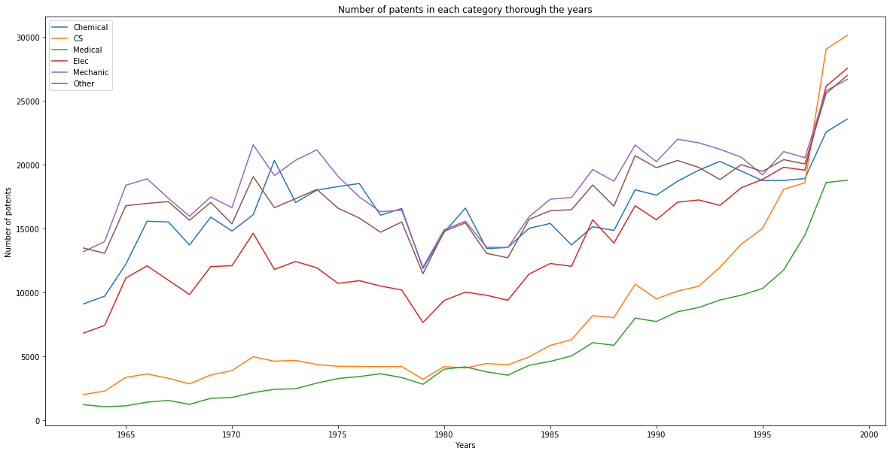

So according to the graph above the most popular technology field from 1965 to 2000 was Mechanics. In general every technology field's line follow similar pattern except Computer Science and Medical Science, which increased dramatically over the 40 years. Interestengly, there is noticeable gap in 1979 in all fields. In general, we can say electronics and mechanics are popular fields but Computer science is the most trending field and have tendency to become the most popular field since 2000.

* **What's the most frequent technology field by inventor's country?**

In this section, we are interested in most frequent technology field by inventor's country.

Since there are so many countries, It would be not very informative to analyze each countries. Thus we will focus on 5 countries with highest number of patents in total.

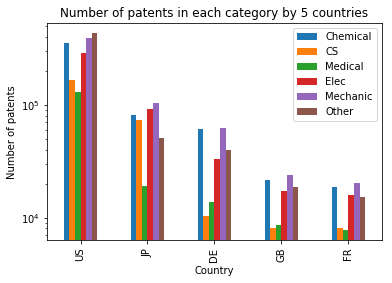

The graph above shows interesting relation, which is computer science inventors from US and Japan are much more higher than that of other countries. And also, these 2 countries have more inventors than any other countries. Other than that this bar plot shows similar trend with previos section's results.

### Patent citations

One part of this dataset is a network(graph) dataset, so will focus now a little bit on it. We will try to analyse patent citations and answer some questions. 

First let's try to visualize the dataset. Because the graph dataset is too large with more then 3 million nodes and more then 16 million edges, we will show just one small part of it. 

The next graph is showing Swiss patents from year 1998 which are cited by patents granted in United States.

<head><meta charset="utf-8" />
<meta charset="utf-8">
  <meta property="og:image" content="http://romsson.github.io/dragit/img/nations.png"/>
  <meta name="twitter:card" content="photo">
  <meta name="twitter:site" content="@romsson">
  <meta name="twitter:creator" content="@romsson">
  <meta name="twitter:title" content="A Re-Recreation of Gapminder’s Wealth & Health of Nations - Romain Vuillemot">
  <meta name="twitter:image:src" content="http://romsson.github.io/dragit/img/nations.png"/>
  <meta name="twitter:domain" content="http://romsson.github.io/dragit/">
  <title>A Re-Recreation of Gapminder’s Wealth & Health of Nations - Romain Vuillemot</title>
  <meta name="description" content="Drag & Drop World Countries (if you can)">
  <link href="dragit.css" rel="stylesheet"/>
  
  
<title>graph2</title>

<!-- Loading mathjax macro -->
<!-- Load mathjax -->
    
    <!-- MathJax configuration -->
    
    <!-- End of mathjax configuration --></head>
<body>
  

    

    

  

</body>

* **Are the citations made and the citations received increasing with passing of the years?**

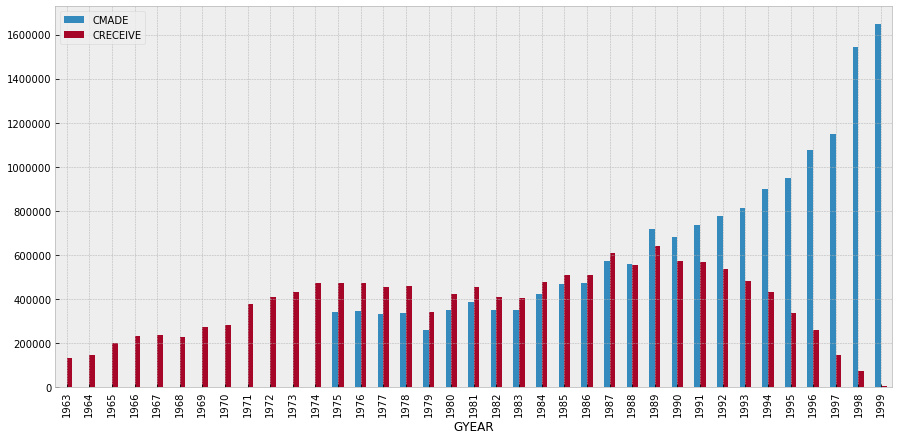

We can see that the citations made are missing for years before 1975. The citations received decrease linearly the last 10 years, this makes sense because a new patent is less likely to have many citations.

So far we showed the absolute numbers, but would make more sense to analyse for each year the citations relative to the total number of patents granted in that year.

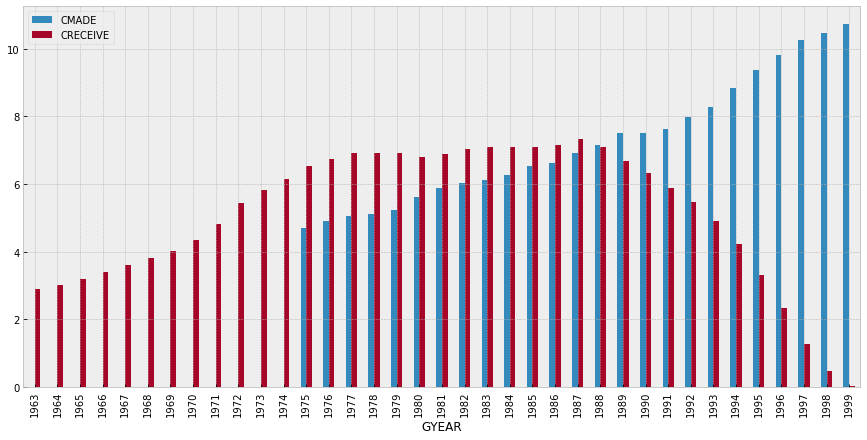

We can still notice an increase in the citations both made and received over time, probably because of the globalization and the world wide web, which made easier to access information from all over the world.
The citations received 

* **How does the number of citations relate to the category of the patent?**

We use the variable "CAT", which inform about the macro category of the patent. There are 6 classes:

    Chemical
    CS
    Medical
    Elec
    Mechanic
    Other

The category "other" includes Textile, Heating, Food and other miscellaneous.

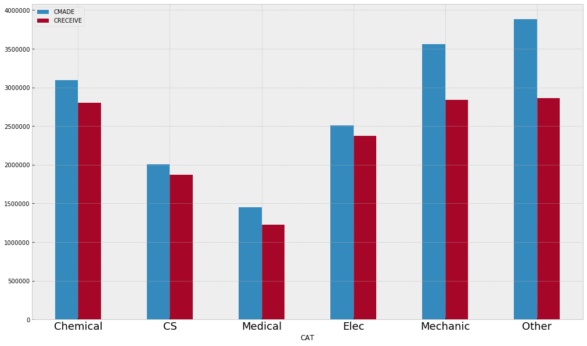

As before, for a more meaningful visualization is better to divide for the total number of patents that a category has.

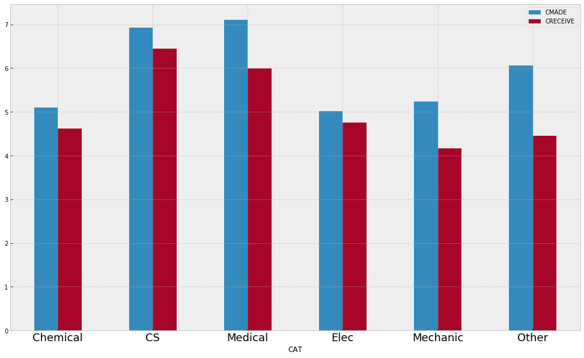

The bar plot shows that patents in Computer Science and Medicine are more cited and make more citations as well. The citations received are always less for the contribute of the novel patents that we showed before.

* **Displaying citations flows among categories of patents over time**

#todo: plot

## The impact criteria

   The number of patents and their quality is important index of country's innovation and economic growth. However, according to our dataset, the total number of patents granted by only US Patent and Trademark Office (USPTO) from 1963 to 1999 is almost 3 million. In other words, over 200 patents were granted per day, and it's increasing over time. Such exponential growth raises important questions like "How can one measure patent's quality", "How to distinguish high quality patents" and "Is it possible to predict, if patent is good or bad". By answering to those questions, both researchers and business companies can benefit and save huge amount of assets and time.

   In this section, we will try to measure both economical and academic impacts of each patents and try to find if there is any correlation or interesting relationship between them. In order to do that, we have used NBER patents dataset and fortune rankings list from 1963 to 1999

### Defining Academic Impact

According to the https://www.nap.edu/read/5976/chapter/7, the number of patents issued and the technical and scientific literature citations on the patents can be used to develop quantitative measures of innovative output and science-technology linkages. Thus, to measure academic impact of each patent, we have used number of citations it has recieved using citations dataset. Even though our citation dataset contains only informations related from 1975 to 1999, there is over 16 millioin citation relationships between patents.

The number of citations each patent recieved isn't good method to evaluate academic impact. Because, the patent which influenced another patent which has recieved huge amount of citations, might have bigger impact, but number of citations alone can't represent such cases. So, we have measured second layer of citations, which is the number of citations of each citing patents recieved for given patent.

<table border="1" class="dataframe">
  <thead>
    <tr style="text-align: right;">
      <th></th>
      <th>first</th>
      <th>second</th>
    </tr>
    <tr>
      <th>id</th>
      <th></th>
      <th></th>
    </tr>
  </thead>
  <tbody>
    <tr>
      <th>1</th>
      <td>2</td>
      <td>3.0</td>
    </tr>
    <tr>
      <th>13</th>
      <td>2</td>
      <td>2.0</td>
    </tr>
    <tr>
      <th>24</th>
      <td>1</td>
      <td>1.0</td>
    </tr>
    <tr>
      <th>29</th>
      <td>1</td>
      <td>5.0</td>
    </tr>
    <tr>
      <th>31</th>
      <td>2</td>
      <td>3.0</td>
    </tr>
  </tbody>
</table>

The table above is the final result of our method.

* **What features influence on academic qualities of patents?**
In order to answer this question, we have used Pearson Correlation Coefficient with 2 columns of "academic" dataset and 23 features in patents dataset. This coefficient will tell us is there linear relationship between 2 series, and if yes is it negative or positive. https://en.wikipedia.org/wiki/Pearson_correlation_coefficient . 

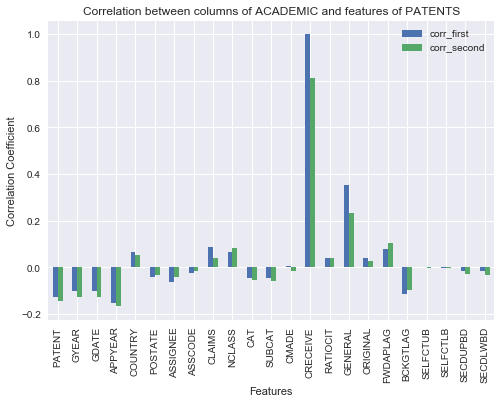

According to the graph the academic impact of each patents are decreasing as time passes, which can be explained by increasing number of patents in each year. As expected, the CRECIEVE feature, which is number of citations recieved has highest correllation. But also note that it's value is 0.811 with second column of ACADEMIC dataset. And also, the generality which is measurement of how much scientific area does patent cover, has quite high correlation. In other words, the patents which covers wide area, have that much influence academically.

### Defining Economic Impact

The dataset provided by NBER doesn't have any information related to economy except the company names of each patents are assigned to. Thus, in this section, we have scraped Fortune magazine's rankings of top 500 companies in US over 1963 to 1999, with their revenues and profits in million (http://archive.fortune.com/magazines/fortune/fortune500_archive/full/). By combining these 2 datasets, we can get patents information of each company owns and their economic measurements for given year.

<table border="1" class="dataframe">
  <thead>
    <tr style="text-align: right;">
      <th></th>
      <th>company</th>
      <th>profit</th>
      <th>rank</th>
      <th>revenue</th>
      <th>year</th>
    </tr>
    <tr>
      <th>id</th>
      <th></th>
      <th></th>
      <th></th>
      <th></th>
      <th></th>
    </tr>
  </thead>
  <tbody>
    <tr>
      <th>1</th>
      <td>General Motors</td>
      <td>1459.1</td>
      <td>1</td>
      <td>14640.2</td>
      <td>1963</td>
    </tr>
    <tr>
      <th>2</th>
      <td>Exxon Mobil</td>
      <td>840.9</td>
      <td>2</td>
      <td>9536.9</td>
      <td>1963</td>
    </tr>
    <tr>
      <th>3</th>
      <td>Ford Motor</td>
      <td>480.7</td>
      <td>3</td>
      <td>8089.6</td>
      <td>1963</td>
    </tr>
    <tr>
      <th>4</th>
      <td>General Electric</td>
      <td>265.8</td>
      <td>4</td>
      <td>4792.7</td>
      <td>1963</td>
    </tr>
    <tr>
      <th>5</th>
      <td>Mobil</td>
      <td>242.3</td>
      <td>5</td>
      <td>3933.3</td>
      <td>1963</td>
    </tr>
  </tbody>
</table>

The table above shows top 5 companies in US over 1963 to 1999.

We checked how much patents these top companies own and surprisingly almost 17% of the total patents is owned by only 1564 top groups. Moreover, it is only 3% of the companies that were mentioned in the PATENTS dataset.

### What features influence on economic impact of patents?
In order to answer this question, we have used the similar method as academic.

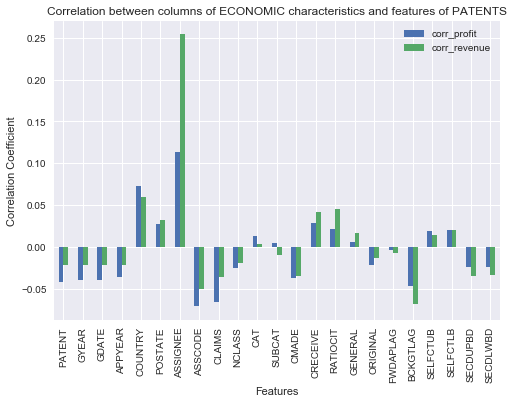

Obviously, the Assignee id has the highest correlation with revenues and profits. For the features related to time, we can see the same relationship with Academic correlations. Which also can be explained increasing number of patents. However, the inventor's country plays big impact on economic impact, which is different from academics. And also, the number of claims each patent has negative influence on economics, while it was opposite in academics. But we can see interesting results in citation related features. For example, the number of citations made and originality of patent influence negatively in economy. And citations recieved has some degree of correlation (0.045).

### The Comparison between Academic and Economic impacts
Now, since we have evaluated quantative measurements of both academic and economical impacts, let's see their relationships. To do so, we first calculated total number of citations of each company's patents has and the compared it with it's revenue and profits using pair plot and correlation matrix

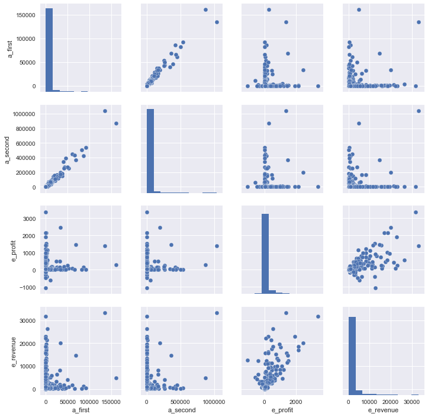

The highest relation between academic and economic feature was shown in "second" in ACADEMIC and company's revenues. However, the correlation is still low and it might seem there is no correlation between academic and economic impact. But note that, this analysis is time independent and we have no knowledge about citations of patents that companies already had before 1975.

### The Comparison between Academic and Economic impacts with TIME

In this section, we are dividing the previous analysis on each year. Note that instead of number of citations of each year, we took cumulative sum. The reason is, we also have to take account that given company has already owned previous patents, influencing company's success. And also, we have used column "second" in ACADEMIC dataset for measuring academic impact, since it has considerably large correlation with "first" column.

<title>A Re-Recreation of Gapminder’s Wealth & Health of Nations - Romain Vuillemot</title>

<body>
  <h1>Relationship between academic and economical impact of patents</h1>
  

  

    <table id="more_info">
      <tr>
        <th>Name</th>
        <th>Value</th>
      </tr>
      <tr>
        <td>Company Name</td>
        <td></td>
      </tr>
      <tr>
        <td>Number of patents</td>
        <td></td>
      </tr>
      <tr>
        <td>Number of citations</td>
        <td></td>
      </tr>
      <tr>
        <td>Company revenue</td>
        <td></td>
      </tr>
      <tr>
        <td>Company main field</td>
        <td></td>
      </tr>
    </table>
  

  

    

    1975 
    <input type="range" name="points" min="0" max="24" step="1" value="0" id="slider-time" style="width:900px">
    1999
  

</body>

 

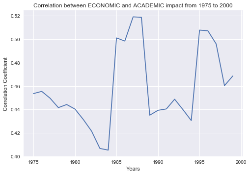

In general the correlation now is pretty high and showing clear evidence that ACADEMIC impact indead influence on ECONOMY. But interestengly, this graph might be inferring some historical events. For example around early 1980, there was global economical recession happened and it was ended around 1984. And also, through 1989 to 1991, due to inconvenient government policy economical recession happened. However the 1990 to 2000 is considered the golden years of US economy and in 1994 the number of jobs created were peaked. https://en.wikipedia.org/wiki/1990s_United_States_boom, https://en.wikipedia.org/wiki/List_of_recessions_in_the_United_States. Even though it is tempting to say that economic and academic relationship is somehow related to nations economical state and policy, further research and expertise are needed.

### Can we predict Academic and Impact?
According to the correlation analysis on these two impact, the features provided to us is not sufficient for building reliable prediction model. But we are trying it anyway. To predict how many citations do patents can have we have used Random Forest Regression for our model and mean absolute error to evaluate our model.

### Citation lag
The forward lags focus on the time difference between the application or grant year of the cited patent, and that of the citing patents. And thus, we can measure probability of recieving citation since the grant.

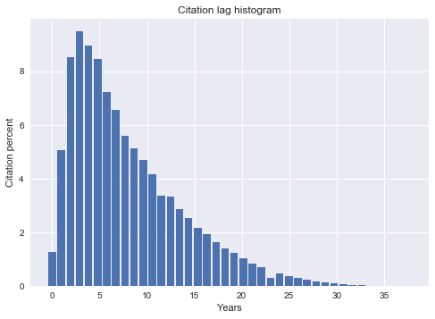

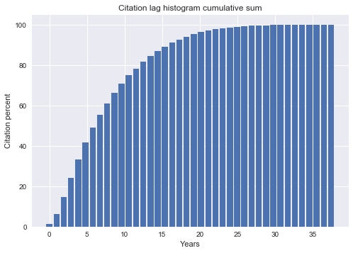

According to our graph, almost 40 % of the total citations were made within 5 years since the grant, and 80 % after 13 years.

*Conclusion*

With this work we first analysed almost 3 million patents granted in US from 1963 to 1999, their citations from 1975 to 1999 and then tried to answer questions relating to their impacts. 

From patent and citation analysis, we have reached following conclusions:
1. Number of patents increasing exponentially
2. Japan, Germany and some European country’s companies own high number of US patents
3. Computer Science and Medical fields has grown significantly
4. Most of the citations are made 5 years after the grant etc.

For the final part, since patents can have both economical and academical impact, we studied both impacts and their relationship. The academic impact can be measured by number of citations each patents received, but we couldn’t measure economical one with NBER data only. Thus we have scrapped Fortune 500 rankings from 1963 to 1999, and used each company’s economical characteristics. Once, we defined a way to evaluate impact, we have analysed correlation between each given features of patent. We observed some interesting relations, but our result implies our given features are not enough for building prediction model. However, there is positive relationship between academic and economic impacts.
